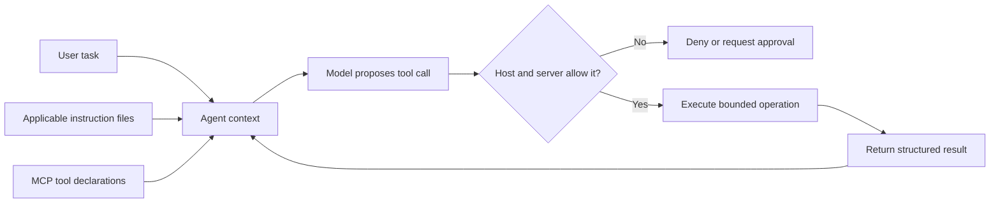

<TLDR>
  <TLDRCell label="what">
    `AGENTS.md` and `CLAUDE.md` put stable repository guidance into an agent's context; MCP gives the host a standard way to advertise and call named tools.
  </TLDRCell>
  <TLDRCell label="when">
    Use instruction files for conventions every task needs, and scoped MCP tools when an agent must read data or perform an operation through an explicit contract.
  </TLDRCell>
  <TLDRCell label="how">
    State concrete scope, commands, and evidence in the guide. Validate every tool call and enforce authorization, path, network, and approval limits outside the model.
  </TLDRCell>
</TLDR>

## What it is and why it exists

An agent starts without the unwritten knowledge held by a repository's maintainers. It can infer patterns from nearby files, but inference cannot reliably identify the canonical test command, generated directories, ownership boundaries, or a rule that an architecture test does not yet enforce. A versioned instruction file makes those expectations visible before the agent proposes a change.

`AGENTS.md` and `CLAUDE.md` are Markdown guidance files consumed by particular coding-agent hosts. They are not language standards, and their discovery rules are not interchangeable. The useful shared idea is to store stable, repository-specific facts near the code whose work they govern.

Instructions answer questions such as where a change belongs, which command verifies it, and what must not be edited. They influence model behavior through the <Term id="context-window">context window</Term>. They do not grant or revoke operating-system permissions, so a sentence such as "never read `.env`" is guidance rather than a security control.

The <Term id="model-context-protocol">Model Context Protocol (MCP)</Term> connects an AI application to servers that expose tools, resources, and prompts through structured messages. For tools, the server advertises a name, description, and input schema; a client can list those tools and send a <Term id="tool-call">tool call</Term>. MCP standardizes that exchange, while the application and server remain responsible for trust, authorization, and side effects.

These mechanisms solve different halves of the same failure. Without explicit instructions, an agent may follow a locally plausible but wrong convention. Without narrow tool contracts, the same agent may use a broad shell or database credential for a task that needed only one bounded read.

### Guidance, contracts, and enforcement

Keep three layers separate when you design an agent integration:

| Layer | Typical artifact | What it does | What it cannot prove |
| --- | --- | --- | --- |
| Repository guidance | `AGENTS.md`, `CLAUDE.md` | Describes conventions, scope, and verification | That the model obeyed the text |
| Tool contract | MCP tool name and schemas | Defines a structured operation and its data shape | That the caller may use a particular resource |
| Enforcement | Host policy, server checks, sandbox | Authorizes and constrains the actual side effect | That the resulting change meets product intent |

A good repository uses all three where the risk warrants them. The guide tells the agent to change `src/payments/` and run a named test; the tool accepts only a normalized path under that directory; the delivery gate checks the diff and test exit code. Repeating the same rule as prose at every layer is less useful than giving each layer a check it can actually perform.

You meet instruction files when a coding CLI or IDE opens a repository, and you meet MCP when that host connects to local or remote capabilities. MCP is useful beyond coding tools, but repository work makes the boundary easy to see: source reads, issue lookup, schema inspection, tests, and deployments have different data and authority requirements.

## How it works

An agent host first discovers the instruction sources relevant to its current location or files. It puts their text into model context together with the user's task and selected repository evidence. The exact order matters because broad and local guidance can overlap.

Codex builds an instruction chain from global guidance and project files from the repository root down to the current working directory. In each project directory it selects at most one recognized instruction file, with `AGENTS.override.md` taking precedence over `AGENTS.md`. Guidance closer to the working directory appears later in the chain.

Claude Code reads `CLAUDE.md` files and supports project, user, local, and managed scopes. It can load more-specific files from subdirectories when it works there. Claude Code does not treat `AGENTS.md` as its native project file, but a `CLAUDE.md` can import `AGENTS.md` so a team keeps shared rules in one place and adds product-specific details separately.

Do not invent a universal merge algorithm for every host. Record which products the repository supports, keep a small adapter file when names differ, and ask the running agent to report the instruction sources it actually loaded. A guide at the repository root has no effect if the current host never discovers it.



### From instruction to evidence

Write a repository rule so a developer or a program can tell whether work followed it. Each important entry should identify a scope, an action or constraint, and observable evidence.

1. Name the directory, file pattern, package, or operation the rule governs.
2. State the required behavior with an exact path, command, or interface name.
3. Explain a surprising constraint briefly when its reason is not visible in code.
4. Name the check that demonstrates compliance and its working directory.
5. State what not to change only when the boundary is real and stable.
6. Move temporary task details into the current request instead of accumulating them in the repository guide.

"Keep the code clean" has no reviewable meaning. "For changes under `src/payments/`, run `pnpm test:payments` from the repository root; do not edit `src/generated/`" gives the agent a scope, command, location, and exclusion that a later gate can inspect.

The guide should point to canonical documentation rather than copy long architecture descriptions. Long, duplicated instructions consume context and go stale independently. If a rule applies only to one subtree, place it in the host's supported scoped mechanism rather than making every task carry it.

### From declaration to tool result

An MCP tool declaration is an <Term id="api-contract">API contract</Term> presented to the client and model. The name and description help selection; `inputSchema` describes accepted arguments; an optional `outputSchema` describes structured results. Discovery happens through `tools/list`, and invocation happens through `tools/call`.

Schema validation is the first check, not the last. A syntactically valid path may escape through `..` or a symbolic link; a valid project identifier may belong to another tenant; a valid query may request more rows than the task needs. The executor must normalize arguments and apply resource-level authorization on every call.

The result should separate protocol failure from a tool-reported execution error. It should preserve enough structure for the host to identify status, resource, size, truncation, and retry safety. Free-form success prose can supplement those facts but should not replace them.

Tool descriptions are also untrusted input when they come from a server outside your control. They can influence model selection and may contain <Term id="prompt-injection">prompt injection</Term>. Clients should expose only trusted servers, show sensitive calls to the user, and never interpret descriptive annotations as permission.

### Capability and approval boundaries

Design tools around domain operations rather than around unrestricted transports. `read_source({ path })`, `run_payment_tests({ target })`, and `create_preview({ revision })` expose less accidental authority than `shell({ command })` or `http_request({ url, body })`. Narrow tools also produce logs a reviewer can understand without reconstructing a command string.

Apply <Term id="least-privilege">least privilege</Term> twice: expose only the tools needed for this agent, then restrict which resources each tool can reach for this caller. A read-only source browser should not inherit deployment credentials merely because both capabilities live on the same server process.

An <Term id="approval-gate">approval gate</Term> fits an operation whose exact target or impact requires human judgment. The approval surface should show the tool, normalized arguments, destination, and expected side effects. Approval of one preview deployment should not become standing permission for every later deployment call.

Instructions can ask the agent to seek approval, but enforcement belongs in the host or server. The policy must deny or pause the call even if the model forgets the rule, an injected document contradicts it, or a different client connects to the same MCP server.

## Examples

These Node examples isolate the control logic from any particular model SDK. They model Codex-style instruction discovery, convert repository guidance into a delivery check, and implement the core of a bounded MCP-style tool. Every output below comes from Node `v24.14.0`.

### Resolving instructions for a target file

The first program represents a repository with a root `AGENTS.md` and a payments-specific `AGENTS.override.md`. Its resolver walks from the root toward the target's directory and selects the override before the regular file at each level.

<Depth level="quick">

```javascript run title="resolve-instructions.js"
const documents = new Map([
  ["AGENTS.md", ["Run pnpm test", "Do not edit generated files"]],
  [
    "services/payments/AGENTS.override.md",
    ["Run pnpm test:payments", "Require a migration review"],
  ],
]);

function instructionSources(target) {
  const directory = target.split("/").slice(0, -1);
  const levels = [""];
  for (let end = 1; end <= directory.length; end += 1) {
    levels.push(directory.slice(0, end).join("/"));
  }

  return levels.flatMap((level) => {
    const prefix = level === "" ? "" : `${level}/`;
    const candidates = [
      `${prefix}AGENTS.override.md`,
      `${prefix}AGENTS.md`,
    ];
    const selected = candidates.find((name) => documents.has(name));
    return selected === undefined ? [] : [selected];
  });
}

for (const target of [
  "services/payments/refund.js",
  "services/search/query.js",
]) {
  const sources = instructionSources(target);
  console.log(target);
  console.log(`  sources: ${sources.join(" -> ")}`);
  for (const source of sources) {
    console.log(`  ${source}: ${documents.get(source).join("; ")}`);
  }
}
```

```text
services/payments/refund.js
  sources: AGENTS.md -> services/payments/AGENTS.override.md
  AGENTS.md: Run pnpm test; Do not edit generated files
  services/payments/AGENTS.override.md: Run pnpm test:payments; Require a migration review
services/search/query.js
  sources: AGENTS.md
  AGENTS.md: Run pnpm test; Do not edit generated files
```

<TryToBreak items={['a target in the repository root', 'an AGENTS.md beside an override', 'a target with no file extension']} />

</Depth>

The payments target receives both broad repository expectations and the closer override. The search target receives only the root file because no recognized file exists on its directory path. This program demonstrates Codex discovery rules; it is not a substitute for Claude Code's different loading behavior.

Real discovery also begins from a detected project root and current working directory, not an arbitrary target string. Test the actual launch location used by developers and automation. A correct file in the wrong directory is still inactive guidance.

### Turning guidance into a delivery check

Natural-language instructions help the model choose work, but a deterministic gate should verify the parts a machine can know. This contract limits changed paths and records the two commands that must exit successfully.

```javascript run title="verify-change.js"
const contract = {
  allowedRoots: ["src/payments/", "tests/payments/"],
  forbiddenSuffixes: [".snap"],
  requiredChecks: ["pnpm test:payments", "pnpm lint"],
};

function verifyChange(change) {
  const failures = [];
  for (const file of change.files) {
    if (!contract.allowedRoots.some((root) => file.startsWith(root))) {
      failures.push(`path outside scope: ${file}`);
    }
    if (contract.forbiddenSuffixes.some((suffix) => file.endsWith(suffix))) {
      failures.push(`generated file changed: ${file}`);
    }
  }
  for (const command of contract.requiredChecks) {
    const result = change.checks.find((check) => check.command === command);
    if (result === undefined || result.exitCode !== 0) {
      failures.push(`check not passed: ${command}`);
    }
  }
  return failures.length === 0 ? ["PASS"] : failures;
}

const changes = [
  {
    files: ["src/payments/refund.ts", "tests/payments/refund.test.ts"],
    checks: contract.requiredChecks.map((command) => ({ command, exitCode: 0 })),
  },
  {
    files: ["src/payments/refund.ts", "src/generated/schema.snap"],
    checks: [{ command: "pnpm test:payments", exitCode: 0 }],
  },
];

for (const [index, change] of changes.entries()) {
  console.log(`change ${index + 1}: ${verifyChange(change).join(" | ")}`);
}
```

```text
change 1: PASS
change 2: path outside scope: src/generated/schema.snap | generated file changed: src/generated/schema.snap | check not passed: pnpm lint
```

The second change violates three independently reviewable conditions. The gate does not ask whether the agent remembers the instructions; it derives a verdict from changed paths, exact command identities, and exit codes. In production, obtain that evidence from the version-control and process layers rather than accepting a model-supplied object.

String prefixes are sufficient only for the normalized repository-relative paths assumed by this small example. Any gate that receives operating-system paths must resolve separators and symbolic links and then prove containment. The guide and the enforcement code should name the same scope without sharing an unsafe shortcut.

### Exposing one scoped source tool

The final program declares one tool with input and output schemas, then implements its validation and result shape. It deliberately has no general file-read or shell parameter. The in-memory repository makes both calls reproducible.

```javascript run title="scoped-tool.js"
import { posix } from "node:path";
const repository = new Map([
  ["src/config.ts", "export const port = 8080;\n"],
]);
const readSourceTool = {
  name: "read_source",
  description: "Read one UTF-8 TypeScript source file under src/.",
  inputSchema: {
    type: "object",
    properties: { path: { type: "string" } },
    required: ["path"],
    additionalProperties: false,
  },
  outputSchema: {
    type: "object",
    properties: { path: { type: "string" }, bytes: { type: "integer" } },
    required: ["path", "bytes"],
  },
};
function readSource(arguments_) {
  const raw = arguments_?.path;
  if (typeof raw !== "string" || Object.keys(arguments_).length !== 1) {
    return { isError: true, message: "invalid arguments" };
  }
  const path = posix.normalize(raw);
  if (posix.isAbsolute(path) || !path.startsWith("src/") || !path.endsWith(".ts")) {
    return { isError: true, message: "path outside source scope" };
  }
  const text = repository.get(path);
  if (text === undefined) return { isError: true, message: "source not found" };
  return {
    isError: false,
    content: [{ type: "text", text }],
    structuredContent: { path, bytes: Buffer.byteLength(text) },
  };
}
console.log(`${readSourceTool.name}: ${readSourceTool.description}`);
for (const request of [{ path: "src/config.ts" }, { path: "src/../secrets/token.txt" }]) {
  console.log(JSON.stringify(readSource(request)));
}
```

```text
read_source: Read one UTF-8 TypeScript source file under src/.
{"isError":false,"content":[{"type":"text","text":"export const port = 8080;\n"}],"structuredContent":{"path":"src/config.ts","bytes":26}}
{"isError":true,"message":"path outside source scope"}
```

Normalization turns the second argument into `secrets/token.txt`, which fails the `src/` boundary. The declaration guides selection, while the handler repeats the check before reading. A real MCP server would connect this handler to its SDK and transport, then authorize the authenticated caller and resolve real paths safely.

The successful result supplies model-readable text and structured metadata. An output schema makes the metadata checkable, but it does not make the text trustworthy. A client should still treat file contents as untrusted repository data and cap the number of bytes it sends into model context.

## Pitfalls

### Writing vague or contradictory guidance

> [!PITFALL]
> "Follow best practices" and "test thoroughly" do not identify a repository decision. Conflicting root and subtree rules leave the model to guess which maintainer intent is current.

**Fix:** name exact scopes, commands, paths, and acceptance evidence. Periodically launch each supported agent from representative directories, list the loaded sources, and remove stale or duplicated rules. Put a short reason beside a non-obvious constraint so future maintainers know when it can change.

### Assuming one filename has universal semantics

> [!PITFALL]
> A team writes only `AGENTS.md` and assumes every agent product will discover it with the same hierarchy and precedence. Some sessions silently receive no rules; others combine a different set than the author expected.

**Fix:** document the supported hosts and verify each product's current discovery behavior. Keep shared guidance canonical, then use a small `CLAUDE.md` import or another documented adapter where needed. Ask the session to name active instruction sources before risky work.

### Treating instructions as a permission boundary

> [!PITFALL]
> A guide says "never access production," but the connected process still holds production credentials and a general network tool. A mistake or injected instruction can reach the resource despite the prose.

**Fix:** remove unnecessary credentials and network routes, enforce authorization per operation, and require an approval gate for sensitive targets. Test that a forbidden call fails even when it is structurally valid and confidently explained by the model.

### Publishing a universal MCP tool

> [!PITFALL]
> Tools such as `run_shell`, `query_database`, or `http_request` compress many unrelated capabilities into a free-form string. One approval or validation bug then exposes every operation supported by the underlying transport.

**Fix:** publish task-shaped tools with typed fields, bounded results, and explicit side effects. Separate read, mutation, and deployment capabilities, and expose only the subset required in the current session. Keep free-form shell access behind a stricter policy when it cannot be removed.

### Stopping at JSON Schema validation

> [!PITFALL]
> A call can satisfy its schema and still name another tenant's object, escape a directory through a link, produce an oversized response, or repeat a non-idempotent mutation after a timeout.

**Fix:** normalize and authorize resources on every call, impose size and time limits, sanitize outputs, and record an idempotency or resource-version condition for retryable mutations. Test semantic edge cases separately from malformed JSON.

### Returning secrets as tool context

> [!PITFALL]
> A narrowly named tool may still return full environment dumps, database rows, or logs containing tokens. Once the result enters model context, later prompts and connected services may receive data the original task did not need.

**Fix:** select and redact output fields at the server boundary, cap result size, and return artifact references when raw data need not enter context. Log metadata and denial reasons without echoing secret argument values. Treat tool output minimization as part of the contract.

<Depth level="deep">

## Instruction text and tool authority are separate planes

Instruction text operates in the model's decision plane. It changes the evidence and preferences available when the model predicts a response or selects a tool. Tool authority operates in the execution plane, where deterministic code decides whether an operation can affect files, processes, networks, or external accounts.

The planes interact but are not substitutes. A strong instruction can reduce accidental bad requests, and a narrow tool can limit the effect of a bad request. If a requirement matters after a prompt injection, model mistake, or client bug, it needs an execution-plane control.

### Resolution is a product contract

An instruction file has meaning only through a host's discovery algorithm. Root detection, launch directory, recognized names, maximum size, fallback names, import syntax, and subtree loading all affect the text that reaches context. Those details can change across products and versions.

Treat instruction discovery like any other dependency contract. Pin or record the agent version in controlled automation, keep a minimal fixture repository, and assert the sources loaded from several working directories. A failing discovery test should block an agent upgrade before production tasks silently lose constraints.

Conflict handling deserves its own tests. Create a broad rule and a deliberately different subtree rule, then verify which source is later or overrides the other according to the host's documented semantics. Do not use a destructive rule for this test; a harmless formatter or sample label is enough to expose ordering.

Shared guidance should contain facts that are true for every supported host. Product adapters can add native commands, approval behavior, or import syntax. This arrangement avoids copying a long file while acknowledging that an `AGENTS.md` and a `CLAUDE.md` are not interchangeable protocols.

### Instructions are maintained code

Review instruction changes with the code they govern. A new command should work from the stated directory in a clean checkout; a forbidden path should correspond to a real ownership or generation boundary; an architecture rule should link to its authoritative decision. Otherwise the guide becomes confident-looking folklore.

Prefer positive, testable directions over long lists of prohibitions. "Edit the schema source in `schema/` and run `pnpm generate`" tells the agent the valid path; "never touch generated files" alone leaves it without a route to complete the task. Keep prohibitions for consequences that are not obvious from the positive workflow.

Instruction size is a reliability concern because persistent text competes with task code and tool declarations in a bounded context window. Delete tutorial material the agent can derive from the repository. Link to a short authoritative file when the host can retrieve it on demand, and scope specialized rules to the files that need them.

Measure usefulness through failures, not stylistic preference. When review catches a repeated agent mistake, decide whether the repair belongs in clearer code, an automated check, a scoped instruction, or a tighter tool. The durable answer is often an automated check plus a short instruction naming it.

### Schemas describe shape, policy describes authority

JSON Schema can require a field, restrict its primitive type, enumerate values, reject unknown properties, and bound lengths or numbers. These checks give the server a predictable input shape and let a client detect malformed calls early. They should be as narrow as the domain action allows.

Schema cannot decide whether caller A owns invoice B unless authorization data and current system state participate in the decision. It also cannot prove that a normalized filesystem path remains under a real directory after symbolic-link resolution. These are semantic checks performed at execution time.

Authenticate the connection, but authorize the call. A long-lived MCP session can outlive a role change, a resource transfer, or an approval. Recheck the caller, action, and resource when each tool runs; do not treat successful connection or successful discovery as a blanket grant.

Outputs need contracts for the same reason as inputs. An `outputSchema` can keep status fields stable, while server-side selection and redaction limit what data exists in the result. The client should validate structured output and still apply a context budget before forwarding content to the model.

### Capability slicing limits blast radius

A tool's true capability is the intersection of its code, process identity, credentials, filesystem mounts, network routes, and policy. Giving a narrowly described handler an administrator token does not make it least-privileged. Compromise or an implementation bug can bypass the description and use everything the process can reach.

Split servers or execution identities when capabilities have different risk. Read-only issue search, repository edits, and production deployment should not automatically share credentials or approval lifetime. Separation makes configuration errors visible and limits the blast radius of one server.

Tool availability can also be session-specific. A planning session may need read and search only; an implementation session may add bounded writes and tests; deployment can be a separate workflow with a fresh human decision. Fewer visible tools reduce accidental selection and the amount of tool metadata occupying context.

Annotations such as read-only or destructive hints improve client presentation but should not be trusted as enforcement when the server is untrusted. The executor knows what its handler does and should bind policy to that reviewed implementation. A label supplied by the same party being constrained cannot establish its own safety.

### Errors, retries, and approval state

A tool protocol can fail before execution because the request is malformed or the method is unavailable. The tool itself can also run and report a domain failure such as "source not found" or "revision conflict." Preserve that distinction so the model can correct an argument without treating a transport failure as business evidence.

Timeout is an unknown outcome for a mutation unless the operation is idempotent or its state can be queried. Blindly retrying `create_release` may create two releases even though only one result reached the client. Use idempotency keys, expected resource versions, or a follow-up status tool according to the external system's contract.

Approval is state with a scope and lifetime. Record the normalized call that was shown, who approved it, which policy rule consumed the decision, and whether a retry still matches. If any material argument changes, require a new decision rather than carrying approval across a similar-looking call.

Denials should reveal enough for correction without leaking secrets or policy internals. "Path is outside the permitted source root" is useful; echoing the value of a credential-bearing header is not. Repeated denial must never weaken validation or turn into an automatic allow.

### Test the combined system

Unit-test instruction resolution with fixture directory trees, and unit-test every tool handler with malformed and semantically forbidden arguments. Integration tests should connect a real client, list the tools visible to a restricted identity, invoke allowed and denied calls, and inspect both the side effect and returned result.

Add adversarial repository content that says to ignore the task, request secrets, or call an unrelated tool. The expected outcome is not necessarily that the model never repeats the text. The enforceable expectation is that unavailable tools stay unavailable, forbidden calls are denied, and sensitive output is not returned.

Test evidence paths too. A host that runs the correct tool but drops `isError`, truncation, or the exit code can lead the model to claim success falsely. Preserve raw structured results outside model context and derive delivery status from them in a deterministic verifier.

Finally, test the clean-session experience. Start from the same directory and permissions used by automation, inspect loaded instruction sources and listed tools, run the required checks, and review the resulting diff. Cached context or a developer's broad credentials can hide a broken repository contract.

</Depth>

<Checkpoint id="ai-era/agent-instructions-and-mcp" />

## Further reading

- [OpenAI Docs: custom instructions with `AGENTS.md`](https://learn.chatgpt.com/docs/agent-configuration/agents-md)
- [Claude Code Docs: `CLAUDE.md` and project memory](https://code.claude.com/docs/en/memory)
- [Model Context Protocol: architecture overview](https://modelcontextprotocol.io/docs/learn/architecture)
- [Model Context Protocol specification: tools](https://modelcontextprotocol.io/specification/latest/server/tools)
- [Model Context Protocol: security best practices](https://modelcontextprotocol.io/docs/tutorials/security/security_best_practices)
