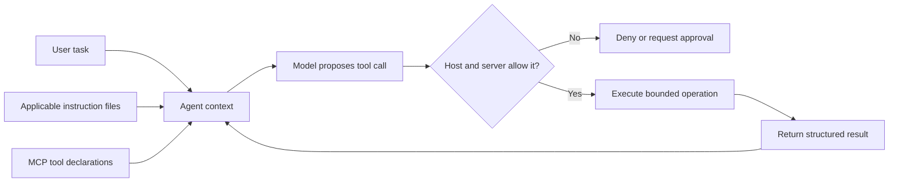

<TLDR>
  <TLDRCell label="what">
    `AGENTS.md`与`CLAUDE.md`把稳定的仓库指引放进智能体上下文；MCP则为宿主提供发布和调用具名工具的标准方式。
  </TLDRCell>
  <TLDRCell label="when">
    每项任务都需要的约定应写进指令文件；智能体需要读取数据或执行操作时，则通过明确契约提供受限MCP工具。
  </TLDRCell>
  <TLDRCell label="how">
    在指引中写明具体范围、命令与证据。每次工具调用都要验证，并在模型外强制限制授权、路径、网络与审批范围。
  </TLDRCell>
</TLDR>

## 是什么，为什么存在

智能体一开始并不知道仓库维护者默认掌握的隐性知识。它可以从附近文件推断模式，但无法可靠找出权威测试命令、生成目录、所有权边界，或尚未由架构测试强制执行的规则。版本化的指令文件能在智能体提出修改前展示这些要求。

`AGENTS.md`与`CLAUDE.md`是特定编程智能体宿主读取的Markdown指引文件。它们不是语言标准，发现规则也不能互换。二者共同的实用思想，是把稳定且针对仓库的事实放在受其约束的代码附近。

指令回答修改应放在哪里、由什么命令验证，以及哪些内容不能编辑。它们通过<Term id="context-window">上下文窗口（context window）</Term>影响模型行为，但不会授予或撤销操作系统权限。因此，“绝不读取`.env`”属于指引，而不是安全控制。

<Term id="model-context-protocol">模型上下文协议（Model Context Protocol，MCP）</Term>通过结构化消息，把AI应用连接到提供工具、资源和提示词的服务器。对于工具，服务器会发布名称、描述和输入模式；客户端可以列出这些工具并发送<Term id="tool-call">工具调用（tool call）</Term>。MCP标准化了这项交换，而信任、授权与副作用仍由应用和服务器负责。

这两种机制分别解决同一类故障的两半。没有明确指令时，智能体可能遵循局部看似合理、实际却错误的约定；没有严格工具契约时，同一个智能体又可能用宽泛的shell或数据库凭据，完成原本只需一次受限读取的任务。

### 指引、契约与强制控制

设计智能体集成时，应把三个层次分开：

| 层次 | 典型产物 | 作用 | 无法证明的事情 |
| --- | --- | --- | --- |
| 仓库指引 | `AGENTS.md`、`CLAUDE.md` | 描述约定、范围与验证方式 | 模型确实遵守了文字 |
| 工具契约 | MCP工具名称与模式 | 定义结构化操作及其数据形状 | 调用方有权使用某项具体资源 |
| 强制控制 | 宿主策略、服务器检查、沙箱 | 授权并限制实际副作用 | 最终修改满足产品意图 |

风险需要时，成熟的仓库会同时采用这三个层次。指引要求智能体修改`src/payments/`并运行指定测试；工具只接受该目录下的规范化路径；交付门再检查差异和测试退出码。与其在每层重复同一句规则，不如给每层安排它真正能够执行的检查。

编程CLI或IDE打开仓库时会遇到指令文件；宿主连接本地或远程能力时会遇到MCP。MCP不只适用于编程工具，但仓库工作能清楚展现边界：源码读取、Issue查询、模式检查、测试和部署各有不同的数据与权限要求。

## 工作原理

智能体宿主先发现与当前位置或文件有关的指令来源，再把文本连同用户任务和选定的仓库证据放进模型上下文。宽泛指引与局部指引可能重叠，因此顺序会影响结果。

Codex会从全局指引和项目文件构造指令链，并从仓库根目录向当前工作目录逐层读取。在每个项目目录中，它至多选择一个已识别的指令文件，且`AGENTS.override.md`优先于`AGENTS.md`。越靠近工作目录的指引在链中出现得越晚。

Claude Code读取`CLAUDE.md`，并支持项目、用户、本地与托管范围。它在处理子目录时可以加载其中更具体的文件。Claude Code不把`AGENTS.md`当作原生项目文件，但`CLAUDE.md`可以导入`AGENTS.md`，让团队集中维护共享规则，再单独添加产品专用内容。

不要为所有宿主臆造一套通用合并算法。仓库应记录支持哪些产品，在文件名不同时保留简短适配文件，并要求运行中的智能体报告实际加载的指令来源。如果当前宿主从未发现仓库根目录的指引，那么该文件内容再正确也不会生效。



### 从指令走向证据

仓库规则应写成开发者或程序都能判断是否遵守的形式。每条重要规则都应标明范围、操作或约束，以及可观察的证据。

1. 写明规则管理的目录、文件模式、软件包或操作。
2. 用确切路径、命令或接口名称说明所需行为。
3. 如果某项意外约束的原因在代码中不可见，应简短解释原因。
4. 写明用什么检查证明合规，以及从哪个工作目录执行。
5. 只有边界真实且稳定时，才说明哪些内容不能修改。
6. 临时任务细节应放进当前请求，不要不断堆积在仓库指引中。

“保持代码整洁”没有可审查的含义。“修改`src/payments/`时，从仓库根目录运行`pnpm test:payments`；不要编辑`src/generated/`”则给出了范围、命令、位置和排除项，之后的交付门可以逐项检查。

指引应指向权威文档，不要复制冗长的架构说明。又长又重复的指令会占用上下文，还会各自过期。只适用于一个子树的规则，应放进宿主支持的范围化机制，不必让每项任务都携带它。

### 从声明走向工具结果

MCP工具声明是展示给客户端和模型的<Term id="api-contract">API契约（API contract）</Term>。名称与描述帮助模型选择工具，`inputSchema`描述可接受参数，可选的`outputSchema`描述结构化结果。工具通过`tools/list`发现，通过`tools/call`调用。

模式验证是第一道检查，而不是最后一道。语法有效的路径仍可能通过`..`或符号链接逃逸；有效的项目标识符可能属于另一个租户；有效查询可能要求返回超出任务所需的行数。执行器必须规范化参数，并在每次调用时执行资源级授权。

结果应区分协议故障和工具报告的执行错误，还应保留足够结构，让宿主识别状态、资源、大小、截断情况以及能否安全重试。自由文本形式的成功说明可以补充这些事实，但不能取代它们。

来自不受控制服务器的工具描述同样是不可信输入。它们会影响模型选择，也可能包含<Term id="prompt-injection">提示词注入（prompt injection）</Term>。客户端应只接入可信服务器，向用户展示敏感调用，而且绝不能把描述性注解解释为权限。

### 能力与审批边界

工具应围绕领域操作设计，而不是暴露无限制的传输方式。`read_source({ path })`、`run_payment_tests({ target })`和`create_preview({ revision })`的意外权限小于`shell({ command })`或`http_request({ url, body })`。受限工具产生的日志也更容易审查，无需重新推导命令字符串的含义。

<Term id="least-privilege">最小权限原则（least privilege）</Term>要应用两次：先只向该智能体提供必要工具，再限制每项工具能为当前调用方访问哪些资源。只读源码浏览器不应仅仅因为和部署能力运行在同一服务器进程中，就继承部署凭据。

<Term id="approval-gate">审批门（approval gate）</Term>适合目标或影响需要人工判断的操作。审批界面应显示工具、规范化参数、目标和预期副作用。批准一次预览部署，不应变成之后每次部署调用的长期权限。

指令可以要求智能体先征求批准，但强制控制属于宿主或服务器。即使模型忘记规则、遭注入的文档与规则冲突，或另一个客户端连接到同一MCP服务器，策略仍必须拒绝或暂停调用。

## 示例

下面的Node示例把控制逻辑与具体模型SDK分离。它们依次模拟Codex风格的指令发现、把仓库指引转化为交付检查，并实现受限MCP风格工具的核心。所有输出都来自Node `v24.14.0`。

### 为目标文件解析指令

第一个程序表示一个含有根目录`AGENTS.md`和支付模块专用`AGENTS.override.md`的仓库。解析器从根目录向目标所在目录逐层遍历，并在每层优先选择覆盖文件。

<Depth level="quick">

```javascript run title="resolve-instructions.js"
const documents = new Map([
  ["AGENTS.md", ["Run pnpm test", "Do not edit generated files"]],
  [
    "services/payments/AGENTS.override.md",
    ["Run pnpm test:payments", "Require a migration review"],
  ],
]);

function instructionSources(target) {
  const directory = target.split("/").slice(0, -1);
  const levels = [""];
  for (let end = 1; end <= directory.length; end += 1) {
    levels.push(directory.slice(0, end).join("/"));
  }

  return levels.flatMap((level) => {
    const prefix = level === "" ? "" : `${level}/`;
    const candidates = [
      `${prefix}AGENTS.override.md`,
      `${prefix}AGENTS.md`,
    ];
    const selected = candidates.find((name) => documents.has(name));
    return selected === undefined ? [] : [selected];
  });
}

for (const target of [
  "services/payments/refund.js",
  "services/search/query.js",
]) {
  const sources = instructionSources(target);
  console.log(target);
  console.log(`  sources: ${sources.join(" -> ")}`);
  for (const source of sources) {
    console.log(`  ${source}: ${documents.get(source).join("; ")}`);
  }
}
```

```text
services/payments/refund.js
  sources: AGENTS.md -> services/payments/AGENTS.override.md
  AGENTS.md: Run pnpm test; Do not edit generated files
  services/payments/AGENTS.override.md: Run pnpm test:payments; Require a migration review
services/search/query.js
  sources: AGENTS.md
  AGENTS.md: Run pnpm test; Do not edit generated files
```

<TryToBreak items={['仓库根目录中的目标', '与覆盖文件并存的AGENTS.md', '没有扩展名的目标']} />

</Depth>

支付模块目标同时收到仓库级要求和更近的覆盖指令。搜索模块目标所在目录路径中没有其他已识别文件，因此只收到根目录指引。这个程序演示的是Codex发现规则，不能代替Claude Code不同的加载行为。

真实发现过程还会从检测到的项目根目录和当前工作目录开始，而不是接受任意目标字符串。应使用开发者与自动化真正采用的启动位置进行测试。内容正确但放错目录的文件，仍然是不生效的指引。

### 把指引变成交付检查

自然语言指令帮助模型选择工作方式，但机器能够判断的部分应交给确定性交付门验证。下面的契约限制修改路径，并记录必须成功退出的两条命令。

```javascript run title="verify-change.js"
const contract = {
  allowedRoots: ["src/payments/", "tests/payments/"],
  forbiddenSuffixes: [".snap"],
  requiredChecks: ["pnpm test:payments", "pnpm lint"],
};

function verifyChange(change) {
  const failures = [];
  for (const file of change.files) {
    if (!contract.allowedRoots.some((root) => file.startsWith(root))) {
      failures.push(`path outside scope: ${file}`);
    }
    if (contract.forbiddenSuffixes.some((suffix) => file.endsWith(suffix))) {
      failures.push(`generated file changed: ${file}`);
    }
  }
  for (const command of contract.requiredChecks) {
    const result = change.checks.find((check) => check.command === command);
    if (result === undefined || result.exitCode !== 0) {
      failures.push(`check not passed: ${command}`);
    }
  }
  return failures.length === 0 ? ["PASS"] : failures;
}

const changes = [
  {
    files: ["src/payments/refund.ts", "tests/payments/refund.test.ts"],
    checks: contract.requiredChecks.map((command) => ({ command, exitCode: 0 })),
  },
  {
    files: ["src/payments/refund.ts", "src/generated/schema.snap"],
    checks: [{ command: "pnpm test:payments", exitCode: 0 }],
  },
];

for (const [index, change] of changes.entries()) {
  console.log(`change ${index + 1}: ${verifyChange(change).join(" | ")}`);
}
```

```text
change 1: PASS
change 2: path outside scope: src/generated/schema.snap | generated file changed: src/generated/schema.snap | check not passed: pnpm lint
```

第二项修改违反了三个可独立审查的条件。交付门不会询问智能体是否记得指令，而是根据修改路径、确切命令标识和退出码得出结论。生产系统应从版本控制层和进程层获取这些证据，不能接受模型自行提供的对象。

只有在这个小例子假设的、已规范化的仓库相对路径中，字符串前缀才足够。任何接收操作系统路径的交付门都必须解析分隔符和符号链接，再证明路径确实位于范围内。指引与强制控制代码应使用相同范围，但不能共享不安全的捷径。

### 提供一个受限源码工具

最后一个程序声明了带有输入、输出模式的工具，并实现参数验证和结果结构。它刻意不提供通用文件读取或shell参数。内存仓库让两次调用都可以复现。

```javascript run title="scoped-tool.js"
import { posix } from "node:path";
const repository = new Map([
  ["src/config.ts", "export const port = 8080;\n"],
]);
const readSourceTool = {
  name: "read_source",
  description: "Read one UTF-8 TypeScript source file under src/.",
  inputSchema: {
    type: "object",
    properties: { path: { type: "string" } },
    required: ["path"],
    additionalProperties: false,
  },
  outputSchema: {
    type: "object",
    properties: { path: { type: "string" }, bytes: { type: "integer" } },
    required: ["path", "bytes"],
  },
};
function readSource(arguments_) {
  const raw = arguments_?.path;
  if (typeof raw !== "string" || Object.keys(arguments_).length !== 1) {
    return { isError: true, message: "invalid arguments" };
  }
  const path = posix.normalize(raw);
  if (posix.isAbsolute(path) || !path.startsWith("src/") || !path.endsWith(".ts")) {
    return { isError: true, message: "path outside source scope" };
  }
  const text = repository.get(path);
  if (text === undefined) return { isError: true, message: "source not found" };
  return {
    isError: false,
    content: [{ type: "text", text }],
    structuredContent: { path, bytes: Buffer.byteLength(text) },
  };
}
console.log(`${readSourceTool.name}: ${readSourceTool.description}`);
for (const request of [{ path: "src/config.ts" }, { path: "src/../secrets/token.txt" }]) {
  console.log(JSON.stringify(readSource(request)));
}
```

```text
read_source: Read one UTF-8 TypeScript source file under src/.
{"isError":false,"content":[{"type":"text","text":"export const port = 8080;\n"}],"structuredContent":{"path":"src/config.ts","bytes":26}}
{"isError":true,"message":"path outside source scope"}
```

规范化会把第二个参数转换成`secrets/token.txt`，因而无法通过`src/`边界。声明帮助模型选择工具，处理器则在读取前再次检查。真实MCP服务器还要通过SDK与传输层连接这个处理器，为经过认证的调用方授权，并安全解析实际路径。

成功结果同时提供模型可读文本和结构化元数据。输出模式让元数据可以检查，但不会让文本自动变得可信。客户端仍应把文件内容当作不可信仓库数据，并限制送入模型上下文的字节数。

## 陷阱

### 指引含糊或彼此冲突

> [!PITFALL]
> “遵循最佳实践”和“充分测试”没有指出任何仓库决策。根目录与子树规则互相冲突时，模型只能猜测维护者当前的意图。

**修复方法：** 写准确切范围、命令、路径与验收证据。定期从代表性目录启动每种受支持的智能体，列出加载来源，再删除过期或重复规则。意外约束旁应附上简短原因，让未来维护者知道它何时可以改变。

### 假设一个文件名具有通用语义

> [!PITFALL]
> 团队只写`AGENTS.md`，并假定每种智能体产品都用相同层级与优先级发现它。有些会话完全收不到规则，另一些会组合出与作者预期不同的内容。

**修复方法：** 记录支持的宿主，并验证每种产品当前的发现行为。集中维护共享指引，再按需使用简短`CLAUDE.md`导入或其他有文档依据的适配方式。执行高风险工作前，让会话列出活跃指令来源。

### 把指令当作权限边界

> [!PITFALL]
> 指引写着“绝不访问生产环境”，但连接的进程仍持有生产凭据和通用网络工具。即使有这段文字，操作失误或注入指令仍能访问资源。

**修复方法：** 移除不必要的凭据和网络路径，对每项操作强制授权，并为敏感目标设置审批门。即使禁止调用的结构有效，模型也给出了自信的解释，测试仍应证明该调用会失败。

### 发布万能MCP工具

> [!PITFALL]
> `run_shell`、`query_database`或`http_request`等工具把大量无关能力压进自由文本字符串。只要一次审批或验证出错，底层传输支持的所有操作都会暴露出来。

**修复方法：** 发布面向任务的工具，使用带类型字段、有限结果与明确副作用。拆分读取、修改和部署能力，只提供当前会话需要的子集。无法移除自由文本shell时，应把它放在更严格的策略之后。

### 止步于JSON Schema验证

> [!PITFALL]
> 调用可以符合模式，却仍然指向其他租户的对象、通过链接逃出目录、生成超大响应，或在超时后重复执行非幂等修改。

**修复方法：** 每次调用都要规范化资源并授权，设置大小与时间限制，净化输出，并为可重试修改记录幂等条件或资源版本条件。语义边界情况要与格式错误的JSON分开测试。

### 把机密作为工具上下文返回

> [!PITFALL]
> 名称看似受限的工具，仍可能返回完整环境变量、数据库行或含有令牌的日志。结果一旦进入模型上下文，之后的提示词和连接服务可能收到原任务并不需要的数据。

**修复方法：** 在服务器边界选择并脱敏输出字段，限制结果大小；原始数据无需进入上下文时，应返回产物引用。日志可以记录元数据和拒绝原因，但不能回显含机密的参数值。最小化工具输出也是契约的一部分。

<Depth level="deep">

## 指令文本与工具权限属于不同平面

指令文本位于模型的决策平面。模型预测响应或选择工具时，它会改变可用的证据和偏好。工具权限位于执行平面，其中的确定性代码决定某项操作能否影响文件、进程、网络或外部账户。

两个平面会互动，但不能互相取代。强指令可以减少意外的错误请求，受限工具可以缩小错误请求的影响。如果某项要求在提示词注入、模型失误或客户端缺陷发生后仍然必须成立，就需要执行平面控制。

### 解析行为是产品契约

只有通过宿主的发现算法，指令文件才具有意义。根目录检测、启动目录、识别名称、大小上限、后备名称、导入语法和子树加载方式，都会改变最终进入上下文的文本。不同产品和版本中的这些细节可能变化。

应像对待其他依赖契约一样对待指令发现。在受控自动化中固定或记录智能体版本，保留最小夹具仓库，并断言从多个工作目录加载的来源。发现测试失败时，应阻止智能体升级，避免生产任务悄悄失去约束。

冲突处理也需要专门测试。创建一条宽泛规则和一条刻意不同的子树规则，再根据宿主文档语义验证哪个来源排在后面，或覆盖另一个来源。测试不应使用破坏性规则；一个无害的格式化选项或示例标签已经足以暴露顺序。

共享指引应只包含对每种受支持宿主都成立的事实。产品适配文件可以补充原生命令、审批行为或导入语法。这样既避免复制长文件，也承认`AGENTS.md`与`CLAUDE.md`并非可以互换的协议。

### 像维护代码一样维护指令

指令修改应与受其管理的代码一起审查。新增命令应能在干净检出中从指定目录运行；禁止路径应对应真实的所有权或生成边界；架构规则应链接到权威决策。否则，指引只会变成语气自信的传闻。

优先使用正面且可测试的方向，少写冗长禁令。“编辑`schema/`中的模式源文件并运行`pnpm generate`”为智能体指出了有效路径；只写“绝不触碰生成文件”却没有给出完成任务的路线。只有正面流程无法体现后果时，才保留禁令。

指令大小会影响可靠性，因为持久文本与任务代码、工具声明共同竞争有限上下文窗口。删除智能体可以从仓库推导出来的教程内容。宿主能够按需检索时，应链接到简短权威文件，并把专用规则限制在真正需要它们的文件范围内。

应通过故障衡量指令是否有用，而不是依据写作偏好。审查发现智能体重复犯错时，要判断修复应落在更清楚的代码、自动检查、范围化指令还是更严格的工具上。持久的答案通常是一项自动检查，再加一条指出该检查的简短指令。

### 模式描述形状，策略描述权限

JSON Schema可以要求字段、限制基本类型、枚举取值、拒绝未知属性，并约束长度或数值。这些检查为服务器提供可预测的输入形状，也让客户端能尽早发现格式错误的调用。模式应在领域操作允许的范围内尽量严格。

除非授权数据和当前系统状态参与判断，否则模式无法决定调用方A是否拥有发票B。它也无法证明规范化的文件系统路径在解析符号链接后仍位于真实目录下。这些都是执行时进行的语义检查。

连接需要认证，调用仍要授权。长时间存在的MCP会话可能跨越角色变更、资源转移或一次审批的有效期。每次运行工具时都要重新检查调用方、操作和资源；成功连接或成功发现不能视为全面授权。

输出也需要契约，原因与输入相同。`outputSchema`可以保持状态字段稳定，服务器端的选择与脱敏则限制结果中实际存在的数据。客户端应验证结构化输出，同时在把内容转发给模型前应用上下文预算。

### 切分能力以限制影响范围

工具的真实能力是其代码、进程身份、凭据、文件系统挂载、网络路径和策略的交集。给描述受限的处理器配备管理员令牌，并不会使它符合最小权限原则。入侵或实现缺陷可以绕过描述，使用进程能够访问的一切资源。

风险不同的能力应拆到不同服务器或执行身份。只读Issue搜索、仓库修改和生产部署不应自动共享凭据或审批有效期。分离会让配置错误更明显，也能限制一台服务器的故障影响范围。

工具可用性也可以按会话划分。规划会话可能只需读取和搜索；实现会话可以增加受限写入和测试；部署则可以成为需要新人工决定的独立工作流。可见工具越少，意外选择越少，工具元数据占用的上下文也越小。

只读或破坏性提示等注解可以改善客户端展示，但服务器不可信时，不能把它们当作强制控制。执行器知道处理器实际做什么，应把策略绑定到经过审查的实现。由受约束一方自行提供的标签，无法证明其自身安全。

### 错误、重试与审批状态

请求格式错误或方法不可用时，工具协议可能在执行前失败。工具本身也可能运行后报告领域故障，例如“找不到源码”或“版本冲突”。应保留这一区别，让模型能修正参数，而不会把传输故障当作业务证据。

除非操作幂等，或可以查询其状态，否则修改操作超时后的结果是未知的。盲目重试`create_release`可能创建两个发布版本，即使客户端只收到一次结果。应根据外部系统契约使用幂等键、预期资源版本或后续状态工具。

审批是一种有范围和生命周期的状态。记录展示过的规范化调用、批准人、消费该决定的策略规则，以及重试是否仍然匹配。任何实质参数发生变化时，都要重新批准，不能让权限沿用到外观相似的调用。

拒绝结果应提供足够信息以便修正，但不能泄露机密或策略内部细节。“路径不在允许的源码根目录内”很有用，回显带凭据的请求头则不合适。反复遭拒绝绝不能削弱验证，更不能自动变成允许。

### 测试组合后的系统

用夹具目录树对指令解析做单元测试，并用格式错误和语义上被禁止的参数测试每个工具处理器。集成测试应连接真实客户端，列出受限身份可见的工具，调用允许与禁止的操作，再检查副作用和返回结果。

加入对抗性仓库内容，要求忽略任务、读取机密或调用无关工具。预期结果不一定是模型永远不复述这些文本。可强制的要求是：不可用工具继续不可用，禁止调用遭拒绝，敏感输出不会返回。

证据路径也要测试。如果宿主运行了正确工具，却丢弃`isError`、截断标记或退出码，模型仍可能错误宣称成功。原始结构化结果应保存在模型上下文之外，并由确定性验证器据此生成交付状态。

最后还要测试全新会话的体验。从自动化实际使用的目录和权限开始，检查已加载的指令来源和已列出的工具，运行必需检查，再审查最终差异。缓存上下文或开发者的宽泛凭据会掩盖仓库契约中的错误。

</Depth>

<Checkpoint id="ai-era/agent-instructions-and-mcp" />

## 延伸阅读

- [OpenAI文档：使用`AGENTS.md`定制指令](https://learn.chatgpt.com/docs/agent-configuration/agents-md)
- [Claude Code文档：`CLAUDE.md`与项目记忆](https://code.claude.com/docs/en/memory)
- [模型上下文协议：架构概览](https://modelcontextprotocol.io/docs/learn/architecture)
- [模型上下文协议规范：工具](https://modelcontextprotocol.io/specification/latest/server/tools)
- [模型上下文协议：安全最佳实践](https://modelcontextprotocol.io/docs/tutorials/security/security_best_practices)
