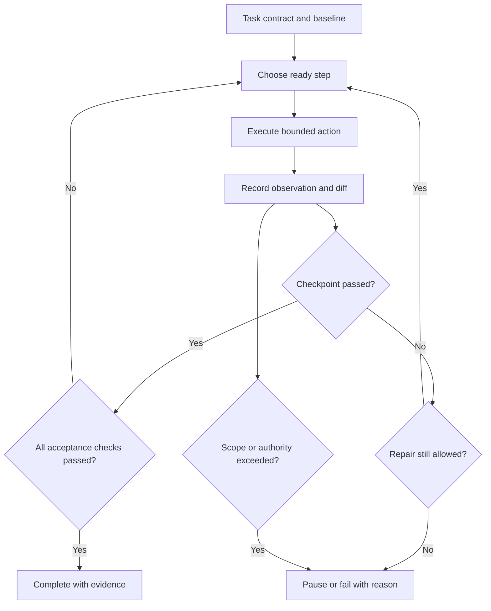

<TLDR>
  <TLDRCell label="what">
    An agent task plan turns one coding goal into bounded steps with dependencies, observable checkpoints, and explicit terminal states.
  </TLDRCell>
  <TLDRCell label="trap">
    A numbered to-do list can still drift if its steps have no allowed scope, evidence requirement, or rule for new discoveries and repeated failure.
  </TLDRCell>
  <TLDRCell label="fix">
    Give each step one inspectable outcome, verify it before unlocking dependent work, and stop or request approval when the plan leaves its original contract.
  </TLDRCell>
</TLDR>

## What it is and why it exists

Agent task planning is the work of translating a desired repository outcome into a finite execution contract. The contract names the goal, the starting state, allowed changes, ordered or dependent steps, a checkpoint for each step, and the conditions that end or pause the run. It should be concrete enough that a person can inspect progress without reconstructing the agent's reasoning.

A coding goal usually leaves implementation details open. "Reject expired sessions" doesn't say where expiry is enforced, how the current bug is reproduced, which files may change, or what evidence would prove the repair. An agent can fill those gaps by reading the repository, but without boundaries it may also rewrite adjacent authentication code, add a dependency, or stop after the first green test.

The plan gives the <Term id="agent-loop">agent loop</Term> a controlled route through that uncertainty. It doesn't predict every file or error in advance. It defines how the run may learn, which discoveries fit the task, and which discoveries require a new decision from the user.

This is different from asking the model to reveal private reasoning. A useful plan is an external artifact made of actions and checks: inspect a contract, reproduce a bug, make a narrow edit, run a named verifier, inspect the final diff. A long account of why the model prefers one action adds little unless it changes a checkpoint or exposes an assumption for review.

Task planning matters most when an agent can make multi-file edits or run several tools before returning control. A one-line rename may need only a direct check. A bug fix, migration, dependency update, or unfamiliar-module change needs intermediate evidence because a mistake early in the run can invalidate everything after it.

### Four parts that must stay distinct

The goal describes the final observable behavior. A step describes work that moves toward it. A checkpoint decides whether one step produced the state its dependents need. A stopping condition decides whether the whole run completes, pauses, or fails.

| Part | Question it answers | Session-expiry example |
| --- | --- | --- |
| Goal | What must be true at delivery? | Expired sessions receive status 401 |
| Step | What bounded action happens next? | Add a regression case for an expired token |
| Checkpoint | What evidence unlocks later work? | The new case fails with status 200 before the fix |
| Stopping condition | When must the run end or pause? | Finish after all checks pass; pause before an out-of-scope write |

The pre-fix failure is a valid checkpoint even though its command exits nonzero. Expected evidence belongs to the step definition. If every checkpoint simply means "exit code 0," a reproduction step may be marked failed precisely when it proves the bug exists.

### Planning at the right grain

A step should be large enough to produce meaningful evidence and small enough to fail without making the rest of the run ambiguous. "Read line 14, then line 15" is brittle micromanagement. "Fix authentication" is too broad because it combines discovery, behavior change, and verification without an inspectable boundary.

Good step boundaries usually follow changes in knowledge or risk. After exploration, the agent should be able to state the current contract and likely edit surface. After reproduction, it should have a failing case. After implementation, it should have the target behavior. After broader verification, it should have delivery evidence and a final scope check.

## How it works

Planning begins with a task contract, not a sequence of edits. Record the baseline, desired behavior, allowed paths or components, non-goals, required checks, and any time, turn, or cost limit. If one of these is unknown, the first step should discover it without widening write access.

### Anchor the starting state

The baseline makes later claims attributable. In a version-controlled repository, record the revision and pre-existing changed files before the agent writes. For a failing behavior, save the exact command, input, observed output, and environment needed to reproduce it.

An unfamiliar area may need a <Term id="characterization-test">characterization test</Term> before refactoring. That test records current behavior rather than declaring all of it desirable. The plan should distinguish behavior to preserve from behavior the task intentionally changes.

### Define the envelope

The envelope says what the run may change and what it must preserve. Path lists are useful, but architectural limits often matter too: no schema migration, no public API change, no new package, no network call, or no weakening of an assertion. A path can be in scope while a particular kind of edit remains out of scope.

Non-goals prevent plausible detours. If the task is to enforce expiry at request validation, cleanup of token naming or replacement of the authentication library may be sensible work, but it is still separate work. Recording that distinction lets the agent pause instead of quietly turning one repair into a redesign.

### Decompose around evidence

Write steps backward from acceptance evidence. Ask what final check proves the goal, what implementation state that check requires, what failing case proves the starting defect, and what inspection identifies the relevant contract. This produces a short chain whose transitions are observable.

Each step should carry at least these fields:

| Field | Purpose |
| --- | --- |
| `id` | Stable name used by logs and dependencies |
| `action` | One bounded unit of exploration, editing, or verification |
| `needs` | Checkpoints that must already pass |
| `allowedWrites` | Narrower write scope for this step |
| `checkpoint` | Expected observation and how to obtain it |
| `onFailure` | Repair, replan, pause, or stop rule |

The checkpoint must be independently observable. "Implementation looks correct" is not enough. A useful checkpoint names a test, type check, build result, diff condition, query result, or explicit human review decision, plus the expected status.

### Order only real dependencies

Not every plan needs a strictly serial list. Documentation and a focused test may be independent after the contract is known; a final suite depends on the implementation. Expressing `needs` relationships prevents a scheduler from running blocked work while leaving independent work available.

Keep speculative branches out of the active path. It is fine to record "if the parser owns this behavior, inspect its callers; otherwise pause with the ownership evidence." It is not useful to generate twenty hypothetical steps before the first repository search has settled which branch exists.

### Advance through checkpoints

After a step runs, compare the raw observation with its checkpoint. Preserve the command, working directory, exit status, relevant output, and changed paths. The model's sentence "the test passed" is a summary, not the checkpoint result.

Dependent steps unlock only after the checkpoint passes. A failed checkpoint may allow a bounded repair attempt, but that attempt needs its own result and retry limit. If the failure changes a premise of the plan, replan from the new evidence and mark invalid downstream work as superseded.

### Make stopping precedence explicit

Terminal rules need an order because several may become true together. Safety and authority checks should normally come first: an out-of-scope write pauses before any success claim. Verified completion comes next. Repeated no-progress failures, a <Term id="deadline">deadline</Term>, and turn or cost exhaustion then stop the run with their evidence intact.

Use different terminal states for different consequences. `complete` means the acceptance and scope checks passed. `paused` means a person or higher-authority rule must decide. `failed` means the plan reached a known rejection. `cancelled` records an external stop. Collapsing them all into "done" makes automation unsafe and review confusing.



The diagram has two ways out of the normal path: a checkpoint failure can exhaust its repair policy, and any observation can reveal a scope or authority problem. Neither path should be converted into completion merely because some files changed or one test passed.

## Examples

The examples use plain JavaScript so the plan mechanics stay visible. They do not call a model; they implement the controller around model-selected work. Each file was run with Node 24, and the following `text` block is its actual output.

### Validate a bounded plan before execution

This first plan states a behavior goal, the only two writable files, three checkpoints, and one stop rule. Validation rejects duplicate step identifiers, missing checkpoints, and writes outside the task envelope before any action begins.

<Depth level="quick">

```javascript run title="bounded_plan.js"
const task = {
  goal: "Reject expired sessions with a regression test",
  allowedPaths: new Set(["src/session.js", "test/session.test.js"]),
  steps: [
    {
      id: "reproduce",
      writes: ["test/session.test.js"],
      checkpoint: "new test fails with status 200",
    },
    {
      id: "implement",
      writes: ["src/session.js"],
      checkpoint: "new test passes with status 401",
    },
    {
      id: "verify",
      writes: [],
      checkpoint: "session suite passes and diff stays in scope",
    },
  ],
  stop: "all checkpoints pass or a required write leaves scope",
};

function validatePlan(plan) {
  const ids = new Set();
  for (const step of plan.steps) {
    if (ids.has(step.id)) throw new Error(`duplicate step: ${step.id}`);
    ids.add(step.id);
    if (!step.checkpoint) throw new Error(`missing checkpoint: ${step.id}`);
    for (const path of step.writes) {
      if (!plan.allowedPaths.has(path)) throw new Error(`out of scope: ${path}`);
    }
  }
}

validatePlan(task);
for (const step of task.steps) {
  console.log(`${step.id}: ${step.checkpoint}`);
}
console.log("scope: OK");
console.log(`stop: ${task.stop}`);
```

```text
reproduce: new test fails with status 200
implement: new test passes with status 401
verify: session suite passes and diff stays in scope
scope: OK
stop: all checkpoints pass or a required write leaves scope
```

<TryToBreak items={['a duplicate step id', 'a write to package.json', 'an empty checkpoint']} />

</Depth>

The plan is still a proposal, not proof that these files own the behavior. Its scope validation proves only that the proposed writes match the current contract. The `reproduce` step should inspect the repository and pause if the expected ownership is wrong.

Notice that verification has an empty write list. Giving a read-and-test step no write authority catches a model that tries to "help" by editing an assertion after a failure. Per-step scope can be narrower than the overall task scope.

### Gate dependent work on real results

The next controller represents dependencies separately from results. A reproduction command expects exit code `1`, while implementation and final verification expect `0`. The final lint failure prevents the plan from recording `verify` as complete.

```javascript run title="checkpoint_runner.js"
const plan = [
  { id: "reproduce", needs: [] },
  { id: "implement", needs: ["reproduce"] },
  { id: "verify", needs: ["implement"] },
];

const toolResults = new Map([
  ["reproduce", { exitCode: 1, expected: 1, evidence: "test exposed the bug" }],
  ["implement", { exitCode: 0, expected: 0, evidence: "target test passed" }],
  ["verify", { exitCode: 2, expected: 0, evidence: "lint found an error" }],
]);

const completed = new Set();

for (const step of plan) {
  const missing = step.needs.filter((id) => !completed.has(id));
  if (missing.length > 0) {
    console.log(`BLOCKED ${step.id}: needs ${missing.join(", ")}`);
    break;
  }

  const result = toolResults.get(step.id);
  const passed = result.exitCode === result.expected;
  console.log(
    `${passed ? "PASS" : "FAIL"} ${step.id}: exit=${result.exitCode}; ${result.evidence}`,
  );

  if (!passed) {
    console.log(`STOP: checkpoint ${step.id} failed`);
    break;
  }
  completed.add(step.id);
}

console.log(`completed: ${[...completed].join(", ")}`);
```

```text
PASS reproduce: exit=1; test exposed the bug
PASS implement: exit=0; target test passed
FAIL verify: exit=2; lint found an error
STOP: checkpoint verify failed
completed: reproduce, implement
```

A nonzero exit is evidence interpreted against a checkpoint, not a universal failure. The reproduction result is accepted because `1` was expected. The same exit would reject an implementation checkpoint whose expected status was `0`.

The completed set records established prerequisites rather than attempted work. A later repair can resume from `verify` without pretending that lint passed. If the repair changes the implementation contract, the controller should invalidate any dependent evidence instead of retaining it blindly.

### Decide whether to continue, pause, stop, or complete

The third example centralizes terminal precedence. An out-of-scope change pauses first, successful required checks complete the task, repeated failure and turn limits stop it, and only the remaining state may continue.

```javascript run title="stop_policy.js"
function decide(state) {
  if (state.changedPaths.some((path) => !state.allowedPaths.includes(path))) {
    return "PAUSE: proposed change is outside scope";
  }
  if (state.requiredChecks.every((check) => check === "pass")) {
    return "COMPLETE: every required checkpoint passed";
  }
  if (state.sameFailureCount >= 2) {
    return "STOP: repeated failure without new evidence";
  }
  if (state.turn >= state.maxTurns) {
    return "STOP: turn budget exhausted";
  }
  return "CONTINUE: next bounded step";
}

const base = {
  allowedPaths: ["src/session.js", "test/session.test.js"],
  changedPaths: ["src/session.js"],
  requiredChecks: ["pass", "fail"],
  sameFailureCount: 0,
  turn: 2,
  maxTurns: 6,
};

const cases = [
  base,
  { ...base, changedPaths: ["package.json"] },
  { ...base, sameFailureCount: 2 },
  { ...base, turn: 6 },
  { ...base, requiredChecks: ["pass", "pass"] },
];

for (const state of cases) console.log(decide(state));
```

```text
CONTINUE: next bounded step
PAUSE: proposed change is outside scope
STOP: repeated failure without new evidence
STOP: turn budget exhausted
COMPLETE: every required checkpoint passed
```

`PAUSE` and `STOP` are intentionally different. The first state may continue after an <Term id="approval-gate">approval gate</Term> changes the authorized scope. The second reports that the agreed execution policy ended the run; increasing a limit is a new user decision, not an automatic retry.

The function checks scope before completion, so an out-of-scope edit cannot be hidden behind green tests. A production controller would also require unchanged non-goals, untruncated evidence, and a known baseline before returning `COMPLETE`.

## Pitfalls

### Writing activities instead of checkpoints

> [!PITFALL]
> Steps such as "inspect the code," "make changes," and "test everything" record motion but provide no state a reviewer can confirm. An agent can claim each activity happened while leaving the original goal unresolved.

**Fix:** finish each step with an observable postcondition. Name the artifact or command, expected result, and evidence to retain: relevant owners identified, a regression case fails for the right reason, the target case passes, or the final diff contains only approved paths.

### Planning every edit before exploration

> [!PITFALL]
> A detailed plan based on guessed file ownership becomes stale after the first search. Agents then force the repository to fit the plan, editing named files even when the real contract lives elsewhere.

**Fix:** make exploration a bounded first step and place a checkpoint after it. Refine only the next uncertain segment from repository evidence. Preserve the goal and constraints while allowing implementation steps to change when new facts stay inside the task envelope.

### Letting one green check unlock too much

> [!PITFALL]
> A focused regression test may pass while type checking, integration behavior, or unchanged callers fail. Treating one result as final completion lets the agent stop early.

**Fix:** map each acceptance claim to the narrowest suitable check, then include a broader verification checkpoint proportional to the change. Keep target-test, related-suite, static-check, and diff-scope results separate so one cannot stand in for the others.

### Expanding scope during replanning

> [!PITFALL]
> Replanning can quietly turn a discovered constraint into new authority. An agent that finds an incompatible dependency may edit the lockfile, public API, or deployment configuration even though the original task never allowed those changes.

**Fix:** let new evidence change the route, not the contract. If progress requires another path, dependency, credential, network target, or product decision, pause with the evidence and proposed change. Resume only after the user or policy updates the authorized envelope.

### Retrying without a progress test

> [!PITFALL]
> "Try again until tests pass" has no finite failure state. The agent may repeat the same edit, churn between two patches, consume its budget, or weaken tests to escape the loop.

**Fix:** cap attempts and define progress as new evidence, a changed failure signature, or a smaller verified gap. Stop after repeated equivalent failures, preserve the last useful state, and report what was tried. Never let a retry policy authorize edits that the original step could not make.

### Treating a limit as proof of completion

> [!PITFALL]
> Reaching a turn, token, time, or cost limit says only that the execution budget ended. Reporting the task as complete at that point replaces missing verification with an accounting event.

**Fix:** give budget exhaustion its own terminal state and list checkpoints that remain open. Completion requires acceptance evidence regardless of resources spent. A person can choose a larger budget after reviewing whether another attempt has a plausible bounded route.

## In the AI era

**What generated code gets wrong here**

Models often produce plans whose steps are polished paraphrases of the prompt: "analyze," "implement," and "ensure quality." Those steps omit expected outputs, permitted files, and failure branches. During execution, generated controllers may mark a step complete when a tool was merely called, discard a nonzero exit as noise, keep downstream checkpoints after their premise changed, or accept green tests after modifying the tests themselves. Another common failure is endless replanning: each error creates more tasks, but no rule detects repeated failure or scope growth.

**Ask your AI to check**

- Convert each step into `action`, `needs`, `allowedWrites`, `checkpoint`, and `onFailure` fields, then flag any field supported only by an assumption.
- Map every completion claim to raw evidence, including the exact command, working directory, expected exit status, changed paths, and truncation state.
- Simulate test failure, repeated identical failure, an out-of-scope discovery, approval denial, cancellation, and budget exhaustion; name the terminal state for each.

**Review checklist**

- Confirm the goal, baseline, allowed scope, non-goals, and required acceptance checks are fixed before write-capable steps begin.
- Verify every dependency unlocks from observed checkpoint evidence and that replanning invalidates stale downstream results.
- Check that complete, pause, failure, cancellation, and exhausted-budget paths are finite, distinct, and reported with evidence.

**Prompt vocabulary**

Use the exact terms `task contract`, `baseline`, `task decomposition`, `dependency`, `checkpoint`, `acceptance criteria`, `allowed write scope`, `non-goal`, `replanning trigger`, `no-progress limit`, `approval gate`, and `stopping condition`. Ask for an executable plan table and a terminal-state matrix. "Make a detailed plan" tends to increase prose; naming these fields makes missing boundaries visible.

<Depth level="deep">

## Executable plans as state machines

A plan becomes executable when its next valid actions and terminal outcomes can be derived from recorded state. The controller need not understand why the model chose an edit. It does need to know which step owns that edit, whether its prerequisites passed, what paths changed, and which observation satisfies the checkpoint.

### Step states and invariants

Use explicit states instead of a `done` boolean. A practical set is `pending`, `ready`, `running`, `passed`, `failed`, `paused`, and `superseded`. The exact names matter less than the transitions they allow.

| State | Meaning | Permitted next states |
| --- | --- | --- |
| `pending` | At least one dependency is unresolved | `ready`, `superseded` |
| `ready` | Dependencies passed and policy allows execution | `running`, `paused`, `superseded` |
| `running` | One bounded action is in progress | `passed`, `failed`, `paused` |
| `passed` | Checkpoint evidence matched its expectation | `superseded` if an upstream premise changes |
| `failed` | Evidence rejected the checkpoint | `ready` through a bounded repair, or terminal failure |
| `paused` | More authority or human judgment is required | `ready`, `superseded`, or cancellation |
| `superseded` | Replanning made this result stale | No reuse as a satisfied dependency |

Two invariants prevent many early-success bugs. A step cannot become `ready` until every dependency is `passed`, and a task cannot become `complete` while any required acceptance step is not currently `passed`. "Currently" matters because evidence can become stale after another edit.

### Checkpoints are typed expectations

A checkpoint should describe both the observation source and its acceptance rule. For a process, record arguments, working directory, exit code, relevant streams, timeout, and truncation. For a diff check, record the baseline and normalized changed paths. For human review, record the exact question and the decision rather than inventing a machine result.

Expected failure is a distinct type of success. A reproduction checkpoint can require a named assertion to fail with the observed incorrect value. A crash, timeout, or unrelated import error does not satisfy that checkpoint even though each returns nonzero.

Avoid predicates that can pass vacuously. `every()` over an empty JavaScript array returns `true`, so a controller must also prove that the required-check set is present and nonempty. Likewise, "no failing output" is unsafe when output was truncated or the command never started.

### Dependencies form a partial order

Most small coding tasks use a short chain, but the underlying structure is a directed acyclic graph. An edge means evidence from one step is a prerequisite for another. It should not mean merely that the author happened to write one row first.

Before execution, reject missing dependency identifiers and cycles. During execution, schedule only ready steps and isolate concurrent writes. Two read-only inspections may run together; two edits to related files can invalidate each other's baselines even when their graph nodes appear independent.

The graph also explains why a passed check may need to be rerun. If step `B` changes an input that step `A` verified, the plan was missing a dependency edge or must invalidate `A`. Caching the green label without its baseline turns old evidence into a false checkpoint.

### Replanning changes a versioned artifact

Treat a revised plan as a new version, not an invisible rewrite of the list. Preserve the observation that triggered it, the steps added or removed, any scope change requested, and checkpoints invalidated. This gives the reviewer a reason for the route change without demanding private chain-of-thought.

Some discoveries are ordinary. Finding that `session.js` delegates expiry parsing to `token.js` can refine the implementation route if both are already in scope. Finding that the fix needs a database migration changes the task envelope and should move the run to `paused` pending approval.

Replanning should shrink uncertainty. If several cycles add detail but reproduce the same failure and propose the same actions, the run is not progressing. A no-progress fingerprint can combine the failing check, exit code, normalized error, changed-path set, and plan version; repeated fingerprints count toward the stop rule.

### Stop policy is part of correctness

Evaluate stop rules outside the model and in a documented order. One reasonable precedence is cancellation, safety or scope violation, verified completion, denied approval, hard deadline, no-progress limit, attempt or cost limit, then continuation. Projects may order these differently, but completion should never override a known scope violation.

A hard limit ends the current run. A soft threshold can request a summary or human decision before more resources are spent. Keep the distinction machine-readable so an automation wrapper cannot mistake "paused at 80% of budget" for either success or permanent failure.

Store the reason and evidence with every terminal state. For completion, include acceptance results and final diff scope. For pause, include the decision needed and the smallest proposed expansion. For failure, include the rejected checkpoint and exhausted repair policy. For cancellation, include who or what requested it and which action was interrupted.

### Plans under concurrent repository change

A plan is tied to a baseline. If another developer or agent changes a relevant file, checkpoints based on the old contents may no longer prove anything. Before an edit, compare the target's current identity with the inspected version; before delivery, compare the complete diff with the recorded baseline.

Separate worktrees reduce interference but do not remove integration risk. A plan that passes in isolation can conflict semantically with changes merged elsewhere. The delivery checkpoint should state whether freshness against the target branch is required and which checks must rerun after rebasing or merging.

Pre-existing dirty files need explicit ownership. Record them before the run, exclude them from automatic cleanup, and distinguish their hunks from agent changes. Otherwise the final scope check may blame the agent for old work or, worse, treat unrelated user edits as part of its evidence.

### Human checkpoints are first-class

Some decisions cannot be reduced to a command: whether a public behavior change is acceptable, whether a migration window is available, or whether a new dependency fits policy. Put those decisions in the graph as review checkpoints with named inputs and a recorded outcome.

A human checkpoint should ask one bounded question. "Review the patch" gives little guidance; "approve adding `token.js` to the write scope because the failing trace shows it owns expiry parsing" exposes the evidence and exact authority requested. Rejection should leave the run in a stable terminal or revised state, not send it into an unbounded negotiation loop.

### Minimal evidence record

For each attempted step, retain the plan version, step id, start and finish time, action or command, observation status, changed paths, checkpoint verdict, and any retry relation. For the task, retain the baseline, final terminal state, acceptance matrix, and unresolved warnings.

This record is smaller and more useful than a full transcript. It answers what ran, what changed, why the controller advanced, and why it stopped. Raw logs can remain available for diagnosis, but a compact evidence index lets a reviewer locate the decisive facts quickly.

The plan is successful when it constrains action and makes uncertainty legible. It may end in a well-supported pause or failure. Those outcomes are better than a false completion because they preserve the boundary the user actually authorized.

</Depth>

<Checkpoint id="ai-era/agent-task-planning" />

## Further reading

- [GitHub Docs: Getting the best results with Copilot coding agent](https://docs.github.com/en/copilot/tutorials/cloud-agent/get-the-best-results)
- [Claude Code Docs: Best practices for Claude Code](https://code.claude.com/docs/en/best-practices)
- [ReAct: Synergizing Reasoning and Acting in Language Models](https://arxiv.org/abs/2210.03629)
- [Plan-and-Solve Prompting: Improving Zero-Shot Chain-of-Thought Reasoning by Large Language Models](https://arxiv.org/abs/2305.04091)
