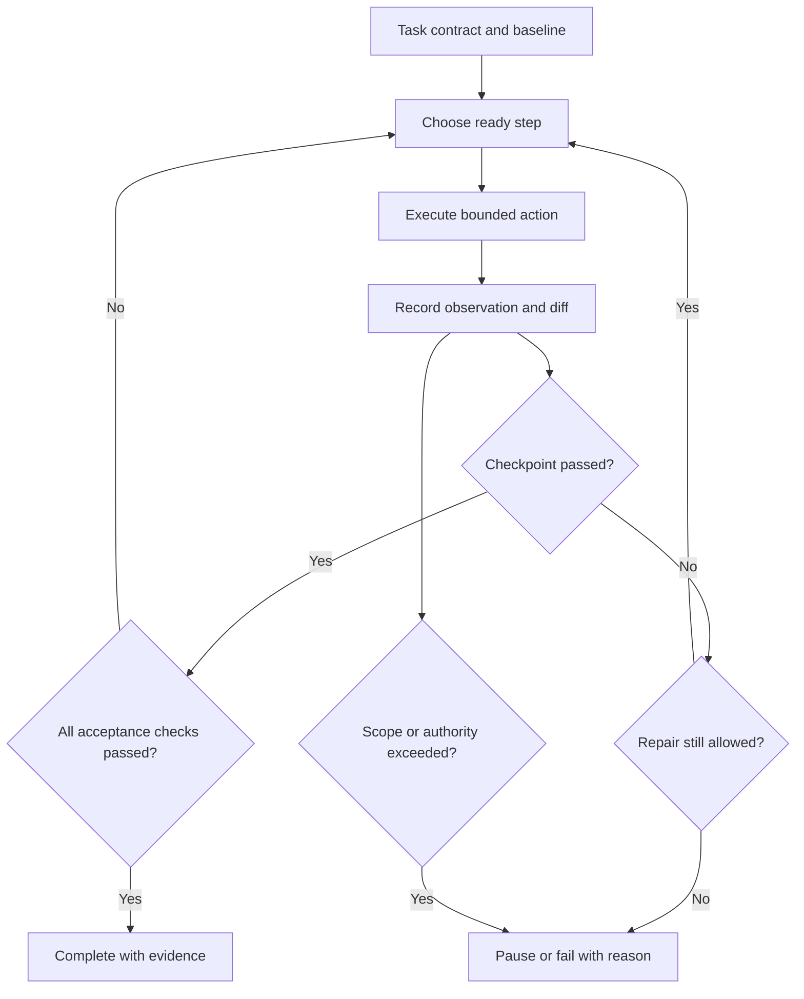

<TLDR>
  <TLDRCell label="what">
    智能体任务计划把一个编码目标拆成有边界的步骤，为步骤注明依赖关系和可观察的检查点，并明确所有终止状态。
  </TLDRCell>
  <TLDRCell label="trap">
    如果编号清单没有限定范围、证据要求，也没有处理新发现与重复失败的规则，那么写出清单仍无法避免任务漂移。
  </TLDRCell>
  <TLDRCell label="fix">
    为每个步骤规定一项可检查的结果，验证后再解锁依赖它的工作；计划超出原任务合同时，停止执行或请求批准。
  </TLDRCell>
</TLDR>

## 是什么，为什么存在

智能体任务规划，是把代码库的预期结果转换为有限的执行合同。这份合同要说明目标、起始状态、允许修改的范围、有顺序或依赖关系的步骤、每步检查点，以及结束或暂停运行的条件。它必须足够具体，使人无需还原智能体的推理过程，也能检查进度。

编码目标通常会留出实现空间。「拒绝过期会话」没有说明在哪里检查过期时间、怎样复现现有缺陷、可以修改哪些文件，也没有给出修复成立的证据。智能体可以通过读取代码库来补全这些信息；但若没有边界，它也可能顺手重写相邻的认证代码、添加依赖，或者在第一个测试变绿后过早停止。

计划为<Term id="agent-loop">智能体循环（agent loop）</Term>规定了一条在不确定信息中前进的受控路径。它不必预先猜出每个文件或错误，而是规定运行怎样获取新信息、哪些发现仍属于当前任务，以及哪些发现必须交由用户重新决定。

这与要求模型公开内部推理不同。实用的计划是由操作和检查组成的外部产物：检查合同、复现缺陷、做小范围修改、运行指定验证器，再检查最终差异。如果一段很长的解释既不改变检查点，也没有暴露需要复核的假设，那么模型为什么偏好某项操作并不重要。

当智能体可以修改多个文件，或在交还控制权前连续调用多种工具时，任务规划最有价值。一行重命名也许只需要直接检查。缺陷修复、迁移、依赖升级或陌生模块的修改则需要中间证据，因为运行早期的错误可能让后续工作全部失效。

### 必须分开的四个部分

目标描述交付时最终可观察的行为。步骤描述推动任务前进的工作。检查点判断某一步是否产生了后续步骤所需的状态。停止条件判断整个运行应当完成、暂停还是失败。

| 部分 | 回答的问题 | 会话过期示例 |
| --- | --- | --- |
| 目标 | 交付时必须满足什么？ | 过期会话收到状态码 401 |
| 步骤 | 接下来执行哪项有边界的操作？ | 为过期令牌添加回归用例 |
| 检查点 | 哪项证据可以解锁后续工作？ | 修复前，新用例以状态码 200 失败 |
| 停止条件 | 运行何时必须结束或暂停？ | 全部检查通过后完成；写入范围外文件前暂停 |

修复前的失败虽然对应非零退出码，却是有效检查点。步骤定义应当注明预期证据。如果每个检查点都只接受「退出码 0」，复现步骤真正证明缺陷存在时反而会被标记为失败。

### 选择合适的步骤粒度

一个步骤既要大到能够产生有意义的证据，也要小到即使失败，也不会让其余运行变得含糊。「读取第 14 行，再读取第 15 行」是脆弱的微观管理。「修复认证」又过于宽泛，把探索、行为修改和验证混在一起，没有可检查的边界。

合适的步骤边界通常对应知识或风险的变化。探索结束后，智能体应能说明当前合同和可能的修改范围。复现结束后，应有失败用例。实现结束后，应实现目标行为。扩大验证范围之后，应有交付证据和最终范围检查。

## 工作原理

规划从任务合同开始，而不是从一串编辑动作开始。先记录基线、预期行为、允许修改的路径或组件、非目标、必需检查，以及时间、轮次或成本限制。其中某项未知时，第一步应在不扩大写权限的前提下查明它。

### 固定起始状态

基线使后续结论能够归因。在受版本控制的代码库中，应在智能体写入前记录修订版本和原有改动文件。对于失败行为，还要保存复现所需的确切命令、输入、实际输出和环境。

重构陌生区域之前，可能需要先写<Term id="characterization-test">特征测试（characterization test）</Term>。这种测试记录当前行为，并不表示所有当前行为都值得保留。计划必须把需要保持的行为与任务有意改变的行为区分开。

### 界定执行范围

执行范围要说明本次运行可以修改什么，又必须保持什么。路径列表很有用，但架构限制通常同样重要，例如：不得迁移模式、不得改变公共 API、不得新增包、不得访问网络，或者不得削弱断言。某个路径可以在范围内，其中某种修改却仍可能不被允许。

非目标用来阻止看似合理的岔路。如果任务是在请求校验时强制检查过期状态，那么清理令牌命名或更换认证库可能都是合理工作，但仍属于别的任务。记录这层区别后，智能体可以暂停，而不是悄悄把一次修复变成重新设计。

### 围绕证据拆分任务

从验收证据反向写出步骤。先问最终由什么检查证明目标成立，再问该检查需要什么实现状态、什么失败用例能够证明起始缺陷，以及通过什么检查找到相关合同。这样得到的链条很短，而且每次状态转换都可以观察。

每个步骤至少应有以下字段：

| 字段 | 用途 |
| --- | --- |
| `id` | 供日志和依赖关系引用的稳定名称 |
| `action` | 一项有边界的探索、编辑或验证操作 |
| `needs` | 必须已经通过的检查点 |
| `allowedWrites` | 本步骤更严格的写入范围 |
| `checkpoint` | 预期观察结果及其获取方式 |
| `onFailure` | 修复、重新规划、暂停或停止规则 |

检查点必须可以独立观察。「实现看起来正确」远远不够。有效的检查点会指定测试、类型检查、构建结果、差异条件、查询结果或明确的人工审查决定，并注明预期状态。

### 只排序真正的依赖关系

并非每个计划都必须是严格串行的清单。合同确定后，编写文档与一项聚焦测试可能彼此独立，而最终测试集依赖实现结果。显式写出 `needs` 关系，可以防止调度器执行尚未解锁的工作，同时保留可独立推进的步骤。

不要把推测分支放进活动路径。可以记录「如果解析器拥有这项行为，就检查其调用方；否则带着所有权证据暂停」。在第一次代码库搜索尚未确定实际分支前就生成二十个假想步骤，则没有帮助。

### 通过检查点推进

步骤运行后，把原始观察结果与检查点对照。保留命令、工作目录、退出状态、相关输出和修改路径。模型说「测试已通过」只是摘要，并不是检查点结果。

只有检查点通过后，才能解锁依赖它的步骤。检查点失败后可以允许次数有限的修复，但每次修复都要有自己的结果和重试上限。如果失败改变了计划的前提，应根据新证据重新规划，并把失效的后续工作标记为已取代。

### 明确停止规则的优先级

多个终止规则可能同时满足，因此必须规定顺序。安全与权限检查通常最优先：只要发生范围外写入，就应先暂停，不得再声称成功。其次是验证完成。随后，无进展的重复失败、<Term id="deadline">截止时间（deadline）</Term>以及轮次或成本耗尽，都会终止运行，并保留各自证据。

不同后果要使用不同的终止状态。`complete` 表示验收与范围检查通过；`paused` 表示需要人员或更高权限规则决定；`failed` 表示计划已经到达明确的拒绝状态；`cancelled` 记录外部停止。把它们都压成 `done` 会使自动化变得不安全，也会使审查混乱。



图中有两条路径会离开正常流程：检查点失败可能耗尽修复额度，任何观察结果也都可能暴露范围或权限问题。这两种情况都不能因为有文件发生变化或某项测试已经通过，就被转换为完成状态。

## 示例

下面用普通 JavaScript 展示计划机制，以免框架细节遮住重点。示例不会调用真实模型，而是实现位于模型所选工作之外的控制器。每个文件都用 Node 24 实际运行，紧随其后的 `text` 块是其真实输出。

### 执行前验证有边界的计划

第一份计划声明一项行为目标、仅有的两个可写文件、三个检查点和一条停止规则。任何操作开始前，验证代码都会拒绝重复的步骤标识、缺失的检查点和任务范围外的写入。

<Depth level="quick">

```javascript run title="bounded_plan.js"
const task = {
  goal: "Reject expired sessions with a regression test",
  allowedPaths: new Set(["src/session.js", "test/session.test.js"]),
  steps: [
    {
      id: "reproduce",
      writes: ["test/session.test.js"],
      checkpoint: "new test fails with status 200",
    },
    {
      id: "implement",
      writes: ["src/session.js"],
      checkpoint: "new test passes with status 401",
    },
    {
      id: "verify",
      writes: [],
      checkpoint: "session suite passes and diff stays in scope",
    },
  ],
  stop: "all checkpoints pass or a required write leaves scope",
};

function validatePlan(plan) {
  const ids = new Set();
  for (const step of plan.steps) {
    if (ids.has(step.id)) throw new Error(`duplicate step: ${step.id}`);
    ids.add(step.id);
    if (!step.checkpoint) throw new Error(`missing checkpoint: ${step.id}`);
    for (const path of step.writes) {
      if (!plan.allowedPaths.has(path)) throw new Error(`out of scope: ${path}`);
    }
  }
}

validatePlan(task);
for (const step of task.steps) {
  console.log(`${step.id}: ${step.checkpoint}`);
}
console.log("scope: OK");
console.log(`stop: ${task.stop}`);
```

```text
reproduce: new test fails with status 200
implement: new test passes with status 401
verify: session suite passes and diff stays in scope
scope: OK
stop: all checkpoints pass or a required write leaves scope
```

<TryToBreak items={['重复的步骤 id', '写入 package.json', '空检查点']} />

</Depth>

这份计划仍然只是提议，不能证明行为确实由这两个文件负责。范围验证只能证明拟议写入符合当前合同。`reproduce` 步骤应检查代码库；如果预期的所有权不成立，就应暂停。

验证步骤的写入列表是空的。不给只读和测试步骤授予写权限，可以发现模型在失败后试图通过修改断言来「帮忙」的行为。单个步骤的范围可以比整个任务的范围更窄。

### 用真实结果约束依赖工作

下一段控制器把依赖关系与结果分开表示。复现命令预期退出码为 `1`，实现和最终验证则预期为 `0`。最后的代码检查失败后，计划不会把 `verify` 记录为完成。

```javascript run title="checkpoint_runner.js"
const plan = [
  { id: "reproduce", needs: [] },
  { id: "implement", needs: ["reproduce"] },
  { id: "verify", needs: ["implement"] },
];

const toolResults = new Map([
  ["reproduce", { exitCode: 1, expected: 1, evidence: "test exposed the bug" }],
  ["implement", { exitCode: 0, expected: 0, evidence: "target test passed" }],
  ["verify", { exitCode: 2, expected: 0, evidence: "lint found an error" }],
]);

const completed = new Set();

for (const step of plan) {
  const missing = step.needs.filter((id) => !completed.has(id));
  if (missing.length > 0) {
    console.log(`BLOCKED ${step.id}: needs ${missing.join(", ")}`);
    break;
  }

  const result = toolResults.get(step.id);
  const passed = result.exitCode === result.expected;
  console.log(
    `${passed ? "PASS" : "FAIL"} ${step.id}: exit=${result.exitCode}; ${result.evidence}`,
  );

  if (!passed) {
    console.log(`STOP: checkpoint ${step.id} failed`);
    break;
  }
  completed.add(step.id);
}

console.log(`completed: ${[...completed].join(", ")}`);
```

```text
PASS reproduce: exit=1; test exposed the bug
PASS implement: exit=0; target test passed
FAIL verify: exit=2; lint found an error
STOP: checkpoint verify failed
completed: reproduce, implement
```

非零退出码是需要按照检查点解释的证据，不表示一律失败。复现步骤接受这个结果，因为它预期退出码为 `1`。如果实现检查点预期状态为 `0`，同一个退出码就会拒绝该步骤。

完成集合记录的是已经成立的前置条件，而不是尝试过的工作。后续修复可以从 `verify` 恢复，但不能假装代码检查曾经通过。如果修复改变了实现合同，控制器应使依赖旧合同的证据失效，而不是盲目保留。

### 判断继续、暂停、停止或完成

第三个示例集中定义终止状态的优先级。范围外修改最先触发暂停；必需检查全部成功后完成；重复失败和轮次上限会停止运行；只有其他条件都不满足时才继续。

```javascript run title="stop_policy.js"
function decide(state) {
  if (state.changedPaths.some((path) => !state.allowedPaths.includes(path))) {
    return "PAUSE: proposed change is outside scope";
  }
  if (state.requiredChecks.every((check) => check === "pass")) {
    return "COMPLETE: every required checkpoint passed";
  }
  if (state.sameFailureCount >= 2) {
    return "STOP: repeated failure without new evidence";
  }
  if (state.turn >= state.maxTurns) {
    return "STOP: turn budget exhausted";
  }
  return "CONTINUE: next bounded step";
}

const base = {
  allowedPaths: ["src/session.js", "test/session.test.js"],
  changedPaths: ["src/session.js"],
  requiredChecks: ["pass", "fail"],
  sameFailureCount: 0,
  turn: 2,
  maxTurns: 6,
};

const cases = [
  base,
  { ...base, changedPaths: ["package.json"] },
  { ...base, sameFailureCount: 2 },
  { ...base, turn: 6 },
  { ...base, requiredChecks: ["pass", "pass"] },
];

for (const state of cases) console.log(decide(state));
```

```text
CONTINUE: next bounded step
PAUSE: proposed change is outside scope
STOP: repeated failure without new evidence
STOP: turn budget exhausted
COMPLETE: every required checkpoint passed
```

`PAUSE` 与 `STOP` 是有意区分的两种状态。前一种状态可以在<Term id="approval-gate">审批门（approval gate）</Term>修改授权范围后继续。后一种状态表示约定的执行策略已经结束本次运行；扩大限制必须由用户重新决定，不能自动重试。

函数先检查范围，再判断完成，因此绿灯测试无法掩盖越界编辑。生产控制器还应在返回 `COMPLETE` 前确认非目标未变、证据没有截断，而且基线已知。

## 陷阱

### 只写活动，不写检查点

> [!PITFALL]
> 「检查代码」「进行修改」「测试所有内容」只记录动作，没有提供审查者可以确认的状态。智能体可能声称每项活动都已发生，却仍未解决原始目标。

**修复方法：** 每个步骤都要以可观察的后置条件结束。注明要保留的产物或命令、预期结果和证据，例如：找到相关所有者、回归用例因正确原因失败、目标用例通过，或者最终差异只包含获准路径。

### 探索前就规划每项编辑

> [!PITFALL]
> 根据猜测的文件所有权写出的详细计划，在第一次搜索后就会过时。智能体随后可能强迫代码库服从计划，即使真正的合同在其他位置，也坚持修改预先写下的文件。

**修复方法：** 把探索设为有边界的第一步，并在探索后放置检查点。只根据代码库证据细化下一个仍不确定的片段。目标和约束应保持不变；新事实仍在任务范围内时，实现步骤可以调整。

### 让一项绿灯检查解锁过多工作

> [!PITFALL]
> 聚焦的回归测试可以通过，但类型检查、集成行为或未修改的调用方仍可能失败。把一项结果视为最终完成，会让智能体过早停止。

**修复方法：** 为每项验收结论匹配范围最窄而又合适的检查，再根据改动风险添加更广的验证检查点。分别保留目标测试、相关测试集、静态检查和差异范围结果，不能让其中一项替代其他项。

### 重新规划时扩大范围

> [!PITFALL]
> 重新规划可能悄悄把发现的限制变成新的权限。智能体发现依赖不兼容后，可能修改锁文件、公共 API 或部署配置，即使原任务从未允许这些改动。

**修复方法：** 新证据可以改变路径，不能改变合同。如果继续推进需要其他路径、依赖、凭据、网络目标或产品决定，应带着证据和拟议改动暂停。只有用户或策略更新授权范围后才能继续。

### 在没有进展判定时重试

> [!PITFALL]
> 「反复尝试直到测试通过」没有有限的失败状态。智能体可能重复同一项编辑、在两份补丁间来回摆动、耗尽预算，或削弱测试来逃出循环。

**修复方法：** 限制尝试次数，并把新证据、改变的失败特征或缩小且已经验证的差距定义为进展。出现等价失败达到上限后应停止，保留最后一份有用状态，并报告已经尝试的内容。重试策略不得授权原步骤无权执行的编辑。

### 把资源限制当作完成证据

> [!PITFALL]
> 达到轮次、token、时间或成本上限，只说明执行预算已经用完。此时把任务报告为完成，相当于用一次计费事件代替缺失的验证。

**修复方法：** 为预算耗尽设置独立的终止状态，并列出仍未通过的检查点。无论已经花费多少资源，完成都必须有验收证据。人员检查下一次尝试是否存在合理且有边界的路径后，可以选择扩大预算。

## AI 时代

**生成代码在这里常犯的错**

模型经常生成一份只是润色改写提示的计划，步骤不过是「分析」「实现」和「保证质量」。这些步骤没有预期输出、允许文件或失败分支。执行时，生成的控制器可能在工具刚被调用时就把步骤标记为完成，把非零退出码当作噪声丢弃，在计划前提变化后保留后续检查点，或者在修改测试本身后接受绿灯结果。另一种常见错误是无限重新规划：每次错误都增加任务，却没有规则发现重复失败或范围增长。

**让 AI 检查**

- 把每个步骤转换成 `action`、`needs`、`allowedWrites`、`checkpoint` 和 `onFailure` 字段，并标出仅由假设支持的字段。
- 把每项完成结论映射到原始证据，包括确切命令、工作目录、预期退出状态、修改路径和截断状态。
- 模拟测试失败、重复的相同失败、范围外发现、批准被拒、取消和预算耗尽；注明每种情况的终止状态。

**审查清单**

- 确认写入步骤开始前，目标、基线、允许范围、非目标和必需验收检查已经固定。
- 验证每项依赖只由观察到的检查点证据解锁，并确认重新规划会使过时的后续结果失效。
- 检查完成、暂停、失败、取消和预算耗尽路径是否有限、互不混淆，而且都带有证据。

**提示词词汇**

使用准确术语：`task contract`（任务合同）、`baseline`（基线）、`task decomposition`（任务拆分）、`dependency`（依赖关系）、`checkpoint`（检查点）、`acceptance criteria`（验收条件）、`allowed write scope`（允许写入范围）、`non-goal`（非目标）、`replanning trigger`（重新规划触发条件）、`no-progress limit`（无进展上限）、`approval gate`（审批门）和 `stopping condition`（停止条件）。要求输出可执行计划表和终止状态矩阵。「制定详细计划」往往只会增加文字；明确这些字段，才能看见缺失的边界。

<Depth level="deep">

## 把可执行计划视为状态机

当下一项有效操作和终止结果都能从已记录状态推导出来时，计划才是可执行的。控制器不必理解模型为何选择某项编辑，却必须知道该编辑属于哪个步骤、其前置条件是否通过、哪些路径发生变化，以及什么观察结果能够满足检查点。

### 步骤状态与不变量

不要只用一个 `done` 布尔值，应使用显式状态。一组实用状态包括 `pending`、`ready`、`running`、`passed`、`failed`、`paused` 和 `superseded`。具体名称不如它们允许的状态转换重要。

| 状态 | 含义 | 允许的后续状态 |
| --- | --- | --- |
| `pending` | 至少一项依赖尚未解决 | `ready`、`superseded` |
| `ready` | 依赖已通过，策略允许执行 | `running`、`paused`、`superseded` |
| `running` | 一项有边界的操作正在执行 | `passed`、`failed`、`paused` |
| `passed` | 检查点证据符合预期 | 上游前提变化时转为 `superseded` |
| `failed` | 证据拒绝了检查点 | 通过有限修复回到 `ready`，或进入终止失败 |
| `paused` | 需要更多权限或人工判断 | `ready`、`superseded` 或取消 |
| `superseded` | 重新规划使该结果过时 | 不得再作为已满足的依赖使用 |

两个不变量可以防止许多过早成功错误。只有全部依赖均为 `passed`，步骤才能变为 `ready`；只要有任何必需验收步骤当前不是 `passed`，任务就不能变为 `complete`。「当前」很重要，因为其他编辑发生后，原有证据可能过时。

### 检查点是带类型的预期

检查点应同时描述观察来源与接受规则。对于进程，应记录参数、工作目录、退出码、相关输出流、超时和截断状态。对于差异检查，应记录基线和规范化后的修改路径。对于人工审查，应记录具体问题与决定，不能虚构机器结果。

预期失败是一种独立的成功类型。复现检查点可以要求指定断言失败，并得到已观察到的错误值。崩溃、超时或无关的导入错误虽然也返回非零状态，却不能满足这个检查点。

还要避免可以空洞通过的谓词。JavaScript 中的 `every()` 作用于空数组时返回 `true`，因此控制器还必须证明必需检查集合存在且非空。同样，在输出被截断或命令根本没有启动时，「没有失败输出」也不安全。

### 依赖关系构成偏序

多数小型编码任务使用一条短链，但底层结构是有向无环图。一条边表示某个步骤的证据是另一步骤的前置条件，而不应只表示作者碰巧先写了某一行。

执行前要拒绝不存在的依赖标识和环。执行期间只调度已经就绪的步骤，并隔离并发写入。两项只读检查可以同时运行；两项对相关文件的编辑即使图节点看似独立，也可能使彼此的基线失效。

这张图也解释了为什么已经通过的检查可能需要重跑。如果步骤 `B` 改变了步骤 `A` 验证过的输入，那么计划缺少一条依赖边，或者必须让 `A` 失效。如果只缓存绿灯标记而不保留对应基线，旧证据就会变成虚假检查点。

### 重新规划会产生带版本的产物

应把修订计划视为新版本，而不是在原清单上进行不可见的重写。保留触发变化的观察结果、新增或删除的步骤、请求的范围变化，以及因此失效的检查点。这样，审查者无需模型的内部思维链，也能知道路线为何改变。

有些发现很普通。如果 `session.js` 把过期状态解析交给 `token.js`，而两者本来就在范围内，就可以细化实现路径。若发现修复需要数据库迁移，任务范围已经改变，运行应转为 `paused`，等待批准。

重新规划应当减少不确定性。如果多轮循环不断增加细节，却复现同一项失败并提出相同操作，那么运行没有进展。无进展指纹可以组合失败检查、退出码、规范化错误、修改路径集合和计划版本；重复指纹应计入停止规则。

### 停止策略也是正确性的一部分

停止规则应由模型之外的代码按文档规定的顺序评估。一种合理顺序是：取消、安全或范围违规、验证完成、批准被拒、硬截止时间、无进展上限、尝试或成本上限，最后才是继续。不同项目可以调整顺序，但完成绝不能覆盖已经发现的范围违规。

硬限制会结束当前运行。软阈值则可以在继续花费资源前请求摘要或人工决定。应以机器可读方式区分两者，避免自动化包装器把「预算使用 80% 时暂停」误判为成功或永久失败。

每种终止状态都要保存原因和证据。完成状态应包含验收结果与最终差异范围。暂停状态应包含需要的决定和最小范围扩展提议。失败状态应包含被拒绝的检查点与已经耗尽的修复策略。取消状态应说明由谁或什么触发，以及哪项操作被中断。

### 代码库并发变化下的计划

计划与一份基线绑定。如果另一名开发者或另一个智能体修改了相关文件，基于旧内容的检查点可能不再证明任何事实。编辑前要把目标的当前标识与检查时的版本比较；交付前要把完整差异与已记录基线比较。

独立工作树可以减少干扰，却不会消除集成风险。计划在隔离环境中通过后，仍可能与其他位置合入的改动产生语义冲突。交付检查点应说明是否要求与目标分支保持最新，以及变基或合并后必须重跑哪些检查。

原有脏文件需要明确归属。运行前记录它们，不要自动清理，并把其中的代码块与智能体修改区分开。否则，最终范围检查可能把旧工作错算给智能体；更糟的是，还可能把用户的不相关修改当成本次运行的证据。

### 人工检查点也是一等步骤

有些决定无法简化为命令，例如：公共行为变化能否接受、迁移窗口是否可用，或新依赖是否符合策略。应把这些决定作为审查检查点放入图中，并为其指定输入和记录结果。

人工检查点应当只问一个有边界的问题。「审查补丁」几乎没有指导价值；「批准把 `token.js` 加入写入范围，因为失败跟踪表明它负责解析过期状态」则给出了证据和请求的确切权限。拒绝后，运行应进入稳定的终止或修订状态，不能落入没有边界的协商循环。

### 最小证据记录

每次尝试一个步骤，都应保留计划版本、步骤 id、开始与结束时间、操作或命令、观察状态、修改路径、检查点结论，以及与重试的关系。整个任务还要保留基线、最终终止状态、验收矩阵和未解决警告。

这种记录比完整对话更小，也更有用。它能回答运行了什么、改变了什么、控制器为何推进，以及为何停止。诊断时仍可查看原始日志，但精简的证据索引能帮助审查者快速找到决定性事实。

计划是否成功，要看它能否约束行动并使不确定信息可见。它完全可以以证据充分的暂停或失败结束。这些结果比虚假完成更好，因为它们保住了用户实际授权的边界。

</Depth>

<Checkpoint id="ai-era/agent-task-planning" />

## 延伸阅读

- [GitHub 文档：使用 Copilot 编程智能体取得更好结果](https://docs.github.com/en/copilot/tutorials/cloud-agent/get-the-best-results)
- [Claude Code 文档：Claude Code 最佳实践](https://code.claude.com/docs/en/best-practices)
- [ReAct：在语言模型中协同推理与行动](https://arxiv.org/abs/2210.03629)
- [Plan-and-Solve Prompting：改进大语言模型的零样本思维链推理](https://arxiv.org/abs/2305.04091)
