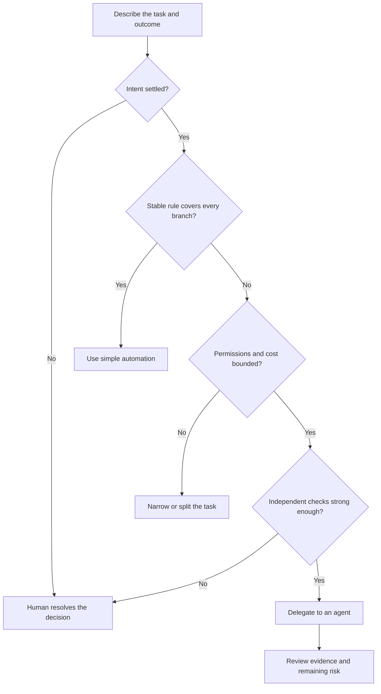

<TLDR>
  <TLDRCell label="what">
    An agent-use boundary is a rule for choosing agent delegation, simple automation, or human-led work before execution begins.
  </TLDRCell>
  <TLDRCell label="trap">
    A task can look routine while hiding disputed intent, sensitive access, open-ended cost, or an outcome nobody can verify independently.
  </TLDRCell>
  <TLDRCell label="fix">
    Choose the least capable method that reliably completes the task, and escalate to an agent only when scope, permissions, budget, and checks are explicit.
  </TLDRCell>
</TLDR>

## What it is and why it exists

An agent-use boundary is the point at which you decide how much autonomy a task should receive. On one side are tasks suitable for a coding agent: their goal is settled, their permissions are bounded, and their result can be checked. On the other side are tasks safer as direct human work or as a small deterministic program.

The boundary is about the task and environment, not whether the model seems capable. A strong model can still optimize the wrong interpretation, expose sensitive data through an allowed tool, spend too long exploring, or produce a change whose correctness is hard to observe. More capability does not repair a missing decision or a missing test oracle.

Direct human work means a responsible person makes the consequential judgment or performs the sensitive step. Tools may still help with search, formatting, calculation, or drafting. The key is that the unresolved decision does not silently move to a model.

Simple automation means ordinary code follows a stable, fully specified rule. A formatter, schema validator, codemod, or fixed data transformation is often cheaper and easier to test than an agent. If every branch can be written down in advance, an adaptive loop may add variability without adding useful judgment.

Agent delegation fits the middle. The desired result is clear, but the route through a repository requires search, tool use, and correction from feedback. A reproducible defect with named files and acceptance tests is a typical fit; deciding what a disputed product policy should mean is not.

You meet this choice before granting a coding tool access, when turning a manual workflow into automation, and whenever a delegated task asks for broader permissions. Reevaluate it when evidence changes. A task that begins as safe exploration can cross the boundary when the next step sends data, changes production state, or needs an unrecorded business decision.

### Three methods, different responsibilities

| Method | Best fit | Main source of control | Typical completion evidence |
| --- | --- | --- | --- |
| Human-led work | Ambiguous intent or high-consequence judgment | Accountable person | Recorded decision and independent review |
| Simple automation | Stable rule over structured inputs | Deterministic code | Exact assertions and repeatable output |
| Agent delegation | Bounded search and edits with feedback | Permission policy plus verifier | Reviewed diff and named checks |

These methods can be composed. A person can settle policy, a deterministic script can migrate records, and an agent can prepare tests or documentation around the change. Split a task at responsibility boundaries instead of forcing one method to own the entire workflow.

A good boundary also names the handoff artifact and who accepts it. Without that ownership, a candidate result can be mistaken for an approved result as it moves between tools.

The choice is not permanent. Once a human resolves an ambiguity and examples encode the rule, later cases may become deterministic automation. Once a repository gains reliable tests and an isolated workspace, a previously manual maintenance task may become a good agent task.

## How it works

Make the choice before the agent sees secrets or receives write access. Assess four signals: uncertainty, sensitivity, cost exposure, and verification strength. A serious problem in any one dimension can be enough to narrow the task or select a different method.



The diagram is a screening flow, not a score that excuses a red flag. If customer intent is disputed, low token cost does not make the decision delegable. If the outcome cannot be checked, a narrow filesystem permission does not make an autonomous edit trustworthy.

### Uncertainty: what is unknown

Separate route uncertainty from outcome uncertainty. Route uncertainty means the destination is agreed but the implementation path is unknown, such as which parser owns a failing behavior. Agents are useful here because they can search, inspect, edit, and react to tests.

Outcome uncertainty means reasonable stakeholders could disagree about what success is. Examples include choosing a refund exception, deciding whether a security warning is acceptable, or inventing a public API without approved consumers. A model can propose options, but an accountable human must settle the decision before implementation becomes autonomous.

Write uncertainty as an explicit question. “Which module validates this header?” is discoverable from repository evidence. “Should enterprise customers bypass this limit?” requires product authority, so repository search cannot close it.

Uncertainty can shrink without disappearing. If investigation identifies two possible owners but cannot distinguish them, the next step is a focused observation or human decision, not permission to guess.

### Sensitivity: what the task can expose or change

Sensitivity covers both information and effects. Credentials, private customer data, unreleased financial results, and regulated records create exposure risk. Production writes, money movement, account deletion, external messages, and public releases create consequence risk even when the input data is ordinary.

Use <Term id="least-privilege">least privilege</Term>: expose only the resources and operations needed for the current bounded step. Reading a fixture does not require reading the whole home directory. Running a unit test does not require network access or deployment credentials.

An <Term id="approval-gate">approval gate</Term> is useful only when it shows the real operation. “Allow command?” is too vague if the command can publish a package or upload a file. The reviewer needs the target, arguments, working directory, expected effects, and recovery path.

Some steps remain human-only even behind an approval dialog. Approval is weak when the person cannot inspect the payload, understand the effect, or reverse a mistake. In those cases, reduce the operation to a reviewable artifact and let a person perform the final action through the normal controlled interface.

Sensitivity applies to outputs too. Logs, patches, screenshots, and error reports can reproduce a secret even when the original file never leaves its permitted directory.

### Cost: what can grow or repeat

Cost includes model usage, elapsed time, tool invocations, external API charges, compute, and reviewer attention. A cheap first step can enter an expensive retry loop. Put limits around the whole run and around individual tools, then define what happens when a limit is reached.

An agent is poor leverage when explaining, supervising, and reviewing it costs more than doing a small task directly. Fixing a clear typo in one known line rarely needs repository-wide exploration. Conversely, a bounded search across many unfamiliar files may justify an agent even when the final patch is small.

Cost is also opportunity cost. A long-running agent that occupies a database sandbox or repeatedly calls a rate-limited service can block other work. The task contract should name scarce resources, concurrency limits, and a stop condition rather than treating token budget as the only limit.

Include failure handling in the budget. Repeatedly retrying the same denied call or unchanged test consumes resources without producing new information and should trigger a stop.

### Verification: how you can know it worked

Strong verification observes the promised outcome independently of the agent’s explanation. Examples include a regression test, a schema validator, an exact transformed-record comparison, a compiler result, or a reviewed diff constrained to allowed paths. The check must be capable of rejecting a plausible wrong solution.

Weak verification checks appearance or self-report. “The code looks clean,” “the agent says all cases pass,” and “the command printed some green text” do not establish the required behavior. Preserve the command, working directory, exit status, standard error, and skipped checks.

A passing check has limited scope. Unit tests do not prove that a migration handles real data distributions, and a type checker does not prove authorization policy. Map each acceptance criterion to its evidence, then keep uncovered claims as human review items.

Human review can be valid evidence when the criterion is genuinely judgment-based, but name the reviewer and the material inspected. A bare “reviewed” flag is another unsupported assertion.

### A practical decision table

A <Term id="decision-table">decision table</Term> keeps the choice consistent without pretending every risk is numeric. Evaluate the actual step, not a broad project label. “Update billing” is too coarse; “generate a candidate SQL migration in an empty local database” is specific enough to classify.

| Signal | Agent is plausible | Prefer simple automation | Keep human-led or narrow first |
| --- | --- | --- | --- |
| Uncertainty | Route unknown, outcome settled | No meaningful uncertainty | Outcome or policy disputed |
| Sensitivity | Isolated data and reversible writes | Fixed low-risk inputs and outputs | Secrets, personal data, irreversible effects |
| Cost | Hard time, step, and spend limits | Repeated rule is cheaper as code | Open-ended search or costly external calls |
| Verification | Independent checks reject wrong work | Exact oracle covers every branch | Subjective or missing acceptance evidence |

Do not average the columns. Three favorable signals do not cancel an irreversible production action. Split the task until each part has one owner, a permission envelope, a budget, and a checkable handoff.

### Escalation during a run

The original classification can become stale. New files may reveal personal data, a requested command may need the network, tests may conflict, or the agent may exhaust its retry budget. Treat those observations as boundary events, not reasons to improvise broader authority.

Define escalation triggers before execution. Stop when required intent is absent, a requested resource lies outside scope, evidence contradicts the task, a destructive effect becomes necessary, or cost reaches its limit. Return the observation and the smallest unresolved decision to a person.

An escalation should preserve useful work. A candidate diff, failing-test transcript, list of inspected paths, and exact denied call help a human decide without repeating all exploration. It must not hide a partial side effect behind a generic “needs approval” message.

## Examples

The examples use deterministic JavaScript so the boundary logic is visible and repeatable. A production workflow may gather these facts from forms, policy services, and test runners, but the final authorization and verification rules should still live outside model-generated prose.

### Choosing the least capable method

This first classifier uses a few explicit facts. It assigns a bounded repository rename to an agent, a stable bulk rule to ordinary code, and a sensitive disputed decision to a person.

<Depth level="quick">

```javascript run title="boundary_decision.js"
const tasks = [
  {
    name: "rename internal helper",
    bounded: true, check: "tests", stableRule: false,
    sensitive: false, reversible: true,
  },
  {
    name: "normalize 800 CSV headers",
    bounded: true, check: "row comparison", stableRule: true,
    sensitive: false, reversible: true,
  },
  {
    name: "decide disputed refund",
    bounded: false, check: "manager judgement", stableRule: false,
    sensitive: true, reversible: false,
  },
];

function chooseMethod(task) {
  if (task.sensitive || !task.reversible || !task.bounded) return "human-led";
  if (task.stableRule) return "simple automation";
  if (task.check !== "weak") return "agent";
  return "human-led";
}

for (const task of tasks) {
  console.log(`${task.name}: ${chooseMethod(task)}`);
}
```

```text
rename internal helper: agent
normalize 800 CSV headers: simple automation
decide disputed refund: human-led
```

<TryToBreak items={['a reversible task whose test asserts the wrong behavior', 'a fixed rule that sends personal data to an external service', 'an agent task whose retry budget is missing']} />

</Depth>

The order of conditions matters. `stableRule` does not override sensitivity, irreversibility, or an unbounded objective. That makes the classifier conservative: a team must narrow those risks before the cheaper automation branch becomes available.

The object fields are evidence claims, not facts merely because code names them. In a real intake flow, ask who established each claim and how. A wrong `sensitive: false` label can route a dangerous task through an otherwise correct classifier.

### Enforcing a permission envelope

A safe prompt cannot substitute for host policy. This example allows only two repository files, one named test command, and no network access. Unknown tools and targets fail closed.

```javascript run title="permission_envelope.js"
const policy = {
  read: new Set(["src/pricing.js", "test/pricing.test.js"]),
  write: new Set(["src/pricing.js", "test/pricing.test.js"]),
  commands: new Set(["npm test -- pricing"]),
  network: false,
};

const calls = [
  { tool: "read", target: "src/pricing.js" },
  { tool: "read", target: ".env" },
  { tool: "command", target: "npm test -- pricing" },
  { tool: "command", target: "npm publish" },
  { tool: "network", target: "https://example.com/upload" },
];

function authorize(call) {
  if (call.tool === "read") return policy.read.has(call.target);
  if (call.tool === "write") return policy.write.has(call.target);
  if (call.tool === "command") return policy.commands.has(call.target);
  if (call.tool === "network") return policy.network;
  return false;
}

for (const call of calls) {
  const verdict = authorize(call) ? "ALLOW" : "DENY";
  console.log(`${verdict} ${call.tool} ${call.target}`);
}
```

```text
ALLOW read src/pricing.js
DENY read .env
ALLOW command npm test -- pricing
DENY command npm publish
DENY network https://example.com/upload
```

The policy distinguishes a test from another command even though both arrive through the same tool. It also rejects a credential file that happens to be near the code. The model cannot expand these sets by stating that a denied action is necessary.

Real path policy must resolve absolute paths, parent segments, and symbolic links before proving containment. Real command policy should pass a structured executable and argument vector instead of comparing shell strings. Those implementation details strengthen the same boundary shown here.

### Requiring evidence for completion

The final example treats completion as a conjunction of required observations. One run has a plausible passing test but lacks the red-green regression evidence and scope check, so it returns to human review.

```javascript run title="verification_gate.js"
const required = [
  "target test passes",
  "regression test failed before fix",
  "changed paths stay in scope",
];

const runs = [
  {
    name: "plausible summary only",
    evidence: new Set(["target test passes"]),
  },
  {
    name: "bounded verified change",
    evidence: new Set(required),
  },
];

function evaluate(run) {
  const missing = required.filter((claim) => !run.evidence.has(claim));
  return {
    decision: missing.length === 0 ? "ACCEPT" : "HUMAN REVIEW",
    missing,
  };
}

for (const run of runs) {
  const result = evaluate(run);
  console.log(`${run.name}: ${result.decision}`);
  console.log(`missing: ${result.missing.join(", ") || "none"}`);
}
```

```text
plausible summary only: HUMAN REVIEW
missing: regression test failed before fix, changed paths stay in scope
bounded verified change: ACCEPT
missing: none
```

The set records whether evidence exists, but a production gate must also authenticate its source. A model-written string saying a test passed is not equivalent to a host-captured process result. Store the exact command, revision, environment, exit code, and output reference with the claim.

This gate also exposes why a task may remain human-led. If no independent check can represent the desired behavior, adding more agent steps will not make the acceptance decision objective. A person must review the result or first convert the intent into an executable specification.

## Pitfalls

### Delegating an unresolved decision

> [!PITFALL]
> A prompt asks an agent to “choose the best behavior” when stakeholders have not agreed on the rule. The agent turns missing product authority into a plausible implementation, and passing tests merely encode its guess.

**Fix:** separate decision work from implementation. Have the accountable person approve examples, counterexamples, and boundary outcomes, then delegate code against those fixed expectations.

### Using an agent for a fixed transformation

> [!PITFALL]
> A fully specified rename or row transformation is sent through an agent loop. The result varies between runs, consumes review time, and may touch unrelated files even though a short deterministic program could express the whole rule.

**Fix:** write the codemod, formatter rule, query, or validation script directly. Use an agent to help draft it only if useful, then review and run the deterministic artifact as the actual automation.

### Treating prompt instructions as permissions

> [!PITFALL]
> “Do not read secrets” appears in the prompt while the process can read credentials and use the network. A mistaken tool call or prompt injection can still cause <Term id="data-leakage">data leakage</Term> because text does not revoke capabilities.

**Fix:** enforce filesystem, command, network, and credential boundaries in the host or sandbox. Test forbidden calls and require them to fail regardless of how confidently the model requests them.

### Approving a category instead of an operation

> [!PITFALL]
> A reviewer approves “terminal access” or “writes” without seeing complete arguments and targets. The approval silently covers operations with different consequences, including publication, deletion, or writes outside the intended workspace.

**Fix:** show and authorize one exact operation or a narrow reusable rule. Include the working directory, resolved resources, external destination, expected side effects, and whether recovery is possible.

### Counting model confidence as verification

> [!PITFALL]
> The agent reports that the change is safe and all tests pass, but the record lacks commands, exit codes, skipped checks, and a reviewed diff. Confidence and fluency are being used as substitutes for environment evidence.

**Fix:** derive completion from host-captured observations and explicit review. Make missing, truncated, timed-out, or contradictory evidence fail closed and identify which claim remains unverified.

### Ignoring the supervision budget

> [!PITFALL]
> A tiny task triggers broad exploration, repeated retries, and a lengthy review. The agent finishes, but the total attention and compute cost exceeds direct work and creates no reusable automation.

**Fix:** cap steps, time, spend, and review effort before starting. Prefer direct work below that threshold, and switch repeated stable work to a deterministic tool whose behavior can be reused.

## In the AI era

**What generated code gets wrong here**

Generated orchestration often accepts risk labels supplied by the model, uses a weighted score that lets low cost cancel a security red flag, or defaults unknown cases to “allow.” It may compare path strings without resolving links, allow arbitrary shell commands under a “test” label, trust self-reported verification, and retry after a partial side effect. Another common failure is automating the final decision when the only oracle is subjective human judgment.

**Ask your AI to check**

Ask it to list every unresolved outcome decision separately from implementation questions, with the repository evidence or owner needed to resolve each one. Ask it to enumerate exact read, write, command, network, credential, and external-effect capabilities, then construct a forbidden call for each boundary. Ask it to map each completion claim to a host-captured check and mark every unsupported claim for human review.

**Review checklist**

- Confirm the intended outcome is approved and every high-consequence step has a named accountable owner.
- Exercise deny cases for paths, commands, network targets, budgets, and retries; unknown inputs must fail closed.
- Match each acceptance claim to independent evidence, inspect the complete diff, and record remaining human judgments.

**Prompt vocabulary**

Use the terms `outcome uncertainty`, `route uncertainty`, `permission envelope`, `least privilege`, `approval gate`, `reversibility`, `fail closed`, `verification oracle`, `cost ceiling`, `stop condition`, and `human-led handoff`. These phrases tell the model to distinguish an unknown implementation route from an unresolved decision and to return evidence instead of reassurance.

<Depth level="deep">

## Expected loss and asymmetric errors

A boundary can be conservative without assigning every task a fictional precise score. Think in terms of possible failure, exposure, detectability, and recovery. The important comparison is not “agent accuracy versus human accuracy” in general; it is the expected loss of each method for this particular step under the controls you can actually enforce.

Some errors are asymmetric. Incorrectly sending a routine task to human review costs time, while incorrectly letting an agent publish private data may be irreversible. When the downside differs by orders of magnitude, default the uncertain classification toward the safer side and require stronger evidence to cross the boundary.

Risk dimensions are not independent. Sensitive data plus network access creates an exfiltration path; weak verification plus irreversible writes makes recovery unlikely; open-ended retries plus a paid API multiplies cost. A flat sum hides these interactions, so policy should include hard prohibitions and combinations that always require escalation.

### Reversibility needs a tested recovery path

Calling a change reversible does not make it so. A rollback may lose writes made after a migration, an email cannot be unsent, and deleting a branch does not retract a published package. Record the compensating operation, required backup, responsible person, and maximum recovery time.

Test recovery at the same boundary used for execution. If an agent may edit an isolated worktree, discarding that worktree is a credible recovery path. If it may mutate shared production data, an untested backup script is not equivalent to reversibility.

Prefer artifacts before effects. Have an agent produce a diff, migration plan, candidate message, or structured manifest for review, then use a narrower mechanism for the consequential action. This preserves the agent’s value in exploration while keeping the final authority at the appropriate boundary.

### Value of information before delegation

Sometimes the right first step is neither full delegation nor direct completion. A read-only investigation can reduce route uncertainty, estimate affected records, or reveal which permissions are truly necessary. Its output should be a compact evidence package, not an implicit request to continue into mutation.

Time-box this investigation and forbid side effects. At the end, classify the newly discovered task again. If intent remains disputed, more repository exploration has reached diminishing returns and the handoff should name the exact human decision needed.

### Boundary tests are policy tests

Test the selector with adjacent cases: same task with and without personal data, a reversible local write versus an external publication, an exact oracle versus visual inspection, and a finite retry cap versus none. These pairs reveal which fact actually changes the decision.

Also test incorrect metadata. A caller may omit a sensitivity label, claim a weak check is strong, or provide a relative path that resolves outside the workspace. Unknown and inconsistent fields should block execution rather than fall into a permissive default.

Keep policy decisions observable. Log the policy version, normalized inputs, chosen method, denied capabilities, approvals, budget consumption, and completion evidence without logging secrets. That record supports review and helps refine a boundary when false approvals or unnecessary escalations recur.

</Depth>

<Checkpoint id="ai-era/agent-use-boundaries" />

## Further reading

- [NIST AI Risk Management Framework Playbook](https://airc.nist.gov/airmf-resources/playbook/)
- [GitHub Docs: responsible use of Copilot agents](https://docs.github.com/en/copilot/responsible-use/agents)
- [Claude Code Docs: security](https://code.claude.com/docs/en/security)
- [Google SRE: Automation at Google](https://sre.google/sre-book/automation-at-google/)
