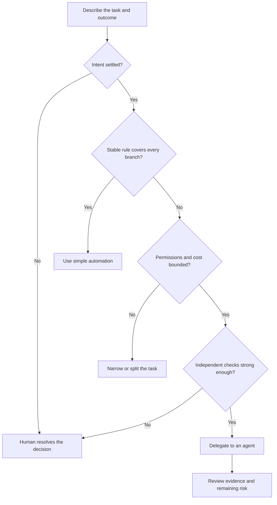

<TLDR>
  <TLDRCell label="what">
    智能体使用边界是在执行开始前，用来选择智能体委托、简单自动化或人工主导处理的规则。
  </TLDRCell>
  <TLDRCell label="trap">
    一项任务看似常规，却可能隐藏有争议的意图、敏感访问、无上限成本，或者无人能独立验证的结果。
  </TLDRCell>
  <TLDRCell label="fix">
    选择能够可靠完成任务的最低能力方式；只有范围、权限、预算和检查都明确时，才升级为智能体处理。
  </TLDRCell>
</TLDR>

## 是什么，为什么存在

智能体使用边界是决定一项任务可以获得多大自主权的分界点。一侧是适合编程智能体的任务：目标已经确定、权限受到约束、结果可以检查。另一侧则是由人直接处理或用小型确定性程序完成更安全的任务。

边界取决于任务与环境，而不是模型看起来多么能干。即使模型能力很强，仍可能优化错误理解、通过获准工具暴露敏感数据、长时间探索，或者生成难以观察其正确性的改动。模型能力再强，也补不上缺失的决策或测试预言机。

人工主导处理是指由负责任的人作出后果重大的判断或执行敏感步骤。搜索、格式化、计算或起草工作仍可使用工具辅助。关键在于，不能把尚未解决的决策悄悄交给模型。

简单自动化是指普通代码遵循稳定且完整指定的规则。格式化器、模式验证器、代码修改器或固定的数据转换，通常比智能体更便宜，也更容易测试。如果所有分支都能预先写清，自适应循环只会增加变化，不会带来有用的判断力。

智能体委托适合两者之间的地带。预期结果很明确，但在代码库中找到实现路径需要搜索、工具调用和根据反馈纠错。具有复现方式、指定文件和验收测试的缺陷通常很合适；决定一项有争议的产品策略应该表达什么则不合适。

在向编程工具授予访问权、把人工流程转成自动化，以及委托任务请求扩大权限时，你都会遇到这种选择。证据变化后还要重新评估。原本安全的探索任务，一旦下一步需要发送数据、修改生产状态或作出未记录的业务决策，就可能越过边界。

### 三种方式，不同责任

| 方式 | 最适合的情况 | 主要控制来源 | 典型完成证据 |
| --- | --- | --- | --- |
| 人工主导处理 | 意图含糊或后果重大的判断 | 负责任的人 | 记录在案的决策与独立审查 |
| 简单自动化 | 对结构化输入执行稳定规则 | 确定性代码 | 精确断言与可重复输出 |
| 智能体委托 | 有反馈的受限搜索与修改 | 权限策略与验证器 | 审查后的差异与指定检查 |

这三种方式可以组合。人可以确定策略，确定性脚本可以迁移记录，智能体可以为改动准备测试或文档。应当按责任边界拆分任务，而不是强迫一种方式承担整个工作流。

良好的边界还要指定交接制品及其验收人。如果没有这种所有权，候选结果在工具之间流转时，就可能被误认为已经获准的结果。

这种选择不是永久不变的。一旦人解决歧义，并用示例把规则编码下来，后续案例就可能转成确定性自动化。代码库具备可靠测试和隔离工作区后，过去必须手工完成的维护任务也可能适合交给智能体。

## 工作原理

要在智能体看到机密或获得写权限之前作出选择。评估四个信号：不确定性、敏感性、成本暴露和验证强度。任何一个维度上的严重问题，都足以要求缩小任务或改用其他方式。



这张图是筛选流程，并不是能用总分抵消红线的评分表。如果客户意图仍有争议，较低的 token 成本也不会让决策变得适合委托。如果无法检查结果，严格的文件系统权限同样不能让自主修改变得可信。

### 不确定性：未知的是什么

要区分路径不确定性（route uncertainty）与结果不确定性（outcome uncertainty）。路径不确定性是目的地已达成共识，但实现路线未知，例如不知道哪个解析器负责失败行为。智能体适合处理这种情况，因为它可以搜索、检查、修改，并根据测试作出反应。

结果不确定性是合理的利益相关者可能对成功标准持不同意见。例如，决定是否允许退款例外、判断一条安全警告是否可以接受，或者在没有获准调用方的情况下设计公开 API。模型可以提出选项，但必须由负责任的人确定决策，之后才能自主实现。

把不确定性写成明确问题。「哪个模块验证这个标头？」可以通过代码库证据查明。「企业客户是否应绕过这个限制？」需要产品负责人授权，仅靠搜索代码库无法解决。

不确定性可以缩小，但未必会消失。如果调查找到了两个可能的责任模块，却无法区分，下一步应当进行聚焦观察或请求人工决策，而不是获准猜测。

### 敏感性：任务可能暴露或改变什么

敏感性既包括信息，也包括效果。凭据、客户私有数据、未发布的财务结果和受监管记录会产生暴露风险。生产写入、资金转移、账户删除、对外消息和公开发布即使输入数据普通，也会产生后果风险。

采用<Term id="least-privilege">最小权限（least privilege）</Term>：只暴露当前受限步骤所需的资源与操作。读取夹具不需要访问整个主目录。运行单元测试也不需要网络访问或部署凭据。

只有显示真实操作时，<Term id="approval-gate">审批门（approval gate）</Term>才有用。如果命令能够发布软件包或上传文件，只问「允许命令吗？」就过于含糊。审查者需要看到目标、参数、工作目录、预期效果和恢复路径。

有些步骤即使带审批对话框，仍应只由人执行。如果审批者无法检查载荷、理解效果或逆转错误，审批就很薄弱。此时应把操作缩减为可审查产物，再由人通过常规受控界面执行最后动作。

敏感性同样适用于输出。即使原文件从未离开获准目录，日志、补丁、截图和错误报告仍可能复制其中的机密。

### 成本：什么可能增长或重复

成本包括模型用量、经过时间、工具调用、外部 API 费用、计算资源和审查者注意力。便宜的第一步可能进入昂贵的重试循环。要限制整个运行和各个工具，并定义达到上限后的处理方式。

当解释、监督和审查智能体的成本高于直接完成小任务时，使用智能体的收益很差。修复已知行中的明确拼写错误，几乎不需要全库探索。反过来，在大量陌生文件中进行范围受限的搜索，即使最后补丁很小，也可能值得使用智能体。

成本也包括机会成本。长时间运行的智能体若占用数据库沙箱，或反复调用受速率限制的服务，就可能阻塞其他工作。任务契约应指定稀缺资源、并发限制和停止条件，而不是把 token 预算当作唯一限制。

预算还应包括失败处理。反复重试同一次被拒绝的调用或结果未变的测试，只会消耗资源而不会提供新信息，此时应触发停止条件。

### 验证：怎样知道任务成功了

强验证独立于智能体的解释，直接观察承诺的结果。例如回归测试、模式验证器、转换记录的精确比较、编译器结果，或者限制在允许路径内并经过审查的差异。检查必须能够拒绝一种看似合理但实际错误的方案。

弱验证只检查外观或自我报告。「代码看起来整洁」「智能体说所有案例都通过了」以及「命令打印了一些绿色文字」都不能证明所需行为。要保留命令、工作目录、退出状态、标准错误和跳过的检查。

通过的检查有其作用范围。单元测试不能证明迁移适用于真实数据分布，类型检查器也不能证明授权策略正确。把每条验收标准映射到相应证据，并把未覆盖的主张保留为人工审查项。

当验收标准确实依赖判断时，人工审查也可以成为有效证据，但必须记录审查者及其检查的材料。只有一个「已审查」标记，仍然是无依据的主张。

### 一张实用决策表

<Term id="decision-table">决策表（decision table）</Term>可以让选择保持一致，又不会假装所有风险都能用数字精确表示。应评估实际步骤，而不是宽泛的项目标签。「更新计费系统」过于粗略；「在空的本地数据库中生成候选 SQL 迁移」才足够具体，能够分类。

| 信号 | 可以考虑智能体 | 优先选择简单自动化 | 保持人工主导或先缩小范围 |
| --- | --- | --- | --- |
| 不确定性 | 路径未知，结果已定 | 没有实质不确定性 | 结果或策略有争议 |
| 敏感性 | 数据隔离且写入可逆 | 固定的低风险输入与输出 | 机密、个人数据、不可逆效果 |
| 成本 | 时间、步骤和费用均有硬上限 | 重复规则用代码更便宜 | 无边界搜索或昂贵外部调用 |
| 验证 | 独立检查能够拒绝错误工作 | 精确预言机覆盖所有分支 | 验收证据主观或缺失 |

不要计算各列的平均值。三个有利信号也不能抵消一次不可逆的生产操作。持续拆分任务，直到每个部分都有一个责任人、一套权限范围、一项预算和一个可检查的交接结果。

### 运行中的升级处理

最初的分类可能过时。新文件可能暴露个人数据，请求的命令可能需要联网，测试之间可能互相冲突，智能体也可能耗尽重试预算。应把这些观察当作边界事件，不能借此临时扩大权限。

执行前先定义升级触发条件。所需意图缺失、请求资源超出范围、证据与任务矛盾、必须产生破坏性效果，或者成本达到上限时，都应停止。把观察结果和最小的未决问题交给人。

升级处理应保留有用工作。候选差异、失败测试记录、已检查路径列表和被拒绝调用的完整内容，可以帮助人作出决定而无需重复所有探索。不能用笼统的「需要审批」消息掩盖已经发生的局部副作用。

## 示例

下面的示例使用确定性 JavaScript，让边界逻辑可见且可重复。生产工作流可能从表单、策略服务和测试运行器中收集这些事实，但最终授权与验证规则仍应位于模型生成的文字之外。

### 选择能力最低的方式

第一个分类器使用几项明确事实。它把范围受限的代码库重命名交给智能体，把稳定的批量规则交给普通代码，并把敏感且有争议的决策交给人。

<Depth level="quick">

```javascript run title="boundary_decision.js"
const tasks = [
  {
    name: "rename internal helper",
    bounded: true, check: "tests", stableRule: false,
    sensitive: false, reversible: true,
  },
  {
    name: "normalize 800 CSV headers",
    bounded: true, check: "row comparison", stableRule: true,
    sensitive: false, reversible: true,
  },
  {
    name: "decide disputed refund",
    bounded: false, check: "manager judgement", stableRule: false,
    sensitive: true, reversible: false,
  },
];

function chooseMethod(task) {
  if (task.sensitive || !task.reversible || !task.bounded) return "human-led";
  if (task.stableRule) return "simple automation";
  if (task.check !== "weak") return "agent";
  return "human-led";
}

for (const task of tasks) {
  console.log(`${task.name}: ${chooseMethod(task)}`);
}
```

```text
rename internal helper: agent
normalize 800 CSV headers: simple automation
decide disputed refund: human-led
```

<TryToBreak items={['测试断言了错误行为的可逆任务', '把个人数据发送给外部服务的固定规则', '没有重试预算的智能体任务']} />

</Depth>

条件的顺序很重要。`stableRule` 不能覆盖敏感、不可逆或目标没有边界的问题。因此，这个分类器比较保守：团队必须先缩小这些风险，才能进入成本更低的自动化分支。

对象字段只是关于证据的主张，不会因为代码为其命名就自动成为事实。在真实接收流程中，要询问每项主张由谁确定、依据是什么。错误的 `sensitive: false` 标签，可能让危险任务通过一个本身正确的分类器。

### 强制执行权限范围

安全提示词不能替代宿主策略。这个示例只允许访问两个代码库文件和一条指定测试命令，并且禁止网络访问。未知工具与目标都会失败关闭（fail closed）。

```javascript run title="permission_envelope.js"
const policy = {
  read: new Set(["src/pricing.js", "test/pricing.test.js"]),
  write: new Set(["src/pricing.js", "test/pricing.test.js"]),
  commands: new Set(["npm test -- pricing"]),
  network: false,
};

const calls = [
  { tool: "read", target: "src/pricing.js" },
  { tool: "read", target: ".env" },
  { tool: "command", target: "npm test -- pricing" },
  { tool: "command", target: "npm publish" },
  { tool: "network", target: "https://example.com/upload" },
];

function authorize(call) {
  if (call.tool === "read") return policy.read.has(call.target);
  if (call.tool === "write") return policy.write.has(call.target);
  if (call.tool === "command") return policy.commands.has(call.target);
  if (call.tool === "network") return policy.network;
  return false;
}

for (const call of calls) {
  const verdict = authorize(call) ? "ALLOW" : "DENY";
  console.log(`${verdict} ${call.tool} ${call.target}`);
}
```

```text
ALLOW read src/pricing.js
DENY read .env
ALLOW command npm test -- pricing
DENY command npm publish
DENY network https://example.com/upload
```

虽然测试和其他命令都通过同一个工具到达，策略仍能区分两者。它还会拒绝恰好位于代码附近的凭据文件。模型即使声称被拒绝的操作必不可少，也无法扩展这些集合。

真实的路径策略必须解析绝对路径、父目录片段和符号链接，之后才能证明包含关系。真实的命令策略应传递结构化的可执行文件与参数数组，而不是比较 shell 字符串。这些实现细节会强化此处展示的同一条边界。

### 要求完成证据

最后一个示例把完成定义为所有必需观察的合取。其中一次运行虽然提供了看似合理的通过测试，却缺少红绿回归证据和范围检查，因此必须返回人工审查。

```javascript run title="verification_gate.js"
const required = [
  "target test passes",
  "regression test failed before fix",
  "changed paths stay in scope",
];

const runs = [
  {
    name: "plausible summary only",
    evidence: new Set(["target test passes"]),
  },
  {
    name: "bounded verified change",
    evidence: new Set(required),
  },
];

function evaluate(run) {
  const missing = required.filter((claim) => !run.evidence.has(claim));
  return {
    decision: missing.length === 0 ? "ACCEPT" : "HUMAN REVIEW",
    missing,
  };
}

for (const run of runs) {
  const result = evaluate(run);
  console.log(`${run.name}: ${result.decision}`);
  console.log(`missing: ${result.missing.join(", ") || "none"}`);
}
```

```text
plausible summary only: HUMAN REVIEW
missing: regression test failed before fix, changed paths stay in scope
bounded verified change: ACCEPT
missing: none
```

这个集合会记录证据是否存在，但生产交付门还必须验证证据来源。模型写出的测试通过字符串，不等于宿主捕获的进程结果。每项主张都应附带确切命令、版本、环境、退出码和输出引用。

这个交付门也说明了任务为何可能需要保持人工主导。如果没有独立检查能够表示预期行为，增加更多智能体步骤也不会让验收决策变得客观。必须由人审查结果，或者先把意图转成可执行规格。

## 陷阱

### 委托尚未解决的决策

> [!PITFALL]
> 提示词要求智能体「选择最佳行为」，但利益相关者尚未就规则达成一致。智能体把缺失的产品授权变成了看似合理的实现，而通过的测试只是在编码它自己的猜测。

**修复方法：** 把决策工作与实现工作分开。先由负责任的人批准示例、反例和边界结果，再按这些固定预期委托编码。

### 用智能体执行固定转换

> [!PITFALL]
> 一项完整指定的重命名或行转换被交给智能体循环。尽管短小的确定性程序可以表达全部规则，结果却在不同运行间变化、消耗审查时间，还可能修改无关文件。

**修复方法：** 直接编写代码修改器、格式规则、查询或验证脚本。如果有帮助，可以让智能体协助起草，但实际自动化应当运行经过审查的确定性产物。

### 把提示词指令当成权限

> [!PITFALL]
> 提示词写着「不要读取机密」，但进程可以读取凭据并使用网络。错误的工具调用或提示词注入仍可能导致<Term id="data-leakage">数据泄漏（data leakage）</Term>，因为文字不能撤销能力。

**修复方法：** 在宿主或沙箱中强制执行文件系统、命令、网络和凭据边界。测试禁止调用，并要求系统无论模型多么自信地提出请求都必须拒绝。

### 批准操作类别而非具体操作

> [!PITFALL]
> 审查者在看不到完整参数与目标时就批准「终端访问」或「写入」。这种批准悄悄覆盖了后果完全不同的操作，包括发布、删除和写入预期工作区之外。

**修复方法：** 只显示并授权一项确切操作或一条严格的可复用规则。包括工作目录、解析后的资源、外部目标、预期副作用，以及是否能够恢复。

### 把模型信心算作验证

> [!PITFALL]
> 智能体报告改动安全且所有测试通过，但记录中缺少命令、退出码、跳过项和审查后的差异。信心和流畅表达被当成了环境证据的替代品。

**修复方法：** 根据宿主捕获的观察和明确审查得出完成状态。证据缺失、截断、超时或互相矛盾时应失败关闭，并指出哪项主张仍未验证。

### 忽略监督预算

> [!PITFALL]
> 一项很小的任务触发了宽泛探索、反复重试和冗长审查。智能体虽然完成了任务，但总注意力与计算成本超过直接处理，而且没有产生可复用的自动化。

**修复方法：** 开始前限制步骤数、时间、费用和审查工作量。低于这个阈值时优先直接处理；稳定工作反复出现时，改用行为可复用的确定性工具。

## AI 时代

**生成代码在这里容易出什么错**

生成的编排代码经常接受模型自己提供的风险标签，或者用加权分数让低成本抵消安全红线，还可能默认允许未知情况。它可能不解析链接就比较路径字符串，把任意 shell 命令归入「测试」标签，信任自报验证，并在发生局部副作用后继续重试。另一个常见错误是，在唯一预言机只能依靠人的主观判断时，仍把最终决策自动化。

**让 AI 检查什么**

要求 AI 把所有未解决的结果决策与实现问题分开列出，并说明解决每个问题所需的代码库证据或负责人。要求它枚举确切的读取、写入、命令、网络、凭据和外部效果能力，再为每条边界构造一次禁止调用。还要让它把每项完成主张映射到宿主捕获的检查，并将无证据主张标为人工审查。

**审查清单**

- 确认预期结果已经获准，而且每个后果重大的步骤都有具名的责任人。
- 对路径、命令、网络目标、预算和重试执行拒绝案例；未知输入必须失败关闭。
- 把每项验收主张与独立证据对应，检查完整差异，并记录仍需人工判断的部分。

**提示词词汇**

使用「结果不确定性（`outcome uncertainty`）」「路径不确定性（`route uncertainty`）」「权限范围（`permission envelope`）」「最小权限（`least privilege`）」「审批门（`approval gate`）」「可逆性（`reversibility`）」「失败关闭（`fail closed`）」「验证预言机（`verification oracle`）」「成本上限（`cost ceiling`）」「停止条件（`stop condition`）」和「人工主导交接（`human-led handoff`）」。这些词能让模型区分未知的实现路线与尚未解决的决策，并要求模型返回证据而非安抚性结论。

<Depth level="deep">

## 预期损失与不对称错误

边界可以保持保守，而不必给每项任务强行指定虚假的精确分数。可以从潜在失败、暴露范围、可检测性和恢复能力来思考。重要的比较不是笼统的「智能体准确率与人类准确率」，而是对当前步骤而言，在实际可执行控制下每种方式的预期损失。

有些错误是不对称的。把常规任务错误地送交人工审查只会消耗时间，让智能体错误地发布私有数据却可能无法逆转。当负面后果相差几个数量级时，应把不确定分类默认放在更安全的一侧，并要求更强证据才能跨过边界。

各个风险维度并不独立。敏感数据加网络访问会形成外泄路径；弱验证加不可逆写入会让恢复希望渺茫；无上限重试加付费 API 会成倍增加成本。简单求和会掩盖这些相互作用，因此策略应包含硬性禁令，以及必定要求升级处理的组合。

### 可逆性需要经过测试的恢复路径

声称改动可逆，并不会让它真的可逆。回滚可能丢失迁移后写入的数据，电子邮件无法撤回，删除分支也不能撤回已发布软件包。应记录补偿操作、所需备份、责任人和最长恢复时间。

恢复测试应使用与执行相同的边界。如果智能体只能修改隔离 worktree，丢弃该 worktree 就是可信的恢复路径。如果它可以修改共享生产数据，一段未经测试的备份脚本并不等同于可逆性。

应优先产生制品，之后才产生效果。让智能体生成差异、迁移计划、候选消息或结构化清单供人审查，再使用更严格的机制执行后果重大的动作。这样既保留智能体的探索价值，又把最终权限留在合适的边界。

### 委托前的信息价值

有时正确的第一步既不是完整委托，也不是直接完成。只读调查可以降低路径不确定性、估算受影响记录，或者发现真正必要的权限。调查输出应是一份精简证据包，不能成为默认继续执行修改的请求。

这种调查需要限制时间并禁止副作用。结束后，根据新发现再次分类任务。如果意图仍有争议，继续探索代码库的边际收益已经很低，交接时应明确指出需要人作出的具体决策。

### 边界测试就是策略测试

用相邻案例测试选择器：同一任务包含或不包含个人数据、可逆本地写入与对外发布、精确预言机与目视检查、有限重试与无上限重试。这些成对案例能揭示究竟哪项事实改变了决策。

还要测试错误元数据。调用方可能漏填敏感性标签，声称一项弱检查很强，或提供解析后位于工作区外的相对路径。未知和互相矛盾的字段应阻止执行，不能落入宽松默认分支。

策略决策应当可观察。记录策略版本、规范化输入、选定方式、被拒绝能力、审批、预算消耗和完成证据，但不要记录机密。这份记录能支持审查，也能在错误批准或不必要升级反复出现时帮助调整边界。

</Depth>

<Checkpoint id="ai-era/agent-use-boundaries" />

## 延伸阅读

- [NIST AI 风险管理框架 Playbook](https://airc.nist.gov/airmf-resources/playbook/)
- [GitHub 文档：负责任地使用 Copilot 智能体](https://docs.github.com/en/copilot/responsible-use/agents)
- [Claude Code 文档：安全](https://code.claude.com/docs/en/security)
- [Google SRE：Google 的自动化实践](https://sre.google/sre-book/automation-at-google/)
