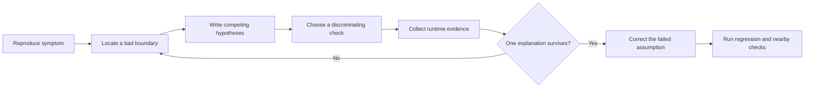

<TLDR>
  <TLDRCell label="what">
    AI-assisted debugging uses a model to propose explanations and useful probes while runtime evidence decides which explanation survives.
  </TLDRCell>
  <TLDRCell label="trap">
    A plausible patch can hide the symptom without finding the failed assumption, especially when the AI sees only an error message or one happy-path input.
  </TLDRCell>
  <TLDRCell label="fix">
    Reproduce first, list competing hypotheses, change one condition at a time, and require a regression check that fails before the fix and passes after it.
  </TLDRCell>
</TLDR>

## What it is and why it exists

AI-assisted debugging is a disciplined pairing workflow. You use an AI assistant to read unfamiliar paths, enumerate possible causes, suggest instrumentation, and turn observations into the next experiment. The assistant supplies search breadth and candidate explanations; the running program supplies the verdict.

The object of debugging is the failed assumption behind an observed symptom. A timeout might come from a slow dependency, a retry loop, a deadlock, or a clock error. Replacing the timeout value can make the alert disappear while leaving every one of those causes unresolved.

Generated fixes often jump straight from symptom to edit because that pattern is rewarded in ordinary code conversations. The model recognizes an error shape and produces a familiar patch, but it hasn't necessarily observed the relevant state, timing, input, or caller. A fluent answer can make that uncertainty easy to miss.

Treat a hypothesis paired with a check that could refute it as the useful unit of work. A strong pair says, "If the retry limit is ignored only for server errors, this four-case matrix will separate the limit logic from the counter logic."

You meet this workflow when a test fails, production telemetry contradicts local behavior, a generated change breaks an edge case, or a regression appears somewhere in a large commit range. It also works for slow requests and resource leaks, provided the evidence comes from the affected execution model rather than a simplified story about it.

### Symptom, cause, and contributing condition

A symptom is what you can observe: the wrong value, an exception, excess latency, or changed state. A root cause is the defect or violated contract that explains why the symptom occurs under the relevant conditions. A contributing condition makes the failure easier to trigger but isn't sufficient by itself.

For example, a mixed-case HTTP header may trigger a tenant lookup bug. The request is the trigger, but the violated <Term id="api-contract">API contract</Term> is case-insensitive header handling. Lowercasing a fixture without fixing the reader removes the trigger from one test and preserves the defect.

"Root cause" doesn't have to mean one dramatic line. It may be an interaction between a stale cache key and missing invalidation, or between a race and an undocumented ownership rule. The explanation is adequate when it predicts the failure, survives counterexamples, and identifies the contract that the correction restores.

### Division of labor in the pair

Give the AI work that benefits from fast enumeration: find callers, compare a passing path with a failing one, name variables worth logging, or list assumptions embedded in a branch. Ask it to state uncertainty and what evidence would change its view.

Keep evidence collection explicit. Run the command, capture the input and environment, inspect the actual stack, and decide whether a probe is safe in that environment. An AI summary of a trace is an interpretation; the trace remains the source.

The human also owns product intent. If the code and tests disagree about whether attempt `3` is allowed, repository search may reveal both conventions without deciding which one the business wants. Record that ambiguity instead of letting the model silently choose the most common convention.

## How it works

Start with a stable reproduction or the closest observable failure boundary. Record the exact command or request, runtime version, configuration, seed, and expected versus actual result. If the issue can't be reproduced locally, preserve production evidence and state which parts of the environment remain unmatched.

Then move through a short loop: localize the first known-bad boundary, form competing hypotheses, select a discriminating check, run it, and update the hypothesis set. Only after one explanation accounts for the evidence do you design a correction. Verification reruns the original reproduction and looks for collateral behavior changes.



The loop can move backward. A probe may reveal that the reported symptom combines two failures, or that the fixture never reaches the suspected branch. Returning to localization is progress because a disproved assumption narrows the search.

### Build an evidence packet

Before asking the AI for causes, provide a compact evidence packet. Include observed behavior, expected behavior, the smallest reproduction you trust, the failing stack or assertion, recent relevant changes, and constraints on what may be executed. Label facts separately from guesses.

An evidence packet should preserve exact values when they matter. "The request had a tenant header" loses the capitalization that explains the failure. "It fails around the retry limit" loses the status code that distinguishes operator grouping from an off-by-one attempt counter.

Use a small ledger during the investigation:

| Item | Example | Status |
| --- | --- | --- |
| Observation | `503` retries at attempt `3` | Measured |
| Hypothesis | attempt count starts at zero | Unproven |
| Check | compare `429` and `503` at attempts `2` and `3` | Ready |
| Result | boundary affects only `429` | Measured |
| Implication | grouping, not counter origin, explains the split | Supported |

This format stops a model-generated inference from being copied into the next prompt as if it were a measurement. It also gives another developer enough context to resume without replaying the whole conversation.

### Prefer competing hypotheses

Ask for at least two explanations that make different predictions. If every hypothesis predicts the same check result, the check can't distinguish them. "Add more logging" is incomplete until the request names the boundary and says how each outcome changes the diagnosis.

A useful hypothesis has four parts:

1. The suspected failed assumption.
2. The mechanism connecting it to the symptom.
3. A predicted observation under the failing case.
4. A counterexample or check that could disprove it.

Avoid large speculative lists. Ten shallow guesses invite random edits and exhaust attention. Keep a few live hypotheses, remove the ones contradicted by evidence, and add a new one only when an observation needs another explanation.

### Design a discriminating check

A discriminating check holds most conditions constant while changing one factor on which the hypotheses disagree. This can be an input pair, a temporary assertion, a <Term id="breakpoint">breakpoint</Term>, a focused log field, a trace span, or a revision bisection. The cheapest safe check that splits the hypothesis set is usually the best next move.

Good checks observe boundaries. Compare the value before and after parsing, the arguments at a caller and callee, the cache key and returned entry, or state immediately before and after a transaction. Once one side is correct and the other is wrong, the causal search has a smaller region.

Change one explanatory factor when possible. If you change the runtime, fixture, feature flags, and implementation together, a passing result says little about which change mattered. When the environment forces several changes, record them and treat the result as weaker evidence.

### Separate localization from repair

Instrumentation and temporary assertions answer where behavior first diverges. A repair answers how the contract should be restored. Combining them in one generated patch makes it hard to tell whether the diagnosis was right or the edit merely altered the reproduction.

Ask the AI for a no-fix investigation patch first when the fault is unclear. Review every probe for secrets, volume, timing effects, and cleanup. After collecting the evidence, remove or convert temporary probes before preparing the final change.

The final proof is asymmetric. A new regression check should fail against the faulty implementation for the expected reason, then pass against the correction. Nearby tests and review are still needed because one check proves only the behavior it asserts.

## Examples

The examples use deterministic JavaScript programs so the evidence can be reproduced without a model service. Each program represents a question you could ask an AI pair, but the printed observations come from Node 24 rather than from the assistant's prediction.

### Splitting retry hypotheses with a matrix

A generated retry policy keeps retrying server errors at the configured limit. Two plausible explanations are an off-by-one attempt counter and operator grouping that applies the limit only to status `429`. Varying status and attempt independently separates them.

<Depth level="quick">

```javascript run title="retry_matrix.mjs"
const MAX_ATTEMPTS = 3;

function generatedShouldRetry({ status, attempt }) {
  return status >= 500 || status === 429 && attempt < MAX_ATTEMPTS;
}

const probes = [
  { status: 429, attempt: 2 },
  { status: 429, attempt: 3 },
  { status: 503, attempt: 2 },
  { status: 503, attempt: 3 },
];

for (const probe of probes) {
  const result = generatedShouldRetry(probe);
  console.log(`status=${probe.status} attempt=${probe.attempt} retry=${result}`);
}
```

```text
status=429 attempt=2 retry=true
status=429 attempt=3 retry=false
status=503 attempt=2 retry=true
status=503 attempt=3 retry=true
```

<TryToBreak items={['status 500 at attempt 3', 'status 429 at attempt 0', 'a non-retryable status at attempt 2']} />

</Depth>

The attempt boundary changes the `429` result but not the `503` result. That observation contradicts a general counter-origin explanation: the same counter reaches both branches. It supports the grouping hypothesis because `&&` binds more tightly than `||`, leaving `status >= 500` outside the attempt condition.

The contract still has to settle whether `attempt` means attempts already made or the next attempt number. Once that name is defined, the fix can group all retryable statuses with parentheses and apply the limit once. The four cases should become a table-driven regression test rather than disappearing after the edit.

### Probing a conversion boundary

An inventory import turns a legitimate stock count of zero into the default `100`. The AI suggests that the CSV parser may be dropping the field, while another hypothesis says a truthiness fallback conflates zero with invalid input. Logging the raw, converted, and returned values at one boundary distinguishes them.

```javascript run title="inventory_probe.mjs"
function importedStock(row) {
  return Number(row.stock) || 100;
}

const rows = [
  { sku: "chair", stock: "12" },
  { sku: "lamp", stock: "0" },
  { sku: "desk", stock: "bad" },
  { sku: "shelf", stock: "" },
];

for (const row of rows) {
  const parsed = Number(row.stock);
  const parsedLabel = Number.isNaN(parsed) ? "NaN" : String(parsed);
  console.log(
    `sku=${row.sku} raw=${JSON.stringify(row.stock)}` +
      ` parsed=${parsedLabel} result=${importedStock(row)}`,
  );
}
```

```text
sku=chair raw="12" parsed=12 result=12
sku=lamp raw="0" parsed=0 result=100
sku=desk raw="bad" parsed=NaN result=100
sku=shelf raw="" parsed=0 result=100
```

The raw value for `lamp` is present and converts to numeric zero, so the missing-field hypothesis is false for that row. The divergence occurs between conversion and return: `0`, `NaN`, and an empty string's converted zero all take the same `||` fallback. The probe has found a collapsed distinction, not merely a suspicious line.

The correction depends on the import contract. Missing text, invalid numeric text, and a valid zero may each need different handling, so replacing `||` with `??` isn't automatically correct: `Number("bad")` produces `NaN`, not `null` or `undefined`. Ask the AI to write the input categories and desired outcome before it edits the expression.

### Making the regression check reject the patch

A tenant reader works in a local fixture whose header names are lowercase, but a production-style mixed-case name returns the public tenant. The generated implementation and correction are run against the same three cases. The check must reject the first function before its passing result counts as evidence for the second.

```javascript run title="regression_check.mjs"
import assert from "node:assert/strict";

function generatedTenant(headers) {
  return Object.fromEntries(headers)["x-tenant-id"] ?? "public";
}

function correctedTenant(headers) {
  const normalized = headers.map(([name, value]) => [name.toLowerCase(), value]);
  return Object.fromEntries(normalized)["x-tenant-id"] ?? "public";
}

const cases = [
  { name: "lowercase header", headers: [["x-tenant-id", "acme"]], expected: "acme" },
  { name: "mixed case header", headers: [["X-Tenant-ID", "acme"]], expected: "acme" },
  { name: "missing header", headers: [["accept", "application/json"]], expected: "public" },
];

function verify(label, reader) {
  try {
    for (const testCase of cases) {
      assert.equal(reader(testCase.headers), testCase.expected, testCase.name);
    }
    console.log(`${label}: PASS ${cases.length} cases`);
  } catch (error) {
    console.log(`${label}: FAIL ${error.message.split("\n")[0]}`);
  }
}

verify("generated", generatedTenant);
verify("corrected", correctedTenant);
```

```text
generated: FAIL mixed case header
corrected: PASS 3 cases
```

The failing label shows that the new case reaches the intended distinction. If both implementations passed, the check wouldn't reproduce the bug; if both failed, the proposed correction wouldn't restore the stated contract. This before-and-after pattern protects against a test that is green but irrelevant.

The small suite also preserves the existing lowercase behavior and the missing-header default. Those nearby cases don't prove every header rule, such as duplicates, whitespace, or non-string names. They make the correction's current evidence boundary explicit, which is more useful than claiming the reader is fully correct.

## Pitfalls

### Asking for a fix before a reproduction

> [!PITFALL]
> Pasting an exception into a chat and asking "fix this" encourages the model to match the error to a familiar edit. The returned patch may suppress the exception, change the fixture, or add a fallback without showing that it affects the original failing execution.

**Fix:** give the exact reproduction and expected result, then ask for competing hypotheses and one read-only or instrumentation-only check. Don't request an implementation change until the evidence localizes a violated assumption.

### Treating the AI's explanation as evidence

> [!PITFALL]
> A model can quote a line of code and produce a convincing causal story without observing its runtime value or whether the path executed. Repeating that story in later prompts gradually turns an inference into an apparent fact.

**Fix:** label notes as observation, inference, or open question. Preserve commands, inputs, outputs, stack frames, and trace identifiers. Ask the AI to cite which observation supports each causal step and what result would refute it.

### Changing several variables in one experiment

> [!PITFALL]
> Updating a dependency, simplifying the fixture, disabling a feature flag, and editing the suspect branch in one run can make the symptom vanish. The run doesn't tell you which change mattered, so reverting or porting the fix remains guesswork.

**Fix:** compare the smallest pair that differs on one predicted factor. If operational constraints force a bundled change, follow with narrower checks and state that the first result only localized a region.

### Adding noisy or unsafe instrumentation

> [!PITFALL]
> Generated debug logs often dump whole request objects, tokens, customer data, or large collections. Extra logging can also change timing, consume storage, or make a race stop reproducing.

**Fix:** log named fields at one boundary, redact sensitive values, bound collection sizes, and attach a correlation identifier. Review where logs go and how long they persist. For timing-sensitive defects, prefer existing traces or low-overhead counters and note the probe effect.

### Stopping when the first hypothesis fits

> [!PITFALL]
> One passing check can be consistent with several causes. A cache clear, for example, may temporarily fix stale data whether the defect lies in the key, invalidation, or cache ownership.

**Fix:** test a counterexample that the leading hypothesis predicts differently from its nearest rival. Require the explanation to account for both failing and passing cases, then use a regression check that proves the proposed correction matters.

### Weakening the oracle to make the patch pass

> [!PITFALL]
> An AI may update an expected value, catch a broad exception, remove an assertion, or increase a timeout. The suite turns green because the definition of success moved, not because behavior returned to the intended contract.

**Fix:** review test changes before implementation changes. Tie expected behavior to an API contract, product decision, or prior passing case. Run the new regression against the old implementation and inspect its failure message before accepting the corrected run.

## In the AI era

**What generated code gets wrong here**

Models often patch the line named by a stack trace even when that line merely detects bad state created earlier. They add broad `try`/`catch` blocks, truthy defaults that erase valid zero values, retries that hide deterministic failures, or normalization in a test fixture rather than at the API boundary. For races, they may add arbitrary delays; for slow code, they may propose caching before measuring which operation is slow.

**Ask your AI to check**

- Build an evidence table with observations, inferences, competing hypotheses, and a result that would refute each hypothesis.
- Trace the first point where a passing and failing execution diverge, naming the exact input, state, caller, and runtime observation at that boundary.
- Design the smallest regression check that fails on the current implementation for the expected reason, then list nearby behavior the correction could disturb.

**Review checklist**

- Confirm the original symptom reproduces with recorded inputs, environment, command, and unedited failure output.
- Check that each diagnostic edit is scoped, safe for its data and timing, and removed or intentionally retained after the investigation.
- Run the regression check before and after the correction, then run relevant broader checks and inspect every test expectation change.

**Prompt vocabulary**

Use `symptom`, `root cause`, `failing assumption`, `competing hypotheses`, `discriminating check`, `counterexample`, `fault localization`, `runtime evidence`, `observation boundary`, `regression oracle`, and `probe effect`. Ask for an evidence ledger and a passing/failing execution comparison; "find the bug" gives the model no standard for separating a guess from a causal explanation.

<Depth level="deep">

## From observations to a root-cause argument

The short loop works because each experiment removes ambiguity. On difficult defects, you also need to judge evidence quality, choose a useful boundary in a long dataflow, and keep nondeterministic observations honest. The goal is a causal argument another developer can challenge and reproduce.

### Draw the causal path

Start at the symptom and walk backward through producers. A rendered wrong price came from a response field; the response came from a serializer; the serializer received a domain value; the domain value came from a rule and its inputs. At each boundary, ask whether the value is already wrong.

This creates a chain of claims rather than a cloud of suspicious files. If the domain value is correct and the serialized field is wrong, pricing rules no longer lead the hypothesis list. If both are correct but the page is wrong, move toward transport, client parsing, and presentation.

The AI can map candidate producers quickly, but dynamic dispatch, generated code, reflection, and configuration may defeat text search. Confirm the actual caller with a stack, trace, debugger, or temporary assertion. A static call graph is a search aid, not proof that a particular edge ran.

When the path crosses service or process boundaries, carry a correlation identifier and compare timestamps carefully. Unsynchronized clocks can make a response appear to precede its request. Prefer duration measured by one monotonic clock over subtracting wall-clock timestamps from different machines.

### Use invariants as intermediate oracles

An end-to-end assertion tells you that the final result is wrong. An invariant states what must remain true at an intermediate boundary, such as "reserved units never exceed available units" or "normalized header names are lowercase." A failed invariant cuts the causal path earlier.

Ask the AI to derive candidate invariants from types, validations, database constraints, and neighboring tests. Review them against product intent before inserting assertions. A plausible but false invariant can redirect the entire investigation.

Temporary assertions should report the smallest useful state. Avoid serializing a whole object graph when an identifier, count, and transition are enough. In production, decide whether violation should stop execution, emit telemetry, or sample a bounded diagnostic event.

A <Term id="characterization-test">characterization test</Term> records current observable behavior when the intended contract is unclear. It prevents accidental drift during investigation, but it doesn't declare the behavior correct. Label it separately from a regression test tied to an approved expectation.

### Compare passing and failing executions

A single failing trace contains many incidental facts. Pair it with the closest passing execution and diff inputs, configuration, branch decisions, external responses, and state transitions. The best pair differs on the condition your leading hypotheses dispute.

Don't ask the AI to summarize two large logs independently and compare the summaries. Important differences can vanish during compression. First extract the same structured fields from both runs, then compare those records and retain pointers to the raw events.

Ordering matters in concurrent traces. A text log ordered by arrival at one collector may not match causal order across workers. Use request identifiers, task identifiers, spans, sequence numbers, or domain transitions before inferring which event caused another.

Negative evidence needs a scope. "No database call occurred" is strong only if the trace captures every database client on the failing path and wasn't sampled. State what the instrument can see, its sampling rule, and any dropped-event indicator.

### Narrow revisions and data separately

When a known-good revision exists, revision bisection can locate the first bad change. The test used by the bisection must return a stable good or bad verdict; flaky outcomes send the search down the wrong half. Build failures may need an explicit skip classification rather than being called bad.

A first bad commit is a localization result, not automatically the root cause. It may expose an older latent defect, change timing, or update a dependency whose behavior violates an unstated assumption. Inspect the behavioral difference and rerun the discriminating check around that change.

Large failing inputs can be reduced in a separate dimension. Remove fields, records, events, or operations while the same failure oracle remains true. Preserve semantic validity, because a smaller input that fails for a new parsing error no longer explains the original symptom.

The AI is useful for proposing reductions and domain-aware partitions. Keep the oracle outside the model, record each accepted reduction, and occasionally rerun the original input. This guards against minimizing toward a different failure with a similar message.

### Handle nondeterministic failures

For a race, intermittent network fault, or resource leak, one pass and one failure are weak evidence. Capture the seed, scheduler controls if available, concurrency level, resource limits, and occurrence count across a stated number of trials. Don't turn a missed reproduction into "fixed."

Repeated trials answer a narrower question: whether the symptom appeared under those conditions. They don't prove absence. Improve the experiment by increasing causal pressure, such as forcing the contested ordering with a barrier, replacing the clock, or controlling the dependency response.

Arbitrary sleeps are poor controls. They lengthen a timing window without proving which ordering occurred and often become flaky regression tests. Ask for a synchronization point that makes the contested state transition observable and deterministic.

Resource failures need lifecycle evidence. For a leak, compare ownership and release events for the same resource rather than only watching total memory. For exhaustion, identify which acquisition lacks a matching release and whether cancellation or exceptions bypass cleanup.

### Account for the probe effect

A debugger pause, console log, profiler, or tracing hook changes execution. Usually the change is harmless; sometimes it hides the race, adds backpressure, or shifts a timeout. Record which probes were active in every result.

If a defect vanishes under a heavy probe, use a lighter signal at the same boundary. Atomic counters, existing span attributes, ring buffers, and sampled identifiers may preserve timing better. Compare a control run with instrumentation enabled but the suspect condition absent.

Generated probes deserve the same code review as generated fixes. Check that they don't evaluate getters with side effects, consume iterators, retain objects, change exception handling, or expose secrets. "Debug only" code still executes.

Remove temporary probes systematically. A small investigation diff or a list of inserted markers helps. If a probe becomes permanent observability, give it stable field names, bounded cardinality, ownership, tests, and a retention policy.

### Test the causal claim

A strong correction changes the mechanism named by the hypothesis and leaves unrelated behavior alone. The regression check proves the old code fails and the new code passes under the same setup. A nearby counterexample helps show that the fix isn't a hard-coded response to one fixture.

For the retry example, grouping retryable statuses under one attempt limit tests the proposed mechanism. Changing `MAX_ATTEMPTS` to a larger number would only move the symptom. For the inventory example, checking zero, missing, empty, and invalid text preserves the distinctions the old fallback collapsed.

Review the correction at the ownership boundary. Normalizing HTTP header names inside one test caller leaves other callers exposed; normalizing at the reader or using a platform API restores the contract once. The narrowest diff isn't always the narrowest correct boundary.

Then run wider checks selected by risk. A parser change needs malformed and compatibility cases; a cache-key change needs isolation and invalidation cases; a concurrency change needs cancellation and cleanup cases. State what remains untested instead of broadening the claim beyond the evidence.

### Keep an auditable handoff

An investigation handoff should be usable without the chat transcript. Record the symptom, reproduction, environment, observations, rejected hypotheses, surviving explanation, diagnostic changes, final diff, and exact verification results. Link raw artifacts when summaries omit detail.

Use precise confidence language. "The check proves this branch received `0` and returned `100`" is stronger and narrower than "the logs confirm the parser is broken." Separate what is directly observed from what is inferred about the system.

If the investigation stops without a root cause, preserve the smallest known-bad boundary and the next discriminating check. "Still broken" wastes the work already done. A bounded uncertainty statement lets another person continue from evidence rather than restart from symptoms.

The AI's final explanation should be treated like a reviewable artifact. Ask it to map each causal claim to an observation, mention contradicted alternatives, and state the correction's evidence boundary. Delete rhetorical certainty that isn't backed by a check.

</Depth>

<Checkpoint id="ai-era/ai-assisted-debugging" />

## Further reading

- [Node.js v24 debugger](https://nodejs.org/docs/latest-v24.x/api/debugger.html)
- [Node.js v24 strict assertion testing](https://nodejs.org/docs/latest-v24.x/api/assert.html)
- [Git documentation: `git bisect`](https://git-scm.com/docs/git-bisect)
- [Google SRE: Effective Troubleshooting](https://sre.google/sre-book/effective-troubleshooting/)
