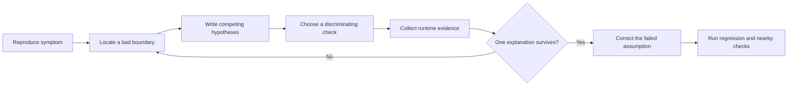

<TLDR>
  <TLDRCell label="what">
    AI 辅助调试让模型提出解释和有效探针，但由运行证据决定哪种解释能留下。
  </TLDRCell>
  <TLDRCell label="trap">
    看似合理的补丁可能只遮住症状，没有找出失效假设；当 AI 只看到错误消息或一个正常输入时尤其如此。
  </TLDRCell>
  <TLDRCell label="fix">
    先复现，再列出相互竞争的假设，每次只改变一个条件，并要求回归检查在修复前失败、修复后通过。
  </TLDRCell>
</TLDR>

## 是什么，为什么存在

AI 辅助调试（AI-assisted debugging）是一套有约束的结对工作流。你让 AI 助手阅读陌生路径、枚举可能原因、建议插桩，并根据观察设计下一项实验。助手负责扩大搜索面并提供候选解释，运行中的程序负责给出判定。

调试的目标是找出可观察症状背后的失效假设。超时可能源于慢依赖、重试循环、死锁或时钟错误。单纯加大超时值可以让告警消失，却没有解决其中任何一个原因。

生成式修复常从症状直接跳到编辑，因为普通代码对话往往奖励这种模式。模型识别出一种错误形状并给出常见补丁，但它未必观察过相关状态、时序、输入或调用方。流畅的答案很容易让人忽略这些不确定性。

应把一个假设与一项能否定它的检查视为有效工作单元。有力的结对建议会说明：「如果只有服务端错误忽略重试上限，这个四用例矩阵就能区分上限逻辑与计数逻辑。」

测试失败、生产遥测与本地行为冲突、生成式改动破坏边界条件，或者回归落在很大的提交区间内时，都可以使用这套工作流。它也适用于慢请求与资源泄漏，但证据必须来自受影响的执行模型，不能只依赖经过简化的故事。

### 症状、原因与促发条件

症状是可以观察的现象，例如错误值、异常、延迟过高或状态改变。根因（root cause）是能解释症状为何在相关条件下出现的缺陷或被违反的约定。促发条件会让失败更容易出现，但它本身不足以构成原因。

例如，大小写混合的 HTTP 标头可能触发租户查询错误。请求是触发因素，真正被违反的<Term id="api-contract">API 约定（API contract）</Term>是标头名称不区分大小写。只在测试夹具中把标头改成小写而不修读取器，只是从一个测试中去掉触发因素，缺陷依然存在。

「根因」不必是一行引人注目的代码。它可能来自过期缓存键与缺失失效机制的交互，也可能来自竞争条件与未记录所有权规则的组合。当解释能够预测失败、经得住反例，并指出修正恢复了哪条约定时，就已经足够。

### 结对双方的分工

把适合快速枚举的工作交给 AI：寻找调用方、比较通过路径与失败路径、列出值得记录的变量，或者找出分支中隐藏的假设。要求它写清不确定之处，以及什么证据会改变当前判断。

证据收集必须明确执行。运行命令，保存输入与环境，检查真实调用栈，并判断探针在该环境中是否安全。AI 对跟踪记录的摘要属于解释，原始跟踪才是来源。

人还要负责产品意图。如果代码与测试对第 `3` 次尝试是否允许存在分歧，仓库搜索可能找到两种惯例，却无法替业务作出决定。应记录这项歧义，不要让模型静默选择最常见的惯例。

## 工作原理

先建立稳定复现，或者找到最接近症状的可观察失败边界。记录确切命令或请求、运行时版本、配置、随机种子，以及期望结果与实际结果。如果本地无法复现，就保留生产证据，并说明环境中还有哪些部分没有匹配。

接着进入一个短循环：定位第一个已知错误的边界，提出相互竞争的假设，选择有区分度的检查，执行检查，再更新假设集合。只有某个解释能覆盖现有证据后，才设计修正。验证阶段要重跑原始复现，并查找行为上的连带变化。



这个循环可以后退。探针可能表明报告中的症状其实合并了两个故障，或者夹具根本没有进入可疑分支。回到定位阶段仍是进展，因为被否定的假设缩小了搜索范围。

### 构建证据包

在让 AI 分析原因前，先提供紧凑的证据包。它应包含观察到的行为、期望行为、可信的最小复现、失败调用栈或断言、近期相关改动，以及可执行操作的约束。事实与猜测要分开标注。

细节会影响原因时，证据包必须保存准确值。「请求带有租户标头」丢掉了能解释失败的大小写信息。「重试上限附近失败」丢掉了能区分运算符分组与尝试次数差一错误的状态码。

调查期间可以维护一份小型账本：

| 项目 | 示例 | 状态 |
| --- | --- | --- |
| 观察 | `503` 在第 `3` 次仍重试 | 已测量 |
| 假设 | 尝试次数从零开始 | 未证明 |
| 检查 | 对比 `429` 与 `503` 在第 `2`、`3` 次的结果 | 待执行 |
| 结果 | 边界只影响 `429` | 已测量 |
| 含义 | 分组方式而非计数起点解释了差异 | 已支持 |

这种格式可以防止模型生成的推断在下一条提示词里被当成测量结果。它也让另一位开发者不必重放整个对话，就能从当前进度继续。

### 保留竞争假设

要求至少给出两个预测不同结果的解释。如果所有假设都预测同一检查结果，这项检查就无法区分它们。「增加日志」并不完整，还要说明观察哪个边界，以及每种输出如何改变判断。

一个可用假设包含四部分：

1. 被怀疑失效的假设。
2. 它与症状之间的作用机制。
3. 在失败用例下预期看到的观察。
4. 能推翻它的反例或检查。

不要列出庞大的推测清单。十个浅层猜测会诱发随机编辑，也会消耗注意力。只保留少量活跃假设，移除与证据冲突的项；只有新观察需要其他解释时，再加入新假设。

### 设计有区分度的检查

有区分度的检查会保持大多数条件不变，只修改各假设预测不一致的一个因素。它可以是一对输入、临时断言、<Term id="breakpoint">断点（breakpoint）</Term>、聚焦于单个字段的日志、跟踪跨度或版本二分。能拆分假设集合且安全成本最低的检查，通常就是最佳下一步。

好的检查会观察边界。比较解析前后的值、调用方与被调用方的参数、缓存键与返回条目，或者事务前后的状态。一旦边界一侧正确而另一侧错误，因果搜索区域就会变小。

可以时，每次只改变一个解释因素。如果同时改变运行时、夹具、功能开关与实现，通过结果并不能说明是哪项变化起作用。环境迫使多项变化一起发生时，要记录这些变化，并把结果视为较弱证据。

### 把定位与修复分开

插桩与临时断言回答行为最早在哪里偏离。修复回答应怎样恢复约定。把二者塞进一个生成式补丁，会让人难以判断诊断是否正确，还是编辑恰好改变了复现条件。

故障不明确时，先让 AI 给出不含修复的调查补丁。逐一审查探针是否涉及秘密、数据量、时序影响和清理。收集完证据后，在准备最终改动前删除临时探针，或者把它转成有意保留的观察设施。

最终证明具有方向性。新的回归检查应在错误实现上按预期原因失败，再在修正后通过。仍要运行附近测试并完成人工审查，因为一项检查只能证明它断言的行为。

## 示例

下面的例子使用确定性 JavaScript 程序，不依赖模型服务也能复现证据。每个程序都代表你可以交给 AI 结对伙伴的问题，但打印出的观察来自 Node 24，不是助手的预测。

### 用矩阵拆分重试假设

一段生成式重试策略在到达配置上限后仍然重试服务端错误。两个合理解释分别是尝试次数差一，以及运算符分组让上限只作用于状态 `429`。分别改变状态码和尝试次数就能区分它们。

<Depth level="quick">

```javascript run title="retry_matrix.mjs"
const MAX_ATTEMPTS = 3;

function generatedShouldRetry({ status, attempt }) {
  return status >= 500 || status === 429 && attempt < MAX_ATTEMPTS;
}

const probes = [
  { status: 429, attempt: 2 },
  { status: 429, attempt: 3 },
  { status: 503, attempt: 2 },
  { status: 503, attempt: 3 },
];

for (const probe of probes) {
  const result = generatedShouldRetry(probe);
  console.log(`status=${probe.status} attempt=${probe.attempt} retry=${result}`);
}
```

```text
status=429 attempt=2 retry=true
status=429 attempt=3 retry=false
status=503 attempt=2 retry=true
status=503 attempt=3 retry=true
```

<TryToBreak items={['状态 500 且第 3 次尝试', '状态 429 且第 0 次尝试', '第 2 次尝试时不可重试的状态']} />

</Depth>

尝试次数边界改变了 `429` 的结果，却没有改变 `503`。这个观察与通用的计数起点解释冲突，因为两条分支使用同一个计数。它支持分组假设：`&&` 的优先级高于 `||`，使 `status >= 500` 没有受到尝试次数条件约束。

约定仍要明确 `attempt` 表示已经完成的次数，还是即将进行的次数。名称含义确定后，修复可以用括号把所有可重试状态分为一组，再统一应用上限。这四个用例应转成表驱动回归测试，而不是编辑结束后就删除。

### 探查转换边界

库存导入程序把合法的零库存变成默认值 `100`。AI 提出 CSV 解析器可能丢失了字段，另一个假设则认为真值回退把零与无效输入混在了一起。在同一边界记录原始值、转换值和返回值，就能区分两者。

```javascript run title="inventory_probe.mjs"
function importedStock(row) {
  return Number(row.stock) || 100;
}

const rows = [
  { sku: "chair", stock: "12" },
  { sku: "lamp", stock: "0" },
  { sku: "desk", stock: "bad" },
  { sku: "shelf", stock: "" },
];

for (const row of rows) {
  const parsed = Number(row.stock);
  const parsedLabel = Number.isNaN(parsed) ? "NaN" : String(parsed);
  console.log(
    `sku=${row.sku} raw=${JSON.stringify(row.stock)}` +
      ` parsed=${parsedLabel} result=${importedStock(row)}`,
  );
}
```

```text
sku=chair raw="12" parsed=12 result=12
sku=lamp raw="0" parsed=0 result=100
sku=desk raw="bad" parsed=NaN result=100
sku=shelf raw="" parsed=0 result=100
```

`lamp` 的原始值存在，而且能转换为数字零，所以缺失字段假设对这一行不成立。偏差发生在转换与返回之间：`0`、`NaN` 和空字符串转换出的零都进入同一个 `||` 回退。探针找到了被压平的区别，不只是一行可疑代码。

修正方法取决于导入约定。缺失文本、无效数字文本与合法零值可能各有不同处理方式，因此把 `||` 换成 `??` 并不必然正确：`Number("bad")` 产生 `NaN`，而不是 `null` 或 `undefined`。应先让 AI 写出输入类别与预期结果，再编辑表达式。

### 让回归检查否决补丁

租户读取器在标头名全为小写的本地夹具中正常工作，但遇到生产形式的大小写混合名称时返回公共租户。生成实现与修正实现使用同样的三个用例运行。检查必须先否决第一个函数，第二个函数的通过结果才能算作证据。

```javascript run title="regression_check.mjs"
import assert from "node:assert/strict";

function generatedTenant(headers) {
  return Object.fromEntries(headers)["x-tenant-id"] ?? "public";
}

function correctedTenant(headers) {
  const normalized = headers.map(([name, value]) => [name.toLowerCase(), value]);
  return Object.fromEntries(normalized)["x-tenant-id"] ?? "public";
}

const cases = [
  { name: "lowercase header", headers: [["x-tenant-id", "acme"]], expected: "acme" },
  { name: "mixed case header", headers: [["X-Tenant-ID", "acme"]], expected: "acme" },
  { name: "missing header", headers: [["accept", "application/json"]], expected: "public" },
];

function verify(label, reader) {
  try {
    for (const testCase of cases) {
      assert.equal(reader(testCase.headers), testCase.expected, testCase.name);
    }
    console.log(`${label}: PASS ${cases.length} cases`);
  } catch (error) {
    console.log(`${label}: FAIL ${error.message.split("\n")[0]}`);
  }
}

verify("generated", generatedTenant);
verify("corrected", correctedTenant);
```

```text
generated: FAIL mixed case header
corrected: PASS 3 cases
```

失败标签表明新用例触发了预期区别。如果两个实现都通过，检查就没有复现缺陷；如果两个都失败，所提修正就没有恢复声明的约定。这种前后对照可以防止测试虽然是绿色，却与问题无关。

这个小型测试集还保留了原有的小写行为与缺失标头默认值。它没有证明重复标头、空白或非字符串名称等所有规则。它明确了当前修正的证据边界，这比宣称读取器已经完全正确更有用。

## 陷阱

### 复现前就要求修复

> [!PITFALL]
> 把异常粘贴到对话中并要求「修复它」，会诱导模型为错误匹配一种常见编辑。返回的补丁可能吞掉异常、修改夹具或增加回退，却没有证明它影响了原始失败执行。

**修复：**提供准确复现与期望结果，再要求相互竞争的假设，以及一项只读检查或仅含插桩的检查。在证据定位到被违反的假设前，不要请求实现改动。

### 把 AI 的解释当成证据

> [!PITFALL]
> 模型可以引用一行代码并给出令人信服的因果故事，却没有观察运行值，也没有确认路径是否执行。后续提示词不断复述这个故事，会逐渐把推断变成看似确凿的事实。

**修复：**把笔记标注为观察、推断或待解问题。保留命令、输入、输出、栈帧和跟踪标识。要求 AI 为每一步因果推断指出对应观察，并说明什么结果能否定它。

### 一次实验改变多个变量

> [!PITFALL]
> 在一次运行中同时更新依赖、简化夹具、关闭功能开关并编辑可疑分支，可能让症状消失。但这次运行无法说明是哪项变化起了作用，所以回退或移植修复时仍要猜测。

**修复：**对比只在一个预测因素上不同的最小输入对。如果操作约束迫使改动捆绑执行，随后补做更窄的检查，并说明第一次结果只定位到一个区域。

### 加入嘈杂或不安全的插桩

> [!PITFALL]
> 生成式调试日志常输出完整请求对象、令牌、客户数据或大型集合。额外日志还可能改变时序、消耗存储，甚至让竞争条件不再复现。

**修复：**只在一个边界记录具名字段，对敏感值做脱敏，限制集合大小，并附上关联标识。审查日志流向和保留时长。对时序敏感的缺陷，优先使用已有跟踪或低开销计数器，并记录探针效应。

### 第一个假设说得通就停止

> [!PITFALL]
> 一项通过的检查可能同时符合多个原因。例如，清空缓存能暂时修复旧数据，无论缺陷位于缓存键、失效机制还是缓存所有权。

**修复：**测试一个让领先假设与最接近竞争者产生不同预测的反例。要求解释同时覆盖失败与通过用例，再用回归检查证明所提修正确实起作用。

### 削弱判定标准来让补丁通过

> [!PITFALL]
> AI 可能修改期望值、捕获宽泛异常、删除断言或增加超时。测试集变绿是因为成功定义移动了，而不是行为恢复到预期约定。

**修复：**先审查测试改动，再看实现改动。把期望行为关联到 API 约定、产品决定或先前通过的用例。接受修正后的运行结果前，先在旧实现上执行新回归检查并核对失败消息。

## AI 时代

**生成代码在这里常犯的错**

模型常修补栈跟踪点名的代码行，即使该行只是检测到更早产生的错误状态。它会添加宽泛的 `try`／`catch`、抹掉合法零值的真值回退、隐藏确定性失败的重试，或者只在测试夹具中做规范化而不处理 API 边界。面对竞争条件，它可能添加任意延迟；面对慢代码，它可能在测量具体慢操作前就建议缓存。

**让 AI 检查**

- 建立证据表，列出观察、推断、竞争假设，以及能否定各假设的结果。
- 跟踪通过执行与失败执行最早分离的位置，写出该边界上的准确输入、状态、调用方和运行观察。
- 设计最小回归检查，使其在当前实现上按预期原因失败，再列出修正可能扰动的附近行为。

**审查清单**

- 确认原始症状可使用已记录的输入、环境与命令复现，并保留未经编辑的失败输出。
- 检查每项诊断编辑是否范围明确、不会危害数据与时序，并在调查后删除或有意保留。
- 在修正前后分别运行回归检查，再运行相关的更广检查，并审查每处测试期望变化。

**提示词词汇**

使用准确术语：`symptom`（症状）、`root cause`（根因）、`failing assumption`（失效假设）、`competing hypotheses`（竞争假设）、`discriminating check`（区分性检查）、`counterexample`（反例）、`fault localization`（故障定位）、`runtime evidence`（运行证据）、`observation boundary`（观察边界）、`regression oracle`（回归判定标准）和 `probe effect`（探针效应）。要求 AI 提供证据账本和通过／失败执行对比；「找出缺陷」没有给模型区分猜测与因果解释的标准。

<Depth level="deep">

## 从观察到根因论证

短循环之所以有效，是因为每项实验都在消除歧义。面对困难缺陷，还要判断证据质量，在很长的数据流中选择有效边界，并诚实处理非确定性观察。最终目标是一套可由其他开发者质疑并复现的因果论证。

### 画出因果路径

从症状开始，沿数据生产者反向查找。页面上的错误价格来自响应字段，响应来自序列化器，序列化器收到领域值，而领域值来自规则及其输入。每经过一个边界，都检查该值是否已经出错。

这样得到的是一条主张链，而不是一团可疑文件。如果领域值正确而序列化字段错误，定价规则就不再位于假设列表顶部。如果两者都正确但页面错误，则应继续检查传输、客户端解析和呈现。

AI 可以快速画出候选生产者，但动态分派、生成代码、反射与配置可能让文本搜索失效。要用调用栈、跟踪、调试器或临时断言确认真实调用方。静态调用图只能辅助搜索，不能证明某条边在特定执行中出现。

路径跨越服务或进程边界时，应携带关联标识并谨慎比较时间戳。未同步的时钟可能让响应看起来早于请求。优先使用同一单调时钟测出的持续时间，不要直接相减不同机器的墙上时钟时间戳。

### 用不变量建立中间判定标准

端到端断言只能说明最终结果错误。不变量会描述中间边界必须保持的事实，例如「预留数量绝不超过可用数量」或「规范化标头名称均为小写」。不变量失败可以更早截断因果路径。

可以让 AI 从类型、校验、数据库约束和相邻测试中推导候选不变量。插入断言前，必须根据产品意图审查这些不变量。一个看似合理却错误的不变量会让整个调查偏离方向。

临时断言应报告最少的有效状态。如果标识、数量与转换过程已经足够，就不要序列化完整对象图。在生产中，还要决定违反不变量时应停止执行、发出遥测，还是采样一条有界诊断事件。

<Term id="characterization-test">特征测试（characterization test）</Term>会在预期约定不清楚时记录当前可观察行为。它可以防止调查期间意外漂移，却不代表当前行为正确。应把它与绑定到已批准期望的回归测试分开标记。

### 对比通过与失败执行

一条失败跟踪包含许多偶然事实。找出与它最接近的通过执行，对比输入、配置、分支判断、外部响应和状态转换。最佳输入对只在领先假设争议的条件上不同。

不要让 AI 分别概括两份大型日志，再去比较摘要。压缩过程可能丢失关键差异。先从两次运行中抽取相同的结构化字段，再对比这些记录，并保留指向原始事件的引用。

并发跟踪中的顺序很重要。按到达单一收集器的时间排序的文本日志，未必反映工作单元之间的因果顺序。推断事件因果前，应结合请求标识、任务标识、跨度、序号或领域状态转换。

否定证据有适用范围。只有跟踪覆盖失败路径上的全部数据库客户端且未采样时，「没有发生数据库调用」才是强证据。要说明插桩能看到什么、采样规则是什么，以及是否存在事件丢弃标记。

### 分别缩小版本与数据范围

存在已知正确版本时，可以用版本二分定位第一个错误改动。二分使用的测试必须稳定返回正确或错误；结果不稳定会把搜索带到错误的一半。构建失败可能需要明确标记为跳过，而不能直接判断为错误版本。

第一个错误提交只是定位结果，不会自动成为根因。它可能暴露更早潜伏的缺陷、改变时序，或者升级了一个违反未写明假设的依赖。应检查具体行为差异，并围绕该改动重跑区分性检查。

还可以从另一维度缩减大型失败输入。在同一失败判定保持成立时，逐步删除字段、记录、事件或操作。必须维持语义有效性，因为一个因新解析错误而失败的更小输入，已经不能解释原始症状。

AI 适合提出缩减方式和符合领域结构的分区。把判定标准放在模型之外，记录每项接受的缩减，并间歇重跑原始输入。这样可以防止缩减过程转向另一个消息相似的故障。

### 处理非确定性故障

面对竞争条件、间歇性网络故障或资源泄漏，一次通过和一次失败都是弱证据。要记录随机种子、可用的调度控制、并发级别、资源限制，以及明确试验次数中的出现次数。一次没有复现不能被写成「已修复」。

重复试验只回答一个更窄的问题：症状在这些条件下是否出现。它不能证明症状不存在。可以增加因果压力来改进实验，例如用屏障强制争议顺序、替换时钟，或控制依赖响应。

任意休眠不是好的控制方式。它只会拉长某个时间窗口，不能证明实际发生了哪种顺序，而且常变成不稳定的回归测试。应要求一个同步点，使争议状态转换可观察且确定。

资源故障需要生命周期证据。调查泄漏时，应比较同一资源的所有权与释放事件，而不是只看总内存。调查耗尽时，要找出哪次获取没有对应释放，以及取消或异常是否绕过了清理。

### 考虑探针效应

调试器暂停、控制台日志、性能分析器或跟踪钩子都会改变执行。通常这种改变没有影响，但有时它会隐藏竞争条件、增加背压或移动超时边界。每项结果都应记录当时启用了哪些探针。

如果重型探针使缺陷消失，就在同一边界换用更轻的信号。原子计数器、已有跨度属性、环形缓冲区和采样标识可能更好地保留时序。还要加入一个启用插桩但不含可疑条件的对照运行。

生成式探针应接受与生成式修复相同的代码审查。检查它是否会求值带副作用的访问器、消耗迭代器、保留对象、改变异常处理或暴露秘密。「只用于调试」的代码仍然会执行。

临时探针要系统性删除。可以使用小型调查差异或已插入标记列表辅助清理。如果某个探针转为永久观察设施，它就需要稳定字段名、有界基数、明确所有者、测试与保留策略。

### 检验因果主张

有力的修正会改变假设指出的机制，并保持无关行为不变。回归检查证明旧代码在同样设置下失败、新代码通过。附近的反例还可以说明修复不是针对单一夹具的硬编码响应。

对重试例子来说，把可重试状态归组后统一应用尝试上限，检验的是所提机制。只把 `MAX_ATTEMPTS` 改大只会移动症状。对库存例子来说，分别检查零、缺失、空文本与无效文本，保留了旧回退所压平的差别。

还要在所有权边界审查修正。只在一个测试调用方中规范化 HTTP 标头名称，会让其他调用方继续暴露；在读取器中规范化，或者使用平台 API，才能一次恢复约定。差异最小的位置并不总是正确边界最窄的位置。

随后按风险选择更广检查。解析器改动需要畸形输入与兼容性用例，缓存键改动需要隔离与失效用例，并发改动需要取消与清理用例。应说明哪些方面仍未测试，不要让结论超出证据。

### 保留可审计的交接记录

调查交接记录不应依赖聊天全文。它要保存症状、复现、环境、观察、被否定的假设、存留解释、诊断改动、最终差异和准确验证结果。当摘要省略细节时，应链接原始产物。

置信表达要准确。「检查证明该分支收到 `0` 并返回 `100`」比「日志确认解析器有问题」更强，也更窄。直接观察到的内容必须与对系统的推断分开。

如果调查在没有找到根因时停止，应保留最小已知错误边界和下一项区分性检查。「仍然有问题」会浪费已经完成的工作。范围明确的不确定性声明能让接手者沿证据继续，而不必从症状重新开始。

AI 的最终解释也应作为可审查产物处理。要求它把每条因果主张映射到观察，提及已被反驳的替代项，并说明修正的证据边界。删除没有检查支持的修辞性确定表达。

</Depth>

<Checkpoint id="ai-era/ai-assisted-debugging" />

## 延伸阅读

- [Node.js v24 调试器](https://nodejs.org/docs/latest-v24.x/api/debugger.html)
- [Node.js v24 严格断言测试](https://nodejs.org/docs/latest-v24.x/api/assert.html)
- [Git 文档：`git bisect`](https://git-scm.com/docs/git-bisect)
- [Google SRE：有效故障排查](https://sre.google/sre-book/effective-troubleshooting/)
