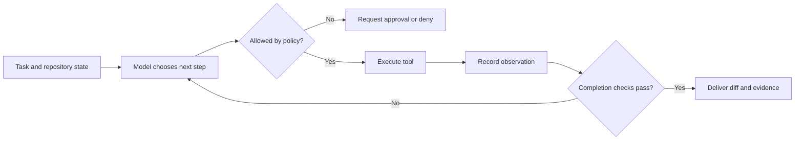

<TLDR>
  <TLDRCell label="what">
    An AI coding agent puts a large language model in a feedback loop with tools for files, search, and commands, so the model can continue from real execution results.
  </TLDRCell>
  <TLDRCell label="when">
    Use one for a bounded repository task with a checkable result, such as fixing a reproducible bug, making a small refactor, or adding missing tests.
  </TLDRCell>
  <TLDRCell label="how">
    Define the workspace, permissions, and completion checks before the agent acts. Before merging, trust the diff, exit codes, and test results, not the agent's own claim that it finished.
  </TLDRCell>
</TLDR>

## What it is and why it exists

An AI coding agent is a software system that can observe a development environment and act on it. A <Term id="large-language-model">large language model</Term> chooses the next step, while a host program reads files, applies patches, runs commands, and returns the results to the model. Model output alone changes nothing; side effects happen only when the host executes a tool call.

Code completion suggests text near the cursor, and a chat assistant usually stops after producing an answer. An agent has one extra capability that matters: it can inspect the result of an action and decide what to do next. Test failures, compiler errors, and new diffs become inputs to later turns, so one task can pass through several rounds of exploration, editing, and correction.

Agents address an information gap in repository work. A developer's goal often states the desired behavior but not the exact files to change; those details live in code, configuration, and tests. An agent can perform the mechanical search, but it doesn't know product intent that the team never recorded, and a fluent explanation doesn't prove that its patch is correct.

The best delegated tasks have a firm boundary and a machine-checkable result. "Make this failing test pass and change only the parser and its tests" is a better agent task than "improve the backend." The second prompt has no decidable endpoint and says nothing about behavior that must stay unchanged.

### Completion, chat, and IDE boundaries

| Form | What it sees | What it can do | Who decides it is done |
|---|---|---|---|
| Code completion | Text near the cursor | Suggest the next text | Developer |
| Chat assistant | Context supplied to the conversation | Return an explanation or code snippet | Developer |
| Coding agent | Permitted repository state and tool results | Read, edit, execute, and correct repeatedly | Verification rules and developer |

One product can expose all three forms, so the interface doesn't decide whether something is an agent. The useful test is whether the system lets the model request a <Term id="tool-call">tool call</Term> and feeds the execution observation into a later model turn. A CLI or IDE is only the surface that hosts that loop.

An agent isn't necessarily unsupervised. An interactive agent can request approval before each write or command; a background agent can work alone in an isolated checkout, then submit a diff for review. Autonomy comes from the permission and approval policy, not from the word "agent" in a product name.

## How it works

A run begins with a task, repository state, and project instructions. The host selects material that fits in the model's <Term id="context-window">context window</Term> and declares the available tools. The model returns prose or a structured tool call; only a well-formed call that passes policy checks can execute.

Execution produces an observation such as file contents, search matches, an exit code, standard output, or an error. The host adds that observation to the run state and calls the model again. This <Term id="agent-loop">agent loop</Term> continues until verification passes, the model asks to stop, a budget is exhausted, the user cancels, or policy denies an action.



The model shouldn't hold direct file-system or shell access. The host sits between the model and the environment: it interprets the tool protocol, validates arguments, performs operations, and records results. That layer defines what the agent can really do, so it is the first place to inspect during a security review.

### Five parts of a run

- The objective states expected behavior, permitted scope, and constraints that must remain true.
- Context supplies project rules, relevant code, and observations from previous tools.
- Tools represent reads, edits, searches, and execution as typed calls.
- Policy chooses allow, deny, or request approval from the tool, arguments, path, and current state.
- A verifier decides completion from independent evidence and enforces step, time, or cost limits.

The model may propose a plan, but a plan isn't environment state. Files can change after planning, and commands can fail. Every fact that affects the next decision should come from a fresh tool observation, not the model's guess about what its previous action probably did.

Tool results need distinct success, failure, and partial-result states. Returning only free-form text encourages the model to read a warning as success and makes consistent host policy difficult. At minimum, keep the call identifier, exit status, truncation state, and resources that actually changed.

### Permissions come before prompts

Project instructions can tell the model not to read secrets or run dangerous commands, but they aren't a security boundary. Repository files, issue text, and dependency documentation can contain <Term id="prompt-injection">prompt injection</Term> that tries to redirect the model from its task. The host must still enforce path limits, network policy, and command approval.

Permissions should follow <Term id="least-privilege">least privilege</Term>. Read-only exploration doesn't need write access; a documentation edit doesn't need production credentials; a unit test usually doesn't need the network. If the task needs more permission, the approval surface should show the exact tool and complete arguments, not merely ask whether to continue.

An <Term id="approval-gate">approval gate</Term> is an explicit pause in policy. It fits irreversible operations, writes outside the workspace, network sends, and privilege escalation. Approval should cover the current call or a narrow rule; it shouldn't silently authorize every shell command that follows.

### Completion comes from evidence

"The code is fixed" is model-generated text. A reliable completion condition is observable: the named test exits with `0`, type checking passes, the diff contains only allowed files, and a new regression test fails against the old implementation. The verification commands are part of the task specification.

Evidence has a scope. Passing unit tests can't prove that a migration is safe for production data, and a formatter can't prove that business behavior is correct. A reviewer should map every completion claim to a command, check, or human judgment that supports it, then identify whatever risk remains uncovered.

## Examples

The next three Python examples don't invoke a real model. They replace it with a deterministic decision function so the loop, permissions, and verification can run independently and be inspected. A real system swaps out that decision function, but the control boundaries should remain.

### An observation-driven agent loop

The first example makes the controller read a configuration value, write a replacement, and run a test. `choose_action()` sees only the previous observation; `execute()` alone can touch the workspace. That separation leaves a clear record for every side effect.

<Depth level="quick">

```python run title="agent_loop.py"
from dataclasses import dataclass


@dataclass(frozen=True)
class Action:
    tool: str
    argument: str


workspace = {"app.cfg": "timeout=10\n"}


def choose_action(observation: tuple[str, str]) -> Action:
    match observation:
        case ("start", _):
            return Action("read_file", "app.cfg")
        case ("file", "timeout=10"):
            return Action("write_file", "app.cfg:timeout=30")
        case ("written", _):
            return Action("run_tests", "config")
        case ("tests", "PASS"):
            return Action("finish", "verified")
        case _:
            return Action("finish", "blocked")


def execute(action: Action) -> tuple[str, str]:
    match action:
        case Action("read_file", path):
            return "file", workspace[path].strip()
        case Action("write_file", payload):
            path, content = payload.split(":", 1)
            workspace[path] = content + "\n"
            return "written", path
        case Action("run_tests", _):
            passed = workspace["app.cfg"] == "timeout=30\n"
            return "tests", "PASS" if passed else "FAIL"
        case _:
            raise ValueError(f"unsupported action: {action.tool}")


observation = ("start", "")
while True:
    action = choose_action(observation)
    print(f"action: {action.tool} {action.argument}")
    if action.tool == "finish":
        break
    observation = execute(action)
    print(f"observation: {observation[0]} {observation[1]}")
```

```text
action: read_file app.cfg
observation: file timeout=10
action: write_file app.cfg:timeout=30
observation: written app.cfg
action: run_tests config
observation: tests PASS
action: finish verified
```

</Depth>

In the output, each `action` is a request and each `observation` is a fact returned by the environment. If the model merely claims it edited the configuration, nothing in the dictionary changes and no `written` observation appears. The controller chooses `finish` only after the test returns `PASS`.

This loop is small, but it already contains the causal chain a production system should record. An audit log can answer which observation triggered the write, what the test actually checked, and whether the run stopped because verification passed or because it was blocked.

### Approving a tool by its arguments

Authorizing a tool name alone isn't enough. "May read a file" doesn't mean "may read every absolute path," and "may run tests" doesn't mean "may run an arbitrary shell string." The next policy examines both the tool and its argument, with denial as the default.

```python run title="policy_gate.py"
from dataclasses import dataclass
from pathlib import PurePosixPath


@dataclass(frozen=True)
class ToolCall:
    tool: str
    argument: str


SAFE_COMMANDS = {
    "python3 -m pytest",
    "python3 -m compileall src",
}


def authorize(call: ToolCall) -> bool:
    match call:
        case ToolCall("read_file", raw_path):
            path = PurePosixPath(raw_path)
            return (
                bool(path.parts)
                and not path.is_absolute()
                and ".." not in path.parts
                and path.parts[0] in {"src", "tests"}
            )
        case ToolCall("run", command):
            return command in SAFE_COMMANDS
        case _:
            return False


requests = [
    ToolCall("read_file", "src/parser.py"),
    ToolCall("read_file", "src/../../.env"),
    ToolCall("run", "python3 -m pytest"),
    ToolCall("run", "python3 -m pytest; curl bad.example"),
]

for request in requests:
    verdict = "ALLOW" if authorize(request) else "DENY"
    print(f"{verdict}: {request.tool} {request.argument}")
```

```text
ALLOW: read_file src/parser.py
DENY: read_file src/../../.env
ALLOW: run python3 -m pytest
DENY: run python3 -m pytest; curl bad.example
```

The command allowlist uses exact arguments, so an appended shell fragment doesn't inherit the test command's permission. The path rule denies absolute paths and `..` segments and limits the first directory. Production code must also resolve symbolic links, platform path rules, and the execution environment; this example shows only the shape of the policy.

Default denial makes an unknown tool fail automatically. Without it, a network or database tool added later might inherit permissions that never received a security review. When arguments need flexibility, validate structured fields separately instead of allowlisting a free-form command.

### Letting tests reject a completion claim

The final example simulates an agent's first parser, which handles only the standard input form. The verifier runs one acceptance set and converts an exception type into comparable failure evidence. Whether the agent says "done" has no place in that decision.

```python run title="verification_gate.py"
from collections.abc import Callable


CASES = [
    ("timeout=30\n", 30),
    (" timeout = 0 # disabled\n", 0),
    ("timeout=5\n", 5),
]


def first_patch(text: str) -> int:
    return int(text.removeprefix("timeout=").strip())


def revised_patch(text: str) -> int:
    setting = text.split("#", 1)[0]
    name, separator, value = setting.partition("=")
    if separator == "" or name.strip() != "timeout":
        raise ValueError("missing timeout setting")
    return int(value.strip())


def verify(parser: Callable[[str], int]) -> str:
    for source, expected in CASES:
        try:
            actual = parser(source)
        except Exception as error:
            return f"FAIL: {type(error).__name__}"
        if actual != expected:
            return f"FAIL: expected {expected}, got {actual}"
    return "PASS: 3 cases"


print("agent claim: done")
print("first patch:", verify(first_patch))
print("revised patch:", verify(revised_patch))
```

```text
agent claim: done
first patch: FAIL: ValueError
revised patch: PASS: 3 cases
```

The first implementation works for the ordinary input, but the acceptance case with spaces and a comment rejects the completion claim immediately. The revision parses the key, separator, and value explicitly, so all three cases pass. An independent check must have the power to reject delivery; extra model confidence adds nothing.

Verification in a real repository is usually a set of commands and diff rules. Before putting them in a task, confirm that they reproduce in a clean checkout, and record the working directory, environment variables, and exit code. A test that happens to use a developer's local cache isn't dependable evidence.

## Pitfalls

The worst agent failures usually happen after text generation, when the host interprets text as permission, an operation, or completion evidence. Each of these traps needs a control-layer fix. One more prompt instruction isn't enough.

### Treating a broad goal as a specification

> [!PITFALL]
> "Refactor this module" doesn't state the behavior to preserve, files that may change, or a stop condition. The agent may keep widening the task, or declare completion after little more than renaming symbols.

**Fix:** state observable acceptance criteria, modification scope, and non-goals. Attach a verification method to each criterion, such as a test command, static check, or manual review item. Keep product judgments that can't be automated with the human reviewer instead of pretending that tests cover them.

### Stuffing the whole repository into context

> [!PITFALL]
> Adding files indiscriminately crowds out the definitions that matter and can pull in generated output, stale documentation, and third-party instructions. The model may then change correct code to match an obsolete interface.

**Fix:** use search, dependencies, and the failure stack to find the smallest relevant file set, then read on demand. On a long task, reread a file just before editing instead of relying on an early summary. Exclude build output, dependency directories, credential files, and unrelated large data.

### Treating the shell as one harmless tool

> [!PITFALL]
> The name `run_command` hides enormous differences between its arguments. If a test, upload, and recursive deletion share one permanent approval, prompt injection can turn directly into a system side effect.

**Fix:** approve the full arguments, working directory, network need, and expected write scope. Prefer narrow tools such as `run_tests` or `format_files` to an unrestricted shell. Ask for fresh, explicit approval for network access, credentials, or paths outside the workspace.

### Trusting the agent's test summary

> [!PITFALL]
> A generated report can say "all tests passed" when the command never ran, ran in the wrong directory, or had its failure swallowed by `|| true`. Green wording in a log isn't an exit code.

**Fix:** have the host capture the command, working directory, exit code, and an untruncated failure summary. Keep the verifier separate from the model that wrote the completion claim, and show evidence directly in the final review. Add checks that match the change's risk when the selected tests are too narrow.

### Sharing one workspace between sessions

> [!PITFALL]
> If two agents edit one checkout at the same time, one session's tests may read the other session's half-finished work. A later write can also overwrite the earlier patch while both logs claim success.

**Fix:** give every session its own worktree, container, or temporary copy, with its baseline commit recorded separately. Integrate results through ordinary merge and conflict review. Share only immutable or verifiable artifacts across tasks.

## In the AI era

**What generated code gets wrong here**

When models generate agent hosts, they often concatenate model output into `subprocess.run(..., shell=True)` or use a string prefix to decide that a path remains in the workspace. They may cache permanent approval by tool name, treat the word `passed` in pytest output as success while ignoring the exit code, or retry forever after failure. Another recurring bug summarizes a truncated log as "no errors," removing the real failure from later turns.

**Ask your AI to check**

- List the side effects of every tool, then trace argument validation, working directory, network access, and approval scope.
- Find every shell, path, or URL operation derived from model text, and prove untrusted data can't cross the workspace or permission boundary.
- Trace each completion claim to original exit codes, test reports, and diff scope, and explain how failure, timeout, and truncation propagate.

**Review checklist**

- Probe tool boundaries with absolute paths, `..`, symbolic links, shell metacharacters, and oversized output.
- Confirm cancellation, budget exhaustion, tool failure, and approval denial all have finite, recoverable stop paths.
- Rerun acceptance commands in a clean isolated workspace and inspect the actual diff rather than the agent's summary.

**Prompt vocabulary**

Use the exact terms `agent loop`, `tool call`, `tool result`, `approval gate`, `least privilege`, `workspace boundary`, `stop condition`, and `verification evidence`. Asking for a map of "tool, complete arguments, side effects, approval rule, completion evidence" is much easier to review than asking vaguely to "make the agent safer."

<Depth level="deep">

## The tool protocol is the control plane

A tool protocol turns probabilistic model output into deterministic program operations. A tool declaration usually has a name, purpose, argument schema, and result schema; the host parses a call against those schemas before deciding whether to execute. Arguments should represent domain actions such as `path`, `query`, or `test_target`, rather than packing every intention into one command string.

The tool description visible to the model is only selection guidance. The executor must validate again because a call can omit fields, use the wrong types, be oversized, or carry malicious content. Validation failure should produce a structured error that lets the model correct its request, but repeated requests must never bypass policy.

### State of one call

| Stage | Facts the host must retain | What cannot replace them |
|---|---|---|
| Proposal | Tool name, normalized arguments, call identifier | Model's explanation of the action |
| Decision | Allow, deny, or pending approval, plus matched rule | Natural language that says it "looks safe" |
| Execution | Environment, working directory, start time, authorized scope | Environment expected in the plan |
| Result | Status, exit code, output, truncation marker, changed resources | A model-generated result summary |

A call identifier pairs a proposal with its result. Without that link, concurrent tool results can attach to the wrong request and a retry can look like an independent operation. For side-effecting tools, record an idempotency key or resource version as well, so a network retry doesn't create the same object twice.

A structured result doesn't mean putting all output back into context. Large logs can remain as artifacts while the model receives status, relevant excerpts, and a reference it can read further. Truncation must be explicit; silent truncation lets the model mistake a missing error tail for no error.

## Context is not repository truth

Context is a limited snapshot visible during one turn; the repository and runtime remain authoritative. The model may remember old file contents, an old test result, or a plan that was later reverted. Before a write, check the baseline or file digest and reread when necessary, rather than applying an edit to stale content.

Project instructions have scope too. Organization rules, repository rules, directory rules, and the current task may all be present, so the host needs a defined priority and override order. An untrusted file enters context as data; it must not automatically become an instruction at the same level as system policy.

When compressing history, preserve the facts needed for later safety decisions: the exact approved scope, changed files, failing acceptance criteria, and unresolved risks. A narrative summary from the model can help navigation, but it can't replace raw tool records. Reverification is cheaper than trusting an old conclusion buried in a long conversation.

### Environment differences

Local, container, and cloud workspaces may use different dependencies, operating systems, credentials, and network policies. A command that passes in one environment need not pass in another. The task record should identify the baseline commit, runtime version, lockfile state, and verification environment.

Dependency installation changes all later evidence. If installation is allowed, record package names, resolved versions, and lockfile changes, and treat downloaded code as new untrusted input. If network access is denied, the failure should state the missing dependency clearly instead of suggesting a success path that never ran.

## Stopping, cancellation, and recovery

Stop states should distinguish success, blocked work, and budget termination. Success requires all acceptance evidence; blocked means the run lacks permission, information, or an available tool; budget termination means it reached a step, time, or cost limit. Calling all three `done` prevents a caller from deciding whether to merge, answer a question, or retry.

Every loop iteration should move toward termination. A host can track repeated tool calls, identical failure signatures, and patch attempts that produce no diff. Once a threshold is reached, it should stop and deliver the evidence it has instead of spending the budget on near-identical patches.

Cancellation must reach a running child process. Stopping only the model request can leave tests, development servers, or installers behind to contaminate later sessions. The executor should place children in a manageable process group, terminate and reap them, and record any external side effect that may already have occurred.

A resumed run can't load conversation text alone. It must at least confirm the workspace baseline, uncommitted diff, tool versions, and previously approved scope. Policy decides whether approval remains valid; the safe default makes sensitive approval valid for one call or one session.

## Review the artifact, not the persona

Agents sometimes explain plans and results in the first person, which makes them sound like colleagues who understand the project. The review target is still the diff, execution record, and unresolved risk. Explanations can locate design intent, but they add no weight to the evidence that code is correct.

A reviewable delivery states its baseline, changed files, behavioral effect, executed commands, each exit code, and remaining warnings. A check that didn't run should say "not run" and why; "should pass" can't fill the gap. The reviewer can then reproduce the evidence and add business semantics and architectural constraints outside the reach of machine checks.

The useful unit is one finite task moved to a state that someone can judge. Sometimes the result is a small verified patch; sometimes it is a precise blocked report. When the state and evidence are truthful, both are usable engineering outcomes.

</Depth>

<Checkpoint id="ai-era/ai-coding-agents" />

## Further reading

- [Responsible use of GitHub Copilot agents](https://docs.github.com/en/copilot/responsible-use/agents)
- [About GitHub Copilot cloud agent](https://docs.github.com/en/copilot/concepts/agents/cloud-agent/about-cloud-agent)
- [How Claude Code works](https://code.claude.com/docs/en/how-claude-code-works)
- [Claude Code security](https://code.claude.com/docs/en/security)
