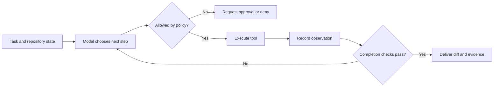

<TLDR>
  <TLDRCell label="what">
    AI 编程智能体（AI coding agent）把大语言模型与文件、搜索、终端等工具放进一个反馈循环，让模型能根据真实执行结果继续完成任务。
  </TLDRCell>
  <TLDRCell label="when">
    它适合目标明确、结果可验证的代码库任务，例如修复一个可复现的缺陷、完成小范围重构或补齐测试。
  </TLDRCell>
  <TLDRCell label="how">
    先限定工作区、权限和完成条件，再让智能体行动；合并前只相信差异、命令退出码和测试结果，不相信它自己的完成声明。
  </TLDRCell>
</TLDR>

## 是什么，为什么存在

AI 编程智能体是一个能观察开发环境并采取行动的软件系统。系统中的<Term id="large-language-model">大语言模型（large language model）</Term>负责选择下一步，宿主程序则读取文件、应用补丁、运行命令，再把结果交还给模型。模型输出本身不会改动代码；真正产生副作用的是宿主执行的工具调用。

普通代码补全只在光标附近建议文本，对话助手通常生成回答后就停止。智能体多了一条关键能力：它可以查看一次行动的结果，再据此决定下一步。测试失败、编译器报错和新的代码差异都会成为后续输入，所以一次任务可以经历多轮探索、修改和纠错。

它解决的是代码任务中的信息缺口。开发者给出的目标往往只描述预期行为，具体修改点要从仓库、配置和测试中找出来。智能体可以连续执行这些机械步骤，但它并不知道团队没有写下来的产品意图，也不能仅凭流畅的解释证明修改正确。

最适合委派的任务有清晰边界和机器可检查的结果。比如「让这个失败测试通过，且只修改解析器与对应测试」就比「改善后端」更适合智能体。后者没有可判定的终点，也没有说明哪些行为不能改变。

### 与补全、对话和 IDE 的边界

| 形态 | 能看到什么 | 能做什么 | 谁决定完成 |
|---|---|---|---|
| 代码补全 | 光标附近的文本 | 建议下一段文本 | 开发者 |
| 对话助手 | 提供给对话的上下文 | 返回解释或代码片段 | 开发者 |
| 编程智能体 | 仓库中获准读取的状态与工具结果 | 读取、编辑、执行、反复修正 | 验证规则与开发者 |

这些形态可能出现在同一个产品里，界面并不能定义是否为智能体。判断标准是系统是否允许模型发起<Term id="tool-call">工具调用（tool call）</Term>，并把执行观察送回下一轮模型调用。CLI 或 IDE 只是承载这种循环的入口。

智能体也不等于无人监督。交互式智能体可以在每次写文件或运行命令前请求批准；后台智能体可以在隔离工作区中独立运行，最后提交差异供人审查。自主程度来自权限与审批策略，不是来自「agent」这个名称。

## 工作原理

一次运行从任务、仓库状态和项目指令开始。宿主选择可以放入<Term id="context-window">上下文窗口（context window）</Term>的材料，并向模型声明可用工具。模型返回自然语言或结构化工具调用；只有结构正确且通过策略检查的调用才会执行。

工具执行后会产生观察，例如文件内容、搜索匹配、退出码、标准输出或错误信息。宿主把观察加入运行状态，再调用模型。这个<Term id="agent-loop">智能体循环（agent loop）</Term>一直继续到验证通过、模型请求停止、预算耗尽、用户取消或策略拒绝行动。



模型不应直接拥有文件系统或 shell。宿主在模型与环境之间解释工具协议、检查参数、执行操作并记录结果。这一层决定智能体的真实能力，也是安全审查首先要看的地方。

### 五个运行要素

- 目标说明期望行为、允许范围和不可改变的约束。
- 上下文提供项目规则、相关代码和之前的工具观察。
- 工具把读取、编辑、搜索、执行等动作表示为带类型的调用。
- 策略根据工具、参数、路径和当前状态决定允许、拒绝或请求批准。
- 验证器使用独立证据判断是否完成，并设置步数、时间或成本上限。

模型可以提出计划，但计划不是环境状态。文件可能在计划生成后变化，命令也可能失败。每个会影响后续决策的事实都应来自新的工具观察，而不是来自模型对上一步的猜测。

工具返回值需要区分成功、失败和部分结果。只返回一段自由文本会让模型把警告误当成功，也让宿主难以执行统一策略。至少应保留调用标识、退出状态、截断信息以及实际改变的资源。

### 权限先于提示词

项目指令能告诉模型不要访问秘密或运行危险命令，但它不是安全边界。仓库文件、Issue 内容和依赖文档都可能包含<Term id="prompt-injection">提示词注入（prompt injection）</Term>，诱导模型忽略原任务。宿主仍必须执行路径限制、网络策略和命令审批。

权限应遵循<Term id="least-privilege">最小权限原则（least privilege）</Term>。只读探索不需要写权限；修改文档不需要生产凭据；运行单元测试通常不需要外网。任务需要扩大权限时，审批界面应显示具体工具和完整参数，而不是只问「是否继续」。

<Term id="approval-gate">审批门（approval gate）</Term>是策略中的一次显式停顿。它适合不可逆操作、工作区外写入、网络发送和权限升级。批准应只覆盖眼前的调用或一个窄规则，不能无意中把后续所有 shell 命令都放行。

### 完成来自证据

「代码已修复」只是模型生成的文本。可靠的完成条件应落到可观察结果上，例如指定测试退出码为 `0`、类型检查通过、差异只包含允许文件，以及新增回归测试在旧实现上失败。验证命令本身也属于任务规格。

证据有适用范围。单元测试通过不能证明迁移在生产数据上安全，格式化命令通过也不能证明业务行为正确。审查者要把每条完成声明映射到支持它的命令、检查或人工判断，并标出仍未覆盖的风险。

## 示例

下面三个 Python 例子不调用真实模型。它们用确定性决策函数代替模型，使循环、权限和验证可以独立运行并检查。真实系统会替换决策函数，但控制边界不应因此改变。

### 观察驱动的智能体循环

第一个例子让控制器先读配置，再写入新值并运行测试。`choose_action()` 只根据上一条观察选择下一步；`execute()` 才能接触工作区。这个分离让每次副作用都留下明确记录。

<Depth level="quick">

```python run title="agent_loop.py"
from dataclasses import dataclass


@dataclass(frozen=True)
class Action:
    tool: str
    argument: str


workspace = {"app.cfg": "timeout=10\n"}


def choose_action(observation: tuple[str, str]) -> Action:
    match observation:
        case ("start", _):
            return Action("read_file", "app.cfg")
        case ("file", "timeout=10"):
            return Action("write_file", "app.cfg:timeout=30")
        case ("written", _):
            return Action("run_tests", "config")
        case ("tests", "PASS"):
            return Action("finish", "verified")
        case _:
            return Action("finish", "blocked")


def execute(action: Action) -> tuple[str, str]:
    match action:
        case Action("read_file", path):
            return "file", workspace[path].strip()
        case Action("write_file", payload):
            path, content = payload.split(":", 1)
            workspace[path] = content + "\n"
            return "written", path
        case Action("run_tests", _):
            passed = workspace["app.cfg"] == "timeout=30\n"
            return "tests", "PASS" if passed else "FAIL"
        case _:
            raise ValueError(f"unsupported action: {action.tool}")


observation = ("start", "")
while True:
    action = choose_action(observation)
    print(f"action: {action.tool} {action.argument}")
    if action.tool == "finish":
        break
    observation = execute(action)
    print(f"observation: {observation[0]} {observation[1]}")
```

```text
action: read_file app.cfg
observation: file timeout=10
action: write_file app.cfg:timeout=30
observation: written app.cfg
action: run_tests config
observation: tests PASS
action: finish verified
```

</Depth>

输出中的 `action` 是请求，`observation` 是环境返回的事实。模型如果直接声称配置已修改，不会改变字典中的内容，也不会生成 `written` 观察。控制器只有在测试返回 `PASS` 后才选择 `finish`。

这个循环仍然很小，但已经包含生产系统要记录的因果链。审计日志可以回答哪个观察触发了写入、测试实际检查了什么，以及停止是因为验证通过还是因为遇到阻塞。

### 按参数审批工具

只按工具名称授权不够。「允许读取文件」不能自动等于允许读取任意绝对路径，「允许运行测试」也不能等于允许任意 shell 字符串。下面的策略同时检查工具与参数，并采用默认拒绝。

```python run title="policy_gate.py"
from dataclasses import dataclass
from pathlib import PurePosixPath


@dataclass(frozen=True)
class ToolCall:
    tool: str
    argument: str


SAFE_COMMANDS = {
    "python3 -m pytest",
    "python3 -m compileall src",
}


def authorize(call: ToolCall) -> bool:
    match call:
        case ToolCall("read_file", raw_path):
            path = PurePosixPath(raw_path)
            return (
                bool(path.parts)
                and not path.is_absolute()
                and ".." not in path.parts
                and path.parts[0] in {"src", "tests"}
            )
        case ToolCall("run", command):
            return command in SAFE_COMMANDS
        case _:
            return False


requests = [
    ToolCall("read_file", "src/parser.py"),
    ToolCall("read_file", "src/../../.env"),
    ToolCall("run", "python3 -m pytest"),
    ToolCall("run", "python3 -m pytest; curl bad.example"),
]

for request in requests:
    verdict = "ALLOW" if authorize(request) else "DENY"
    print(f"{verdict}: {request.tool} {request.argument}")
```

```text
ALLOW: read_file src/parser.py
DENY: read_file src/../../.env
ALLOW: run python3 -m pytest
DENY: run python3 -m pytest; curl bad.example
```

命令白名单使用精确参数，因此附加的 shell 片段不会继承测试命令的权限。路径检查拒绝绝对路径和 `..` 段，并限定首个目录。生产代码还要解析符号链接、平台路径规则和执行环境；这个例子只演示策略形状。

默认拒绝让未知工具自动失败。否则，后来添加的网络或数据库工具可能在没有安全评审的情况下继承过宽权限。需要灵活参数时，应使用结构化字段逐项验证，而不是把自由格式命令加入白名单。

### 用测试否决完成声明

最后一个例子模拟智能体第一次提交了只处理标准格式的解析器。验证器运行同一组验收用例，并把异常类型变成可比较的失败证据。智能体是否说「done」不参与判断。

```python run title="verification_gate.py"
from collections.abc import Callable


CASES = [
    ("timeout=30\n", 30),
    (" timeout = 0 # disabled\n", 0),
    ("timeout=5\n", 5),
]


def first_patch(text: str) -> int:
    return int(text.removeprefix("timeout=").strip())


def revised_patch(text: str) -> int:
    setting = text.split("#", 1)[0]
    name, separator, value = setting.partition("=")
    if separator == "" or name.strip() != "timeout":
        raise ValueError("missing timeout setting")
    return int(value.strip())


def verify(parser: Callable[[str], int]) -> str:
    for source, expected in CASES:
        try:
            actual = parser(source)
        except Exception as error:
            return f"FAIL: {type(error).__name__}"
        if actual != expected:
            return f"FAIL: expected {expected}, got {actual}"
    return "PASS: 3 cases"


print("agent claim: done")
print("first patch:", verify(first_patch))
print("revised patch:", verify(revised_patch))
```

```text
agent claim: done
first patch: FAIL: ValueError
revised patch: PASS: 3 cases
```

第一次实现对常规输入有效，但带空格和注释的验收用例立即否决了完成声明。修订版明确解析键、分隔符和值，因而通过三条用例。独立检查必须拥有拒绝交付的权力；增加模型的信心不会补上证据。

真实仓库中的验证通常是一组命令和差异规则。把它们写进任务前，先确认命令能在干净工作区复现，并记录运行目录、环境变量和退出码。一个偶然使用了开发者本机缓存的测试不是可靠证据。

## 陷阱

智能体的多数严重事故不发生在生成文本阶段，而发生在宿主把文本解释成权限、操作或完成证据时。下面每个陷阱都要在控制层修复，不能只依赖一句提示词。

### 把宽泛目标当作规格

> [!PITFALL]
> 「重构这个模块」没有说明必须保持的行为、允许修改的文件或停止条件。智能体可能不断扩大范围，也可能在只改了命名后宣布完成。

**修复：**写出可观察的验收条件、修改范围和非目标。为每个条件指定验证方式，例如测试命令、静态检查或人工审查项。无法自动检查的产品判断要明确留给人，而不是伪装成测试已覆盖的事实。

### 把整个仓库塞进上下文

> [!PITFALL]
> 无差别加入文件会挤掉真正相关的定义，还可能混入生成物、旧文档和第三方指令。模型随后会基于过期接口修改正确代码。

**修复：**先用搜索、依赖关系和失败堆栈定位最小文件集，再按需读取。长任务要重新读取将要修改的文件，不要只依赖早期摘要。忽略构建产物、依赖目录、凭据文件和与任务无关的大型数据。

### 把 shell 当作一个无害工具

> [!PITFALL]
> `run_command` 这个名字掩盖了参数的巨大能力差异。测试命令、上传命令和递归删除命令如果共享一次永久批准，提示词注入就可能直接变成系统副作用。

**修复：**按完整参数、工作目录、网络需求和预期写入范围做审批。优先提供窄工具，例如 `run_tests` 或 `format_files`，而不是任意 shell。涉及外网、凭据或工作区外路径时重新请求明确批准。

### 相信智能体自己的测试摘要

> [!PITFALL]
> 生成的报告可能写着「全部测试通过」，但命令实际没有运行、在错误目录运行，或失败后被 `|| true` 吞掉。日志中的绿色措辞不是退出码。

**修复：**由宿主捕获命令、工作目录、退出码和未截断的失败摘要。把验证器与生成完成声明的模型分开，并在最终审查中直接展示证据。测试选择过窄时，补充与改动风险对应的检查。

### 让多个会话共享一个工作区

> [!PITFALL]
> 两个智能体同时编辑同一检出目录时，一个会话的测试可能读到另一个会话的半成品。后写入者还可能覆盖先写入者的修改，日志却各自声称成功。

**修复：**每个会话使用独立工作树、容器或临时副本，并单独记录基线提交。最后通过正常的合并与冲突审查集成结果。跨任务共享缓存时，只共享不可变或可验证的产物。

<Depth level="deep">

## 工具协议是控制面

工具协议把概率性的模型输出转换为确定性的程序操作。一个工具声明通常包含名称、用途、参数模式和结果模式；宿主根据模式解析调用，再决定是否执行。参数应表示领域动作，例如 `path`、`query` 或 `test_target`，而不是把所有意图塞进一个命令字符串。

模型看到的工具描述只是选择提示。真正的输入验证必须在执行器中再次发生，因为调用可能缺字段、类型错误、超长或包含恶意内容。验证失败应该返回结构化错误，让模型可以修正请求，但不能因为模型坚持重试就绕过策略。

### 一次调用的状态

| 阶段 | 宿主要保存的事实 | 不能替代它的内容 |
|---|---|---|
| 提议 | 工具名、规范化参数、调用标识 | 模型对动作的解释 |
| 决策 | 允许、拒绝或待批准，以及命中的规则 | 「看起来安全」的自然语言 |
| 执行 | 环境、工作目录、开始时间和授权范围 | 计划中的预期环境 |
| 结果 | 状态、退出码、输出、截断标记和改动资源 | 模型生成的结果摘要 |

调用标识把提议与结果配对。没有这个关联，并发工具返回时可能被附到错误请求上，重试也可能被误认为新的独立操作。对具有副作用的工具，还应记录幂等键或资源版本，避免网络重试重复创建对象。

结构化结果不意味着把所有输出都放回上下文。大日志可以保存为产物，只返回状态、关键片段和可继续读取的引用。截断必须是显式字段；悄悄截断会让模型把缺失的错误尾部当作不存在。

## 上下文不是仓库真相

上下文是智能体在某一轮能看到的有限快照，仓库和运行环境才是权威状态。模型可能记得旧文件内容、旧测试结果或已经撤销的计划。执行写入前要检查基线或文件摘要，必要时重新读取，避免在过期内容上应用修改。

项目指令也有作用域。组织规则、仓库规则、子目录规则和当前任务可能同时存在，宿主需要定义清楚的优先级与覆盖关系。不可信文件只能作为数据进入上下文，不能自动升级成与系统策略同级的指令。

压缩历史时，应保留决定后续安全性的事实：已批准的精确范围、已修改文件、仍失败的验收条件和未解决风险。模型写的叙事摘要可以帮助定位，但不能替代原始工具记录。重新验证比相信长对话中的旧结论便宜得多。

### 环境差异

本地、容器和云端工作区可能使用不同依赖、操作系统、凭据和网络策略。同一命令在一个环境通过，不代表另一个环境也通过。任务记录应标明基线提交、运行时版本、锁文件状态和验证环境。

智能体安装依赖会改变后续证据。若允许安装，要记录包名、解析版本和锁文件差异，并把下载代码视为新的不可信输入。若不允许网络，失败结果应该明确说明缺失依赖，而不是建议一个并未执行的成功路径。

## 停止、取消与恢复

停止条件至少分为成功、阻塞和预算终止。成功要求验收证据全部通过；阻塞表示缺少权限、信息或可用工具；预算终止表示步数、时间或成本达到上限。把这三者都写成 `done` 会让调用方无法决定是合并、提问还是重试。

每轮循环都要向终止推进。宿主可以记录连续重复的工具调用、相同失败签名和没有差异的修复尝试。达到阈值后应停止并交付已有证据，而不是继续消耗预算生成近似相同的补丁。

取消必须能到达正在运行的子进程。只停止模型请求却留下测试、开发服务器或安装进程，会污染后续会话。执行器应把子进程放进可管理的进程组，终止后等待回收，并记录哪些外部副作用可能已经发生。

恢复运行时不能只加载对话文本。至少要重新确认工作区基线、未提交差异、工具版本和之前批准的范围。一次批准是否继续有效应由策略决定；安全的默认值是把敏感批准视为本次调用或本次会话有效。

## 审查交付物而不是人格

智能体有时会用第一人称解释计划和结果，这种语气容易让人把它当成了解项目的同事。审查对象仍然是差异、执行记录和未解决风险。解释可以帮助定位设计意图，却不能增加代码正确性的证据权重。

一份可审查交付应包含基线、修改文件、行为变化、运行过的命令、每个退出码和剩余警告。对于没运行的检查，要明确写「未运行」及原因，不能用「应该通过」填空。审查者随后可以复现证据，并把业务语义与架构约束补回机器检查之外。

有价值的工作单位，是被推进到可判断状态的一个有限任务。有时结果是一个通过验证的小补丁，有时是带着精确阻塞原因的失败。只要状态和证据真实，两者都是可用的工程输出。

</Depth>

<Checkpoint id="ai-era/ai-coding-agents" />

## 延伸阅读

- [GitHub Copilot agents 的负责任使用说明](https://docs.github.com/en/copilot/responsible-use/agents)
- [GitHub Copilot cloud agent 概览](https://docs.github.com/en/copilot/concepts/agents/cloud-agent/about-cloud-agent)
- [Claude Code 的运行方式](https://code.claude.com/docs/en/how-claude-code-works)
- [Claude Code 安全文档](https://code.claude.com/docs/en/security)
