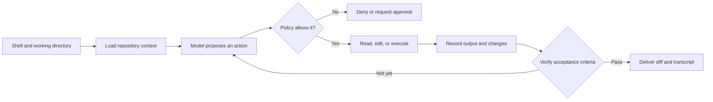

<TLDR>
  <TLDRCell label="what">
    An AI coding CLI is a terminal-based assistant that reads a repository, proposes or applies changes, and runs development tools; it inherits the power and risk of its directory, environment, and terminal permissions.
  </TLDRCell>
  <TLDRCell label="when">
    Use one for bounded repository tasks that commands can verify, remote environments, and workflows that need an execution record.
  </TLDRCell>
  <TLDRCell label="how">
    Start from a clean branch in the correct directory, name the allowed paths and acceptance commands, then independently inspect the diff, exit codes, and skipped checks.
  </TLDRCell>
</TLDR>

## What it is and why it exists

An AI coding command-line interface, or AI coding CLI, is a terminal entry point for a code assistant. It can usually read a repository, search for symbols, edit files, and invoke test or build commands. A CLI is neither a model nor necessarily an agent; it is the interaction surface connecting a model, tools, and a development environment.

A conventional command-line program accepts arguments, reads and writes streams, and returns an exit status. An AI coding CLI adds a natural-language task and iterative decisions: the program sends relevant context to a model, the model proposes an action, the host executes an approved action, and the result goes into the next turn. The local host, not model text itself, changes files and starts processes.

This interface solves workflows outside an editor. You can use the same repository tools in an SSH session, container, temporary worktree, or automation job without binding the process to a graphical UI. A terminal also exposes the current directory, standard input, standard output, standard error, and exit codes, making reviewable engineering evidence easier to retain.

The interface works best for finite tasks such as fixing a reproducible defect, adding tests for an existing function, or migrating a small number of call sites under a clear rule. If a task depends on undocumented product judgment, requires coordination across several systems, or has no success condition, CLI convenience does not remove the ambiguity. Narrow the problem before allowing edits.

### CLI, IDE, and background agent

| Interface | Primary context | Typical control | Delivery form |
|---|---|---|---|
| AI coding CLI | Current directory, explicit files, terminal input | Prompts, flags, permission rules | Worktree diff and execution record |
| AI IDE | Open project, editor state, selection | Graphical diffs and editor permissions | In-editor changes and diagnostics |
| Background agent | Remote checkout, task description, platform tools | Isolated environment and policy | Branch, patch, or pull request |

All three may use the same model and support the same tools. Their main differences are where the environment comes from, where a person approves actions, and how results are delivered. A terminal interface does not imply that a tool only reads text or is inherently safer.

### Separate advice, editing, and execution

A session may only answer a question, may write files directly, or may run arbitrary programs. Those capabilities have different risks and should be authorized separately. Read-only explanation can happen without write access; code editing needs constrained writes; command execution also involves subprocesses, networks, credentials, and a working directory.

Product and mode names change, so inspect the actual capabilities first. Check the help text and official documentation to determine which paths the current mode can read, whether it edits by default, when it requests approval, and how non-interactive mode reports failure. Do not infer a security boundary from names such as “ask,” “plan,” or “safe.”

## How it works

The CLI process inherits an environment from its shell when it starts. Its most important input is the <Term id="working-directory">working directory</Term>: relative paths, repository discovery, project instructions, and many build tools use it as their starting point. The same task started from a repository root and from its parent can see very different file sets and permission prompts.

The host then discovers repository state and configuration, gathers initial context, and declares available tools to the model. A model response may be an explanation or a request to read, edit, or execute. The host allows, denies, or pauses that request according to policy; the real tool result then enters the <Term id="context-window">context window</Term>.

A controlled session can be represented by this flow. `Policy` is a host-enforced boundary, while `Verify` independently decides whether the task is complete.



### The working directory sets the default boundary

Run `pwd` and `git status --short` before launch to confirm the repository, branch, and uncommitted changes. Many tools search upward from the current directory for a repository root and read instruction files inside it. A wrong directory does more than slow search: it can expose unrelated code or personal files.

Relative paths must be interpreted against the process's actual working directory. A wrapper should set `cwd` explicitly instead of relying on the caller to launch it from the right place. If a tool can add more directories, treat that as a permission expansion and explain why each directory needs read or write access.

Capture a baseline before editing. At minimum, keep the current commit, initial `git status`, and paths the task allows. Pre-existing dirty files are not outputs of the AI session, and delivery must distinguish them from new changes.

### Context is a selection, not a repository copy

A terminal assistant does not reliably place an entire repository in model context. The host typically selects material from explicit files, search results, a repository map, project rules, and recent observations. Too little selection misses callers and tests; too much can displace relevant definitions and increases the chance that secrets or malicious instructions enter context.

Start with the implementation, tests, and interfaces directly involved in the task, then expand by stack trace or symbol reference. Generated artifacts, dependency directories, keys, database dumps, and large logs should stay out by default. Ignore rules reduce accidental inclusion, but are not necessarily access control if the host still has filesystem permission.

Project instructions should state stable facts such as test commands, directory ownership, formatting rules, and generated files that must not be touched. Put temporary task goals in the current prompt instead of permanently adding one-off requirements to repository rules. Resolve conflicting instructions before running rather than letting the model guess which one reflects current intent.

### Permission policy controls side effects

“Do not delete files” in a prompt is advice to the model. Real boundaries come from operating-system permissions, containers, sandboxes, tool allowlists, and an <Term id="approval-gate">approval gate</Term>. When approving, inspect the full command, target path, network access, and working directory, not just the tool's natural-language summary.

Under the <Term id="least-privilege">principle of least privilege</Term>, grant only the smallest capability needed for the current step. Exploration usually needs only reads and searches; editing needs writes only in a named worktree; verification needs only known commands. Production credentials, release rights, and writes outside the workspace should not be opened in advance because they “might help.”

Subprocesses inherit environment variables, which often include tokens, proxy addresses, and cloud credentials. Start the session with a minimal environment, or inject only required variables into a dedicated container. Do not put secrets in prompts, command-line arguments, or session records because those locations may reach shell history, process lists, and server logs.

### Interactive and non-interactive modes

Interactive mode lets you inspect plans, approve calls, add constraints, and interrupt work at important points. It suits exploratory tasks, but manual approval can create fatigue. Repeatedly accepting prompts is not policy review, especially when commands contain pipes, redirections, or command substitution.

Non-interactive mode takes a task from arguments or standard input and exits when finished, which suits repeatable scripts. It needs explicit failure semantics: a textual model answer does not mean an edit succeeded, and a printed test summary does not mean the test process returned `0`. An automation caller should parse structured results and exit status according to the program's contract.

Before putting a tool in a pipeline, determine what it returns for missing login, denied approval, exhausted budget, tool failure, and model timeout. If a product guarantees only human-readable output, treat it as a human-assistance tool and do not decide deployment with brittle keyword searches. Stronger automation requires predictable fail-closed behavior.

### The task statement is a small contract

A strong task names the desired behavior, allowed paths, required checks, and non-goals. It should also include a minimal reproduction, relevant entry point, and invariants. “Blank display names must be rejected; change only the parser and its test, then run the named test file” is more verifiable than “fix the user module.”

Do not mix incidental refactoring, dependency upgrades, and repository-wide formatting into the same request. Each extra kind of change makes attribution and failure diagnosis harder. If the task truly requires broader scope, stop, update the contract, and only then approve new directories or checks.

## Examples

The next three Python examples do not connect to a real model. They implement the parts around an AI coding CLI that are most valuable to automate: producing an explicit task contract, retaining subprocess results, and deciding whether evidence permits acceptance. The examples were run with Python 3.14.3.

### Produce a stable task contract

The first script stores the goal, paths, checks, and non-goals separately. A real workflow can use its output as an interactive prompt or serialize the same structure for a non-interactive tool. Structured fields expose scope to a reviewer before execution instead of hiding it in a long prompt.

<Depth level="quick">

```python run title="task_contract.py"
from dataclasses import dataclass


@dataclass(frozen=True)
class TaskContract:
    goal: str
    allowed_paths: tuple[str, ...]
    checks: tuple[str, ...]
    non_goals: tuple[str, ...]


def render(contract: TaskContract) -> str:
    sections = {
        "Goal": (contract.goal,),
        "Allowed paths": contract.allowed_paths,
        "Checks": contract.checks,
        "Do not change": contract.non_goals,
    }
    return "\n".join(
        f"{heading}: " + "; ".join(values)
        for heading, values in sections.items()
    )


contract = TaskContract(
    goal="Reject blank display names with a regression test",
    allowed_paths=("src/profile.py", "tests/test_profile.py"),
    checks=("python3 -m pytest tests/test_profile.py",),
    non_goals=("database schema", "public API shape"),
)
print(render(contract))
```

```text
Goal: Reject blank display names with a regression test
Allowed paths: src/profile.py; tests/test_profile.py
Checks: python3 -m pytest tests/test_profile.py
Do not change: database schema; public API shape
```

</Depth>

`TaskContract` does not constrain an AI tool by itself; it is one readable specification. File permissions and delivery checks still have to enforce the boundary. Its value is that the prompt, approvals, and final review can refer to the same fields, reducing silent scope changes during a run.

The tuple makes this sample contract immutable, but that is not a security boundary either. Before invoking the CLI, a wrapper should verify that paths belong to the expected repository and map check commands to reviewed argument arrays. Never splice arbitrary prompt text into a shell command.

### Capture the complete subprocess result

The second script demonstrates the minimum result an automation caller should retain. `stdout`, `stderr`, and exit code communicate different facts; none can be inferred from the others. The sample starts subprocesses with argument arrays and does not invoke shell parsing.

```python run title="run_capture.py"
from dataclasses import dataclass
import subprocess
import sys


@dataclass(frozen=True)
class Result:
    label: str
    exit_code: int
    stdout: str
    stderr: str


def run_case(label: str, program: str) -> Result:
    completed = subprocess.run(
        [sys.executable, "-c", program],
        capture_output=True,
        text=True,
        check=False,
    )
    return Result(
        label,
        completed.returncode,
        completed.stdout.strip() or "<empty>",
        completed.stderr.strip() or "<empty>",
    )


cases = [
    ("pass", "print('tests: 2 passed')"),
    ("fail", "import sys; print('assertion failed', file=sys.stderr); sys.exit(3)"),
]
for label, program in cases:
    result = run_case(label, program)
    print(f"{result.label}: exit={result.exit_code}")
    print(f"stdout={result.stdout}")
    print(f"stderr={result.stderr}")
```

```text
pass: exit=0
stdout=tests: 2 passed
stderr=<empty>
fail: exit=3
stdout=<empty>
stderr=assertion failed
```

The failing case has no standard output, but it has an unambiguous `exit=3` and an error message. A wrapper that records only standard output gets an empty string and may mistake “no error message” for success. Conversely, some successful programs write warnings to `stderr`, so success should first follow the exit-code contract.

A production wrapper should also record command arguments, `cwd`, start and end times, timeouts, and whether output was truncated. Sensitive environment variables must not enter the log. When results go back to a model, retain the raw evidence before adding a summary; the summary cannot replace the original exit status.

### Reject delivery with evidence

The final script turns the task contract into a small delivery gate. A candidate is accepted only when paths stay in scope, the named check exits `0`, and the execution record is complete. Whether the model claims completion is not an input.

```python run title="delivery_gate.py"
from dataclasses import dataclass


@dataclass(frozen=True)
class Evidence:
    changed_paths: tuple[str, ...]
    checks: tuple[tuple[str, int], ...]
    transcript_complete: bool

ALLOWED_PATHS = {"src/profile.py", "tests/test_profile.py"}
REQUIRED_CHECK = "python3 -m pytest tests/test_profile.py"

def review(evidence: Evidence) -> list[str]:
    reasons = []
    unexpected = sorted(set(evidence.changed_paths) - ALLOWED_PATHS)
    if unexpected:
        reasons.append("out of scope: " + ", ".join(unexpected))

    results = dict(evidence.checks)
    if results.get(REQUIRED_CHECK) != 0:
        reasons.append("required check did not pass")
    if not evidence.transcript_complete:
        reasons.append("transcript is incomplete")
    return reasons

deliveries = {
    "candidate-a": Evidence(
        ("src/profile.py", "tests/test_profile.py"), ((REQUIRED_CHECK, 0),), True
    ),
    "candidate-b": Evidence(
        ("src/profile.py", "pyproject.toml"), ((REQUIRED_CHECK, 1),), False
    ),
}

for name, evidence in deliveries.items():
    reasons = review(evidence)
    verdict = "ACCEPT" if not reasons else "REJECT: " + "; ".join(reasons)
    print(f"{name}: {verdict}")
```

```text
candidate-a: ACCEPT
candidate-b: REJECT: out of scope: pyproject.toml; required check did not pass; transcript is incomplete
```

`candidate-b` violates three independent constraints, and the reviewer reports all of them rather than only the first. This separates a scope error, a behavioral failure, and missing evidence. Fixing one cannot conceal the other two.

Real tasks usually have several checks, and allowed paths may use directory rules. An implementation must normalize paths, handle symbolic links, and state whether new and deleted files are permitted. A delivery gate can prove only the conditions written into the contract, not omitted product requirements.

## Pitfalls

### Starting from the wrong directory

> [!PITFALL]
> Starting a tool from a parent directory or home directory can widen file discovery, bypass project rules, and run relative test commands in the wrong place.

**Fix:** Confirm `pwd`, the repository root, and `git status --short` before launch. Set `cwd` explicitly in wrappers and reject directories without the expected repository marker. For multiple repositories, use a separate session per repository or provide extra directories as explicit read-only input.

### Sending secrets into context

> [!PITFALL]
> `cat .env | ai-cli`, pasting a complete diagnostic bundle, or passing the entire environment to a subprocess can place tokens in model context, session logs, or a remote service.

**Fix:** Remove or redact secrets first and provide only fields needed to reproduce the issue. Launch the tool with a dedicated environment and let executed subprocesses inherit only necessary variables. Secret scans and ignore files are supporting checks, not substitutes for credential isolation and rotation.

### Executing generated shell literally

> [!PITFALL]
> A model-generated command may contain broken quoting, platform-incompatible options, command substitution, redirection, or destructive globs. A plausible explanation does not prove that the shell's actual parse is safe.

**Fix:** Treat commands as untrusted input and inspect the full text and expanded targets. In automation, prefer argument arrays or single-purpose tools, with limits on the working directory, network, and write paths. Deletion, publishing, pushing, and database operations need separate approval and a recovery plan.

### Trusting a green summary instead of the exit code

> [!PITFALL]
> A generated response may say “tests passed” even though the command never ran, output was truncated, it ran in the wrong directory, or `|| true` swallowed a failure.

**Fix:** Have an independent wrapper record the raw command, `cwd`, exit code, and test report. The check command must feed the delivery gate directly instead of merely becoming text for the model to read. Add a regression test that fails against the old implementation for a critical fix.

### Mixing work in a dirty worktree

> [!PITFALL]
> Uncommitted changes that predate the session become mixed with the AI-generated diff. Automatic formatting or bulk fixes may also rewrite out-of-scope files, leaving reviewers unable to attribute changes.

**Fix:** Prefer a new branch, independent worktree, or temporary copy, and retain the baseline commit. If existing changes cannot be cleared, record the initial diff and accept only incremental changes in allowed paths. Do not let the tool commit, stage, or undo files outside this task.

### Moving an interactive command directly into CI

> [!PITFALL]
> A command that expects a TTY, login prompt, or manual approval may hang in CI, or non-interactive mode may apply broader or simply different permission defaults.

**Fix:** Use only a documented non-interactive interface and test timeouts, missing authentication, denied approval, and nonzero exit. Bound runtime and step count, and save structured results. If failure semantics are not stable enough to parse, have CI produce a report for review rather than merge or deploy automatically.

<Depth level="deep">

## Terminal and automation boundaries

A CLI serves both a human terminal and programmatic callers, and those interfaces have different contracts. A person can read colored diffs, answer questions, and interpret a progress animation; a script needs stable exit status, separable data streams, and bounded waits. An interface that works well interactively does not automatically become a reliable machine interface.

### TTY, standard streams, and pipes

A program can detect whether standard input or output is connected to a terminal device, or TTY. With a terminal, it may enable color, pagination, cursor control, and interactive questions; through a pipe or redirection, it may change format or refuse an operation. Test a wrapper in its target invocation mode rather than treating a manual-session screenshot as an automation contract.

Standard output is suitable for machine results and standard error for diagnostics, but real tools do not always enforce that split. Check official documentation for JSON or another structured output mode before choosing a parser. If only human-readable text is available, preserve the original text and tool version, and treat parse failure as an unknown state.

Pipes change the data boundary. Sending a large log to standard input may consume context and can introduce untrusted instructions from outside the repository; sending CLI output directly into a shell is more dangerous because natural language is not a command protocol. Define the data format, size limit, and trust level at every pipe boundary.

### Exit status and signals

POSIX-style programs use zero for success as defined by their contract and nonzero for failure, although the meaning of individual numbers belongs to each program. A wrapper should propagate failure or map it to a structured state with a reason. Capturing output and then unconditionally returning `0` disconnects the most important automation signal.

Timeout and user cancellation are not success either. When a parent receives an interrupt, it should relay the signal to running tests, builds, or development servers and wait for them to finish. Stopping only the model request leaves subprocesses that can contaminate ports, temporary files, and later test results.

Retries must distinguish transient failures from deterministic ones. A network timeout may justify a bounded retry; a syntax error or failed assertion normally requires a new edit. Unconditionally rerunning the same prompt consumes budget repeatedly and can produce extra changes that are harder to attribute.

### Shell parsing is not string passing

When a wrapper invokes a shell, a string undergoes variable expansion, command substitution, glob expansion, redirection, and pipeline parsing. Model or user input that enters the string can change the original command structure. Quote concatenation is hard to implement correctly across platforms and edge cases.

When you can launch a program directly, pass an argument array so the operating system delivers predetermined argument boundaries. When a pipeline or redirection is unavoidable, construct it from a fixed template and validated fields, and execute it in isolation. Do not pretend that one regular expression implements a complete shell parser.

A command allow policy must also inspect structure rather than use `startsWith("python3 -m pytest")`. Another command or a dangerous option can follow that prefix. A stronger approach validates the executable, subcommand, test paths, working directory, environment, and resource limits separately.

## Reproducible session design

Reproducibility does not mean that a model produces the exact same patch every time. It means a reviewer can reconstruct the input boundary, know what happened to the environment, and rerun the checks that determined success. A session record exists for attribution and review, not to preserve every reasoning token.

### The minimum execution transcript

A useful <Term id="execution-transcript">execution transcript</Term> includes at least the baseline commit, tool and version, working directory, task contract, approved side effects, changed paths, and verification commands. Each command records arguments, exit code, relevant output, duration, and whether output was truncated. A skipped check needs a reason; it cannot be represented as “expected to pass.”

The transcript should not contain access tokens, the complete environment, or unnecessary copies of source files. Apply structured redaction for known secrets before storage, and control access and retention for the transcript itself. If a secret has already reached a remote service, deleting it from a local log is insufficient; rotate the credential through the relevant system's process.

Keep summaries and raw evidence in separate layers. A summary lets a person scan the outcome, while raw exit codes and failure fragments support review. A model-generated recap can be part of the record, but it must be labeled as interpretation and must not overwrite host-captured facts.

### Git is a review tool, not a security sandbox

Git is useful for preserving a baseline, displaying a diff, and restoring tracked files. Some CLIs create commits automatically while others leave staging and commits to the user; confirm the active configuration before launch. Automatic commits can improve attribution, but can also put pre-session dirty files or sensitive material into history.

Untracked files, ignored secrets, build outputs, and side effects outside the worktree may not appear in a normal diff. Database writes, network requests, and running processes cannot be undone with `git reset` either. Use Git alongside containers, permission boundaries, and policies for external resources.

Parallel tasks need independent worktrees or isolated copies. When two sessions share a directory, one session's tests may read the other's partial work and the final diff loses a single source. Handling conflicts during a normal merge is easier to review than competing writes in one worktree.

### From interactive exploration to automation

First use interactive mode to confirm the task wording, needed permissions, and acceptance commands. Move stable repeated steps into a wrapper, including directory validation, baseline recording, timeouts, allowed commands, and the delivery gate. The model can still handle code changes that require judgment while deterministic code controls boundaries and evidence.

Build a failure matrix before automation. Cover at least missing authentication, unavailable network, denied approval, no model response, tool failure, test failure, truncated output, timeout, and cancellation. Each failure needs a bounded stop path and an unambiguous state for the caller.

Finally decide what consequence automation may produce. Generating a report, creating an unmerged branch, and opening a draft change are usually easier to control than automatic release. As permissions approach production, acceptance evidence, human approval, and rollback plans should become stronger.

</Depth>

<Checkpoint id="ai-era/ai-coding-cli" />

## Further reading

- [Claude Code CLI reference](https://code.claude.com/docs/en/cli-usage)
- [Claude Code security documentation](https://code.claude.com/docs/en/security)
- [aider usage documentation](https://aider.chat/docs/usage.html)
- [aider Git integration](https://aider.chat/docs/git.html)
