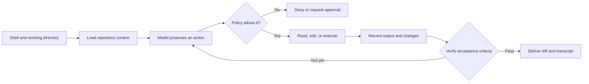

<TLDR>
  <TLDRCell label="what">
    AI编程CLI是在终端中读取代码库、提出或应用修改并运行开发工具的AI助手；它继承当前目录、环境和终端权限带来的能力与风险。
  </TLDRCell>
  <TLDRCell label="when">
    它适合边界明确、能用命令验证的仓库任务，也适合远程环境和需要保留执行记录的工作流。
  </TLDRCell>
  <TLDRCell label="how">
    从干净分支和正确目录启动，明确允许修改的路径与验收命令；最后独立检查差异、退出码和未运行项。
  </TLDRCell>
</TLDR>

## 是什么，为什么存在

AI编程命令行界面（AI coding command-line interface，AI编程CLI）是运行在终端中的代码助手入口。它通常能读取仓库、搜索符号、编辑文件并调用测试或构建命令。CLI不是一种模型，也不自动意味着智能体；它是把模型、工具和开发环境连接起来的交互表面。

普通命令行程序接收参数、读写流并返回退出状态。AI编程CLI在此基础上增加了自然语言任务和多轮决策：程序把相关上下文交给模型，模型建议下一项操作，宿主执行获准的操作，再把结果送回下一轮。真正修改文件或启动进程的是本地宿主，不是模型文本本身。

它解决了编辑器之外的工作流问题。你可以在SSH会话、容器、临时工作树或自动化任务中使用同一套仓库工具，不必把流程绑定到图形界面。终端还天然暴露当前目录、标准输入、标准输出、标准错误和退出码，因此容易留下可复查的工程证据。

这种入口最适合有限任务，例如修复一个可复现缺陷、为已有函数补测试，或按明确规则迁移少量调用点。任务若依赖未写下来的产品判断、需要跨多个系统协调，或无法定义成功条件，CLI的便利不会消除歧义。先缩小问题，再决定是否让工具编辑。

### CLI、IDE与后台智能体

| 入口 | 主要上下文 | 典型控制方式 | 交付形态 |
|---|---|---|---|
| AI编程CLI | 当前目录、显式文件、终端输入 | 提示、参数、权限规则 | 工作树差异与执行记录 |
| AI IDE | 打开的项目、编辑器状态、选区 | 图形化差异与编辑器权限 | 编辑器内修改与诊断 |
| 后台智能体 | 远程检出、任务描述、平台工具 | 隔离环境与策略 | 分支、补丁或拉取请求 |

三者可能使用相同模型，也可能支持相同工具。差异主要在环境从哪里取得、人在何处批准操作，以及结果怎样交付。不能因为界面在终端里，就假设它只能读文本或天然更安全。

### 先区分建议、编辑与执行

一次会话可能只回答问题，也可能直接写文件，还可能运行任意程序。这三个能力的风险不同，应该分别授权。只读解释可以在没有写权限的环境中完成；代码编辑需要受限写入；命令执行还涉及子进程、网络、凭据和工作目录。

产品名称和模式名称会变化，所以先看实际能力。检查帮助文本和官方文档，确认当前模式能读取哪些路径、是否默认修改文件、何时请求批准，以及非交互模式如何报告失败。不要从“ask”“plan”或“safe”之类名称推断安全边界。

## 工作原理

CLI进程启动时会继承shell提供的环境。最重要的输入是<Term id="working-directory">工作目录（working directory）</Term>：相对路径、仓库发现、项目指令和许多构建工具都以它为起点。同一条任务从仓库根目录和父目录启动，可能得到完全不同的文件集合与权限提示。

宿主随后发现仓库状态和配置，收集初始上下文，并向模型声明可用工具。模型的回复可以是说明，也可以是读取、编辑或执行请求。宿主根据策略允许、拒绝或暂停请求；获准工具的真实结果再进入<Term id="context-window">上下文窗口（context window）</Term>。

一次受控会话可以表示为下面的流程。图中的`Policy`是宿主强制执行的边界，`Verify`则独立判断任务是否完成。



### 工作目录决定默认边界

启动前先运行`pwd`和`git status --short`，确认自己所在仓库、分支和未提交修改。许多工具会从当前目录向上寻找仓库根目录，也会读取仓库内的指令文件。错误目录不只是让搜索变慢，它可能把无关代码或个人文件放进可见范围。

相对路径必须按实际进程的工作目录解释。包装脚本应显式设置`cwd`，不能依赖调用者碰巧从正确位置运行。若工具允许增加额外目录，要把这看作一次权限扩张，并逐个说明为何需要读或写。

开始修改前要保存基线。最低限度包括当前提交、初始`git status`和任务允许的路径。已有脏文件不属于AI会话的输出，交付时必须能把它们与新修改区分开。

### 上下文是选择，不是仓库副本

终端助手不会稳定地把整个仓库放进模型上下文。宿主通常结合显式文件、搜索结果、仓库映射、项目规则和最近观察选择材料。选择过少会漏掉调用方与测试，选择过多则可能挤掉真正相关的定义，并增加秘密或恶意指令进入上下文的机会。

先提供任务直接涉及的实现、测试和接口，再让工具按错误栈或符号引用扩展。生成物、依赖目录、密钥、数据库转储和大型日志默认不应加入。忽略规则能降低误读概率，但如果宿主仍有文件权限，它不一定构成访问控制。

项目指令应该写稳定事实，例如测试命令、目录所有权、格式规则和禁止触碰的生成文件。临时任务目标放在本次提示中，避免把一次性要求永久写入仓库规则。指令发生冲突时，先解决冲突，不要让模型猜哪一条代表当前意图。

### 权限策略控制副作用

提示词中的“请勿删除文件”只是给模型的建议。真正的边界来自操作系统权限、容器、沙箱、工具白名单和<Term id="approval-gate">审批门（approval gate）</Term>。审批时要看完整命令、目标路径、网络访问和工作目录，而不只是工具给出的自然语言摘要。

应用<Term id="least-privilege">最小权限原则（least privilege）</Term>时，先授予完成当前步骤所需的最小能力。探索阶段通常只需读取与搜索；编辑阶段只需写入指定工作树；验证阶段只需运行已知命令。生产凭据、发布权限和工作区外写入不应因为“可能有用”而预先开放。

环境变量会被子进程继承，其中常有令牌、代理地址和云凭据。启动会话前使用最小环境，或在专用容器中只注入必要变量。不要把密钥写进提示、命令行参数或会话记录，因为这些位置可能进入shell历史、进程列表和服务端日志。

### 交互模式与非交互模式

交互模式允许你在关键节点查看计划、批准调用、补充约束和中断运行。它适合探索性任务，但人工批准可能产生疲劳。连续点击允许并不等于执行了策略审查，尤其当命令包含管道、重定向或命令替换时。

非交互模式从参数或标准输入取得任务，完成后退出，适合可重复脚本。它必须明确失败语义：模型回答了文字，不代表修改成功；输出了测试摘要，也不代表测试进程退出码为`0`。自动化调用方要依据程序契约解析结构化结果和退出状态。

在流水线中使用前，确认工具在缺少登录、审批被拒、预算耗尽、工具调用失败和模型超时时分别返回什么。若产品只保证人类可读输出，就把它当人工辅助工具，不要用脆弱的关键字搜索决定部署。自动化越强，越需要可判定的失败关闭行为。

### 任务说明是一份小合同

高质量任务至少写明目标行为、允许修改的路径、必须运行的检查和非目标。还应给出最小复现、相关入口和不变量。相比“修一下用户模块”，“空白显示名必须被拒绝，只改解析器和对应测试，并运行指定测试文件”更容易验证。

不要在同一请求中混入顺手重构、依赖升级和格式化整个仓库。每增加一种变化，差异归因和失败定位都会变难。发现任务确实需要扩展范围时，先停下来更新合同，再批准新的目录或检查。

## 示例

下面三个Python例子不连接真实模型。它们实现AI编程CLI外围最值得自动化的部分：生成明确任务合同、保留子进程结果，以及根据证据决定能否接受交付。示例已使用Python 3.14.3执行。

### 生成稳定的任务合同

第一个脚本把目标、路径、检查和非目标分开保存。真实工作流可以把输出作为交互提示，也可以把同一结构序列化给非交互工具。结构化字段让审查者在运行前看见范围，而不是从一段长提示中猜测。

<Depth level="quick">

```python run title="task_contract.py"
from dataclasses import dataclass


@dataclass(frozen=True)
class TaskContract:
    goal: str
    allowed_paths: tuple[str, ...]
    checks: tuple[str, ...]
    non_goals: tuple[str, ...]


def render(contract: TaskContract) -> str:
    sections = {
        "Goal": (contract.goal,),
        "Allowed paths": contract.allowed_paths,
        "Checks": contract.checks,
        "Do not change": contract.non_goals,
    }
    return "\n".join(
        f"{heading}: " + "; ".join(values)
        for heading, values in sections.items()
    )


contract = TaskContract(
    goal="Reject blank display names with a regression test",
    allowed_paths=("src/profile.py", "tests/test_profile.py"),
    checks=("python3 -m pytest tests/test_profile.py",),
    non_goals=("database schema", "public API shape"),
)
print(render(contract))
```

```text
Goal: Reject blank display names with a regression test
Allowed paths: src/profile.py; tests/test_profile.py
Checks: python3 -m pytest tests/test_profile.py
Do not change: database schema; public API shape
```

</Depth>

`TaskContract`不会自行限制AI工具，它只是同一份可读规格。强制边界仍要由文件权限和交付检查实现。它的价值在于让提示、审批和最终审查引用同一组字段，减少运行过程中悄悄改变范围的机会。

元组使示例中的合同不可变，但这也不是安全边界。调用CLI前，包装器还应验证路径属于预期仓库，并把检查命令映射到审查过的参数数组。不要把任意提示文本直接拼进shell命令。

### 完整捕获子进程结果

第二个脚本演示自动化调用必须保留的最小结果。`stdout`、`stderr`和退出码表达不同事实，任何一个都不能由另外两个推断。示例使用参数数组启动子进程，没有经过shell解析。

```python run title="run_capture.py"
from dataclasses import dataclass
import subprocess
import sys


@dataclass(frozen=True)
class Result:
    label: str
    exit_code: int
    stdout: str
    stderr: str


def run_case(label: str, program: str) -> Result:
    completed = subprocess.run(
        [sys.executable, "-c", program],
        capture_output=True,
        text=True,
        check=False,
    )
    return Result(
        label,
        completed.returncode,
        completed.stdout.strip() or "<empty>",
        completed.stderr.strip() or "<empty>",
    )


cases = [
    ("pass", "print('tests: 2 passed')"),
    ("fail", "import sys; print('assertion failed', file=sys.stderr); sys.exit(3)"),
]
for label, program in cases:
    result = run_case(label, program)
    print(f"{result.label}: exit={result.exit_code}")
    print(f"stdout={result.stdout}")
    print(f"stderr={result.stderr}")
```

```text
pass: exit=0
stdout=tests: 2 passed
stderr=<empty>
fail: exit=3
stdout=<empty>
stderr=assertion failed
```

失败用例没有标准输出，但它仍提供明确的`exit=3`和错误文本。只记录标准输出的包装器会得到空字符串，随后可能把“没有错误消息”误判为成功。反过来，有些成功程序也会把警告写到`stderr`，因此是否成功仍应先看退出码契约。

生产包装器还应记录命令参数、`cwd`、开始与结束时间、超时和输出是否截断。敏感环境变量不能写入日志。需要把结果交给模型时，先保留原始证据，再提供摘要；摘要不能替换原始退出状态。

### 用证据拒绝交付

最后一个脚本把任务合同变成一个小型交付门。候选修改只有在路径没有越界、指定检查退出为`0`且执行记录完整时才会被接受。模型是否声称完成不在输入中。

```python run title="delivery_gate.py"
from dataclasses import dataclass


@dataclass(frozen=True)
class Evidence:
    changed_paths: tuple[str, ...]
    checks: tuple[tuple[str, int], ...]
    transcript_complete: bool

ALLOWED_PATHS = {"src/profile.py", "tests/test_profile.py"}
REQUIRED_CHECK = "python3 -m pytest tests/test_profile.py"

def review(evidence: Evidence) -> list[str]:
    reasons = []
    unexpected = sorted(set(evidence.changed_paths) - ALLOWED_PATHS)
    if unexpected:
        reasons.append("out of scope: " + ", ".join(unexpected))

    results = dict(evidence.checks)
    if results.get(REQUIRED_CHECK) != 0:
        reasons.append("required check did not pass")
    if not evidence.transcript_complete:
        reasons.append("transcript is incomplete")
    return reasons

deliveries = {
    "candidate-a": Evidence(
        ("src/profile.py", "tests/test_profile.py"), ((REQUIRED_CHECK, 0),), True
    ),
    "candidate-b": Evidence(
        ("src/profile.py", "pyproject.toml"), ((REQUIRED_CHECK, 1),), False
    ),
}

for name, evidence in deliveries.items():
    reasons = review(evidence)
    verdict = "ACCEPT" if not reasons else "REJECT: " + "; ".join(reasons)
    print(f"{name}: {verdict}")
```

```text
candidate-a: ACCEPT
candidate-b: REJECT: out of scope: pyproject.toml; required check did not pass; transcript is incomplete
```

`candidate-b`同时违反三条独立约束，审查器会全部报告，而不是只显示第一项。这样可以区分范围错误、行为失败和证据缺失。修复其中一项不能掩盖另外两项。

真实任务通常有多条检查，而且允许路径可能使用目录规则。实现时应规范化路径、处理符号链接，并明确新文件和删除文件是否允许。交付门只能证明写进合同的条件，无法证明遗漏的产品需求。

## 陷阱

### 从错误目录启动

> [!PITFALL]
> 在父目录或个人主目录启动工具，可能扩大文件发现范围，让项目规则失效，并使相对测试命令在错误位置运行。

**修复：**启动前确认`pwd`、仓库根目录和`git status --short`。包装脚本显式设置`cwd`，并拒绝不含预期仓库标记的目录。需要多个仓库时，为每个仓库建立独立会话，或把额外目录作为显式只读输入。

### 把密钥送进上下文

> [!PITFALL]
> `cat .env | ai-cli`、粘贴完整诊断包，或把整个环境传给子进程，都可能让令牌进入模型上下文、会话日志或远端服务。

**修复：**先删除或遮盖秘密，只提供复现问题所需字段。用专用环境启动工具，并让执行子进程只继承必要变量。秘密扫描和忽略文件是补充检查，不能替代凭据隔离与轮换。

### 逐字执行生成的shell

> [!PITFALL]
> 模型给出的命令可能包含错误引号、平台不兼容选项、命令替换、重定向或破坏性通配符。说明文字看起来合理，不能证明shell实际解析结果安全。

**修复：**把命令当作不可信输入，先检查完整文本和展开后的目标。自动化中优先调用参数数组或用途单一的工具，限制工作目录、网络与写入路径。删除、发布、推送和数据库操作需要单独批准与可恢复方案。

### 相信绿色摘要而忽略退出码

> [!PITFALL]
> 生成回复可能说“tests passed”，但真实命令没有执行、输出被截断、运行目录错误，或失败被`|| true`吞掉。

**修复：**由独立包装器记录原始命令、`cwd`、退出码和测试报告。检查命令必须直接影响交付门，不能只作为给模型阅读的文本。对关键修复补一条能在旧实现上失败的回归测试。

### 在脏工作树中混合修改

> [!PITFALL]
> 会话开始前已有的未提交修改会与AI生成差异混在一起。自动格式化或批量修复还可能重写任务之外的文件，导致审查者无法判断修改来源。

**修复：**优先使用新分支、独立工作树或临时副本，并保存基线提交。无法清理现有修改时，先记录初始差异，再只接受允许路径中的增量。不要让工具擅自提交、暂存或撤销不属于本次任务的文件。

### 把交互命令直接搬进CI

> [!PITFALL]
> 依赖TTY、登录提示或人工审批的命令放进CI后可能挂起，也可能在非交互模式下采用更宽或不同的默认权限。

**修复：**只使用文档明确支持的非交互接口，并测试超时、认证缺失、审批拒绝和非零退出。设置运行时间与步骤上限，保存结构化结果。若失败语义无法稳定解析，就让CI生成待审查报告，而不是自动合并或部署。

<Depth level="deep">

## 终端边界与自动化边界

CLI同时面对人类终端和程序调用方，这两类接口有不同契约。人类能阅读彩色差异、回答问题并理解进度动画；脚本需要稳定的退出状态、可分离的数据流和有限等待。一个适合交互使用的界面，不会自动成为可靠的机器接口。

### TTY、标准流与管道

程序可以检测标准输入或输出是否连接到终端设备（TTY）。连接终端时，它可能启用颜色、分页、光标控制和交互问题；通过管道或重定向运行时，它可能改变格式或直接拒绝操作。包装器必须在目标运行方式下测试，不能把手动会话截图当作自动化契约。

标准输出适合机器结果，标准错误适合诊断，但现实工具不一定严格遵守这种分工。先查官方文档是否提供JSON或其他结构化输出，再决定解析方式。若只能捕获人类文本，应保留原文和版本，并把解析失败视为未知状态。

管道会改变数据边界。把大型日志送到标准输入可能消耗上下文，也可能包含仓库之外的不可信指令；把CLI输出直接送给shell则更危险，因为自然语言不是命令协议。每个管道连接处都要明确数据格式、大小上限与信任级别。

### 退出状态与信号

POSIX风格程序用零状态表示契约定义的成功，用非零状态表示失败，但具体数字含义由程序决定。包装器应传播失败，或把它映射为带原因的结构化状态。捕获输出后无条件退出`0`会切断最重要的自动化信号。

超时和用户取消也不是成功。父进程收到中断后，要把信号传给仍在运行的测试、构建或开发服务器，并等待它们结束。只停止模型请求而留下子进程，会污染端口、临时文件和后续测试结果。

重试必须区分瞬时故障与确定性故障。网络超时可以在有界次数内重试；语法错误或测试断言失败通常需要新修改。无条件重跑同一提示可能重复消耗预算，还会产生难以归因的额外差异。

### Shell解析不是字符串传递

当包装器使用shell时，一段字符串会经历变量展开、命令替换、通配符展开、重定向和管道解析。模型或用户输入只要进入这段字符串，就可能改变原本的命令结构。引号拼接很难在所有平台和边界值上正确。

能直接启动程序时，应传递参数数组，让操作系统按既定边界交付每个参数。必须使用管道或重定向时，用固定模板和经过验证的字段构造，并在隔离环境执行。不要用一份正则表达式假装实现完整shell解析器。

命令允许策略也应基于结构，而不是`startsWith("python3 -m pytest")`。前缀后面可能追加另一个命令或危险选项。更可靠的做法是分别验证可执行文件、子命令、测试路径、工作目录、环境和资源上限。

## 可复现的会话设计

可复现并不表示模型每次生成完全相同的补丁。它表示审查者能重建输入边界、知道环境发生了什么，并再次运行决定成败的检查。会话记录服务于归因与复核，不是为了保存所有思考文本。

### 最小执行记录

一份有用的<Term id="execution-transcript">执行记录</Term>至少包含基线提交、工具及版本、工作目录、任务合同、批准过的副作用、修改路径和验证命令。每条命令记录参数、退出码、关键输出、持续时间，以及输出是否截断。未运行的检查要写原因，不能写成“预计通过”。

记录不应包含访问令牌、完整环境或不必要的源代码副本。保存前对已知秘密做结构化遮盖，并控制记录本身的访问权限和保留时间。若发现秘密已经发送给远端服务，仅从本地日志删除并不足够，还要按相应系统流程轮换凭据。

摘要与原始证据要分层保存。摘要让人快速看到结果，原始退出码和失败片段支持复核。模型生成的总结可以加入记录，但必须标记为解释，不能覆盖宿主捕获的事实。

### Git是审查工具，不是安全沙箱

Git很适合保存基线、展示差异和恢复已跟踪文件。一些CLI会自动创建提交，另一些把暂存与提交留给用户；启动前要确认当前配置。自动提交能改善归因，也可能把会话开始前的脏文件或敏感内容纳入历史。

未跟踪文件、被忽略秘密、构建产物和工作区外副作用不一定出现在普通差异中。数据库写入、网络请求和运行中的进程也无法靠`git reset`撤销。因此，Git要与容器、权限边界和外部资源策略一起使用。

并行任务应使用独立工作树或隔离副本。两个会话共享目录时，一个会话的测试可能读取另一个会话的半成品，最终差异也失去单一来源。合并阶段再处理冲突，比在同一工作树里竞争写入更容易审查。

### 从交互探索到自动化

先在交互模式中确认任务表达、权限需求和验收命令。把重复出现的稳定步骤移入包装器，例如目录验证、基线记录、超时、允许命令和交付门。模型仍可处理需要判断的代码修改，边界与证据则由确定性代码控制。

自动化前要建立故障矩阵。至少覆盖认证缺失、网络不可用、审批被拒、模型无回复、工具调用失败、测试失败、输出截断、超时和取消。每种故障都要有有限停止路径和对调用方明确的状态。

最后决定自动化能产生什么后果。生成报告、创建未合并分支和打开草稿变更通常比自动发布更容易控制。权限越接近生产，验收证据、人工批准与回滚方案就应越强。

</Depth>

<Checkpoint id="ai-era/ai-coding-cli" />

## 延伸阅读

- [Claude Code CLI参考](https://code.claude.com/docs/en/cli-usage)
- [Claude Code安全文档](https://code.claude.com/docs/en/security)
- [aider使用文档](https://aider.chat/docs/usage.html)
- [aider的Git集成](https://aider.chat/docs/git.html)
