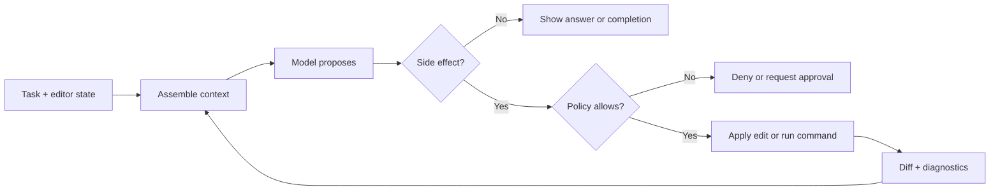

<TLDR>
  <TLDRCell label="what">
    An AI integrated development environment, or AI IDE, puts model suggestions inside the editor's existing navigation, diagnostics, diff, and terminal workflows.
  </TLDRCell>
  <TLDRCell label="when">
    Use one for interactive work that alternates between reading code, selecting context, and reviewing edits. Unattended batch work usually fits a CLI with a stable machine interface or an isolated agent better.
  </TLDRCell>
  <TLDRCell label="how">
    State the task, context, writable paths, and acceptance commands. Review each diff hunk, then verify with independent tools instead of treating the model's explanation as completion evidence.
  </TLDRCell>
</TLDR>

## What it is and why it exists

An AI integrated development environment is a code editor or IDE with large-language-model capabilities. It can send the current file, selection, symbols, diagnostics, and user-attached files to a <Term id="large-language-model">large language model</Term>, then display the response as completion, conversation, proposed edits, or executable actions. The model is one layer; the IDE still supplies the project system, language services, version-control interface, and terminal.

Conventional completion mainly uses syntax and known symbols to make short suggestions. AI completion can generate longer spans, chat can explain code or propose a plan, and agent mode can request file reads, edits, and commands. One product may expose all of these forms, so a sidebar label tells you little. Inspect what context the mode receives and what side effects it can cause.

An AI IDE reduces context switching. You don't have to paste error messages, type definitions, and neighboring implementations into a web chat, and you can accept or reject changes in a diff view. It works especially well when reading and editing alternate, such as filling in a missing branch, renaming an interface along its call chain, or fixing a defect from an existing test.

The tool does not understand the whole repository. It sees a limited view constructed for the current request by the editor and retrieval system, and that view can omit files, contain stale content, or treat untrusted repository text as instructions. The <Term id="context-window">context window</Term> has a finite capacity. A codebase index only finds candidate material; it is not a complete copy of repository truth.

IDE integration earns its keep by putting feedback closer to the code. It does not guarantee a smarter model. You can start from a selection, inspect an exact diff, read a language-service error, and run the project's own checks. For unattended execution, stable streams, or machine-readable exit status, use an interface that explicitly provides those contracts, such as an AI coding CLI or background-agent workflow.

### Four interaction forms

| Form | Primary input | Result | Default review unit |
|---|---|---|---|
| AI completion | Code near the cursor and editor state | Text to accept or ignore | One completion |
| Inline edit | Selection, instruction, and current file | Local replacement | One diff hunk |
| Chat | Attached context and conversation history | Explanation, code block, or advice | One response |
| Agent mode | Project context, tools, and permissions | Iterative reads, edits, and commands | File diff and execution record |

These forms can share a model while keeping different control boundaries. Completion normally enters a file only after you accept it; agent mode may issue several edit and command requests during one task. Before starting, confirm whether the current mode can write files, run terminal commands, access the network, and how each operation asks for approval.

### Let the task shape choose the mode

A short, local edit rarely needs an agent loop. If you already know the file and location, inline editing or completion is easier to control and easier to reject. Asking an agent to search the repository again only widens the context and potential edit scope.

A multi-file task fits agent mode only when its boundary is clear. "Rename this export and update static references in these two packages" names the symbol and scope. "Make all names consistent" has no completion condition and forces the model to invent judgment calls. The interface can display its result conveniently, but it cannot supply missing product decisions.

Choose in this order:

1. For only the next small span of code, use completion and read the whole suggestion before accepting it.
2. For a known selection and transformation, use an inline edit and inspect the exact diff.
3. To explain code, compare options, or find an entry point, begin with read-only chat.
4. Use agent mode with permission boundaries when the task needs cross-file search, edits, and verification.

A task can switch forms along the way. Use chat to identify a candidate call chain, then open a narrower editing task. That is usually easier to track than one long conversation that searches and edits at the same time. Restate the current goal when switching, because assumptions from early exploration should not silently become reasons for a change.

Do not choose a mode by model name. Context sources, available tools, approval policy, and delivery evidence determine the risk. Even if two modes use the same model, one that only returns text has a different security boundary from one that can run a terminal.

## How it works

A request begins with editor state. The IDE can obtain the current file, selection, cursor position, open tabs, language-service diagnostics, and version-control status. A product may also retrieve other snippets from a codebase index. Automatically selected material and files explicitly attached by the user form the request context, but exact rules vary by product, setting, and mode.

Project instructions may also enter the request. They can record build commands, code style, directory boundaries, and acceptance criteria, which avoids repeating the same details. An instruction file is still model context, not an operating-system policy. Writing "do not edit migrations" does not replace a host-enforced write boundary.

After receiving the task and context, the model returns text or a structured <Term id="tool-call">tool call</Term>. Text can become a completion or proposed edit. The IDE host checks a tool call, then reads a file, applies a change, or starts a command. The model does not save files directly; side effects come from the host and the processes it invokes.

An edit should return to a visible diff. Language services can immediately report new type or syntax errors, while test and build commands provide runtime evidence. Agent mode feeds those results into another model turn so it can correct its work. With completion or an inline edit, the developer usually decides the next step.



The host must enforce `Policy` in this diagram. An <Term id="approval-gate">approval gate</Term> can pause a write or command, but approval must still name the workspace, operation, and duration. Allowing one test command is not the same authorization as allowing every later terminal command.

### Where context comes from

Common context sources answer different questions. A selection says what you are working on; definitions and references show symbol connections; diagnostics point to errors a tool has already found; a version-control diff shows what this session changed; project instructions record repository conventions. Sending every source crowds out relevant code, so context selection needs priorities and a capacity limit.

Explicit attachments are easiest to audit because you know which files were sent. Automatic retrieval is useful for finding candidates in a large repository, but every hit must be checked against its source file. A tab you opened earlier is not necessarily in the current request, and an indexed symbol with the same name does not necessarily belong to the active build target.

### What language services and models each establish

An IDE's language service resolves syntax, types, definitions, and references according to project configuration. Its results are more direct than a model's guess about symbol relationships, but they still depend on the active build target, conditional compilation, and index freshness. A missing diagnostic may only mean the file is outside the current project, not that the code works in every target.

The model combines a task description, nearby code, and tool results into candidate changes. It can propose business logic that a language service cannot infer, but that flexibility comes without deterministic guarantees. Code that parses only has a plausible syntactic shape; it does not necessarily implement the intended behavior.

Separate the evidence types when combining them:

- Definition navigation and reference search show the static symbol relationships the IDE currently recognizes.
- Diagnostics show syntax or type problems under one loaded configuration.
- A model response is an explanation or suggestion based on limited context.
- Tests and builds are actual tool results for specific inputs and targets.

These signals can conflict. A model may claim that an import exists while the language service cannot resolve it; static checks may pass while a test exposes wrong behavior. Do not let a longer model explanation override a tool failure. First determine whether the command, configuration, and target are right, then decide whether the code or checking environment needs to change.

Diagnostic refresh also has timing. After a broad rename, old errors can remain briefly and new ones may appear only after dependent projects are reindexed. Running command-line checks before delivery avoids some interface-cache problems and gives you an exit status that can be retained.

### Advice, writes, and execution

A suggestion changes only candidate text on screen, a write changes the workspace, and execution starts repository code or an external tool. Control these three layers separately. A sensible low-risk starting point is to allow reads and suggestions, approve writes hunk by hunk, and run only the verification commands named by the task.

Permissions should follow <Term id="least-privilege">least privilege</Term>: each step gets only the capability it needs. Use a restricted mode to read an unfamiliar repository. If an operation can run installation scripts, database migrations, or deployment commands, inspect the exact command and target inside an isolated environment.

### Completion comes from evidence

"Fixed" is only natural-language output when the model says it. Reliable completion comes from the file diff, commands, working directories, exit status, and checks that did not run. A green editor decoration may only mean the current file has no diagnostic, or it may come from a language service that has not refreshed. It cannot replace repository acceptance commands.

Keep important results in an <Term id="execution-transcript">execution transcript</Term>, including commands, working directories, exit status, and skipped checks. For a small interactive edit, terminal history and the final diff may be enough. For a multi-file agent task, a structured record is easier to reproduce and audit.

## Examples

The next three programs do not call a vendor AI API. They implement portable controls around an AI IDE: selecting bounded context, checking proposed scope, and accepting work from independent evidence. All three use the same shopping-cart repair task and progressively tighten the session boundary.

### Select bounded, explainable context

Start by prioritizing context sources, then impose a size budget and ignored directories. This example keeps the selection, a diagnostic-related test, and an explicitly attached configuration. It skips a long document that exceeds the budget and always excludes the dependency directory.

<Depth level="quick">

```js run title="select_context.js"
const candidates = [
  { path: "src/cart.js", source: "selection", bytes: 1240 },
  { path: "test/cart.test.js", source: "diagnostic", bytes: 960 },
  { path: "package.json", source: "explicit", bytes: 780 },
  { path: "docs/cart.md", source: "index", bytes: 2200 },
  { path: "node_modules/pkg/index.js", source: "index", bytes: 900 },
];

const priority = { selection: 0, diagnostic: 1, explicit: 2, index: 3 };
const ignoredPrefixes = ["node_modules/", "dist/", ".git/"];
const budget = 3500;

let used = 0;
const selected = [];

for (const file of candidates.sort(
  (left, right) => priority[left.source] - priority[right.source],
)) {
  if (ignoredPrefixes.some((prefix) => file.path.startsWith(prefix))) continue;
  if (used + file.bytes > budget) continue;
  selected.push(file);
  used += file.bytes;
}

for (const file of selected) {
  console.log(`${file.path} [${file.source}]`);
}
console.log(`bytes=${used}`);
```

```text
src/cart.js [selection]
test/cart.test.js [diagnostic]
package.json [explicit]
bytes=2980
```

</Depth>

The output records both path and source, so you can explain why each file entered context. A real IDE measures model input in tokens rather than only bytes and may split indexed snippets. This example demonstrates an auditable priority rule; it does not claim to reproduce a product's internal algorithm.

The context list also exposes omissions. If cart totals depend on a currency-rounding contract from another package, attach that contract or its tests explicitly instead of only raising the budget. More context can add noise, and it cannot repair the wrong retrieval target.

### Check proposed edits before applying them

The second step represents the task scope and baseline revision as data. The IDE returns two suggestions. The source change is in scope, but the `package.json` change needs a separate justification and must not be accepted merely because it arrived beside a valid edit.

```js run title="review_edits.js"
const task = {
  baseline: "a13f8c2",
  allowed: new Set(["src/cart.js", "test/cart.test.js"]),
};

const proposals = [
  {
    path: "src/cart.js",
    before: "export const total = sum;",
    after: "export const total = sum ?? 0;",
  },
  {
    path: "package.json",
    before: '"test": "node --test"',
    after: '"test": "node --test --test-reporter=spec"',
  },
];

function verdict(edit, currentRevision) {
  if (currentRevision !== task.baseline) return "STALE";
  if (!task.allowed.has(edit.path)) return "OUTSIDE_SCOPE";
  if (edit.before === edit.after) return "NO_CHANGE";
  return "REVIEW";
}

for (const edit of proposals) {
  console.log(`${edit.path}: ${verdict(edit, "a13f8c2")}`);
}
```

```text
src/cart.js: REVIEW
package.json: OUTSIDE_SCOPE
```

`REVIEW` does not mean correct. It means the edit uses the expected baseline and has not crossed the stated boundary. You still need to read the surrounding code, inspect callers, and run tests. `OUTSIDE_SCOPE` does not prove a suggestion is worthless either; it means the task contract did not authorize it, so reject it or expand the scope explicitly.

The baseline check handles another IDE-specific risk: you may edit the same file by hand after the model creates a suggestion. The old replacement then uses a stale preimage and can overwrite newer code. A tool with diff preview may try to relocate the change, but conflict resolution must still use the current file content.

### Decide acceptance from command results

The last step checks two required commands and the changed paths. Tests passed and the scope is clean, but lint returned a nonzero status, so the complete delivery must be rejected. Do not round partial success up to completion.

```js run title="verify_delivery.js"
const evidence = new Map([
  ["node --test test/cart.test.js", { status: 0, cwd: "/repo" }],
  ["npm run lint", { status: 1, cwd: "/repo" }],
]);

const required = [
  "node --test test/cart.test.js",
  "npm run lint",
];
const allowedPaths = new Set(["src/cart.js", "test/cart.test.js"]);
const changedPaths = ["src/cart.js", "test/cart.test.js"];

const failedChecks = required.filter((command) => {
  const result = evidence.get(command);
  return !result || result.status !== 0 || result.cwd !== "/repo";
});
const outsideScope = changedPaths.filter((path) => !allowedPaths.has(path));
const accepted = failedChecks.length === 0 && outsideScope.length === 0;

console.log(`checks=${failedChecks.length === 0 ? "PASS" : "FAIL"}`);
console.log(`scope=${outsideScope.length === 0 ? "PASS" : "FAIL"}`);
console.log(accepted ? "ACCEPT" : "REJECT");
```

```text
checks=FAIL
scope=PASS
REJECT
```

The working directory is evidence too. The right command in the wrong package may discover no tests or read another configuration and return a misleading result. A production record should also retain stderr, timeouts, and output truncation. This sample keeps only status and directory to focus on the acceptance rule.

The three examples form a minimal control chain: first decide what the model can rely on, then decide which suggestions may enter review, and finally decide whether the changes meet delivery conditions. A better model does not remove any step. The same checks remain useful even if a person wrote every proposed edit.

## Pitfalls

> [!PITFALL]
> Treating "open in the editor" as "the model definitely saw it." Automatic context may include only the selection, part of the current file, or retrieval hits; other open tabs may not enter the request.

**Fix:** Explicitly attach authoritative files when a task depends on an exact interface or test contract, and ask the response to list the paths and assumptions it used. Inspect the context list before submitting if the tool exposes one. If it does not, ask a read-only question that proves the model has the key signature instead of letting it guess.

> [!PITFALL]
> Using repository instructions as actual permission control. A model can misread natural-language rules, and repository content may contain <Term id="prompt-injection">prompt injection</Term> that tells it to ignore a boundary.

**Fix:** Enforce writable paths, executable commands, network access, and sensitive-resource boundaries in the IDE host, sandbox, or container. Treat repository Markdown, issue text, and code comments as untrusted data. They may supply information, but they cannot expand permissions by themselves.

> [!PITFALL]
> Accepting a whole multi-file change after reading only the model-generated summary. The summary can omit lockfiles, configuration, public APIs, or changed test assertions, and it will not tell you which files are formatter noise.

**Fix:** Inspect the changed-file list first, then review hunk by hunk. Separate mechanical formatting from semantic changes, check deletions as well as additions, and follow public symbols to their callers. If scope is surprising, reject the block and request a smaller edit instead of stacking more patches on an unknown baseline.

> [!PITFALL]
> Treating a green inline diagnostic or the model's "tests passed" as repository completion. A language service may not cover the runtime path, and the model may have run the wrong command, used the wrong directory, or selected a suite that silently skipped tests.

**Fix:** Confirm acceptance commands from repository documentation or CI configuration, run them yourself in a known working directory, and inspect exit status, test count, and skips. A defect fix needs a test that reproduces the problem first. Running only the new test does not establish that neighboring behavior still works.

> [!PITFALL]
> Attaching credential files, production logs, customer data, dependency trees, or generated directories to "provide enough context." Extra material displaces relevant code and may send sensitive content to the model provider configured for the tool.

**Fix:** Use ignore rules and an explicit attachment list, and redact data before creating a minimal reproduction. Check product, account, and organization data-handling settings, but do not treat those settings as your data-classification policy. Keep secrets outside model context and inject them only into controlled processes that genuinely need them.

<Depth level="deep">

## Context is not the whole repository

The editor owns a great deal of state, but the model receives only part of it on each request. A selection and current file have positional relevance, definitions and references have symbol relevance, and codebase retrieval finds semantically or textually similar snippets in an index. Conversation history, terminal output, and project instructions use the same bounded window. IDE integration therefore does not mean permanent understanding of the whole repository.

An index normally locates candidate content; it does not replace source files. An indexed fragment may trail a recent edit or omit conditional compilation, generation provenance, or constraints around the fragment. Reread the current file for important decisions, then confirm symbol relationships with language services, search, or the build system. A model naming a file proves only that it received some representation, not that the representation was current and complete.

Context compression adds another stale-state risk. A long session may summarize early tool results, then a developer changes the files by hand. If the tool supports a new task or cleared conversation, start one when the boundary changes. If you continue the old session, reattach the current target, baseline, and acceptance criteria.

Automatic retrieval and explicit attachments solve different problems. Retrieval broadens discovery when you do not yet know the implementation location. Attachments pin authoritative material when you already have a contract, reproduction, or target file. A dependable workflow searches for candidates, then narrows the evidence to files you can name one by one instead of depending on a conversation that only grows.

### Instructions are context too

Repository-wide and path-specific instructions can state architecture boundaries, commands, and style, but they remain natural language. Several files can conflict, and path matching can keep a rule from applying where you expected. Whenever a task crosses directories, confirm which rules are active instead of merely remembering that the repository root has an instruction file.

Do not promote external content into high-priority instructions. Code comments, issues, logs, and dependency documentation can contain imperative sentences. Some are examples; some may be malicious prompts. The host must distinguish system policy, user task, repository conventions, and ordinary data. If provenance is unclear, keep permissions unchanged and ask for human judgment.

### Signals that context is stale

The current session is probably working from stale state when the model restores deleted names, repeats completed edits, or cites lines absent from the diff. Another signal is a repeated request to search more widely without naming new evidence that changed the plan. Adding more conversational corrections lengthens history and may not restore a dependable baseline.

Repair the state, not the conversation:

1. Save or reject the current diff so the workspace contains only changes you understand.
2. Reread target files, version-control status, and the latest failing output.
3. Establish fresh context with one task objective, allowed paths, and acceptance commands.
4. If old discussion matters, carry forward only verified decisions, not model guesses.

Not every long session needs a restart. Continuing can avoid repeated discovery if files did not change externally, tool results remain locatable, and the remaining objective is stable. What matters is whether each current suggestion can be traced to fresh files and command evidence, not the number of chat turns.

A version-control baseline is a cheap checkpoint. Record status before the task and inspect the diff again after accepting a set of edits. That separates pre-existing dirty files, model changes, and manual corrections. Without it, an IDE's "undo last step" cannot reliably say which changes belong to the task.

## Permission boundaries define real capability

An AI IDE's risk follows what the host can do, not how mild the chat panel looks. Read-only chat can leak supplied context; file writes can change code and configuration; terminal execution can run repository scripts; network and credential access expand impact to external systems. Evaluate each capability and its default state separately.

Approval is not a one-time trust button. You can separately approve one explicit file edit, one test command with fixed arguments, and one dependency download from a bounded registry. "Allow everything for this session" gives later model mistakes and repository prompt injection the same power, defeating the point of approval.

The workspace has its own trust state. Opening an unfamiliar repository may trigger extensions, tasks, debuggers, language servers, or installation scripts, not only AI features. Inspect directories and project configuration in restricted mode before enabling execution. AI command approval does not replace the editor's security controls for extensions and workspace code.

A disposable workspace gives you a clear recovery boundary. A separate branch or worktree makes the session diff attributable, while a container or temporary environment can limit processes and credentials. Isolation does not prove generated code is correct. It reduces the impact of bad execution and makes discarding an attempt more reliable than manually reversing scattered side effects.

### Visual review still needs evidence

A diff view shows text changes well but does not automatically explain runtime behavior. Moved code can appear as a deletion and addition, generated files create noise, and a semantic rename can miss string references. Combine the file list and symbol search with command results instead of judging whether the red and green line counts look balanced.

Partial acceptance changes the baseline for later diffs. After accepting a hunk, editing by hand, and asking the model to continue, confirm that it read the current version. Suggestions that repeat completed work or restore old names usually signal stale context. Stop and refresh the target file instead of trying to repair memory with more prompting.

### Undo does not cover every side effect

Editor undo usually controls text buffers only. A terminal command may install dependencies, generate files, modify a database, start a process, or send a request to an external service. Those effects do not disappear when you undo a diff hunk. Before an agent executes a command, decide whether the operation is reversible and where its recovery procedure lives.

Version control covers only tracked files. Untracked build output, ignored directories, global tool caches, and paths outside the workspace may have changed without appearing in an ordinary diff. After a task with side effects, inspect processes, the file system, and external systems rather than only the commit view.

Use a dry run, temporary database, or disposable container for a command that may damage state. If shared infrastructure must be touched, put the exact target, backup, and recovery plan before approval, and let a person perform the final operation. A rollback command generated by a model is another action to review, not automatic insurance.

Narrow changes reduce recovery work. If one session owns one verifiable side effect, failure can discard the workspace or revert a named commit. Combining code changes, dependency upgrades, data migration, and deployment in one request makes the state after any failure hard to explain.

## Edge cases in large codebases

A monorepo makes "project root" ambiguous. The editor workspace root, version-control root, package root, and build root can differ, and configuration or test commands may be overridden at each layer. Name the target package and command directory when starting. When reviewing a dependency edit, confirm that it landed in the right manifest.

Generated files need an owner. If a schema produces types, clients, or resources, editing the output directly will disappear at the next build. Ask the AI to locate generation markers, source schema, and regeneration command, then inspect whether the regenerated diff contains only expected changes. If the generator cannot run locally, list that as unverified instead of hand-editing output and calling the task done.

Symbol tools cannot find every reference. Reflection, string keys, templates, database migrations, configuration names, and language boundaries may bypass static reference search. When renaming or deleting a public symbol, add text search and consumer tests. If the repository has several build targets, state which ones actually ran.

Symlinks and multi-root workspaces break simple path-prefix checks. A file shown in the workspace tree may resolve outside the allowed directory, while a legitimate shared package may intentionally live under another root. Enforce write policy on resolved paths and an explicit set of roots. Use interface-relative names only for display.

Binary files, huge data, bundled output, and vendored directories should not go directly into model context. Find their textual source, schema, metadata, or generation step. If a task truly needs binary behavior, use a deterministic tool to extract bounded evidence and provide the result as data instead of asking the model to guess from a filename.

</Depth>

<Checkpoint id="ai-era/ai-ide" />

## Further reading

- [Visual Studio Code: Agents overview](https://code.visualstudio.com/docs/agents/overview)
- [Visual Studio Code: Chat context](https://code.visualstudio.com/docs/chat/copilot-chat-context)
- [GitHub Docs: Add custom instructions for Copilot](https://docs.github.com/en/copilot/how-tos/copilot-on-github/customize-copilot/add-custom-instructions)
