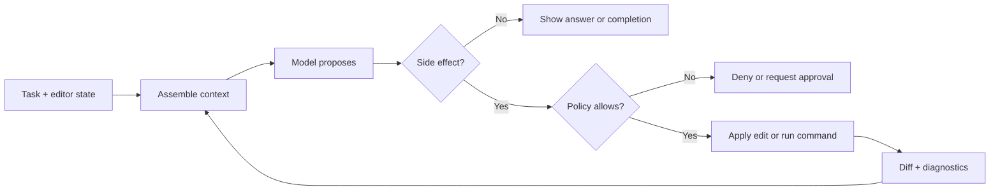

<TLDR>
  <TLDRCell label="what">
    AI 集成开发环境（AI IDE）把模型建议放进编辑器已有的文件导航、诊断、差异视图和终端工作流中。
  </TLDRCell>
  <TLDRCell label="when">
    它适合需要频繁查看代码、选择上下文并逐项审查修改的交互式开发；无人值守的批处理通常更适合有稳定机器接口的 CLI 或隔离智能体。
  </TLDRCell>
  <TLDRCell label="how">
    明确任务、上下文、可修改路径和验收命令，逐块审查差异，再用独立工具确认结果，不把模型说明当作完成证据。
  </TLDRCell>
</TLDR>

## 是什么，为什么存在

AI 集成开发环境是在代码编辑器或 IDE 中加入大语言模型能力的开发环境。它可以把当前文件、选区、符号、诊断和用户附加的文件交给<Term id="large-language-model">大语言模型（large language model）</Term>，再把返回内容显示为补全、对话回答、编辑建议或可执行操作。模型只是其中一层；项目系统、语言服务、版本控制界面和终端仍由 IDE 提供。

普通自动补全主要依据语法与已知符号给出短建议。AI 补全可以生成较长片段，对话可以解释代码或提出方案，智能体模式还可以请求读取文件、修改代码与运行命令。同一个产品可能同时提供这些形态，所以不要根据侧边栏名称判断能力；要看它实际取得了什么上下文，又能产生哪些副作用。

AI IDE 解决的是上下文切换成本。你不必把错误消息、类型定义和相邻实现逐段复制到网页对话中，也能在差异视图里接受或拒绝修改。它尤其适合代码阅读与编辑交替发生的任务，例如补齐一个分支、沿调用链重命名接口，或根据现有测试修复缺陷。

这类工具并不了解整个代码库。它看到的是编辑器和检索器为本次请求构造的有限视图，而且这个视图可能遗漏文件、包含过期内容，或把仓库中的不可信文本也当成指令。<Term id="context-window">上下文窗口（context window）</Term>的容量有限，代码库索引也只是查找候选内容的手段，不是仓库真相的完整副本。

IDE 集成的价值在于让反馈更靠近代码，但它不保证模型更聪明。你可以从选区发起请求，在编辑器中查看精确差异，读取语言服务的错误，再运行项目自己的检查。任务若需要无人值守、稳定的标准流或机器可读的退出状态，就应选择明确提供这些契约的界面，例如 AI 编程 CLI 或后台智能体工作流。

### 四种交互形态

| 形态 | 主要输入 | 返回结果 | 默认审查单位 |
|---|---|---|---|
| AI 补全 | 光标附近代码与编辑状态 | 可接受或忽略的文本 | 一段补全 |
| 行内编辑 | 选区、指令与当前文件 | 局部替换 | 一个差异块 |
| 对话 | 附加上下文与会话历史 | 解释、代码块或建议 | 一条回答 |
| 智能体模式 | 项目上下文、工具与权限 | 多轮读取、编辑和命令 | 文件差异与执行记录 |

这四种形态可以共享模型，却有不同的控制边界。补全通常由你显式接受才进入文件；智能体模式可能在一次任务中连续产生多个编辑和命令请求。开始前先确认当前模式是否能写文件、运行终端、访问网络，以及每种操作怎样请求批准。

### 任务形状决定使用方式

短而局部的编辑通常不需要智能体循环。你已经知道文件和修改位置时，行内编辑或补全更容易控制，也更容易拒绝一个不合适的建议。让智能体重新搜索整个仓库，反而会扩大上下文和改动范围。

多文件任务只有在边界明确时才适合智能体模式。比如「重命名这个导出，并更新这两个包中的静态引用」给出了符号与范围；「统一所有命名」没有完成条件，会迫使模型自己发明判断标准。界面可以方便地展示结果，却不能替你补齐缺失的产品决策。

可以按下面的顺序选择：

1. 只需要下一小段代码时，使用补全，并在接受前读完建议。
2. 已知选区和目标转换时，使用行内编辑，并审查精确差异。
3. 需要解释、比较方案或定位入口时，先使用只读对话。
4. 需要跨文件搜索、修改与验证时，才使用带权限边界的智能体模式。

任务也可能在过程中切换形态。先用对话找出候选调用链，再开一个范围更窄的编辑任务，通常比让同一长会话边查边改更容易追踪。切换时重新写明当前目标，因为早期探索中的假设不应悄悄变成修改依据。

模式选择不应根据模型名称。真正影响风险的是上下文来源、可用工具、批准策略和交付证据。即使两个模式使用同一个模型，一个只返回文本，另一个可以运行终端，它们也有完全不同的安全边界。

## 工作原理

一次请求先从编辑器状态开始。IDE 可以取得当前文件、选区、光标位置、打开的标签页、语言服务诊断和版本控制状态；产品也可能通过代码库索引检索其他片段。自动选取的材料与用户显式附加的文件共同组成请求上下文，但具体规则因产品、设置和当前模式而异。

项目指令通常也会进入请求。它们可以记录构建命令、代码风格、目录边界和验收标准，减少每次重复说明。不过，指令文件是提供给模型的上下文，不是操作系统级策略。写下「不要修改迁移文件」不能代替宿主对写入路径的实际限制。

模型收到任务与上下文后，会返回文本或结构化的<Term id="tool-call">工具调用（tool call）</Term>。文本可以成为补全或编辑提议；工具调用则由 IDE 宿主检查，然后读取文件、应用修改或启动命令。模型本身不会直接保存文件，真正的副作用来自宿主与它调用的进程。

编辑结果应回到一个可见的差异视图。语言服务可以立即产生新的类型错误或语法诊断，测试和构建命令则提供运行时证据。智能体模式会把这些结果送入下一轮，让模型继续修正；在补全或行内编辑中，下一步通常由开发者决定。



图中的 `Policy` 必须由宿主执行。一个<Term id="approval-gate">审批门（approval gate）</Term>可以暂停某次写入或命令，但批准范围仍要具体到工作区、操作和持续时间。允许一次测试命令，与允许之后任意终端命令，不是同一项授权。

### 上下文从哪里来

常见上下文来源各自回答不同问题。当前选区说明你正在处理什么；定义与引用说明符号怎样连接；诊断指出工具已经发现的错误；版本控制差异显示这次会话改了什么；项目指令则记录仓库约定。把所有来源都塞入请求会挤掉真正相关的代码，因此上下文选择需要优先级和容量限制。

显式附加是最容易审查的来源，因为你知道送入了哪些文件。自动检索适合在大型仓库中寻找候选片段，但命中结果必须回到源文件核对。打开过一个标签页不等于它仍在本次上下文中，索引找到了一个同名符号也不等于它属于正在构建的目标。

### 语言服务与模型各自负责什么

IDE 的语言服务根据项目配置解析语法、类型、定义与引用。它的结果通常比模型对符号关系的猜测更直接，但仍受当前构建目标、条件编译和索引刷新状态限制。一个灰掉的错误可能只是文件尚未纳入当前项目，而不是代码在所有目标中都有效。

模型擅长把任务说明、附近代码和工具结果组合成候选修改。它也可能补出语言服务无法推导的业务逻辑，但这种灵活性没有确定性保证。模型写出能通过解析的代码，只说明语法形状合理，不说明它选择了正确行为。

把两者组合时，先区分证据类型：

- 定义跳转和引用搜索说明 IDE 当前识别出的静态符号关系。
- 诊断说明某个已加载配置下的语法或类型问题。
- 模型回答说明它根据有限上下文提出的解释或建议。
- 测试与构建说明具体输入和目标上的实际工具结果。

这些信号可能互相矛盾。模型可能声称导入存在，而语言服务无法解析；静态检查可能通过，而测试暴露行为错误。不要让模型用更长的解释覆盖工具失败，应先查明命令、配置与目标是否正确，再决定代码还是检查环境需要修改。

诊断刷新也有时序。大范围重命名后，旧错误可能短暂保留，新错误也可能等依赖项目重新索引后才出现。交付前运行命令行检查可以避开部分界面缓存问题，并给出可保存的退出状态。

### 建议、写入与执行

建议只改变屏幕上的候选文本，写入会改变工作区，执行还会启动仓库代码或外部工具。这三层需要分别控制。一个合理的低风险起点是允许读取与生成建议，逐块批准写入，并只运行任务明确列出的验证命令。

权限应遵循<Term id="least-privilege">最小权限（least privilege）</Term>：当前步骤只获得完成它所需的能力。对于不熟悉的仓库，先使用受限模式读取代码；对于会执行安装脚本、数据库迁移或部署命令的操作，应在隔离环境中检查具体命令和目标。

### 完成状态来自证据

模型说「已修复」只是一条自然语言输出。可靠的完成状态来自文件差异、命令、工作目录、退出码和没有执行的检查。IDE 中的绿色装饰可能只代表当前文件没有诊断，也可能来自尚未刷新的语言服务，不能替代仓库的验收命令。

把关键结果保存为<Term id="execution-transcript">执行记录（execution transcript）</Term>，至少包含运行的命令、工作目录、退出状态和跳过项。对小型交互编辑，终端历史与最终差异可能已经够用；对多文件智能体任务，最好保留结构化记录，便于复现与审计。

## 示例

下面的三个程序不调用某个厂商的 AI API。它们实现的是围绕 AI IDE 的可移植控制：选择有限上下文、审查建议范围、根据独立证据决定是否接受。三段代码使用同一个购物车修复任务，依次收紧会话边界。

### 选择有限且可说明的上下文

先给上下文来源排优先级，再设置容量与忽略目录。这里优先保留选区、诊断关联测试和显式附加配置；索引找到的长文档因超出预算而跳过，依赖目录则始终排除。

<Depth level="quick">

```js run title="select_context.js"
const candidates = [
  { path: "src/cart.js", source: "selection", bytes: 1240 },
  { path: "test/cart.test.js", source: "diagnostic", bytes: 960 },
  { path: "package.json", source: "explicit", bytes: 780 },
  { path: "docs/cart.md", source: "index", bytes: 2200 },
  { path: "node_modules/pkg/index.js", source: "index", bytes: 900 },
];

const priority = { selection: 0, diagnostic: 1, explicit: 2, index: 3 };
const ignoredPrefixes = ["node_modules/", "dist/", ".git/"];
const budget = 3500;

let used = 0;
const selected = [];

for (const file of candidates.sort(
  (left, right) => priority[left.source] - priority[right.source],
)) {
  if (ignoredPrefixes.some((prefix) => file.path.startsWith(prefix))) continue;
  if (used + file.bytes > budget) continue;
  selected.push(file);
  used += file.bytes;
}

for (const file of selected) {
  console.log(`${file.path} [${file.source}]`);
}
console.log(`bytes=${used}`);
```

```text
src/cart.js [selection]
test/cart.test.js [diagnostic]
package.json [explicit]
bytes=2980
```

</Depth>

输出同时记录路径和来源，所以你可以解释为什么每个文件进入上下文。真实 IDE 会使用词元而不只是字节计算模型输入，而且可能对索引片段做切分；示例只演示可审计的优先级，不声称复制任何产品内部算法。

上下文清单也能暴露遗漏。若购物车总价依赖另一个包的货币舍入规则，你应显式添加该契约或对应测试，而不是只把预算调大。更大的上下文可能增加噪声，也不能修复错误的检索目标。

### 在应用前检查编辑建议

第二步把任务范围和基线版本写成数据。IDE 返回两个建议，其中源码修改属于允许范围，`package.json` 修改则需要单独解释，不能因为它与正确修改出现在同一回答中就一起接受。

```js run title="review_edits.js"
const task = {
  baseline: "a13f8c2",
  allowed: new Set(["src/cart.js", "test/cart.test.js"]),
};

const proposals = [
  {
    path: "src/cart.js",
    before: "export const total = sum;",
    after: "export const total = sum ?? 0;",
  },
  {
    path: "package.json",
    before: '"test": "node --test"',
    after: '"test": "node --test --test-reporter=spec"',
  },
];

function verdict(edit, currentRevision) {
  if (currentRevision !== task.baseline) return "STALE";
  if (!task.allowed.has(edit.path)) return "OUTSIDE_SCOPE";
  if (edit.before === edit.after) return "NO_CHANGE";
  return "REVIEW";
}

for (const edit of proposals) {
  console.log(`${edit.path}: ${verdict(edit, "a13f8c2")}`);
}
```

```text
src/cart.js: REVIEW
package.json: OUTSIDE_SCOPE
```

`REVIEW` 不表示修改正确，只表示它基于预期版本且尚未越界。仍需阅读前后代码、检查调用方并运行测试。`OUTSIDE_SCOPE` 也不一定表示建议毫无价值；它表示任务契约没有授权该修改，开发者必须拒绝它或明确扩大范围。

基线检查处理另一种 IDE 特有风险：你可能在模型生成建议后手工编辑了同一文件。此时旧的替换片段基于过期前像，强行应用可能覆盖新代码。支持差异预览的工具通常会尝试重新定位修改，但冲突解决仍要由当前文件内容决定。

### 用命令结果决定是否接受

最后一步检查两条必需命令与修改路径。测试通过、范围也正确，但检查命令返回非零状态，因此整个交付必须拒绝。不能把「部分通过」向上取整为完成。

```js run title="verify_delivery.js"
const evidence = new Map([
  ["node --test test/cart.test.js", { status: 0, cwd: "/repo" }],
  ["npm run lint", { status: 1, cwd: "/repo" }],
]);

const required = [
  "node --test test/cart.test.js",
  "npm run lint",
];
const allowedPaths = new Set(["src/cart.js", "test/cart.test.js"]);
const changedPaths = ["src/cart.js", "test/cart.test.js"];

const failedChecks = required.filter((command) => {
  const result = evidence.get(command);
  return !result || result.status !== 0 || result.cwd !== "/repo";
});
const outsideScope = changedPaths.filter((path) => !allowedPaths.has(path));
const accepted = failedChecks.length === 0 && outsideScope.length === 0;

console.log(`checks=${failedChecks.length === 0 ? "PASS" : "FAIL"}`);
console.log(`scope=${outsideScope.length === 0 ? "PASS" : "FAIL"}`);
console.log(accepted ? "ACCEPT" : "REJECT");
```

```text
checks=FAIL
scope=PASS
REJECT
```

工作目录也是证据的一部分。正确的命令在错误包目录中可能没有发现任何测试，或读取另一套配置后给出误导结果。实际记录还应保留标准错误、超时和输出截断状态；这里为了突出验收逻辑，只保存了退出状态与目录。

这三个例子形成一个最小控制链：先决定模型能依据什么，再决定哪些建议可以进入审查，最后决定修改是否达到交付条件。模型质量变化不会取消其中任何一步。即使建议完全由人编写，这些检查也仍然有用。

## 陷阱

> [!PITFALL]
> 把「当前在编辑器里打开」当成「模型肯定看到了」。自动上下文可能只包含选区、当前文件的片段或检索命中，打开的其他标签页未必进入请求。

**修复方法：** 对依赖精确接口或测试契约的任务，显式附加权威文件，并要求回答列出它使用的路径与假设。若工具能显示上下文清单，提交请求前检查一次；若不能，就用问题验证模型是否掌握关键签名，不要让它猜。

> [!PITFALL]
> 用仓库指令代替真正的权限控制。模型可能误解自然语言规则，仓库内容也可能包含诱导其忽略边界的<Term id="prompt-injection">提示注入（prompt injection）</Term>文本。

**修复方法：** 把允许写入的路径、可执行命令、网络访问和敏感资源限制交给 IDE 宿主、沙箱或容器执行。把仓库 Markdown、Issue 内容和代码注释都视为不可信数据；它们可以提供信息，不能自行扩大权限。

> [!PITFALL]
> 一次接受整份多文件修改，只阅读模型生成的摘要。摘要可能漏掉锁文件、配置、公共 API 或测试断言中的变化，也不会告诉你哪些文件是自动格式化产生的噪声。

**修复方法：** 先看修改文件列表，再按差异块审查。把机械格式化与语义修改分开，确认删除内容和新增内容，并沿公共符号检查调用方。范围异常时先拒绝整块，再要求更小的修改，不要在未知基线上继续叠加补丁。

> [!PITFALL]
> 把行内绿色诊断或模型的「测试已通过」当成仓库完成状态。语言服务可能没有覆盖运行时路径，模型也可能运行了错误命令、错误目录或一个自动跳过用例的测试集。

**修复方法：** 从仓库文档或 CI 配置确认验收命令，在已知工作目录中自己运行，并检查退出码、测试数量和跳过项。缺陷修复应先有能复现问题的测试；只运行新增测试还不能证明相邻行为没有回归。

> [!PITFALL]
> 为了「给足上下文」而附加凭据文件、生产日志、客户数据、依赖树或生成目录。多余材料既挤占上下文，也可能把敏感内容发送到工具配置的模型提供方。

**修复方法：** 使用忽略规则和显式附件清单，先脱敏再提供最小复现。检查产品、账户和组织的数据处理设置，但不要把设置说明当成数据分类策略。秘密值应留在模型上下文之外，并通过受控运行环境注入给确实需要它们的程序。

<Depth level="deep">

## 上下文不是整个仓库

编辑器拥有很多状态，但模型每次只能接收其中一部分。选区和当前文件具有高位置相关性，定义与引用具有符号相关性，代码库检索则根据索引寻找语义或文本相近的片段。会话历史、终端输出和项目指令也会占用同一个有限窗口，因此「接入 IDE」不等于「始终理解全仓库」。

索引通常用于定位候选内容，而不是替代源文件。一个索引片段可能落后于刚完成的编辑，也可能省略条件编译、生成来源或文件周边约束。关键判断应重新读取当前文件，并用语言服务、搜索或构建系统确认符号关系。模型引用一个文件名，只能证明它收到了某种表示，不能证明表示最新且完整。

上下文压缩会带来另一层过期风险。长会话可能把早期工具结果概括成短摘要，而开发者随后又手工修改了文件。如果工具支持新任务或清空会话，边界变化后开启新会话通常更容易审查；若继续旧会话，就应重新附加当前目标、基线和验收标准。

自动检索与显式附件各有用途。自动检索扩大搜索范围，适合你还不知道实现位置时；显式附件固定权威材料，适合已有契约、复现或目标文件时。可靠的工作流先用搜索找候选，再缩小到可以逐个命名的依据，而不是长期依赖一个不断膨胀的对话。

### 指令也属于上下文

仓库级和路径级指令可以说明架构边界、命令与风格，但它们仍然是自然语言。多个文件可能互相冲突，路径匹配也可能让某条规则没有应用到预期文件。每当任务跨目录时，都要确认生效规则，而不是只记得仓库根目录有一个说明文件。

不要把外部内容直接提升为高优先级指令。代码注释、Issue、日志和依赖文档都可能包含命令式句子，其中有些只是示例，有些可能是恶意提示。宿主需要区分系统策略、用户任务、仓库约定和普通数据；无法确认来源时，应保持权限不变并请求人工判断。

### 上下文过期的信号

模型开始恢复已经删除的名称、重复完成过的修改，或引用差异中不存在的行时，当前会话很可能基于旧状态。另一个信号是它不断建议扩大搜索，却不能指出哪条新证据改变了方案。继续补充口头纠正会让历史更长，不一定能恢复可靠基线。

遇到这些现象时，按状态而不是按对话修复：

1. 保存或拒绝当前差异，确定工作区只保留你理解的修改。
2. 重新读取目标文件、版本控制状态与最近一次失败输出。
3. 用一句任务目标、允许路径和验收命令建立新上下文。
4. 需要保留旧讨论时，只带走已经验证的决定，不带走模型猜测。

并非每次长会话都要重开。若文件没有在外部变化，工具结果仍可定位，而且剩余目标没有改变，继续会话可以节省重复搜索。关键是能否把当前建议追溯到新鲜的文件和命令证据，而不是对话轮数本身。

版本控制基线提供了一个便宜的检查点。开始任务时记录状态，接受一组修改后再次查看差异；这样能区分原有脏文件、模型修改和手工修正。没有这条边界时，IDE 的「撤销上一步」很难回答哪些变化属于本次任务。

## 权限边界决定真实能力

AI IDE 的风险取决于宿主能做什么，而不是聊天框看起来多么温和。只读对话最多泄露已提供的上下文；文件写入可以改变代码与配置；终端执行可以运行仓库脚本；网络与凭据又把影响范围扩大到外部系统。评估工具时，应逐项查看这些能力及其默认状态。

审批不是一次性的信任按钮。一次明确的文件修改、一个固定参数的测试命令和一个限定注册表的依赖下载，可以分别批准。宽泛的「本次会话全部允许」会让后续模型错误和仓库提示注入继承同样能力，失去审批原本的意义。

工作区本身也有信任状态。打开陌生仓库可能触发扩展、任务、调试器、语言服务器或安装脚本，而不只是 AI 功能。先在受限模式检查目录与项目配置，再决定是否执行。AI 的命令审批不能替代编辑器对扩展和工作区代码的安全控制。

可丢弃工作区提供了清晰的恢复边界。独立分支或 worktree 让本次差异容易归因，容器或临时环境可以限制进程和凭据。隔离不证明生成代码正确，但它缩小了错误执行的影响，并使拒绝整次尝试比手工撤销零散副作用更可靠。

### 视觉审查仍需要证据

差异视图擅长显示文本变化，却不会自动说明运行时行为。移动代码可能看起来像删除加新增，生成文件会制造大量噪声，语义重命名也可能遗漏字符串引用。审查者应结合文件列表、符号搜索和命令结果，而不是只看红绿行数是否对称。

局部接受会改变之后差异的基线。接受一个块、手工编辑，再让模型继续时，应确认它读取了当前版本。若建议开始重复已完成修改或恢复旧名称，通常说明上下文过期；停止并刷新目标文件，比继续用提示词纠正记忆更可靠。

### 撤销不能覆盖所有副作用

编辑器撤销通常只处理文本缓冲区。终端命令可能安装依赖、生成文件、修改数据库、启动进程或向外部服务发送请求，这些副作用不会随着撤销一个差异块自动消失。智能体执行命令前，应先判断操作是否可逆以及恢复步骤在哪里。

版本控制也只覆盖被跟踪的文件。未跟踪构建产物、忽略目录、全局工具缓存和工作区外路径可能已经变化，却不会出现在普通差异中。运行有副作用的任务后，需要检查进程、文件系统和外部系统，而不是只看提交视图。

对可能破坏状态的命令，先使用预演、临时数据库或可丢弃容器。确实需要触碰共享环境时，把精确目标、备份与恢复计划放在批准之前，并让人执行最终操作。模型生成的回滚命令仍然是另一项待审查操作，不是自动保险。

小范围修改可以减少恢复工作。一次会话只承担一种可验证的副作用，失败时就能丢弃工作区或回退明确提交。把代码修改、依赖升级、数据迁移和部署塞进同一个请求，会让任何一步失败后的状态都难以说明。

## 大型代码库中的边界情况

Monorepo 让「项目根目录」变得含糊。编辑器工作区根、版本库根、包根和构建根可能不同，配置与测试命令也可能逐层覆盖。发起任务时要命名目标包与命令目录，审查依赖修改时确认它落在正确清单中。

生成文件需要追溯所有者。若类型、客户端或资源由模式文件生成，直接编辑产物会在下次构建时消失。要求 AI 找出生成标记、源模式和再生成命令，并检查生成后的差异是否只包含预期变化。无法在本地运行生成器时，应把这一点列为未验证，而不是手改输出伪装完成。

符号工具并不能覆盖所有引用。反射、字符串键、模板、数据库迁移、配置名称和跨语言边界可能绕过静态引用搜索。重命名或删除公共符号时，应同时做文本搜索并运行消费者测试；若仓库有多个构建目标，还要说明实际验证了哪些目标。

软链接与多根工作区会破坏简单的路径前缀判断。一个显示在工作区树中的文件，解析后可能位于允许目录之外；相反，合法的共享包也可能故意位于另一个根。执行写入策略时要使用解析后的路径和明确根集合，界面中的相对名称只用于展示。

二进制、超大文件、压缩产物和供应商目录不适合直接送入模型。应该找到它们的文本来源、模式、元数据或生成步骤。若任务真的需要分析二进制行为，就使用相应的确定性工具提取有限证据，再把结果作为数据提供，而不是让模型根据文件名猜测。

</Depth>

<Checkpoint id="ai-era/ai-ide" />

## 延伸阅读

- [Visual Studio Code：Agents 概览](https://code.visualstudio.com/docs/agents/overview)
- [Visual Studio Code：Chat context](https://code.visualstudio.com/docs/chat/copilot-chat-context)
- [GitHub Docs：为 Copilot 添加自定义指令](https://docs.github.com/en/copilot/how-tos/copilot-on-github/customize-copilot/add-custom-instructions)
