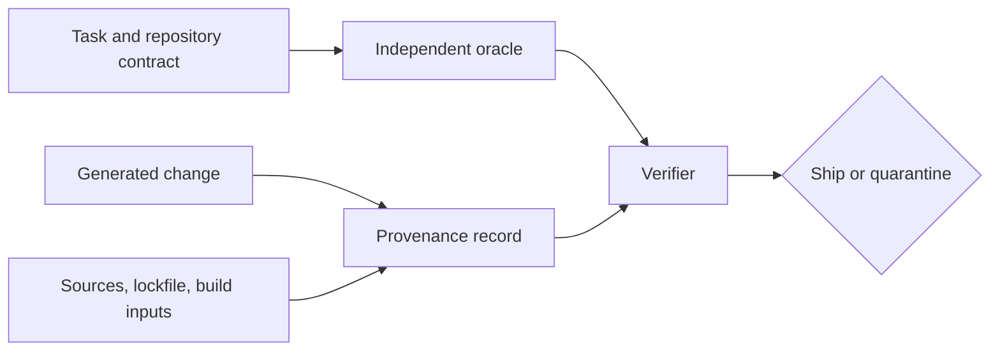

<TLDR>
  <TLDRCell label="what">
    Code provenance records where code and dependencies came from; verification tests the claims that matter with evidence independent of the generator.
  </TLDRCell>
  <TLDRCell label="trap">
    A model's citation, a passing generated test, a lockfile, or a valid signature can each be useful while proving much less than a reviewer assumes.
  </TLDRCell>
  <TLDRCell label="fix">
    Trace sources to immutable revisions and licenses, reconcile the complete dependency graph, then reproduce behavior and identity checks in a controlled environment.
  </TLDRCell>
</TLDR>

## What it is and why it exists

<Term id="code-provenance">Code provenance</Term> is evidence about the origin and transformation history of source code, dependencies, and built artifacts. For a changed source file, that can include an internal task, an upstream file and <Term id="revision">revision</Term>, the license that governed reuse, and the edits applied locally. For a package or binary, it can include the resolved version, content digest, build inputs, and builder identity.

Verification is the act of testing a relevant <Term id="claim">claim</Term> against another observation. If an agent says that four cases pass, rerun cases whose expected results come from the requirement rather than from the implementation. If a release says it came from a particular workflow, verify its attestation, subject digest, and expected builder identity.

The two ideas answer different questions. Provenance asks, “Where did this material come from, and how did it get here?” Verification asks, “What evidence supports the property we need?” Neither question alone proves that code is correct, secure, maintainable, or legally usable.

Generated code makes the distinction urgent because fluent explanations are cheap. An agent can report a command it never ran, invent a source link, reproduce a remembered pattern without a reliable citation, or add a convenient dependency whose transitive license conflicts with distribution policy. A clean diff doesn't expose any of those facts by itself.

You apply this review when a generated change introduces a nontrivial algorithm, adapts an external snippet, adds or upgrades a package, copies configuration, changes generated output, or produces a release artifact. Tiny glue code may need only a task reference and normal change review. Cryptography, protocol implementations, parsers, and copied compatibility code need a much stronger chain.

Provenance is granular. One file may contain original repository code, agent-generated glue, and an adapted algorithm with separate obligations. A repository-level note such as “written with AI” is too broad to tell a later maintainer what can be upgraded, relicensed, or removed.

The word “independent” describes the evidence path, not necessarily another person. A reviewer can run a deterministic command, compare against an official specification, inspect registry metadata, or use a pre-existing test oracle. Evidence isn't independent when it merely restates the same generated assumption in another file.

Record uncertainty honestly. If an agent can't identify the origin of a distinctive block, label that origin unresolved and quarantine or replace the block according to policy. Do not convert “the model says it generated this” into proof that no protected source influenced the output.

### Four properties that must stay separate

Correctness evidence shows that behavior matches an acceptance criterion or invariant. Integrity evidence shows that bytes match a recorded digest. Authenticity evidence connects a signed statement to an identity under a trust policy. License evidence identifies terms and obligations that still require a compatibility decision.

These properties can disagree. A correctly signed artifact can contain vulnerable code; an MIT-licensed snippet can be copied incorrectly; a passing implementation can have no usable origin record. Keep separate decision fields so one green check cannot silently approve every dimension.

| Property | Useful evidence | What it does not prove |
| --- | --- | --- |
| Behavior | Independent tests and observed output | Origin, license, or absence of hidden paths |
| Integrity | Cryptographic digest matched to bytes | Who produced the bytes or whether they are safe |
| Authenticity | Verified signature or attestation identity | Correctness of the signed subject |
| Origin | Immutable source reference and transformation record | License compatibility or current behavior |
| License | Declared identifiers, notices, and reviewed terms | Code quality, authorship, or policy approval by itself |

## How it works

A useful workflow turns every delivery claim into an evidence obligation. Start with the changed material and the policy that applies to it, collect records from outside the agent's narrative, and stop when a required claim is unsupported. “More metadata” isn't the goal; a reproducible decision is.



### Inventory the delivered material

List source, tests, configuration, generated files, manifests, lockfiles, vendored code, models, binaries, and container bases changed by the task. Include deletions and indirect package changes. Provenance for the visible `.js` file is incomplete if its new package manager script downloads an unrecorded executable.

Separate authored material from third-party material and generated artifacts. Mark exact paths or line ranges when a file has mixed origins. For a copied pattern, preserve enough context to find the upstream material again without relying on a search result ranking.

### State claims before collecting evidence

Write the properties the release needs: required behavior, allowed sources, approved licenses, expected dependency set, builder identity, and artifact digest. Each statement should be falsifiable. “Dependencies look safe” isn't a claim that a tool or reviewer can reproduce.

Map each claim to an evidence source and a verifier. Existing requirements can define expected behavior; an official upstream repository can establish a source revision; the resolved lockfile can identify package bytes; a signature verifier can authenticate an attestation. Record who or what is allowed to make each statement.

| Claim | Evidence source | Verification action |
| --- | --- | --- |
| Timeout rejects unit suffixes | Acceptance criteria | Execute a distinguishing input |
| Adapted block matches approved source | Immutable upstream revision plus local record | Compare content and documented edits |
| Package bytes are fixed | Lockfile resolution and integrity value | Install with frozen resolution and check digest |
| License is allowed | Package contents, SPDX identifier, and policy | Review the full graph and obligations |
| Artifact came from release workflow | Signed provenance attestation | Verify subject digest and trusted builder identity |

### Trace reused source precisely

For copied or adapted code, record the upstream URL, immutable commit or release, exact file or section, retrieved date, license identifier, required notice, and a short transformation note. A mutable branch name or homepage isn't enough because its content can change. Preserve the actual license text or notice when policy requires it.

Search is a discovery tool, not proof of authorship. Similar code may arise from a common idiom, public specification, shared ancestor, or independent implementation. Treat a similarity result as a prompt for investigation; do not automatically assert copying or a license from resemblance alone.

If the origin remains unknown, replace the material with a clean implementation from the published behavior when feasible. Keep the person implementing it away from unapproved source text if your clean-room policy requires that separation. Legal and organizational policy decides when replacement is sufficient.

### Reconcile dependencies from request to bytes

Review both manifest intent and resolved state. The manifest explains which direct dependency was requested; the lockfile records exact versions, sources, integrity values, and transitive packages for a particular resolver. Inspect install scripts, optional and platform-specific branches, Git or local path sources, and package manager configuration.

A <Term id="software-bill-of-materials">software bill of materials</Term> can provide a normalized component inventory for downstream scanning and disclosure. It is a snapshot, not a verdict. Compare it with the lockfile and built artifact because omitted development tools, bundled code, or post-install downloads can create blind spots.

License review covers the complete distributed work, not just direct dependencies. Normalize identifiers against an authoritative list, retain notices, flag missing or custom terms, and route compatibility decisions through the project's policy or counsel. A string allowlist can automate triage; it cannot interpret every linking, modification, attribution, patent, or distribution condition.

### Run verification outside the generation story

Execute the real command from a known working directory and record runtime, inputs, exit status, and uncached output. Prefer a clean checkout or isolated build with frozen dependency resolution. A pasted terminal transcript is weaker than a command you can rerun against the delivered revision.

Choose the <Term id="test-oracle">test oracle</Term> from requirements, established repository behavior, standards, or independently prepared fixtures. Generated tests can still be valuable, but inspect whether they copied the candidate's constants, branches, or output. A test that repeats the implementation only confirms internal agreement.

Use counterexamples targeted at the claim. Boundary inputs, malformed data, failure injection, and a comparison with a known implementation reveal more than another happy path. For source records, modify one byte and confirm the digest check fails; for attestations, change the subject digest or identity and confirm rejection.

### Make the release decision explicit

Store the evidence beside a stable change or artifact identifier. Record commands, tool versions, source revisions, license decisions, attestation verification, exceptions, reviewer, and date. Keep machine-readable records when automation consumes them, with human notes for decisions that cannot be reduced to a Boolean.

An evidence gap has an owner and disposition: block, replace, investigate, or accept under a documented exception. Expiration matters for exceptions and time-sensitive evidence such as vulnerability status. The final decision should say which claims passed and which risks remain, not just “verified.”

## Examples

The examples use Node 24 with inline data. They demonstrate local mechanics, not a complete legal or supply-chain system. Every output below was produced by running the shown file with local Node v24.14.0.

### Checking a generated validation claim

Suppose the contract accepts decimal strings representing whole seconds and rejects extra characters. The candidate uses `parseInt`, which accepts a numeric prefix, so an ordinary positive and zero both hide the defect. The expected observations below come from the contract, not from the candidate.

<Depth level="quick">

```js run title="verify_claim.js"
function candidateTimeout(value) {
  const seconds = Number.parseInt(value, 10);
  if (!Number.isFinite(seconds) || seconds < 0) {
    throw new TypeError("timeout must be a non-negative integer string");
  }
  return seconds * 1_000;
}

function observe(input) {
  try {
    return `value:${candidateTimeout(input)}`;
  } catch (error) {
    return `error:${error.constructor.name}`;
  }
}

const contractCases = [
  { name: "whole seconds", input: "5", expected: "value:5000" },
  { name: "zero", input: "0", expected: "value:0" },
  { name: "unit suffix", input: "5s", expected: "error:TypeError" },
  { name: "empty", input: "", expected: "error:TypeError" },
];

let passed = 0;
for (const testCase of contractCases) {
  const actual = observe(testCase.input);
  const ok = actual === testCase.expected;
  passed += Number(ok);
  console.log(`${testCase.name}: ${ok ? "PASS" : "FAIL"} (expected ${testCase.expected}, got ${actual})`);
}
console.log(`independent result: ${passed}/${contractCases.length} passed`);
```

```text
whole seconds: PASS (expected value:5000, got value:5000)
zero: PASS (expected value:0, got value:0)
unit suffix: FAIL (expected error:TypeError, got value:5000)
empty: PASS (expected error:TypeError, got error:TypeError)
independent result: 3/4 passed
```

<TryToBreak items={['surrounding whitespace', 'a fractional string', 'a negative value', 'an integer beyond the safe range']} />

</Depth>

The command contradicts any claim that all four contract cases pass. It also preserves the distinguishing input and actual observation, so another reviewer can reproduce the failure. Fixing the parser still requires a product decision about whitespace and safe numeric bounds.

The harness catches only properties it names. It says nothing about where `candidateTimeout` came from, whether the package is licensed, or whether another caller bypasses it. Behavioral verification is one column of the decision, not a provenance substitute.

### Detecting a stale source record

A source record binds an approved block to a path, revision, license, and digest. Here `src/slug.js` still matches its record, while the retry policy changed from a `250` multiplier to `100` without updating the transformation note and digest.

```js run title="verify_source_record.js"
import { createHash } from "node:crypto";

function sha256(text) {
  return createHash("sha256").update(text).digest("hex");
}

const workspace = new Map([
  ["src/retry.js", "export function backoff(attempt) {\n  return attempt * 100;\n}\n"],
  ["src/slug.js", "export const slug = (value) => value.trim().toLowerCase();\n"],
]);

const records = [
  {
    path: "src/retry.js",
    source: "internal/retry-policy@a13f9c2",
    license: "Proprietary",
    sha256: "68311b2c403ecb5f2e4db3db6965c5cb43f64c81b7c0c81c8cbb2824e07633a5",
  },
  {
    path: "src/slug.js",
    source: "internal/style-guide@3",
    license: "Proprietary",
    sha256: "f129b6e5326f55be39292bb2bba65bb706b8c53ad44a937e2f6c8bd8b369ecaf",
  },
];

for (const record of records) {
  const actual = sha256(workspace.get(record.path));
  const status = actual === record.sha256 ? "PASS" : "FAIL (digest mismatch)";
  console.log(`${record.path}: ${status} — ${record.source}, ${record.license}`);
}
```

```text
src/retry.js: FAIL (digest mismatch) — internal/retry-policy@a13f9c2, Proprietary
src/slug.js: PASS — internal/style-guide@3, Proprietary
```

The failure doesn't say whether the new multiplier is correct or allowed. It says the bytes no longer match the reviewed statement. The next step is to recover the intended policy, review the edit, and create a new record rather than overwriting history silently.

A digest also doesn't authenticate the source string. The record must come through a protected review or signed-attestation path, and the verifier must know which identities it trusts. Otherwise an attacker can replace both a file and its adjacent checksum.

### Auditing resolved dependency evidence

This small policy check reconciles approved direct intent with resolved package records. The packages are illustrative, and the policy deliberately allows only three license identifiers. One transitive package needs license review, while an unexpected direct package also lacks an integrity value.

```js run title="audit_lockfile.js"
const approvedDirect = new Set(["@vendor/csv-normalizer"]);
const allowedLicenses = new Set(["MIT", "Apache-2.0", "BSD-3-Clause"]);

const lockedPackages = [
  {
    name: "@vendor/csv-normalizer", version: "2.3.1", direct: true,
    resolved: "https://registry.example/@vendor/csv-normalizer/-/csv-normalizer-2.3.1.tgz",
    integrity: "sha512-demo1", license: "MIT",
  },
  {
    name: "text-table-fast", version: "1.4.0", direct: false,
    resolved: "https://registry.example/text-table-fast/-/text-table-fast-1.4.0.tgz",
    integrity: "sha512-demo2", license: "GPL-3.0-only",
  },
  {
    name: "telemetry-lite", version: "0.9.0", direct: true,
    resolved: "https://registry.example/telemetry-lite/-/telemetry-lite-0.9.0.tgz",
    integrity: "", license: "Apache-2.0",
  },
];

for (const pkg of lockedPackages) {
  const failures = [];
  if (pkg.direct && !approvedDirect.has(pkg.name)) failures.push("unexpected direct dependency");
  if (!pkg.integrity.startsWith("sha512-")) failures.push("missing integrity");
  if (!allowedLicenses.has(pkg.license)) failures.push(`license ${pkg.license} not approved`);
  console.log(`${pkg.name}@${pkg.version}: ${failures.length ? `FAIL (${failures.join("; ")})` : "PASS"}`);
}
```

```text
@vendor/csv-normalizer@2.3.1: PASS
text-table-fast@1.4.0: FAIL (license GPL-3.0-only not approved)
telemetry-lite@0.9.0: FAIL (unexpected direct dependency; missing integrity)
```

The transitive failure matters even though no developer requested that package by name. The direct failure matters even though its declared license is on the allowlist. Review asks why each component exists and whether its resolved evidence satisfies every applicable policy.

The sample trusts inline license strings and only checks the shape of integrity values. A production verifier obtains metadata from package contents and trusted indexes, recomputes or delegates digest verification, and handles package-manager-specific resolution. It also records a human decision for license compatibility instead of pretending the allowlist is legal analysis.

## Pitfalls

### Treating the generator's transcript as execution evidence

> [!PITFALL]
> An agent can state “all tests pass,” paste plausible output, or add a test that shares the implementation's mistaken assumption. The transcript may refer to another revision, working directory, runtime, or no process at all.

**Fix:** rerun the exact command against the delivered revision in a known environment. Record exit status and uncached output, and derive expected results from an independent contract or oracle. Include at least one counterexample that distinguishes the candidate from its likely mistake.

### Treating one provenance fact as universal approval

> [!PITFALL]
> A matching digest proves byte equality with a recorded value, not authorship, safety, or license compatibility. A valid signature authenticates a signer under a policy, not the correctness of everything signed.

**Fix:** model behavior, integrity, identity, origin, and licensing as separate claims with separate evidence. Define which trusted identity may issue each claim, verify that the statement covers the exact subject digest, and require every release-critical field to pass.

### Recording only direct dependencies

> [!PITFALL]
> A generated manifest may add one approved library while its lockfile resolves dozens of transitive, optional, platform-specific, or install-time components. Their licenses and executable scripts still affect the delivered system.

**Fix:** diff the manifest and lockfile, build the dependency closure for supported targets, and compare it with an SBOM or artifact scan. Review new sources, integrity fields, install scripts, bundled code, and missing license metadata; freeze resolution during verification.

### Saving a mutable or vague source reference

> [!PITFALL]
> “Adapted from the internet,” a search-result URL, or a default branch cannot reconstruct the code that a reviewer saw. The page may change, disappear, or carry several files under different licenses.

**Fix:** save an immutable commit or release, exact file or section, retrieval date, license identifier and notice, and the local transformation. When no immutable upstream exists, preserve a reviewed snapshot under policy rather than pretending the mutable URL is stable.

### Automating a legal conclusion from a license string

> [!PITFALL]
> An SPDX identifier makes a license machine-readable, but it doesn't decide compatibility with every linking model, modification, distribution, patent, notice, or customer obligation. Missing or custom terms make a simple allowlist even less reliable.

**Fix:** use automation to inventory and triage, then apply the organization's reviewed policy to the actual distributed work. Preserve notices and exceptions, escalate ambiguous terms, and rerun the review when dependency versions or distribution form change.

<Depth level="deep">

## Trust boundaries in a provenance chain

Provenance is a chain of statements, and every link has an issuer, subject, and trust decision. Machine-readable formats make those links easier to transport and verify; they don't decide whom to trust. Design the chain so a compromised workspace cannot rewrite both the subject and the authoritative evidence unnoticed.

### Claims and attestations

An <Term id="attestation">attestation</Term> is a signed statement about a subject, expressed with a defined predicate or schema. Build provenance commonly names one or more subject artifacts by digest and describes builder, invocation, and input materials. The verifier first validates the envelope and signature, then interprets the predicate under policy.

Signature validity is only the first check. The identity must be authorized for the repository and workflow, the predicate type must be expected, and the subject digest must equal the bytes being released. Freshness, transparency-log inclusion, certificate issuer, and source branch constraints may also belong to the trust policy.

An agent-authored JSON file next to its patch is a provenance claim, but not an independently authenticated attestation. It can still help reviewers locate sources. Do not grant it the same authority as evidence emitted by a protected build service after observing the build.

### Digests bind bytes, not meaning

A cryptographic digest gives a compact identifier for exact bytes. Change one byte and the digest should differ, which makes it useful for lockfile integrity, artifact subjects, and immutable snapshots. Verification must specify the algorithm and compare against a value obtained through a protected path.

The digest doesn't explain semantics or ownership. Two builds with different timestamps can have different digests while behaving alike, and malicious bytes have perfectly valid digests. Attach meaning through a signed claim, repository review, reproducible build, or policy decision; do not read meaning out of the hash itself.

Canonicalization matters when you hash structured data. Whitespace, key order, line endings, archive metadata, and serialization choices can change bytes without changing a human's interpretation. Prefer a format's defined signing representation or hash the final artifact bytes rather than inventing an undocumented normalization.

### Builder identity and input materials

Build provenance is strongest when an isolated service observes inputs and emits evidence without letting the build rewrite it. The predicate can name source revisions, dependencies, parameters, and the builder that performed the steps. The trust policy then limits which identities and workflows may produce release subjects.

Materials are evidence about inputs, not proof that the build used no other input. Network access, undeclared tools, mutable base images, and post-install downloads can escape a declared list. Hermetic builds, pinned toolchains, restricted network access, and an independently observed dependency graph reduce that gap.

Reproducible builds add a different signal: independent builders given the same declared inputs produce byte-identical outputs. A match makes hidden or tampered steps harder to sustain, but reproducibility doesn't establish that the source is correct or licensed. It also requires controlling timestamps, paths, locale, archive order, and other nondeterminism.

### Source similarity and uncertain origin

Generated code complicates authorship because a model usually cannot report a reliable training-example lineage for each token. A confident “I wrote this from scratch” answer is not a source audit. Conversely, a similarity detector produces candidates, not a definitive causal history.

Distinctive comments, unusual constants, identical defects, and long matching sequences justify closer review. Common loops, public API signatures, and conventional error handling carry little signal by themselves. Preserve the detector, corpus, threshold, candidate source, and human conclusion so the result can be challenged later.

When policy requires traceable origin and the origin cannot be established, the safest technical option is often replacement from a clean behavioral specification. That choice doesn't answer every legal question, and legal advice belongs with qualified reviewers. It creates a clearer engineering record than retaining unexplained distinctive code.

### SBOM scope and release contents

An SBOM enumerates components and relationships using a standard format. It helps vulnerability response, license inventory, and customer disclosure because teams can query one normalized document. Its value depends on scope, completeness, identifiers, and connection to the exact released artifact.

Generate or validate the SBOM near the final artifact, then compare it with resolver data and scans of bundled contents. Source-only generation can miss vendored JavaScript, statically linked libraries, container layers, copied binaries, or downloads performed during installation. Record excluded categories rather than implying complete coverage.

Version and package names are sometimes ambiguous across ecosystems. Prefer package URLs, checksums, supplier fields, and explicit relationships where tooling supports them. Keep the SBOM's own digest or attestation so consumers know which document belongs to which artifact.

### Evidence retention and change

Evidence must survive longer than the terminal scrollback. Store source records, license decisions, command results, attestations, and exception approvals under retention and access controls appropriate to the release. Link them to immutable revisions and artifact digests rather than mutable ticket titles.

New evidence can invalidate an old decision. A dependency can publish corrected license metadata, a signing identity can be compromised, or a verification command can later be found incomplete. Preserve the original observation, append the new finding, and issue a new decision rather than rewriting the historical record.

The right amount of evidence follows risk. Internal throwaway tooling doesn't need a release-grade attestation pipeline, while distributed security software should not rely on an agent's prose. Define the minimum chain per delivery class so reviewers know when to stop and exceptions remain visible.

</Depth>

<Checkpoint id="ai-era/code-provenance-and-verification" />

## Further reading

- [SLSA: Provenance](https://slsa.dev/spec/v1.2/provenance)
- [SPDX License List](https://spdx.org/licenses/)
- [npm CLI documentation: `package-lock.json`](https://docs.npmjs.com/cli/v11/configuring-npm/package-lock-json)
- [GitHub Docs: Artifact attestations](https://docs.github.com/en/actions/concepts/security/artifact-attestations)
- [Sigstore documentation: Verify signatures](https://docs.sigstore.dev/cosign/verifying/verify/)
