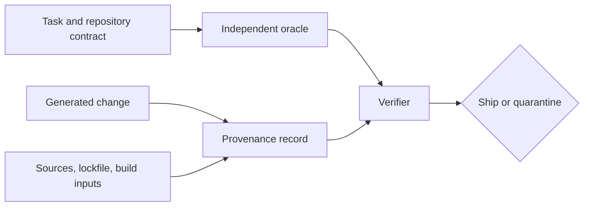

<TLDR>
  <TLDRCell label="what">
    代码来源（code provenance）记录代码与依赖从何而来；验证则用独立于生成器的证据检验重要声明。
  </TLDRCell>
  <TLDRCell label="trap">
    模型给出的引用、生成测试的通过结果、锁文件或有效签名都可能有用，但各自证明的范围往往比审查者以为的更窄。
  </TLDRCell>
  <TLDRCell label="fix">
    把来源追溯到不可变修订版本与许可证，核对完整依赖图，再在受控环境中重现行为和身份检查。
  </TLDRCell>
</TLDR>

## 是什么，为什么存在

<Term id="code-provenance">代码来源（code provenance）</Term>是关于源代码、依赖和构建产物的起源与转换历程的证据。对于有改动的源文件，它可以包括内部任务、上游文件及其<Term id="revision">修订版本（revision）</Term>、复用时适用的许可证，以及本地所做的编辑。对于软件包或二进制文件，它可以包括解析后的版本、内容摘要、构建输入与构建者身份。

验证是根据另一项观察检验相关<Term id="claim">声明（claim）</Term>的过程。如果智能体声称四个用例都通过，就重新运行一组预期结果来自需求而非实现的用例。如果某个发布产物声称来自特定工作流，就验证其证明、主体摘要和预期构建者身份。

这两个概念回答不同问题。来源回答“这些材料从哪里来，怎样到达这里”；验证回答“什么证据支持我们需要的性质”。任一问题都不能单独证明代码正确、安全、可维护或可以合法使用。

生成代码让这种区分变得紧迫，因为流畅的解释几乎不需要成本。智能体可能报告一条从未运行的命令、虚构来源链接、在没有可靠引用的情况下复现记忆中的模式，或添加一个方便但传递依赖许可证与发布政策冲突的软件包。整洁的差异本身不会暴露这些事实。

生成式改动引入复杂算法、改编外部片段、添加或升级软件包、复制配置、修改生成产物或制作发布产物时，都应采用这种审查。小段胶水代码可能只需要任务引用和常规改动审查。密码学、协议实现、解析器与复制来的兼容代码则需要强得多的证据链。

来源记录需要足够细。一份文件可能同时包含仓库原有代码、智能体生成的胶水代码，以及义务各不相同的改编算法。像“使用AI编写”这样的仓库级说明过于宽泛，无法告诉后续维护者哪些部分可以升级、重新许可或移除。

“独立”描述的是证据路径，不一定要求另一个人参与。审查者可以运行确定性命令、对照官方规范、检查注册表元数据，或使用既有的测试预言机。如果证据只是在另一个文件中复述同一个生成式假设，它就不独立。

应如实记录不确定性。如果智能体无法说明某段独特代码的来源，就把来源标为未解决，并按政策隔离或替换该代码。不要把“模型说这是它生成的”转化为没有受保护来源影响输出的证明。

### 必须分开的四种性质

正确性证据表明行为符合验收条件或不变量。完整性证据表明字节与记录的摘要一致。真实性证据在信任政策下把签名声明与身份关联起来。许可证证据标识相关条款和义务，但仍需要作出兼容性判断。

这些性质可能互相矛盾。正确签名的产物可能包含有漏洞的代码；采用MIT许可证的片段可能被错误复制；行为通过检查的实现也可能没有可用的来源记录。应保留独立的决定字段，避免一项绿色检查悄悄批准所有维度。

| 性质 | 有用证据 | 无法证明的内容 |
| --- | --- | --- |
| 行为 | 独立测试与观察到的输出 | 来源、许可证或不存在隐藏路径 |
| 完整性 | 与字节匹配的密码学摘要 | 谁制作了字节，或字节是否安全 |
| 真实性 | 已验证的签名或证明身份 | 签名主体是否正确 |
| 来源 | 不可变来源引用与转换记录 | 许可证兼容性或当前行为 |
| 许可证 | 声明的标识符、通知与已审查条款 | 代码质量、作者身份或政策批准本身 |

## 工作原理

实用流程会把每项交付声明转成证据义务。从改动材料及其适用政策出发，收集智能体叙述之外的记录，并在必要声明缺少支持时停止。目标不是“更多元数据”，而是可重现的决定。



### 清点交付材料

列出任务改动的源码、测试、配置、生成文件、清单、锁文件、内嵌第三方代码、模型、二进制文件与容器基础镜像。还要包括删除内容和间接软件包变化。如果新的包管理脚本会下载未记录的可执行文件，那么只记录可见`.js`文件的来源并不完整。

把自有材料、第三方材料与生成产物分开。文件包含多种来源时，标出准确路径或行范围。对于复用的模式，应保留足够的上下文来重新找到上游材料，不要依赖搜索结果排名。

### 先声明主张，再收集证据

写出发布所需的性质：必要行为、允许来源、批准的许可证、预期依赖集合、构建者身份与产物摘要。每项声明都应可以被证伪。“依赖看起来安全”不是工具或审查者可以重现的声明。

为每项声明指定证据来源和验证器。既有需求可以定义预期行为；官方上游仓库可以确定来源修订版本；解析后的锁文件可以标识软件包字节；签名验证器可以认证证明。还要记录允许由谁或什么系统作出每项声明。

| 声明 | 证据来源 | 验证操作 |
| --- | --- | --- |
| 超时值拒绝单位后缀 | 验收条件 | 执行有区分力的输入 |
| 改编代码块与批准来源相符 | 不可变上游修订版本与本地记录 | 比较内容及记录的编辑 |
| 软件包字节已经固定 | 锁文件解析结果与完整性值 | 使用冻结解析安装并检查摘要 |
| 许可证得到允许 | 软件包内容、SPDX标识符与政策 | 审查完整依赖图和义务 |
| 产物来自发布工作流 | 已签名的来源证明 | 验证主体摘要与可信构建者身份 |

### 准确追溯复用源码

对于复制或改编的代码，应记录上游URL、不可变提交或发布版本、准确文件或章节、获取日期、许可证标识符、必要通知，以及简短的转换说明。可变分支名称或主页不够，因为内容可能变化。政策有要求时，还要保存实际许可证文本或通知。

搜索是发现工具，不是作者身份证明。相似代码可能来自常见惯用法、公开规范、共同祖先或独立实现。相似结果只能作为进一步调查的线索，不能仅凭相似就自动断言发生了复制或适用某个许可证。

如果来源仍然未知，在可行时根据已发布行为重新干净实现这部分材料。如果组织的净室政策要求隔离，就不要让实现人员接触未批准的源文本。替换是否充分，应由法律与组织政策决定。

### 从请求一直核对到依赖字节

同时审查清单意图和解析状态。清单说明请求了哪个直接依赖；锁文件记录特定解析器得到的准确版本、来源、完整性值与传递软件包。还要检查安装脚本、可选和平台专用分支、Git或本地路径来源，以及包管理器配置。

<Term id="software-bill-of-materials">软件物料清单（software bill of materials，SBOM）</Term>可以为下游扫描与披露提供规范化组件清单。它是快照，不是裁决。应把它与锁文件及构建产物比较，因为遗漏的开发工具、内嵌代码或安装后下载都可能形成盲区。

许可证审查覆盖完整发布作品，而不只是直接依赖。根据权威列表规范化标识符，保留通知，标出缺失或自定义条款，并依据项目政策或法律顾问意见处理兼容性决定。字符串允许列表可以自动分类，但无法解释所有链接、修改、署名、专利与分发条件。

### 在生成叙述之外运行验证

从已知工作目录执行真实命令，并记录运行时、输入、退出状态与未使用缓存的输出。优先使用干净检出或冻结依赖解析的隔离构建。粘贴的终端记录不如一条可针对交付修订版本重新运行的命令可靠。

根据需求、既有仓库行为、标准或独立准备的夹具选择<Term id="test-oracle">测试预言机（test oracle）</Term>。生成测试仍可能有价值，但要检查它是否复制了候选实现的常量、分支或输出。复述实现的测试只能确认内部意见一致。

使用针对声明的反例。边界输入、畸形数据、故障注入和已知实现的对比，比另一个成功路径更能暴露问题。对于来源记录，可以修改一个字节并确认摘要检查失败；对于证明，可以修改主体摘要或身份并确认验证拒绝。

### 明确作出发布决定

把证据与稳定的改动或产物标识符一起保存。记录命令、工具版本、来源修订版本、许可证决定、证明验证、例外、审查者与日期。自动化需要消费这些记录时应采用机器可读格式，无法简化为布尔值的决定则保留人工说明。

证据缺口需要有负责人和处置方式：阻止、替换、调查，或依据记录完备的例外接受。例外和漏洞状态等时效性证据还需要过期时间。最终决定应说明哪些声明通过、还存在哪些风险，而不能只写“已验证”。

## 示例

以下示例使用Node 24和内联数据。它们展示本地机制，并不构成完整的法律或供应链系统。下面每段输出都来自使用本地Node v24.14.0运行对应文件。

### 检查生成式验证声明

假设契约接受表示整数秒的十进制字符串，并拒绝多余字符。候选实现使用`parseInt`，它会接受数字前缀，因此普通正数与零都会掩盖缺陷。下面的预期观察来自契约，而不是候选实现。

<Depth level="quick">

```js run title="verify_claim.js"
function candidateTimeout(value) {
  const seconds = Number.parseInt(value, 10);
  if (!Number.isFinite(seconds) || seconds < 0) {
    throw new TypeError("timeout must be a non-negative integer string");
  }
  return seconds * 1_000;
}

function observe(input) {
  try {
    return `value:${candidateTimeout(input)}`;
  } catch (error) {
    return `error:${error.constructor.name}`;
  }
}

const contractCases = [
  { name: "whole seconds", input: "5", expected: "value:5000" },
  { name: "zero", input: "0", expected: "value:0" },
  { name: "unit suffix", input: "5s", expected: "error:TypeError" },
  { name: "empty", input: "", expected: "error:TypeError" },
];

let passed = 0;
for (const testCase of contractCases) {
  const actual = observe(testCase.input);
  const ok = actual === testCase.expected;
  passed += Number(ok);
  console.log(`${testCase.name}: ${ok ? "PASS" : "FAIL"} (expected ${testCase.expected}, got ${actual})`);
}
console.log(`independent result: ${passed}/${contractCases.length} passed`);
```

```text
whole seconds: PASS (expected value:5000, got value:5000)
zero: PASS (expected value:0, got value:0)
unit suffix: FAIL (expected error:TypeError, got value:5000)
empty: PASS (expected error:TypeError, got error:TypeError)
independent result: 3/4 passed
```

<TryToBreak items={['首尾空白', '小数字符串', '负数值', '超过安全范围的整数']} />

</Depth>

这条命令反驳了四个契约用例全部通过的声明。它还保留了有区分力的输入与实际观察，因此其他审查者可以重现失败。修复解析器后，仍需就空白与安全数值范围作出产品决定。

这套检查只覆盖它明确列出的性质。它没有说明`candidateTimeout`从何而来、软件包是否获得许可，也没有说明是否有其他调用方绕过它。行为验证只是决定中的一列，不能替代来源记录。

### 发现过期的来源记录

来源记录把批准的代码块与路径、修订版本、许可证和摘要绑定。这里的`src/slug.js`仍与记录一致，但重试策略的乘数从`250`改成了`100`，却没有更新转换说明与摘要。

```js run title="verify_source_record.js"
import { createHash } from "node:crypto";

function sha256(text) {
  return createHash("sha256").update(text).digest("hex");
}

const workspace = new Map([
  ["src/retry.js", "export function backoff(attempt) {\n  return attempt * 100;\n}\n"],
  ["src/slug.js", "export const slug = (value) => value.trim().toLowerCase();\n"],
]);

const records = [
  {
    path: "src/retry.js",
    source: "internal/retry-policy@a13f9c2",
    license: "Proprietary",
    sha256: "68311b2c403ecb5f2e4db3db6965c5cb43f64c81b7c0c81c8cbb2824e07633a5",
  },
  {
    path: "src/slug.js",
    source: "internal/style-guide@3",
    license: "Proprietary",
    sha256: "f129b6e5326f55be39292bb2bba65bb706b8c53ad44a937e2f6c8bd8b369ecaf",
  },
];

for (const record of records) {
  const actual = sha256(workspace.get(record.path));
  const status = actual === record.sha256 ? "PASS" : "FAIL (digest mismatch)";
  console.log(`${record.path}: ${status} — ${record.source}, ${record.license}`);
}
```

```text
src/retry.js: FAIL (digest mismatch) — internal/retry-policy@a13f9c2, Proprietary
src/slug.js: PASS — internal/style-guide@3, Proprietary
```

失败结果没有说明新乘数是否正确或得到允许。它说明当前字节已不再符合审查过的声明。下一步应恢复预期政策，审查编辑并创建新记录，而不是悄悄覆盖历史。

摘要也无法认证来源字符串。记录必须通过受保护的审查或签名证明路径产生，验证器也必须知道自己信任哪些身份。否则，攻击者可以同时替换文件及其旁边的校验和。

### 审计解析后的依赖证据

这个小型政策检查把批准的直接依赖意图与解析后的软件包记录进行核对。软件包只是示例，政策特意只允许三种许可证标识符。一个传递软件包需要许可证审查，另一个意外出现的直接软件包还缺少完整性值。

```js run title="audit_lockfile.js"
const approvedDirect = new Set(["@vendor/csv-normalizer"]);
const allowedLicenses = new Set(["MIT", "Apache-2.0", "BSD-3-Clause"]);

const lockedPackages = [
  {
    name: "@vendor/csv-normalizer", version: "2.3.1", direct: true,
    resolved: "https://registry.example/@vendor/csv-normalizer/-/csv-normalizer-2.3.1.tgz",
    integrity: "sha512-demo1", license: "MIT",
  },
  {
    name: "text-table-fast", version: "1.4.0", direct: false,
    resolved: "https://registry.example/text-table-fast/-/text-table-fast-1.4.0.tgz",
    integrity: "sha512-demo2", license: "GPL-3.0-only",
  },
  {
    name: "telemetry-lite", version: "0.9.0", direct: true,
    resolved: "https://registry.example/telemetry-lite/-/telemetry-lite-0.9.0.tgz",
    integrity: "", license: "Apache-2.0",
  },
];

for (const pkg of lockedPackages) {
  const failures = [];
  if (pkg.direct && !approvedDirect.has(pkg.name)) failures.push("unexpected direct dependency");
  if (!pkg.integrity.startsWith("sha512-")) failures.push("missing integrity");
  if (!allowedLicenses.has(pkg.license)) failures.push(`license ${pkg.license} not approved`);
  console.log(`${pkg.name}@${pkg.version}: ${failures.length ? `FAIL (${failures.join("; ")})` : "PASS"}`);
}
```

```text
@vendor/csv-normalizer@2.3.1: PASS
text-table-fast@1.4.0: FAIL (license GPL-3.0-only not approved)
telemetry-lite@0.9.0: FAIL (unexpected direct dependency; missing integrity)
```

传递依赖的失败同样重要，即使开发者没有按名称请求这个软件包。直接依赖的失败也很重要，即使它声明的许可证在允许列表中。审查要追问每个组件为何存在，以及解析后的证据是否满足所有适用政策。

示例信任了内联许可证字符串，而且只检查完整性值的形式。生产验证器会从软件包内容和可信索引获取元数据，重新计算摘要或委托相应验证，并处理包管理器特有的解析方式。它还会记录人工作出的许可证兼容性决定，而不是假装允许列表就是法律分析。

## 陷阱

### 把生成器的记录当作执行证据

> [!PITFALL]
> 智能体可以声称“所有测试都通过”、粘贴看似可信的输出，或添加一项与实现共享错误假设的测试。记录可能来自另一修订版本、工作目录、运行时，甚至根本没有对应进程。

**修复方法：** 在已知环境中针对交付修订版本重新运行确切命令。记录退出状态与未缓存输出，根据独立契约或预言机得到预期结果，并加入至少一个能区分候选实现与其潜在错误的反例。

### 把一项来源事实当作全面批准

> [!PITFALL]
> 摘要匹配只能证明字节等于记录值，不能证明作者身份、安全性或许可证兼容性。有效签名只是在政策下认证签名者，不能证明签名的所有内容都正确。

**修复方法：** 把行为、完整性、身份、来源与许可建模为各自具有独立证据的声明。定义允许哪个可信身份签发每种声明，验证声明覆盖确切主体摘要，并要求发布所需的每个字段都通过。

### 只记录直接依赖

> [!PITFALL]
> 生成的清单可能只增加一个得到批准的库，但锁文件会解析出数十个传递、可选、平台专用或安装时组件。它们的许可证和可执行脚本仍会影响交付系统。

**修复方法：** 比较清单与锁文件差异，为支持的目标构建依赖闭包，并与SBOM或产物扫描结果核对。审查新来源、完整性字段、安装脚本、内嵌代码和缺失的许可证元数据；验证时冻结解析结果。

### 保存可变或模糊的来源引用

> [!PITFALL]
> “改编自互联网”、搜索结果URL或默认分支都无法重建审查者当时看到的代码。页面可能改变或消失，同一页面中的多个文件也可能采用不同许可证。

**修复方法：** 保存不可变提交或发布版本、确切文件或章节、获取日期、许可证标识符及通知，以及本地转换。上游不存在不可变版本时，应按政策保留审查过的快照，不要假装可变URL很稳定。

### 根据许可证字符串自动作出法律结论

> [!PITFALL]
> SPDX标识符让许可证可由机器读取，但它无法决定许可证与所有链接方式、修改形式、分发方式、专利条款、通知义务或客户义务是否兼容。遇到缺失或自定义条款时，简单允许列表更不可靠。

**修复方法：** 用自动化完成清点与分类，再把组织审查过的政策应用于实际发布作品。保留通知和例外，升级处理含糊条款，并在依赖版本或分发形式改变时重新审查。

<Depth level="deep">

## 来源链中的信任边界

来源信息是一条声明链，每个环节都有签发者、主体与信任决定。机器可读格式让这些环节更容易传输和验证，但不会替你决定信任谁。证据链的设计应确保受损工作区无法同时重写主体与权威证据而不被发现。

### 声明与证明

<Term id="attestation">证明（attestation）</Term>是采用已定义谓词或模式、关于某个主体的签名声明。构建来源通常用摘要指出一个或多个主体产物，并描述构建者、调用与输入材料。验证器先检查封装与签名，再依据政策解释谓词。

签名有效只是第一项检查。该身份必须获得对应仓库与工作流的授权，谓词类型必须符合预期，主体摘要也必须等于实际发布字节。新鲜度、透明日志收录情况、证书签发者与源码分支约束也可能属于信任政策。

智能体在补丁旁写出的JSON文件是一项来源声明，但不是经过独立认证的证明。它仍可帮助审查者定位来源。不要赋予它与受保护构建服务观察构建后发出的证据相同的权威。

### 摘要绑定字节，不绑定含义

密码学摘要为确切字节提供紧凑标识符。改变一个字节就应得到不同摘要，因此它适合锁文件完整性、产物主体与不可变快照。验证时必须指定算法，并与通过受保护路径取得的值比较。

摘要不会解释语义或所有权。两个包含不同时间戳的构建可能行为相同但摘要不同，恶意字节也完全可以拥有有效摘要。应通过签名声明、仓库审查、可重现构建或政策决定赋予其含义，不要从散列值本身解读含义。

对结构化数据计算摘要时，规范化方式很重要。空白、键顺序、行尾、归档元数据与序列化选择都可能改变字节，而人类理解的含义不变。优先采用格式规定的签名表示，或直接计算最终产物字节，不要发明没有文档的规范化规则。

### 构建者身份与输入材料

隔离服务观察输入并发出证据，同时不允许构建过程重写证据时，构建来源最有力。谓词可以列出源码修订版本、依赖、参数和执行步骤的构建者。随后由信任政策限制哪些身份与工作流可以产生发布主体。

输入材料是关于输入的证据，不能证明构建没有使用其他输入。网络访问、未声明工具、可变基础镜像与安装后下载都可能逃离声明清单。密封构建、固定工具链、限制网络访问和独立观察的依赖图可以缩小这一缺口。

可重现构建提供另一种信号：独立构建者使用同一组声明输入，会产生字节完全相同的输出。匹配会让隐藏或被篡改的步骤更难长期存在，但不能证明源码正确或许可证合规。它还要求控制时间戳、路径、区域设置、归档顺序和其他非确定性因素。

### 源码相似性与未知起源

生成代码让作者归属变得复杂，因为模型通常无法为每个词元提供可靠的训练样本来源。一句自信的“这是我从头写的”不是来源审计。反过来，相似性检测器提供的是候选材料，不是确定的因果历史。

独特注释、异常常量、相同缺陷与长段匹配序列值得更深入审查。常见循环、公开API签名与惯用错误处理本身提供的信号很少。应保留检测器、语料库、阈值、候选来源和人工结论，使结果日后可以受到质疑。

政策要求起源可追溯，但起源无法确定时，最安全的技术选择通常是根据干净的行为规范替换实现。这个选择不能回答所有法律问题，法律建议应交给合格审查者。相比保留来源不明的独特代码，它能形成更清楚的工程记录。

### SBOM的范围与发布内容

SBOM使用标准格式列举组件及其关系。团队可以查询一份规范化文档，因此它有助于漏洞响应、许可证清点和客户披露。它的价值取决于范围、完整性、标识符，以及与确切发布产物之间的关联。

应在接近最终产物的阶段生成或验证SBOM，再把它与解析器数据和内嵌内容扫描结果比较。只从源码生成会漏掉内嵌JavaScript、静态链接库、容器层、复制的二进制文件或安装期间下载的内容。应记录排除类别，而不是暗示覆盖完整。

不同生态系统中的版本和软件包名称有时存在歧义。工具支持时，应优先使用软件包URL、校验和、供应商字段与明确关系。还要保存SBOM自身的摘要或证明，让使用方知道哪份文档属于哪个产物。

### 证据保留与变更

证据必须比终端滚动记录保存得更久。按发布所需的保留和访问控制要求，存储来源记录、许可证决定、命令结果、证明与例外批准。把它们关联到不可变修订版本与产物摘要，而不是可变的工单标题。

新证据可能推翻旧决定。依赖可能发布修正后的许可证元数据，签名身份可能被攻破，也可能后来发现验证命令并不完整。应保存原始观察，追加新发现并签发新决定，而不是重写历史记录。

证据量应随风险变化。内部一次性工具不需要发布级证明流水线，而对外分发的安全软件不能依赖智能体的文字说明。应按交付类别定义最低证据链，让审查者知道何时可以停止，也让例外保持可见。

</Depth>

<Checkpoint id="ai-era/code-provenance-and-verification" />

## 延伸阅读

- [SLSA：来源证明](https://slsa.dev/spec/v1.2/provenance)
- [SPDX许可证列表](https://spdx.org/licenses/)
- [npm CLI文档：`package-lock.json`](https://docs.npmjs.com/cli/v11/configuring-npm/package-lock-json)
- [GitHub文档：产物证明](https://docs.github.com/en/actions/concepts/security/artifact-attestations)
- [Sigstore文档：验证签名](https://docs.sigstore.dev/cosign/verifying/verify/)
