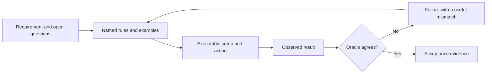

<TLDR>
  <TLDRCell label="what">
    An executable specification states observable behavior as named examples and checks that can run against an implementation.
  </TLDRCell>
  <TLDRCell label="trap">
    A passing check proves only the cases and properties it encodes; vague boundaries and a circular test oracle can still approve the wrong behavior.
  </TLDRCell>
  <TLDRCell label="fix">
    Name the rule, inputs, expected result, boundary, and failure behavior before implementation, then keep the check independent of implementation details.
  </TLDRCell>
</TLDR>

## What it is and why it exists

An <Term id="executable-specification">executable specification</Term> is an agreement about behavior expressed in a form a machine can run. It pairs readable examples or properties with checks that compare an implementation's observable result with an expected result. A run produces evidence such as a pass, a failure, or a precise mismatch.

The prose still matters. It explains the business meaning, scope, and decisions behind each check, while the executable part removes ambiguity about selected cases. Neither half replaces the other: prose alone can be interpreted several ways, and code alone can hide why an expected value is correct.

This matters when a coding agent receives a short request such as “add free shipping over €50.” The phrase leaves open whether €50 itself qualifies, whether expedited delivery is free, which destinations count, and how invalid subtotals behave. An agent can fill those gaps with plausible assumptions that contradict the product decision.

Named examples force those choices into the open. “A standard French order at 4,999 cents costs 500 cents; at 5,000 cents it costs 0” fixes both units and the inclusive boundary. A separate expedited example establishes whether that rule overrides the threshold.

Executable specifications are often implemented as tests, but the names are not synonyms. A low-level unit test may protect an internal helper without communicating a requirement. A specification-oriented check earns the name when a reader can connect it to intended observable behavior and when it can reject an implementation that violates that behavior.

The observable surface may be a function result, an HTTP response, a database state transition, a published event, a rendered accessible name, or a command's exit status and output. Choose the surface that a caller or user depends on. Private call order and temporary variables rarely belong in the agreement.

An <Term id="api-contract">API contract</Term> is one common specification boundary. Its executable checks can cover request shapes, status codes, response fields, error semantics, and compatibility promises. The same method also works below an API, at a command line, or across a complete user workflow.

You meet executable specifications in acceptance tests, table-driven tests, contract tests, schema validation, conformance suites, and small scripts run by continuous integration. A particular framework is optional. The essential feature is a repeatable mapping from a stated rule to independently observed evidence.

For new work, write the smallest decisive examples before asking an agent to implement. For legacy work, a <Term id="characterization-test">characterization test</Term> can first record current behavior, but label it as “current” rather than “desired.” That distinction prevents an accidental quirk from silently becoming a permanent requirement.

## How it works

An executable specification turns a requirement into a finite set of decisions and observations. The author decides what is in scope, divides the inputs into meaningful cases, fixes boundary and precedence rules, and chooses a <Term id="test-oracle">test oracle</Term>. The runner supplies inputs, observes the public result, and lets the oracle decide whether that result satisfies the agreement.



The arrow back to the examples matters. A failure may expose defective code, but it may also expose an incorrect expected value or an unresolved product question. Do not edit the expectation merely to make the run green; first decide which side of the agreement is wrong.

### Shape of one specification example

A useful example contains enough information to reproduce one behavior without reconstructing intent from the implementation. Given/When/Then wording is convenient, but ordinary data objects and assertions can carry the same structure. What matters is that each field has one job.

| Part | Question it answers | Shipping example |
| --- | --- | --- |
| Rule name | Why does this case exist? | Standard order at the free-shipping boundary |
| Given | What relevant state and input exist? | `subtotalCents: 5000`, `country: "FR"` |
| When | Which public action occurs? | Calculate the shipping fee |
| Then | What observable result is required? | Return `0` cents |
| Boundary note | Which nearby value must differ? | `4999` returns `500` cents |

Names make failures diagnostic. `case 2 failed` sends a reviewer back into the data, while `standard order at the free-shipping boundary` identifies the rule immediately. Include units and domain language in names when a bare number could be misread.

Keep setup limited to facts that change the outcome. If the case supplies an irrelevant customer biography, database fixture, and clock, a generated implementation may infer rules from noise. Minimal setup makes the actual conditions visible and keeps failures local.

### Partitions and boundaries

You cannot enumerate every input, so divide the space by behavior. For a free-shipping threshold, the useful partitions might be below the threshold, at or above it, expedited, and outside the supported country. Select one representative from each partition and place examples directly on either side of numeric boundaries.

Boundary language must be exact. “Over €50” normally suggests `> 5000`, while “€50 or more” says `>= 5000`; casual conversation often uses them interchangeably. Record integer cents, the comparison operator, and any rounding step rather than asking code to infer them.

Invalid and absent inputs form partitions too. State whether a negative subtotal throws, returns a domain rejection, or is impossible because an earlier schema check owns that rule. If ownership lives elsewhere, name that boundary instead of silently omitting the case.

Use counterexamples to separate nearby rules. A positive example proves that one input is accepted; a close negative example proves why a neighboring input is rejected. Together they make an agent less likely to implement a broader shortcut that happens to satisfy the happy path.

### Precedence and decision tables

Requirements often contain individually clear rules that overlap. A damaged final-sale item returned after 45 days may match a damage exception, a final-sale exclusion, and a time limit. Without precedence, several implementations can each look reasonable.

A <Term id="decision-table">decision table</Term> makes overlapping conditions explicit. Each row describes a meaningful combination and one required outcome; the row names explain which rule wins. You do not need the full Cartesian product when some conditions are irrelevant after a higher-priority rule matches.

| Priority | Faulty | Final sale | Days | Expected decision |
| --- | --- | --- | --- | --- |
| 1 | Yes | Any | Any non-negative value | Full refund |
| 2 | No | Yes | Any non-negative value | Not eligible |
| 3 | No | No | `0..30` | Full refund |
| 4 | No | No | `31+` | Not eligible |

The “Any” cells are deliberate, not missing test data. They state that a lower-priority condition must not affect the result once an earlier rule decides it. Add a concrete executable row that changes the ignored condition when regression risk is high.

### Choosing the oracle

The oracle supplies the expected result or property. It may compare an exact value, match a structured error, validate a schema, inspect a state transition, or assert an invariant across many inputs. It must be simpler to trust than the implementation under test.

Do not calculate an expected shipping fee by copying the production formula into the test. The same mistaken operator can then appear on both sides and pass. Literal expected values from an approved example, or a structurally different reference rule, give the check independent power.

Exact values are strongest when the product has chosen one result. Properties are useful when many results are valid: a paginator can be checked for enough capacity and no redundant full page without prescribing its internal loop. Use both when named examples explain the rule and properties broaden the search.

Error behavior needs an oracle as much as success behavior. Check the error type or stable code and the absence of forbidden side effects. Avoid pinning incidental stack traces or complete human-readable messages unless those strings are themselves a supported interface.

### Binding the check to execution

A specification becomes executable only when its command, environment, and dependencies are known. Record the runtime, working directory, fixture ownership, and required environment values. A filename with assertions is not evidence until a runner actually executes it and preserves the result.

The delivery gate should derive status from process facts: the exact command, exit code, failing case names, and any skipped or truncated output. An agent's summary that says “all acceptance tests pass” is not equivalent to an exit code captured by the host.

Keep checks deterministic where the behavior permits it. Inject a clock, seed pseudo-random generation, isolate mutable storage, and replace uncontrolled network calls with a contract boundary. If timing or concurrency is the behavior under test, specify tolerances and collect repeated evidence instead of hiding flakiness with retries.

Trace each acceptance criterion to one or more checks. The mapping need not use a special tool; stable rule IDs in case names can be enough. The goal is to see both directions: which evidence supports a requirement, and which requirement justifies a check.

| Requirement | Executable form | Evidence on failure |
| --- | --- | --- |
| Inclusive threshold | Cases at `4999` and `5000` | Expected and actual fee plus case name |
| Fault exception wins | One overlapping decision-table row | Expected and actual decision plus input |
| Page count is minimal | Deterministic property sweep | First counterexample and parameters |
| Invalid subtotal is rejected | Error assertion | Missing or wrong error type |

Run a new behavioral check against the old or deliberately broken implementation when practical. Seeing it fail establishes that the check can detect the intended defect. Then run it against the candidate implementation and retain both the red and green evidence for high-risk changes.

## Examples

The examples use Node's strict assertions as a small, dependency-free harness. Each file contains the behavior under discussion so it can run alone, but in a repository the implementation would normally be imported through its public interface. The printed lines come from Node `v24.14.0`.

### Named examples pin the boundary

The shipping examples state money in integer cents and give every row a reason. The pair at `4999` and `5000` fixes an inclusive free-shipping boundary, while the other rows establish rule precedence for expedited and international delivery.

<Depth level="quick">

```js run title="shipping_examples.mjs"
import assert from "node:assert/strict";

function shippingFeeCents({ subtotalCents, country, expedited = false }) {
  if (!Number.isInteger(subtotalCents) || subtotalCents < 0) {
    throw new RangeError("subtotalCents must be a non-negative integer");
  }
  if (country !== "FR") return 1200;
  if (expedited) return 900;
  return subtotalCents >= 5000 ? 0 : 500;
}

const examples = [
  {
    name: "standard just below free shipping",
    input: { subtotalCents: 4999, country: "FR" },
    expected: 500,
  },
  {
    name: "standard at free-shipping boundary",
    input: { subtotalCents: 5000, country: "FR" },
    expected: 0,
  },
  {
    name: "expedited ignores subtotal threshold",
    input: { subtotalCents: 8000, country: "FR", expedited: true },
    expected: 900,
  },
  {
    name: "international uses a flat fee",
    input: { subtotalCents: 8000, country: "BE" },
    expected: 1200,
  },
];

for (const example of examples) {
  assert.equal(shippingFeeCents(example.input), example.expected);
  console.log(`PASS: ${example.name} -> ${example.expected}`);
}
```

```text
PASS: standard just below free shipping -> 500
PASS: standard at free-shipping boundary -> 0
PASS: expedited ignores subtotal threshold -> 900
PASS: international uses a flat fee -> 1200
```

<TryToBreak items={['a negative or fractional subtotal', '4,999 and 5,000 cents', 'an absent or unknown country code']} />

</Depth>

Changing `>=` to `>` makes exactly the boundary row fail. That is a useful failure: the case name, input, and literal expected value point to a product rule rather than an internal function. A refactor can replace every branch and still satisfy the same examples.

The example does not yet specify an absent country or whether international expedited shipping has a separate price. Those are visible gaps, not permission to guess. Add approved rows before delegating behavior in those partitions.

### A decision table fixes precedence

The refund function has three overlapping rules. Ordered branches implement the priority table, and the first case deliberately activates all three conditions to prove that a fault overrides the other exclusions.

```js run title="refund_decision_table.mjs"
import assert from "node:assert/strict";

function refundDecision({ daysSinceDelivery, finalSale, faulty }) {
  if (!Number.isInteger(daysSinceDelivery) || daysSinceDelivery < 0) {
    throw new RangeError("daysSinceDelivery must be a non-negative integer");
  }
  if (faulty) return "full refund";
  if (finalSale) return "not eligible";
  return daysSinceDelivery <= 30 ? "full refund" : "not eligible";
}

const rules = [
  {
    name: "fault overrides final-sale and time limits",
    input: { daysSinceDelivery: 45, finalSale: true, faulty: true },
    expected: "full refund",
  },
  {
    name: "final sale blocks an ordinary return",
    input: { daysSinceDelivery: 10, finalSale: true, faulty: false },
    expected: "not eligible",
  },
  {
    name: "day 30 is inside the return window",
    input: { daysSinceDelivery: 30, finalSale: false, faulty: false },
    expected: "full refund",
  },
  {
    name: "day 31 is outside the return window",
    input: { daysSinceDelivery: 31, finalSale: false, faulty: false },
    expected: "not eligible",
  },
];

for (const rule of rules) {
  const actual = refundDecision(rule.input);
  assert.equal(actual, rule.expected, rule.name);
  console.log(`PASS: ${rule.name} -> ${actual}`);
}
```

```text
PASS: fault overrides final-sale and time limits -> full refund
PASS: final sale blocks an ordinary return -> not eligible
PASS: day 30 is inside the return window -> full refund
PASS: day 31 is outside the return window -> not eligible
```

The two time-window rows distinguish `<= 30` from `< 30`, and the overlapping row distinguishes the branch order. If “faulty” later splits into confirmed and unconfirmed reports, extend the decision table first. Otherwise an agent may preserve the old Boolean shortcut while appearing to support the new states.

These literal outcomes are an appropriate oracle because the policy owner chooses them. Deriving `expected` by calling a second implementation of the same nested `if` statements would add code without adding independent evidence.

### Properties broaden named examples

The pagination specification begins with four recognizable boundary examples. It then checks two properties across 105 deterministic input pairs: the reported pages have enough capacity, and removing one page would leave too little capacity.

```js run title="pagination_properties.mjs"
import assert from "node:assert/strict";

function pageCount(totalItems, pageSize) {
  if (!Number.isInteger(totalItems) || totalItems < 0) {
    throw new RangeError("totalItems must be a non-negative integer");
  }
  if (!Number.isInteger(pageSize) || pageSize <= 0) {
    throw new RangeError("pageSize must be a positive integer");
  }
  return Math.ceil(totalItems / pageSize);
}

const examples = [
  { totalItems: 0, pageSize: 10, expected: 0 },
  { totalItems: 1, pageSize: 10, expected: 1 },
  { totalItems: 10, pageSize: 10, expected: 1 },
  { totalItems: 11, pageSize: 10, expected: 2 },
];

for (const example of examples) {
  assert.equal(pageCount(example.totalItems, example.pageSize), example.expected);
}

let checkedPairs = 0;
for (let totalItems = 0; totalItems <= 20; totalItems += 1) {
  for (let pageSize = 1; pageSize <= 5; pageSize += 1) {
    const pages = pageCount(totalItems, pageSize);
    assert.ok(pages * pageSize >= totalItems);
    if (pages > 0) assert.ok((pages - 1) * pageSize < totalItems);
    checkedPairs += 1;
  }
}

console.log(`named examples: ${examples.length} passed`);
console.log(`boundary sweep: ${checkedPairs} pairs passed`);
```

```text
named examples: 4 passed
boundary sweep: 105 pairs passed
```

The capacity property alone is too weak: returning one million pages would satisfy it. The minimality property rules out that false solution. The named zero-item example still carries meaning that the algebra might not communicate clearly to a product reviewer.

The loops are intentionally bounded and deterministic. A larger random search could supplement them, but its seed and first failing input would need to appear in the evidence so another runner can reproduce the result.

## Pitfalls

### Specifying only the happy path

> [!PITFALL]
> One example such as “a €60 order ships free” permits `subtotalCents > 0`, `>= 5000`, or a hard-coded answer to pass. It says nothing about the threshold, override rules, invalid values, or unsupported destinations.

**Fix:** identify behavior partitions and add adjacent examples at each boundary. Include at least one rejection or failure path, and add an overlapping case wherever two rules can both apply.

### Building a circular oracle

> [!PITFALL]
> A generated test computes `expected = subtotalCents >= 5000 ? 0 : 500` and compares it with production code containing the same expression. A mistaken requirement or copied operator appears on both sides, so the check stays green.

**Fix:** use approved literal outcomes for named cases, or an independently structured reference for large domains. Review where every expected value came from, and deliberately break the production boundary to confirm the check fails.

### Overspecifying the implementation

> [!PITFALL]
> Assertions about private helper calls, branch order, temporary objects, or exact query text can reject a behavior-preserving refactor. An agent then optimizes for matching the test's internal script instead of the public requirement.

**Fix:** observe the narrowest stable public surface: returned value, documented error, state transition, event, or response. Assert internal interactions only when the interaction is itself a requirement, such as “charge the payment provider at most once.”

### Leaving error semantics implicit

> [!PITFALL]
> “Invalid input fails” does not say whether failure means an exception, a validation result, an HTTP status, or no state change. Generated code may catch everything and return a plausible default that makes positive checks pass.

**Fix:** specify the error category, stable code or type, and forbidden side effects. Add cases for absent, malformed, out-of-range, and unauthorized input when those categories have different ownership or outcomes.

### Treating green checks as a complete specification

> [!PITFALL]
> A suite can pass while omitting accessibility, compatibility, concurrency, migration, or operational constraints. Old checks can also faithfully enforce behavior the product no longer wants.

**Fix:** keep a requirement-to-check map and review uncovered judgments separately. When a rule changes, update its prose and examples in one change, show why the old implementation fails the new check, and remove obsolete expectations intentionally.

## In the AI era

**What generated code gets wrong here**

Generated code often implements the first plausible reading of an inclusive boundary, currency unit, default, or precedence rule, then generates tests that mirror its own choices. It may replace literal expected values with the production formula, test only agent-invented happy paths, weaken a failing assertion, or mock the function under test. Another common failure is reporting “all tests passed” after running the wrong file, swallowing a non-zero exit code, or omitting the acceptance case that originally failed.

**Ask your AI to check**

- Build a table of every rule, input partition, boundary pair, overlapping condition, and still-unresolved product decision; do not invent outcomes for unresolved rows.
- Map every expected value to its source and flag any oracle that copies a production formula, private helper, fixture generated by the implementation, or snapshot approved without review.
- Run each named command from the declared working directory, report its exit code and failing case names, and show that the new check fails against the old or a deliberately broken implementation.

**Review checklist**

- Verify exact units, equality boundaries, defaults, invalid-input behavior, and precedence with adjacent positive and negative examples.
- Confirm checks observe public behavior, can fail for the intended defect, and do not calculate expectations through the code under test.
- Match every completion claim to raw command evidence, then list product, security, accessibility, and operational judgments that remain human-reviewed.

**Prompt vocabulary**

Use the exact terms `executable specification`, `acceptance criterion`, `named example`, `counterexample`, `equivalence partition`, `boundary value`, `decision table`, `rule precedence`, `test oracle`, `property`, and `red-green evidence`. Ask for a “requirement-to-check traceability table” and “the smallest counterexample”; “add thorough tests” is too vague to constrain generated behavior.

<Depth level="deep">

## The oracle boundary

The hardest part of an executable specification is not assertion syntax. It is deciding which facts are authoritative and where interpretation stops. The oracle boundary separates approved product meaning from the candidate implementation whose behavior is being judged.

### Exact, structural, and property oracles

An exact oracle names one required value: a 5,000-cent standard French order has a zero-cent fee. It is easy to review and produces a clear mismatch, but it covers only the selected case. Exact examples are best for policy choices, protocol codes, and crisp boundary outcomes.

A structural oracle checks a schema or selected fields while allowing irrelevant variation. An HTTP contract might require status `201`, a stable resource ID, and a particular state while ignoring header order. Structural checks reduce accidental coupling, but the allowed variation must be deliberate rather than an overly permissive matcher.

A property oracle states a relationship that must hold for many inputs. The pagination example checks sufficient capacity and minimality without reimplementing `Math.ceil`. A useful property excludes realistic wrong implementations; “the result is non-negative” is necessary but far too weak on its own.

Snapshot or golden-file comparison is an exact oracle over a large value. It is useful when the whole artifact is a supported output, but a reviewer must understand each change. Automatically replacing snapshots after a generated change converts the candidate output into its own oracle and erases the test's power.

Use multiple oracle styles when their failure modes differ. Named examples communicate selected business decisions, properties search a wider input space, and schemas enforce shape. More assertions are not automatically more independent evidence if they all derive from the same source.

### Independence is a data-flow question

Ask how information reaches both the implementation and the expected result. If the same generated function, lookup table, production database query, or model response feeds both paths, agreement may be circular. Separate files and different function names do not create independence by themselves.

Approved examples can come from a policy owner, a protocol standard, a compatibility fixture captured from a trusted version, or a small reference model written from different primitives. Record that provenance close to the cases. When the authority is disputed, the result is an open decision, not a guessed assertion.

Legacy characterization needs especially careful labels. Capturing current output can protect a refactor while you learn the system, but current output may contain a defect. Keep “preserve for this refactor” separate from “product-approved behavior,” and replace characterization cases as decisions become explicit.

Mutation is a practical sanity check for oracle strength. Change `>=` to `>`, reverse two priority branches, return a constant, or remove input validation and confirm that a relevant check fails. Surviving changes reveal a missing case or a weak property; they do not prove the surviving implementation is acceptable.

### Completeness is bounded and visible

No finite suite proves arbitrary software correct. A useful specification instead states its boundary: the behaviors decided here, the inputs represented, the properties sampled, and the judgments left outside automation. This makes a green run meaningful without pretending it covers everything.

Create a small coverage matrix before multiplying cases. Rows represent rules or outcomes; columns represent important partitions such as boundary, absence, authorization, and override. One example can cover several cells, but every filled cell should be defensible from its setup and expected result.

Avoid a full Cartesian product when conditions are independent or made irrelevant by precedence. Use “Any” deliberately in the decision table, then choose a few overlapping cases that prove the irrelevance. This keeps the suite fast enough to run on every agent iteration while preserving the combinations most likely to expose a wrong shortcut.

Some requirements resist deterministic checks. Tone, visual hierarchy, product desirability, and acceptable migration risk may need structured human review. Write a checklist, sample, or approval gate for those judgments and keep them out of automated pass counts.

### Change control for living specifications

Specifications evolve with the product. A changed expected value is a requirement change, not routine test maintenance, so review it beside the implementation and explain the decision. Stable rule IDs and case names make this history searchable.

A strong change sequence is evidence-driven: run the old behavior, add or revise the approved example, observe the expected failure, implement the change, and rerun the relevant plus broader checks. The red result proves sensitivity; the green result proves agreement only within the documented scope.

Version external contracts and fixtures. Provider behavior, schemas, time-zone data, and dependency defaults can change independently of your code. Pin the authority used by the oracle and make an upgrade an explicit review rather than letting today's network response rewrite tomorrow's expectation.

Agents benefit from fast specification checks, but speed must not collapse the oracle boundary. Put narrow acceptance examples early in the loop, then run slower integration and operational checks before delivery. Record skipped checks as missing evidence, never as implied success.

</Depth>

<Checkpoint id="ai-era/executable-specifications" />

## Further reading

- [Node.js 24 documentation: strict assertion mode](https://nodejs.org/docs/latest-v24.x/api/assert.html#strict-assertion-mode)
- [Node.js 24 documentation: test runner](https://nodejs.org/docs/latest-v24.x/api/test.html)
- [Cucumber documentation: Gherkin reference](https://cucumber.io/docs/gherkin/reference/)
- [JSON Schema: creating your first schema](https://json-schema.org/learn/getting-started-step-by-step)
- [RFC 2119: key words for requirement levels](https://www.rfc-editor.org/rfc/rfc2119)
