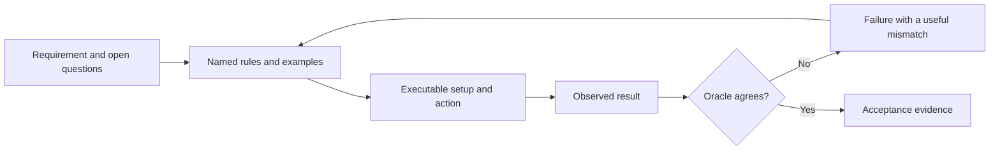

<TLDR>
  <TLDRCell label="what">
    可执行规格用具名示例和可运行检查来说明系统的可观察行为。
  </TLDRCell>
  <TLDRCell label="trap">
    检查通过只能证明其中编码的案例与性质；模糊的边界和循环论证式测试预言机仍可能放过错误行为。
  </TLDRCell>
  <TLDRCell label="fix">
    实现前先写明规则、输入、预期结果、边界和失败行为，并让检查独立于实现细节。
  </TLDRCell>
</TLDR>

## 是什么，为什么存在

<Term id="executable-specification">可执行规格（executable specification）</Term>是用机器可运行形式表达的行为约定。它把可读示例或性质与检查配对，将实现的可观察结果和预期结果比较。一次运行会生成通过、失败或明确差异等证据。

文字说明仍然重要。它解释每项检查背后的业务含义、范围和决定，可执行部分则消除特定案例中的歧义。两者不能互相替代：纯文字可能有多种解释，纯代码又可能隐藏预期值为何正确。

当编程智能体收到「满 50 欧元免运费」这样的简短需求时，这一点格外重要。这句话没有说明 50 欧元本身是否符合条件、加急配送是否免费、适用于哪些目的地，也没有规定无效小计应怎样处理。智能体可能用看似合理却违背产品决定的假设填补空白。

具名示例迫使这些选择显式化。「法国标准订单小计为 4,999 分时运费为 500 分；5,000 分时为 0」同时固定了单位和包含等号的边界。另一个加急示例则明确该规则是否覆盖免运费阈值。

可执行规格经常由测试实现，但两个名称并非同义词。底层单元测试可以保护内部辅助函数，却不一定传达需求。只有读者能把检查关联到预期可观察行为，而且它能拒绝违反该行为的实现时，称它为规格导向的检查才有意义。

可观察表面可以是函数返回值、HTTP 响应、数据库状态转换、发布的事件、渲染后的无障碍名称，或命令的退出状态与输出。应选择调用者或用户真正依赖的表面。私有调用顺序和临时变量很少属于约定内容。

<Term id="api-contract">API 契约（API contract）</Term>是一种常见的规格边界。它的可执行检查可以覆盖请求形状、状态码、响应字段、错误语义和兼容性承诺。同一方法也适用于 API 之下的函数、命令行或完整用户流程。

验收测试、表驱动测试、契约测试、模式验证、一致性测试套件，以及由持续集成执行的小脚本中都会出现可执行规格。具体框架不是必需条件。核心是把一条明确规则可重复地映射到独立观察到的证据。

对于新功能，应先写出最小但有判别力的示例，再让智能体实现。面对遗留系统时，可以先用<Term id="characterization-test">特征测试（characterization test）</Term>记录当前行为，但要标为「当前行为」，不能称为「期望行为」。这样就不会把偶然缺陷悄悄固化成永久需求。

## 工作原理

可执行规格把需求转换成有限的决定和观察。作者先确定范围，再按行为划分输入，明确边界和优先级，并选择<Term id="test-oracle">测试预言机（test oracle）</Term>。运行器提供输入、观察公开结果，再由预言机判断结果是否满足约定。



指回示例的箭头很重要。失败可能暴露代码缺陷，也可能暴露错误的预期值或尚未解决的产品问题。不要只为让结果变绿而修改预期；应先判断约定的哪一侧出了错。

### 单个规格示例的形状

有用的示例应提供足够信息，使人无需从实现反推意图就能复现一种行为。Given/When/Then 写法很方便，但普通数据对象与断言也能表达同样结构。关键是让每个字段只承担一种职责。

| 部分 | 回答的问题 | 运费示例 |
| --- | --- | --- |
| 规则名称 | 这个案例为何存在？ | 恰好到达免运费边界的标准订单 |
| Given | 有哪些相关状态和输入？ | `subtotalCents: 5000`、`country: "FR"` |
| When | 执行哪个公开动作？ | 计算运费 |
| Then | 要求什么可观察结果？ | 返回 `0` 分 |
| 边界说明 | 哪个相邻值必须不同？ | `4999` 返回 `500` 分 |

名称能让失败信息直接指向问题。`case 2 failed` 会迫使审查者重新翻找数据，而「恰好到达免运费边界的标准订单」能立即指出规则。裸数字可能引起误解时，要在名称中写明单位和领域含义。

准备数据只保留会改变结果的事实。如果案例附带无关的客户履历、数据库夹具和时钟，生成的实现可能从噪声中臆造规则。最小化准备能凸显真正条件，也能让失败保持局部。

### 分区与边界

不可能枚举所有输入，因此要按行为划分输入空间。免运费阈值的有效分区可以是低于阈值、达到或超过阈值、加急，以及支持国家之外。每个分区选择一个代表，并在数值边界两侧直接放置示例。

边界措辞必须准确。「超过 50 欧元」通常表示 `> 5000`，「50 欧元或以上」则表示 `>= 5000`，但日常交流常把两者混用。应记录整数分、比较运算符和舍入步骤，不能让代码自行推断。

无效输入和缺失输入也是分区。要说明负数小计是抛出异常、返回领域拒绝，还是由上游模式检查保证永远不会出现。如果规则归其他层所有，就明确标出边界，不要默默漏掉案例。

使用反例区分相邻规则。正例证明某个输入会被接受，接近的反例说明邻近输入为何被拒绝。两者结合，可降低智能体用过宽捷径满足快乐路径的概率。

### 优先级与决策表

需求中经常有单独看来清楚、组合后却相互重叠的规则。发货 45 天后退回的瑕疵清仓商品，可能同时命中瑕疵例外、清仓排除和时限。没有优先级时，多种实现都可能显得合理。

<Term id="decision-table">决策表（decision table）</Term>会把重叠条件写清楚。每一行描述一种有意义的组合及唯一预期结果，行名称说明哪条规则获胜。较高优先级规则命中后，某些条件不再相关，此时无需生成完整笛卡尔积。

| 优先级 | 有瑕疵 | 清仓 | 天数 | 预期决定 |
| --- | --- | --- | --- | --- |
| 1 | 是 | 任意 | 任意非负值 | 全额退款 |
| 2 | 否 | 是 | 任意非负值 | 不符合条件 |
| 3 | 否 | 否 | `0..30` | 全额退款 |
| 4 | 否 | 否 | `31+` | 不符合条件 |

「任意」单元格是有意为之，并非测试数据缺失。它表示较早规则作出决定后，低优先级条件不能影响结果。如果回归风险较高，可以加入一行具体可执行案例，改变被忽略的条件来证明这一点。

### 选择预言机

预言机提供预期结果或性质。它可以比较精确值、匹配结构化错误、验证模式、检查状态转换，或在大量输入上断言不变量。它必须比被测实现更容易获得信任。

不要复制生产公式来计算预期运费。同一个错误运算符可能同时出现在测试和实现两侧，导致检查照样通过。来自已批准示例的字面预期值，或结构不同的参考规则，才能赋予检查独立判别力。

产品只允许一个结果时，精确值最有力。允许多个结果时，性质更合适：分页器可以检查容量足够且没有多余整页，而不规定内部循环。具名示例负责解释规则，性质负责扩大搜索范围，两者可以结合使用。

失败行为和成功行为一样需要预言机。应检查错误类型或稳定代码，以及禁止出现的副作用。除非完整的人类可读消息本身就是受支持接口，否则不要固定偶然出现的堆栈轨迹或整段消息。

### 把检查绑定到执行

只有命令、环境和依赖都已知时，规格才真正可执行。应记录运行时、工作目录、夹具归属和必需环境值。只含断言的文件还不是证据，运行器必须实际执行它并保留结果。

交付门应依据进程事实推导状态：确切命令、退出码、失败案例名称，以及跳过或截断的输出。智能体声称「所有验收测试均通过」，不等于宿主捕获到了退出码。

在行为允许时让检查保持确定性。注入时钟，为伪随机生成设定种子，隔离可变存储，并用契约边界替代不受控网络调用。如果被测行为本身就是计时或并发，则要规定容差并收集重复证据，不能用重试掩盖不稳定性。

把每条验收标准追踪到一项或多项检查。无需专用工具，在案例名称中使用稳定规则 ID 就可能足够。目标是能双向查看：哪些证据支持某项需求，以及哪项需求证明某项检查有存在理由。

| 需求 | 可执行形式 | 失败时的证据 |
| --- | --- | --- |
| 包含等号的阈值 | `4999` 和 `5000` 两个案例 | 预期与实际费用，加案例名称 |
| 瑕疵例外优先 | 一行条件重叠的决策表 | 预期与实际决定，加输入 |
| 页数最小 | 确定性的性质遍历 | 第一条反例及其参数 |
| 拒绝无效小计 | 错误断言 | 未出现错误或错误类型不符 |

实际可行时，要让新的行为检查在旧实现或特意破坏的实现上运行。看到失败，可以证明检查能够发现目标缺陷。再对候选实现运行；高风险修改应同时保留变红和变绿的证据。

## 示例

这些示例使用 Node 严格断言作为小型、零依赖的检查框架。每个文件都包含所讨论的行为，因此可以独立运行；在真实代码库中，实现通常应从公开接口导入。下列输出来自 Node `v24.14.0`。

### 具名示例固定边界

运费示例使用整数分表示金额，并为每一行写明理由。`4999` 与 `5000` 这一对案例固定了包含等号的免运费边界，另外两行则确定加急配送和国际配送的规则优先级。

<Depth level="quick">

```js run title="shipping_examples.mjs"
import assert from "node:assert/strict";

function shippingFeeCents({ subtotalCents, country, expedited = false }) {
  if (!Number.isInteger(subtotalCents) || subtotalCents < 0) {
    throw new RangeError("subtotalCents must be a non-negative integer");
  }
  if (country !== "FR") return 1200;
  if (expedited) return 900;
  return subtotalCents >= 5000 ? 0 : 500;
}

const examples = [
  {
    name: "standard just below free shipping",
    input: { subtotalCents: 4999, country: "FR" },
    expected: 500,
  },
  {
    name: "standard at free-shipping boundary",
    input: { subtotalCents: 5000, country: "FR" },
    expected: 0,
  },
  {
    name: "expedited ignores subtotal threshold",
    input: { subtotalCents: 8000, country: "FR", expedited: true },
    expected: 900,
  },
  {
    name: "international uses a flat fee",
    input: { subtotalCents: 8000, country: "BE" },
    expected: 1200,
  },
];

for (const example of examples) {
  assert.equal(shippingFeeCents(example.input), example.expected);
  console.log(`PASS: ${example.name} -> ${example.expected}`);
}
```

```text
PASS: standard just below free shipping -> 500
PASS: standard at free-shipping boundary -> 0
PASS: expedited ignores subtotal threshold -> 900
PASS: international uses a flat fee -> 1200
```

<TryToBreak items={['负数或小数小计', '4,999 分与 5,000 分', '缺失或未知的国家代码']} />

</Depth>

把 `>=` 改成 `>` 会让边界行准确失败。这种失败很有用：案例名称、输入和字面预期值共同指向产品规则，而不是内部函数。重构可以替换所有分支，同时继续满足同一组示例。

这个示例尚未规定国家缺失时怎样处理，也没有说明国际加急配送是否有单独价格。这些是可见缺口，并不意味着可以自行猜测。把这些分区的行为交给智能体前，应先添加经过批准的行。

### 决策表固定优先级

退款函数有三条重叠规则。有序分支实现优先级表，第一个案例特意同时激活三个条件，以证明瑕疵规则覆盖其他排除条件。

```js run title="refund_decision_table.mjs"
import assert from "node:assert/strict";

function refundDecision({ daysSinceDelivery, finalSale, faulty }) {
  if (!Number.isInteger(daysSinceDelivery) || daysSinceDelivery < 0) {
    throw new RangeError("daysSinceDelivery must be a non-negative integer");
  }
  if (faulty) return "full refund";
  if (finalSale) return "not eligible";
  return daysSinceDelivery <= 30 ? "full refund" : "not eligible";
}

const rules = [
  {
    name: "fault overrides final-sale and time limits",
    input: { daysSinceDelivery: 45, finalSale: true, faulty: true },
    expected: "full refund",
  },
  {
    name: "final sale blocks an ordinary return",
    input: { daysSinceDelivery: 10, finalSale: true, faulty: false },
    expected: "not eligible",
  },
  {
    name: "day 30 is inside the return window",
    input: { daysSinceDelivery: 30, finalSale: false, faulty: false },
    expected: "full refund",
  },
  {
    name: "day 31 is outside the return window",
    input: { daysSinceDelivery: 31, finalSale: false, faulty: false },
    expected: "not eligible",
  },
];

for (const rule of rules) {
  const actual = refundDecision(rule.input);
  assert.equal(actual, rule.expected, rule.name);
  console.log(`PASS: ${rule.name} -> ${actual}`);
}
```

```text
PASS: fault overrides final-sale and time limits -> full refund
PASS: final sale blocks an ordinary return -> not eligible
PASS: day 30 is inside the return window -> full refund
PASS: day 31 is outside the return window -> not eligible
```

两个时间窗口案例区分 `<= 30` 和 `< 30`，条件重叠案例则区分分支顺序。如果以后把「瑕疵」拆分为已确认和未确认状态，应先扩展决策表。否则，智能体可能表面上支持新状态，实际仍保留旧的布尔捷径。

这些字面结果适合作为预言机，因为它们由策略负责人决定。如果调用另一份同样嵌套 `if` 的实现来推导 `expected`，只会增加代码，不会增加独立证据。

### 性质扩大具名示例的范围

分页规格从四个易懂的边界示例开始。随后，它在 105 对确定性输入上检查两个性质：返回页数有足够容量，而且少一页就无法容纳所有条目。

```js run title="pagination_properties.mjs"
import assert from "node:assert/strict";

function pageCount(totalItems, pageSize) {
  if (!Number.isInteger(totalItems) || totalItems < 0) {
    throw new RangeError("totalItems must be a non-negative integer");
  }
  if (!Number.isInteger(pageSize) || pageSize <= 0) {
    throw new RangeError("pageSize must be a positive integer");
  }
  return Math.ceil(totalItems / pageSize);
}

const examples = [
  { totalItems: 0, pageSize: 10, expected: 0 },
  { totalItems: 1, pageSize: 10, expected: 1 },
  { totalItems: 10, pageSize: 10, expected: 1 },
  { totalItems: 11, pageSize: 10, expected: 2 },
];

for (const example of examples) {
  assert.equal(pageCount(example.totalItems, example.pageSize), example.expected);
}

let checkedPairs = 0;
for (let totalItems = 0; totalItems <= 20; totalItems += 1) {
  for (let pageSize = 1; pageSize <= 5; pageSize += 1) {
    const pages = pageCount(totalItems, pageSize);
    assert.ok(pages * pageSize >= totalItems);
    if (pages > 0) assert.ok((pages - 1) * pageSize < totalItems);
    checkedPairs += 1;
  }
}

console.log(`named examples: ${examples.length} passed`);
console.log(`boundary sweep: ${checkedPairs} pairs passed`);
```

```text
named examples: 4 passed
boundary sweep: 105 pairs passed
```

仅有容量性质还不够强：返回一百万页也能满足它。最小性性质排除了这个错误解。零条目的具名示例仍有价值，它表达了代数关系不一定能向产品审查者清楚传达的含义。

这些循环刻意保持有界和确定性。可以追加规模更大的随机搜索，但证据中必须包含种子和第一条失败输入，才能让其他运行器复现结果。

## 陷阱

### 只规定快乐路径

> [!PITFALL]
> 只有「60 欧元订单免运费」这一个示例时，`subtotalCents > 0`、`>= 5000` 或写死结果都可能通过。它没有说明阈值、覆盖规则、无效值和不支持的目的地。

**修复：**识别行为分区，并在每个边界添加相邻案例。至少包含一条拒绝或失败路径；两条规则可能同时适用时，再加入一条重叠案例。

### 构造循环论证式预言机

> [!PITFALL]
> 生成的测试用 `expected = subtotalCents >= 5000 ? 0 : 500` 计算预期值，再与包含相同表达式的生产代码比较。错误需求或复制来的运算符同时出现在两侧，检查仍会保持绿色。

**修复：**为具名案例使用经过批准的字面结果；面对较大输入域时，则使用结构独立的参考实现。审查每个预期值的来源，并故意破坏生产边界，确认检查会失败。

### 过度规定实现方式

> [!PITFALL]
> 针对私有辅助函数调用、分支顺序、临时对象或确切查询文本的断言，可能拒绝行为不变的重构。智能体随后会迎合测试中的内部脚本，而不是满足公开需求。

**修复：**观察最小且稳定的公开表面，例如返回值、已记录的错误、状态转换、事件或响应。只有内部交互本身就是需求时才断言它，例如「最多向支付服务商扣款一次」。

### 让错误语义保持隐含

> [!PITFALL]
> 「无效输入失败」没有说明失败是异常、验证结果、HTTP 状态，还是不发生状态修改。生成代码可能捕获所有错误并返回貌似合理的默认值，使正向检查继续通过。

**修复：**规定错误类别、稳定代码或类型，以及禁止出现的副作用。如果缺失、格式错误、越界和未授权输入的归属或结果不同，就分别添加案例。

### 把绿色检查当成完整规格

> [!PITFALL]
> 测试套件可以全部通过，却遗漏无障碍、兼容性、并发、迁移或运维约束。旧检查也可能忠实执行产品已经不再需要的行为。

**修复：**维护需求到检查的映射，单独审查尚未覆盖的判断。规则变化时，在同一修改中更新文字与示例，证明旧实现无法通过新检查，并有意删除过时预期。

## AI 时代

**生成代码在这里容易出什么错**

生成代码常按第一个貌似合理的解释实现包含等号的边界、货币单位、默认值或优先级，再生成反映自身选择的测试。它可能用生产公式替换字面预期值，只测试智能体臆造的快乐路径，削弱失败断言，甚至模拟被测函数。另一类常见错误是运行了错误文件、吞掉非零退出码，或漏掉最初失败的验收案例，却报告「所有测试均通过」。

**让 AI 检查什么**

- 列出每条规则、输入分区、边界对、重叠条件和尚未解决的产品决定；不得为未决定的行臆造结果。
- 把每个预期值映射到其来源，并标出复制生产公式、私有辅助函数、由实现生成的夹具，或未经审查快照的预言机。
- 在声明的工作目录运行每条具名命令，报告退出码和失败案例名称，并证明新检查会在旧实现或特意破坏的实现上失败。

**审查清单**

- 用相邻正例和反例核对确切单位、等号边界、默认值、无效输入行为与规则优先级。
- 确认检查观察的是公开行为，能因目标缺陷而失败，而且不会借助被测代码计算预期值。
- 把每项完成声明映射到原始命令证据，再列出仍由人工审查的产品、安全、无障碍和运维判断。

**提示词词汇**

使用准确术语 `executable specification`（可执行规格）、`acceptance criterion`（验收标准）、`named example`（具名示例）、`counterexample`（反例）、`equivalence partition`（等价分区）、`boundary value`（边界值）、`decision table`（决策表）、`rule precedence`（规则优先级）、`test oracle`（测试预言机）、`property`（性质）和 `red-green evidence`（红绿证据）。要求生成「需求到检查的可追踪表」与「最小反例」；只说「添加全面测试」过于模糊，无法约束生成行为。

<Depth level="deep">

## 预言机边界

可执行规格最难的部分不是断言语法，而是决定哪些事实具有权威性，以及解释应在哪里停止。预言机边界把经过批准的产品含义与等待评判的候选实现分开。

### 精确、结构与性质预言机

精确预言机只给出一个要求值：小计为 5,000 分的法国标准订单运费为 0 分。它容易审查，也能产生明确差异，但只覆盖选定案例。策略选择、协议代码和明确边界结果最适合使用精确示例。

结构预言机会检查模式或选定字段，同时允许无关差异。HTTP 契约可以要求状态为 `201`、资源 ID 稳定且状态符合预期，同时忽略响应头顺序。结构检查能减少意外耦合，但允许的变化必须出于明确决定，而不能来自过度宽松的匹配器。

性质预言机描述许多输入都必须满足的关系。分页示例检查容量充足与页数最小，无需重新实现 `Math.ceil`。有用的性质必须能排除真实的错误实现；「结果非负」虽有必要，单独使用却远远不够。

快照或黄金文件比较，是对一个大型值使用精确预言机。整个产物属于受支持输出时，它很有用，但审查者必须理解每项变化。生成修改后自动替换快照，会让候选输出变成自己的预言机，从而抹去测试的判别力。

不同预言机样式的失败模式不同时，可以组合使用。具名示例传达选定的业务决定，性质搜索更宽输入空间，模式则约束形状。如果所有断言都源自同一处，断言数量增多并不会自动产生更多独立证据。

### 独立性是数据流问题

应追踪信息如何同时到达实现和预期结果。如果同一个生成函数、查找表、生产数据库查询或模型响应同时供给两条路径，二者的一致可能是循环论证。文件分离和函数名称不同本身不能创造独立性。

经批准示例可以来自策略负责人、协议标准、从可信版本捕获的兼容性夹具，或用不同原语编写的小型参考模型。应把来源记录在案例附近。如果权威结果仍有争议，它就是开放决定，而不是等待猜测的断言。

遗留系统的特征测试尤其需要谨慎标记。捕获当前输出可以在理解系统的过程中保护重构，但当前输出可能包含缺陷。把「本次重构需要保留」与「产品批准的行为」分开；决定逐渐明确后，再替换特征测试案例。

变异是一种实用的预言机强度检查。把 `>=` 改为 `>`，反转两个优先级分支，返回常量，或移除输入验证，然后确认相关检查会失败。修改存活说明缺少案例或性质太弱，并不能证明存活的实现可被接受。

### 完整性必须有边界且可见

有限测试套件无法证明任意软件正确。有用的规格会改为声明自身边界：这里决定了哪些行为，代表了哪些输入，抽样了哪些性质，以及哪些判断仍在自动化之外。这样既能让绿色结果有意义，也不会假装覆盖一切。

增加大量案例前，先制作小型覆盖矩阵。行表示规则或结果，列表示边界、缺失、授权和覆盖等重要分区。一个示例可以覆盖多个单元格，但每个填充的格子都应能由其准备数据与预期结果论证。

条件互相独立，或因优先级变得无关时，应避免完整笛卡尔积。在决策表中有意使用「任意」，再选择少量重叠案例来证明无关性。这样既让套件足够快，可以在智能体每次迭代中运行，也保留最可能暴露错误捷径的组合。

有些需求难以进行确定性检查。语气、视觉层次、产品吸引力和可接受迁移风险可能需要结构化人工审查。为这些判断写出清单、样例或审批门，并将它们排除在自动通过计数之外。

### 活规格的变更控制

规格会随产品演进。预期值变化属于需求变更，不是普通测试维护，因此应与实现一起审查，并解释决定。稳定的规则 ID 和案例名称让这段历史可被搜索。

可靠的变更顺序以证据驱动：运行旧行为，添加或修改经批准示例，观察预期失败，实现改动，再运行相关检查和更广检查。红色结果证明检查有敏感性；绿色结果只证明实现符合已记录范围。

应对外部契约和夹具进行版本管理。服务提供方行为、模式、时区数据和依赖默认值都可能独立于自身代码而变化。固定预言机使用的权威来源，把升级变成显式审查，不能让今天的网络响应改写明天的预期。

快速规格检查对智能体很有帮助，但不能为速度牺牲预言机边界。把小范围验收示例放在循环前段，交付前再运行较慢的集成与运维检查。跳过的检查必须记录为缺失证据，绝不能算作隐含成功。

</Depth>

<Checkpoint id="ai-era/executable-specifications" />

## 延伸阅读

- [Node.js 24 文档：严格断言模式](https://nodejs.org/docs/latest-v24.x/api/assert.html#strict-assertion-mode)
- [Node.js 24 文档：测试运行器](https://nodejs.org/docs/latest-v24.x/api/test.html)
- [Cucumber 文档：Gherkin 参考](https://cucumber.io/docs/gherkin/reference/)
- [JSON Schema：创建第一个模式](https://json-schema.org/learn/getting-started-step-by-step)
- [RFC 2119：表示需求等级的关键词](https://www.rfc-editor.org/rfc/rfc2119)
