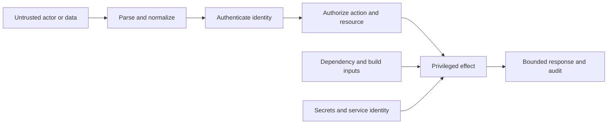

<TLDR>
  <TLDRCell label="what">
    Generated code security is the review discipline of treating model-written changes as untrusted proposals and testing the system boundaries they affect.
  </TLDRCell>
  <TLDRCell label="trap">
    Plausible local code can still leak a secret, authorize the wrong object, trust hostile input, or introduce an unreviewed dependency.
  </TLDRCell>
  <TLDRCell label="fix">
    Threat-model the change, trace each trust boundary, and require independent evidence for input handling, authorization, secrets, and dependencies.
  </TLDRCell>
</TLDR>

## What it is and why it exists

Generated code security is a way to review code proposed by a model before that code receives real authority. The model can draft a handler, dependency update, migration, workflow, or configuration, but its output is not evidence that the resulting system is safe. You still decide which security claims matter and verify them against the repository and runtime.

The key unit is the generated change in its execution context, not the prompt or diff alone. A five-line route can depend on authentication middleware, a tenant-scoped repository, a serializer, a package lifecycle script, and deployment credentials. The security review follows those connections far enough to find the assets, actors, and effects the change can reach.

A trust boundary is an <Term id="architecture-boundary">architecture boundary</Term> where data or authority moves between parties with different privileges or reliability. HTTP input crossing into an application is one boundary. So are a queue message entering a worker, a service calling a database, a build fetching a package, and generated text becoming an executable command.

Models reproduce common patterns from training data. Some patterns are outdated, omit repository-specific controls, or assume a framework feature that is not active in this application. A model also sees only the context supplied to it, so it rarely has a complete view of identity propagation, credential scope, production wiring, or operational data sensitivity.

This does not make generated code uniquely malicious. It makes provenance and confidence poor substitutes for review. The same controls that protect a codebase from hurried human changes—least authority, explicit contracts, independent tests, dependency controls, and layered enforcement—also apply to model-written changes.

You need this review whenever generated code touches an externally reachable entry point, a protected resource, a secret-bearing environment, a new dependency, or an effect such as storage, process execution, messaging, or network access. A formatting-only change may need little security work. A one-line change to an authorization predicate may need the most.

The goal is not to prove that no vulnerability exists. The practical goal is to state the important security invariants, search for ways the change could violate them, and collect evidence proportional to the possible harm. Unknowns remain explicit instead of being converted into approval by a fluent explanation.

## How it works

Start with a delta threat model: what new capability, data flow, dependency, or reachable state does this change introduce? Name the protected assets, possible callers, entry points, privileged effects, and failure consequences. If the change claims to be a refactor, verify that its reachable effects and authorization decisions truly remain unchanged.

Then expand from changed lines to the nearest enforcement points and consumers. Find where identity is authenticated, where an <Term id="access-token">access token</Term> becomes a principal, where input is parsed, where authorization is decided, where secrets are loaded, and where dependencies execute during build or startup. This boundary map defines the review surface.



The diagram is a review map, not a universal request order. Some systems authenticate before parsing a body, and internal events may carry a service identity rather than a user identity. The invariant is that no untrusted value or insufficiently privileged principal reaches the effect by bypassing its required checks.

Use five lenses on every boundary-changing diff:

| Lens | Question | Evidence |
| --- | --- | --- |
| Trust boundary | What moves from less trusted to more privileged code? | Entry-point and effect trace |
| Secrets | Can credentials enter source, prompts, logs, errors, fixtures, or responses? | Source-to-sink search and redaction test |
| Dependencies | What code is fetched or executed, under which identity and lock? | Manifest and lockfile diff, provenance, lifecycle review |
| Input handling | What type, size, encoding, path, and grammar are accepted? | Boundary validation and adversarial cases |
| Authorization | May this principal perform this action on this exact resource now? | Denial tests and policy-enforcement trace |

Keep authentication and authorization separate. Authentication establishes an identity; authorization decides whether that identity may perform one action on one resource under current policy. A valid session is not permission, and a hidden button is not enforcement.

Treat validation as a boundary operation rather than a string-cleaning ritual. Establish the accepted type and size, normalize once where the protocol requires it, validate the canonical representation, and pass structured values to the next API. Shell escaping, SQL parameters, HTML encoding, and path containment solve different sink-specific problems.

For secrets, trace source, transformation, sink, and lifetime. A credential may come from an environment variable but still leak through an exception, debug object, test snapshot, model prompt, or child-process environment. Replacing the visible value with `***` helps only if every relevant sink uses the redacted representation.

For dependencies, review executable supply-chain behavior as well as API shape. A tiny package can run installation scripts, bring transitive packages, change a lockfile's resolved source, or execute inside a build identity that has publish credentials. A package name that looks familiar is not an integrity or provenance guarantee.

Turn each important claim into a negative test or deterministic inspection. Try another tenant, an identity without the required scope, a malformed value, a canonicalization trick, a missing secret, a changed lock entry, and a dependency failure. Successful happy-path output proves almost none of those denial properties.

Record residual risk after the checks. Static review may confirm that a query is tenant-scoped but not that production policy configuration grants the intended roles. A unit test may confirm argument construction but not operating-system isolation. Approval should say what was verified, what was not, and why the remaining exposure is acceptable.

## Examples

The examples use small policy functions so each decision is visible. The output shown after every block was produced locally with Node 24, not inferred from the source.

### Authorizing an action on one object

This reader checks the required scope and the invoice's tenant at the data boundary. It returns the same not-found response for absent and cross-tenant objects, so it does not reveal which invoice identifiers exist elsewhere.

<Depth level="quick">

```javascript run title="invoice_access.js"
const invoices = new Map([
  ["inv-a", { id: "inv-a", tenantId: "tenant-a", total: 4200 }],
  ["inv-b", { id: "inv-b", tenantId: "tenant-b", total: 1700 }],
]);

function readInvoice(principal, invoiceId) {
  if (!principal.scopes.includes("invoices:read")) {
    return { status: 403, body: "forbidden" };
  }

  const invoice = invoices.get(invoiceId);
  if (!invoice || invoice.tenantId !== principal.tenantId) {
    return { status: 404, body: "not found" };
  }

  return { status: 200, body: invoice.id };
}

function show(label, response) {
  console.log(`${label}: ${response.status} ${response.body}`);
}

const reader = { tenantId: "tenant-a", scopes: ["invoices:read"] };
const guest = { tenantId: "tenant-a", scopes: [] };

show("own invoice", readInvoice(reader, "inv-a"));
show("cross-tenant", readInvoice(reader, "inv-b"));
show("missing scope", readInvoice(guest, "inv-a"));
```

```text
own invoice: 200 inv-a
cross-tenant: 404 not found
missing scope: 403 forbidden
```

<TryToBreak items={['an invoice from another tenant', 'a principal without invoices:read', 'an unknown invoice identifier']} />

</Depth>

The first request has both dimensions of authority: permission for the action and ownership scope for the object. The second request demonstrates protection against <Term id="broken-object-level-authorization">broken object-level authorization</Term>. The third shows that knowing a valid identifier does not replace action permission.

In a real service, put the tenant condition into the repository query when possible, then retain an explicit policy decision for the action. That reduces accidental exposure and avoids loading a cross-tenant object into application memory. Tests should cover both enforcement layers rather than mocking one into unconditional success.

### Preserving structure at a process boundary

The archive planner accepts a narrow project grammar, binds the tenant to the authenticated principal, proves path containment, and returns an argument vector. It never creates a shell command string from request data.

```javascript run title="archive_policy.js"
import path from "node:path";

function planArchive(principal, request) {
  if (!principal.scopes.includes("exports:create")) {
    throw new Error("missing exports:create scope");
  }
  if (request.tenantId !== principal.tenantId) {
    throw new Error("tenant mismatch");
  }
  if (!/^[a-z0-9-]{1,32}$/.test(request.project)) {
    throw new Error("invalid project slug");
  }

  const root = path.resolve("/srv/exports", principal.tenantId);
  const target = path.resolve(root, `${request.project}.zip`);
  if (!target.startsWith(`${root}${path.sep}`)) {
    throw new Error("target escaped export root");
  }

  return {
    command: "zip",
    args: ["-r", "--", target, request.project],
    cwd: root,
  };
}

const principal = { tenantId: "tenant-a", scopes: ["exports:create"] };

for (const request of [
  { tenantId: "tenant-a", project: "quarterly-data" },
  { tenantId: "tenant-a", project: "../../secrets" },
  { tenantId: "tenant-b", project: "quarterly-data" },
]) {
  try {
    const plan = planArchive(principal, request);
    console.log(`${request.project}: ${plan.command} ${JSON.stringify(plan.args)}`);
  } catch (error) {
    console.log(`${request.project}: rejected: ${error.message}`);
  }
}
```

```text
quarterly-data: zip ["-r","--","/srv/exports/tenant-a/quarterly-data.zip","quarterly-data"]
../../secrets: rejected: invalid project slug
quarterly-data: rejected: tenant mismatch
```

An allowlist grammar makes the accepted language easy to test; path containment remains a defense against future grammar changes. The `--` argument tells the downstream program to stop option parsing. Passing a command and argument array to a process API preserves structure that shell interpolation would destroy.

This planner does not itself execute `zip`, prove that the source directory is safe, or establish operating-system confinement. The caller must use a non-shell process API, a bounded environment, a timeout, output limits, and an identity with access only to the relevant export directory. The example's narrow result is one enforcement layer, not a complete sandbox.

### Admitting a dependency change

This policy compares a proposed direct dependency with reviewed lock metadata and treats lifecycle execution as a separate approval. The placeholder integrity value represents repository-controlled review data; production code would consume the package manager's real integrity and provenance records.

```javascript run title="dependency_admission.js"
const approved = new Map([
  [
    "safe-parser",
    { version: "4.2.1", integrity: "sha512-reviewed", allowsInstallScripts: false },
  ],
]);

function reviewDependency(change) {
  const expected = approved.get(change.name);
  const reasons = [];

  if (!expected) reasons.push("package is not approved");
  if (expected && change.version !== expected.version) {
    reasons.push("version differs from approved lock");
  }
  if (!change.integrity || (expected && change.integrity !== expected.integrity)) {
    reasons.push("integrity is missing or changed");
  }
  if (change.installScript && !expected?.allowsInstallScripts) {
    reasons.push("install script needs review");
  }

  return { accepted: reasons.length === 0, reasons };
}

function show(change) {
  const result = reviewDependency(change);
  const detail = result.accepted ? "accepted" : `rejected: ${result.reasons.join("; ")}`;
  console.log(`${change.name}@${change.version}: ${detail}`);
}

show({ name: "safe-parser", version: "4.2.1", integrity: "sha512-reviewed" });
show({ name: "safe-parser", version: "4.3.0", integrity: "sha512-new" });
show({ name: "new-helper", version: "1.0.0", installScript: true });
```

```text
safe-parser@4.2.1: accepted
safe-parser@4.3.0: rejected: version differs from approved lock; integrity is missing or changed
new-helper@1.0.0: rejected: package is not approved; integrity is missing or changed; install script needs review
```

The policy rejects an unreviewed upgrade even though the package name is unchanged. It also gives several reasons for a new helper instead of stopping at the first failure, which makes review evidence clearer. Admission should fail closed when lock or provenance data is absent.

Real dependency review also inspects transitive changes, registry source, maintainer or publisher signals, known vulnerabilities, license policy, and whether existing platform code can do the job. Automated scanning finds known facts; it cannot decide that a new package's authority and maintenance burden are justified.

## Pitfalls

### Reviewing only the generated lines

> [!PITFALL]
> A diff can look locally safe while relying on an unscoped caller, permissive middleware, dangerous serializer, or privileged deployment identity. Models often explain only the functions they changed, which hides the controls that must exist elsewhere.

**Fix:** expand the review from entry point to privileged effect and from new return value to every consumer. Record concrete enforcement locations for authentication, authorization, validation, secret access, and side effects. If a required control is only assumed, test the assumption or keep it as unresolved risk.

### Treating valid input as authorized input

> [!PITFALL]
> A well-formed tenant ID, file name, or resource ID says nothing about whether the caller may use it. Generated handlers commonly validate syntax and then fetch by a request-controlled identifier without checking action and object scope.

**Fix:** derive scope from the authenticated principal where possible, authorize the exact action and resource on every request, and deny by default. Add tests for another tenant, a lower-privileged role, an inactive resource, and a resource that does not exist. Do not use client-side visibility as an authorization control.

### Copying secrets into convenient places

> [!PITFALL]
> A model may paste a real credential into a fixture, build argument, troubleshooting prompt, or example environment file. It may also log a whole request or configuration object whose nested fields contain tokens.

**Fix:** inject secrets at runtime through the platform's secret facility and give each identity <Term id="least-privilege">least privilege</Term>. Scan the diff and relevant history, exercise error paths, and inspect logs, traces, snapshots, process arguments, and responses. Revoke and rotate any credential that entered an untrusted system; deleting the visible line is not enough.

### Approving dependency names instead of artifacts

> [!PITFALL]
> Familiar naming does not prove publisher identity, resolved registry, integrity, transitive content, or lifecycle behavior. Generated code may add a package for a trivial helper and quietly expand what executes during install or build.

**Fix:** review manifest and lockfile together, require the expected registry and integrity metadata, inspect transitive and lifecycle changes, and run builds without production credentials. Prefer existing platform or repository capabilities when they keep the authority surface smaller. Pin according to repository policy and automate repeatable provenance checks.

### Using happy-path tests as a security verdict

> [!PITFALL]
> A `200` response for the intended user proves neither denial nor isolation. Mocks can bypass the real policy adapter, and snapshots can approve leaked fields without expressing why they are safe.

**Fix:** write abuse cases from the threat model and make them reach real enforcement points at the narrowest practical test layer. Assert status, returned fields, persisted state, emitted effects, and audit behavior. Deliberately break or bypass the control once to prove the test fails for the vulnerability it claims to detect.

## In the AI era

**What generated code gets wrong here**

Models often add authentication without object-level authorization, validate before decoding into a different representation, interpolate a checked value into a shell string, return entire database records, or catch an error and expose its secret-bearing details. They also introduce plausible packages without examining lockfile source or install scripts. Because the model optimizes for a convincing completion from partial context, it may cite a middleware, policy, or scanner that the active production path never invokes.

**Ask your AI to check**

- Produce a delta threat model naming assets, actors, entry points, trust-boundary crossings, privileged effects, and abuse cases introduced by this diff.
- Trace one allowed and three denied requests from production entry point to effect, showing where identity, action, resource, and tenant scope are enforced.
- List every secret source and sink plus every manifest and lockfile change; report missing evidence instead of inferring safety from names.

**Review checklist**

- Verify canonical input handling at the sink, including type, size, encoding, path containment, and structured parameterization.
- Exercise missing permission, cross-tenant object access, malformed input, and dependency or secret failure without privileged partial effects.
- Match each security claim to host-captured evidence and record any boundary, production configuration, or operational control not tested.

**Prompt vocabulary**

Use the exact terms `delta threat model`, `trust boundary`, `asset`, `threat actor`, `abuse case`, `attack surface`, `taint source`, `sink`, `canonicalization`, `deny by default`, `object-level authorization`, `tenant scope`, `least privilege`, `secret source-to-sink trace`, `dependency provenance`, `lockfile diff`, and `fail closed`. Ask for a boundary table with enforcement locations and negative evidence; “make this secure” does not specify a reviewable claim.

<Depth level="deep">

## Security invariants across trust boundaries

Security properties are end-to-end properties. A route-level check can be correct while a background worker replays the same operation without it. A dependency can be safe at runtime while its install script reads a credential during build. The deep review therefore follows authority and data across phase, process, and service boundaries.

### Model the change, not the whole universe

A useful threat model is scoped enough to complete and broad enough to include the changed capability. Begin from the pre-change system and ask what becomes newly reachable, newly trusted, or newly powerful. A renamed helper that preserves every edge needs less analysis than a new webhook whose body can trigger payments.

Write the delta as statements that can be challenged. “Unauthenticated internet callers can now submit archive requests” is observable. “The endpoint is secure” is not. Include removed checks and widened defaults because deleting friction can expand an attack surface even when no new function appears.

Use a compact worksheet:

| Field | Concrete content |
| --- | --- |
| Asset | Data, money, identity, availability, signing authority, or build integrity |
| Actor | User, tenant peer, anonymous caller, compromised service, package publisher, or insider |
| Entry | Route, event, file, environment, model output, package, or administrative action |
| Boundary | Parser, service interface, data store, process, network, build, or deployment identity |
| Effect | Read, write, execute, publish, delete, impersonate, or disclose |
| Invariant | A denial or containment statement that must remain true |
| Evidence | Test, trace, configuration inspection, lock record, or manual decision |

Actors are capabilities, not personality labels. “Attacker” is less useful than “authenticated tenant user who can choose `invoiceId` but lacks access to tenant B.” The latter tells you which inputs and credentials to use in a denial test.

Assets include control planes and metadata, not only business rows. Logs can contain access tokens, build caches can contain registry credentials, error timing can reveal object existence, and availability can be lost through an unbounded parser. Name the property at risk: confidentiality, integrity, availability, or accountable use of authority.

### Separate source, transform, sink, and effect

For untrusted data, record where it originates, every representation change, and the API that gives it meaning. A URL may be decoded by a framework, normalized by application code, resolved by a filesystem, and interpreted again by a downstream tool. Validation against one representation does not automatically constrain the next.

Canonicalize only when the protocol defines a canonical form. Then validate that form and preserve structure into the sink. Database values use query parameters, process calls use argument arrays, HTTP targets use a constrained URL parser and destination policy, and HTML output uses context-appropriate encoding. One generic `sanitize()` helper cannot safely cover all these meanings.

Size and resource use belong to input handling. A syntactically valid archive, regular expression, JSON document, image, or decompressed body may exhaust memory or CPU. Put limits before expensive expansion when possible, propagate cancellation and deadlines, and test a value at the permitted boundary plus one just beyond it.

Treat generated output as untrusted input when it crosses into an executor. A model-produced SQL fragment, shell command, workflow, URL, or infrastructure plan needs a constrained grammar and deterministic policy before execution. Natural-language instructions cannot enforce a boundary against adversarial or simply mistaken output.

### Carry identity without trusting claims

Identity should come from a verified channel and become a small principal object with only the claims the application needs. Request bodies, query parameters, unsigned headers, and model output must not choose the effective user or tenant. If delegation is allowed, represent delegator, delegate, permitted actions, and expiry explicitly.

Authorization combines principal, action, resource, and context. Checking only a role loses object ownership; checking only tenant equality loses action permission; checking only the route loses state-dependent policy. Keep the decision near a stable enforcement point and make denials the default for missing or unknown information.

Repository queries can enforce object scope by construction, such as selecting by both tenant and invoice ID. Policy code still decides whether the principal may perform the requested action. This layered form prevents broad data retrieval and keeps business authorization explicit.

Race conditions can invalidate a correct authorization check. If ownership, status, membership, or policy version can change between check and write, bind the decision to the state transition with a transaction, conditional update, capability, or recheck. A generated `if` followed by a distant `save()` deserves a time-of-check/time-of-use review.

Denial responses also carry information. Returning `404` for inaccessible objects may reduce identifier discovery, while audit systems can retain an internal reason. Apply one consistent external contract and avoid timing or field differences that reveal protected state without an approved need.

### Keep secrets out of model and artifact paths

Inventory credential sources: environment variables, mounted files, metadata services, developer keychains, CI stores, configuration services, and injected tokens. Then trace their possible sinks through logs, telemetry, exceptions, test output, prompts, caches, generated artifacts, process listings, and network calls.

Redaction should operate on structured fields before serialization. Searching strings after formatting misses alternate encodings, nested values, and partial secrets. Prefer allowlisting fields for logs and responses over maintaining an ever-growing denylist of secret names.

Secret scanners are useful but incomplete. They can find recognizable keys while missing valid session data, customer secrets, short passwords, or values assembled at runtime. Pair scanning with data-flow review, constrained process environments, egress control, and tests that place a sentinel secret into failure paths and assert it never appears.

A secret exposed to a model provider, issue tracker, log backend, build artifact, or repository history must be treated according to that system's retention and access model. Removing it from the latest file does not erase copies. Revoke first when exposure is credible, rotate dependents, and document the incident path.

### Review dependency execution by phase

Dependency risk begins before application startup. Resolution code chooses a registry and version; installation may execute scripts; compilation or code generation may load plugins; test discovery may import modules; packaging may publish artifacts. Map which identity, network access, and secrets exist in each phase.

A lockfile records more than version intent. Depending on the ecosystem, it can fix resolved locations, integrity material, transitive relationships, and flags that influence installation. Review unexpected lock churn instead of accepting it as generated noise, and regenerate it only with the repository's pinned toolchain.

Vulnerability databases answer whether a known advisory matches recorded package data. They do not prove that the publisher is intended, the package was not confused with a similarly named one, the provenance is acceptable, or the package needs its requested authority. Those remain admission decisions.

Run untrusted build steps with <Term id="least-privilege">least privilege</Term>: no production tokens, minimal writable paths, restricted network destinations, bounded time, and disposable state. If a build does not need lifecycle scripts, disable them by policy. If it does, identify and review the exact scripts rather than granting the whole dependency graph implicit execution.

### Make the security contract executable

Write invariants as denied transitions, not adjectives. “A tenant-A reader cannot observe whether `inv-b` exists” yields requests and response assertions. “Secrets are handled safely” does not say which secret, sink, or failure path matters.

An <Term id="api-contract">API contract</Term> should cover rejection as carefully as success. Specify accepted types and bounds, stable error categories, whether a caller may retry, and which effects are forbidden on failure. Generated code often returns the right status after a write has already committed, so assertions must inspect state and emitted work.

Use the narrowest test that reaches the real control. A pure policy unit test is fast and exhaustive, but it does not prove route wiring or database scoping. A repository integration test can prove query constraints. A small end-to-end denial test can prove that middleware, principal construction, policy, and serialization connect in production order.

Security tests need sensitivity evidence. Mutate the tenant predicate, remove the scope check, allow a path separator, expose a sentinel secret, or alter the approved lock record and confirm the relevant test fails. A green test that also passes without its control is ceremony, not evidence.

Property-based or fuzz tests help when the input grammar has many encodings and boundaries. They supplement explicit abuse cases rather than replace them. Keep the oracle simple: accepted values satisfy the grammar and containment rules; rejected values cause no protected effect.

### Compose controls without gaps

Layering helps only when controls are independent enough to stop the same abuse through different failure modes. A UI that hides an action and a route that trusts the same UI claim are one assumption repeated twice. A tenant-scoped query plus an action policy enforced from a verified principal are meaningfully different barriers.

Fail closed for absent identity, unknown policy results, missing integrity, parse errors, and unavailable enforcement dependencies. “Closed” does not always mean crashing; it means the privileged action does not occur. Return a bounded error, preserve consistent state, and emit an audit event that itself contains no secret.

Fallbacks deserve their own threat model. Generated code often catches a policy timeout and permits the action, changes a failed signature check into a warning, or substitutes an environment default with broader authority. Decide explicitly which degraded behavior is safe and test it under dependency failure.

Audit records should answer who attempted which action on which resource, when, and with what outcome, using stable identifiers. Avoid request bodies, credentials, and unnecessary personal data. Protect audit integrity and availability so a denied action cannot erase its own evidence or flood the channel without bounds.

### Review generated tests and explanations

Generated tests may reproduce the implementation's mistake in their expected value. Derive security expectations from policy and product requirements, not from current output. Have a separate reviewer or deterministic oracle validate cross-tenant, lower-privilege, and failure cases.

Mocks can accidentally grant all authority. A fake repository that returns any requested object bypasses tenant scoping, while a fake policy returning `true` proves no denial behavior. Give fakes explicit records of queries and decisions, and assert the scope passed into them.

Generated explanations are hypotheses about the code. Verify every statement such as “middleware already validates this,” “the ORM parameterizes the query,” or “the package has no install scripts” at the active version and production wiring. A plausible file elsewhere in the repository is not proof that this path uses it.

Static analysis, secret scanning, dependency analysis, tests, and manual review each see different failure classes. Keep their results separate so one green badge does not wash out an untested boundary. Suppress a finding only with a scoped reason, owner, and review date.

### Finish with an evidence ledger

For each invariant, record the enforcement location, check command or inspection, observed result, and remaining gap. This makes approval reproducible and gives the next change a baseline. It also reveals security claims that exist only in prose.

A compact entry might state: “Tenant isolation for invoice reads; enforced in `InvoiceRepository.findForTenant`; integration denial test passed under Node 24; production row-level policy not inspected.” The final clause matters because it prevents a local test from claiming more than it measured.

Revisit the threat model when the diff changes. A model may add a dependency, retry, log, or fallback while fixing a test, creating a new boundary after the first review. Inspect the final diff and rerun the evidence mapped to affected invariants.

The acceptance decision belongs to a human or policy system with authority over the risk. The model can enumerate flows, propose abuse cases, and execute checks, but it should not convert missing context into a security verdict. Require explicit approval when the residual risk exceeds the task's preauthorized boundary.

</Depth>

<Checkpoint id="ai-era/generated-code-security" />

## Further reading

- [OWASP Application Security Verification Standard](https://owasp.org/www-project-application-security-verification-standard/)
- [OWASP Code Review Guide](https://owasp.org/www-project-code-review-guide/)
- [OWASP Authorization Cheat Sheet](https://cheatsheetseries.owasp.org/cheatsheets/Authorization_Cheat_Sheet.html)
- [NIST Secure Software Development Framework](https://csrc.nist.gov/pubs/sp/800/218/final)
- [npm `package-lock.json` documentation](https://docs.npmjs.com/cli/v11/configuring-npm/package-lock-json)
