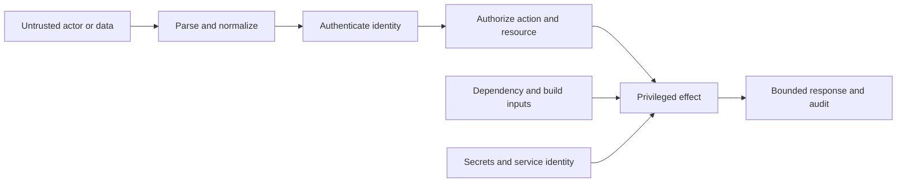

<TLDR>
  <TLDRCell label="what">
    生成代码安全是一套审查方法：把模型编写的改动当作不可信提案，并测试它影响的系统边界。
  </TLDRCell>
  <TLDRCell label="trap">
    局部代码即使看似合理，仍可能泄漏密钥、错误授权对象、信任恶意输入，或引入未经审查的依赖。
  </TLDRCell>
  <TLDRCell label="fix">
    对改动进行威胁建模，追踪每条信任边界，并用独立证据检查输入处理、授权、密钥和依赖。
  </TLDRCell>
</TLDR>

## 是什么，为什么存在

生成代码安全是在模型提出的代码获得真实权限之前审查它的方法。模型可以起草处理器、依赖更新、迁移、工作流或配置，但它的输出不能证明最终系统安全。安全主张由你决定，还要对照代码库与运行时验证。

审查的关键单位是执行上下文中的生成式改动，而不只是提示词或差异。短短五行路由可能依赖认证中间件、限定租户范围的仓库、序列化器、软件包生命周期脚本和部署凭据。安全审查要沿这些连接向外追踪，找到改动能够触及的资产、参与者与效果。

信任边界（trust boundary）是一种<Term id="architecture-boundary">架构边界（architecture boundary）</Term>，数据或权限会在特权或可靠性不同的参与方之间跨越它。HTTP 输入进入应用是一条边界，队列消息进入工作进程、服务调用数据库、构建流程获取软件包，以及生成文本变成可执行命令也都是边界。

模型会复现训练数据中的常见模式。有些模式已经过时，会遗漏代码库专用控制，或者假定本应用并未启用的框架功能。模型也只能看到提供给它的上下文，因此很少完整掌握身份传播、凭据范围、生产接线和运维数据的敏感性。

这不表示生成代码具有独特的恶意，而是说明来源与置信度不能取代审查。保护代码库免受仓促人工改动影响的控制同样适用于模型编写的改动，包括最小权限、显式契约、独立测试、依赖控制和分层强制执行。

生成代码只要触及外部可达入口、受保护资源、含密钥的环境、新依赖，或者存储、进程执行、消息与网络访问等效果，就需要这类审查。只改格式可能几乎不需要安全工作，而只改一行授权条件可能需要最严格的检查。

目标不是证明漏洞绝对不存在。实际目标是陈述重要的安全不变量，搜索改动违反这些不变量的方式，并收集与潜在危害相称的证据。不确定项必须明确保留，不能因为解释流畅就被转化成批准。

## 工作原理

先建立增量威胁模型（delta threat model）：这项改动引入了什么新能力、数据流、依赖或可达状态？列出受保护资产、可能的调用方、入口、特权效果和失败后果。如果改动声称只是重构，还要验证它可触及的效果与授权决定确实没有变化。

随后从改动行扩展到最近的强制执行点和使用方。找到身份在哪里通过认证，<Term id="access-token">访问令牌（access token）</Term>在哪里变成主体，输入在哪里解析，授权在哪里决定，密钥在哪里加载，依赖又在哪里于构建或启动阶段执行。这张边界图决定审查范围。



这张图是审查地图，不是通用的请求顺序。有些系统会在解析正文前认证，内部事件携带的也可能是服务身份而非用户身份。不变量在于：未经必要检查，不可信值或权限不足的主体不能到达特权效果。

用五个视角检查每项改变边界的差异：

| 视角 | 问题 | 证据 |
| --- | --- | --- |
| 信任边界 | 哪些内容从低信任代码流入高权限代码？ | 入口与效果轨迹 |
| 密钥 | 凭据会不会进入源码、提示词、日志、错误、夹具或响应？ | 从来源到接收点的搜索与脱敏测试 |
| 依赖 | 获取或执行了什么代码，使用哪个身份与锁定记录？ | 清单与锁文件差异、来源、生命周期审查 |
| 输入处理 | 接受哪些类型、大小、编码、路径和语法？ | 边界验证与对抗性用例 |
| 授权 | 当前主体现在能否对这个确切资源执行此操作？ | 拒绝测试与策略强制执行轨迹 |

认证与授权必须分开。认证确立身份，授权则决定该身份能否依据当前策略对某个资源执行一项操作。有效会话不等于权限，隐藏按钮也不等于强制执行。

把验证当作边界操作，而不是清洗字符串的仪式。先确定接受的类型与大小，按协议要求统一一次表示，再验证规范表示，并向下一个 API 传递结构化值。Shell 转义、SQL 参数、HTML 编码和路径包含关系解决的是不同接收点的问题。

对于密钥，要追踪来源、转换、接收点与生命周期。凭据即使来自环境变量，仍可能通过异常、调试对象、测试快照、模型提示词或子进程环境泄漏。只有所有相关接收点都使用脱敏表示，把可见值替换成 `***` 才有帮助。

对于依赖，除了 API 形状，还要审查可执行的软件供应链行为。很小的软件包也能运行安装脚本、带入传递依赖、更改锁文件中的解析来源，或在拥有发布凭据的构建身份下执行。熟悉的软件包名称无法保证完整性或来源。

把每项重要主张变成负向测试或确定性检查。尝试另一个租户、缺少所需权限范围的身份、畸形值、规范化绕过、缺失密钥、变化的锁定记录和依赖故障。成功路径输出几乎不能证明这些拒绝属性。

检查完成后记录剩余风险。静态审查可以确认查询限定了租户，却不能证明生产策略配置为目标角色授予了正确权限；单元测试可以确认参数构造，却不能证明操作系统隔离。批准记录应说明验证了什么、没有验证什么，以及为什么可以接受剩余暴露。

## 示例

下面的示例使用小型策略函数，让每项决定都清晰可见。每个代码块后的输出均由本地 Node 24 实际运行得到，并非根据源码推测。

### 授权对单个对象执行操作

这个读取函数在数据边界检查所需权限范围与发票所属租户。对象不存在或跨租户时都返回相同的未找到响应，因此不会泄露其他租户中存在哪些发票标识。

<Depth level="quick">

```javascript run title="invoice_access.js"
const invoices = new Map([
  ["inv-a", { id: "inv-a", tenantId: "tenant-a", total: 4200 }],
  ["inv-b", { id: "inv-b", tenantId: "tenant-b", total: 1700 }],
]);

function readInvoice(principal, invoiceId) {
  if (!principal.scopes.includes("invoices:read")) {
    return { status: 403, body: "forbidden" };
  }

  const invoice = invoices.get(invoiceId);
  if (!invoice || invoice.tenantId !== principal.tenantId) {
    return { status: 404, body: "not found" };
  }

  return { status: 200, body: invoice.id };
}

function show(label, response) {
  console.log(`${label}: ${response.status} ${response.body}`);
}

const reader = { tenantId: "tenant-a", scopes: ["invoices:read"] };
const guest = { tenantId: "tenant-a", scopes: [] };

show("own invoice", readInvoice(reader, "inv-a"));
show("cross-tenant", readInvoice(reader, "inv-b"));
show("missing scope", readInvoice(guest, "inv-a"));
```

```text
own invoice: 200 inv-a
cross-tenant: 404 not found
missing scope: 403 forbidden
```

<TryToBreak items={['其他租户的发票', '缺少 invoices:read 权限的主体', '不存在的发票标识']} />

</Depth>

第一个请求同时满足两种授权条件：拥有操作权限，且对象位于自身范围。第二个请求演示如何防止<Term id="broken-object-level-authorization">对象级授权失效（broken object-level authorization）</Term>。第三个请求说明，即使知道有效标识也不能替代操作权限。

真实服务应尽量把租户条件放进仓库查询，同时为操作保留显式策略决定。这样可以减少意外暴露，也能避免把跨租户对象加载进应用内存。测试应覆盖两层强制执行，不能把其中一层模拟成无条件成功。

### 在进程边界保留结构

归档规划器只接受严格的项目语法，把租户绑定到认证后的主体，证明路径没有越界，并返回参数向量。它绝不会用请求数据构造 Shell 命令字符串。

```javascript run title="archive_policy.js"
import path from "node:path";

function planArchive(principal, request) {
  if (!principal.scopes.includes("exports:create")) {
    throw new Error("missing exports:create scope");
  }
  if (request.tenantId !== principal.tenantId) {
    throw new Error("tenant mismatch");
  }
  if (!/^[a-z0-9-]{1,32}$/.test(request.project)) {
    throw new Error("invalid project slug");
  }

  const root = path.resolve("/srv/exports", principal.tenantId);
  const target = path.resolve(root, `${request.project}.zip`);
  if (!target.startsWith(`${root}${path.sep}`)) {
    throw new Error("target escaped export root");
  }

  return {
    command: "zip",
    args: ["-r", "--", target, request.project],
    cwd: root,
  };
}

const principal = { tenantId: "tenant-a", scopes: ["exports:create"] };

for (const request of [
  { tenantId: "tenant-a", project: "quarterly-data" },
  { tenantId: "tenant-a", project: "../../secrets" },
  { tenantId: "tenant-b", project: "quarterly-data" },
]) {
  try {
    const plan = planArchive(principal, request);
    console.log(`${request.project}: ${plan.command} ${JSON.stringify(plan.args)}`);
  } catch (error) {
    console.log(`${request.project}: rejected: ${error.message}`);
  }
}
```

```text
quarterly-data: zip ["-r","--","/srv/exports/tenant-a/quarterly-data.zip","quarterly-data"]
../../secrets: rejected: invalid project slug
quarterly-data: rejected: tenant mismatch
```

允许列表语法让接受的语言易于测试，路径包含检查则能防御未来的语法改动。`--` 参数让下游程序停止解析选项。向进程 API 传递命令与参数数组，可以保留 Shell 插值会破坏的结构。

规划器自身不会执行 `zip`，也不会证明源目录安全或建立操作系统约束。调用方必须使用不经过 Shell 的进程 API、受限环境、超时、输出上限，以及只能访问相关导出目录的身份。示例中的狭窄结果只是一层强制执行，不是完整沙箱。

### 准入依赖改动

这项策略把提议的直接依赖与已审查的锁定元数据比较，并把生命周期执行视作独立批准项。示例完整性值代表代码库控制的审查数据；生产代码应使用软件包管理器提供的真实完整性与来源记录。

```javascript run title="dependency_admission.js"
const approved = new Map([
  [
    "safe-parser",
    { version: "4.2.1", integrity: "sha512-reviewed", allowsInstallScripts: false },
  ],
]);

function reviewDependency(change) {
  const expected = approved.get(change.name);
  const reasons = [];

  if (!expected) reasons.push("package is not approved");
  if (expected && change.version !== expected.version) {
    reasons.push("version differs from approved lock");
  }
  if (!change.integrity || (expected && change.integrity !== expected.integrity)) {
    reasons.push("integrity is missing or changed");
  }
  if (change.installScript && !expected?.allowsInstallScripts) {
    reasons.push("install script needs review");
  }

  return { accepted: reasons.length === 0, reasons };
}

function show(change) {
  const result = reviewDependency(change);
  const detail = result.accepted ? "accepted" : `rejected: ${result.reasons.join("; ")}`;
  console.log(`${change.name}@${change.version}: ${detail}`);
}

show({ name: "safe-parser", version: "4.2.1", integrity: "sha512-reviewed" });
show({ name: "safe-parser", version: "4.3.0", integrity: "sha512-new" });
show({ name: "new-helper", version: "1.0.0", installScript: true });
```

```text
safe-parser@4.2.1: accepted
safe-parser@4.3.0: rejected: version differs from approved lock; integrity is missing or changed
new-helper@1.0.0: rejected: package is not approved; integrity is missing or changed; install script needs review
```

即使软件包名称没有变化，策略也会拒绝未经审查的升级。对于新辅助包，它还会一次给出多项原因，而不是遇到首项失败就停止，从而让审查证据更清楚。锁定或来源数据缺失时，准入必须采取失败关闭策略。

真实依赖审查还要检查传递变动、注册表来源、维护者或发布者信号、已知漏洞、许可证策略，以及现有平台代码能否完成任务。自动扫描可以发现已知事实，却无法决定新软件包的权限和维护负担是否合理。

## 陷阱

### 只审查生成的代码行

> [!PITFALL]
> 一项差异局部看来安全，却可能依赖范围过宽的调用方、宽松的中间件、危险的序列化器或高权限部署身份。模型常常只解释它改动的函数，从而隐藏必须存在于其他位置的控制。

**修复方法：** 从入口扩展审查到特权效果，再从新的返回值扩展到每个使用方。记录认证、授权、验证、密钥访问和副作用的具体强制执行位置。必要控制若只是推测，就验证该推测或把它保留为未解决风险。

### 把有效输入当成已授权输入

> [!PITFALL]
> 格式正确的租户 ID、文件名或资源 ID 无法说明调用方是否有权使用它。生成的处理器常常只验证语法，随后按请求控制的标识获取对象，却不检查操作与对象范围。

**修复方法：** 尽可能从认证后的主体推导范围，每次请求都要对确切操作与资源授权，并默认拒绝。加入其他租户、较低权限角色、非活跃资源和不存在资源的测试。不要把客户端可见性当成授权控制。

### 把密钥复制到方便的位置

> [!PITFALL]
> 模型可能把真实凭据粘贴到夹具、构建参数、排障提示词或示例环境文件中，也可能记录整个请求或配置对象，而其嵌套字段含有令牌。

**修复方法：** 通过平台的密钥设施在运行时注入凭据，并让每个身份遵循<Term id="least-privilege">最小权限原则（least privilege）</Term>。扫描差异与相关历史，练习错误路径，并检查日志、轨迹、快照、进程参数和响应。进入不可信系统的凭据必须撤销并轮换；删除可见代码行远远不够。

### 批准软件包名称而非制品

> [!PITFALL]
> 熟悉的名称不能证明发布者身份、解析注册表、完整性、传递内容或生命周期行为。生成代码可能为一个简单辅助功能新增软件包，却悄悄扩大安装或构建期间执行的代码范围。

**修复方法：** 同时审查清单与锁文件，要求预期注册表与完整性元数据，检查传递变动与生命周期变动，并在没有生产凭据的环境中构建。现有平台或代码库能力能缩小权限范围时，应优先使用。按代码库策略固定版本，并自动执行可重复的来源检查。

### 把成功路径测试当作安全结论

> [!PITFALL]
> 目标用户取得 `200` 响应，既不能证明拒绝逻辑，也不能证明隔离。模拟对象可能绕过真实策略适配器，快照也可能在没有说明安全理由时批准泄漏字段。

**修复方法：** 根据威胁模型编写滥用用例，并在实际可行的最窄测试层触及真正强制执行点。断言状态、返回字段、持久化状态、发出效果和审计行为。主动破坏或绕过一次控制，证明测试确实能因它所声称检测的漏洞而失败。

## AI 时代

**生成代码在这里常犯的错**

模型常常加入认证却遗漏对象级授权，在验证后把输入解码成另一种表示，把已检查值插入 Shell 字符串，返回完整数据库记录，或者捕获错误后暴露含密钥的详细信息。它也会引入看似合理的软件包，却不检查锁文件来源或安装脚本。模型根据局部上下文追求可信的完成结果，因此可能引用生产执行路径根本没有调用的中间件、策略或扫描器。

**让 AI 检查**

- 建立增量威胁模型，列出这项差异引入的资产、参与者、入口、信任边界跨越、特权效果和滥用用例。
- 从生产入口追踪一个允许请求和三个拒绝请求直到效果发生的位置，指出身份、操作、资源与租户范围在哪里强制执行。
- 列出每个密钥来源与接收点，以及每项清单和锁文件变动；缺少证据时直接报告，不能根据名称推断安全。

**审查清单**

- 验证接收点的规范输入处理，包括类型、大小、编码、路径包含关系和结构化参数化。
- 练习权限缺失、跨租户对象访问、畸形输入，以及依赖或密钥故障，确认不会产生带权限的局部效果。
- 把每项安全主张对应到宿主捕获的证据，并记录未测试的边界、生产配置或运维控制。

**提示词词汇**

使用准确术语：`delta threat model`（增量威胁模型）、`trust boundary`（信任边界）、`asset`（资产）、`threat actor`（威胁参与者）、`abuse case`（滥用用例）、`attack surface`（攻击面）、`taint source`（污点来源）、`sink`（接收点）、`canonicalization`（规范化）、`deny by default`（默认拒绝）、`object-level authorization`（对象级授权）、`tenant scope`（租户范围）、`least privilege`（最小权限原则）、`secret source-to-sink trace`（密钥来源到接收点轨迹）、`dependency provenance`（依赖来源）、`lockfile diff`（锁文件差异）和 `fail closed`（失败关闭）。要求输出带有强制执行位置与负向证据的边界表；「让它更安全」没有定义可审查的主张。

<Depth level="deep">

## 跨越信任边界的安全不变量

安全属性是端到端属性。路由层检查可能完全正确，后台工作进程却在没有检查的情况下重放同一操作；依赖在运行时可能安全，其安装脚本却在构建期间读取凭据。因此，深入审查要跨阶段、进程和服务边界追踪权限与数据。

### 对改动建模，而非穷举整个世界

有效的威胁模型既要范围小到能够完成，也要广到包含变更能力。以改动前的系统为起点，检查哪些内容变得新近可达、新近受信任或权限更高。保留所有连接关系的辅助函数改名所需分析较少，而正文可触发付款的新 Webhook 则需要更多分析。

把增量写成可以质疑的陈述。「未经认证的互联网调用方现在可以提交归档请求」能够观察，「端点是安全的」则不能。还要包含被删除的检查和放宽的默认值，因为减少阻碍也会扩大攻击面，即使没有新增函数。

可以使用一张紧凑的工作表：

| 字段 | 具体内容 |
| --- | --- |
| 资产 | 数据、资金、身份、可用性、签名权限或构建完整性 |
| 参与者 | 用户、同级租户、匿名调用方、受入侵服务、软件包发布者或内部人员 |
| 入口 | 路由、事件、文件、环境、模型输出、软件包或管理操作 |
| 边界 | 解析器、服务接口、数据存储、进程、网络、构建或部署身份 |
| 效果 | 读取、写入、执行、发布、删除、冒充或披露 |
| 不变量 | 必须持续成立的拒绝或约束语句 |
| 证据 | 测试、轨迹、配置检查、锁定记录或人工决定 |

参与者描述的是能力，不是性格标签。「攻击者」不如「能够选择 `invoiceId`、但无权访问租户 B 的已认证租户用户」有用，后者能直接告诉你拒绝测试应使用哪些输入与凭据。

资产不只包含业务数据行，也包含控制面与元数据。日志可能含有访问令牌，构建缓存可能含有注册表凭据，错误时间差可能暴露对象是否存在，无边界解析器还可能破坏可用性。应明确风险属性是机密性、完整性、可用性，还是权限的可问责使用。

### 分开来源、转换、接收点与效果

对于不可信数据，要记录它来自哪里、经历的每次表示变化，以及赋予它含义的 API。URL 可能先由框架解码，再由应用代码规范化，随后由文件系统解析，最后被下游工具再次解释。对一种表示的验证不会自动约束下一种表示。

只有协议定义了规范形式时才做规范化，随后验证该形式，并在传入接收点时保留结构。数据库值使用查询参数，进程调用使用参数数组，HTTP 目标使用受约束的 URL 解析器与目标策略，HTML 输出使用与上下文相符的编码。一个通用 `sanitize()` 辅助函数无法安全覆盖所有这些含义。

大小与资源消耗也属于输入处理。语法有效的归档、正则表达式、JSON 文档、图像或解压正文仍可能耗尽内存与 CPU。应尽量在高成本展开前施加限制，传播取消与截止时间，并测试允许边界上的值和刚刚越界的值。

生成输出跨入执行器时，应把它当作不可信输入。模型生成的 SQL 片段、Shell 命令、工作流、URL 或基础设施计划都需要受约束语法与确定性策略，才能执行。自然语言指令无法针对恶意或仅仅错误的输出强制执行边界。

### 传递身份，但不信任身份声明

身份应来自经过验证的通道，并转化为只含应用所需声明的小型主体对象。请求正文、查询参数、未签名标头和模型输出不能选择实际用户或租户。如果允许委托，应显式表示委托方、受托方、允许操作与到期时间。

授权结合主体、操作、资源与上下文。只检查角色会遗漏对象归属，只检查租户相同会遗漏操作权限，只检查路由会遗漏依赖状态的策略。应在稳定的强制执行点附近做决定，并在信息缺失或未知时默认拒绝。

仓库查询可以从构造上强制对象范围，例如同时按租户与发票 ID 选择。策略代码仍负责决定主体能否执行请求的操作。这种分层形式既能防止宽泛数据读取，也能保持业务授权明确。

竞态条件可能让原本正确的授权检查失效。如果归属、状态、成员关系或策略版本可能在检查与写入之间改变，应通过事务、条件更新、能力或再次检查，把决定绑定到状态转换。生成的 `if` 与远处的 `save()` 之间需要接受检查时与使用时差异审查。

拒绝响应也会携带信息。对无权访问的对象返回 `404` 可以减少标识探测，同时审计系统可以保留内部原因。应采用一致的外部契约，避免时间差或字段差异在没有获批需求时泄露受保护状态。

### 让密钥远离模型与制品路径

先盘点凭据来源，包括环境变量、挂载文件、元数据服务、开发者钥匙串、CI 存储、配置服务和注入令牌。随后追踪它们经由日志、遥测、异常、测试输出、提示词、缓存、生成制品、进程列表与网络调用流向接收点的可能路径。

脱敏应在序列化前作用于结构化字段。格式化后再搜索字符串会遗漏其他编码、嵌套值和局部密钥。日志与响应应优先采用字段允许列表，而不是维护不断增长的密钥名称拒绝列表。

密钥扫描器有用但不完整。它能找到可识别的密钥，却可能漏掉有效会话数据、客户密钥、短密码或运行时组合的值。扫描还要搭配数据流审查、受限进程环境、出站控制和哨兵测试：把哨兵密钥放入失败路径，并断言它从不出现。

如果密钥暴露给模型提供方、问题跟踪器、日志后端、构建制品或代码库历史，就必须依据相应系统的保留与访问模型处理。把它从最新文件删除不会清除副本。确认暴露后应先撤销，再轮换依赖方，并记录事件路径。

### 按阶段审查依赖执行

依赖风险在应用启动前就已出现。解析代码选择注册表与版本，安装可能执行脚本，编译或代码生成可能加载插件，测试发现可能导入模块，打包还可能发布制品。要画出每个阶段使用的身份、网络访问与密钥。

锁文件记录的不只是版本意图。根据生态系统不同，它还可以固定解析位置、完整性材料、传递关系和影响安装的标志。不要把意外锁文件变动当作生成噪声接受，只能使用代码库固定的工具链重新生成。

漏洞数据库能够回答已知通告是否匹配记录的软件包数据，却不能证明发布者符合预期、软件包没有与相似名称混淆、来源可以接受，或软件包确实需要所申请的权限。这些仍然属于准入决定。

用<Term id="least-privilege">最小权限原则（least privilege）</Term>运行不可信构建步骤：不提供生产令牌，只开放最少可写路径，限制网络目标，约束运行时间，并使用一次性状态。构建不需要生命周期脚本时，应通过策略禁用；确实需要时，应识别并审查具体脚本，不能让整个依赖图隐式获得执行权。

### 让安全契约可执行

把不变量写成被拒绝的转换，而不是形容词。「租户 A 的读取者不能观察 `inv-b` 是否存在」可以转换成请求与响应断言；「安全处理密钥」却没有说明哪个密钥、接收点或失败路径重要。

<Term id="api-contract">API 契约（API contract）</Term>对拒绝的描述应与成功同样细致。指定接受的类型与边界、稳定错误类别、调用方能否重试，以及失败时禁止哪些效果。生成代码常在写入已经提交后返回正确状态，因此断言必须检查状态与发出的工作。

使用能够到达真实控制的最窄测试。纯策略单元测试快速且容易穷举，却不能证明路由接线或数据库范围；仓库集成测试可以证明查询约束；小型端到端拒绝测试可以证明中间件、主体构造、策略与序列化按生产顺序连接。

安全测试需要敏感性证据。改变租户条件、删除权限检查、允许路径分隔符、暴露哨兵密钥，或修改批准的锁定记录，然后确认相关测试失败。若测试在删除控制后仍然保持绿色，它只是一场仪式，不是证据。

当输入语法含有许多编码与边界时，基于属性或模糊测试很有帮助。它们补充显式滥用用例，而不是取代后者。预言应保持简单：接受值满足语法与包含规则，拒绝值不会产生受保护效果。

### 组合控制，但不留下缺口

只有各层控制足够独立，能通过不同故障模式阻止同一种滥用，分层才有意义。界面隐藏操作，而路由信任同一个界面声明，只是把同一假设重复两次。限定租户的查询，加上由已验证主体执行的操作策略，才是实质不同的屏障。

身份缺失、策略结果未知、完整性缺失、解析错误和强制执行依赖不可用时，应采用失败关闭策略。「关闭」不一定表示崩溃，而是不能执行特权操作。返回受限错误，维持一致状态，并发出本身不含密钥的审计事件。

回退行为需要自己的威胁模型。生成代码常常捕获策略超时后允许操作，把签名验证失败改成警告，或者用权限更宽的环境默认值替代失败项。应明确决定哪些降级行为安全，并在依赖故障下测试。

审计记录应使用稳定标识，回答谁在何时尝试对哪个资源执行什么操作，以及结果如何。避免记录请求正文、凭据和不必要的个人数据。还要保护审计的完整性与可用性，避免被拒绝的操作清除自身证据，或无边界地淹没审计通道。

### 审查生成的测试与解释

生成测试可能在预期值中复现实现错误。安全预期必须来自策略与产品要求，而不是当前输出。应让独立审查者或确定性预言验证跨租户、低权限与失败用例。

模拟对象可能意外授予所有权限。返回任意目标对象的模拟仓库会绕过租户范围，总是返回 `true` 的模拟策略也无法证明拒绝行为。应让模拟对象明确记录查询与决定，并断言传入其中的范围。

生成解释只是有关代码的假设。「中间件已经验证」「ORM 会参数化查询」或「软件包没有安装脚本」等陈述都要根据活跃版本与生产接线验证。代码库其他位置存在一个看似合适的文件，不能证明当前路径会使用它。

静态分析、密钥扫描、依赖分析、测试和人工审查分别覆盖不同故障类型。应分开记录结果，不能用一个绿色徽标掩盖未经测试的边界。只有给出范围明确的理由、所有者与复查日期，才能抑制发现项。

### 最终形成证据账本

为每项不变量记录强制执行位置、检查命令或检查方式、观察结果和剩余缺口。这样可以复现批准过程，并为下一项改动提供基线，也会暴露只存在于文字中的安全主张。

一条紧凑记录可以写成：「发票读取的租户隔离；在 `InvoiceRepository.findForTenant` 中强制执行；Node 24 下的集成拒绝测试通过；未检查生产行级策略。」最后一句很重要，因为它可以防止局部测试声称超出其测量范围的结论。

差异变化时要重新检查威胁模型。模型在修复测试时可能加入依赖、重试、日志或回退，在首次审查后创建新边界。应检查最终差异，并重新运行受影响不变量对应的证据。

接受决定属于有权负责该风险的人或策略系统。模型可以枚举数据流、提出滥用用例并执行检查，却不能把缺少的上下文转化为安全结论。剩余风险超出任务预授权边界时，必须要求明确批准。

</Depth>

<Checkpoint id="ai-era/generated-code-security" />

## 延伸阅读

- [OWASP 应用安全验证标准](https://owasp.org/www-project-application-security-verification-standard/)
- [OWASP 代码审查指南](https://owasp.org/www-project-code-review-guide/)
- [OWASP 授权速查表](https://cheatsheetseries.owasp.org/cheatsheets/Authorization_Cheat_Sheet.html)
- [NIST 安全软件开发框架](https://csrc.nist.gov/pubs/sp/800/218/final)
- [npm `package-lock.json` 文档](https://docs.npmjs.com/cli/v11/configuring-npm/package-lock-json)
