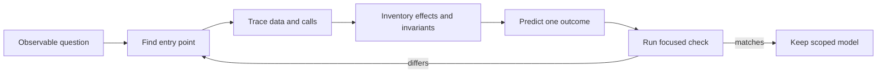

<TLDR>
  <TLDRCell label="what">
    Read unfamiliar code by following one observable behavior from its entry point through data transformations, effects, and enforced invariants.
  </TLDRCell>
  <TLDRCell label="trap">
    Names, comments, and generated summaries can describe a plausible system that the executable paths do not implement.
  </TLDRCell>
  <TLDRCell label="fix">
    Keep an evidence map, label uncertainty, and turn important claims into tiny traces or characterization tests.
  </TLDRCell>
</TLDR>

## What it is and why it exists

Unfamiliar code reading is the work of building a useful, testable model of code you did not write. The model does not need to explain the whole repository. It needs to predict what happens for the behavior you care about, where that behavior begins, what data reaches it, what it changes, and what must remain true.

The word “reading” can be misleading because the activity is not a linear tour from the first file to the last. You search, form a hypothesis, inspect a narrow path, and compare the hypothesis with executable evidence. A failed prediction is progress: it tells you which part of the model is wrong.

This skill matters whenever you fix a defect, review a generated patch, estimate the impact of a change, or answer an incident question. In each case, the useful unit is a behavior such as “submitting a paid order emits one receipt,” not an isolated function. A function can look correct while its caller supplies different data or its dependency hides a second effect.

Four questions organize the first pass:

1. Which entry point can start the behavior?
2. How does relevant data change along the path?
3. Which externally observable or persistent side effects occur?
4. Which invariants do branches, types, tests, or storage constraints actually enforce?

An entry point is an executable boundary: an HTTP route, command handler, scheduled job, event consumer, public library function, UI event, or test. It gives you a concrete place to start and an input you can vary. A filename named `service` or `manager` is not an entry point by itself.

Data flow is the lineage of values that affect the outcome. Track where a value enters, how it is validated or normalized, which names it acquires, and where it crosses a trust or persistence boundary. You rarely need every local variable; follow fields that control branches, identifiers, money, permissions, and writes.

A side effect is a change beyond a function's returned value. Database writes, emitted events, network calls, cache mutations, logs, metrics, file changes, and updates to module-level state all count. Their order and failure behavior are often more important than the returned object.

An invariant is a condition the system is intended to preserve, such as “paid cents are non-negative” or “a cancelled order is never charged again.” Treat prose as a claim until you find enforcement. Validation code, database constraints, type boundaries, and focused tests provide stronger evidence than a confident comment.

Your model should stay scoped. If the task is to explain cancellation, you may need the cancellation route, order state transition, refund adapter, and event publisher. You probably do not need the recommendation engine or every order query. Scope is what makes the model fast enough to build and small enough to falsify.

The result is not a polished architecture diagram. It is a compact set of claims with source locations and observations: “this route is registered here,” “this field becomes integer cents here,” and “this write happens before publication.” That is enough to guide a review or choose the next experiment.

## How it works

Begin with a question that has an observable answer. “Understand checkout” is open-ended; “determine whether a declined payment can still persist an order” identifies a path, two effects, and a failure case. Write the question down so interesting neighboring code does not silently expand the task.

### Establish the repository boundary

Before executing anything, identify the package or service involved and read its local instructions, manifest, and test commands. A monorepo can contain several applications with same-named modules and incompatible configuration. Record the working directory and runtime because both can change which code loads.

Inspect existing dirty files and generated directories as well. A surprising behavior may come from an uncommitted change, compiled output, or a test fixture rather than the source file you first opened. Do not erase or rewrite those artifacts merely to simplify the investigation.

### Find an executable entry point

Search for user-visible words, route strings, event names, command names, or failing-test text before searching for a guessed function name. Exact strings often lead to registration code, which shows the framework boundary and the real handler. Symbol references then reveal wrappers and callers that plain text search can miss.

Configuration is part of control flow. Route tables, dependency containers, plugin manifests, feature flags, and environment-specific composition roots decide which implementation runs. If you start from an implementation and never prove it is wired in, you may explain dead code.

Tests are useful alternate entry points. A focused test tells you how code is constructed and which behavior someone chose to observe. It may bypass production middleware or use a fake dependency, so connect it back to the production entry rather than assuming the paths are identical.

### Follow one call path

At each call, record only what affects the question: the callee, relevant arguments, return or thrown error, and next branch. Stop descending when a dependency's <Term id="api-contract">API contract</Term> is enough for the current claim. Reading a JSON parser's implementation does not help prove that your handler validates an order identifier.

Dynamic dispatch needs one extra step. For an interface, callback, registry, or injected dependency, find the construction site that selects the concrete implementation. “Calls `store.save`” is incomplete if production can bind either a database store or an in-memory store with different effects.

Use a small table while tracing:

| Step | Evidence | Current claim | Confidence |
| --- | --- | --- | --- |
| Route registration | `routes.js` | `POST /orders` calls `submitOrder` | confirmed |
| Dependency binding | `production.js` | `store` writes PostgreSQL | confirmed |
| Retry behavior | comment only | publishing retries three times | unconfirmed |

Confidence labels prevent a plausible inference from quietly becoming a fact. “Confirmed” should point to code or an observation; “inferred” follows from several pieces of evidence; “unconfirmed” is a search target. Remove claims that do not matter to the question.

### Trace data by meaning

For each important value, note its source form, validated form, internal representation, and sink. A price might arrive as text, become a decimal or integer cents, participate in a total, then enter a payment request and database row. A rename from `amount` to `total` does not prove a validation or unit conversion happened.

Mark trust boundaries explicitly. HTTP bodies, queue messages, files, database rows written by older versions, and model-generated structures are inputs even when a static type describes them. Find the runtime check that turns external data into a value the core logic relies on.

Also trace absence. Defaults, optional fields, empty collections, `null`, missing map entries, and caught errors create paths that a happy-path example hides. Follow at least one invalid input and one dependency failure when they could change effects.

### Inventory effects and hidden state

Search the path for storage clients, network adapters, publishers, caches, clocks, random generators, environment reads, and mutable module variables. Constructor injection makes some dependencies visible, but imported singletons and helper modules can hide them. A function described as “calculate” may still update a metric or cache.

Write effects in execution order and include the failure boundary:

1. Validate the request without external effects.
2. Charge the payment provider.
3. Persist the order.
4. Publish `OrderPlaced`.

This sequence immediately raises useful questions. If persistence fails after charging, what compensates? If publishing fails after persistence, is there an outbox or retry? The code, not the ideal architecture, supplies the answers.

### Extract enforced invariants

Look for guards, assertions, exhaustive branches, database constraints, unique indexes, and tests around state transitions. State the invariant as a predicate whenever possible: `totalCents >= 0`, `version` increases by one, or `chargeCount <= 1`. Precise wording makes counterexamples easier to generate.

Separate local checks from end-to-end guarantees. A function can reject negative totals while another caller bypasses it, or a database constraint can protect one write path but not an external charge. Record where the invariant begins and which boundary enforces it.

Conflicting evidence is common. A comment may say cancellation is idempotent while a test expects two audit events for repeated calls. Do not average the sources into a vague story. Run the focused path, inspect recent history if intent matters, and report the conflict.

### Validate the model

Prefer the smallest safe experiment that distinguishes two explanations. Add a temporary trace around a local function, call a pure path from a scratch program, or run one focused test with distinct inputs. Start with read-only investigation; unfamiliar setup scripts and package hooks can have effects of their own.

The evidence loop is short:



A successful check supports only the path and input you ran. Vary a branch-driving value and a failure condition before generalizing. When execution is unsafe or unavailable, syntax trees, reference search, configuration, and existing test evidence can still narrow the model, but label the remaining uncertainty.

Keep source locations with the claims rather than relying on memory. Line numbers can drift, so include the symbol or configuration key as well. When handing the model to another reviewer, distinguish observed behavior from intended behavior and from your inference.

## Examples

The three programs below model an order service without a framework. They show the same reading sequence at increasing depth: identify the executable path, expose data and effects, then lock important behavior into tests. Each output was produced with local Node 24.

### Trace a behavior from its entry point

Suppose a route table identifies `handleOrder` as the entry point, but the names of its helpers do not reveal the execution order. A narrow trace shows which functions run, the value passed between them, and the first persistent effect.

<Depth level="quick">

```js run title="trace_entry.js"
function priceOrder(items, catalog, trace) {
  trace.push("enter priceOrder");
  const totalCents = items.reduce(
    (sum, item) => sum + catalog[item.sku] * item.quantity,
    0,
  );
  trace.push(`totalCents=${totalCents}`);
  return totalCents;
}

function handleOrder(body, dependencies) {
  dependencies.trace.push("enter handleOrder");
  const request = JSON.parse(body);
  const totalCents = priceOrder(
    request.items,
    dependencies.catalog,
    dependencies.trace,
  );
  dependencies.store.save({ id: request.id, totalCents });
  return { status: 201, orderId: request.id };
}

const trace = [];
const dependencies = {
  catalog: { BOOK: 1299 },
  trace,
  store: { save: (order) => trace.push(`save ${JSON.stringify(order)}`) },
};

const response = handleOrder(
  JSON.stringify({ id: "O-17", items: [{ sku: "BOOK", quantity: 2 }] }),
  dependencies,
);
console.log(trace.join("\n"));
console.log(`response=${JSON.stringify(response)}`);
```

```text
enter handleOrder
enter priceOrder
totalCents=2598
save {"id":"O-17","totalCents":2598}
response={"status":201,"orderId":"O-17"}
```

<TryToBreak items={['an unknown SKU', 'an empty items array', 'malformed JSON']} />

</Depth>

The trace confirms a direct path from handler to pricing to storage for this input. It also exposes gaps rather than resolving them: an unknown SKU produces `NaN`, an empty order can be saved for zero cents, and malformed JSON throws before the store call. Those are the next branches to inspect.

The injected store is a test seam, not proof that production uses the same implementation. The construction root still needs to show what binds `dependencies.store`. This example establishes call order and transferred values while keeping that wiring claim open.

### Follow data across a trust boundary

The next program records a value's changing representation. External strings become a trimmed identifier and integer cents before any effect. The dependency log makes the order of charging and publishing observable.

```js run title="follow_order_data.js"
function submitOrder(payload, dependencies) {
  dependencies.steps.push(`input amount=${JSON.stringify(payload.amount)}`);

  const customerId = payload.customerId.trim();
  const totalCents = Math.round(Number(payload.amount) * 100);
  dependencies.steps.push(`normalized customer=${customerId} cents=${totalCents}`);

  if (!customerId || !Number.isSafeInteger(totalCents) || totalCents < 0) {
    return { accepted: false, reason: "invalid order" };
  }

  const chargeId = dependencies.charge(customerId, totalCents);
  dependencies.publish({ type: "OrderPaid", customerId, chargeId });
  return { accepted: true, chargeId, totalCents };
}

const steps = [];
const dependencies = {
  steps,
  charge(customerId, cents) {
    steps.push(`charge customer=${customerId} cents=${cents}`);
    return "CH-9";
  },
  publish(event) {
    steps.push(`publish ${event.type} charge=${event.chargeId}`);
  },
};

const result = submitOrder(
  { customerId: " C-17 ", amount: "12.50" },
  dependencies,
);
console.log(steps.join("\n"));
console.log(`result=${JSON.stringify(result)}`);
```

```text
input amount="12.50"
normalized customer=C-17 cents=1250
charge customer=C-17 cents=1250
publish OrderPaid charge=CH-9
result={"accepted":true,"chargeId":"CH-9","totalCents":1250}
```

The evidence supports a more precise model than “the amount is passed to payment.” The string `"12.50"` crosses the input boundary, `Number` and rounding produce `1250`, the charge returns `"CH-9"`, and that identifier flows into both the event and response. Names alone would not establish those conversions.

The trace also reveals an effect-order invariant for the successful path: publication occurs after the charge returns. It does not show what happens when `charge` throws or `publish` fails. Those failure paths decide whether retrying can create duplicate charges and need separate experiments.

### Turn discoveries into characterization tests

After tracing cancellation, preserve only the behavior needed for the next change. A <Term id="characterization-test">characterization test</Term> records what the current system does, which may differ from what a new specification should require. These checks cover a state transition, an idempotent repeat, and effect counts.

```js run title="characterize_cancellation.js"
import assert from "node:assert/strict";

function cancelOrder(order, dependencies) {
  if (order.status === "cancelled") return order;

  if (order.status === "paid") {
    dependencies.refund(order.paidCents);
  }
  order.status = "cancelled";
  dependencies.emit({ type: "OrderCancelled", orderId: order.id });
  return order;
}

const effects = [];
const dependencies = {
  refund: (cents) => effects.push(`refund:${cents}`),
  emit: (event) => effects.push(`emit:${event.orderId}`),
};
const order = { id: "O-17", status: "paid", paidCents: 1250 };

const first = cancelOrder(order, dependencies);
assert.equal(first.status, "cancelled");
assert.deepEqual(effects, ["refund:1250", "emit:O-17"]);

const second = cancelOrder(order, dependencies);
assert.strictEqual(second, first);
assert.deepEqual(effects, ["refund:1250", "emit:O-17"]);

console.log(`status=${order.status}`);
console.log(`effects=${effects.join(",")}`);
console.log("characterization checks passed");
```

```text
status=cancelled
effects=refund:1250,emit:O-17
characterization checks passed
```

The tests support three claims: a paid order is refunded before its cancellation event, the order object is mutated in place, and repeating cancellation adds no effects. `strictEqual` makes object identity part of the recorded behavior. Remove that assertion if callers do not depend on identity, because unnecessary characterization can freeze an implementation detail.

These are not complete cancellation requirements. There is no test for a pending order, a refund failure, concurrent calls, or an event failure. Add cases according to the change risk, and give a product decision precedence when current behavior is known to be defective.

## Pitfalls

### Reading every file from top to bottom

> [!PITFALL]
> Linear reading spends attention on code unrelated to the behavior and makes it hard to distinguish reachable paths from merely similar helpers. Large utility files can consume hours without proving which application entry point calls them.

**Fix:** write one observable question, find its registration or failing test, and follow references outward only as the question requires. Keep a short “not needed yet” list so you can defer interesting branches without forgetting them.

### Trusting names, comments, or summaries

> [!PITFALL]
> A function named `validateOrder` may normalize only one field, and a comment promising retries may describe code removed months ago. Generated explanations amplify this problem because they connect familiar names into a fluent but invented control flow.

**Fix:** attach each important claim to a call site, branch, configuration binding, test, or observed trace. Label comment-only claims unconfirmed, then search history when the intended design matters.

### Tracing only returned values

> [!PITFALL]
> A returned success object can hide a database write, cache mutation, emitted event, metric, or imported singleton update. Reviewing only the return path misses duplicate effects and partial failure states.

**Fix:** list effectful dependencies and mutable shared state in execution order. Force one dependency to fail in a controlled test and inspect which earlier effects remain and which later effects never occur.

### Treating one happy path as the contract

> [!PITFALL]
> One successful run proves little about missing fields, empty collections, boundary values, exceptions, retries, or repeated calls. A plausible model often collapses several branches into a single clean narrative.

**Fix:** choose inputs from branch conditions, not from convenience. Run at least one valid case, one rejected case, and one dependency failure that matters to the task; add repeated or concurrent calls when idempotency is claimed.

### Turning every observation into a permanent test

> [!PITFALL]
> Characterization tests can accidentally freeze incidental details such as object identity, log wording, helper order, or a known defect. The next safe refactor then fails tests that never represented a supported promise.

**Fix:** state why each assertion protects the planned change. Keep externally visible behavior and important invariants, delete temporary probes, and mark defective current behavior as a decision point rather than an approved contract.

### Executing an unfamiliar repository too early

> [!PITFALL]
> Install hooks, test setup, migrations, and development scripts may write files, start containers, contact services, or consume credentials. “Run the tests to understand it” is not automatically a read-only step.

**Fix:** inspect manifests and scripts first, begin with source search and syntax checks, and use a disposable worktree or isolated environment for execution. Name the command, working directory, expected writes, network access, and cleanup before running it.

## In the AI era

**What generated code gets wrong here**

A model can invent a route-to-handler edge from file names, overlook middleware that rewrites input, or select an in-memory adapter while describing production persistence. It often follows the happy path and claims an invariant such as idempotency without checking retries, unique constraints, or imported state. When asked for a broad explanation, it may also quote stale comments while omitting an effect hidden behind a helper named `notify` or `record`.

**Ask your AI to check**

- Name the exact registration, construction, and call sites for each claimed edge, and label any edge inferred rather than observed.
- Produce a field-lineage table from external input through validation and normalization to every effectful sink.
- List database, network, filesystem, event, cache, log, clock, random, and module-state effects in order, including what remains after each failure.

**Review checklist**

- Confirm the proposed entry point is wired into the active configuration and runtime target.
- Compare the explanation with one valid trace, one rejected input, and one relevant dependency failure.
- Turn only change-relevant invariants into focused tests, then inspect the final effect order and changed-file scope.

**Prompt vocabulary**

Use `entry point`, `call path`, `call site`, `construction root`, `data lineage`, `trust boundary`, `side-effect inventory`, `hidden mutable state`, `invariant`, `failure boundary`, `characterization test`, and `evidence-backed claim`. Ask for source paths, symbols, uncertainty labels, and a counterexample; “explain this repository” invites an untestable tour.

<Depth level="deep">

## A compact evidence model

A useful reading model separates facts about connectivity, values, effects, and constraints. Mixing them into prose makes gaps hard to see. A four-part evidence sheet can remain small even when the repository is large.

### Connectivity evidence

Connectivity says how execution can reach code. Record the entry registration, wrappers or middleware, direct call sites, dynamic dispatch choice, and construction root. A symbol definition proves that code exists; a reference proves a possible relationship; active configuration and an execution trace make the relationship stronger.

Not every edge is a normal function call. Framework decorators, reflection, dependency injection, event subscriptions, generated registries, command tables, and naming conventions can establish control flow. Search for the mechanism's registration data rather than inventing a caller that looks conventional.

Represent each edge as `source -> target [evidence]`. For example, `POST /orders -> auth -> submitOrder [router table]` distinguishes a verified chain from `submitOrder -> retry [comment]`. The notation is deliberately plain so it can live beside review notes.

### Value evidence

Value evidence follows fields, units, and validity states. Record the external name and type, validation predicate, normalized representation, branch use, and final sink. For money, timestamps, identifiers, permissions, and version fields, include the unit or domain because two integers can mean very different things.

A field-lineage table might look like this:

| Stage | Name | Representation | Evidence |
| --- | --- | --- | --- |
| Request | `amount` | decimal text | parsed JSON body |
| Core | `totalCents` | safe integer cents | guard after conversion |
| Payment | `amount` | integer cents | adapter call argument |
| Event | `paidCents` | integer cents | event constructor |

Aliasing matters when objects are mutable. If normalization edits the request object in place, later code and logs may see different data from the original input. Record object identity only when mutation affects the question; otherwise prefer value-level claims.

### Effect evidence

Effect evidence includes target, order, payload, and failure semantics. A call to `repository.save` suggests persistence, but its adapter may buffer, transact, retry, or do nothing in a test. Find the bound implementation before claiming the durable result.

For each effect, ask four questions:

1. What external or shared state can change?
2. What evidence says this concrete adapter runs?
3. Which earlier effects have already completed?
4. What retry, rollback, compensation, or idempotency mechanism exists?

Effect order creates states that source-level summaries often omit. “Charge, save, publish” has different recovery needs from “save, charge, publish.” A transaction can group database operations but cannot automatically roll back an external payment or message already accepted by another system.

Logs and metrics are effects too, but they are usually evidence of an attempted path rather than proof of a durable business outcome. A “saved order” log before commit can survive a rollback. Prefer the store result or postcondition when the distinction matters.

### Constraint evidence

Constraint evidence shows why illegal states should be impossible or rejected. Sources include runtime guards, exhaustive variants, constructors, database checks, unique keys, transactional conditions, and tests. Rank them by the boundary they actually protect, not by how formal they look.

A TypeScript union can guide callers compiled in the same project, yet unvalidated JSON can still create an impossible runtime value. A database unique index can prevent duplicate rows, yet it does not prevent two payment requests made before either insert. State the scope of every guarantee.

Write invariants so they can fail. “Orders are valid” is too broad; “accepted orders have a non-empty customer ID and a safe integer `totalCents >= 0` before `charge`” identifies the predicate, timing, and sink. Then search for a path that reaches the sink without the guard.

### Negative-space evidence

Absence can matter, but search results must be phrased carefully. Not finding a retry after one text search does not prove there is none; the behavior may live in an adapter, framework policy, or infrastructure configuration. Record the search scope and terms, then state “no retry found in this boundary” rather than “the system never retries.”

Deleted tests and recent history can explain why a branch exists, but history is not runtime behavior. Use `git log`, `git blame`, and old diffs to investigate intent after establishing the current path. Do not let an old design document override executable current code.

Dead code creates another negative-space trap. A precise explanation of an unregistered handler can be internally correct and operationally irrelevant. Always connect deep implementation findings back to an active entry point before using them in a change decision.

### Uncertainty and stopping rules

Every investigation has unresolved edges. Mark them as confirmed, inferred, contradicted, or unknown, and say what evidence would change the label. This is more useful than padding the explanation until uncertainty disappears from view.

Stop when the model predicts the behavior relevant to the task, identifies material effects and failure boundaries, and survives focused counterexamples. You do not need to understand unrelated subsystems. Reopen the model when a patch changes wiring, input representation, effect order, or an enforcement point.

For a review handoff, keep five artifacts:

1. The observable question and active runtime target.
2. The entry-to-effect path with source locations.
3. The field lineage for branch-driving or sensitive data.
4. The invariants and focused checks that support them.
5. Unknowns, conflicts, and commands that were unsafe or unavailable.

These artifacts make generated explanations auditable. Another reviewer can challenge one edge or rerun one check without accepting the entire narrative. The model remains a working instrument rather than a substitute for repository evidence.

</Depth>

<Checkpoint id="ai-era/unfamiliar-code-reading" />

## Further reading

- [Git documentation: searching tracked content with `git grep`](https://git-scm.com/docs/git-grep)
- [Git documentation: examining history with `git log`](https://git-scm.com/docs/git-log)
- [Node.js documentation: test runner](https://nodejs.org/docs/latest-v24.x/api/test.html)
- [Visual Studio Code documentation: code navigation](https://code.visualstudio.com/docs/editing/editingevolved)
- [GitHub documentation: navigating code](https://docs.github.com/en/repositories/working-with-files/using-files/navigating-code-on-github)
