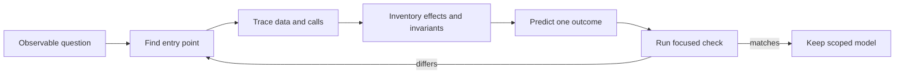

<TLDR>
  <TLDRCell label="what">
    阅读陌生代码时，从一个可观察行为出发，沿着入口追踪数据转换、副作用和真正得到保障的不变量。
  </TLDRCell>
  <TLDRCell label="trap">
    名称、注释和生成式摘要可能描述出一套看似合理、却并未由可执行路径实现的系统。
  </TLDRCell>
  <TLDRCell label="fix">
    维护证据图，标出不确定性，并用小型跟踪程序或特征测试验证重要判断。
  </TLDRCell>
</TLDR>

## 是什么，为什么存在

陌生代码阅读是为并非自己编写的代码建立实用、可验证模型的过程。这个模型不必解释整个代码库，只需预测关注的行为会怎样发生：从哪里开始，哪些数据进入路径，会改变什么，以及哪些条件必须始终成立。

「阅读」一词容易让人误以为要从第一个文件顺序看到最后一个文件。实际过程是搜索、提出假设、检查一条窄路径，再把假设与可执行证据比较。预测失败也是进展，因为它指出了模型中错误的部分。

修复缺陷、审查生成式补丁、估算改动影响或回答事故问题时，都需要这项能力。每种情况下，有用的单位都是「提交已付款订单会发出一张收据」之类的行为，而不是孤立函数。函数本身可能看似正确，但调用方传入了不同数据，或者依赖项隐藏了第二个副作用。

第一轮阅读可以由四个问题组织：

1. 哪个入口可以启动这个行为？
2. 相关数据在路径中怎样变化？
3. 哪些可外部观察或持久化的副作用会发生？
4. 分支、类型、测试或存储约束实际保障了哪些不变量？

入口（entry point）是一个可执行边界，例如 HTTP 路由、命令处理器、定时任务、事件消费者、公开库函数、UI 事件或测试。它提供具体起点，以及一个可以改变的输入。仅仅名为 `service` 或 `manager` 的文件并不是入口。

数据流（data flow）是影响结果的值的传递脉络。需要追踪值从哪里进入，如何校验或规范化，经历了哪些名称，以及在哪里跨越信任或持久化边界。通常不必跟踪所有局部变量，应重点关注控制分支的字段、标识符、金额、权限和写入数据。

副作用（side effect）是函数返回值之外的变化。数据库写入、事件发送、网络调用、缓存修改、日志、指标、文件改动和模块级状态更新都属于副作用。它们的顺序与失败方式往往比返回对象更重要。

不变量（invariant）是系统应该保持的条件，例如「已支付金额不能为负」或「已取消订单不会再次扣款」。在找到强制机制之前，应把文字说明视为待证判断。校验代码、数据库约束、类型边界和聚焦测试，比语气肯定的注释更有说服力。

模型的范围应该保持克制。若任务是解释取消操作，可能需要查看取消路由、订单状态转换、退款适配器和事件发布器；通常不必阅读推荐引擎或每个订单查询。限定范围，才能快速建立模型，并让模型小到可以被证伪。

最终结果不是精致的架构图，而是一组附有源码位置和观察结果的简短判断，例如「这条路由在此注册」「这个字段在此变成整数分」「这次写入先于事件发布」。这些信息已经足够指导审查或选择下一项实验。

## 工作原理

先提出一个能用观察结果回答的问题。「理解结账流程」范围过大；「确定支付被拒后订单是否仍可能持久化」则明确了路径、两个副作用和一种失败情形。把问题写下来，避免附近有趣的代码悄悄扩大任务范围。

### 确定代码库边界

执行任何代码前，先确定涉及的软件包或服务，并阅读局部项目指令、清单文件和测试命令。单体代码库中可能包含多个应用，它们拥有同名模块和互不兼容的配置。记录工作目录与运行时，因为两者都可能改变实际加载的代码。

还要检查已有未提交文件和生成目录。意外行为可能来自未提交修改、编译产物或测试夹具，而不是最先打开的源码。不要为了简化调查而清除或重写这些产物。

### 找到可执行入口

先搜索用户可见文字、路由字符串、事件名称、命令名称或失败测试中的文字，再搜索猜测出来的函数名。精确字符串常会指向注册代码，后者能说明框架边界和真实处理器。随后用符号引用查找普通文本搜索可能漏掉的包装器与调用方。

配置也是控制流的一部分。路由表、依赖容器、插件清单、功能开关和环境专用的组合根（composition root）共同决定实际运行哪个实现。如果从一个实现开始，却从未证明它已接入运行路径，最终解释的可能是死代码。

测试可以作为另一种入口。聚焦测试会显示代码如何构造，以及编写者选择观察什么行为。但测试也可能绕过生产中间件或使用伪造依赖，因此还要把它连接回生产入口，不能假定两条路径完全相同。

### 沿一条调用路径追踪

在每次调用处，只记录与问题有关的信息：被调用方、相关实参、返回值或抛出的错误，以及接下来的分支。当某个依赖的<Term id="api-contract">API 契约（API contract）</Term>已经足以支持当前判断时，就停止向下展开。阅读 JSON 解析器的实现不能帮助证明处理器是否校验订单标识符。

动态分派需要多查一步。遇到接口、回调、注册表或注入依赖时，要找到选择具体实现的构造位置。若生产环境可以把 `store` 绑定到副作用不同的数据库存储或内存存储，仅说「调用 `store.save`」并不完整。

追踪时可以维护一张小表：

| 步骤 | 证据 | 当前判断 | 置信度 |
| --- | --- | --- | --- |
| 路由注册 | `routes.js` | `POST /orders` 调用 `submitOrder` | 已确认 |
| 依赖绑定 | `production.js` | `store` 写入 PostgreSQL | 已确认 |
| 重试行为 | 只有注释 | 发布操作重试三次 | 未确认 |

置信度标签可以防止貌似合理的推断悄悄变成事实。「已确认」应指向代码或观察结果；「推断」由多项证据共同支持；「未确认」则是后续搜索目标。与当前问题无关的判断应直接删除。

### 按语义追踪数据

对于每个重要值，记录它的源形式、校验后形式、内部表示和最终去向。价格可能以文本进入，变成小数或整数分，参与总价计算，再写入支付请求与数据库行。名称从 `amount` 变成 `total`，并不能证明发生了校验或单位转换。

显式标出信任边界。HTTP 请求体、队列消息、文件、旧版本写入的数据库行和模型生成的结构都属于输入，即使静态类型已经描述了它们。找到把外部数据转变为核心逻辑可依赖值的运行时检查。

还要追踪缺失值。默认值、可选字段、空集合、`null`、不存在的映射项和被捕获的错误都会形成正常路径示例看不到的分支。当这些情况可能改变副作用时，至少跟踪一个无效输入和一次依赖失败。

### 盘点副作用与隐藏状态

在路径中搜索存储客户端、网络适配器、发布器、缓存、时钟、随机数生成器、环境变量读取和可变模块变量。构造函数注入会暴露一部分依赖，但导入的单例与辅助模块仍可能隐藏依赖。名为「计算」的函数也可能更新指标或缓存。

按执行顺序写出副作用，并包含失败边界：

1. 校验请求，不产生外部副作用。
2. 调用支付提供方扣款。
3. 持久化订单。
4. 发布 `OrderPlaced`。

这个顺序会立刻引出有用的问题。若扣款后持久化失败，由什么补偿？若持久化后发布失败，是否存在发件箱或重试？答案必须来自代码，而不是理想中的架构。

### 提取真正得到保障的不变量

寻找状态转换附近的守卫、断言、穷尽分支、数据库约束、唯一索引和测试。尽量把不变量写成谓词，例如 `totalCents >= 0`、`version` 每次增加一，或 `chargeCount <= 1`。表达越精确，就越容易构造反例。

要区分局部检查与端到端保证。某个函数可以拒绝负数总价，但另一个调用方可能绕过它；数据库约束可以保护一条写入路径，却保护不了外部扣款。记录不变量从哪里开始，以及由哪个边界执行保障。

证据冲突很常见。注释可能声称取消操作具备幂等性，而测试却期望重复调用产生两条审计事件。不要把这些来源折中成模糊故事。运行聚焦路径；若要判断设计意图，再检查近期历史，并明确报告冲突。

### 验证模型

优先选择能区分两种解释的最小安全实验。可以在局部函数周围加入临时跟踪，从临时程序调用纯逻辑路径，或者用不同输入运行一个聚焦测试。应从只读调查开始，因为陌生的设置脚本和软件包钩子自身也可能产生副作用。

证据循环很短：



一次成功检查只支持实际运行的路径与输入。至少改变一个驱动分支的值和一个失败条件，再作推广。若执行不安全或环境不可用，语法树、引用搜索、配置和已有测试证据仍可缩小模型，但要标出剩余的不确定性。

让判断与源码位置放在一起，不要只靠记忆。行号可能漂移，因此也要记录符号或配置键。把模型交给其他审查者时，要区分观察到的行为、预期行为与自己的推断。

## 示例

下面三个程序用不带框架的代码模拟订单服务。它们逐步展示同一阅读流程：识别可执行路径，暴露数据与副作用，再用测试固定重要行为。所有输出都由本地 Node 24 实际执行得到。

### 从入口追踪一个行为

假设路由表表明 `handleOrder` 是入口，但辅助函数的名称无法显示执行顺序。一次窄范围跟踪可以显示运行了哪些函数、函数之间传递了什么值，以及第一个持久化副作用是什么。

<Depth level="quick">

```js run title="trace_entry.js"
function priceOrder(items, catalog, trace) {
  trace.push("enter priceOrder");
  const totalCents = items.reduce(
    (sum, item) => sum + catalog[item.sku] * item.quantity,
    0,
  );
  trace.push(`totalCents=${totalCents}`);
  return totalCents;
}

function handleOrder(body, dependencies) {
  dependencies.trace.push("enter handleOrder");
  const request = JSON.parse(body);
  const totalCents = priceOrder(
    request.items,
    dependencies.catalog,
    dependencies.trace,
  );
  dependencies.store.save({ id: request.id, totalCents });
  return { status: 201, orderId: request.id };
}

const trace = [];
const dependencies = {
  catalog: { BOOK: 1299 },
  trace,
  store: { save: (order) => trace.push(`save ${JSON.stringify(order)}`) },
};

const response = handleOrder(
  JSON.stringify({ id: "O-17", items: [{ sku: "BOOK", quantity: 2 }] }),
  dependencies,
);
console.log(trace.join("\n"));
console.log(`response=${JSON.stringify(response)}`);
```

```text
enter handleOrder
enter priceOrder
totalCents=2598
save {"id":"O-17","totalCents":2598}
response={"status":201,"orderId":"O-17"}
```

<TryToBreak items={['未知的 SKU', '空的 items 数组', '格式错误的 JSON']} />

</Depth>

跟踪结果确认：对于这项输入，路径从处理器直接进入计价函数，再进入存储。它还暴露了问题，而不是替问题给出答案：未知 SKU 会产生 `NaN`，空订单可以按零金额保存，格式错误的 JSON 则在调用存储前抛出错误。这些就是接下来应检查的分支。

注入的存储只是测试接缝，不能证明生产环境使用同一实现。仍需在组合根中查明什么实现被绑定到 `dependencies.store`。这个示例确定了调用顺序和传递值，同时保留了对接线关系的疑问。

### 跨越信任边界追踪数据

下一个程序记录同一个值不断变化的表示形式。外部字符串先变为去除空白的标识符与整数分，然后才发生副作用。依赖日志让扣款与发布的先后顺序变得可观察。

```js run title="follow_order_data.js"
function submitOrder(payload, dependencies) {
  dependencies.steps.push(`input amount=${JSON.stringify(payload.amount)}`);

  const customerId = payload.customerId.trim();
  const totalCents = Math.round(Number(payload.amount) * 100);
  dependencies.steps.push(`normalized customer=${customerId} cents=${totalCents}`);

  if (!customerId || !Number.isSafeInteger(totalCents) || totalCents < 0) {
    return { accepted: false, reason: "invalid order" };
  }

  const chargeId = dependencies.charge(customerId, totalCents);
  dependencies.publish({ type: "OrderPaid", customerId, chargeId });
  return { accepted: true, chargeId, totalCents };
}

const steps = [];
const dependencies = {
  steps,
  charge(customerId, cents) {
    steps.push(`charge customer=${customerId} cents=${cents}`);
    return "CH-9";
  },
  publish(event) {
    steps.push(`publish ${event.type} charge=${event.chargeId}`);
  },
};

const result = submitOrder(
  { customerId: " C-17 ", amount: "12.50" },
  dependencies,
);
console.log(steps.join("\n"));
console.log(`result=${JSON.stringify(result)}`);
```

```text
input amount="12.50"
normalized customer=C-17 cents=1250
charge customer=C-17 cents=1250
publish OrderPaid charge=CH-9
result={"accepted":true,"chargeId":"CH-9","totalCents":1250}
```

这些证据建立了比「金额被传给支付系统」更精确的模型。字符串 `"12.50"` 跨过输入边界，`Number` 和取整操作生成 `1250`，扣款返回 `"CH-9"`，这个标识符再流入事件与响应。仅凭名称无法确认这些转换。

跟踪结果还揭示了成功路径上的副作用顺序不变量：发布发生在扣款返回之后。它并未显示 `charge` 抛出错误或 `publish` 失败时会怎样。重试是否会产生重复扣款，取决于这些失败路径，需要单独实验。

### 把发现转成特征测试

追踪取消操作后，只保留下一项改动所需的行为。<Term id="characterization-test">特征测试（characterization test）</Term>记录当前系统实际做什么，它可能不同于新规格应该要求的行为。下面的检查覆盖一次状态转换、一次幂等重复调用和副作用次数。

```js run title="characterize_cancellation.js"
import assert from "node:assert/strict";

function cancelOrder(order, dependencies) {
  if (order.status === "cancelled") return order;

  if (order.status === "paid") {
    dependencies.refund(order.paidCents);
  }
  order.status = "cancelled";
  dependencies.emit({ type: "OrderCancelled", orderId: order.id });
  return order;
}

const effects = [];
const dependencies = {
  refund: (cents) => effects.push(`refund:${cents}`),
  emit: (event) => effects.push(`emit:${event.orderId}`),
};
const order = { id: "O-17", status: "paid", paidCents: 1250 };

const first = cancelOrder(order, dependencies);
assert.equal(first.status, "cancelled");
assert.deepEqual(effects, ["refund:1250", "emit:O-17"]);

const second = cancelOrder(order, dependencies);
assert.strictEqual(second, first);
assert.deepEqual(effects, ["refund:1250", "emit:O-17"]);

console.log(`status=${order.status}`);
console.log(`effects=${effects.join(",")}`);
console.log("characterization checks passed");
```

```text
status=cancelled
effects=refund:1250,emit:O-17
characterization checks passed
```

测试支持三项判断：已支付订单先退款再发送取消事件；订单对象会被原地修改；重复取消不会增加副作用。`strictEqual` 把对象标识也纳入记录的行为。如果调用方并不依赖对象标识，就应删除这项断言，因为不必要的特征描述会冻结实现细节。

这些并不是完整的取消需求。测试没有覆盖待处理订单、退款失败、并发调用或事件失败。应根据改动风险补充用例；已知当前行为存在缺陷时，应以产品决策为准。

## 陷阱

### 从头到尾阅读每个文件

> [!PITFALL]
> 线性阅读会把注意力花在与目标行为无关的代码上，也难以区分可达路径与仅仅相似的辅助函数。大型工具文件可能耗费数小时，却仍不能证明哪个应用入口会调用它。

**修复方法：** 写出一个可观察问题，找到对应的注册位置或失败测试，只在问题需要时向外追踪引用。维护一份简短的「暂不需要」清单，推迟有趣分支时不会遗忘它们。

### 相信名称、注释或摘要

> [!PITFALL]
> 名为 `validateOrder` 的函数可能只规范化一个字段，承诺重试的注释也可能描述几个月前删除的代码。生成式解释会放大这个问题，因为它会把熟悉的名称连成流畅、却是虚构的控制流。

**修复方法：** 让每项重要判断都对应一个调用点、分支、配置绑定、测试或实际跟踪结果。只有注释支持的判断标为未确认；需要了解设计意图时，再搜索版本历史。

### 只追踪返回值

> [!PITFALL]
> 成功返回对象可能隐藏数据库写入、缓存修改、事件发送、指标或导入单例的更新。只审查返回路径，会漏掉重复副作用和局部失败状态。

**修复方法：** 按执行顺序列出会产生副作用的依赖和可变共享状态。在受控测试中让一个依赖失败，再检查哪些较早副作用仍然存在，以及哪些后续副作用没有发生。

### 把一条正常路径当成契约

> [!PITFALL]
> 一次成功运行几乎不能说明缺失字段、空集合、边界值、异常、重试或重复调用的行为。把多个分支压成一段整洁叙述会掩盖这些差异。

**修复方法：** 根据分支条件而不是方便程度选择输入。至少运行一个有效用例、一个拒绝用例和一次与任务相关的依赖失败；若声称具备幂等性，还要增加重复或并发调用。

### 把每个观察结果都变成永久测试

> [!PITFALL]
> 特征测试可能意外冻结对象标识、日志文字、辅助函数顺序或已知缺陷等偶然细节。下一次安全重构反而会被从未代表受支持承诺的测试阻止。

**修复方法：** 说明每项断言为什么能保护计划中的改动。保留外部可见行为和重要不变量，删除临时探针，并把有缺陷的当前行为标为待决事项，而不是已批准契约。

### 过早执行陌生代码库

> [!PITFALL]
> 安装钩子、测试设置、迁移和开发脚本可能写文件、启动容器、联系服务或使用凭据。「运行测试来理解代码」并不天然属于只读操作。

**修复方法：** 先检查清单与脚本，从源码搜索和语法检查开始，并在可丢弃工作树或隔离环境中执行。运行前明确命令、工作目录、预期写入、网络访问和清理方式。

<Depth level="deep">

## 紧凑的证据模型

实用的阅读模型应把连通关系、值、副作用和约束方面的事实分开。将它们混入连续叙述会让缺口难以发现。即使代码库很大，一张由四部分组成的证据表仍然可以很小。

### 连通关系证据

连通关系说明执行怎样到达代码。记录入口注册、包装器或中间件、直接调用点、动态分派选择和组合根。符号定义只证明代码存在；引用证明可能存在关系；当前配置与执行跟踪则能进一步加强这条关系。

并非每条边都是普通函数调用。框架装饰器、反射、依赖注入、事件订阅、生成式注册表、命令表和命名约定都可能建立控制流。应搜索对应机制的注册数据，而不是虚构一个看起来常规的调用方。

可以把每条边写成 `source -> target [evidence]`。例如，`POST /orders -> auth -> submitOrder [router table]` 能把已确认的调用链与 `submitOrder -> retry [comment]` 区分开。这种写法刻意保持简单，便于直接放入审查笔记。

### 值证据

值证据跟踪字段、单位和有效状态。记录外部名称与类型、校验谓词、规范化表示、分支用途和最终去向。对于金额、时间戳、标识符、权限和版本字段，要写出单位或值域，因为两个整数的含义可能完全不同。

字段传递表可以写成下面这样：

| 阶段 | 名称 | 表示 | 证据 |
| --- | --- | --- | --- |
| 请求 | `amount` | 小数文本 | 解析后的 JSON 请求体 |
| 核心逻辑 | `totalCents` | 安全整数分 | 转换后的守卫 |
| 支付 | `amount` | 整数分 | 适配器调用实参 |
| 事件 | `paidCents` | 整数分 | 事件构造器 |

对象可变时，别名关系也很重要。如果规范化操作原地修改请求对象，后续代码与日志看到的数据就可能不同于原始输入。只有对象标识会影响当前问题时才记录它；其他情况优先描述值层面的判断。

### 副作用证据

副作用证据包括目标、顺序、载荷和失败语义。调用 `repository.save` 暗示发生持久化，但对应适配器可能缓冲、使用事务、重试，甚至在测试中什么也不做。找到实际绑定的实现，才能断言结果已经持久化。

对于每个副作用，提出四个问题：

1. 哪些外部状态或共享状态可能变化？
2. 什么证据表明这个具体适配器会运行？
3. 哪些更早的副作用已经完成？
4. 存在哪种重试、回滚、补偿或幂等机制？

副作用顺序会形成源码摘要经常遗漏的状态。「扣款、保存、发布」与「保存、扣款、发布」需要不同的恢复方式。事务可以组合数据库操作，却不能自动回滚已被另一个系统接受的外部支付或消息。

日志与指标也是副作用，但它们通常只能证明路径被尝试，不能证明业务结果已经持久化。提交前打印的「订单已保存」日志可能在回滚后仍然存在。当这种差异重要时，应以存储结果或后置条件为准。

### 约束证据

约束证据说明非法状态为什么无法形成或会被拒绝。来源包括运行时守卫、穷尽变体、构造器、数据库检查、唯一键、事务条件和测试。应按各项机制实际保护的边界评估强弱，而不是看形式有多正式。

TypeScript 联合类型可以约束同一项目中经过编译的调用方，但未经校验的 JSON 仍可能在运行时产生不可能值。数据库唯一索引可以阻止重复行，却无法阻止两次都发生在插入之前的支付请求。每项保证都要说明适用范围。

不变量必须写成可能失败的形式。「订单有效」范围太宽；「被接受的订单在调用 `charge` 前拥有非空客户标识符，以及满足 `totalCents >= 0` 的安全整数」则明确了谓词、时机和去向。接下来便可搜索是否存在绕过守卫到达该去向的路径。

### 缺失信息也是证据

缺失可能很重要，但表述搜索结果时必须谨慎。一次文本搜索没有找到重试，不等于重试不存在；相关行为可能位于适配器、框架策略或基础设施配置中。应记录搜索范围与关键词，再写「此边界内未找到重试」，而不是「系统从不重试」。

已删除的测试和近期历史可以解释某个分支为何存在，但历史不是运行时行为。确定当前路径后，再使用 `git log`、`git blame` 和旧差异调查意图。不要让旧设计文档覆盖当前可执行代码。

死代码还会造成另一种缺失信息陷阱。对未注册处理器的精确解释可以在内部完全正确，却与实际运行无关。把深入实现结论用于改动决策前，始终要把它重新连到活动入口。

### 不确定性与停止规则

每次调查都会留下尚未确定的边。把它们标成已确认、推断、冲突或未知，并说明什么证据可以改变标签。这比不断扩充解释、直到不确定性消失在视野中更有用。

当模型能预测任务相关行为，识别重要副作用与失败边界，并经受聚焦反例检验时，就可以停止。无须理解无关子系统。若补丁改变了接线关系、输入表示、副作用顺序或强制位置，则应重新打开模型。

审查交接时保留五项材料：

1. 可观察问题与当前运行时目标。
2. 从入口到副作用的路径及源码位置。
3. 驱动分支或敏感数据的字段传递脉络。
4. 不变量及支持它们的聚焦检查。
5. 未知项、冲突项，以及不安全或不可用的命令。

这些材料让生成式解释可审计。另一位审查者可以质疑其中一条边，或重新运行一项检查，而不必接受整套叙述。模型始终是工作工具，不能替代代码库证据。

</Depth>

<Checkpoint id="ai-era/unfamiliar-code-reading" />

## 延伸阅读

- [Git 文档：使用 `git grep` 搜索已跟踪内容](https://git-scm.com/docs/git-grep)
- [Git 文档：使用 `git log` 检查历史](https://git-scm.com/docs/git-log)
- [Node.js 文档：测试运行器](https://nodejs.org/docs/latest-v24.x/api/test.html)
- [Visual Studio Code 文档：代码导航](https://code.visualstudio.com/docs/editing/editingevolved)
- [GitHub 文档：浏览代码](https://docs.github.com/en/repositories/working-with-files/using-files/navigating-code-on-github)
