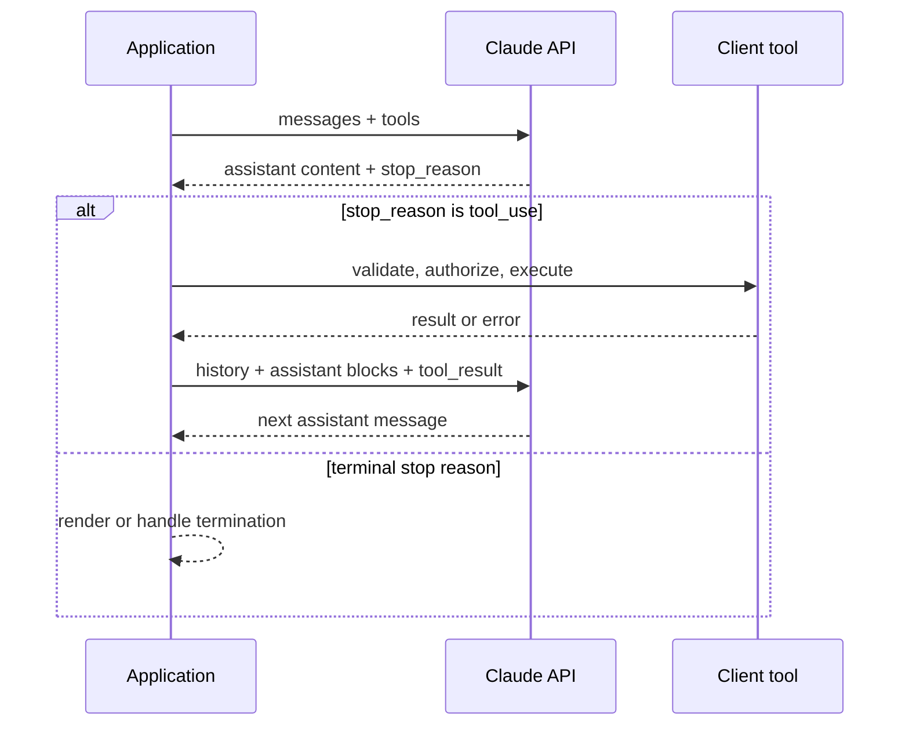

<TLDR>
  <TLDRCell label="what">
    The Claude API is a stateless HTTP interface. The Messages API accepts a complete conversation and returns the next assistant message as content blocks.
  </TLDRCell>
  <TLDRCell label="when">
    Use it when your application needs direct control of model requests, streaming output, or tool loops without handing control flow to a higher-level framework.
  </TLDRCell>
  <TLDRCell label="how">
    Handle every content-block type and stop reason, preserve conversation history unchanged, and separate transport retries from side-effecting tool execution.
  </TLDRCell>
</TLDR>

## What it is and why it exists

The Claude API is the programming interface to Anthropic-hosted models. Its core entry point is `POST /v1/messages`: your application sends a model, an output limit, system instructions, and message history, and the service returns the next assistant message. Official SDKs expose the same protocol through entry points such as Python's `Anthropic().messages.create(...)`.

The Messages API is stateless. The service doesn't retain a chat session for your application; every request includes the history needed for that inference. This design leaves persistence, truncation, tenant isolation, and auditing under explicit application control instead of hiding them in a server session.

A response isn't just a string. `content` is an ordered array of <Term id="content-block">content blocks</Term> that can contain text, tool calls, or blocks produced by other enabled capabilities, while the top-level <Term id="stop-reason">stop reason</Term> explains why the turn ended. Code that reads only `content[0].text` can't safely handle this union type.

The Claude API fits applications that need control over the provider boundary, including support classification, document processing, streaming chat, and tool-enabled workflows. Prompt design, structured output, and function calling have their own topics; this page stays focused on the Messages protocol and the application code that makes it reliable.

Before using it, create a key in the Claude Console and inject it through a secret-management mechanism such as `ANTHROPIC_API_KEY`. The key belongs only on a trusted server. Never put it in a browser bundle, mobile client, log, exception body, or example repository.

## How it works

A basic request contains `model`, `max_tokens`, and `messages`. Direct HTTP calls must also send `x-api-key`, `content-type: application/json`, and `anthropic-version`; official SDKs manage those headers. The API version and model version are separate dimensions: one fixes protocol behavior, while the other selects the model that serves the request.

Each input message has a `role` and `content`. Simple text can be a string, while mixed text, images, or tool results use an array of content blocks. Initial system instructions normally belong in the top-level `system` field; don't copy another provider's message-role format from an old tutorial into the Claude API.

The response role is `assistant`, but the concrete blocks in `content` depend on the model's decision and the requested capabilities. Dispatch each block by `type`, then use `stop_reason` to continue, expose truncation, run a client tool, or report a refusal. New block and event types can appear, so a default branch should safely ignore, record, or explicitly reject an unknown value instead of crashing.

| `stop_reason` | Application action |
|---|---|
| `end_turn` | Accept a normal end to the turn |
| `max_tokens` | Mark the output truncated; don't submit it directly |
| `stop_sequence` | Record the custom boundary that matched |
| `tool_use` | Execute client tools and return their results |
| `refusal` | Preserve the refusal instead of showing an empty answer |
| `pause_turn` | Continue the paused turn under the server-tool protocol |

The following flow shows the complete round trip for a client <Term id="tool-use">tool use</Term>. The model emits a structured call, but your application runs the tool. The model doesn't execute a database query, payment, or file change on the application's behalf.



When the model requests a client tool, the response contains one or more `tool_use` blocks and has a `stop_reason` of `tool_use`. The application validates each name and input, runs an allowed tool, and sends matching `tool_result` blocks under the user role. Each result pairs with its call through `tool_use_id`, and the original assistant content must stay intact in the history.

With `stream: true`, the same message arrives incrementally through <Term id="server-sent-events">Server-Sent Events (SSE)</Term>. A stream starts with `message_start`; each content block has a start, zero or more delta events, and a stop; top-level changes arrive in `message_delta`; and `message_stop` ends the stream. `ping` events can appear between them, and the service can emit an `error` event after the HTTP response has already returned 200.

## Examples

Every example below runs locally without sending a request to Anthropic or pretending that a fixture is live model output. They use request and response fixtures that match the verified documentation to test protocol code owned by the application. An integration test should still call the real service with a separate test key.

<Depth level="quick">

### Build a basic request

This first example creates a real HTTP request object with the Python standard library but stops before sending it. That lets you inspect the URL, method, API version, and JSON shape without placing credentials or nondeterministic output in the tutorial.

```python run title="request_contract.py"
import json
from urllib.request import Request


def build_message_request(api_key: str, prompt: str) -> Request:
    payload = {
        "model": "claude-sonnet-5",
        "max_tokens": 120,
        "system": "Return one concise support category.",
        "messages": [{"role": "user", "content": prompt}],
    }
    return Request(
        "https://api.anthropic.com/v1/messages",
        data=json.dumps(payload).encode("utf-8"),
        method="POST",
        headers={
            "content-type": "application/json",
            "x-api-key": api_key,
            "anthropic-version": "2023-06-01",
        },
    )


request = build_message_request("test-key", "Classify: payment failed")
body = json.loads(request.data.decode("utf-8"))
print(request.method, request.full_url)
print("API version:", request.get_header("Anthropic-version"))
print("Model:", body["model"])
print("First turn:", body["messages"][0])
```

```text
POST https://api.anthropic.com/v1/messages
API version: 2023-06-01
Model: claude-sonnet-5
First turn: {'role': 'user', 'content': 'Classify: payment failed'}
```

Production code should read the real key from secret storage and prefer an official SDK for types, connection reuse, timeouts, and error mapping. Don't log `request.headers`, because they contain `x-api-key`. Keep the model ID in central configuration and verify upgrades with contract tests instead of scattering it through business functions.

</Depth>

### Parse content blocks by type

The second example deliberately puts a text block before a tool call. The parser collects every text block and extracts tool calls separately; it doesn't assume the first block always has a `text` property.

```python run title="content_blocks.py"
def text_blocks(message: dict) -> list[str]:
    return [
        block["text"]
        for block in message["content"]
        if block.get("type") == "text"
    ]


message = {
    "id": "msg_demo",
    "type": "message",
    "role": "assistant",
    "model": "claude-sonnet-5",
    "content": [
        {"type": "text", "text": "I will check that invoice."},
        {
            "type": "tool_use",
            "id": "toolu_demo",
            "name": "get_invoice",
            "input": {"invoice_id": "INV-204"},
        },
    ],
    "stop_reason": "tool_use",
    "stop_sequence": None,
    "usage": {"input_tokens": 41, "output_tokens": 27},
}

calls = [block for block in message["content"] if block["type"] == "tool_use"]
print("Text:", "".join(text_blocks(message)))
print("Stop reason:", message["stop_reason"])
print("Tool:", calls[0]["name"], calls[0]["input"])
```

```text
Text: I will check that invoice.
Stop reason: tool_use
Tool: get_invoice {'invoice_id': 'INV-204'}
```

The token counts in this example are part of a local protocol fixture, not measurements from a live call. Production code should record actual usage from the response and retain the top-level <Term id="request-id">request ID</Term> for diagnostics. Never use the example numbers for capacity or cost estimates.

`end_turn` means the turn ended normally, `max_tokens` means it reached the output limit, and `stop_sequence` means it matched a custom stopping sequence. `tool_use` asks the application to continue the client-tool loop. Other stop reasons also need explicit branches and must not all become complete answers.

### Return client-tool results

A tool result isn't a fresh, independent question. Append the entire assistant `content` array to history, then append a user-role array of `tool_result` blocks, and finally send the next request with the same tool definitions. The following fixture demonstrates the first two steps.

```python run title="tool_result_turn.py"
import json

def get_invoice(invoice_id: str) -> dict:
    records = {"INV-204": {"status": "overdue", "amount": 85}}
    return records.get(invoice_id, {"status": "not_found"})

TOOLS = {"get_invoice": get_invoice}

def make_tool_result_turn(response: dict) -> dict:
    results = []
    for block in response["content"]:
        if block["type"] != "tool_use":
            continue
        handler = TOOLS.get(block["name"])
        output = handler(**block["input"]) if handler else {"error": "unknown tool"}
        result = {
            "type": "tool_result",
            "tool_use_id": block["id"],
            "content": json.dumps(output, sort_keys=True),
        }
        if handler is None:
            result["is_error"] = True
        results.append(result)
    return {"role": "user", "content": results}


response = {
    "role": "assistant",
    "content": [
        {"type": "text", "text": "I will check the invoice."},
        {"type": "tool_use", "id": "toolu_42", "name": "get_invoice",
         "input": {"invoice_id": "INV-204"}},
    ],
    "stop_reason": "tool_use",
}
messages = [{"role": "user", "content": "Is invoice INV-204 overdue?"}]
messages.append({"role": "assistant", "content": response["content"]})
messages.append(make_tool_result_turn(response))
print("Roles:", [turn["role"] for turn in messages])
print("Result:", messages[-1]["content"][0]["content"])
```

```text
Roles: ['user', 'assistant', 'user']
Result: {"amount": 85, "status": "overdue"}
```

`TOOLS` is an allowlist, not a dynamic importer. A real handler must also validate arguments, the current principal's authority, and resource ownership. JSON Schema or `strict: true` can constrain argument shape, but neither proves that the caller may read a particular invoice.

A response can contain several `tool_use` blocks. Collect every call and return one result for each ID. If a tool name is unknown or execution fails, return its matching result with `is_error: true` instead of breaking the conversation history. Parallel execution is safe only when the tools are independent; simultaneous model output doesn't establish that condition.

### Accumulate streaming text

Official SDK streaming helpers accumulate the message for you. When consuming SSE directly, your application needs a state machine. This minimal example handles text deltas, the top-level stop reason, `ping`, unknown events, in-stream errors, and the required final `message_stop`.

```python run title="stream_events.py"
def collect_text(events: list[dict]) -> tuple[str, str | None]:
    pieces = []
    stop_reason = None
    finished = False
    for event in events:
        event_type = event["type"]
        if event_type == "content_block_delta":
            delta = event["delta"]
            if delta["type"] == "text_delta":
                pieces.append(delta["text"])
        elif event_type == "message_delta":
            stop_reason = event["delta"].get("stop_reason")
        elif event_type == "message_stop":
            finished = True
        elif event_type == "error":
            raise RuntimeError(event["error"]["type"])
        # Ping and future event types do not terminate the stream.
    if not finished:
        raise RuntimeError("stream ended before message_stop")
    return "".join(pieces), stop_reason


events = [
    {"type": "message_start", "message": {"content": []}},
    {"type": "ping"},
    {"type": "content_block_start", "index": 0,
     "content_block": {"type": "text", "text": ""}},
    {"type": "content_block_delta", "index": 0,
     "delta": {"type": "text_delta", "text": "Payment "}},
    {"type": "future_event", "data": {}},
    {"type": "content_block_delta", "index": 0,
     "delta": {"type": "text_delta", "text": "issue"}},
    {"type": "content_block_stop", "index": 0},
    {"type": "message_delta", "delta": {"stop_reason": "end_turn"},
     "usage": {"output_tokens": 12}},
    {"type": "message_stop"},
]
text, reason = collect_text(events)
print("Text:", text)
print("Stop reason:", reason)
```

```text
Text: Payment issue
Stop reason: end_turn
```

This simplified collector renders only text. Tool-input JSON deltas and other content blocks need their own accumulation logic. Even after the UI displays partial characters, keep the message in a generating state until `message_stop`; on an `error` or connection loss, mark partial text incomplete instead of treating it as a committable final answer.

## Pitfalls

### Treating the response as one string

> [!PITFALL]
> Generated code often reads `response.content[0].text` directly. It fails or silently drops content when the first block is a tool call, the response has several text blocks, or an enabled feature introduces another block type.

**Fix:** Iterate over the entire `content` array by `type`, build explicit handlers for supported blocks, and record safe diagnostics for unknown blocks. Besides rendering text, branch on `stop_reason` to decide whether the message is complete and what happens next.

### Losing stateless conversation history

> [!PITFALL]
> Sending only the latest user text removes earlier context. In a tool loop, sending only `tool_result` also drops the assistant `tool_use` block that the result must match.

**Fix:** Keep normalized history as application state. To continue a tool loop, append the assistant content unchanged before the user message containing results. Preserve call-result pairs when trimming history, and verify the behavior with multi-turn contract tests.

### Mistaking model selection for authorization

> [!PITFALL]
> `tool_use.input` remains untrusted even when it passes JSON Schema. A model choosing `refund_order` and producing a valid order ID doesn't prove the current user may issue the refund.

**Fix:** Re-authenticate the principal, authorize the resource and action, constrain amounts and paths, and add human approval for consequential operations at the tool boundary. Resolve handlers from a fixed allowlist; never turn a model-supplied name into an import path or shell command.

### Wrapping side effects in transport retries

> [!PITFALL]
> An SDK or proxy can retry timeouts, rate limits, and server errors. If the same loop also repeats a payment, email, or file deletion, network uncertainty can become a duplicated side effect.

**Fix:** Model requests and tool execution should be separate state transitions. Give side-effecting tools a durable <Term id="idempotency-key">idempotency key</Term> and result record. After a timeout, query the existing outcome before deciding whether to retry.

### Treating stream completion as a string sentinel

> [!PITFALL]
> Old examples may wait for `data: [DONE]` or concatenate only `text_delta`. Current Messages SSE ends with `message_stop` and may interleave `ping`, unknown events, or an in-stream `error`.

**Fix:** Use an official SDK's streaming helper or maintain a state machine keyed by event type. Tolerate new event types, validate content-block indexes, and treat both connection loss and explicit errors as incomplete messages.

### Confusing the API version with the model ID

> [!PITFALL]
> Updating `anthropic-version` doesn't upgrade the model, and copying an old model ID doesn't select a newer protocol. Scattering both values through business code turns migration into an unauditable search-and-replace operation.

**Fix:** Pin and centrally manage the protocol version and model ID separately, with a reason for each upgrade. Before changing models, rerun tests for response blocks, stop reasons, tool loops, and token budgets. Don't assume a newer model in the same family keeps sampling parameters or output habits unchanged.

## In the AI era

**What generated code gets wrong here:** Models reuse old tutorials containing `client.completions.create(...)`, retired model IDs, or message-role formats from another provider. Even when the request succeeds, generated code often treats `content` as plain text, handles only one tool call, omits the assistant tool block, or extends SDK transport retries to business side effects such as refunds. For Claude Sonnet 5 specifically, it can also copy non-default `temperature`, `top_p`, or `top_k` values, which the current model rejects with a 400 response.

**Ask your AI to check:**

1. “List every `content` block and `stop_reason` this code can receive, and identify each branch without an explicit handler.”
2. “Trace the initial user message through `tool_use`, authorization, execution, `tool_result`, and the next request; verify IDs and history are intact.”
3. “Draw model HTTP retries and side-effecting tool retries separately, and locate the idempotency key and durable outcome at each boundary.”

**Review checklist:**

- Model IDs, the API version, and SDK entry points come from current configuration and official documentation, with no legacy Completions call.
- Tests cover content blocks, stop reasons, in-stream errors, and multiple tool calls; unknown variants can't be mistaken for text.
- Keys never enter clients or logs, and tools repeat authentication, authorization, input validation, and idempotency controls.

**Prompt vocabulary:** Use “Messages API,” “content block,” “stop reason,” “client tool,” “tool result,” “Server-Sent Events,” “transport retry,” and “idempotency key.” These terms direct generation toward protocol boundaries instead of vaguely asking to “integrate Claude.”

<Depth level="deep">

## Versions, models, and compatibility

`anthropic-version: 2023-06-01` is the Messages API protocol version in the current documentation, and official SDKs send it by default. The versioning policy preserves existing input and output parameters but allows optional inputs, content blocks, stop reasons, and streaming events to be added. Clients should therefore validate known types strictly while retaining a forward-compatible branch for unknown enum values.

Model IDs have a separate lifecycle. This page verified `claude-sonnet-5` in September 2026, but a production system shouldn't learn about retirement from tutorial prose. Select the model through controlled configuration and query the current model directory or provider documentation before deployment. Don't switch an untested alias in a hot path or use a model name to parse the response shape.

`max_tokens` is an output ceiling, not a promised length. If the stop reason is `max_tokens`, text or tool input may be incomplete, so the application must not submit it directly; expand the budget, shorten input, or make a new request according to the task. Actual token counts come from response `usage`, and usage in streaming `message_delta` events is cumulative, so don't add every delta together.

## Reliability boundaries

HTTP status and stream events form two failure surfaces. Authentication and request-shape errors generally shouldn't be retried. Connection failures, some timeouts, rate limits, and server errors can justify bounded backoff while still honoring provider limits. Official SDKs already retry a documented set of transient failures by default, so an unbounded outer retry loop only multiplies traffic and latency.

| Status | Meaning and default handling |
|---|---|
| `400` | Invalid request; fix parameters rather than retrying it |
| `401` | Authentication failed; check the key source |
| `403` | Permission denied; check workspace access and authorization |
| `404` | Resource missing; check the URL or model ID |
| `413` | Request too large; reduce the body |
| `429` | Rate limited; use bounded backoff |
| `500` | Internal service error; a limited retry can be appropriate |
| `529` | Service overloaded; back off and protect downstream capacity |

Every response has a request ID for support diagnostics, and the official Python and TypeScript SDKs expose it on top-level response objects. Log the request ID, model, latency, stop reason, and token usage, but not the API key, complete sensitive prompts, or raw tool results. Structured and redacted diagnostics are safer than capturing the entire request object.

A streaming request can fail after HTTP 200, so receiving headers doesn't mean generation completed. Mark a message complete only after `message_stop` and after handling the final stop reason. A reconnect can't safely resume the same generation from an arbitrary character offset. If you issue a full new request, record its output as a new attempt instead of joining two generations into one answer.

Tool execution is another transaction boundary. Persist the tool-call ID, business idempotency key, and execution state before calling an external system. On process recovery, continue from that record instead of asking the model to decide whether execution already happened. For irreversible operations, authorization and human approval belong inside or immediately around the tool, not only in a system prompt.

</Depth>

<Checkpoint id="ai/claude-api" />

## Further reading

- [Claude API reference: Create a Message](https://platform.claude.com/docs/en/api/messages/create)
- [Claude Platform docs: API versioning](https://platform.claude.com/docs/en/api/versioning)
- [Claude Platform docs: Streaming messages](https://platform.claude.com/docs/en/build-with-claude/streaming)
- [Claude Platform docs: How tool use works](https://platform.claude.com/docs/en/agents-and-tools/tool-use/how-tool-use-works)
- [Claude Platform docs: API errors](https://platform.claude.com/docs/en/api/errors)
- [Claude Platform docs: What is new in Claude Sonnet 5](https://platform.claude.com/docs/en/models/sonnet-5/whats-new-sonnet-5)
