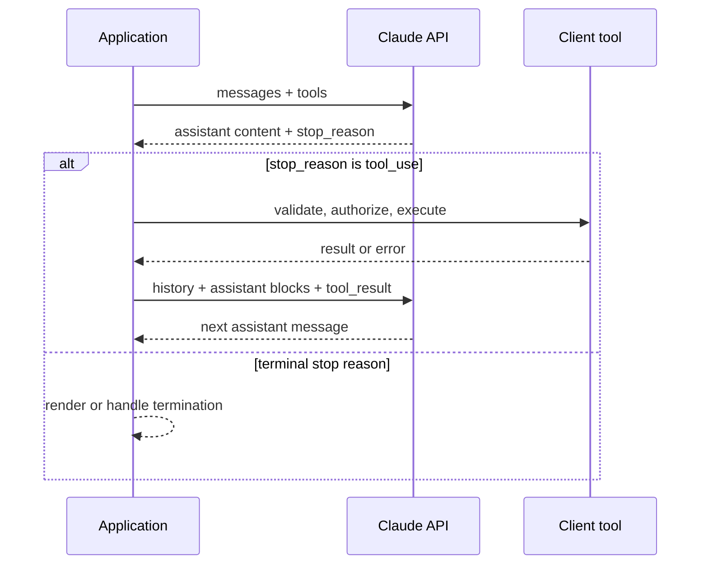

<TLDR>
  <TLDRCell label="what">
    Claude API 是无状态的 HTTP 接口；Messages API 接收完整对话，返回由多个内容块组成的下一条助手消息。
  </TLDRCell>
  <TLDRCell label="when">
    应用需要直接控制模型请求、流式输出或工具循环，而不想把控制流交给更高层框架时，使用它。
  </TLDRCell>
  <TLDRCell label="how">
    明确处理每种内容块与停止原因，原样保留对话历史，并把传输重试和有副作用的工具执行分开。
  </TLDRCell>
</TLDR>

## 是什么，为什么存在

Claude API 是 Anthropic 托管模型的编程接口。它的核心入口是 `POST /v1/messages`：应用发送模型、输出上限、系统指令和消息历史，服务返回下一条助手消息。官方 SDK 把同一协议封装为 Python 的 `Anthropic().messages.create(...)` 等入口。

Messages API 本身无状态。服务不会替应用保存聊天会话；每次请求都要带上本轮推理所需的历史。这个设计让应用明确掌握持久化、删减、租户隔离和审计，而不是依赖一个隐藏的服务器会话。

响应也不等于一个字符串。`content` 是有序的 <Term id="content-block">内容块（content block）</Term>数组，其中可能同时出现文本、工具调用或其他已启用能力产生的块；顶层 <Term id="stop-reason">停止原因（stop reason）</Term>说明本轮为什么结束。只读取 `content[0].text` 的代码无法可靠处理这种联合类型。

Claude API 适合需要直接控制供应商边界的应用，例如客服分类、文档处理、流式聊天和带工具的工作流。提示词写法、结构化输出和通用函数调用分别有独立主题；这里聚焦 Messages 协议以及围绕它编写可靠应用代码的方法。

使用前需要在 Claude Console 创建密钥，并通过 `ANTHROPIC_API_KEY` 等秘密管理机制注入进程。密钥只属于服务端；不要把它放入浏览器包、移动客户端、日志、异常正文或示例仓库。

## 工作原理

一个基础请求包含 `model`、`max_tokens` 和 `messages`。直接调用 HTTP 接口时还必须发送 `x-api-key`、`content-type: application/json` 与 `anthropic-version`；官方 SDK 会处理这些请求头。API 版本和模型版本是两个不同维度：前者固定协议行为，后者选择实际模型。

每个输入消息都有 `role` 与 `content`。简单文本可以直接写成字符串，需要混合文本、图像或工具结果时则使用内容块数组。初始系统指令通常放在顶层 `system` 字段中，不要把旧教程里的其他供应商消息格式直接套到 Claude API 上。

响应的 `role` 是 `assistant`，但 `content` 的具体块类型取决于模型决定和请求能力。程序应按 `type` 分派每个块，再根据 `stop_reason` 决定继续、展示截断状态、执行客户端工具或报告拒绝。未来可能增加新的块类型和事件类型，因此默认分支应该安全忽略、记录或显式拒绝，而不是崩溃。

| `stop_reason` | 应用动作 |
|---|---|
| `end_turn` | 接受本轮正常结束 |
| `max_tokens` | 标记输出被截断，不直接提交 |
| `stop_sequence` | 记录命中的自定义边界 |
| `tool_use` | 执行并回传客户端工具结果 |
| `refusal` | 保留拒绝状态，不伪装成空答案 |
| `pause_turn` | 按服务端工具协议继续暂停的轮次 |

下面的流程图展示客户端 <Term id="tool-use">工具使用（tool use）</Term>的完整往返。模型只生成结构化调用；工具代码运行在你的应用中，模型不会代替应用执行数据库查询、付款或文件修改。



当模型请求客户端工具时，响应包含一个或多个 `tool_use` 块，且 `stop_reason` 为 `tool_use`。应用逐个验证名称和输入、执行允许的工具，再以用户角色发送对应的 `tool_result` 块。每个结果通过 `tool_use_id` 与原调用配对；原助手内容必须完整保留在历史中。

设置 `stream: true` 后，同一消息通过 <Term id="server-sent-events">服务器发送事件（Server-Sent Events，SSE）</Term>逐步到达。事件序列从 `message_start` 开始，每个内容块经历开始、若干增量与结束事件，顶层变化通过 `message_delta` 给出，最后以 `message_stop` 结束。`ping` 可以穿插出现，服务也可能在已经返回 HTTP 200 后发送 `error` 事件。

## 示例

以下示例都在本地运行，不会向 Anthropic 发送请求，也不会伪装成真实模型输出。它们使用符合已验证文档的请求或响应夹具，专门测试应用拥有的协议代码；接入测试仍需使用独立测试密钥调用真实服务。

<Depth level="quick">

### 构造基础请求

第一个示例用 Python 标准库构造真实 HTTP 请求对象，但在发送前停止。这样可以检查 URL、方法、API 版本和 JSON 形状，同时避免把凭据或非确定性响应写进教程输出。

```python run title="request_contract.py"
import json
from urllib.request import Request


def build_message_request(api_key: str, prompt: str) -> Request:
    payload = {
        "model": "claude-sonnet-5",
        "max_tokens": 120,
        "system": "Return one concise support category.",
        "messages": [{"role": "user", "content": prompt}],
    }
    return Request(
        "https://api.anthropic.com/v1/messages",
        data=json.dumps(payload).encode("utf-8"),
        method="POST",
        headers={
            "content-type": "application/json",
            "x-api-key": api_key,
            "anthropic-version": "2023-06-01",
        },
    )


request = build_message_request("test-key", "Classify: payment failed")
body = json.loads(request.data.decode("utf-8"))
print(request.method, request.full_url)
print("API version:", request.get_header("Anthropic-version"))
print("Model:", body["model"])
print("First turn:", body["messages"][0])
```

```text
POST https://api.anthropic.com/v1/messages
API version: 2023-06-01
Model: claude-sonnet-5
First turn: {'role': 'user', 'content': 'Classify: payment failed'}
```

生产代码应从秘密存储读取真实密钥，并优先使用官方 SDK 获得类型、连接复用、超时与错误映射。不要记录 `request.headers`，因为其中包含 `x-api-key`。模型 ID 也应集中配置，并在升级时用契约测试验证，而不是散落在业务函数里。

</Depth>

### 按类型解析内容块

第二个示例故意让文本块出现在工具调用块之前。解析器收集所有文本块，并单独提取工具调用；它不会假设第一个块必然有 `text` 属性。

```python run title="content_blocks.py"
def text_blocks(message: dict) -> list[str]:
    return [
        block["text"]
        for block in message["content"]
        if block.get("type") == "text"
    ]


message = {
    "id": "msg_demo",
    "type": "message",
    "role": "assistant",
    "model": "claude-sonnet-5",
    "content": [
        {"type": "text", "text": "I will check that invoice."},
        {
            "type": "tool_use",
            "id": "toolu_demo",
            "name": "get_invoice",
            "input": {"invoice_id": "INV-204"},
        },
    ],
    "stop_reason": "tool_use",
    "stop_sequence": None,
    "usage": {"input_tokens": 41, "output_tokens": 27},
}

calls = [block for block in message["content"] if block["type"] == "tool_use"]
print("Text:", "".join(text_blocks(message)))
print("Stop reason:", message["stop_reason"])
print("Tool:", calls[0]["name"], calls[0]["input"])
```

```text
Text: I will check that invoice.
Stop reason: tool_use
Tool: get_invoice {'invoice_id': 'INV-204'}
```

示例里的 token 数是本地协议夹具的一部分，不是一次真实调用的计量结果。生产代码应从响应 `usage` 记录实际用量，并同时保留顶层 <Term id="request-id">请求 ID（request ID）</Term>以便排障；不要把示例数字用于容量或成本估算。

`end_turn` 表示正常结束，`max_tokens` 表示达到了输出上限，`stop_sequence` 表示命中自定义停止序列。`tool_use` 要求应用继续客户端工具循环；其他停止原因也必须进入显式分支，不能一律当作完整答案。

### 回传客户端工具结果

工具结果不是一次新的独立提问。应用先把助手返回的整个 `content` 数组追加到历史，再追加用户角色的 `tool_result` 数组，最后用同一套工具定义发送下一次请求。下面的夹具演示前两步。

```python run title="tool_result_turn.py"
import json

def get_invoice(invoice_id: str) -> dict:
    records = {"INV-204": {"status": "overdue", "amount": 85}}
    return records.get(invoice_id, {"status": "not_found"})

TOOLS = {"get_invoice": get_invoice}

def make_tool_result_turn(response: dict) -> dict:
    results = []
    for block in response["content"]:
        if block["type"] != "tool_use":
            continue
        handler = TOOLS.get(block["name"])
        output = handler(**block["input"]) if handler else {"error": "unknown tool"}
        result = {
            "type": "tool_result",
            "tool_use_id": block["id"],
            "content": json.dumps(output, sort_keys=True),
        }
        if handler is None:
            result["is_error"] = True
        results.append(result)
    return {"role": "user", "content": results}


response = {
    "role": "assistant",
    "content": [
        {"type": "text", "text": "I will check the invoice."},
        {"type": "tool_use", "id": "toolu_42", "name": "get_invoice",
         "input": {"invoice_id": "INV-204"}},
    ],
    "stop_reason": "tool_use",
}
messages = [{"role": "user", "content": "Is invoice INV-204 overdue?"}]
messages.append({"role": "assistant", "content": response["content"]})
messages.append(make_tool_result_turn(response))
print("Roles:", [turn["role"] for turn in messages])
print("Result:", messages[-1]["content"][0]["content"])
```

```text
Roles: ['user', 'assistant', 'user']
Result: {"amount": 85, "status": "overdue"}
```

这里的 `TOOLS` 是允许列表，不是动态导入器。真实工具还要在处理器内部验证参数、当前主体的权限和资源归属；JSON Schema 或 `strict: true` 只能约束参数形状，不能证明调用者有权读取某张发票。

一个响应可能包含多个 `tool_use` 块。应用应收集全部调用，并为每个 ID 返回一个结果；若工具名称未知或执行失败，就返回带 `is_error: true` 的对应结果，而不是让整个对话历史断裂。并行执行是否安全取决于工具之间是否独立，不能仅凭模型同时生成调用就推断。

### 累积流式文本

官方 SDK 的流式辅助方法会替你累积消息；直接消费 SSE 时，应用需要一个状态机。这个最小示例处理文本增量、顶层停止原因、`ping`、未知事件和流内错误，并要求看到最终的 `message_stop`。

```python run title="stream_events.py"
def collect_text(events: list[dict]) -> tuple[str, str | None]:
    pieces = []
    stop_reason = None
    finished = False
    for event in events:
        event_type = event["type"]
        if event_type == "content_block_delta":
            delta = event["delta"]
            if delta["type"] == "text_delta":
                pieces.append(delta["text"])
        elif event_type == "message_delta":
            stop_reason = event["delta"].get("stop_reason")
        elif event_type == "message_stop":
            finished = True
        elif event_type == "error":
            raise RuntimeError(event["error"]["type"])
        # Ping 和未来新增的事件类型不会结束流。
    if not finished:
        raise RuntimeError("stream ended before message_stop")
    return "".join(pieces), stop_reason


events = [
    {"type": "message_start", "message": {"content": []}},
    {"type": "ping"},
    {"type": "content_block_start", "index": 0,
     "content_block": {"type": "text", "text": ""}},
    {"type": "content_block_delta", "index": 0,
     "delta": {"type": "text_delta", "text": "Payment "}},
    {"type": "future_event", "data": {}},
    {"type": "content_block_delta", "index": 0,
     "delta": {"type": "text_delta", "text": "issue"}},
    {"type": "content_block_stop", "index": 0},
    {"type": "message_delta", "delta": {"stop_reason": "end_turn"},
     "usage": {"output_tokens": 12}},
    {"type": "message_stop"},
]
text, reason = collect_text(events)
print("Text:", text)
print("Stop reason:", reason)
```

```text
Text: Payment issue
Stop reason: end_turn
```

这个简化器只渲染文本；工具输入 JSON 增量和其他内容块需要各自的累积逻辑。即使 UI 已显示部分字符，也要在 `message_stop` 前保持“生成中”状态；收到 `error` 或连接中断时，应把部分文本标为未完成，而不是当作可提交的最终答案。

## 陷阱

### 把响应当作单个字符串

> [!PITFALL]
> 生成代码经常直接读取 `response.content[0].text`。当第一个块是工具调用、响应包含多段文本，或启用了新的块类型时，这段代码会报错或静默丢失内容。

**修复：** 按 `type` 遍历整个 `content` 数组，为支持的块建立显式处理器，并对未知块记录安全的诊断信息。展示文本之外，还要根据 `stop_reason` 判断消息是否完整以及下一步动作。

### 丢失无状态对话历史

> [!PITFALL]
> 只发送最新用户文本会让模型失去先前上下文；工具循环中只发送 `tool_result`，则会丢掉与它配对的助手 `tool_use` 块。

**修复：** 把规范化后的历史作为应用状态保存。继续工具循环时，先原样追加助手内容，再追加包含结果的用户消息；删减历史时保持工具调用与结果成对，并用多轮契约测试验证。

### 把模型选择等同于授权

> [!PITFALL]
> `tool_use.input` 即使通过 JSON Schema，也仍是不可信输入。模型选择了 `refund_order` 或构造了合法的订单 ID，并不代表当前用户获准执行退款。

**修复：** 在工具边界重新认证主体、授权资源与动作、限制金额和路径，并对高风险操作增加人工确认。只从固定允许列表查找处理器，绝不能把模型给出的名称拼成导入路径或 shell 命令。

### 用传输重试包住副作用

> [!PITFALL]
> SDK 或代理可以重试超时、限流和服务端错误。如果同一个循环顺便再次执行付款、发信或删文件，网络不确定性就可能变成重复副作用。

**修复：** 把模型请求重试与工具执行分成两个状态转换。有副作用的工具使用持久化的 <Term id="idempotency-key">幂等键（idempotency key）</Term>和结果记录；超时后先查询既有结果，再决定是否重试。

### 把流结束当作字符串哨兵

> [!PITFALL]
> 旧式示例可能等待 `data: [DONE]`，或只拼接 `text_delta`。当前 Messages SSE 以 `message_stop` 结束，还可能穿插 `ping`、未知事件或流内 `error`。

**修复：** 使用官方 SDK 的流式辅助方法，或按事件类型维护状态机。允许新增事件类型，验证内容块索引，并把连接中断与显式错误都视为未完成消息。

### 混淆 API 版本与模型 ID

> [!PITFALL]
> 更新 `anthropic-version` 不会自动升级模型，复制旧模型 ID 也不会获得新的协议。把两者同时散落在业务代码中，会让迁移变成无法审计的搜索替换。

**修复：** 固定并集中管理协议版本与模型 ID，分别记录升级理由。模型升级前重新运行响应块、停止原因、工具循环和 token 预算测试；不要假设同一家族的新模型保持采样参数或输出习惯不变。

<Depth level="deep">

## 版本、模型与兼容性

`anthropic-version: 2023-06-01` 是当前文档中的 Messages API 协议版本，官方 SDK 默认发送它。版本策略承诺保留既有输入与输出参数，但允许增加可选输入、新内容块、新停止原因和新流事件。客户端因此要对已知类型严格校验，同时为未知枚举值保留前向兼容分支。

模型 ID 有独立生命周期。本文在 2026 年 9 月验证 `claude-sonnet-5`，但生产系统不应依赖教程文字发现下线；应通过受控配置选择模型，并在部署前查询当前模型目录或供应商文档。别把未经测试的别名切换放进热路径，也别把模型名字用于解析响应形状。

`max_tokens` 是输出上限，不是保证长度。收到 `max_tokens` 时，文本或工具输入可能没有完成，应用不能直接提交结果；应根据任务选择扩大预算、缩短输入或重新请求。实际 token 计数来自响应 `usage`，流式 `message_delta` 中的用量是累计值，不应把多个增量重复相加。

## 可靠性边界

HTTP 状态和流事件是两层失败面。认证或请求形状错误通常不应重试；连接错误、部分超时、限流与服务端错误可能适合有界退避，但仍要遵守服务返回的限制信息。官方 SDK 已为一组可重试错误提供默认重试，外面再套无界重试会放大流量和延迟。

| 状态 | 含义与默认处理 |
|---|---|
| `400` | 请求无效；修正参数，不重试原请求 |
| `401` | 认证失败；检查密钥来源 |
| `403` | 权限不足；检查工作区与授权 |
| `404` | 资源不存在；检查 URL 或模型 ID |
| `413` | 请求过大；缩减请求体 |
| `429` | 触发速率限制；采用有界退避 |
| `500` | 服务内部错误；可有限重试 |
| `529` | 服务过载；退避并保护下游容量 |

每个响应都有可用于支持排障的请求 ID，官方 Python 与 TypeScript SDK 也在顶层响应对象上公开它。日志应保存请求 ID、模型、延迟、停止原因和 token 用量，但不保存 API 密钥、完整敏感提示词或原始工具结果。结构化、经过脱敏的诊断数据比捕获整个请求对象更安全。

流式请求可能在 HTTP 200 后失败，因此“已收到响应头”不等于成功完成。只有收到 `message_stop` 并处理最终停止原因后，应用才能把消息标为完成；断线重连不能从任意字符位置安全续写同一消息。若重新发起完整请求，应把新结果作为新的尝试记录，避免把两次生成拼接成一条答案。

工具执行形成另一个事务边界。先持久化工具调用 ID、业务幂等键与执行状态，再调用外部系统；进程恢复后根据记录继续，而不是让模型重新决定是否已经执行。对于不可逆操作，授权和人工确认发生在工具内部或其紧邻边界，不能只写在系统提示词中。

</Depth>

<Checkpoint id="ai/claude-api" />

## 延伸阅读

- [Claude API 参考：创建消息](https://platform.claude.com/docs/en/api/messages/create)
- [Claude Platform 文档：API 版本](https://platform.claude.com/docs/en/api/versioning)
- [Claude Platform 文档：流式消息](https://platform.claude.com/docs/en/build-with-claude/streaming)
- [Claude Platform 文档：工具使用原理](https://platform.claude.com/docs/en/agents-and-tools/tool-use/how-tool-use-works)
- [Claude Platform 文档：API 错误](https://platform.claude.com/docs/en/api/errors)
- [Claude Platform 文档：Claude Sonnet 5 的变化](https://platform.claude.com/docs/en/models/sonnet-5/whats-new-sonnet-5)
