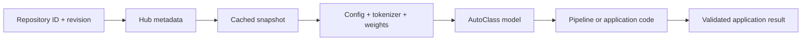

<TLDR>
  <TLDRCell label="what">
    The Hugging Face Hub stores versioned models, tokenizers, and metadata; Transformers loads those artifacts behind consistent inference interfaces.
  </TLDRCell>
  <TLDRCell label="when">
    Use this toolchain to reuse public or private models, compare implementations, or deploy a reviewed model snapshot in an application.
  </TLDRCell>
  <TLDRCell label="how">
    Inspect the model card and repository files, then pin a commit hash; take the tokenizer, configuration, and weights from that revision and set the task and input limits explicitly.
  </TLDRCell>
</TLDR>

## What it is and why it exists

Hugging Face refers both to the Hub that hosts machine-learning artifacts and to a group of
open-source libraries built around those artifacts. A <Term id="model-repository">model
repository</Term> on the Hub can hold configuration, tokenizer, weight, processor, and
documentation files. Transformers maps those files to relatively consistent Python interfaces,
while `huggingface_hub` handles repository queries, downloads, caching, authentication, and uploads.

It solves the delivery problem between model code and model artifacts. A weight file alone is
usually insufficient: an application also needs the architecture, vocabulary, special tokens,
preprocessing rules, and task head. A repository puts those files in one addressable version, and
loaders find them by convention instead of making every project invent a download and directory protocol.

You meet Hugging Face while evaluating open models, running local inference, publishing a fine-tuned
result, or creating an offline deployment bundle. The ecosystem is not one particular model, and it
does not make every model on the Hub production-ready. Repository authors decide what to disclose
about licenses, training data, and quality; users still own security review, behavior evaluation, and capacity planning.

A repository README is normally rendered as a <Term id="model-card">model card</Term>. It should
describe intended uses, limitations, data, evaluation results, and licensing, but the publisher
maintains it and completeness varies. Downloads, likes, and task tags can help discovery; they do not
replace checking the license, files, and behavior on your target data.

Transformers `pipeline()` is the high-level entry point for quickly checking a supported task.
AutoClasses are lower-level loaders such as `AutoTokenizer`, `AutoModel`, and
`AutoModelForSequenceClassification`. An AutoClass is usually clearer once you need direct control
over batching, tensors, devices, or postprocessing.

Datasets, Tokenizers, Accelerate, PEFT, and Spaces are neighboring tools, not one abstraction layer.
Datasets handles data, Accelerate coordinates devices and distributed execution, PEFT manages
parameter-efficient fine-tuning, and Spaces hosts demonstration applications. This topic establishes
the Hub and Transformers loading contract; related topics cover training and application orchestration.

## How it works

A typical load begins with a repository ID such as `organization/model-name`. The caller can also
supply a <Term id="revision">revision</Term>, which may be a branch, tag, or commit hash. Omitting it
normally resolves the default branch. That is convenient for interactive trials, but two deployments
can receive different artifacts after the repository changes.

The loader resolves configuration and task information before choosing an implementation.
`AutoConfig` creates a configuration object from the model type in `config.json`; `AutoTokenizer`
selects an implementation from tokenizer files; an `AutoModelFor...` class selects a model class with
the requested task head. `AutoModel` loads only the base architecture and cannot invent meaningful business labels.

The Hub client then downloads required files into a local cache. Files for the same repository and
revision can be reused, while snapshots for different commits coexist. `local_files_only=True`
disables network resolution and suits an environment whose cache was prepared in advance. It does
not fill in missing artifacts automatically.

Pipeline adds a task adapter on top of this path. It chooses preprocessing, invokes the model, and
performs common postprocessing before returning task-appropriate Python objects. The convenience
layer still needs an explicit model ID, revision, and input boundary; otherwise the default model,
device, or truncation behavior can diverge from application assumptions.



The snapshot in the diagram is the artifact boundary, while Pipeline is a runtime convenience layer.
The application result comes after model output because label mappings, thresholds, length limits,
and domain validation still belong to the application. A tensor or label from a successful inference
proves that a call completed, not that the result may trigger a business action.

Public repositories allow anonymous downloads, though anonymous requests have lower rate limits.
Private and gated repositories need a user token, commonly supplied through `HF_TOKEN` or locally
stored login credentials rather than source code. A service should use the narrowest credential it
needs and separate permission to read models from permission to publish them.

A repository can contain custom Python implementations. Transformers loads that remote code only
when `trust_remote_code=True` is enabled, which means downloaded code executes on your machine.
Do not treat the flag as a general fix for an “unsupported architecture” error. Review the code, pin
its code revision, and run it in an isolated environment first.

The weight format is also part of the trust boundary. <Term id="safetensors">Safetensors</Term> is a
tensor-oriented serialization format that avoids representing arbitrary Python objects through
pickle. The Hub scans pickle files and displays the result, but scanning is not proof of safety.
Prefer reviewed Safetensors artifacts and record their repository source and commit hash together.

## Examples

### Validate the loading path with Pipeline

The first example uses Hugging Face's tiny random BERT test repository. It verifies loading,
tokenization, and tensor shapes only; its vectors have no semantic quality and are unsuitable for
similarity or retrieval. The commit hash makes every run request the same configuration, tokenizer,
and weights.

<Depth level="quick">

```python run title="pipeline_shapes.py"
from transformers import pipeline

MODEL_ID = "hf-internal-testing/tiny-random-bert"
REVISION = "f171d7baecaf37b5da5a3616d8833b9969753535"
extract = pipeline(
    task="feature-extraction",
    model=MODEL_ID,
    revision=REVISION,
)
vectors = extract("Hugging Face")

print(type(extract.model).__name__)
print(len(vectors), len(vectors[0]), len(vectors[0][0]))
print(extract.tokenizer.convert_ids_to_tokens(
    extract.tokenizer("Hugging Face")["input_ids"]
)[:6])
```

```text
BertModel
1 13 32
['[CLS]', 'h', '##u', '##g', '##g', '##i']
```

</Depth>

Pipeline returns a three-level list: batch, token, and hidden dimension. The batch size here is `1`,
the input becomes `13` tokens, and the test model has a hidden size of `32`. A real model's shape is
determined by its tokenizer and configuration; do not copy these numbers into a general assertion.

Passing `task` explicitly avoids depending on a task inferred from repository metadata. Passing
`model` explicitly prevents Pipeline from silently choosing a default model and downloading
unexpected artifacts. Production code must also pin Transformers, `huggingface_hub`, and tensor
backend versions because a snapshot does not pin loader behavior.

### Inspect repository metadata before loading

`HfApi.model_info()` reads repository information and the file list before weights are downloaded.
This example checks the resolved commit, declared library, and Safetensors file size. A real selection
program should also check the model card, license, task tag, and gated status. This test repository
lacks a production model card, so it is not a model-selection example.

```python run title="inspect_repository.py"
from huggingface_hub import HfApi

MODEL_ID = "hf-internal-testing/tiny-random-bert"
REVISION = "f171d7baecaf37b5da5a3616d8833b9969753535"
info = HfApi().model_info(
    MODEL_ID,
    revision=REVISION,
    files_metadata=True,
)
files = {item.rfilename: item.size for item in info.siblings}

print(info.id)
print(info.sha == REVISION)
print(info.library_name)
print(files["model.safetensors"])
```

```text
hf-internal-testing/tiny-random-bert
True
transformers
520212
```

`files_metadata=True` requests per-file metadata such as size, so it does more work than fetching
basic repository information. Building an artifact allowlist from this result can reject unexpected
large files or unused formats before download. File size constrains transfer and storage; it says
nothing about model quality.

The resolved `info.sha` equals the pinned hash, proving that the server found the intended commit.
When release configuration accepts a mutable tag, resolve it to a commit during the build and write
the hash into the deployment manifest. A running service should not query `main` on every request.

### Download only the required snapshot files

`snapshot_download()` downloads a repository snapshot at one revision. `allow_patterns` and
`ignore_patterns` can narrow the file set, which is useful when prefetching configuration or
preparing artifacts for only one backend. This example uses a temporary cache and demonstrates that
the selected result contains no model weights.

```python run title="selective_snapshot.py"
from pathlib import Path
from tempfile import TemporaryDirectory

from huggingface_hub import snapshot_download

MODEL_ID = "hf-internal-testing/tiny-random-bert"
REVISION = "f171d7baecaf37b5da5a3616d8833b9969753535"
with TemporaryDirectory() as cache_dir:
    snapshot = Path(snapshot_download(
        repo_id=MODEL_ID,
        revision=REVISION,
        allow_patterns=["*.json", "vocab.txt"],
        cache_dir=cache_dir,
    ))
    files = sorted(
        str(path.relative_to(snapshot))
        for path in snapshot.rglob("*")
        if path.is_file()
    )
    print(snapshot.name)
    print(files)
```

```text
f171d7baecaf37b5da5a3616d8833b9969753535
['config.json', 'special_tokens_map.json', 'tokenizer.json', 'tokenizer_config.json', 'vocab.txt']
```

The last path component is the resolved commit hash. Allowlist patterns match paths relative to the
repository; a model that keeps tokenizer files in a subdirectory needs patterns that cover that
directory. Query the metadata API before downloading so you do not guess an incomplete pattern.

A successful snapshot download does not prove that the snapshot can run inference. This example
intentionally excludes weights, so a later `AutoModel.from_pretrained(snapshot)` would fail. An
offline build should instantiate the target AutoClass once during the connected phase, then repeat
the load with `local_files_only=True` in a network-isolated environment.

### Control tensor boundaries with AutoClass

Load the tokenizer and base model separately when the application needs batched input, attention
masks, or intermediate tensors. Both use the same repository and commit hash, which prevents a
vocabulary and embedding mismatch. `model.eval()` disables training-mode randomness, while
`torch.inference_mode()` disables gradient recording for this call.

```python run title="autoclass_batch.py"
import torch
from transformers import AutoModel, AutoTokenizer

MODEL_ID = "hf-internal-testing/tiny-random-bert"
REVISION = "f171d7baecaf37b5da5a3616d8833b9969753535"
tokenizer = AutoTokenizer.from_pretrained(MODEL_ID, revision=REVISION)
model = AutoModel.from_pretrained(MODEL_ID, revision=REVISION)
inputs = tokenizer(
    ["Hugging Face makes model artifacts reusable.",
     "Pinned revisions make deployments repeatable."],
    padding=True,
    return_tensors="pt",
)

model.eval()
with torch.inference_mode():
    outputs = model(**inputs)

print(type(model).__name__)
print(tuple(inputs["input_ids"].shape))
print(tuple(outputs.last_hidden_state.shape))
print(tokenizer.convert_ids_to_tokens(inputs["input_ids"][0])[:8])
```

```text
BertModel
(2, 43)
(2, 43, 32)
['[CLS]', 'h', '##u', '##g', '##g', '##i', '##n', '##g']
```

Dynamic padding extends both sequences to the longest item in this batch, giving an input shape of
`(2, 43)`. Base BERT returns a hidden vector of length `32` for every token. The example has no
classification head and does not interpret any dimension as a business label.

For untrusted text, supply both `truncation=True` and an evaluated `max_length`. Silent truncation
drops content, while no truncation can exceed the context window; either policy is a product
decision. For classification, choose `AutoModelForSequenceClassification` and inspect the
repository configuration's `id2label` mapping.

## Pitfalls

### Treating the default branch as a fixed version

> [!PITFALL]
> Writing only `from_pretrained("org/model")` resolves the repository's default branch on a cache miss, so the same deployment code can load different artifacts after an update.

**Fix:** Store the commit hash in experiment records and deployment manifests, and pass the same
`revision` to the tokenizer, configuration, model, and processor. Change the hash deliberately,
rerun evaluation, and release a new application version when upgrading the model.

### Letting Pipeline guess the model and task

> [!PITFALL]
> `pipeline("text-classification")` can select a default model, but that choice is not an application dependency contract and can trigger an unexpected download.

**Fix:** Always provide the task, repository ID, and revision explicitly. Check that the model card
and `pipeline_tag` support the target task, then verify label meaning with representative and boundary
inputs. Successful execution does not prove that the label mapping is correct.

### Mixing tokenizer and weight sources

> [!PITFALL]
> Generated code sometimes loads a tokenizer from one repository and a model from another, or pins a revision for only one of them.

**Fix:** By default, take configuration, tokenizer, processor, and weights from the same snapshot.
If replacing the tokenizer is intentional, prove that vocabulary IDs, special tokens, and the
embedding matrix are compatible, and add the combination to a contract test.

### Trusting remote code unconditionally

> [!PITFALL]
> Adding `trust_remote_code=True` to bypass an unknown-architecture error allows custom Python from the repository to execute inside the loading process.

**Fix:** Prefer implementations supported directly by Transformers. When custom code is necessary,
review the pinned code and dependencies, run without credentials in a low-privilege environment with
restricted networking, and pin artifact and code revisions separately.

### Putting an authentication token in code or logs

> [!PITFALL]
> Putting `token="hf_..."` in an example, exception, or build log exposes repository credentials to version history and logging systems.

**Fix:** Use `HF_TOKEN`, controlled secret injection, or the local login store and let the SDK read
the credential. Issue a read-only, narrowly scoped token to the runtime. Log only the repository ID,
commit hash, and request ID.

### Assuming the cache is an offline bundle

> [!PITFALL]
> One successful load on a development machine may reuse old files scattered through its cache; it does not prove that a new environment has one complete, consistent snapshot.

**Fix:** Prefetch the pinned snapshot into an empty cache and instantiate the target Pipeline or
AutoClass. Disconnect the network and run the startup test again with `local_files_only=True`,
treating any missing file as a build failure.

## In the AI era

**What generated code gets wrong here**

Generated code often omits `model` or `revision`, causing Pipeline to use a default model or a
deployment to change behavior after a repository update. It also mixes tokenizer and weight
repositories, treats `trust_remote_code=True` as a compatibility fix, or emits the `resume_download`
and `local_dir_use_symlinks` arguments that `huggingface_hub` 1.x now ignores.

Another class of failures sits at the input and device boundary. Generated code may disable
truncation for arbitrary text, force half precision on a CPU, combine `device_map` with manual
`.to()` calls, or rebuild a Pipeline inside every web request. It passes syntax checks but fails on
long inputs, a cold cache, a machine without a GPU, or concurrent startup.

**Ask your AI to check**

- List the repository ID, commit hash, task, tokenizer source, and remote-code setting for every `from_pretrained` and `pipeline` call.
- Run startup tests with an empty cache and in offline mode, reporting the downloaded files, total size, and any missing artifacts.
- Batch the longest allowed and an overlong input, recording truncation policy, tensor shapes, device, dtype, and peak memory.

**Review checklist**

- Confirm that the model card, license, target task, and local evaluation evidence all refer to the deployed commit hash.
- Confirm that tokenizer, configuration, processor, and weights come from one reviewed snapshot and that remote code is off by default.
- Confirm that tokens cannot enter source or logs, and verify startup in a new process with an empty cache and no network.

**Prompt vocabulary**

Use the exact terms `repository ID`, `commit hash`, `revision pinning`, `model card`, `artifact
allowlist`, `local_files_only`, `trust_remote_code`, and `tokenizer-model compatibility`. Ask the AI
for a “repository, revision, files, loader class, and device” inventory. That exposes hidden defaults
more reliably than “write Hugging Face inference code.”

<Depth level="deep">

## Reproducible loading and cache boundaries

### Branches, tags, and commit hashes

Branches and tags are convenient human release handles, but they can move. A commit hash identifies
an immutable repository state and is a better deployment and evaluation record. A robust process can
accept a human-selected tag, resolve it to a hash during the build, and give only the hash to later
download and runtime stages.

Pinning the model commit does not pin the whole execution environment. Transformers,
`huggingface_hub`, PyTorch, tokenizer backends, and hardware kernels can change loading or numerical
behavior. A deployment manifest should record the repository hash, Python package lock, runtime
versions, and important device settings, then test floating-point output with tolerances rather than byte equality.

A Git commit in the repository also does not prove every local file has been downloaded. The Hub
cache separates content blobs from snapshot references so different revisions can reuse unchanged
files. Treat the snapshot path returned by the SDK as read-only. Copy artifacts to a controlled
location and record the source hash if the bundle must be modified.

### Single-file and snapshot downloads

`hf_hub_download()` fits a caller that knows one filename, such as `config.json`.
`snapshot_download()` fits a loader that needs a mutually compatible file set, with allow and ignore
patterns available to narrow it. Both calls should receive a revision. Downloading one pinned
configuration and then loading weights from the default branch reintroduces version drift.

Pattern filtering is a capacity control, not a dependency resolver. Architectures may require shard
indexes, several weight shards, processor configurations, or custom code. Do not copy another
repository's file allowlist. Load the target class in an empty cache, observe the actual file set,
and then freeze the verified set in the build process.

`force_download=True` forces another transfer and normally does not belong in a service startup path.
`huggingface_hub` resumes downloads when possible, so its 1.x line deprecates and ignores
`resume_download`. It likewise deprecates and ignores `local_dir_use_symlinks`; generated code should
not use these old arguments to describe current behavior.

### Cache ownership

`HF_HOME` can set the root for Hugging Face token storage and caches, while `HF_HUB_CACHE` can select
the Hub cache specifically. A container should define whether that directory is a read-only image
layer, a writable startup volume, or temporary per-instance storage. Unclear ownership causes repeat
downloads, permission errors, or unintended sharing of restricted artifacts between tenants.

A shared cache reduces downloads and disk usage but widens local read access. For private
repositories, align filesystem permissions with service identities rather than relying only on remote
Hub authorization. Once downloaded, a local file is not reauthorized on every read. Rotating a
credential and removing cached artifacts are separate operations.

Offline mode is both a build-completeness test and a runtime policy. With `HF_HUB_OFFLINE=1` or
`local_files_only=True`, missing files should surface immediately instead of timing out during a
production startup. If online fallback is allowed, define timeouts, retries, and repository
allowlists; never accept an arbitrary repository ID produced by a model.

### Loading warnings are contract signals

Missing and unexpected keys in a load report mean the checkpoint parameter set and target class do
not match exactly. Some differences may be intentional when replacing a task head, but a new
difference in a pure inference deployment should block release. Do not hide all loading warnings to
quiet logs. Maintain a precise allowlist for expected differences.

A size mismatch, unknown model type, or missing tokenizer file is normally not a transient failure
that a retry will solve. It signals a broken contract between the repository, revision, loader class,
or selected file set. Preserve the repository ID and commit hash in a redacted error, then fail the
deployment instead of switching to another default model.

Validate semantic configuration after loading too. A classifier's `id2label` can still contain
`LABEL_0`, a generator's special tokens and stop conditions may not match the application protocol,
and a tokenizer's maximum length may be a placeholder. Put these fields in startup assertions and
exercise them with real inputs rather than checking only the Python object type.

### From experiment to deployment

Pipeline is useful for confirming a task interface during experimentation, but an application
boundary should turn every implicit choice into configuration. At minimum, record the repository ID,
commit hash, task, allowed input length, device policy, and remote-code policy. Evaluate and review
configuration changes like code changes.

Begin the build from an empty cache, query repository metadata, inspect the model card and files,
download the pinned snapshot, and instantiate the target loader class. Save the artifact manifest and
hashes, package lock, and evaluation result with the release. At runtime, read only the approved
snapshot and verify model and tokenizer readiness in a health check.

A rollback needs the old snapshot and old runtime environment together. Moving a repository tag back
does not reconcile running instances, populated caches, and package versions. Release model artifacts
with the application version so canary rollout, rollback, and incident reproduction share one
version unit.

</Depth>

<Checkpoint id="ai/huggingface" />

## Further reading

- [Hub repositories](https://huggingface.co/docs/hub/en/repositories)
- [Model cards](https://huggingface.co/docs/hub/en/model-cards)
- [`huggingface_hub` download guide](https://huggingface.co/docs/huggingface_hub/en/guides/download)
- [Transformers Pipeline](https://huggingface.co/docs/transformers/en/main_classes/pipelines)
- [Transformers AutoClass](https://huggingface.co/docs/transformers/en/model_doc/auto)
- [Hub pickle scanning](https://huggingface.co/docs/hub/en/security-pickle)
