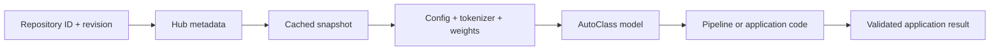

<TLDR>
  <TLDRCell label="what">
    Hugging Face Hub 保存带版本的模型、分词器与元数据；Transformers 把这些制品加载为统一的推理接口。
  </TLDRCell>
  <TLDRCell label="when">
    需要复用公开或私有模型、比较模型实现，或者把经过审核的模型快照部署到应用中时，可以使用这套工具。
  </TLDRCell>
  <TLDRCell label="how">
    先检查模型卡与仓库文件，再固定提交哈希；让 tokenizer、配置和权重来自同一个修订版本，并显式设置任务与输入限制。
  </TLDRCell>
</TLDR>

## 是什么，为什么存在

Hugging Face 既指托管机器学习制品的 Hub，也指围绕这些制品构建的一组开源库。
Hub 上的<Term id="model-repository">模型仓库（model repository）</Term>可以保存配置、分词器、
权重、处理器和说明文档。Transformers 读取这组文件，把不同架构映射到相对一致的 Python
接口；`huggingface_hub` 则负责仓库查询、下载、缓存、认证与上传。

它解决的是模型代码与模型制品之间的交付问题。只有一份权重文件通常不够：应用还需要知道
架构、词表、特殊 token、预处理规则和任务头。仓库把这些文件放在同一个可寻址版本中，加载器
再根据约定找到它们，避免每个项目都自行设计下载和目录协议。

你会在评估开源模型、运行本地推理、发布微调结果以及构建离线部署包时遇到 Hugging Face。
这套生态不等于某一种模型，也不保证 Hub 上的模型适合生产环境。仓库作者决定许可证、训练数据
说明和质量证据；使用方仍要完成安全审查、行为评测与容量规划。

仓库的 README 通常会呈现为<Term id="model-card">模型卡（model card）</Term>。模型卡应说明
预期用途、限制、数据、评测结果和许可证，但内容由发布者维护，完整程度不一。下载量、点赞数或
任务标签可以帮助检索，不能替代对许可证、文件和目标数据的检查。

Transformers 的 `pipeline()` 是高层入口，适合快速验证一个受支持任务。AutoClass 是更低层的
加载入口，例如 `AutoTokenizer`、`AutoModel` 和 `AutoModelForSequenceClassification`。
需要控制批处理、张量、设备或后处理时，AutoClass 通常比 Pipeline 更清楚。

Datasets、Tokenizers、Accelerate、PEFT 和 Spaces 都属于相邻工具，但不是同一个抽象层。
Datasets 处理数据，Accelerate 协调设备与分布式执行，PEFT 管理参数高效微调，Spaces 托管演示
应用。本主题只建立 Hub 与 Transformers 的加载契约；训练与应用编排由相关主题继续展开。

## 工作原理

一个典型加载过程从仓库 ID 开始，例如 `organization/model-name`。调用方还可以给出
<Term id="revision">修订版本（revision）</Term>，它可以是分支、标签或提交哈希。未指定时通常
解析默认分支；这对交互式试用很方便，却会让两次部署在仓库更新后获得不同制品。

加载器先解析配置和任务，再选择具体实现。`AutoConfig` 根据 `config.json` 的模型类型创建配置
对象；`AutoTokenizer` 根据 tokenizer 文件选择实现；某个 `AutoModelFor...` 类则根据配置选择
带相应任务头的模型类。`AutoModel` 只加载基础架构，不会凭空添加符合业务标签的分类头。

随后，Hub 客户端把所需文件下载到本地缓存。相同仓库与修订版本的文件可以复用，提交哈希对应
的快照也能与默认分支的新版本并存。`local_files_only=True` 会禁止网络解析，适合已经预热缓存的
运行环境；它不会自动把缺失制品补齐。

Pipeline 在这条路径上增加任务适配。它负责选择预处理器、调用模型并执行常见后处理，返回适合
任务的 Python 对象。便利层仍需要显式的模型 ID、修订版本和输入边界，否则默认模型、默认设备
或截断行为可能与应用假设不同。



图中的快照是制品边界，Pipeline 是运行时便利层。应用结果位于模型输出之后，因为标签映射、
阈值、长度限制与领域验证仍属于应用。模型成功返回张量或标签，只能证明一次推理完成，不能证明
这个结果可以直接触发业务动作。

公开仓库可以匿名下载，但匿名请求有较低的速率限制。私有或受限仓库需要用户 token；常见做法是
通过 `HF_TOKEN` 或登录后的本地凭据提供，不要把 token 写进源代码。服务进程应使用范围最小的
凭据，并把模型读取权限与模型发布权限分开。

仓库可以包含自定义 Python 实现。Transformers 只有在启用 `trust_remote_code=True` 后才会加载
这类远端代码，这意味着下载的代码会在本机执行。不要把这个参数当成解决“不支持架构”错误的
通用开关；先检查代码、固定代码修订版本，并在隔离环境中运行。

权重格式也属于信任边界。<Term id="safetensors">Safetensors</Term> 是面向张量的序列化格式，
避免用 pickle 表达任意 Python 对象。Hub 会扫描 pickle 文件并显示结果，但扫描不是安全证明；
优先选择经过审核的 Safetensors 制品，并把仓库来源与提交哈希一起记录。

## 示例

### 用 Pipeline 验证加载路径

第一个示例使用 Hugging Face 的微型随机 BERT 测试仓库。它只用于验证加载、分词和张量形状，
产生的向量没有语义质量，不能用于相似度或检索。提交哈希让代码每次读取同一份配置、分词器与
权重。

<Depth level="quick">

```python run title="pipeline_shapes.py"
from transformers import pipeline

MODEL_ID = "hf-internal-testing/tiny-random-bert"
REVISION = "f171d7baecaf37b5da5a3616d8833b9969753535"
extract = pipeline(
    task="feature-extraction",
    model=MODEL_ID,
    revision=REVISION,
)
vectors = extract("Hugging Face")

print(type(extract.model).__name__)
print(len(vectors), len(vectors[0]), len(vectors[0][0]))
print(extract.tokenizer.convert_ids_to_tokens(
    extract.tokenizer("Hugging Face")["input_ids"]
)[:6])
```

```text
BertModel
1 13 32
['[CLS]', 'h', '##u', '##g', '##g', '##i']
```

</Depth>

Pipeline 返回三层列表：批次、token 和隐藏维度。这里的批次大小为 `1`，输入被分成 `13` 个
token，测试模型的隐藏维度为 `32`。真实模型的形状由 tokenizer 与配置决定，不能把这些数字
复制为通用断言。

显式传入 `task` 可以避免依赖仓库元数据推断任务。显式传入 `model` 则避免 Pipeline 悄悄选择
默认模型并下载意外制品。生产代码还要固定 Transformers、`huggingface_hub` 和张量后端版本，
因为同一快照并不固定加载库的行为。

### 加载前检查仓库元数据

`HfApi.model_info()` 可以在下载权重前读取仓库信息和文件清单。示例检查解析后的提交哈希、声明的
库以及 Safetensors 文件大小。真实的选型程序还应检查模型卡、许可证、任务标签和受限访问状态；
这个测试仓库没有可用的生产模型卡，因此不能作为选型范例。

```python run title="inspect_repository.py"
from huggingface_hub import HfApi

MODEL_ID = "hf-internal-testing/tiny-random-bert"
REVISION = "f171d7baecaf37b5da5a3616d8833b9969753535"
info = HfApi().model_info(
    MODEL_ID,
    revision=REVISION,
    files_metadata=True,
)
files = {item.rfilename: item.size for item in info.siblings}

print(info.id)
print(info.sha == REVISION)
print(info.library_name)
print(files["model.safetensors"])
```

```text
hf-internal-testing/tiny-random-bert
True
transformers
520212
```

`files_metadata=True` 请求每个文件的大小等元数据，因此会比只读取基本仓库信息多做工作。先用它
构建制品允许列表，可以在下载前拒绝意外的大文件或不需要的格式。不过，文件大小只能约束传输与
存储，不能验证权重质量。

解析出的 `info.sha` 与固定哈希相同，说明服务端找到了预期提交。若配置中使用可变标签，可以先
在发布流程中解析为提交哈希，再把哈希写入部署清单。运行中的服务不应在每次请求里重新查询
`main`。

### 只下载需要的快照文件

`snapshot_download()` 会下载某个修订版本的仓库快照。`allow_patterns` 和 `ignore_patterns` 可以
缩小文件集合，适合只预取配置或只为某个后端准备制品。下面使用临时缓存，证明选择结果中不包含
模型权重。

```python run title="selective_snapshot.py"
from pathlib import Path
from tempfile import TemporaryDirectory

from huggingface_hub import snapshot_download

MODEL_ID = "hf-internal-testing/tiny-random-bert"
REVISION = "f171d7baecaf37b5da5a3616d8833b9969753535"
with TemporaryDirectory() as cache_dir:
    snapshot = Path(snapshot_download(
        repo_id=MODEL_ID,
        revision=REVISION,
        allow_patterns=["*.json", "vocab.txt"],
        cache_dir=cache_dir,
    ))
    files = sorted(
        str(path.relative_to(snapshot))
        for path in snapshot.rglob("*")
        if path.is_file()
    )
    print(snapshot.name)
    print(files)
```

```text
f171d7baecaf37b5da5a3616d8833b9969753535
['config.json', 'special_tokens_map.json', 'tokenizer.json', 'tokenizer_config.json', 'vocab.txt']
```

返回路径的末段就是解析后的提交哈希。允许列表匹配仓库内的相对路径；如果模型把 tokenizer 文件
放在子目录中，模式也要覆盖该目录。下载前可以先调用元数据 API，避免凭猜测写出漏文件的模式。

快照下载成功不代表它已经具备推理所需的一切。这个示例有意排除了权重，所以后续
`AutoModel.from_pretrained(snapshot)` 会失败。离线构建应在联网阶段实际加载一次目标 AutoClass，
再在隔离网络的环境中用 `local_files_only=True` 重复加载。

### 用 AutoClass 控制张量边界

当应用需要批量输入、注意力掩码或中间张量时，可以分别加载 tokenizer 与基础模型。两者使用同一
仓库和提交哈希，避免词表与嵌入矩阵错配。`model.eval()` 关闭训练模式中的随机行为，
`torch.inference_mode()` 则关闭本次调用的梯度记录。

```python run title="autoclass_batch.py"
import torch
from transformers import AutoModel, AutoTokenizer

MODEL_ID = "hf-internal-testing/tiny-random-bert"
REVISION = "f171d7baecaf37b5da5a3616d8833b9969753535"
tokenizer = AutoTokenizer.from_pretrained(MODEL_ID, revision=REVISION)
model = AutoModel.from_pretrained(MODEL_ID, revision=REVISION)
inputs = tokenizer(
    ["Hugging Face makes model artifacts reusable.",
     "Pinned revisions make deployments repeatable."],
    padding=True,
    return_tensors="pt",
)

model.eval()
with torch.inference_mode():
    outputs = model(**inputs)

print(type(model).__name__)
print(tuple(inputs["input_ids"].shape))
print(tuple(outputs.last_hidden_state.shape))
print(tokenizer.convert_ids_to_tokens(inputs["input_ids"][0])[:8])
```

```text
BertModel
(2, 43)
(2, 43, 32)
['[CLS]', 'h', '##u', '##g', '##g', '##i', '##n', '##g']
```

动态填充把两个序列补到本批次的最长长度，所以输入形状为 `(2, 43)`。基础 BERT 为每个 token
返回长度为 `32` 的隐藏向量。示例没有分类头，也没有把某一维解释成业务标签。

处理不受信任的文本时，应同时给出 `truncation=True` 和经过评测的 `max_length`。静默截断会丢失
内容，不截断又可能超过模型上下文；两种策略都需要产品层决定。若任务需要分类，应选择对应的
`AutoModelForSequenceClassification`，并核对仓库配置中的 `id2label`。

## 陷阱

### 把默认分支当成固定版本

> [!PITFALL]
> 只写 `from_pretrained("org/model")` 会在缓存未命中时解析仓库默认分支，仓库更新后，同一部署代码可能加载不同制品。

**修复方法：** 在实验记录与部署清单中保存提交哈希，并把相同 `revision` 传给 tokenizer、配置、
模型和处理器。升级模型时显式改哈希，重新执行评测，再发布新的应用版本。

### 让 Pipeline 猜模型与任务

> [!PITFALL]
> `pipeline("text-classification")` 可以选择默认模型，但默认选择不是应用依赖契约，也可能触发意外下载。

**修复方法：** 总是显式给出任务、仓库 ID 和修订版本。检查模型卡与 `pipeline_tag` 是否支持目标
任务，再用代表性与边界输入验证标签含义；能运行不等于标签映射正确。

### 混用不同来源的 tokenizer 与权重

> [!PITFALL]
> 生成代码有时从一个仓库加载 tokenizer，从另一个仓库加载模型，或者只给其中一个固定修订版本。

**修复方法：** 默认让配置、tokenizer、处理器和权重来自同一快照。确实需要替换 tokenizer 时，
要证明词表 ID、特殊 token 和嵌入矩阵兼容，并把这项组合加入契约测试。

### 无条件信任远端代码

> [!PITFALL]
> 为了绕过未知架构错误而添加 `trust_remote_code=True`，会允许仓库中的自定义 Python 代码在加载进程内执行。

**修复方法：** 优先使用 Transformers 已内置支持的实现。必须执行自定义代码时，审核固定提交中的
代码与依赖，在无凭据、低权限、限制网络的环境中运行，并分别固定制品修订版本与代码修订版本。

### 把认证 token 写入代码或日志

> [!PITFALL]
> 把 `token="hf_..."` 放进示例、异常信息或构建日志，会让仓库凭据进入版本历史和日志系统。

**修复方法：** 使用 `HF_TOKEN`、受控密钥注入或本地登录存储，让 SDK 自行读取凭据。为运行环境
发放只读、最小范围的 token，日志只记录仓库 ID、提交哈希和请求 ID。

### 假定缓存等于离线部署包

> [!PITFALL]
> 开发机上一次成功加载可能复用了散落在缓存中的旧文件，不能证明新环境拥有完整且一致的快照。

**修复方法：** 在空缓存中预取固定快照，并实际构造目标 Pipeline 或 AutoClass。然后断开网络，
使用 `local_files_only=True` 再运行一次启动测试；把缺失文件当作构建失败处理。

<Depth level="deep">

## 可复现加载与缓存边界

### 分支、标签与提交哈希

分支和标签便于人类管理发布，但它们可以被移动。提交哈希标识不可变的仓库状态，更适合部署与
评测记录。一个稳健流程可以接受人工选择的标签，在构建阶段把它解析成哈希，然后只把哈希交给
后续下载与运行阶段。

固定模型提交并没有固定全部执行环境。Transformers、`huggingface_hub`、PyTorch、tokenizer
后端和硬件内核都可能改变加载或数值行为。部署清单应同时记录仓库哈希、Python 包锁文件、运行时
版本和关键设备配置，并用输出容差而不是字节相等来检查浮点结果。

仓库中的 Git 提交也不等于本地文件已经完整下载。Hub 缓存把内容 blob 与快照引用分开，以便不同
修订版本复用相同文件。应用应把 SDK 返回的快照路径当作只读输入，不要修改缓存中的文件；若要
制作可修改目录，应复制到受控位置并记录来源哈希。

### 单文件下载与快照下载

`hf_hub_download()` 适合明确知道文件名的调用方，例如只读取 `config.json`。
`snapshot_download()` 适合需要一组彼此匹配文件的加载过程，并能用允许或忽略模式缩小集合。
两者都应带上修订版本；下载单个配置后再从默认分支加载权重，会重新引入版本漂移。

模式过滤是容量控制，不是依赖解析器。不同模型架构可能需要分片索引、多个权重分片、处理器配置
或自定义代码。不要复制另一个仓库的文件允许列表；在空缓存中加载目标类，观察实际文件集合，再
把经过验证的集合固化到构建流程。

`force_download=True` 强制重新获取文件，通常不应出现在正常服务启动路径中。
`huggingface_hub` 会在可能时续传，因此 1.x 中的 `resume_download` 已被弃用并忽略。
同样，`local_dir_use_symlinks` 已被弃用并忽略，生成代码不应靠这些旧参数表达当前行为。

### 缓存所有权

`HF_HOME` 可以把 Hugging Face 的 token 与缓存根目录放到指定位置，`HF_HUB_CACHE` 可以进一步
指定 Hub 缓存。容器中应明确这个目录是镜像只读层、启动时可写卷，还是每个实例的临时空间。
所有权不清会造成重复下载、权限错误，或不同租户意外共享受限制品。

共享缓存减少下载与磁盘占用，但同时扩大读取面。处理私有仓库时，要让文件系统权限与服务身份
匹配，不要只依赖 Hub 的远端授权；下载完成后，本地文件不会在每次读取时重新检查远端权限。
凭据轮换与缓存清理是两个不同操作。

离线模式是对构建完整性的测试，也是运行策略。设置 `HF_HUB_OFFLINE=1` 或传入
`local_files_only=True` 后，缺失文件应立即暴露，而不是在生产启动时等待网络超时。若应用允许
在线回退，应明确超时、重试和允许访问的仓库，不能接受模型生成的任意仓库 ID。

### 加载警告是契约信号

加载报告中的 missing keys 与 unexpected keys 说明检查点和目标类的参数集合不完全一致。
更换任务头时，部分差异可能是有意的；在纯推理部署中突然出现差异则应阻止发布。不要为了让日志
安静而全局隐藏加载警告，应对预期差异建立精确允许列表。

尺寸不匹配、未知模型类型或缺失 tokenizer 文件通常不是通过重试解决的暂时性故障。它们说明
仓库、修订版本、加载类或文件集合之间的契约有误。错误处理应保留仓库 ID 与提交哈希，但删去
token 和敏感路径，然后让部署失败而不是换用另一个默认模型。

模型加载完成后也要验证语义配置。分类模型的 `id2label` 可能仍是 `LABEL_0`，生成模型的特殊
token 与停止条件可能不符合应用协议，tokenizer 的最大长度还可能是占位上限。把这些字段纳入
启动断言，并用真实输入验证，不能仅检查对象类型。

### 从试验到部署

试验阶段可以用 Pipeline 快速确认任务接口，但进入应用边界时要把隐式选择变成配置。配置至少
包含仓库 ID、提交哈希、任务、允许的输入长度、设备策略与远端代码策略。配置变更应像代码变更
一样经过评测和审查。

构建阶段从空缓存开始，查询仓库元数据，检查模型卡与文件，下载固定快照，然后实例化目标加载类。
发布阶段保存制品清单及哈希、包锁文件和评测结果。运行阶段只读取批准快照，并在健康检查中验证
模型与 tokenizer 已经就绪。

回滚需要旧快照与旧运行环境同时可用。仅把仓库标签移回旧提交，会让正在运行的实例、已有缓存和
包版本处于不同状态。把模型制品与应用版本一起发布，才能让灰度、回滚与问题复现共享同一个
版本单位。

</Depth>

<Checkpoint id="ai/huggingface" />

## 延伸阅读

- [Hub 仓库](https://huggingface.co/docs/hub/en/repositories)
- [模型卡](https://huggingface.co/docs/hub/en/model-cards)
- [`huggingface_hub` 下载指南](https://huggingface.co/docs/huggingface_hub/en/guides/download)
- [Transformers Pipeline](https://huggingface.co/docs/transformers/en/main_classes/pipelines)
- [Transformers AutoClass](https://huggingface.co/docs/transformers/en/model_doc/auto)
- [Hub 的 pickle 扫描](https://huggingface.co/docs/hub/en/security-pickle)
