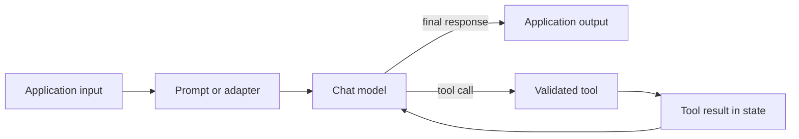

<TLDR>
  <TLDRCell label="what">
    LangChain 1.x is a Python framework for composing model calls and tools, with `create_agent` as its high-level agent harness.
  </TLDRCell>
  <TLDRCell label="when">
    Use it when provider-neutral model interfaces, composable execution, or a customizable tool loop removes code you would otherwise maintain yourself.
  </TLDRCell>
  <TLDRCell label="how">
    Start with the smallest runnable pipeline, keep data shapes explicit, and add an agent only when the model must choose actions at runtime.
  </TLDRCell>
</TLDR>

## What it is and why it exists

LangChain is a framework for assembling large-language-model applications from models, prompts, parsers, retrievers, tools, and stateful agent runtimes. In the 1.x line, the top-level `langchain` package focuses on agents while `langchain-core` supplies the shared abstractions underneath. Provider clients live in separate integration packages, so installing LangChain does not install every model SDK.

The framework addresses plumbing that appears around a model call. Application code needs to normalize messages, pass configuration, connect outputs to later inputs, stream events, trace work, expose functions as tools, and sometimes repeat the model–tool cycle. LangChain gives those operations common interfaces so that they can be composed and inspected.

That abstraction has a boundary. Two chat providers can implement the same interface while differing in supported content blocks, tool-call behavior, token accounting, errors, and streaming details. LangChain reduces adapter code; it does not make models semantically interchangeable.

You meet LangChain when a direct SDK call has grown into an execution workflow, or when you need an agent harness with tools, middleware, and persistence hooks. A single request followed by ordinary application code may not need a framework. Start with direct calls when the control flow is already clear and stable.

LangChain, LangGraph, and LangSmith have different jobs. LangChain offers higher-level model and agent APIs, LangGraph exposes lower-level graph orchestration and durable state, and LangSmith supplies tracing and evaluation services. LangChain agents run on LangGraph, but you do not need to author a graph to use `create_agent`.

## How it works

The central execution contract is a <Term id="runnable">runnable</Term>: a unit that accepts an input and produces an output. Prompts, chat models, output parsers, retrievers, and adapters can all implement this contract. Common entry points include `invoke`, `ainvoke`, `batch`, and `stream`, although the quality and meaning of batching or streaming depend on the component.

The pipe operator builds a sequence in which each output becomes the next input. This composition notation is commonly called the <Term id="langchain-expression-language">LangChain Expression Language (LCEL)</Term>. A dictionary of runnables forms parallel branches that receive the same input, while `RunnableBranch` chooses the first branch whose predicate matches.

An agent adds a model-controlled loop. `create_agent` invokes a chat model, executes any tool calls the model returns, appends the tool results to message state, and invokes the model again until it emits a final response or the run stops. The model chooses the next action; your code still owns tool definitions, authorization, state, limits, and side-effect policy.



The simple path through the diagram is a runnable sequence. The returning edge is the <Term id="agent-loop">agent loop</Term>. Retrieval, structured output, guardrails, and human approval can be inserted into either shape, but each addition introduces another contract to test.

Configuration travels alongside ordinary input rather than becoming business data. A `RunnableConfig` can carry callbacks, tags, metadata, a concurrency limit, and component-specific configurable values. Agent persistence additionally needs a stable thread identifier so that a checkpointer can load the correct state.

## Examples

### A prompt pipeline without network access

The first pipeline formats messages, calls a deterministic test model, and parses the returned message into a string. `FakeListChatModel` is a test double from `langchain-core`; replace it with a provider integration in application code. Keeping the first example offline makes its output reproducible and exposes the three data-shape transitions.

<Depth level="quick">

```python run title="prompt_pipeline.py"
from langchain_core.language_models.fake_chat_models import FakeListChatModel
from langchain_core.output_parsers import StrOutputParser
from langchain_core.prompts import ChatPromptTemplate

prompt = ChatPromptTemplate.from_messages([
    ("system", "You write concise support updates."),
    ("human", "Report the status of order {order_id}."),
])
model = FakeListChatModel(
    responses=["Order A-17 is packed and ready for pickup."]
)
chain = prompt | model | StrOutputParser()

input_data = {"order_id": "A-17"}
print(prompt.invoke(input_data).to_string())
print(chain.invoke(input_data))
```

```text
System: You write concise support updates.
Human: Report the status of order A-17.
Order A-17 is packed and ready for pickup.
```

</Depth>

`prompt.invoke()` returns a prompt value containing messages. The chat model accepts that value and returns an `AIMessage`; `StrOutputParser` then returns its text content. If a later component expected a dictionary instead, the pipeline would fail at that boundary rather than infer a mapping.

The production substitution happens at the model variable. For example, a provider-backed chat model can occupy the same position after its integration package and credentials are configured. Re-run contract and behavior tests after a provider change because interface compatibility does not promise identical answers or metadata.

### Parallel enrichment

`RunnableParallel` sends one input to each named child and collects their results in a dictionary. Here both branches read the request, but one loads order data while the other computes a shipping lane. The output keys are the names passed to `RunnableParallel`.

```python run title="parallel_enrichment.py"
from langchain_core.runnables import RunnableLambda, RunnableParallel

ORDERS = {
    "A-17": {"total": 128, "items": 3, "country": "FR"},
}


def load_order(request):
    return ORDERS[request["order_id"]]


def shipping_lane(request):
    return f"{request['warehouse']}->{ORDERS[request['order_id']]['country']}"


enrich_order = RunnableParallel(
    order=RunnableLambda(load_order),
    lane=RunnableLambda(shipping_lane),
)

result = enrich_order.invoke({
    "order_id": "A-17",
    "warehouse": "NL",
})
print(result)
```

```text
{'order': {'total': 128, 'items': 3, 'country': 'FR'}, 'lane': 'NL->FR'}
```

Wrapping a function in `RunnableLambda` gives it the runnable methods and lets it participate in tracing and composition. The wrapper does not validate the request shape by itself. Use typed schemas or an explicit validation step where untrusted or changing data enters the pipeline.

Parallel composition is appropriate only when branches are independent. If one branch needs the other's output, write a sequence instead. Also treat ordering of side effects as undefined even though the result dictionary has stable keys.

### Branching and batch invocation

This example normalizes a support ticket, then routes it through the first matching predicate. The default runnable handles tickets that match neither specialized branch. Calling `batch` applies the same pipeline to several inputs and returns results in input order.

```python run title="batch_routing.py"
from langchain_core.runnables import RunnableBranch, RunnableLambda


def normalize(ticket):
    return {**ticket, "message": ticket["message"].strip().lower()}


route = RunnableBranch(
    (lambda ticket: "refund" in ticket["message"],
     RunnableLambda(lambda ticket: f"billing:{ticket['id']}")),
    (lambda ticket: "password" in ticket["message"],
     RunnableLambda(lambda ticket: f"identity:{ticket['id']}")),
    RunnableLambda(lambda ticket: f"general:{ticket['id']}"),
)
pipeline = RunnableLambda(normalize) | route

tickets = [
    {"id": "T1", "message": " Refund not received "},
    {"id": "T2", "message": "PASSWORD reset"},
    {"id": "T3", "message": "Update address"},
]
print(pipeline.batch(tickets, config={"max_concurrency": 2}))
```

```text
['billing:T1', 'identity:T2', 'general:T3']
```

Branch order is behavior: a ticket containing both keywords goes to billing because that predicate appears first. Predicates should therefore be mutually exclusive or deliberately prioritized. Test overlap cases instead of assuming the labels make the branches exclusive.

The default synchronous `batch` implementation may parallelize calls in a thread pool, while an integration can override batching with a provider-native implementation. `max_concurrency` limits concurrent work for components that honor runnable configuration. It is not a request-rate contract and does not replace provider quotas or application backpressure.

### A deterministic tool-calling agent

The agent example uses a scripted chat model so the complete tool loop runs without a credential or network request. The first model response asks for `lookup_order`; the agent executes the tool and sends its result back for the final response. The small `bind_tools` override is test infrastructure, not a production model adapter.

```python run title="tool_agent.py"
from langchain.agents import create_agent
from langchain.tools import tool
from langchain_core.language_models.fake_chat_models import FakeMessagesListChatModel
from langchain_core.messages import AIMessage


@tool
def lookup_order(order_id: str) -> str:
    """Return the shipping status for an order."""
    return f"{order_id} is packed"


class ScriptedToolModel(FakeMessagesListChatModel):
    def bind_tools(self, tools, *, tool_choice=None, **kwargs):
        return self


model = ScriptedToolModel(responses=[
    AIMessage(
        content="",
        tool_calls=[{
            "name": "lookup_order",
            "args": {"order_id": "A-17"},
            "id": "call-1",
            "type": "tool_call",
        }],
    ),
    AIMessage(content="Order A-17 is packed."),
])
agent = create_agent(model=model, tools=[lookup_order])
result = agent.invoke({
    "messages": [{"role": "user", "content": "Where is order A-17?"}],
})

for message in result["messages"]:
    print(message.type, repr(message.content))
```

```text
human 'Where is order A-17?'
ai ''
tool 'A-17 is packed'
ai 'Order A-17 is packed.'
```

The returned state contains the original human message, the tool call, the tool result, and the final model message. An empty `AIMessage.content` is valid when the message carries a structured tool call instead. Inspect message types and tool-call fields rather than assuming every model message is plain text.

Type annotations and the docstring help LangChain create the tool schema shown to the model. That schema is only an input contract; the tool must still authenticate the caller, authorize the order, validate domain constraints, and make retries safe. A model deciding to call a function does not grant permission to perform its action.

## Pitfalls

### Hidden shape mismatches

> [!PITFALL]
> A long pipe can connect components whose nominal runnable interfaces hide incompatible values, such as an `AIMessage` flowing into a function that expects a string.

**Fix:** name the shape at every boundary and add small contract tests for intermediate results. Insert `StrOutputParser`, a field selector, or a validating adapter only where that conversion is intentional.

### Stale pre-1.x examples

> [!PITFALL]
> Generated code often copies `LLMChain`, `ConversationBufferMemory`, `initialize_agent`, or `create_react_agent` imports from older tutorials into a LangChain 1.x project.

**Fix:** prefer runnables and `create_agent`, and check the v1 migration guide before preserving an old import. Legacy chains moved to `langchain-classic`; adding that package may keep old code running, but it does not make the design current.

### Overpromised streaming and batching

> [!PITFALL]
> Calling `.stream()` or `.batch()` does not guarantee token-level streaming or one provider-side batch request for every runnable.

**Fix:** test the concrete component and integration. `RunnableLambda` is best for non-streaming functions, and default batching may be client-side parallel invocation rather than a provider batch API.

### Process-global conversation state

> [!PITFALL]
> A module-level dictionary of message histories can leak one user's context into another session and disappears when the process restarts.

**Fix:** use a checkpointer or durable store with an authenticated, stable thread key, and define retention and deletion rules. Test two interleaved users plus a process restart; a demo that remembers one local session proves neither isolation nor durability.

### Retried side effects

> [!PITFALL]
> Retrying an entire agent after a timeout can repeat a tool action even when the first payment, email, or ticket creation succeeded remotely.

**Fix:** give side-effecting tools idempotency keys and persist their outcomes at the tool boundary. Limit retries to operations known to be safe, and require approval for actions whose cost or reversibility demands it.

### Provider neutrality mistaken for behavior parity

> [!PITFALL]
> Swapping a model class can preserve method names while changing tool selection, structured-output support, content blocks, token usage, and error behavior.

**Fix:** keep provider capability checks near configuration and run evaluation cases after every model or integration change. Code portability is useful, but behavior remains a property of the chosen model, provider, prompt, and tool set together.

<Depth level="deep">

## Package and abstraction boundaries

`langchain-core` defines messages, prompt templates, output parsers, tools, and the runnable protocol. The `langchain` package adds the high-level agent surface, including `create_agent`. Provider integration packages implement chat models and other services against those shared interfaces.

This split keeps the core package from importing every provider SDK. It also means that a working import is evidence about package layout, not about credentials or remote capability. Pin and upgrade integration packages deliberately because they can evolve independently of the high-level package.

The `langchain-community` package contains many community-maintained integrations. Do not use its existence as a blanket quality claim. Review the specific integration's maintenance status, dependency footprint, security boundary, and sync/async behavior before making it infrastructure.

LangChain 1.x narrowed the main namespace and moved legacy chains, retrievers, indexing helpers, and other older features to `langchain-classic`. This makes `langchain` smaller and more agent-focused. During migration, inventory symbols rather than adding `langchain-classic` in response to the first missing import.

### Runnables are contracts, not static type proofs

`Runnable[Input, Output]` expresses a conceptual and often inspectable contract, but Python composition can still defer mismatches until runtime. A prompt template may accept a mapping, a chat model may accept a prompt value or messages, and an output parser may return a string or structured object. The pipe operator wires them; it does not synthesize missing fields.

`RunnableLambda` coerces a Python callable into the protocol. Its callable may accept ordinary input and, in supported signatures, runnable configuration or callback context. Use it for short adapters and deterministic application logic, not as a hiding place for an unbounded workflow.

A sequence runs left to right. A parallel mapping gives each child the same upstream value and joins named results. A branch evaluates predicates in order, so predicates and their ordering are part of the public behavior even when the selected child has the same output type.

`get_input_schema()`, `get_output_schema()`, and graph inspection can aid diagnostics when components expose useful types. They do not replace representative execution tests, especially around provider messages whose content may include text, reasoning, images, or tool calls. Validate at the point where your application converts framework objects into domain objects.

### Invocation, concurrency, and streaming

Synchronous and asynchronous methods describe how callers wait, not whether the underlying provider has a native async or batch transport. A default `ainvoke` may delegate work differently from a provider-specific override. Inspect the integration and measure your own request path before relying on concurrency behavior.

`batch` preserves the association between inputs and returned positions, while `batch_as_completed` exposes completion order. A concurrency cap limits simultaneous runnable work but does not coordinate multiple application processes. Distributed rate limiting belongs at a shared boundary that sees all workers.

Streaming also composes only as far as components can transform chunks. A non-streaming step can buffer upstream output and delay what the caller sees. If progressive delivery matters, test timestamps and event types across the entire composed pipeline rather than checking that `.stream()` exists.

Runnable configuration is intentionally separate from the input value. Tags and metadata are for tracing; callbacks observe lifecycle events; configurable fields alter declared component behavior. Do not put secrets into trace metadata, and do not let user input choose unrestricted configurable fields.

### Agent state and tool boundaries

`create_agent` builds a graph-based runtime whose primary state includes messages. A tool call is represented structurally, not as a trusted instruction string. The runtime matches the requested tool, validates its arguments against the tool schema, executes it, and records a tool message before the next model turn.

Schema validation answers whether arguments have the expected shape. It does not answer whether the current user may read an order, whether a file path stays inside an allowed root, or whether a requested transfer is within policy. Those decisions belong in deterministic application code at or below the tool boundary.

Short-term memory is thread-scoped agent state. A checkpointer persists state snapshots so a thread can resume, and the invoking configuration selects the thread. Long-term memory spans threads and needs an explicit store, namespace, and data lifecycle; it is not the same feature as appending all prior messages.

Agent middleware can shape prompts, tool availability, state, guardrails, and model selection around the loop. Middleware order is therefore observable behavior. Keep each middleware responsibility narrow, document which state it reads or writes, and test combinations rather than only isolated pieces.

### Choosing the smallest control structure

Use a direct model invocation when one request and one response are enough. Use a runnable sequence when your application chooses a fixed series of transformations. Use a branch or parallel runnable when the selection rule is deterministic and belongs in code.

Use an agent when the model must choose among tools or decide how many steps a task requires. That flexibility trades predictable control flow for a larger test surface. Put maximum-step limits, timeouts, tool allowlists, and approval points around the loop before exposing consequential tools.

Move to LangGraph when you need explicit nodes, transitions, resumability, or human interrupts that are awkward to express as a high-level agent customization. Keep LangChain components inside graph nodes where their interfaces remain useful. The libraries are layers, not mutually exclusive product choices.

### Failure propagation and retry scope

Runnable exceptions propagate to their caller unless a component or composition handles them. That default keeps failures visible, but a user-facing boundary usually needs to translate provider and domain errors into an explicit application result. Preserve the original cause for logs without exposing credentials or raw provider payloads to users.

`with_retry` attaches retry behavior to a runnable. Place it around the smallest transient operation, such as a model request, rather than around a sequence that has already written data. A retry boundary is also a side-effect boundary.

Fallbacks must honor the output contract expected by the downstream component. A fallback model returning a different content shape can turn a handled provider outage into a later parser error. Exercise the fallback path with the same contract tests as the primary path.

An agent can make partial progress before failing. Persisted state helps resume computation, but it does not automatically make external actions transactional. Record durable action identifiers so a resumed run can recognize work that already succeeded.

### Reproducible test seams

Test a prompt separately from the model so template errors are deterministic. Invoke the prompt with missing and extra fields, then inspect the message roles and content it creates. This catches shape defects without consuming model quota.

Use scripted model messages to exercise tool calls, invalid arguments, multiple calls, and final responses. The fake model in the agent example is useful because the state transition is real even though model selection is predetermined. Do not use the quality of a scripted answer as evidence about a production model.

Test tools as ordinary functions beneath their LangChain wrappers. Authorization, validation, idempotency, and error mapping should remain testable without an agent choosing the call. Then add one integration test that confirms the exposed schema maps model arguments into the same checked function.

Snapshot tests are fragile for natural-language output but useful for stable structure. Assert message types, tool names, argument schemas, source identifiers, and domain result fields. Evaluate answer quality with cases and criteria rather than one exact prose string.

### Tracing without changing the trust boundary

Tags and metadata make runs searchable and connect related components in a trace. Use opaque identifiers rather than raw prompts, email addresses, access tokens, or document bodies. A trace store is another data system with its own access and retention policy.

Tracing shows what happened, not whether the answer was correct. Pair execution traces with evaluations that check task outcomes, retrieval evidence, tool authorization, and failure handling. A visually complete trace can still describe a wrong or unsafe run.

Callbacks and middleware observe or alter execution at many layers. Give each hook a narrow responsibility and decide what should happen when the hook itself fails. Monitoring should not silently change a successful business operation into a retry of its side effect.

Carry a correlation identifier from the request through runnable configuration and into tool logs. Keep it separate from authorization identity: correlation joins records, while authenticated context grants access. Confusing the two creates logs that look attributable without providing a security decision.

### Dependency verification

Record the exact `langchain`, `langchain-core`, and integration versions used by tests. A broad 1.x requirement describes the API generation, while a lockfile and executed examples establish the concrete build you verified.

Repeat import and execution checks in a clean environment built from that lockfile. A globally installed package can otherwise hide a dependency that the deployment never declares.

</Depth>

<Checkpoint id="ai/langchain" />

## Further reading

- [LangChain overview](https://docs.langchain.com/oss/python/langchain/overview)
- [Models and provider interfaces](https://docs.langchain.com/oss/python/langchain/models)
- [Agents and `create_agent`](https://docs.langchain.com/oss/python/langchain/agents)
- [LangChain v1 changes and migration](https://docs.langchain.com/oss/python/releases/langchain-v1)
