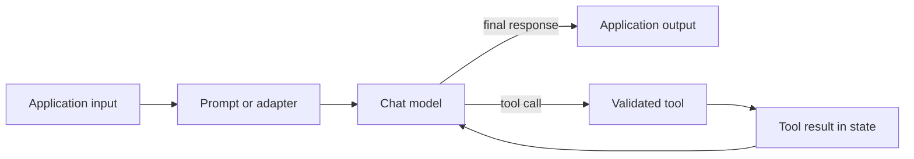

<TLDR>
  <TLDRCell label="what">
    LangChain 1.x 是用来组合模型调用与工具的 Python 框架，`create_agent` 是它的高层智能体框架。
  </TLDRCell>
  <TLDRCell label="when">
    当统一的模型接口、可组合执行或可定制工具循环能省去自建基础设施时，可以使用它。
  </TLDRCell>
  <TLDRCell label="how">
    从最小的可运行流水线开始，明确每一步的数据形状；只有需要模型在运行时选择动作时，才加入智能体。
  </TLDRCell>
</TLDR>

## LangChain 是什么，为什么需要它

LangChain 是一个大语言模型应用框架，用于组合模型、提示词、解析器、检索器、工具和有状态智能体运行时。在 1.x 版本线中，顶层 `langchain` 包聚焦智能体，`langchain-core` 则提供底层共享抽象。各模型服务商的客户端位于独立集成包中，因此安装 LangChain 并不会装入所有模型 SDK。

这个框架处理的是模型调用周围反复出现的衔接工作。应用需要规范化消息、传递配置、把输出接到下一步输入、流式传送事件、追踪执行、把函数暴露为工具，有时还要重复模型与工具之间的循环。LangChain 为这些操作提供统一接口，使其可以组合和检查。

抽象有明确的边界。两个聊天模型服务商即使实现了同一接口，在内容块、工具调用行为、令牌计量、错误和流式细节上仍可能不同。LangChain 能减少适配代码，却不会让模型在语义上完全等价。

当一次直接 SDK 调用已经演变为执行工作流，或你需要带工具、中间件和持久化钩子的智能体框架时，就会用到 LangChain。只有一次请求、后续全是普通应用代码的场景，可能不需要框架。控制流已经清晰且稳定时，先从直接调用开始。

LangChain、LangGraph 与 LangSmith 各自解决不同问题。LangChain 提供高层模型和智能体 API，LangGraph 提供底层图编排与持久状态，LangSmith 提供追踪和评估服务。LangChain 智能体运行在 LangGraph 上，但使用 `create_agent` 不要求你亲自编写图。

## LangChain 的执行方式

核心执行契约是<Term id="runnable">可运行单元（runnable）</Term>：接收输入并产生输出的工作单元。提示词、聊天模型、输出解析器、检索器和适配器都可以实现这个契约。常用入口包括 `invoke`、`ainvoke`、`batch` 和 `stream`，但批处理或流式处理的实际效果取决于具体组件。

管道操作符会构建一条顺序链，把每一步输出交给下一步。这种组合写法通常称为<Term id="langchain-expression-language">LangChain 表达式语言（LangChain Expression Language，LCEL）</Term>。由可运行单元组成的字典会建立并行分支，每个分支收到同一输入；`RunnableBranch` 则选择第一个谓词匹配的分支。

智能体在此基础上加入由模型控制的循环。`create_agent` 调用聊天模型，执行模型返回的工具调用，把工具结果追加到消息状态，再次调用模型，直到模型给出最终回复或运行停止。下一步动作由模型选择；工具定义、授权、状态、限制和副作用策略仍由你的代码负责。



图中的直线路径是可运行单元序列。回到模型的边则是<Term id="agent-loop">智能体循环（agent loop）</Term>。检索、结构化输出、护栏和人工批准都能插入这两种结构，但每增加一项能力，就多出一层需要测试的契约。

配置与普通输入一同传递，但不会变成业务数据。`RunnableConfig` 可以携带回调、标签、元数据、并发限制和组件专用的可配置值。智能体持久化还需要稳定的线程标识符，检查点保存器才能加载正确状态。

## 示例

### 无网络请求的提示词流水线

第一条流水线会格式化消息、调用确定性的测试模型，再把返回消息解析成字符串。`FakeListChatModel` 是 `langchain-core` 提供的测试替身；应用代码中应替换为服务商集成。第一个示例保持离线运行，使输出可以复现，也能清楚展示三次数据形状转换。

<Depth level="quick">

```python run title="prompt_pipeline.py"
from langchain_core.language_models.fake_chat_models import FakeListChatModel
from langchain_core.output_parsers import StrOutputParser
from langchain_core.prompts import ChatPromptTemplate

prompt = ChatPromptTemplate.from_messages([
    ("system", "You write concise support updates."),
    ("human", "Report the status of order {order_id}."),
])
model = FakeListChatModel(
    responses=["Order A-17 is packed and ready for pickup."]
)
chain = prompt | model | StrOutputParser()

input_data = {"order_id": "A-17"}
print(prompt.invoke(input_data).to_string())
print(chain.invoke(input_data))
```

```text
System: You write concise support updates.
Human: Report the status of order A-17.
Order A-17 is packed and ready for pickup.
```

</Depth>

`prompt.invoke()` 返回包含消息的提示词值。聊天模型接收这个值并返回 `AIMessage`，随后 `StrOutputParser` 返回其中的文本内容。如果下游组件需要字典，这条流水线会在边界处失败，而不会自行猜测映射方式。

生产环境只需替换 `model` 变量所在的位置。例如，安装对应集成包并配置凭据后，服务商支持的聊天模型可以放在相同位置。接口兼容不等于回答或元数据完全一致，所以更换服务商后仍需重新运行契约测试与行为测试。

### 并行补充数据

`RunnableParallel` 把同一输入发送给每个具名子项，再把结果收集到一个字典中。这里两个分支都读取请求，但一个加载订单数据，另一个计算运输路线。输出键就是传给 `RunnableParallel` 的名称。

```python run title="parallel_enrichment.py"
from langchain_core.runnables import RunnableLambda, RunnableParallel

ORDERS = {
    "A-17": {"total": 128, "items": 3, "country": "FR"},
}


def load_order(request):
    return ORDERS[request["order_id"]]


def shipping_lane(request):
    return f"{request['warehouse']}->{ORDERS[request['order_id']]['country']}"


enrich_order = RunnableParallel(
    order=RunnableLambda(load_order),
    lane=RunnableLambda(shipping_lane),
)

result = enrich_order.invoke({
    "order_id": "A-17",
    "warehouse": "NL",
})
print(result)
```

```text
{'order': {'total': 128, 'items': 3, 'country': 'FR'}, 'lane': 'NL->FR'}
```

用 `RunnableLambda` 包装函数后，函数会获得可运行单元方法，也可以参与追踪与组合。这个包装器本身不会验证请求的数据形状。对于不可信或容易变化的数据，应在进入流水线的边界使用类型化模式或明确的验证步骤。

只有各分支相互独立时，才适合并行组合。如果一个分支依赖另一个分支的输出，应改用顺序链。即使结果字典的键稳定，也不要假定副作用的执行顺序。

### 分支与批量调用

这个示例先规范化支持工单，再交给第一个谓词匹配的分支。没有匹配两个专用分支的工单由默认可运行单元处理。调用 `batch` 会把同一流水线应用于多项输入，并按输入顺序返回结果。

```python run title="batch_routing.py"
from langchain_core.runnables import RunnableBranch, RunnableLambda


def normalize(ticket):
    return {**ticket, "message": ticket["message"].strip().lower()}


route = RunnableBranch(
    (lambda ticket: "refund" in ticket["message"],
     RunnableLambda(lambda ticket: f"billing:{ticket['id']}")),
    (lambda ticket: "password" in ticket["message"],
     RunnableLambda(lambda ticket: f"identity:{ticket['id']}")),
    RunnableLambda(lambda ticket: f"general:{ticket['id']}"),
)
pipeline = RunnableLambda(normalize) | route

tickets = [
    {"id": "T1", "message": " Refund not received "},
    {"id": "T2", "message": "PASSWORD reset"},
    {"id": "T3", "message": "Update address"},
]
print(pipeline.batch(tickets, config={"max_concurrency": 2}))
```

```text
['billing:T1', 'identity:T2', 'general:T3']
```

分支顺序属于程序行为：同时含有两个关键词的工单会进入计费分支，因为它的谓词排在前面。因此，谓词要么互斥，要么按明确优先级排列。应测试重叠情况，不要因为标签不同就假定分支互斥。

默认的同步 `batch` 实现可能在线程池中并行调用，具体集成也可以改写它，使用服务商原生批处理。`max_concurrency` 会限制遵守可运行配置的组件并发量。它不是请求速率契约，也不能替代服务商配额或应用背压。

### 确定性的工具调用智能体

智能体示例使用脚本化聊天模型，因此无需凭据或网络请求也能完整执行工具循环。第一个模型回复请求调用 `lookup_order`，智能体执行工具，再把结果交回模型生成最终回复。这个很小的 `bind_tools` 改写属于测试基础设施，不是生产模型适配器。

```python run title="tool_agent.py"
from langchain.agents import create_agent
from langchain.tools import tool
from langchain_core.language_models.fake_chat_models import FakeMessagesListChatModel
from langchain_core.messages import AIMessage


@tool
def lookup_order(order_id: str) -> str:
    """Return the shipping status for an order."""
    return f"{order_id} is packed"


class ScriptedToolModel(FakeMessagesListChatModel):
    def bind_tools(self, tools, *, tool_choice=None, **kwargs):
        return self


model = ScriptedToolModel(responses=[
    AIMessage(
        content="",
        tool_calls=[{
            "name": "lookup_order",
            "args": {"order_id": "A-17"},
            "id": "call-1",
            "type": "tool_call",
        }],
    ),
    AIMessage(content="Order A-17 is packed."),
])
agent = create_agent(model=model, tools=[lookup_order])
result = agent.invoke({
    "messages": [{"role": "user", "content": "Where is order A-17?"}],
})

for message in result["messages"]:
    print(message.type, repr(message.content))
```

```text
human 'Where is order A-17?'
ai ''
tool 'A-17 is packed'
ai 'Order A-17 is packed.'
```

返回状态包含原始用户消息、工具调用、工具结果和最终模型消息。当消息携带结构化工具调用时，空的 `AIMessage.content` 完全有效。应检查消息类型与工具调用字段，不要假定每条模型消息都是纯文本。

类型标注和文档字符串会帮助 LangChain 生成展示给模型的工具模式。这个模式只是输入契约；工具仍须认证调用者、授权订单访问、验证领域约束，并保证重试安全。模型决定调用函数，并不等于获得了执行该动作的权限。

## 陷阱

### 隐蔽的数据形状不匹配

> [!PITFALL]
> 一条很长的管道可能连接名义上都实现可运行接口、实际值却不兼容的组件，例如把 `AIMessage` 交给只接受字符串的函数。

**修复方法：** 明确每个边界的数据形状，并为中间结果编写小型契约测试。只有确实需要转换时，才插入 `StrOutputParser`、字段选择器或带验证的适配器。

### 1.x 以前的陈旧示例

> [!PITFALL]
> 生成代码经常从旧教程复制 `LLMChain`、`ConversationBufferMemory`、`initialize_agent` 或 `create_react_agent`，再把它们塞进 LangChain 1.x 项目。

**修复方法：** 优先使用可运行单元和 `create_agent`，保留旧导入前先检查 v1 迁移指南。旧式链已经移入 `langchain-classic`；添加这个包也许能让旧代码继续运行，却不会让设计自动变成当前做法。

### 被夸大的流式与批处理能力

> [!PITFALL]
> 调用 `.stream()` 或 `.batch()`，并不保证每个可运行单元都提供令牌级流式输出或单次服务商批量请求。

**修复方法：** 测试具体组件与集成。`RunnableLambda` 更适合非流式函数；默认批处理也可能只是客户端并行调用，而不是服务商批处理 API。

### 进程全局的对话状态

> [!PITFALL]
> 用模块级字典保存消息历史，可能把一个用户的上下文泄漏给另一个会话，而且进程重启后数据就会消失。

**修复方法：** 使用检查点保存器或持久存储，以经过认证的稳定线程键隔离状态，并定义保留与删除规则。交错运行两个用户，再重启进程；只证明本地单会话能够记忆，并不能证明隔离性或持久性。

### 重试有副作用的动作

> [!PITFALL]
> 超时后重试整个智能体，可能重复执行工具动作，即使第一次付款、邮件发送或工单创建已经在远端成功。

**修复方法：** 为有副作用的工具提供幂等键，并在工具边界持久化结果。重试应限于确认安全的操作；如果动作成本较高或难以撤销，还应要求人工批准。

### 把服务商中立误当作行为等价

> [!PITFALL]
> 更换模型类可能保留相同方法名，却改变工具选择、结构化输出支持、内容块、令牌用量和错误行为。

**修复方法：** 在配置附近保留服务商能力检查，每次变更模型或集成后都运行评估用例。代码可移植很有用，但实际行为仍由模型、服务商、提示词和工具集合共同决定。

## AI 时代

**生成代码在这里常犯的错**

模型经常把 LangChain 0.x 导入与 1.x 的 `create_agent` 混在一起，代码还没运行就已经自相矛盾。它们也会猜测管道中传递的全是字符串、调用 `ainvoke` 却忘记 `await`、把测试假模型当成生产实现，或者创建没有租户边界的内存历史字典。在智能体代码中，代价最高的错误往往发生在模型调用之外：生成的重试逻辑包住非幂等工具，造成真实动作重复执行。

**让 AI 检查**

- 列出每条可运行单元边上的具体输入与输出类型，包括消息类型和字典键。
- 对照已安装的 LangChain 1.x 软件包验证每个导入符号，并标出所有依赖 `langchain-classic` 的内容。
- 沿着一次完整的模型—工具—模型循环，追踪重试、线程标识符、授权检查和副作用。

**审查清单**

- 用格式错误、空值、重叠条件和服务商错误输入运行流水线；既断言最终回答，也断言中间数据形状。
- 交错使用两个会话 ID，再重启状态后端，分别测试隔离性与持久性。
- 让模型替身重复发出相同工具调用，确认授权与幂等性位于工具边界内部。

**提示词词汇**

使用准确术语：`Runnable input/output contract`（可运行单元输入输出契约）、`LCEL sequence`（LCEL 顺序链）、`RunnableParallel`、`RunnableBranch`、`chat message`（聊天消息）、`tool schema`（工具模式）、`agent loop`（智能体循环）、`checkpointer`（检查点保存器）、`thread_id`（线程标识符）、`idempotency key`（幂等键）、`provider capability`（服务商能力）。要求 AI 给出包含具体状态转换的执行轨迹；“让这段 LangChain 代码更健壮”没有指出需要验证哪个边界。

<Depth level="deep">

## 软件包与抽象边界

`langchain-core` 定义消息、提示词模板、输出解析器、工具和可运行协议。`langchain` 包增加了包括 `create_agent` 在内的高层智能体接口。服务商集成包基于这些共享接口实现聊天模型和其他服务。

这种拆分让核心包无需导入每一家服务商的 SDK。同时也要看到，导入成功只能证明软件包布局正确，不能证明凭据或远端能力可用。集成包可以独立于高层包演进，因此应有意识地锁定和升级它们。

`langchain-community` 包含许多社区维护的集成。不要因为它们都在这个包里，就一概断言质量可靠。把某项集成用作基础设施前，应检查其维护状态、依赖体积、安全边界以及同步与异步行为。

LangChain 1.x 缩小了主命名空间，把旧式链、检索器、索引辅助工具和其他旧功能移到了 `langchain-classic`。因此，`langchain` 更小，也更聚焦智能体。迁移时应先盘点符号，不要一遇到缺失导入就直接添加 `langchain-classic`。

### 可运行单元是契约，不是静态类型证明

`Runnable[Input, Output]` 表达概念上且通常可检查的契约，但 Python 组合仍可能把不匹配问题推迟到运行时。提示词模板可以接收映射，聊天模型可以接收提示词值或消息，输出解析器则可以返回字符串或结构化对象。管道操作符只负责连线，不会合成缺失字段。

`RunnableLambda` 会把 Python 可调用对象转换成可运行协议。它的可调用对象可以接收普通输入；在支持的签名中，也可以接收可运行配置或回调上下文。它适合短小适配器与确定性应用逻辑，不应成为藏匿无限工作流的地方。

顺序链从左到右运行。并行映射把同一个上游值交给每个子项，再合并具名结果。分支按顺序求值谓词，因此即使各子项输出类型相同，谓词及其顺序仍属于公开行为。

当组件暴露了有效类型时，`get_input_schema()`、`get_output_schema()` 和图检查可以辅助诊断。它们不能取代有代表性的执行测试，尤其是服务商消息可能包含文本、推理、图像或工具调用等内容时。应在应用把框架对象转换成领域对象的位置进行验证。

### 调用、并发与流式处理

同步和异步方法描述调用者如何等待，并不说明底层服务商是否有原生异步或批量传输。默认 `ainvoke` 的委派方式可能与服务商专用改写不同。依赖某种并发行为前，应检查具体集成并测量自己的请求路径。

`batch` 保留输入位置与返回位置的对应关系，`batch_as_completed` 则暴露完成顺序。并发上限能限制同时运行的可运行任务，却无法协调多个应用进程。分布式限速应放在能看见所有工作进程的共享边界。

流式处理也只能沿着能够转换数据块的组件继续传播。非流式步骤可能缓冲上游输出，延迟调用者实际看到内容的时间。如果渐进式交付很重要，应测试整个组合流水线的时间戳和事件类型，而不只是确认 `.stream()` 方法存在。

可运行配置有意与输入值分离。标签和元数据用于追踪，回调用来观察生命周期事件，可配置字段则改变已声明的组件行为。不要把秘密放进追踪元数据，也不要让用户输入选择不受限的可配置字段。

### 智能体状态与工具边界

`create_agent` 构建基于图的运行时，主要状态中包含消息。工具调用采用结构化表示，不是可信的指令字符串。运行时会匹配请求的工具，按工具模式验证参数，执行工具，再记录工具消息，随后进入下一轮模型调用。

模式验证只能回答参数形状是否符合预期。它无法判断当前用户能否读取某笔订单、文件路径是否停留在允许目录，或转账金额是否符合策略。这些决定属于工具边界之内或更底层的确定性应用代码。

短期记忆是线程范围内的智能体状态。检查点保存器持久化状态快照，使线程可以恢复；调用配置负责选择线程。长期记忆跨越线程，需要明确的存储、命名空间和数据生命周期，并不等同于不断追加全部历史消息。

智能体中间件可以在循环周围调整提示词、工具可用性、状态、护栏和模型选择。因此，中间件顺序属于可观察行为。每项中间件都应保持职责单一，记录自己读取或写入的状态，并测试组合效果，而不只是单独测试。

### 选择最小的控制结构

一次请求和一次回复足够时，直接调用模型。应用负责固定顺序的转换时，使用可运行顺序链。选择规则确定且应由代码掌控时，使用分支或并行可运行单元。

只有模型必须从多个工具中选择，或决定任务需要多少步骤时，才使用智能体。这种灵活性会用更大的测试面换取较少的固定控制流。向智能体开放有后果的工具前，应在循环外设置最大步数、超时、工具允许列表与批准点。

当你需要明确节点、转换、可恢复执行或人工中断，而高层智能体定制难以清楚表达这些需求时，可以转向 LangGraph。LangChain 组件仍可放在图节点内，继续发挥统一接口的作用。这些库是不同层级，并不是互斥的产品选择。

### 故障传播与重试范围

除非由组件或组合结构处理，可运行单元的异常会一直传播给调用者。这个默认行为能让失败保持可见，但面向用户的边界通常要把服务商错误和领域错误转换为明确的应用结果。日志应保留原始原因，却不能向用户暴露凭据或原始服务商载荷。

`with_retry` 会把重试行为附加到可运行单元。它应包住最小的瞬时故障操作，例如一次模型请求，而不是已经写入数据的整条顺序链。重试边界同时也是副作用边界。

回退项必须遵守下游组件所期待的输出契约。如果回退模型返回不同的内容形状，已经处理的服务商中断会变成后续解析器错误。主路径使用的契约测试也应覆盖回退路径。

智能体可能在失败前已经完成一部分工作。持久状态有助于恢复计算，却不会自动让外部动作具有事务性。应记录持久动作标识符，让恢复后的运行识别已经成功的工作。

### 可复现的测试接缝

把提示词与模型分开测试，模板错误就能确定性复现。用缺失字段和多余字段调用提示词，再检查生成消息的角色与内容。这样无需消耗模型配额，也能发现数据形状缺陷。

用脚本化模型消息测试工具调用、无效参数、多次调用和最终回复。智能体示例中的假模型很有用，因为模型选择虽然预先确定，状态转换仍是真实的。脚本化回答的质量不能作为生产模型质量的证据。

把工具当作 LangChain 包装器下的普通函数来测试。授权、验证、幂等性与错误映射都应在智能体不选择调用时仍可测试。随后再添加一项集成测试，确认暴露的模式会把模型参数映射到同一个受检查函数。

自然语言输出的快照测试很脆弱，但稳定结构适合使用快照。应断言消息类型、工具名称、参数模式、来源标识符和领域结果字段。回答质量则应通过用例和判定标准评估，而不是比对唯一的精确文本。

### 不改变信任边界的追踪

标签和元数据可以让运行易于搜索，也能在追踪中关联相关组件。应使用不透明标识符，不要放入原始提示词、电子邮件地址、访问令牌或文档正文。追踪存储也是数据系统，需要自己的访问和保留策略。

追踪能展示发生了什么，却不能判断回答是否正确。执行追踪应配合评估，检查任务结果、检索证据、工具授权与失败处理。一条看似完整的追踪，记录的运行仍可能错误或不安全。

回调与中间件可以在许多层级观察或改变执行。每个钩子都应职责单一，还要明确钩子自身失败时如何处理。监控故障不应悄悄把已经成功的业务操作变成一次副作用重试。

从请求开始，通过可运行配置一直把关联标识符传入工具日志。关联标识符要与授权身份分开：前者用于连接记录，后者用于授予访问权限。混淆二者会让日志看似可以归因，却没有提供真正的安全决策。

### 依赖版本验证

记录测试所用 `langchain`、`langchain-core` 与集成包的确切版本。宽泛的 1.x 约束用来描述 API 世代，锁文件与实际执行过的示例则表明验证的是哪个具体构建。

还要在依据该锁文件构建的干净环境中重复导入与执行检查。否则，全局安装的软件包可能掩盖部署环境从未声明的依赖。

</Depth>

<Checkpoint id="ai/langchain" />

## 延伸阅读

- [LangChain 概览](https://docs.langchain.com/oss/python/langchain/overview)
- [模型与服务商接口](https://docs.langchain.com/oss/python/langchain/models)
- [智能体与 `create_agent`](https://docs.langchain.com/oss/python/langchain/agents)
- [LangChain v1 变化与迁移](https://docs.langchain.com/oss/python/releases/langchain-v1)
