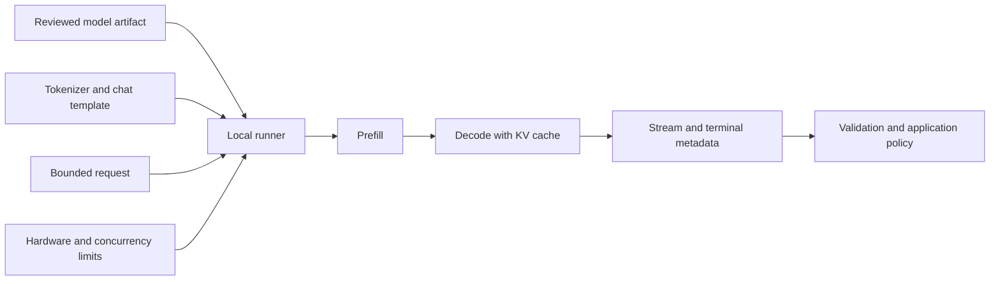

<TLDR>
  <TLDRCell label="what">
    A local large language model (local LLM) keeps the model artifacts and inference process on
    hardware you control; an application calls it in process or through a local service.
  </TLDRCell>
  <TLDRCell label="when">
    Consider local inference when data cannot go to an external service, the network may be unavailable,
    or a steady workload merits self-hosting; test model capability, hardware capacity, and operating cost.
  </TLDRCell>
  <TLDRCell label="how">
    Pin the model artifact and runner, calculate the raw-weight floor, then leave room for context,
    the KV cache, and concurrency; use domain evaluations plus cold and warm measurements to decide whether to ship.
  </TLDRCell>
</TLDR>

## What it is and why it exists

A <Term id="large-language-model">large language model (LLM)</Term> predicts subsequent
<Term id="token">tokens</Term> from existing context. With a local LLM, the model weights, runner,
and inference state live on a device you control instead of sending each request to a hosted API.
That device may be a laptop, workstation, or private server. "Local" describes the deployment boundary;
it neither says that the model is small nor guarantees a completely offline system.

This arrangement first addresses data boundaries and availability. Input, output, and runtime logs can remain
inside your infrastructure, and inference can continue without an internet connection. Model downloads,
telemetry, update checks, log forwarding, and backups may still create external data flows, though.
A genuinely offline deployment requires checking and disabling every channel you do not need.

Local inference also returns operational responsibility to your team. Capacity planning, patches, model updates,
rate limits, monitoring, and recovery no longer belong to a cloud provider. Owned hardware does not make inference free:
power, machine time, engineering work, and idle capacity still cost money, and a local service does not gain
more accelerator memory when traffic spikes.

Good local workloads tend to have a clear data boundary, an acceptable model, and a fairly steady load.
Internal document classification, offline drafting, and repeatable development tests can fit. If a task depends
on the strongest hosted model, multi-region elasticity, or a formal service-level agreement, local deployment
is unlikely to be the default. Compare quality, latency, throughput, and cost on the same evaluation inputs.

Ollama and llama.cpp solve model-running and serving problems; they do not prove that a model fits your business.
Ollama provides model management, a command line, and a local HTTP API. llama.cpp runs GGUF artifacts directly
and offers command-line and compatible HTTP servers. Neither replaces model-card and license review,
domain evaluation, or application-level input and output validation.

## How it works

A local inference stack needs four mutually compatible parts. The model artifact contains weights and metadata,
the tokenizer maps text to tokens, the chat template arranges messages in the form the model saw during training,
and the runner executes computation on a CPU, GPU, or another backend. Similar-looking labels do not establish
compatibility. A mismatched template or tokenizer can run successfully while producing consistently poor results.

During loading, the runner maps weights into system or accelerator memory and allocates runtime buffers.
After a prompt arrives, it first performs prefill over all input tokens. Decode follows and produces one token,
or a small group of tokens, at each step. Streaming returns completed fragments to the caller sooner,
but it does not remove the computation needed to finish the generation.

A <Term id="context-window">context window</Term> limits the tokens a model can access in one request.
Input, system instructions, conversation history, and reserved output all consume that budget. During inference,
the <Term id="kv-cache">key-value cache (KV cache)</Term> retains attention state already computed for prior tokens,
so each decode step need not recompute the entire history. It grows with context, batch size, and concurrent slots.

<Term id="quantization">Quantization</Term> uses lower-precision representations for some model data,
most often its weights. This usually reduces artifact size and weight memory, but it does not shrink the tokenizer,
runtime buffers, or KV cache by the same proportion. Lower precision can also change output quality.
The effect depends on the model, quantization method, and task, so one universal percentage would be misleading.

<Term id="gguf">GGUF</Term> is the model file format used by llama.cpp. It packages tensors with standardized
metadata for loading and distribution. A GGUF file is still not a complete release record: preserve the license,
provenance, evaluations, runner version, and artifact digest separately. Ollama can hide some file-management detail,
but a team still needs to know the exact model and quantization it loaded.



The diagram ends at application policy, not at model output. Text generated on your own machine can still be wrong,
out of bounds, or influenced by malicious instructions in the prompt. The application must inspect completion state,
parse the result, and enforce domain constraints. Permission decisions and external side effects stay outside the model.

### Choosing a runner and artifact

Start with requirements, not a leaderboard. Record the allowed licenses, deployment operating system, available memory,
maximum context, concurrency target, acceptable latency, and domain cases that must pass. Only then shortlist models
and quantizations and measure them on the target machine. Parameter count roughly describes weight scale;
it does not establish quality, speed, or peak memory.

With Ollama, the local API defaults to `http://localhost:11434/api`. `/api/generate` accepts fields including `model`,
`prompt`, `stream`, and runtime options. A streamed response consists of multiple JSON objects; its terminal object
contains `done` plus timing and token counts. The API is not strictly versioned, so pin the Ollama version
and keep contract tests for every response field your application needs.

For llama.cpp, the current entry points are `llama-cli` and `llama-server`, and source builds use CMake.
`llama-server` can expose an OpenAI-compatible HTTP interface. The old draft's `./main`, `./server`,
and Make-first build commands are stale. Do not copy them from an old tutorial into a current deployment script.

Before downloading a model, check its publisher, license, model card, file list, and digest. A model tag may move
to a different artifact, so recording only a mutable label may not reproduce the same bytes during rollback.
Preserve the source, immutable revision or digest, quantization, template, and runner version, then evaluate
that combination with the application release.

## Examples

The next three executable examples cover a capacity floor, request budgeting, and stream completion in that order.
They do not download a model, so their output is deterministic and easy to verify in a normal Python environment.
Real model generations are probabilistic evaluation artifacts. They should be saved from a real runner,
not passed off as output from an editorial environment without one.

### Calculate the weight-memory floor

The theoretical weight floor is the parameter count multiplied by the number of bits per weight.
This example uses the decimal `8B` parameter count and converts the result to binary GiB.
The number answers "about how large are the bare weights," not "will this model run on the device."

<Depth level="quick">

```python run title="weight_floor.py"
from dataclasses import dataclass


@dataclass(frozen=True)
class WeightPlan:
    parameters_billions: float
    bits_per_weight: int

    def gib(self) -> float:
        bits = self.parameters_billions * 1_000_000_000 * self.bits_per_weight
        return bits / 8 / (1024**3)


for bits in (16, 8, 4):
    plan = WeightPlan(parameters_billions=8, bits_per_weight=bits)
    print(f"8B at {bits:>2} bit: {plan.gib():.2f} GiB of raw weights")

print("Add memory for metadata, runtime buffers, and the KV cache.")
```

```text
8B at 16 bit: 14.90 GiB of raw weights
8B at  8 bit: 7.45 GiB of raw weights
8B at  4 bit: 3.73 GiB of raw weights
Add memory for metadata, runtime buffers, and the KV cache.
```

</Depth>

A real GGUF file can differ from that multiplication because of block proportions, scales, and metadata.
At run time, the computation graph, temporary buffers, KV cache, and driver also need space. Use this result
only as a floor that eliminates plainly unsuitable candidates, then observe actual peak memory with the target
runner, context, and concurrency settings.

### Build a bounded request

An application should not give arbitrary input the entire context window. The following builder expects its caller
to count input tokens with the target model's tokenizer and then checks the input and maximum-output total.
`num_ctx` selects the runtime context, while `num_predict` limits how many tokens Ollama may generate.

```python run title="request_budget.py"
import json


def build_request(model, prompt, input_tokens, context_limit, max_output):
    if input_tokens + max_output > context_limit:
        raise ValueError("input and output budgets exceed the context limit")

    return {
        "model": model,
        "prompt": prompt,
        "stream": False,
        "options": {"num_ctx": context_limit, "num_predict": max_output},
    }


request = build_request("gemma4", "Return one short status line.", 180, 4096, 96)
print(json.dumps(request, indent=2))

try:
    build_request("gemma4", "Oversized input", 4050, 4096, 96)
except ValueError as error:
    print(f"rejected: {error}")
```

```text
{
  "model": "gemma4",
  "prompt": "Return one short status line.",
  "stream": false,
  "options": {
    "num_ctx": 4096,
    "num_predict": 96
  }
}
rejected: input and output budgets exceed the context limit
```

The `180` in this example is a caller-supplied measurement, not a guess from character count. Different tokenizers
split the same text differently, and a chat template adds special tokens. Production code should count the complete
request with the tokenizer distributed with the model, then explicitly reject, chunk, or truncate by a tested rule.
Silently dropping the earliest messages changes the task's meaning.

After installing Ollama and reviewing a model, the following current command starts interactive inference.
Ollama is absent from this editorial environment, so there is no fabricated model answer;
`gemma4` comes from the official quick start checked during this review.

```bash
# not executed here: Ollama is not installed in the editorial runner
ollama run gemma4
```

```text
Not executed in this environment.
```

### Collect a stream and its terminal metadata

A streaming client must distinguish content fragments from the final terminal object. This example consumes
an intentionally constructed contract-test trace whose fields match Ollama's `/api/generate` response;
it is not a hardware benchmark. The code accepts a result only after it sees `done`, then calculates generation
rate from the nanosecond duration and token count in that terminal object.

```python run title="stream_metrics.py"
import json


trace = [
    '{"response":"Local", "done":false}',
    '{"response":" inference", "done":false}',
    '{"response":" is ready.", "done":false}',
    '{"response":"", "done":true, "done_reason":"stop", '
    '"eval_count":60, "eval_duration":3000000000}',
]


def collect(events):
    text = []
    final = None
    for line in events:
        event = json.loads(line)
        text.append(event.get("response", ""))
        if event.get("done"):
            final = event

    if final is None:
        raise ValueError("stream ended without a terminal event")
    return "".join(text), final


answer, final = collect(trace)
seconds = final["eval_duration"] / 1_000_000_000
rate = final["eval_count"] / seconds
print(answer)
print(f"done_reason={final['done_reason']}")
print(f"generation_rate={rate:.1f} token/s")
```

```text
Local inference is ready.
done_reason=stop
generation_rate=20.0 token/s
```

The displayed rate verifies arithmetic only: the test trace deliberately supplies `60` tokens and three seconds.
When evaluating a real service, separately record load time, input-evaluation time, time to first visible fragment,
and end-to-end latency. If the connection closes before a terminal object arrives, mark accumulated text incomplete.
A retry starts a new generation and cannot resume the old stream.

## Pitfalls

> [!PITFALL]
> "Runs on my machine" does not automatically mean "data never leaves the machine." A runner may support cloud models
> or network features, while application logs and system backups may copy prompts and responses elsewhere.

**Fix:** map data flows for downloads, inference, logging, telemetry, and backups. When you need local-only operation,
disable cloud features and test an offline start. Log only approved, redacted diagnostic fields, and give model-cache
and log directories file permissions and retention rules that match the data's sensitivity.

> [!PITFALL]
> Selecting a quantization by parameter count or filename alone. Architectures, templates, quantization methods,
> and runner backends can differ at the same parameter count. Fitting in memory proves neither quality nor latency.

**Fix:** pin the complete artifact identity and runner version, then run representative, boundary, and adversarial cases
on the target hardware. Put quality results beside peak memory, cold-start time, time to first token,
and sustained generation rate in the same decision record.

> [!PITFALL]
> Treating quantized weight size as total memory demand. Long contexts, concurrent slots, runtime buffers,
> and partial CPU offload all change memory use and latency. Near the capacity limit, jitter or load failure becomes likely.

**Fix:** use the weight formula as a floor, then measure the peak at the planned `num_ctx`, concurrency, and backend.
The capacity test should include the longest allowed input and output and retain headroom. If the target remains unstable,
reduce context, concurrency, or model size.

> [!PITFALL]
> Treating a clean stream close as a complete generation, or concatenating text while discarding the final `done_reason`.
> Length truncation, service errors, and mid-stream disconnects can then send half an answer downstream.

**Fix:** commit a result only after the protocol's terminal event, preserve the stop reason and counts,
and give incomplete output a distinct state. Bound retries. A new request is a new generation,
and any downstream side effect also needs idempotency controls outside the model call.

> [!PITFALL]
> Presenting a warm-cache, single-request, short-prompt demonstration as production performance. Initial loading,
> long-prompt prefill, request queues, and CPU offload can each be the bottleneck, which one average tokens/s figure hides.

**Fix:** measure cold starts and warm requests separately. Report time to first token, end-to-end latency,
input-evaluation rate, generation rate, and queue time. Use percentiles from the real input-length and concurrency
distribution, and run quality evaluation at the same time so speed does not excuse unusable output.

<Depth level="deep">

## What quantization changes

Weight quantization maps floating-point weights to fewer discrete values and stores auxiliary data such as scales
needed for computation. "4 bit" is therefore not a promise that the complete file uses exactly half a byte per parameter.
Different GGUF quantization types can represent different tensors differently and add block metadata.
Use the actual artifact size and the runner's report.

Lower precision often lets more weights stay in a faster memory tier, but speed does not necessarily improve
in proportion to compression. Dequantization kernels, memory bandwidth, the device backend, and CPU/GPU partitioning
all matter. A smaller artifact may accelerate one machine while computation or data movement remains the bottleneck
on another. Compare only measurements from the same machine, context, and output budget.

Quality loss has no universal ordering either. Summarization, source code, structured output, and multilingual tasks
can react differently to one quantization, while an average benchmark score can hide a business-critical failure.
Keep an unquantized or higher-precision candidate as the baseline, compare outputs case by case,
and record the evaluation set and randomness settings.

Quantization usually changes only part of memory use. A model still needs unquantized runtime state,
temporary buffers, and a KV cache; a multimodal model may load additional encoders. Download size alone
cannot determine maximum context or concurrency, and "the file is smaller than VRAM" does not prove
that the complete workload will stay on the GPU.

## Context, cache, and concurrency

Prefill processes every token in the request, so a long prompt can increase the wait for the first output token.
Decode repeatedly reads weights and updates the active sequence's cache. Prompt-evaluation and sustained-generation
rates are therefore separate measurements. Combining them into one average explains neither interactive behavior
nor the capacity of long-document requests.

Exact KV-cache bytes depend on the model architecture, layer count, KV heads, cache data type, sequence length,
and runner implementation. Multi-query or grouped-query attention changes the cache shape, and some runners support
cache quantization. This is why this topic has no "fixed bytes per token" table. Read the selected model's metadata
and observe the actual allocation.

Concurrency does not duplicate throughput for free. A service may allocate a separate cache for each sequence,
batch requests, or queue them; the runner version and configuration choose the policy. Batching may improve throughput
while increasing an individual request's wait. A capacity test needs the target concurrency and input lengths,
not a handful of short simultaneous prompts followed by one average rate.

The context limit includes the output budget. If an application fills the history before asking for generation,
the runner can only reject, truncate, or reduce output, and each behavior can break the protocol.
The request builder should enforce a policy early and tell the user when content is rejected or compressed
instead of relying on an implicit runner default.

## A reproducible local service boundary

A reproducible deployment records the model source, immutable revision or file digest, quantization type,
chat template, runner version, and launch arguments. Hardware backends, drivers, and numerical kernels also change speed
and can occasionally change borderline outputs. Link the release record to domain-evaluation results so rollback
restores a tested combination rather than a similar-looking model name.

Bind a local service to a loopback address first. If other machines need access, place a configured network boundary
in front of it and provide authentication, resource authorization, transport protection, rate limits, and auditing
for the actual deployment. An HTTP target is not trusted merely because it is on an internal network;
browser extensions, compromised developer tools, and same-segment processes can all become callers.

Model artifacts are supply-chain inputs. Check the publisher and license, prefer inspectable formats,
and separately approve and isolate any loading path that executes custom code. Revoking a download credential
does not delete files already in a cache. Cache ownership, backup, and deletion procedures belong in local data governance.

Run two kinds of test before release. Contract tests use fixed responses to exercise request fields, stream parsing,
timeouts, and terminal branches without loading a large model each time. Integration tests load the real artifact
on the target machine and verify offline startup, longest context, concurrency, quality, and resource peaks.
The two suites answer different questions; neither substitutes for the other.

</Depth>

<Checkpoint id="ai/local-llms" />

## Further reading

- [Ollama README and quick start](https://raw.githubusercontent.com/ollama/ollama/main/README.md)
- [Ollama API reference](https://raw.githubusercontent.com/ollama/ollama/main/docs/api.md)
- [Ollama context length](https://raw.githubusercontent.com/ollama/ollama/main/docs/context-length.mdx)
- [llama.cpp README and quick start](https://raw.githubusercontent.com/ggml-org/llama.cpp/master/README.md)
- [Hugging Face GGUF documentation](https://huggingface.co/docs/hub/en/gguf)
