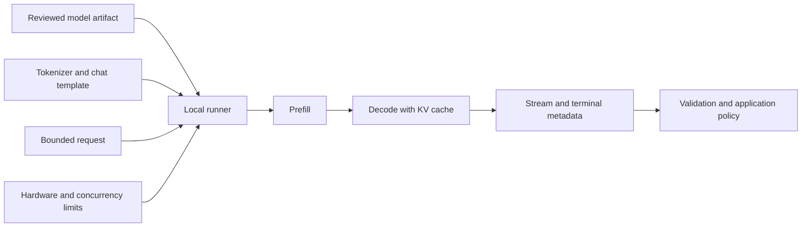

<TLDR>
  <TLDRCell label="what">
    本地大语言模型（local LLM）把模型制品和推理进程放在你控制的硬件上，
    应用通过进程内接口或本机服务调用它。
  </TLDRCell>
  <TLDRCell label="when">
    当数据不能交给外部服务、网络不可用，或固定负载值得自行运维时考虑本地推理；
    模型能力、硬件容量和维护成本必须用实际工作负载验证。
  </TLDRCell>
  <TLDRCell label="how">
    固定模型制品与运行器版本，先算权重内存下限，再为上下文、KV 缓存和并发留空间；
    最后用领域评测与冷、热两类运行指标决定是否上线。
  </TLDRCell>
</TLDR>

## 是什么，为什么存在

<Term id="large-language-model">大语言模型（large language model，LLM）</Term>会根据已有上下文预测后续
<Term id="token">词元（token）</Term>。本地 LLM 指模型权重、运行器和推理所需的状态位于你控制的设备上，
而不是每次都把请求发送给外部托管 API。设备可以是一台笔记本、工作站或内网服务器；
「本地」描述部署边界，不代表模型一定小，也不等同于完全离线。

这个部署方式首先解决数据边界和可用性问题。输入、输出以及运行日志可以留在自己的基础设施中，
断网后仍可提供推理，调用也不需要跨公网往返。不过模型下载、遥测、更新检查、日志转发和备份仍可能产生外部数据流；
只有逐项检查并关闭不需要的通道，才算真正的离线部署。

本地推理也把责任移回团队。云服务商原本承担的容量规划、补丁、模型更新、限流、监控和故障恢复，
现在都需要由你处理。硬件已经购置并不意味着推理免费：电力、机器占用、工程时间和闲置容量仍有成本，
而负载突增时，本机服务不会自动获得更多显存。

适合本地运行的任务通常有明确的数据边界、可接受的模型能力和相对稳定的负载。例如，内网文档分类、
离线草稿生成或开发阶段的可重复测试都可能合适。如果任务依赖最强的托管模型、跨区域弹性或正式服务等级协议，
本地部署往往不是默认答案。选择应来自同一套评测输入上的质量、延迟、吞吐和成本数据。

Ollama 和 llama.cpp 解决的是运行与服务问题，不负责证明模型适合业务。Ollama 提供模型管理、命令行和本机 HTTP API；
llama.cpp 直接运行 GGUF 制品，并提供命令行与兼容 HTTP 服务。两者都不能替代模型卡、许可证审查、
领域评测以及应用层的输入输出验证。

## 工作原理

一次本地推理需要四层能够彼此匹配的材料。模型制品包含权重与元数据，分词器把文本映射为词元，
聊天模板把消息排成模型训练时预期的形式，运行器则在 CPU、GPU 或其他后端上执行计算。
标签相似不保证这些材料兼容；混用模板或分词器时，程序可能正常运行，却持续给出异常结果。

加载阶段把模型权重映射到系统内存或显存，并为运行时缓冲区分配空间。提示词进入后，运行器先执行
prefill，也就是处理全部输入词元；随后进入 decode，每一步生成一个或一小组后续词元。
流式接口会把已生成片段尽快交给调用方，但它不会减少模型完成整次生成所需的计算。

<Term id="context-window">上下文窗口（context window）</Term>限制模型一次能够访问的词元总量。
输入、系统指令、对话历史和预留输出都要计入预算。推理过程中，
<Term id="kv-cache">键值缓存（KV cache）</Term>保存注意力层已经计算过的中间状态，
避免生成每个新词元时重算全部历史；它会随上下文、批量和并发槽位增长。

<Term id="quantization">量化（quantization）</Term>用较低精度表示部分模型数据，最常见的目标是权重。
这样通常能减小制品和权重内存，但不会按同一比例缩小分词器、运行时缓冲区或 KV 缓存。
低位宽也可能改变输出质量，而且影响取决于模型、量化方案和任务，不能用一个通用百分比概括。

<Term id="gguf">GGUF</Term>是 llama.cpp 使用的模型文件格式。它把张量与标准化元数据放在同一制品中，
便于加载和分发。GGUF 文件仍不是完整的发布记录：许可证、来源、评测结果、运行器版本和制品摘要需要另外保存。
Ollama 可以隐藏部分文件管理细节，但团队仍应知道实际加载了哪个模型与量化版本。



图中的终点不是模型输出，而是应用策略。生成文本即使来自自己的机器，仍然可能错误、越界或包含提示词中的恶意指令。
应用必须检查完成原因、解析结果并执行领域约束；权限判断和外部副作用不能交给模型。

### 选择运行器与制品

从需求开始，而不是从排行榜开始。先写清允许的许可证、部署操作系统、可用内存、最大上下文、并发目标、
可接受延迟和必须通过的领域案例。随后才筛选模型与量化，并在目标机器上测量；参数量只能粗略说明权重规模，
不能证明质量、速度或内存峰值。

使用 Ollama 时，本机 API 默认位于 `http://localhost:11434/api`。`/api/generate` 接受 `model`、`prompt`、
`stream` 和运行选项等字段，流式响应以多个 JSON 对象返回，终止对象带有 `done` 及计时和词元计数。
API 并不严格按版本编号，因此部署需要固定 Ollama 版本，并为依赖的字段保留契约测试。

使用 llama.cpp 时，当前入口是 `llama-cli` 和 `llama-server`，源码构建使用 CMake。
`llama-server` 可以提供兼容 OpenAI 风格的 HTTP 接口。旧草稿中的 `./main`、`./server` 和以 `make` 为主的构建命令已经过时，
不能从旧教程直接复制到当前部署脚本。

下载模型前检查发布者、许可证、模型卡、文件清单和摘要。模型标签可能移动到新制品；
如果运行器只记录可变标签，回滚时未必能恢复同一组字节。保留下载来源、不可变修订或摘要、量化类型、
模板以及运行器版本，并把它们和应用发布一起评测。

## 示例

下面三个可执行示例依次处理容量下限、请求预算和流式终止状态。它们不下载模型，
因此输出是确定性的，并可在普通 Python 环境中复核。真正的生成结果具有概率性，应作为评测制品保存，
不应伪装成在没有模型运行器的编辑环境中得到的输出。

### 先算权重内存下限

权重的理论下限是参数数量乘以每个权重的位数。这里使用十进制的 `8B` 参数数，
再把结果换算为二进制 GiB。这个数字只回答「裸权重大约占多少」，不回答模型能否在该设备上运行。

<Depth level="quick">

```python run title="weight_floor.py"
from dataclasses import dataclass


@dataclass(frozen=True)
class WeightPlan:
    parameters_billions: float
    bits_per_weight: int

    def gib(self) -> float:
        bits = self.parameters_billions * 1_000_000_000 * self.bits_per_weight
        return bits / 8 / (1024**3)


for bits in (16, 8, 4):
    plan = WeightPlan(parameters_billions=8, bits_per_weight=bits)
    print(f"8B at {bits:>2} bit: {plan.gib():.2f} GiB of raw weights")

print("Add memory for metadata, runtime buffers, and the KV cache.")
```

```text
8B at 16 bit: 14.90 GiB of raw weights
8B at  8 bit: 7.45 GiB of raw weights
8B at  4 bit: 3.73 GiB of raw weights
Add memory for metadata, runtime buffers, and the KV cache.
```

</Depth>

真实 GGUF 文件可能因为分块比例、缩放因子和元数据而偏离简单乘法。运行时还要为计算图、临时缓冲区、
KV 缓存和驱动保留空间。正确做法是把这个结果当作淘汰明显不合适候选的下限，
然后在目标运行器、上下文与并发设置下观察实际峰值。

### 构造有边界的请求

应用不应把最大上下文直接交给任意输入。下面的构造器要求调用方先用目标模型的分词器得到输入词元数，
再检查输入与最大输出之和。`num_ctx` 选择运行上下文，`num_predict` 限制 Ollama 生成的词元数量。

```python run title="request_budget.py"
import json


def build_request(model, prompt, input_tokens, context_limit, max_output):
    if input_tokens + max_output > context_limit:
        raise ValueError("input and output budgets exceed the context limit")

    return {
        "model": model,
        "prompt": prompt,
        "stream": False,
        "options": {"num_ctx": context_limit, "num_predict": max_output},
    }


request = build_request("gemma4", "Return one short status line.", 180, 4096, 96)
print(json.dumps(request, indent=2))

try:
    build_request("gemma4", "Oversized input", 4050, 4096, 96)
except ValueError as error:
    print(f"rejected: {error}")
```

```text
{
  "model": "gemma4",
  "prompt": "Return one short status line.",
  "stream": false,
  "options": {
    "num_ctx": 4096,
    "num_predict": 96
  }
}
rejected: input and output budgets exceed the context limit
```

示例中的 `180` 是调用方已经测得的值，不是按字符数猜出的值。不同分词器会把同一段文本拆成不同数量的词元，
聊天模板还会加入特殊词元。生产代码应使用随模型发布的分词器计算完整请求，
并明确选择拒绝、分块或按经过测试的规则截断；静默删除最早消息会改变任务语义。

安装 Ollama 并审核模型后，可以用下面的当前命令启动交互式推理。本编辑环境没有 Ollama，
所以没有编造一段模型回答；`gemma4` 来自本次核对的官方快速入门。

```bash
# not executed here: Ollama is not installed in the editorial runner
ollama run gemma4
```

```text
Not executed in this environment.
```

### 收齐流式结果与终止元数据

流式客户端必须把普通片段与最后的终止对象分开处理。下面使用一个刻意构造的契约测试记录，
其字段与 Ollama `/api/generate` 的响应一致；它不是硬件基准。代码只有在看到 `done` 后才接受结果，
并用终止对象中的纳秒计时与词元数计算生成速率。

```python run title="stream_metrics.py"
import json


trace = [
    '{"response":"Local", "done":false}',
    '{"response":" inference", "done":false}',
    '{"response":" is ready.", "done":false}',
    '{"response":"", "done":true, "done_reason":"stop", '
    '"eval_count":60, "eval_duration":3000000000}',
]


def collect(events):
    text = []
    final = None
    for line in events:
        event = json.loads(line)
        text.append(event.get("response", ""))
        if event.get("done"):
            final = event

    if final is None:
        raise ValueError("stream ended without a terminal event")
    return "".join(text), final


answer, final = collect(trace)
seconds = final["eval_duration"] / 1_000_000_000
rate = final["eval_count"] / seconds
print(answer)
print(f"done_reason={final['done_reason']}")
print(f"generation_rate={rate:.1f} token/s")
```

```text
Local inference is ready.
done_reason=stop
generation_rate=20.0 token/s
```

输出中的速率只验证公式：测试记录故意给出 `60` 个词元和 `3` 秒生成时间。
评测真实服务时还应分别记录加载时间、输入处理时间、首个可见片段时间和端到端延迟。
连接在终止对象之前断开时，已有文本只能标记为不完整；重新请求会产生新一次生成，不能当作原流的无缝续传。

## 陷阱

> [!PITFALL]
> 「在本机运行」不自动等于「数据不会离开机器」。运行器可能支持云模型或联网功能，
> 应用日志与系统备份也可能复制提示词和输出。

**修复方法：** 画出下载、推理、日志、遥测和备份的数据流。需要纯本地模式时关闭云功能并验证断网启动，
只记录经过删减的诊断字段。模型缓存和日志目录也要使用与数据敏感度相符的文件权限和保留策略。

> [!PITFALL]
> 只看模型参数量或文件名选择量化版本。相同参数量的架构、模板、量化方法和运行后端可能不同，
> 文件能装入内存也不代表质量与延迟合格。

**修复方法：** 固定完整制品标识与运行器版本，在目标硬件上运行代表性、边界和对抗案例。
把质量结果与内存峰值、冷启动、首词元延迟和持续生成速率放在同一份决策记录中。

> [!PITFALL]
> 把量化后的权重大小当作总内存需求。长上下文、多个并发槽位、运行时缓冲区和部分 CPU 卸载
都会改变内存占用与延迟，接近容量上限时尤其容易出现抖动或加载失败。

**修复方法：** 先用权重公式估算下限，再在计划的 `num_ctx`、并发数和后端上测峰值。
容量测试要包含最长允许输入与输出，并保留安全余量；无法稳定满足目标时，降低上下文、并发或模型规模。

> [!PITFALL]
> 流式客户端把连接正常关闭当作生成完成，或者只拼接文本而丢掉最后的 `done_reason`。
这会把长度截断、服务错误或中途断线产生的半段文字交给下游。

**修复方法：** 只有收到协议定义的终止事件才提交结果，保存停止原因和计数，并给不完整输出单独状态。
对重试设置上限；新请求是新生成，如果下游有副作用，还要在模型调用之外实施幂等控制。

> [!PITFALL]
> 用一个热缓存、单请求、短提示词的演示速率代表生产性能。首次加载、长提示词 prefill、并发排队与 CPU 卸载
可能分别成为瓶颈，一个平均 tokens/s 数字看不出这些差异。

**修复方法：** 分开测冷启动与热请求，报告首词元延迟、端到端延迟、输入处理速率、生成速率和排队时间。
按真实输入长度与并发分布看分位数，并同时运行质量评测，避免为了速度接受不可用输出。

<Depth level="deep">

## 量化改变了什么

权重量化把浮点权重映射为较少的离散值，并保存恢复计算所需的尺度等辅助数据。
因此，「4 bit」通常不是每个参数恰好占半字节的完整文件承诺。不同 GGUF 量化类型可以对不同张量使用不同表示，
还会带有分块元数据；应以实际制品大小和运行器报告为准。

更低位宽常让更多权重留在更快的内存层级中，但速度不会必然按压缩比例提高。
解量化内核、内存带宽、设备后端和 CPU/GPU 分工都会影响结果。某些机器上，更小制品明显加快生成；
另一些机器上，计算或数据搬运仍是瓶颈。只有同机、同上下文、同输出预算的测量才可比较。

质量损失也没有通用排序。摘要、代码、结构化输出和多语言任务可能对同一量化方案表现不同，
而平均基准分数会掩盖业务上不能接受的失败。选择量化版本时，应把未量化或更高精度候选作为基线，
逐案例比较输出，并记录评测集与随机性设置。

量化通常只改变部分内存。模型还需要未量化的运行时状态、临时缓冲区与 KV 缓存，
多模态模型还可能加载额外编码器。因而不能从下载文件大小直接推断最大上下文或并发数，
也不能假设「文件小于显存」就会完全驻留 GPU。

## 上下文、缓存与并发

prefill 会处理请求中的全部输入，长提示词因此可能增加首词元等待。decode 重复读取权重并更新当前序列的缓存，
所以持续生成速率与 prefill 速率是两项不同指标。把它们混成一个平均值，既无法解释交互体验，
也无法判断长文档请求的容量。

KV 缓存的精确字节数取决于模型架构、层数、KV 头、缓存数据类型、序列长度和运行器实现。
多查询或分组查询注意力会改变缓存形状，某些运行器还支持缓存量化。
这也是本文不提供「每个词元固定占多少内存」表格的原因；应读取所选模型元数据并观察实际分配。

并发不是免费复制吞吐。服务可能为多个序列分配独立缓存、对请求做批处理或让它们排队；
运行器版本和配置决定具体策略。吞吐可能因批处理提高，但单个请求的等待时间也可能变长。
容量测试必须使用目标并发和输入长度，而不是同时启动几个短提示词后只看平均速率。

上下文上限还包含输出预算。若应用把历史填满后才请求生成，运行器只能拒绝、截断或减少输出；
每种行为都可能破坏协议。请求构造器应提前执行预算策略，并让用户知道内容被拒绝或压缩，
而不是依赖运行器的隐式默认值。

## 可复现的本地服务边界

可复现部署至少需要记录模型来源、不可变修订或文件摘要、量化类型、聊天模板、运行器版本与启动参数。
硬件后端、驱动和数值内核也可能改变速度，偶尔还会改变临界输出。
发布记录应关联领域评测结果，这样回滚的是一套已验证组合，而不是一个相似的模型名称。

本地服务最好先绑定回环地址。需要跨机器访问时，在服务前放置经过配置的网络边界，
并根据实际部署提供身份认证、资源授权、传输保护、限流和审计。不要因为 HTTP 目标在内网就信任请求；
浏览器扩展、被攻陷的开发工具和同网段进程都可能成为调用方。

模型制品本身也是供应链输入。检查发布者和许可证，优先使用可审查格式，
对需要执行自定义代码的加载路径单独审批与隔离。撤销下载凭据不会删除已经缓存的文件；
缓存目录的所有权、备份和删除流程必须作为本地数据治理的一部分。

上线前做两类测试。契约测试用固定响应验证请求字段、流式解析、超时和终止分支，
因此不需要每次加载大模型；集成测试则在目标机器上加载真实制品，验证离线启动、最长上下文、并发、质量和资源峰值。
两类测试解决不同问题，任何一类都不能代替另一类。

</Depth>

<Checkpoint id="ai/local-llms" />

## 延伸阅读

- [Ollama README 与快速入门](https://raw.githubusercontent.com/ollama/ollama/main/README.md)
- [Ollama API 参考](https://raw.githubusercontent.com/ollama/ollama/main/docs/api.md)
- [Ollama 上下文长度](https://raw.githubusercontent.com/ollama/ollama/main/docs/context-length.mdx)
- [llama.cpp README 与快速入门](https://raw.githubusercontent.com/ggml-org/llama.cpp/master/README.md)
- [Hugging Face GGUF 文档](https://huggingface.co/docs/hub/en/gguf)
