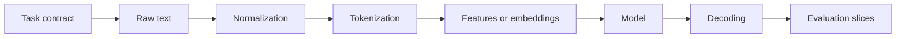

<TLDR>
  <TLDRCell label="what">
    Natural language processing (NLP) turns text or speech into representations and outputs that programs can train on, query, and evaluate.
  </TLDRCell>
  <TLDRCell label="trap">
    Blind text cleaning can erase negation, punctuation, case, or character positions; random splits can also put near-duplicates in both training and test data.
  </TLDRCell>
  <TLDRCell label="fix">
    Define the task, labels, and evaluation slices first, then preserve the source text and build traceable transformations; validate the pipeline with a simple baseline and per-class errors.
  </TLDRCell>
</TLDR>

## What it is and why it exists

<Term id="natural-language-processing">Natural language processing (NLP)</Term> studies how computers process human language. An engineering task must turn an ambiguous language problem into explicit inputs, outputs, and scoring rules. NLP doesn't promise that a program understands text like a person; it requires verifiable behavior on a defined task.

Natural language is hard to hand directly to an ordinary program. The same meaning has many forms, and a word's meaning changes with context; spelling, punctuation, mixed languages, and domain terms expand the input space further. An NLP pipeline compresses that variation into structures a model can process through normalization, tokenization, representation learning, or feature extraction.

You meet NLP in search, spam detection, support routing, sentiment classification, named entity recognition, machine translation, and summarization. Large language models (LLMs) are NLP systems, but NLP isn't limited to generative models. A rule-based entity extractor, TF-IDF classifier, or small encoder may be the right production system.

### The task determines the output

Common tasks differ by output shape. Text classification selects labels for a complete text; sequence labeling assigns a label to each token; span extraction returns start and end positions in the source; retrieval ranks candidate documents; generation produces a new token sequence. Choose the shape before deciding how to annotate data, design the model interface, or score results.

A classifier answers "which queue owns this ticket," not "what does it mean." A named entity recognizer can mark a company name without resolving that company's relationship to an order. Compressing a product requirement into "understand user messages" leaves both the training data and acceptance criteria without boundaries.

### Language data is more than a string

Text has visible content, an encoding, a normalization form, and boundaries. What a user sees as one character may contain several Unicode code points; one model <Term id="token">token</Term> may be only part of a word. Character offsets, byte offsets, UTF-16 code-unit offsets, and token positions are different coordinate systems.

That difference affects annotation and interfaces. A span predicted against normalized text cannot be used to slice the source text directly. If a browser, Python service, and model tokenizer use different offset units, the predicted words may be right while the highlights appear in the wrong place.

## How it works

A maintainable NLP system is a chain of contracted transformations, and it starts before the model call. Each step states its input representation, output representation, information loss, and the route back to source data.



### 1. Write the task contract

The task contract states at least the input unit, allowed outputs, abstention behavior, and success metrics. Classification needs a fixed label set and multi-label rules; span tasks need inclusive or exclusive end-position semantics; generation needs maximum length, citation requirements, and refusal conditions. If labels overlap, revise the annotation guide first. A different model rarely repairs an incoherent target.

Define business costs at the same time. Misrouting a refund request to general support has a different cost from routing it to a security queue, so one accuracy number may be inadequate. Release thresholds and human review paths belong in the task contract, not hidden inside model code.

### 2. Preserve source text and derive normalized views

The source text supports audits, display, and span mapping, so store it unchanged. Search or matching can use a derived view with Unicode normalization, case folding, or controlled whitespace processing. Each transformation can change content or length; record its order and version.

More normalization isn't automatically better. Removing punctuation erases question marks, emoji, and sentence boundaries; deleting stop words can make "not approved" resemble "approved"; lowercasing removes signals from proper names. Validate each step on target data before keeping it.

### 3. Find boundaries and build representations

<Term id="tokenization">Tokenization</Term> turns text into a token sequence. Whitespace splitting does not work for languages without explicit word boundaries, and it mishandles contractions, punctuation, and combining characters. Modern models usually use subword or byte-level tokens, so one visible word may become several tokens.

Traditional models convert tokens into counts, n-grams, or <Term id="tf-idf">TF-IDF</Term> features. Neural networks commonly map token ids to embeddings and then create contextual representations. Both routes need the vocabulary or tokenizer used during training. Replacing that component during inference silently changes the model's input.

### 4. Train, decode, and evaluate

Training adjusts model parameters against an annotated <Term id="corpus">corpus</Term>. Inference first produces scores or probabilities; decoding rules turn those values into the labels, spans, rankings, or text the product needs. Thresholds, label maps, and conflict rules are decoding logic and belong in version control and tests.

Evaluation needs an aggregate view and meaningful data slices. Language, text length, source channel, time period, and minority classes can reveal failures hidden by averages. Start with a simple baseline to verify the data and metrics, then compare more complex models. If a baseline looks implausibly good, inspect duplicates, label leakage, and the split strategy first.

## Examples

The next four examples use only Python's standard library. They move from text views to sparse features, a classification baseline, and per-class evaluation. Their small scale keeps every transformation and number inspectable; it does not imitate a full training platform.

### Derive a matching view

<Depth level="quick">

```python run title="normalize_text.py"
import re
import unicodedata


def normalize_for_matching(text: str) -> str:
    return unicodedata.normalize("NFKC", text).casefold()


def tokenize(text: str) -> list[str]:
    return re.findall(r"[^\W_]+|[^\w\s]", text, flags=re.UNICODE)


original = "Ｃａｆé costs ５€."
normalized = normalize_for_matching(original)

print(normalized)
print(tokenize(normalized))
print(original)
```

```text
café costs 5€.
['café', 'costs', '5', '€', '.']
Ｃａｆé costs ５€.
```

</Depth>

NFKC converts the full-width Latin letters and digit to compatibility forms, while `casefold()` creates a case-insensitive matching view. The program does not overwrite `original`, so it can still display exactly what the user submitted. A production system should also record the normalization policy in the model or index version.

This regular expression illustrates boundaries; it is not a general tokenizer. It groups consecutive Unicode letters or digits and separates punctuation, but lacks enough rules for Chinese words, emoji sequences, or model subwords. In an application, use a tokenizer designed for the language and the model's training procedure.

### Compute TF-IDF features

Term frequency increases the weight of a word repeated within one text, while inverse document frequency discounts words shared by many documents. The example uses the smoothed form `log((1 + N) / (1 + df)) + 1` and normalizes term frequency by document length. The formula and parameters must remain identical to the training pipeline.

```python run title="tfidf_features.py"
import math
import re
from collections import Counter


def tokenize(text: str) -> list[str]:
    return re.findall(r"[^\W_]+", text.casefold())


documents = [
    "refund invoice payment",
    "invoice refund delayed",
    "application crashes after update",
    "update causes login error",
]
document_frequency = Counter(
    token for document in documents for token in set(tokenize(document))
)


def tfidf(text: str) -> dict[str, float]:
    counts = Counter(tokenize(text))
    total = sum(counts.values())
    return {
        token: round(
            count / total
            * (math.log((1 + len(documents)) / (1 + document_frequency[token])) + 1),
            3,
        )
        for token, count in sorted(counts.items())
    }


print(tfidf("refund payment refund"))
```

```text
{'payment': 0.639, 'refund': 1.007}
```

`refund` occurs twice in the text being processed, so its normalized term frequency is higher; `payment` appears in fewer training documents, so its inverse document frequency is higher. The final weight depends on both parts and cannot be explained by raw occurrence count alone.

A real vectorizer must preserve the training vocabulary, feature order, and IDF values. Refitting IDF on the test set lets the test distribution participate in feature construction and leaks data. The inference path also needs the training policy for ignoring, hashing, or representing out-of-vocabulary words.

### Train an inspectable classification baseline

Multinomial naive Bayes is a useful baseline for token counts. Its conditional-independence assumption is strong, but it quickly exposes problems in labels, splits, and features. The example uses add-one smoothing so a word unseen in one class does not turn the whole probability product into zero.

```python run title="classify_tickets.py"
import math
import re
from collections import Counter, defaultdict


def tokenize(text: str) -> list[str]:
    return re.findall(r"[^\W_]+", text.casefold())


training = [
    ("billing", "refund invoice payment"),
    ("billing", "invoice refund delayed"),
    ("technical", "application crashes after update"),
    ("technical", "update causes login error"),
]
document_counts = Counter(label for label, _ in training)
token_counts: dict[str, Counter[str]] = defaultdict(Counter)
vocabulary: set[str] = set()

for label, text in training:
    words = tokenize(text)
    token_counts[label].update(words)
    vocabulary.update(words)


def predict(text: str) -> tuple[str, dict[str, float]]:
    scores: dict[str, float] = {}
    for label in sorted(document_counts):
        score = math.log(document_counts[label] / len(training))
        denominator = sum(token_counts[label].values()) + len(vocabulary)
        for token in tokenize(text):
            score += math.log((token_counts[label][token] + 1) / denominator)
        scores[label] = round(score, 3)
    return max(scores, key=scores.get), scores


for ticket in ["refund still delayed", "application login error"]:
    print(ticket, "->", predict(ticket))
```

```text
refund still delayed -> ('billing', {'billing': -7.401, 'technical': -9.526})
application login error -> ('technical', {'billing': -9.193, 'technical': -7.447})
```

Log probabilities replace multiplication of many small probabilities with addition and avoid numerical underflow. Each class has two training documents, so the priors are equal; token likelihoods determine the final labels. The function returns per-class scores so tests can inspect the boundary instead of seeing only a label.

Four training examples do not establish production quality. The baseline provides a complete, deterministic path that is easy to diagnose. A more complex model should beat it reliably on a fixed test set and slices before its added latency and operational cost are justified.

### Catch majority-only predictions with per-class metrics

Accuracy can be dominated by the common class. The predictor below labels every item as `billing` and still gets four items right, but misses every `technical` case. Macro F1 gives each class equal weight, so it exposes that failure.

```python run title="evaluate_labels.py"
from collections import Counter


gold = ["billing", "billing", "billing", "billing", "technical", "technical"]
predicted = ["billing", "billing", "billing", "billing", "billing", "billing"]
labels = sorted(set(gold) | set(predicted))
confusion = Counter(zip(gold, predicted))
f1_scores = []

for label in labels:
    true_positive = confusion[label, label]
    false_positive = sum(confusion[other, label] for other in labels if other != label)
    false_negative = sum(confusion[label, other] for other in labels if other != label)
    precision = true_positive / (true_positive + false_positive) if true_positive else 0.0
    recall = true_positive / (true_positive + false_negative) if true_positive else 0.0
    f1 = 2 * precision * recall / (precision + recall) if precision + recall else 0.0
    f1_scores.append(f1)
    print(f"{label}: precision={precision:.3f} recall={recall:.3f} f1={f1:.3f}")

accuracy = sum(actual == guess for actual, guess in zip(gold, predicted)) / len(gold)
macro_f1 = sum(f1_scores) / len(f1_scores)
print(f"accuracy={accuracy:.3f} macro_f1={macro_f1:.3f}")
```

```text
billing: precision=0.667 recall=1.000 f1=0.800
technical: precision=0.000 recall=0.000 f1=0.000
accuracy=0.667 macro_f1=0.400
```

`technical` is never predicted, so the example defines its precision and recall as zero. Evaluation libraries may use a parameter to choose a warning, zero, or another behavior. Pin that choice so an upgrade cannot silently change metric semantics. Inspect examples in the confusion matrix too, because the same F1 can come from different errors.

## Pitfalls

> [!PITFALL]
> Treating "cleaning" as lossless removes signals the task may need. A stop-word list can delete negation, punctuation filters erase questions and sentence boundaries, and NFKC folds compatibility characters.
>
> **Fix:** Keep the source text and store normalization as a derived field. Run an ablation for each step, then put the chosen normalization form and order in code shared by training and inference.

> [!PITFALL]
> Normalizing first and applying the resulting model spans to the source produces wrong highlights or truncation. Case folding, compatibility normalization, and whitespace compression can all change length.
>
> **Fix:** Use a tokenizer that returns source-text offsets, or preserve an explicit position map during transformation. Cross-service contracts must name the coordinate unit and end-position rule. Test combining characters and emoji.

> [!PITFALL]
> Fitting a vocabulary, IDF weights, feature selector, or normalization statistics on all data before creating the test split causes <Term id="data-leakage">data leakage</Term>. Row-level random splits also leak near-duplicate texts, users, or sessions.
>
> **Fix:** Make exclusive groups by user, source, or time first, then fit transformations on training data only. Run near-duplicate detection before the split and lock the final test set as read-only data.

> [!PITFALL]
> Reporting only aggregate accuracy can hide complete failure on a minority class. Token-level scoring for sequence labels can also count a large number of correct `O` labels while missing every important entity.
>
> **Fix:** Report per-class precision, recall, F1, and support. For spans, use exact-boundary scoring plus any task-approved partial rule, and inspect slices by language, length, and source.

> [!PITFALL]
> Using different tokenizer versions, vocabularies, or special-token settings in training and inference silently changes input ids. The code can still run even though its outputs no longer correspond to the learned representation.
>
> **Fix:** Release model weights, tokenizer files, normalization configuration, label map, and decoding thresholds as one artifact. Check an immutable revision or digest on load and run an end-to-end smoke test with fixed examples.

## In the AI era

**What generated code gets wrong here**

Generated NLP code often wraps an English regular expression and calls it a universal tokenizer, or applies lowercasing, punctuation removal, and stop-word deletion unconditionally. It also tends to call `fit_transform` on the complete dataset before splitting, or perform row-level random splits over duplicated tickets. Span code commonly mixes normalized-string indices, Python character indices, UTF-16 positions, and model token offsets.

Models also produce evaluation code that runs but means the wrong thing: rounding multiclass logits directly, using accuracy on severely imbalanced data, or treating subword labels as character spans in named entity recognition. Another real failure is combining a model and tokenizer copied from an older tutorial without pinning versions or testing special tokens. The outputs can look plausible, and the interface need not raise an error.

**Ask your AI to check**

- List every text transformation that deletes, merges, or reorders characters, and explain how its result maps back to the source.
- Audit the split, vocabulary, IDF, and feature-selection fit order for leakage across test data, users, and near-duplicates.
- Generate tests for empty text, mixed languages, combining characters, emoji, overlong text, and unseen labels, with the expected offset unit stated.

**Review checklist**

- Confirm that training, evaluation, and inference load the same tokenizer, vocabulary, label map, and normalization configuration.
- Inspect per-class metrics and failed samples; reject a report containing only aggregate accuracy or one averaged score.
- Trace one example from raw input to final output and verify that each intermediate representation and version is reproducible.

**Prompt vocabulary**

Use the exact terms `task contract`, `Unicode normalization`, `tokenization`, `offset mapping`, `grouped split`, `data leakage`, `macro F1`, and `out-of-vocabulary token`. Ask the AI to name the coordinate system, fitting boundary, and zero-division policy. "Clean and evaluate the text" leaves those decisions unconstrained.

<Depth level="deep">

## Deeper: boundaries, data, and evaluation

### Unicode normalization is not a cleanup button

Unicode allows some visually identical text to have different code-point sequences. An accented letter, for example, can be one precomposed character or a base character followed by a combining mark. NFC primarily composes canonically equivalent sequences; NFKC also processes compatibility equivalence and therefore changes more forms.

The right form depends on the task. Search keys, deduplication keys, and user-visible source text have different jobs and should not share one overwritten string. Security-sensitive identifiers also need a separate policy for allowed characters, confusables, and normalization. Two subjects do not become identical merely because NFKC gives them the same text.

Case folding can change length as well. German `ß` may fold to `ss`, so an index in the normalized view need not match an index in the source. A reliable implementation either gets source-relative offsets directly from the tokenizer or maintains a position map through each transformation.

The character a user perceives is often close to an extended grapheme cluster. Python strings index Unicode code points, while JavaScript strings commonly expose UTF-16 code units. The model has its own token positions. A cross-language API that says only `start: 12` still has an incomplete contract.

### Token boundaries belong to the model contract

Tokens are not natural language facts; they result from a specific segmentation rule. Whitespace, dictionaries, statistical subwords, and byte-level methods produce different sequences for the same text. Sequence length, unknown-word behavior, and label alignment change with them.

Subword tokenization reduces a fixed vocabulary's dependence on complete words but does not remove boundary work. Named entity labels often need alignment from a character span to several subwords, with a decision about whether later subwords repeat a label, ignore the loss, or receive an `I-` label. Training and evaluation must follow the same policy.

Special tokens are also part of the input format. Start, end, padding, mask, and chat control tokens have agreed ids. Manually concatenating strings is not the same as applying the tokenizer's prescribed template. A model and tokenizer that appear to come from the same family are not thereby interchangeable.

### The split should imitate the release boundary

Random row-level splitting is reasonable only when examples are independent and identically distributed. Support messages repeat descriptions from one conversation, news corpora carry syndicated paragraphs, and template data changes only a few fields. When similar text crosses the train-test boundary, a model can memorize wording instead of generalizing.

A grouped split keeps one user, conversation, document, or source on one side. A temporal split trains on earlier data and tests on later data, closer to a deployment that will encounter language drift. Pick the boundary that resembles the system's future, not the one that produces the highest score.

People can leak the test set too. Repeatedly reading test errors and adjusting rules against them gradually tunes the system to that set. Use a validation set for routine development. Reserve the final test set for a small number of release decisions, with the model and configuration recorded on every use.

### Metrics must match the decision

Precision asks how many predictions for a class were correct; recall asks how many real members of that class were recovered. F1 is their harmonic mean, but it still does not express unequal business costs. Choose thresholds on validation data and costs, not by selecting the best-looking test point.

Macro averaging computes each class metric before giving classes equal weight. Micro averaging pools decisions and is commonly dominated by large classes. A support-weighted average lies between them. Report per-class support with the averaging rule so readers can see the data distribution.

Span tasks need an explicit definition of a correct boundary. Whether `Peking University` versus `Peking` is entirely wrong, partly right, or a different entity level depends on annotation policy and product use. Generation cannot compress factuality, format compliance, and harm into one automatic score either. It usually needs several automatic checks and calibrated human review.

### Simple baselines still earn their place

A majority predictor, keyword rules, TF-IDF with a linear model, or naive Bayes can serve as a baseline. These systems train quickly, are easy to inspect, and expose direct shortcuts in data. If a large model improves only the aggregate while regressing on a critical slice, its complexity has not produced usable value.

Baselines can also reveal a broken evaluation. Random labels scoring well usually mean that a label entered the features, duplicates crossed sets, or the scorer is wrong. Running a deliberately simple system through the complete path is much cheaper than starting with an opaque model.

Model comparisons must fix the data version, transformations, metric implementation, and threshold-selection procedure. For nondeterministic generation, fix decoding parameters and retain raw outputs too. Without those conditions, "the new model is better" is an observation that cannot be reproduced.

### Choose a model from the constraints

Rules fit stable label definitions, explicit triggers, and cases where errors must be easy to explain. Sparse linear models work well for classification with limited labels and strong lexical signals. Contextual encoders handle wording variation better, but demand stricter artifact management and regression evaluation.

Generative models fit tasks whose output is new text and can also unify several steps behind a text interface. That freedom expands the evaluation surface. A class label supports exact comparison, while an open answer needs separate factual, format, and safety checks. Language input does not imply that a generative model should produce the output.

Inference budget belongs in the task contract too. Latency, memory, concurrency, offline operation, and data boundaries can rule out a model. State those limits first, then compare quality among eligible candidates, instead of discovering after an experiment that the system cannot ship.

### Error analysis connects a score to a repair

Sample from confusion-matrix cells or failure types, then inspect source text, intermediate tokens, scores, and final decoding. Attribute errors to annotation conflict, missing coverage, boundary misalignment, domain drift, or model confusion. Those causes require different repairs; more training epochs are not a universal answer.

An error category should lead to an action. Annotation conflicts call for a revised guide and data review; offset failures call for a repaired transformation contract; poor recall on new product names may need newer, time-aware examples. "The model does not understand context" is hard to test and gives the next experiment no direction.

Continue using the same slices and error taxonomy after release, but do not assume online labels arrive immediately. Input length, language, unknown-token rate, confidence, and human handoff rate can serve as proxy signals until delayed labels confirm quality. A changing proxy warrants investigation; it does not prove degradation by itself.

</Depth>

<Checkpoint id="ai/nlp" />

## Further reading

- [Unicode normalization forms](https://unicode.org/reports/tr15/)
- [Unicode text segmentation](https://unicode.org/reports/tr29/)
- [Python 3.14 `unicodedata` documentation](https://docs.python.org/3.14/library/unicodedata.html)
- [Python 3.14 regular expression documentation](https://docs.python.org/3.14/library/re.html)
- [Hugging Face tokenizer summary](https://huggingface.co/docs/transformers/en/tokenizer_summary)
