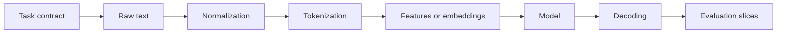

<TLDR>
  <TLDRCell label="what">
    自然语言处理（natural language processing，NLP）把文本或语音转换成程序可以训练、查询和评估的表示与输出。
  </TLDRCell>
  <TLDRCell label="trap">
    盲目清洗文本会丢掉否定、标点、大小写或字符位置；随机切分还可能让近重复样本同时进入训练集与测试集。
  </TLDRCell>
  <TLDRCell label="fix">
    先定义任务、标签和评测切片，再保留原文并建立可追踪的转换流程；用简单基线和逐类错误分析验证整个流水线。
  </TLDRCell>
</TLDR>

## 是什么，为什么存在

<Term id="natural-language-processing">自然语言处理（natural language processing，NLP）</Term>研究如何让计算机处理人类语言。工程上的 NLP 任务必须把含糊的语言问题变成明确的输入、输出和评分规则。它不承诺程序像人一样理解文本，而是要求系统在约定任务上产生可验证的行为。

自然语言很难直接交给普通程序。相同含义可以有不同写法，同一个词也会随上下文改变含义；拼写、标点、语言混用和领域术语又会不断扩大输入空间。NLP 流水线通过规范化、分词、表示学习或特征提取，把这种变化压缩成模型能处理的结构。

你会在搜索、垃圾邮件检测、客服路由、情感分类、命名实体识别、机器翻译和摘要中遇到 NLP。大型语言模型（LLM）也属于 NLP 系统，但 NLP 不等于生成式模型。一个基于规则的实体提取器、TF-IDF 分类器或小型编码器，同样可以是正确的生产方案。

### 任务决定输出

常见任务可以按输出形状区分。文本分类为整段文本选择标签；序列标注为每个词元分配标签；跨度抽取返回原文中的起止位置；检索给候选文档排序；生成任务输出新的词元序列。先确定输出形状，才能确定标注方式、模型接口和评测指标。

分类器回答的是“这张工单属于哪个队列”，不是“它表达了什么”。命名实体识别器可以标出公司名称，却不会自动解析这家公司与订单之间的关系。把产品需求压成含糊的“理解用户消息”，会让训练数据与验收标准都失去边界。

### 语言数据不是普通字符串

文本既有可见内容，也有编码、规范化形式和边界。用户眼中的一个字符可能由多个 Unicode 码点组成；模型的一个<Term id="token">词元（token）</Term>也可能只是一个词的一部分。字符位置、字节位置、UTF-16 代码单元位置和词元位置不是同一坐标系。

这一区别会直接影响标注与界面。实体识别器返回的跨度如果来自规范化后的文本，就不能直接用于切割原文。浏览器、Python 服务和模型分词器若各自使用不同的偏移量单位，即使预测文本正确，高亮位置也可能错位。

## 工作原理

一个可维护的 NLP 系统是一串带契约的转换，而且在调用模型之前就已经开始。每一步都要说明输入表示、输出表示、丢失了什么信息，以及如何把结果映射回原始数据。



### 1. 写出任务契约

任务契约至少说明输入单位、允许的输出、无法判断时的处理方式和成功指标。分类任务要固定标签集合与多标签规则；跨度任务要规定结束位置是否包含在结果内；生成任务要规定最大长度、引用要求与拒答条件。标签含义有重叠时，先修订标注指南，换模型通常解决不了根本问题。

同时定义业务成本。把退款工单错分到普通咨询与错分到安全队列的代价并不相同，所以单一准确率可能不够。上线阈值和人工复核路径也属于任务契约，不应藏在模型代码里。

### 2. 保留原文并派生规范化视图

原文是审计、展示和跨度映射的依据，应当原样保存。搜索或匹配可以使用派生视图，例如 Unicode 规范化、大小写折叠或受控空白处理。每一种变换都可能改变字符内容或长度，因此要记录使用的顺序和版本。

规范化不是越多越好。删除标点会抹掉问号、表情和句界；删除停用词会把 “not approved” 变成接近 “approved” 的表示；统一小写会损失专名线索。只有通过目标数据上的验证，才能决定某一步是否有用。

### 3. 划分边界并建立表示

<Term id="tokenization">分词（tokenization）</Term>把文本转换成词元序列。基于空格的切分不适用于没有显式词界的语言，也处理不好缩写、标点和组合字符。现代模型通常使用子词或字节级词元，因此一个可见单词可能对应多个词元。

传统模型常把词元转换成计数、n-gram 或<Term id="tf-idf">TF-IDF</Term> 特征。神经网络通常从词元 id 查得嵌入，再结合上下文生成表示。两条路线都需要固定训练时使用的词表或分词器；推理时偷偷换组件，会改变模型看到的输入。

### 4. 训练、解码与评估

训练过程根据标注<Term id="corpus">语料库（corpus）</Term>调整模型参数。推理先得到分数或概率，再由解码规则生成产品需要的标签、跨度、排序或文本。阈值、标签映射和冲突处理属于解码逻辑，也必须进入版本控制与测试。

评估要覆盖总体指标和有意义的数据切片。语言、文本长度、来源渠道、新旧时间段和少数类别都可能暴露平均值掩盖的问题。先用简单基线确认数据与指标可用，再比较复杂模型；如果基线异常高，优先检查重复数据、标签泄漏和切分方式。

## 示例

下面四个示例使用 Python 标准库，依次展示文本视图、稀疏特征、分类基线和逐类评估。它们刻意保持小规模，目的是让每个转换与数值都能检查，而不是模拟完整训练平台。

### 派生匹配视图

<Depth level="quick">

```python run title="normalize_text.py"
import re
import unicodedata


def normalize_for_matching(text: str) -> str:
    return unicodedata.normalize("NFKC", text).casefold()


def tokenize(text: str) -> list[str]:
    return re.findall(r"[^\W_]+|[^\w\s]", text, flags=re.UNICODE)


original = "Ｃａｆé costs ５€."
normalized = normalize_for_matching(original)

print(normalized)
print(tokenize(normalized))
print(original)
```

```text
café costs 5€.
['café', 'costs', '5', '€', '.']
Ｃａｆé costs ５€.
```

</Depth>

NFKC 把全角拉丁字母和数字转换成兼容形式，`casefold()` 生成不区分大小写的匹配视图。程序没有覆盖 `original`，所以仍能展示用户提交的文本。生产系统还应把具体规范化策略记入模型或索引版本。

这个正则表达式只适合说明边界，不是通用分词器。它把连续的 Unicode 字母或数字当作一个词元，并把标点分开；对中文词语、emoji 序列和模型子词都没有足够规则。实际使用时应选择针对语言与模型训练方式设计的分词器。

### 计算 TF-IDF 特征

词频会抬高一段文本中反复出现的词，逆文档频率则降低许多文档共有词的权重。示例使用平滑形式 `log((1 + N) / (1 + df)) + 1`，并按文档长度归一化词频。公式与参数必须和训练管线保持一致。

```python run title="tfidf_features.py"
import math
import re
from collections import Counter


def tokenize(text: str) -> list[str]:
    return re.findall(r"[^\W_]+", text.casefold())


documents = [
    "refund invoice payment",
    "invoice refund delayed",
    "application crashes after update",
    "update causes login error",
]
document_frequency = Counter(
    token for document in documents for token in set(tokenize(document))
)


def tfidf(text: str) -> dict[str, float]:
    counts = Counter(tokenize(text))
    total = sum(counts.values())
    return {
        token: round(
            count / total
            * (math.log((1 + len(documents)) / (1 + document_frequency[token])) + 1),
            3,
        )
        for token, count in sorted(counts.items())
    }


print(tfidf("refund payment refund"))
```

```text
{'payment': 0.639, 'refund': 1.007}
```

`refund` 在待处理文本中出现两次，因此归一化词频更高；`payment` 在训练文档中更少见，因此逆文档频率更高。最后的权重同时受两部分影响，不能只按原始出现次数解释。

真正的向量器还需要保存训练词表、特征顺序和 IDF 数值。对测试集重新拟合 IDF 会让测试分布参与特征构建，造成数据泄漏。推理阶段遇到词表外词时，也必须采用训练时规定的忽略、哈希或未知词策略。

### 训练可检查的分类基线

多项式朴素贝叶斯适合为词元计数建立基线。它的条件独立假设很强，却能快速暴露标签、切分与特征管线的问题。示例使用加一平滑，避免未在某个类别出现的词把整个概率乘积变成零。

```python run title="classify_tickets.py"
import math
import re
from collections import Counter, defaultdict


def tokenize(text: str) -> list[str]:
    return re.findall(r"[^\W_]+", text.casefold())


training = [
    ("billing", "refund invoice payment"),
    ("billing", "invoice refund delayed"),
    ("technical", "application crashes after update"),
    ("technical", "update causes login error"),
]
document_counts = Counter(label for label, _ in training)
token_counts: dict[str, Counter[str]] = defaultdict(Counter)
vocabulary: set[str] = set()

for label, text in training:
    words = tokenize(text)
    token_counts[label].update(words)
    vocabulary.update(words)


def predict(text: str) -> tuple[str, dict[str, float]]:
    scores: dict[str, float] = {}
    for label in sorted(document_counts):
        score = math.log(document_counts[label] / len(training))
        denominator = sum(token_counts[label].values()) + len(vocabulary)
        for token in tokenize(text):
            score += math.log((token_counts[label][token] + 1) / denominator)
        scores[label] = round(score, 3)
    return max(scores, key=scores.get), scores


for ticket in ["refund still delayed", "application login error"]:
    print(ticket, "->", predict(ticket))
```

```text
refund still delayed -> ('billing', {'billing': -7.401, 'technical': -9.526})
application login error -> ('technical', {'billing': -9.193, 'technical': -7.447})
```

对数概率把许多小概率的乘法改成加法，避免数值下溢。两个类别各有两份训练文档，因此先验相同；词元条件概率决定最终标签。这里返回各类别分数，是为了让测试能够观察边界，而不是只得到标签。

四条训练样本不能证明模型可以上线。基线的价值在于提供一条完整、确定且容易诊断的路径。更复杂模型必须在固定测试集和切片上稳定胜过它，额外的延迟与运维成本才有理由。

### 用逐类指标检查多数类预测

准确率会被常见类别主导。下面的预测器把所有样本都判为 `billing`，总体上仍答对四项，但它完全漏掉 `technical`。宏平均 F1 给每个类别相同权重，因此能暴露这种失败。

```python run title="evaluate_labels.py"
from collections import Counter


gold = ["billing", "billing", "billing", "billing", "technical", "technical"]
predicted = ["billing", "billing", "billing", "billing", "billing", "billing"]
labels = sorted(set(gold) | set(predicted))
confusion = Counter(zip(gold, predicted))
f1_scores = []

for label in labels:
    true_positive = confusion[label, label]
    false_positive = sum(confusion[other, label] for other in labels if other != label)
    false_negative = sum(confusion[label, other] for other in labels if other != label)
    precision = true_positive / (true_positive + false_positive) if true_positive else 0.0
    recall = true_positive / (true_positive + false_negative) if true_positive else 0.0
    f1 = 2 * precision * recall / (precision + recall) if precision + recall else 0.0
    f1_scores.append(f1)
    print(f"{label}: precision={precision:.3f} recall={recall:.3f} f1={f1:.3f}")

accuracy = sum(actual == guess for actual, guess in zip(gold, predicted)) / len(gold)
macro_f1 = sum(f1_scores) / len(f1_scores)
print(f"accuracy={accuracy:.3f} macro_f1={macro_f1:.3f}")
```

```text
billing: precision=0.667 recall=1.000 f1=0.800
technical: precision=0.000 recall=0.000 f1=0.000
accuracy=0.667 macro_f1=0.400
```

`technical` 从未被预测，所以它的精确率与召回率都按零处理。真实评测工具可能通过参数选择警告、零或其他行为；团队应固定这一选择，避免升级后指标语义变化。还要查看混淆矩阵中的具体样本，因为相同 F1 可能来自不同错误。

## 陷阱

> [!PITFALL]
> 把“清洗”当作无损操作，会删除任务需要的信号。例如，停用词表可能删除否定词，标点过滤会删除问句与句界，NFKC 还会折叠兼容字符。
>
> **修复方法：** 永远保留原文，把规范化结果作为派生字段。逐项做消融测试，并把规范化形式与顺序固定在训练和推理共用的代码中。

> [!PITFALL]
> 先规范化文本，再把模型跨度直接套回原文，会造成错误高亮或截断。大小写折叠、兼容规范化和空白压缩都可能改变长度。
>
> **修复方法：** 使用能返回原文偏移量的分词器，或在转换时保存显式位置映射。跨服务契约必须写明坐标单位与结束位置规则，并用组合字符和 emoji 做测试。

> [!PITFALL]
> 在全部数据上拟合词表、IDF、特征选择器或规范化统计量，再划分测试集，会产生<Term id="data-leakage">数据泄漏（data leakage）</Term>。随机切分近重复文本、同一用户或同一会话也会让测试分数虚高。
>
> **修复方法：** 先按用户、来源或时间建立互斥分组，再只在训练集上拟合转换器。近重复检测也应在切分前运行，并把最终测试集锁定为只读数据。

> [!PITFALL]
> 只报告总体准确率，会掩盖少数类完全失效。对序列标注逐词元计分，还可能把大量正确的 `O` 标签当成好结果，而关键实体一个都没找到。
>
> **修复方法：** 同时报告逐类精确率、召回率、F1 与支持数。跨度任务使用精确边界匹配和任务认可的部分匹配规则，并按语言、长度与来源检查切片。

> [!PITFALL]
> 训练与推理使用不同的分词器版本、词表或特殊词元配置，会静默改变输入 id。代码仍能运行，输出却不再对应训练时学到的表示。
>
> **修复方法：** 把模型权重、分词器文件、规范化配置、标签映射和解码阈值作为同一制品发布。加载时校验不可变修订或摘要，并用固定样本做端到端冒烟测试。

## AI 时代

**生成代码在这里常犯的错**

生成的 NLP 代码常把一个英文正则表达式包装成“通用分词器”，或无条件执行小写化、去标点和停用词删除。它也容易先对整个数据集调用 `fit_transform` 再切分，或对重复工单做逐行随机切分。跨度处理代码经常混用规范化字符串位置、Python 字符索引、UTF-16 位置和模型词元偏移量。

模型还会编造可运行但语义错误的评测：把多分类 logits 直接四舍五入，用准确率评价严重不平衡的数据，或在命名实体识别中把子词标签当作字符跨度。另一个真实风险是沿用旧教程中的模型与分词器组合，却没有固定版本或验证特殊词元。输出看起来合理，接口也不一定报错。

**让 AI 检查**

- 列出每一步文本转换会删除、合并或重排的字符，并说明结果如何映射回原文。
- 检查切分、词表、IDF 与特征选择的拟合顺序，找出测试数据、用户或近重复样本泄漏。
- 用空文本、混合语言、组合字符、emoji、超长文本和未见标签生成测试，并给出预期的偏移量单位。

**审查清单**

- 确认训练、评估与推理加载同一分词器、词表、标签映射和规范化配置。
- 检查逐类指标与失败样本，不接受只有总体准确率或一组平均分的报告。
- 从原始输入追踪一个样本到最终输出，验证每个中间表示及其版本都可重现。

**提示词词汇**

使用准确术语：`task contract`（任务契约）、`Unicode normalization`（Unicode 规范化）、`tokenization`（分词）、`offset mapping`（偏移量映射）、`grouped split`（分组切分）、`data leakage`（数据泄漏）、`macro F1`（宏平均 F1）和 `out-of-vocabulary token`（词表外词元）。要求 AI 指明坐标系、拟合边界和零除策略；“清洗并评估文本”无法约束这些选择。

<Depth level="deep">

## 深入：边界、数据与评估

### Unicode 规范化不是文本清理按钮

Unicode 允许某些视觉上相同的文本拥有不同码点序列。例如，带重音的字母可以是单个预组字符，也可以是基本字母加组合标记。NFC 主要合成规范等价序列；NFKC 还会处理兼容等价，因此转换范围更大。

选择哪种形式取决于任务。搜索键、去重键与用户可见原文承担不同职责，不应共用一个被覆盖的字符串。安全相关标识符还需要单独的允许字符、混淆字符和规范化策略，不能因为 NFKC 后相同就自动认定两个主体相同。

大小写折叠同样可能改变长度。德语 `ß` 可折叠为 `ss`，所以规范化视图中的索引不一定对应原文索引。可靠实现要么由分词器直接返回相对原文的偏移量，要么在每次变换时维护位置映射。

用户看到的字符通常接近扩展字素簇，而 Python 字符串按 Unicode 码点索引，JavaScript 字符串常按 UTF-16 代码单元处理。模型又使用自己的词元位置。跨语言 API 若只写 `start: 12` 而不声明单位，契约仍然不完整。

### 词元边界属于模型契约

词元不是天然存在的语言事实，而是某个分词规则的结果。空格、字典、统计子词与字节级方法会给同一文本产生不同序列。序列长度、未知词处理和标签对齐都随之变化。

子词分词减少了固定词表对完整单词的依赖，但没有消除边界问题。命名实体标签常需要从字符跨度对齐到多个子词，并决定后续子词是重复标签、忽略损失还是使用 `I-` 标签。训练和评估必须采用同一策略。

特殊词元也是输入格式的一部分。起始、结束、填充、遮罩和聊天控制词元各有约定 id；手工拼接字符串不等于调用分词器规定的模板。模型与分词器看似来自同一家族，也不能证明它们能安全互换。

### 切分方式应模拟上线边界

随机逐行切分只在样本彼此独立且同分布时合理。客服消息常包含同一会话的重复描述，新闻语料会转载相同段落，模板数据只替换少量字段。相近文本跨越训练与测试边界时，模型可以记住措辞而不是泛化。

分组切分把同一用户、会话、文档或来源放在同一侧。时间切分用较早数据训练、较新数据测试，更接近会发生语言漂移的上线环境。选择哪一种取决于系统未来会遇到什么，而不是哪一种产生更高分数。

测试集也会被人泄漏。反复查看测试错误并据此改规则，相当于逐步对测试集调参。日常开发使用验证集；最终测试集只用于少量发布决策，且每次使用都应记录模型与配置。

### 指标必须匹配决策

精确率回答“预测为此类的样本中有多少正确”，召回率回答“真实属于此类的样本中找回多少”。F1 是二者的调和平均，但仍没有表达不同错误的业务成本。阈值应根据验证数据和成本选择，不能从测试集上挑出最好看的点。

宏平均先计算每个类别的指标再等权平均，适合观察少数类；微平均汇总所有决策，常由大类主导；按支持数加权的平均值位于两者之间。报告平均方式时还要给出逐类支持数，否则读者无法判断数据分布。

跨度任务需要明确“正确”的边界。`北京大学` 与 `北京` 是完全错误、部分正确，还是层级不同的实体，取决于标注规范与产品用途。生成任务更不能靠一个自动分数概括事实性、格式遵循与伤害风险，通常需要多项自动检查和经过校准的人工评审。

### 简单基线仍然有用

多数类预测器、关键词规则、TF-IDF 加线性模型或朴素贝叶斯都可以成为基线。它们训练快、行为容易检查，也能揭示数据中的直接捷径。如果大型模型只略微改善总体分数，却在关键切片退步，复杂度并没有带来可用收益。

基线也能发现评测故障。随机标签若取得高分，通常说明标签进入了特征、重复样本跨集合或评分代码有错。先让一个故意简单的系统跑完整条链路，比直接调试不可解释的大模型便宜得多。

模型比较必须固定数据版本、转换器、指标实现和阈值选择流程。对于非确定生成，还要固定解码参数并保存原始输出。没有这些条件，“新模型更好”只是一次无法复现的观察。

### 按约束选择模型

规则适合标签定义稳定、触发条件明确且错误必须容易解释的场景。稀疏线性模型适合标签数据有限、词汇信号较强的分类任务。上下文编码器更擅长处理措辞变化，但需要更严格的制品管理和回归评测。

生成模型适用于输出本身是新文本的任务，也可以把多个步骤统一成文本接口。它带来的自由度同时扩大了评测空间；分类标签能精确比对，开放式回答却要分别检查事实、格式与安全条件。不要因为输入是语言，就默认输出也应该由生成模型产生。

推理预算也是任务契约的一部分。延迟、内存、并发、离线运行和数据边界可能排除某些模型。先写出这些限制，再在合格候选中比较质量，能避免完成实验后才发现系统无法部署。

### 错误分析连接指标与修复

先从混淆矩阵或失败类型中抽样，再回看原文、中间词元、分数和最终解码。把错误归因于标注冲突、覆盖不足、边界错位、领域漂移或模型混淆。不同原因需要不同修复，继续增加训练轮数不是通用答案。

错误类别应当能触发行动。例如，标注冲突要求修订指南并重新核验数据；偏移量错误要求修复转换契约；新产品名召回不足可能需要补充时序较新的样本。只写“模型不理解上下文”既难验证，也无法指导下一次实验。

上线后继续使用同一套切片与错误分类，但不要假定线上标签立即可得。可以监控输入长度、语言、未知词比例、置信度与人工转交率等代理信号，再通过延迟标注确认质量。代理变化提示调查，不自动证明模型已经退化。

</Depth>

<Checkpoint id="ai/nlp" />

## 延伸阅读

- [Unicode 规范化形式](https://unicode.org/reports/tr15/)
- [Unicode 文本分段](https://unicode.org/reports/tr29/)
- [Python 3.14 `unicodedata` 文档](https://docs.python.org/3.14/library/unicodedata.html)
- [Python 3.14 正则表达式文档](https://docs.python.org/3.14/library/re.html)
- [Hugging Face 分词器概览](https://huggingface.co/docs/transformers/en/tokenizer_summary)
