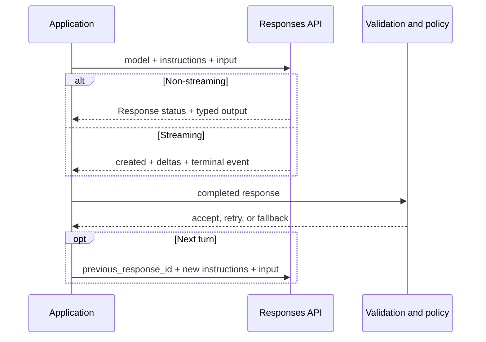

<TLDR>
  <TLDRCell label="what">
    The OpenAI API is an HTTP interface to model and tool capabilities; new text applications use the Responses API for direct model calls.
  </TLDRCell>
  <TLDRCell label="when">
    Use it directly when your application must control requests, response status, conversation continuation, or streaming instead of handing control flow to a higher-level framework.
  </TLDRCell>
  <TLDRCell label="how">
    Inject keys from server-side secret storage, parse responses by type and status, and keep transport retries, stream completion, and business side effects in separate boundaries.
  </TLDRCell>
</TLDR>

## What it is and why it exists

The OpenAI API is the programming interface to models hosted by OpenAI. For new text-generation applications, its central entry point is `POST /v1/responses`; the Python SDK exposes it as `OpenAI().responses.create(...)`. One request can contain text, image, or file input and can declare built-in tools or custom function tools.

The Responses API does more than send a prompt to a model. It returns a unified response object containing status, typed output items, usage, and error details. Your application can distinguish text, reasoning items, tool calls, and other output instead of flattening every result into one unchecked string.

The top-level `output` is an array of <Term id="response-item">response items</Term>, and its first element isn't guaranteed to be assistant text. Official SDKs provide the `output_text` convenience property to aggregate text output. Code that needs tools, citations, or other content must still walk the typed output items.

The API also supports two approaches to <Term id="conversation-state">conversation state</Term>. An application can continue from the previous `response.id` with `previous_response_id`, or it can use a persistent Conversation object. With either approach, your application still owns tenant isolation, retention policy, context budgets, and business history.

This topic focuses on the Responses API's basic protocol and a reliable application boundary. Prompt design, Structured Outputs, function calling, agents, and observability have their own topics, so their complete workflows aren't repeated here. Image generation, audio, embeddings, and the legacy Assistants API are also outside this minimal call path.

Before making a call, create a project key and inject it into the server process through `OPENAI_API_KEY` or a secret manager. Browsers and mobile apps must not hold long-lived API keys. They should call your backend, where authentication, authorization, limits, and the OpenAI request are enforced.

The backend shouldn't expose the entire Responses API as a transparent proxy either. Control models, tools, output budgets, and available parameters with server-side allowlists. Otherwise, an attacker can spend your project quota on expensive capabilities or reach tools the client should never expose.

## How it works

A minimal request contains `model` and `input`. Use `instructions` for trusted, high-level behavior and `input` for the current user's content or typed input items. Direct HTTP calls also need `Authorization: Bearer ...` and `Content-Type: application/json`; official SDKs handle the authentication header, serialization, and error types.

The `model` is a deployment choice, not business logic. A development environment can explore with a current alias, but a production release should select a model based on availability and evaluation results, then pin a snapshot when behavior must remain stable. Rerun the same evaluation for every model or prompt change instead of inferring compatibility from a name.

A response can have a status such as `completed`, `failed`, `in_progress`, `cancelled`, `queued`, or `incomplete`. Accept content only when the status satisfies your application contract. For an incomplete result such as one that reached its output limit, inspect `incomplete_details` and use an explicit fallback; fluent text doesn't prove that generation finished.

| `status` | Application action |
|---|---|
| `completed` | Continue with content and business validation |
| `incomplete` | Inspect `incomplete_details`, then mark truncation or fall back |
| `failed` | Read the error and handle its category |
| `in_progress` | Keep polling or waiting for events; don't consume a final result |
| `queued` | Stay in a waiting state and allow cancellation |
| `cancelled` | Discard uncommitted content and stop waiting |

These states describe only the server-side generation lifecycle; they don't tell your application whether content is correct. A `completed` result still needs schema, domain, and permission checks. An `incomplete` result isn't always retryable either: resending unchanged input after a bad input or output budget only repeats the failure.

Every element in `output` has a `type`. A message item has its own `content` array, where a text block has type `output_text`. Reasoning models and tool-enabled requests can produce other item types before or after a message, so reading `response.output[0].content[0].text` directly is brittle.

Multi-turn interaction can form a response chain with `previous_response_id`. The continuation must still send the current turn's `instructions` explicitly because instructions from the previous response don't carry over automatically. A chain doesn't eliminate context cost either: earlier input in the chain still counts toward later requests' input tokens.

With `stream: true`, the service delivers status and deltas through <Term id="server-sent-events">Server-Sent Events (SSE)</Term>. Common text events include `response.created`, repeated `response.output_text.delta` events, a final `response.completed`, and `error`. The client can't mark displayed partial text as complete until it observes a terminal event.

The following flow covers a regular call and its two delivery paths. Model output remains untrusted data until application code accepts it; schema validation, authorization, and side-effect control all live outside the API boundary.



A reliable implementation records four kinds of data around a call: application feature and prompt version, requested and returned model, the provider's <Term id="request-id">request ID</Term>, and completion status with validation outcome. Logs need an allowlist and redaction. Correlating a request doesn't mean retaining full prompts, user files, or authentication headers.

## Examples

All four examples run locally. They neither call OpenAI nor present handwritten content as live model output. They use request or response fixtures shaped according to the verified documentation to test protocol code that the application owns; integration tests still need a restricted, separate project and test key.

<Depth level="quick">

### Build a minimal HTTP request

The first example builds a request with Python's standard library and stops before network transmission. This lets you check the method, endpoint, authentication scheme, and JSON shape without exposing a real key or creating nondeterministic output.

```python run title="request_contract.py"
import json
from urllib.request import Request


def build_response_request(
    api_key: str,
    model: str,
    user_input: str,
) -> Request:
    payload = {
        "model": model,
        "instructions": "Return one concise support category.",
        "input": user_input,
        "max_output_tokens": 80,
    }
    return Request(
        "https://api.openai.com/v1/responses",
        data=json.dumps(payload).encode("utf-8"),
        method="POST",
        headers={
            "Authorization": f"Bearer {api_key}",
            "Content-Type": "application/json",
        },
    )


request = build_response_request(
    "test-key",
    "gpt-6-astra",
    "Classify: payment failed",
)
body = json.loads(request.data.decode("utf-8"))
print(request.method, request.full_url)
print("Bearer header:", request.get_header("Authorization").startswith("Bearer "))
print("Model:", body["model"])
print("Input:", body["input"])
```

```text
POST https://api.openai.com/v1/responses
Bearer header: True
Model: gpt-6-astra
Input: Classify: payment failed
```

Production code should let `OpenAI()` read credentials from the environment or workload identity and should reuse a long-lived client. The example's `test-key` only checks the request object; a real key must never enter source code, browser bundles, exception bodies, or logs. Keep the model ID in centralized configuration rather than scattering it through business functions.

</Depth>

### Read response items by type

The second example deliberately puts a reasoning item before the message item. Its parser checks top-level status and then visits every message and content block. It never assumes that `output[0]` has a `content` property.

```python run title="response_items.py"
def completed_text(response: dict) -> str:
    if response["status"] != "completed":
        detail = response.get("incomplete_details") or response.get("error")
        raise RuntimeError(f"response not completed: {detail}")

    pieces = []
    for item in response["output"]:
        if item.get("type") != "message":
            continue
        for block in item.get("content", []):
            if block.get("type") == "output_text":
                pieces.append(block["text"])
    return "".join(pieces)


response = {
    "id": "resp_demo",
    "status": "completed",
    "output": [
        {"type": "reasoning", "id": "rs_demo", "summary": []},
        {
            "type": "message",
            "role": "assistant",
            "content": [
                {"type": "output_text", "text": "billing", "annotations": []}
            ],
        },
    ],
    "usage": {"input_tokens": 28, "output_tokens": 7, "total_tokens": 35},
}

print("Status:", response["status"])
print("Text:", completed_text(response))
print("Total tokens:", response["usage"]["total_tokens"])
```

```text
Status: completed
Text: billing
Total tokens: 35
```

The response and token counts are local protocol fixtures, not live model results or capacity data. With an official SDK, a text-only path can check status and then read `response.output_text`. To handle tool calls, citations, or other output, dispatch over `response.output` by type. Log or reject unknown types safely instead of forcing them through a text parser.

### Build a conversation continuation

The third example produces the JSON for a second turn. It includes the preceding ID and sends trusted instructions again. If the product switches to different system rules, the change becomes visible in the request builder and its tests.

```python run title="conversation_turn.py"
import json


def next_turn(previous_id: str, user_input: str) -> dict:
    return {
        "model": "gpt-6-astra",
        "previous_response_id": previous_id,
        # Instructions from the preceding response do not carry over.
        "instructions": "Answer as a concise support agent.",
        "input": [{"role": "user", "content": user_input}],
        "store": True,
    }


request_body = next_turn(
    "resp_first",
    "Explain why the ticket belongs in billing.",
)
print("Previous:", request_body["previous_response_id"])
print("Instructions:", request_body["instructions"])
print("Role:", request_body["input"][0]["role"])
print("Stored:", request_body["store"])
print(json.dumps(request_body["input"][0], sort_keys=True))
```

```text
Previous: resp_first
Instructions: Answer as a concise support agent.
Role: user
Stored: True
{"content": "Explain why the ticket belongs in billing.", "role": "user"}
```

`previous_response_id` lets the service locate the response chain to continue, but your application must still prove that the ID belongs to the current tenant and business conversation. If policy doesn't allow the default response storage, evaluate `store: false` with manually supplied context. Conversation objects have a different persistence lifecycle and should not be a default without a retention policy.

As a conversation grows, don't manage context by deleting the oldest strings blindly. Tool calls and their results, message roles, and critical business facts can create protocol dependencies. Define and test a policy to reject, summarize, compact, or restart, and record which policy affected each request.

### Accumulate streamed text

The last example feeds decoded SSE event fixtures to a state machine. It returns text only after `response.completed`. An explicit error, a failed state, or a connection without a terminal event raises an exception.

```python run title="stream_events.py"
def collect_stream(events: list[dict]) -> str:
    pieces = []
    completed = False
    for event in events:
        event_type = event["type"]
        if event_type == "response.output_text.delta":
            pieces.append(event["delta"])
        elif event_type == "response.completed":
            completed = event["response"]["status"] == "completed"
        elif event_type in {"response.failed", "response.incomplete", "error"}:
            raise RuntimeError(event_type)
        # Other lifecycle events do not mean the text is complete.
    if not completed:
        raise RuntimeError("stream ended before response.completed")
    return "".join(pieces)


events = [
    {"type": "response.created", "response": {"status": "in_progress"}},
    {"type": "response.output_text.delta", "delta": "Payment "},
    {"type": "response.output_text.delta", "delta": "issue"},
    {"type": "future.event", "data": {}},
    {"type": "response.completed", "response": {"status": "completed"}},
]

print("Text:", collect_stream(events))
print("Terminal event:", events[-1]["type"])
```

```text
Text: Payment issue
Terminal event: response.completed
```

The real SDK returns typed events; direct HTTP consumers must first parse SSE frames correctly. A UI can display deltas immediately, but it should retain a “generating” state until the terminal event. A request after disconnection starts a new generation, so don't append its output to the old partial text and present the combination as one complete response.

## Pitfalls

### Put an API key in an untrusted client

> [!PITFALL]
> Generated code often puts `OPENAI_API_KEY` in a frontend environment file or calls OpenAI directly from the browser. A build tool can include a value that looks like an environment variable in the public JavaScript bundle, where any visitor can extract and abuse it.

**Fix:** inject keys only into controlled server runtimes and expose a narrow interface through your backend. Separate keys by environment and project, restrict permission and spend, and monitor usage. After a leak, revoke and rotate the key immediately; deleting the string from Git history isn't enough.

### Treat `output[0]` as text

> [!PITFALL]
> `response.output[0].content[0].text` only happens to work for some simple responses. Reasoning items, tool calls, multiple messages, or future output types can change the order and shape.

**Fix:** use the SDK's `output_text` aggregation property on text-only paths. Protocol code should dispatch over every output item and content block by `type`. Check top-level status first, then decide whether to accept text, continue a tool loop, report truncation, or fall back.

### Assume continuation inherits every setting

> [!PITFALL]
> Passing `previous_response_id` supplies context from the earlier response, but the preceding `instructions` don't automatically enter the next turn. Generated code that sends only new user text can silently lose product rules and output constraints.

**Fix:** rebuild trusted instructions from versioned configuration on every turn, and inspect the actual request in multi-turn contract tests. Verify the previous ID's tenant and conversation ownership. Include response retention, Conversation lifetime, and context cost in the design.

### Retry every 429 and 4xx unchanged

> [!PITFALL]
> A 429 can mean a temporary request-rate limit, but it can also mean exhausted credit or a spend limit. Authentication failures, invalid parameters, and exhausted budgets don't recover when an identical request is resent; blind backoff only adds traffic and delay.

**Fix:** classify failures using HTTP status, `error.type`, and `error.code`. For temporary throttling, honor `Retry-After` first and otherwise use bounded exponential backoff with jitter. Fail configuration, authentication, billing, and business-validation errors promptly into their respective remediation paths.

### Expand model retries into business replays

> [!PITFALL]
> An SDK, proxy, or job runner can retry a model request. If the same retry block also charges a card, sends mail, or writes a database, a temporary transport failure can duplicate a side effect.

**Fix:** make model response, validation, and business commit separate recoverable state transitions. Use a durable <Term id="idempotency-key">idempotency key</Term> and result record for each side effect. After an ambiguous timeout, query the existing result before deciding to execute again.

### Treat a stream disconnect as completion

> [!PITFALL]
> Receiving HTTP 200 or several text deltas doesn't prove that generation ended successfully. The network can disconnect before `response.completed`, and the API can also send an error event within the stream.

**Fix:** maintain state by event type and commit a result only after an explicit completion event. Retain diagnostics and mark partial text as incomplete after a disconnect. If you generate again, replace the result or present it separately instead of unconditionally continuing the old string.

<Depth level="deep">

## Response, state, and storage boundaries

### Typed output, not a message string

The top-level Responses API object describes both the lifecycle and products of one generation. `status` reports overall progress, `output` holds ordered response items, and `usage` contains metering data; a failed or incomplete response can also contain `error` and `incomplete_details`. Your adapter should convert these fields to an application result union instead of returning only a string at the lowest layer.

A message response item introduces another content-block layer. Text, refusals, and annotations belong to content blocks, while tool calls and reasoning information can be separate top-level response items. The SDK's `output_text` is a good fit for a narrow display-only path, but it deliberately hides non-text items and cannot replace tool dispatch, citation preservation, or audit code.

Define what “acceptable completion” means for each feature. A drafting UI may display partial text with an incomplete label, while an automatic publishing flow must require `completed`, successful schema validation, and business review. Put this condition in one function and test every state rather than scattering string comparisons through controllers.

### Response chains and Conversation objects

`previous_response_id` continues from an existing response and allows different next turns to branch from one node. Treat the response ID as a tenant-scoped resource reference, never as an arbitrary ID accepted from a user. The service's ability to resolve an ID doesn't prove that the current caller may add it to their conversation.

A Conversation object suits a workflow that needs a persistent container, while a response chain is a lighter continuation mechanism. Their retention behavior differs, so confirm the data policy before choosing. The official documentation states that response objects are stored for 30 days by default and can disable that behavior with `store: false`; items attached to a Conversation don't share that 30-day expiry.

Whichever server-side state you use, keep canonical business records such as ticket ID, approved summary, and final decision in your application database. Don't make a provider conversation the only source of business truth. Deletion and expiration policies must also account for the relationship between provider objects and local references.

### Retries, rate limits, and diagnostics

<Term id="rate-limiting">Rate limiting</Term> can apply to requests, tokens, projects, or other quotas. The right recovery for a 429 depends on its error code: temporary throughput limits can wait, whereas credit or spend limits need a configuration or billing change. A retry policy must inspect the structured error, not just the status code.

Official SDKs may already retry eligible failures, so an outer retry loop must count those attempts in its total budget. Set a maximum elapsed time and attempt count for each user operation, and add jitter so many instances don't resend together. Cancellation should also prevent queued application work from committing a result.

Diagnostic records should contain time, model, application version, error type, and request ID, but not authentication headers or unredacted sensitive input. Support cases usually need a correlation ID; without it, investigation relies on timestamps and ambiguous log matching. Store the application's correlation ID separately from the provider request ID because one business operation can make several model requests.

### Commit semantics for streams

Streaming changes delivery, not the trustworthiness of content. `response.output_text.delta` can reduce the wait before a user sees the first text, but every delta remains provisional. Only the terminal event, full response status, and application validation together can authorize indexing, notification, or another downstream action.

Client cancellation, network disconnection, and a server-side error are different events. They can share an “incomplete output” UI state but need different diagnostics and retry decisions. In particular, don't treat text from a new request as a byte-level continuation of the old request; two generations can diverge before the visible split.

If a stream contains tool calls or structured parameters, accumulate deltas separately by response item and content index. A string concatenator can't preserve those boundaries. Prefer typed events from an official SDK. When implementing SSE yourself, test framing, duplicate or unknown events, disconnects, and explicit errors before connecting business handling.

</Depth>

<Checkpoint id="ai/openai-api" />

## Further reading

- [OpenAI API reference: create a model response](https://developers.openai.com/api/reference/python/resources/responses/methods/create)
- [OpenAI API docs: text generation](https://developers.openai.com/api/docs/guides/text)
- [OpenAI API docs: conversation state](https://developers.openai.com/api/docs/guides/conversation-state)
- [OpenAI API docs: streaming responses](https://developers.openai.com/api/docs/guides/streaming-responses)
- [OpenAI API docs: error codes](https://developers.openai.com/api/docs/guides/error-codes)
- [OpenAI API docs: production best practices](https://developers.openai.com/api/docs/guides/production-best-practices)
