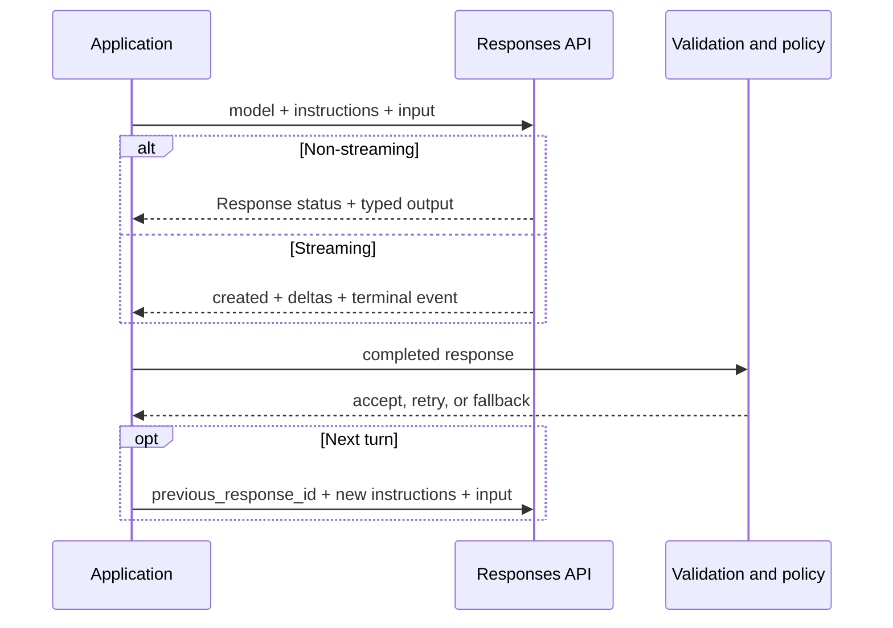

<TLDR>
  <TLDRCell label="what">
    OpenAI API 是模型与工具能力的 HTTP 接口；新文本应用以 Responses API 作为直接调用模型的入口。
  </TLDRCell>
  <TLDRCell label="when">
    应用需要自行控制请求、响应状态、对话延续或流式输出，而不是把控制流交给上层框架时，直接使用它。
  </TLDRCell>
  <TLDRCell label="how">
    从服务端秘密存储注入密钥，按类型和状态解析响应，并把传输重试、流完成与业务副作用分成不同边界。
  </TLDRCell>
</TLDR>

## 是什么，为什么存在

OpenAI API 是 OpenAI 托管模型的编程接口。对于新的文本生成应用，核心入口是 `POST /v1/responses`；Python SDK 对应 `OpenAI().responses.create(...)`。一次请求可以包含文本、图像或文件输入，也可以声明内置工具和自定义函数工具。

Responses API 解决的不只是“把提示词发给模型”。它提供统一的响应对象，里面包含状态、类型化输出项、用量和错误信息。应用因此可以明确区分文本、推理项、工具调用与其他输出，而不是把所有结果压成一个无法检查的字符串。

顶层 `output` 是<Term id="response-item">响应项（response item）</Term>数组，不保证第一个元素就是助手文本。官方 SDK 提供 `output_text` 便利属性，用来聚合响应中的文本输出；需要处理工具、引用或其他内容时，仍要遍历类型化输出项。

API 也提供两种<Term id="conversation-state">对话状态（conversation state）</Term>管理方式。应用可以把上一轮 `response.id` 作为 `previous_response_id` 继续，也可以使用持久的 Conversation 对象。无论选择哪种方式，应用仍负责租户隔离、保留策略、上下文预算和业务历史。

这个主题聚焦 Responses API 的基础协议以及可靠的应用边界。提示词设计、结构化输出、函数调用、智能体和可观测性各有独立主题；这里不会重复它们的完整教程。图像生成、音频、嵌入和旧 Assistants API 也不属于这条最小调用链。

调用前需要创建项目密钥，并通过 `OPENAI_API_KEY` 或秘密管理服务注入服务端进程。浏览器和移动应用不能持有长期 API 密钥；它们应调用你自己的后端，由后端执行认证、授权、限额和 OpenAI 请求。

后端也不应把整个 Responses API 原样代理给客户端。模型、工具、输出预算和可用参数应由服务端允许列表控制，否则攻击者可以借你的项目权限调用更昂贵的能力或访问不该开放的工具。

## 工作原理

一个最小请求包含 `model` 与 `input`。`instructions` 用于可信的高层行为约束，`input` 用于本轮用户内容或类型化输入项。直接发送 HTTP 时还要带上 `Authorization: Bearer ...` 和 `Content-Type: application/json`；官方 SDK 会处理认证头、序列化和错误类型。

`model` 是部署选择，不是业务逻辑。开发环境可以使用当前别名进行探索，但生产发布应根据可用性与评测结果选择模型，并在需要稳定行为时固定模型快照。任何模型或提示词变更都要重新运行同一套评测，而不是根据名称推断兼容性。

同步响应可能处于 `completed`、`failed`、`in_progress`、`cancelled`、`queued` 或 `incomplete` 等状态。只有状态符合应用契约时，才能接受内容；达到输出上限等不完整情况必须读取 `incomplete_details` 并走显式回退。文本读起来像完整句子，不能证明响应已经完整结束。

| `status` | 应用动作 |
|---|---|
| `completed` | 继续执行内容与业务验证 |
| `incomplete` | 检查 `incomplete_details`，标记截断或回退 |
| `failed` | 读取错误并按类别处理 |
| `in_progress` | 继续轮询或等待事件，不消费最终结果 |
| `queued` | 保持等待状态，并允许取消 |
| `cancelled` | 丢弃未提交内容并结束等待 |

这些状态只说明服务端生成生命周期，不会替应用判断内容是否正确。`completed` 之后仍要验证结构、领域规则和权限；`incomplete` 也不一定适合重试，例如输入或输出预算配置错误时，原样重发只会重复失败。

`output` 中每个元素都有 `type`。消息项还包含自己的 `content` 数组，其中的文本块类型为 `output_text`。推理模型或启用工具的请求可能在消息项前后产生其他类型，因此直接读取 `response.output[0].content[0].text` 是脆弱的。

多轮交互可以通过 `previous_response_id` 建立响应链。继续请求仍应显式发送本轮的 `instructions`，因为上一轮的 `instructions` 不会自动带到下一轮。响应链也不会免除上下文成本：链中先前输入仍计入后续请求的输入 token。

设置 `stream: true` 后，服务通过<Term id="server-sent-events">服务器发送事件（Server-Sent Events，SSE）</Term>逐步返回状态和增量。常见文本事件包括 `response.created`、多次 `response.output_text.delta`、最终的 `response.completed`，以及 `error`。客户端必须看到终止事件后，才能把已显示的部分文本标为完成。

下面是一次普通调用与两种后续路径。模型输出在进入业务代码前仍是不可信数据；模式验证、授权和副作用控制都位于 API 边界之外。



可靠实现会在一次调用周围记录四类信息：应用功能和提示词版本、所请求与实际返回的模型、服务商的<Term id="request-id">请求 ID（request ID）</Term>、完成状态与验证结果。日志应使用字段允许列表并删减敏感内容；能够关联请求不等于保存完整提示词、用户文件或认证头。

## 示例

以下四个示例都在本地运行，不向 OpenAI 发送请求，也不把手写内容冒充真实模型输出。它们使用与已验证文档一致的请求或响应夹具，测试应用自己拥有的协议代码；接入测试仍需使用受限的独立项目和测试密钥。

<Depth level="quick">

### 构造最小 HTTP 请求

第一个示例用 Python 标准库构造请求，但在网络发送前停止。这样可以检查方法、端点、认证方式和 JSON 形状，同时不暴露真实密钥，也不产生非确定性输出。

```python run title="request_contract.py"
import json
from urllib.request import Request


def build_response_request(
    api_key: str,
    model: str,
    user_input: str,
) -> Request:
    payload = {
        "model": model,
        "instructions": "Return one concise support category.",
        "input": user_input,
        "max_output_tokens": 80,
    }
    return Request(
        "https://api.openai.com/v1/responses",
        data=json.dumps(payload).encode("utf-8"),
        method="POST",
        headers={
            "Authorization": f"Bearer {api_key}",
            "Content-Type": "application/json",
        },
    )


request = build_response_request(
    "test-key",
    "gpt-6-astra",
    "Classify: payment failed",
)
body = json.loads(request.data.decode("utf-8"))
print(request.method, request.full_url)
print("Bearer header:", request.get_header("Authorization").startswith("Bearer "))
print("Model:", body["model"])
print("Input:", body["input"])
```

```text
POST https://api.openai.com/v1/responses
Bearer header: True
Model: gpt-6-astra
Input: Classify: payment failed
```

生产代码应让 `OpenAI()` 从环境变量或工作负载身份读取凭据，并复用长生命周期客户端。示例中的 `test-key` 只用于检查请求对象；真实密钥不能进入源代码、浏览器包、异常正文或日志。模型 ID 也应集中配置，而不是散落在业务函数中。

</Depth>

### 按类型读取响应项

第二个示例故意让推理项排在消息项之前。解析器先检查顶层状态，再遍历全部消息与内容块；它不会假定 `output[0]` 一定含有 `content`。

```python run title="response_items.py"
def completed_text(response: dict) -> str:
    if response["status"] != "completed":
        detail = response.get("incomplete_details") or response.get("error")
        raise RuntimeError(f"response not completed: {detail}")

    pieces = []
    for item in response["output"]:
        if item.get("type") != "message":
            continue
        for block in item.get("content", []):
            if block.get("type") == "output_text":
                pieces.append(block["text"])
    return "".join(pieces)


response = {
    "id": "resp_demo",
    "status": "completed",
    "output": [
        {"type": "reasoning", "id": "rs_demo", "summary": []},
        {
            "type": "message",
            "role": "assistant",
            "content": [
                {"type": "output_text", "text": "billing", "annotations": []}
            ],
        },
    ],
    "usage": {"input_tokens": 28, "output_tokens": 7, "total_tokens": 35},
}

print("Status:", response["status"])
print("Text:", completed_text(response))
print("Total tokens:", response["usage"]["total_tokens"])
```

```text
Status: completed
Text: billing
Total tokens: 35
```

示例中的响应和 token 数都是本地协议夹具，不是实时模型结果或容量数据。使用官方 SDK 时，纯文本路径可以先检查状态，再读取 `response.output_text`；需要工具调用、引用或其他输出时，则按类型遍历 `response.output`。未知类型应安全记录或拒绝，不能当作文本强制解析。

### 构造对话续接请求

第三个示例生成第二轮请求的 JSON。它显式携带上一轮 ID，也重新发送可信指令；如果产品改用了不同的系统规则，这个边界能让变化出现在请求构造器和测试中。

```python run title="conversation_turn.py"
import json


def next_turn(previous_id: str, user_input: str) -> dict:
    return {
        "model": "gpt-6-astra",
        "previous_response_id": previous_id,
        # 上一轮 instructions 不会自动继承。
        "instructions": "Answer as a concise support agent.",
        "input": [{"role": "user", "content": user_input}],
        "store": True,
    }


request_body = next_turn(
    "resp_first",
    "Explain why the ticket belongs in billing.",
)
print("Previous:", request_body["previous_response_id"])
print("Instructions:", request_body["instructions"])
print("Role:", request_body["input"][0]["role"])
print("Stored:", request_body["store"])
print(json.dumps(request_body["input"][0], sort_keys=True))
```

```text
Previous: resp_first
Instructions: Answer as a concise support agent.
Role: user
Stored: True
{"content": "Explain why the ticket belongs in billing.", "role": "user"}
```

`previous_response_id` 让服务找到需要继续的响应链，但应用仍要确认这个 ID 属于当前租户和当前业务会话。若数据策略不允许默认保存响应，就应评估 `store: false` 与手动传递上下文的方式；Conversation 对象具有不同的持久化生命周期，也不能在没有保留策略的情况下默认使用。

对话变长时，不能仅靠删除最早字符串来管理上下文。工具调用与结果、消息角色和关键业务事实都可能形成协议依赖。应制定可测试的拒绝、摘要、压缩或重新开始策略，并记录哪一种策略影响了本轮请求。

### 累积流式文本

最后一个示例把 SSE 解码后的事件作为夹具输入状态机。只有收到 `response.completed` 才返回文本；显式错误、失败状态或没有终止事件的连接都会产生异常。

```python run title="stream_events.py"
def collect_stream(events: list[dict]) -> str:
    pieces = []
    completed = False
    for event in events:
        event_type = event["type"]
        if event_type == "response.output_text.delta":
            pieces.append(event["delta"])
        elif event_type == "response.completed":
            completed = event["response"]["status"] == "completed"
        elif event_type in {"response.failed", "response.incomplete", "error"}:
            raise RuntimeError(event_type)
        # 其他生命周期事件不表示文本已经完成。
    if not completed:
        raise RuntimeError("stream ended before response.completed")
    return "".join(pieces)


events = [
    {"type": "response.created", "response": {"status": "in_progress"}},
    {"type": "response.output_text.delta", "delta": "Payment "},
    {"type": "response.output_text.delta", "delta": "issue"},
    {"type": "future.event", "data": {}},
    {"type": "response.completed", "response": {"status": "completed"}},
]

print("Text:", collect_stream(events))
print("Terminal event:", events[-1]["type"])
```

```text
Text: Payment issue
Terminal event: response.completed
```

真实 SDK 返回类型化事件，直接消费 HTTP 时则要先正确解析 SSE 帧。UI 可以立即显示增量，但在终止事件前应保持“生成中”状态。连接中断后重新请求会开始一次新的生成，不能把新输出直接拼到旧的部分文本后，伪装成同一条完整响应。

## 陷阱

### 在不可信客户端放置 API 密钥

> [!PITFALL]
> 生成代码常把 `OPENAI_API_KEY` 写进前端环境文件，或让浏览器直接调用 OpenAI。构建工具可能把看似“环境变量”的值打进公开 JavaScript 包，任何访问者都能提取并滥用它。

**修复：** 只在受控的服务端运行时注入密钥，并通过自己的后端暴露窄接口。按环境和项目分离密钥，限制权限与支出，记录使用情况；发现泄露后立即撤销并轮换，而不是只从 Git 历史中删除字符串。

### 把 `output[0]` 当作文本

> [!PITFALL]
> `response.output[0].content[0].text` 只对某些简单响应碰巧成立。推理项、工具调用、多条消息或未来新增的输出类型都可能改变顺序和形状。

**修复：** 纯文本路径使用 SDK 的 `output_text` 聚合属性；协议级代码按 `type` 遍历所有输出项和内容块。先检查顶层状态，再决定是接受文本、继续工具循环、报告截断还是回退。

### 误以为续接会继承所有设置

> [!PITFALL]
> 传入 `previous_response_id` 会提供此前响应的上下文，但上一轮 `instructions` 不会自动进入下一轮。生成代码如果只发送新用户文本，可能悄悄丢掉产品规则和输出约束。

**修复：** 每轮从版本化配置重建可信指令，并用多轮契约测试检查实际请求。验证上一轮 ID 的租户与会话归属，同时把响应保存期限、Conversation 生命周期和上下文成本纳入设计。

### 对所有 429 和 4xx 原样重试

> [!PITFALL]
> 429 既可能表示暂时的请求速率限制，也可能表示余额或支出上限。认证失败、无效参数和支出耗尽不会因为相同请求重发而恢复，盲目退避只会增加流量与延迟。

**修复：** 按 HTTP 状态、`error.type` 和 `error.code` 分类。暂时性限流优先遵守 `Retry-After`，缺失时才使用带随机抖动的有界指数退避；配置、认证、余额与业务验证错误应快速失败并交给相应处置流程。

### 把模型重试扩大为业务重放

> [!PITFALL]
> SDK、代理或任务执行器可能重试模型请求。如果同一个重试块还包含扣款、发信或写数据库，暂时性传输错误就可能导致重复副作用。

**修复：** 把模型响应、验证和业务提交拆成可恢复的状态转换。副作用使用持久化的<Term id="idempotency-key">幂等键（idempotency key）</Term>与结果记录；超时后先查询既有结果，再判断是否需要重新执行。

### 把流断开当作正常完成

> [!PITFALL]
> 已收到 HTTP 200 或若干文本增量，不代表生成成功结束。网络可能在 `response.completed` 之前断开，API 也可能通过流发送错误事件。

**修复：** 按事件类型维护状态，只有明确的完成事件才能提交结果。断流时保留诊断信息并把部分文本标为未完成；若重新生成，应替换或单独展示新结果，不能无条件续接旧字符串。

## AI 时代

**生成代码在这里常犯的错误：** 模型会混用旧版 Completions、Chat Completions 与 Responses 的字段，例如把 `messages` 传给 `responses.create`，或继续读取 `choices[0].message.content`。它还常假定 `output[0]` 是文本，忽略 `incomplete` 状态，在续接时漏发新的 `instructions`，并把前端环境变量误当成密钥保护。为“提高可靠性”生成的重试包装器有时会捕获所有异常，同时重复模型请求和业务副作用。

**让 AI 检查：**

1. “根据当前 Responses API，列出这段代码发送的每个请求字段和读取的每个响应字段，标出混入的旧 API 字段。”
2. “枚举这条路径可能收到的响应状态、输出项类型和流终止事件，指出哪些分支会把未完成输出当作成功。”
3. “从 API 重试追踪到数据库、邮件或付款，指出副作用边界、幂等键与持久结果分别在哪里。”

**审查清单：**

- 密钥只存在于受控服务端，模型与提示词版本来自配置，依赖的 API 字段已对照当前官方文档。
- 代码先检查响应状态，再按类型处理输出项；多轮请求重新发送可信指令，并验证会话归属。
- 流只有在完成事件后才提交，错误按类别处理，任何副作用都有独立授权和幂等控制。

**提示词词汇：** 使用准确术语：`Responses API`（响应 API）、`response item`（响应项）、`output_text`（聚合文本输出）、`previous_response_id`（上一响应 ID）、`conversation state`（对话状态）、`terminal event`（终止事件）、`Retry-After`（重试等待时间）、`idempotency key`（幂等键）。要求 AI 画出请求、响应、验证与提交的状态转换；“让 API 调用更健壮”无法暴露它准备重试哪些动作。

<Depth level="deep">

## 响应、状态与保存边界

### 类型化输出而非消息字符串

Responses API 的顶层对象同时描述一次生成的生命周期和产物。`status` 表示整体进度，`output` 保存有序的响应项，`usage` 记录计量信息；失败或未完成时还可能出现 `error` 与 `incomplete_details`。应用适配器应把这些字段转换为自己的结果联合类型，而不是在最底层就只返回字符串。

消息响应项内部还有内容块层级。文本、拒绝和注解属于内容块；工具调用与推理信息可能是其他顶层响应项。SDK 的 `output_text` 很适合只需要展示文本的窄路径，但它有意隐藏了非文本项，因此不能代替工具分派、引用保留或审计代码。

应用应定义“可接受完成”的具体条件。例如，草稿界面可以显示带有未完成标记的部分文本，而自动发布流程必须要求 `completed`、成功的模式验证和业务审核。把这个条件写成一个函数并测试所有状态，比在多个控制器里散落字符串比较更可靠。

### 对话链与 Conversation 对象

`previous_response_id` 适合从某个既有响应继续，并允许从同一节点分叉不同后续轮次。应用必须把响应 ID 当作租户范围内的资源引用，不能接受用户任意提交的 ID。服务能解析某个 ID，也不代表当前调用者有权把它加入自己的对话。

Conversation 对象适合需要持久容器的工作流；响应链则适合更轻量的延续。两者的保留行为不同，选择前要确认数据政策。官方文档说明，响应对象默认保存 30 天并可通过 `store: false` 关闭，而附加到 Conversation 的项目不受该 30 天期限约束。

无论使用哪种服务端状态，应用数据库仍应保存业务所需的规范记录，例如工单 ID、已批准的摘要和最终决定。不要把供应商对话当作唯一业务事实来源。删除或过期策略也必须能处理供应商对象与本地引用之间的关系。

### 重试、限流与排障

<Term id="rate-limiting">速率限制（rate limiting）</Term>可能按请求量、token 量、项目或其他配额生效。429 的恢复动作取决于错误码：临时吞吐限制可以等待，余额或支出上限则需要配置或账务变化。重试策略必须读取结构化错误，不能只看状态码。

官方 SDK 已经可能为符合条件的错误执行重试，所以外层重试器必须把这些尝试计算在总预算内。为每次用户操作设置最大耗时和最大尝试次数，使用随机抖动避免大量实例同时重发。取消请求后，也要阻止排队中的应用任务继续提交结果。

排障记录应包含时间、模型、应用版本、错误类型与请求 ID，但不应包含认证头和未删减的敏感输入。支持请求通常需要关联 ID；没有它时只能依靠时间与模糊日志匹配。应用自己的关联 ID 与服务商请求 ID 应分别保存，因为一次业务操作可能产生多次模型请求。

### 流式传输的提交语义

流式传输改变的是交付方式，不是内容可信度。`response.output_text.delta` 可以降低用户看到首段文字的等待时间，但每个增量都只是暂定状态。只有终止事件、完整响应状态与应用验证共同满足契约后，才能触发索引、通知或其他下游动作。

客户端取消、网络断开和服务端错误是三个不同事件。它们可以共享“输出未完成”的 UI 表现，却需要不同的诊断与重试决策。尤其不要把一个新请求的文本当作旧请求的字节级续传；两次生成可能从中间开始就不同。

如果流中包含工具调用或结构化参数，增量还需要按响应项和内容索引分别累积。字符串拼接器无法保持这些边界。优先使用官方 SDK 的类型化事件；自行实现 SSE 时，先测试分帧、重复或未知事件、断流和显式错误，再接入业务处理。

</Depth>

<Checkpoint id="ai/openai-api" />

## 延伸阅读

- [OpenAI API 参考：创建模型响应](https://developers.openai.com/api/reference/python/resources/responses/methods/create)
- [OpenAI API 文档：文本生成](https://developers.openai.com/api/docs/guides/text)
- [OpenAI API 文档：对话状态](https://developers.openai.com/api/docs/guides/conversation-state)
- [OpenAI API 文档：流式响应](https://developers.openai.com/api/docs/guides/streaming-responses)
- [OpenAI API 文档：错误码](https://developers.openai.com/api/docs/guides/error-codes)
- [OpenAI API 文档：生产最佳实践](https://developers.openai.com/api/docs/guides/production-best-practices)
