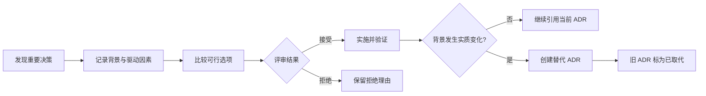

<TLDR>
  <TLDRCell label="what">
    An architecture decision record (ADR) captures one important design choice together with its context, alternatives, and consequences.
  </TLDRCell>
  <TLDRCell label="trap">
    Recording only the choice loses the reasoning; rewriting an accepted ADR falsifies history and hides why older code exists.
  </TLDRCell>
  <TLDRCell label="fix">
    Write a short record while deciding, make trade-offs and validation explicit, and supersede stale decisions with new ADRs.
  </TLDRCell>
</TLDR>

## What it is and why it exists

An <Term id="architecture-decision-record">architecture decision record (ADR)</Term> is a short document about one decision that materially affects a system's structure, quality attributes, dependencies, interfaces, or delivery. It answers four things: which constraints applied, which options were considered, what the team chose, and which consequences it accepted. An ADR records one decision; it is not the architecture manual for the whole system.

Code shows how a system works now, but it rarely explains why it has that shape. Tickets and chat logs may preserve pieces of a discussion, while the conclusion, constraints, and evidence remain scattered. An ADR puts them in one versioned record near the code, so maintainers can distinguish a deliberate trade-off from an accidental implementation.

A set of ADRs forms a <Term id="decision-log">decision log</Term>. It is not a meeting-minutes archive, and it need not record every dependency upgrade. The writing cost is usually justified only when a decision is expensive to reverse, crosses components or teams, changes an important quality attribute, or has several credible options.

Good ADR subjects include data-ownership boundaries, communication between services, identity models, and disaster-recovery objectives. Local variable names, easy-to-reverse refactors, and temporary troubleshooting steps do not need ADRs. Those belong in code review, tickets, or runbooks.

An ADR does not prove that an old choice will remain correct forever. It lets future readers see the information available at the time and reconsider the choice when conditions change. That context helps maintainers decide whether old constraints still apply, and the history keeps them from repeating costly experiments.

## How it works

A useful ADR separates facts, choices, and predictions. Context describes constraints that already exist; the decision says in active voice what the team will do; consequences list expected benefits, costs, and risks. Writing aspirations as context, or untested benefits as facts, weakens the record.

The minimum useful structure usually contains these fields:

| Field | Question it answers | Writing requirement |
| --- | --- | --- |
| Title | What was chosen | Short, specific, recognizable in an index |
| Status | Where is the decision in its lifecycle | Use a small, team-defined set of states |
| Context | Which facts and constraints force a choice | Name quality attributes, boundaries, and known unknowns |
| Options | Which viable paths were seriously compared | Include the status quo; omit straw alternatives |
| Decision | Which path was chosen and why | Connect the rationale to decision drivers |
| Consequences | What becomes easier, harder, or necessary | Record positive and negative effects |
| Validation | How will the team detect compliance | Point to tests, metrics, reviews, or exercises |

A <Term id="decision-driver">decision driver</Term> is a constraint or goal that distinguishes the options, such as recovery time, a data-residency boundary, operational skill, or a migration deadline. It must be specific enough to rule options in or out. “Scalable” is too broad; “restore writes within 30 minutes of losing one region” can guide a comparison.

An ADR lifecycle is not decoration around an approval process. Status must report reality: a proposed record is under discussion, an accepted record is currently in force, a rejected record was not adopted, and a superseded record once applied but has a replacement. A team may add deprecated or deferred, but each state's meaning must stay fixed.



A number or stable slug lets code reviews, tickets, and other ADRs cite the record. Never reuse an identifier, or an old link may silently point to a different decision. The collection's index should show at least the identifier, title, status, and replacement relation so maintainers need not open every file.

ADR review is about whether the reasoning can be challenged, not the number of votes. Reviewers should check the evidence for important constraints, whether alternatives were genuinely viable, whether consequences are balanced, and whether validation can detect drift. An owner moves the decision forward and maintains status, but substantive dissent belongs in the record rather than being rewritten as false consensus.

Once accepted, the body of an ADR should remain stable. A spelling fix or repaired link can be a clearly marked amendment; a changed rationale, scope, or consequence requires a new record. The new ADR explains the changed context and links to the old one, while the old record points back through a <Term id="supersession">supersession</Term> relation.

### From proposal to acceptance

Open a proposal while there is still room to choose, not after implementation as an explanation. Putting an ADR through ordinary code review preserves line comments and version history; affected teams still need whatever discussion process fits them, because a pull request alone does not establish agreement.

A lightweight review can proceed in this order:

1. Confirm the problem and decision boundary, removing context unrelated to this choice.
2. Verify hard constraints and evidence, and identify what remains unknown.
3. Compare viable options, allowing the status quo to win.
4. Record dissent, the owner, and the final decision makers.
5. Accept before implementation, then track validation and follow-up work.

The acceptance date says when the decision took effect; it does not say implementation is complete. Track implementation separately in metadata or in validation tickets. Combining decision state and delivery progress in one field makes “accepted” mean different things across records.

A rejected proposal may also be worth retaining when it captures an option that received serious evaluation. It prevents the same proposal returning without new evidence. A personal note or duplicate draft can be closed before it enters the permanent identifier sequence.

### ADRs and neighboring documents

An ADR does not replace every kind of technical documentation. It preserves the reasoning behind a choice, while other documents preserve current facts, operating steps, or outstanding work. Making one artifact carry every role causes it to become inaccurate quickly.

| Document | Primary content | When it changes |
| --- | --- | --- |
| ADR | Context, rationale, and consequences of one important choice | Add a replacement when the decision changes |
| Architecture description | Current system structure and boundaries | When implemented structure changes |
| Runbook | Diagnostic and recovery steps | When operating procedures change |
| Ticket | Outstanding work, ownership, and progress | As work advances |

Link these artifacts without copying whole sections among them. An ADR can point to an architecture diagram and validation ticket; an architecture description can link a boundary back to the ADR that established it. A link preserves provenance, while copied text creates two versions to synchronize.

## Examples

These three examples use Node 24 and built-in JavaScript APIs. They generate a minimal ADR, reject missing information, and maintain a supersession relation; every output shown here came from a local run.

### Generate a minimally useful record

<Depth level="quick">

```javascript run title="create-adr.js"
const decision = {
  number: '0042',
  title: 'Keep one PostgreSQL database',
  status: 'Proposed',
  context: 'Checkout and catalog still require shared transactions.',
  choice: 'Keep one database and assign each module its own schema.',
  consequences: [
    'Good: local transactions remain simple.',
    'Bad: modules cannot scale storage independently.',
  ],
};

const adr = [
  `# ADR-${decision.number}: ${decision.title}`,
  '',
  `Status: ${decision.status}`,
  '',
  '## Context',
  '',
  decision.context,
  '',
  '## Decision',
  '',
  decision.choice,
  '',
  '## Consequences',
  '',
  ...decision.consequences.map((item) => `- ${item}`),
].join('\n');

console.log(adr);
```

```text
# ADR-0042: Keep one PostgreSQL database

Status: Proposed

## Context

Checkout and catalog still require shared transactions.

## Decision

Keep one database and assign each module its own schema.

## Consequences

- Good: local transactions remain simple.
- Bad: modules cannot scale storage independently.
```

</Depth>

The record is short, but it does not omit the rationale or the cost. The title names a concrete choice, context states only the current constraint, the decision is actionable, and the consequences preserve one benefit and one limitation. Before acceptance, the team should add alternatives, an owner, and a validation method.

A generator can standardize the format, but it cannot make the decision for the team. Every sentence in the input object still needs review, especially facts in context and predictions in consequences. The longer the template, the greater the temptation to fill mandatory fields with empty prose.

### Reject a record that contains only a conclusion

The next script runs a lightweight check over a candidate ADR. It cannot tell whether the architecture choice is correct, but it can stop a record with no alternatives, balanced consequences, or validation from entering review.

```javascript run title="check-adr.js"
const candidate = `# ADR-0043: Split the catalog database

Status: Proposed

## Context

Catalog reads cause lock contention during checkout.

## Decision

Move catalog data to a separate database.

## Consequences

- Good: catalog reads no longer share checkout locks.`;

const requiredHeadings = [
  'Context',
  'Considered options',
  'Decision',
  'Consequences',
  'Validation',
];

const issues = requiredHeadings
  .filter((heading) => !candidate.includes(`## ${heading}`))
  .map((heading) => `missing section: ${heading}`);

if (!/^- Bad:/m.test(candidate)) {
  issues.push('missing a negative consequence');
}

console.log(`ready for review: ${issues.length === 0}`);
console.log(issues.join('\n'));
```

```text
ready for review: false
missing section: Considered options
missing section: Validation
missing a negative consequence
```

The result does not claim that splitting the database is the wrong choice. It says the record is not ready: readers cannot see which alternatives were compared or how reduced lock contention will be confirmed, and they cannot see the transactional or operational cost of the split.

Checks like this fit in continuous integration, but their rules should stay mechanical and visible. Do not substitute a word-count threshold for judgment; a long context can still contain no verifiable fact. Architecture review owns semantics, while the script protects a formatting floor.

### Supersede instead of overwriting

The final example models supersession as a two-way relation. Only an accepted new record can replace a currently accepted record; the old record retains its identifier and a reference to the replacement.

```javascript run title="supersede-adr.js"
const records = new Map([
  ['ADR-0012', { status: 'Accepted', replacement: null }],
]);

function supersede(records, oldId, newId, newRecord) {
  const oldRecord = records.get(oldId);

  if (!oldRecord || oldRecord.status !== 'Accepted') {
    throw new Error(`${oldId} is not an accepted decision`);
  }

  if (newRecord.status !== 'Accepted') {
    throw new Error(`${newId} must be accepted first`);
  }

  records.set(oldId, {
    ...oldRecord,
    status: `Superseded by ${newId}`,
    replacement: newId,
  });
  records.set(newId, { ...newRecord, supersedes: oldId });
}

supersede(records, 'ADR-0012', 'ADR-0043', {
  status: 'Accepted',
  replacement: null,
});

for (const [id, record] of records) {
  console.log(`${id}: ${record.status}`);
}
console.log(`replacement: ${records.get('ADR-0012').replacement}`);
```

```text
ADR-0012: Superseded by ADR-0043
ADR-0043: Accepted
replacement: ADR-0043
```

The two links answer different questions: code built under the old decision can lead you to the current one, and the new ADR shows what it replaced. A real repository should also verify that targets exist and that supersession chains contain no cycles.

The example uses in-memory objects to show the state change. In version control, commit two file changes: add the replacement ADR, then update only the old ADR's status and link. Do not delete the old file or rewrite its body with the new rationale.

## Pitfalls

### Recording only the choice

> [!PITFALL]
> “Use Kafka” or “move to microservices” is a conclusion. It does not name the quality attribute being protected, the options declined, or the condition that should trigger reconsideration.

**Fix:** State the facts and decision drivers behind the choice, and list credible options, including the status quo. Each important reason should map to a driver instead of relying on an uncheckable label such as “industry standard.”

### Polishing the context after the fact

> [!PITFALL]
> When an ADR is written after implementation, authors can turn known outcomes into supposed predictions and omit options that were reasonable but failed.

**Fix:** Create the record while the decision is still proposed. If a historical decision must be reconstructed, label it retrospective, separate evidence available then from results known now, and link to commits or tickets that support the timeline.

### Rewriting an accepted decision in place

> [!PITFALL]
> Editing an old ADR's decision and rationale to match the current system makes old commits contradict the document and erases why the architecture changed.

**Fix:** Create a new ADR for a material change, link the record it replaces, then set the old status to “Superseded by ADR-XXXX.” Date small editorial corrections, and never let them change the original decision's meaning.

### Turning ADRs into a universal approval gate

> [!PITFALL]
> Requiring an ADR for every technical choice produces files nobody reads; treating signature count as a quality metric delays small, reversible decisions.

**Fix:** Define a recording threshold, such as cross-team impact, costly rollback, an important quality attribute, or several viable options. Keep lower-impact decisions in code review or tickets and reserve the ADR path for decisions above the threshold.

### Omitting validation and review triggers

> [!PITFALL]
> A consequence such as “lower latency” or “better reliability” cannot be judged after implementation when it has no metric, boundary, or observation method.

**Fix:** Name the validation signal, responsible role, and check timing. Give fragile assumptions change triggers, such as traffic, regulatory region, or recovery-objective changes; review when a trigger fires instead of mechanically rewriting every ADR on a calendar.

## In the AI era

**What generated code gets wrong here**

A model can infer a plausible ADR from the repository's current state and present guesses as historical facts. It may expand one user's preference into a decision “accepted by the team,” invent benchmark results or alternatives, or rewrite an accepted record to match a new implementation. Generated linters also tend to check only title and status, missing blank placeholders, broken supersession links, and records with no negative consequence.

**Ask your AI to check**

- Classify every ADR statement as fact, explicit assumption, or prediction, and point to repository evidence for each fact.
- Compare a code change with every active ADR, reporting deviations without editing any accepted record automatically.
- Verify that every `Superseded by` and `Supersedes` link is reciprocal, resolves to a record, and creates no cycle; report orphaned records.

**Review checklist**

- Confirm that status reflects real agreement and that every name, date, metric, and organizational constraint has a source.
- Confirm that considered alternatives were credible at the time and that wording does not hide negative consequences.
- Confirm that implementation drift creates a new proposal or an explicit warning instead of silently changing history.

**Prompt vocabulary**

Use the exact terms `architecture decision record`, `decision driver`, `considered option`, `trade-off`, `decision outcome`, `validation`, `supersedes`, and `decision log`. Asking a model to “separate repository evidence, explicit assumptions, and speculation” is more likely to prevent invented decision history than asking it to “write an ADR for this design.”

<Depth level="deep">

## Make the decision testable

A strong ADR explains why and also states what evidence will show that the decision remains effective. Validation connects architectural intent to implementation through dependency-rule tests, recovery exercises, capacity metrics, or security review. The target must sit inside a boundary the team controls; “the system never goes down” is neither verifiable nor useful to implementation.

Validation does not turn a temporary measurement into a permanent promise. Record the measurement scenario, inputs, and threshold, and keep supporting results in a versioned attachment where possible. If evidence lives in an external dashboard, name the metric, query scope, and owner so a dead link does not leave only an unsupported conclusion.

Decision drivers work best with priorities or elimination rules. An option that violates a hard data-residency constraint should not compensate with unrelated benefits; softer goals such as cost and delivery speed can be traded. Combining hard constraints and preferences in one scorecard only lets precise decimal totals conceal judgment.

Consequences are predictions about the environment after the decision, not promotional copy. A positive consequence names a capability gained, a negative one names a new cost or risk, and a neutral one names required work without declaring it good or bad. Observations after implementation can be appended as dated notes, but they must not silently replace the original predictions.

### Specific enough to fail

“Improve maintainability” has no failure condition. A better statement says modules may depend on one another only through public interfaces, with an architecture test rejecting reverse dependencies. A reviewer can then understand the choice and detect when code violates it.

“Support scaling” also needs a boundary. It could say that catalog reads may add replicas independently while checkout writes retain one transactional boundary. That statement invents no throughput number, but it identifies the kind of scaling the design permits.

When the team lacks reliable numbers, record the unknown and the plan for gathering evidence. Do not insert estimates just to make the ADR look complete. An explicit unknown motivates a prototype or measurement; false precision merely gives the choice unearned certainty.

### Turn consequences into follow-up work

Each negative consequence that needs mitigation should create a traceable action. If splitting a database introduces cross-boundary consistency, identify which business invariants need redesign instead of writing only “more complexity.” The action may live in the ticket system, while the ADR retains the link and reason.

Failed validation does not automatically reverse a decision. First ask whether the implementation drifted, the measurement is wrong, or the context changed. The first two usually call for fixing implementation or observability; only the last calls for a replacement ADR. This keeps the decision log from becoming a new file for every alert.

## Maintain a queryable decision log

One ADR is a document; a collection is a small dataset with status and relationships. Stable identifiers, finite states, reciprocal replacement links, and a consistent location let tools check integrity. A team can generate an index, but its source must remain the records themselves rather than another table maintained by hand.

The directory may follow system boundaries or keep one global sequence. Either works if references are unique and stable. If several teams each begin at `0001`, include the domain in the identifier or path so cross-domain references remain unambiguous.

Search matters more than polished rendering. Maintainers usually start with code, a service name, or a failure symptom, so ADRs should use terms found in the repository and receive backlinks from relevant module documentation. A decision site with no route from the code is easy to forget.

A status query must follow supersession links to the current record. Tools cannot merely filter for `Accepted` if older records express “superseded” in free text; define the allowed status format before automating the index. When migrating an old log, preserve bodies and normalize metadata separately rather than rewriting history in bulk.

### Automate log-integrity checks

Automation is suited to verifying relationships, not deciding architecture. Continuous integration can read ADR metadata and reject these structural errors:

- Duplicate identifiers or records that collide in the index.
- Supersession links that target missing files.
- One-sided reciprocal links or cycles in a supersession chain.
- Accepted records that still contain template placeholders.
- Current records with no owner or route to validation.

These checks cannot prove that the rationale is sound or that the team actually agreed. They only keep the decision log reliably queryable, leaving review time for evidence, boundaries, and trade-offs.

### Review on change

Periodic index review can find broken links and records with no owner, but a calendar date is not evidence that a decision expired. Better triggers come from context: regulation reaches a new region, data size crosses a design boundary, a vendor ends support, or the team loses an operational capability.

When a trigger fires, read the original drivers and consequences before creating a proposal. The new record should say which fact changed, which old reasons still hold, and why the new trade-off beats the status quo. The supersession chain then captures a change in reasoning, not merely a change in technology names.

If implementation has already drifted from an ADR, the status cannot remain “accepted and implemented” by documentary wish. The team must repair the implementation or record the deviation and propose a replacement. A truthful log matters more than a tidy status table.

</Depth>

<Checkpoint id="architecture/adr" />

## Further reading

- [MADR: Markdown Architectural Decision Records](https://adr.github.io/madr/)
- [ADR GitHub organization: templates, articles, and tool directory](https://adr.github.io/)
- [ADR template overview: MADR, Nygard, and Y-Statement](https://adr.github.io/adr-templates/)
- [MADR: annotated ADR template](https://adr.github.io/madr/decisions/adr-template.html)
