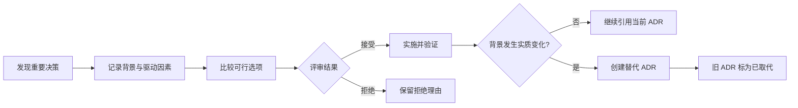

<TLDR>
  <TLDRCell label="what">
    架构决策记录（Architecture Decision Record，ADR）保存一项重要设计选择，以及当时的背景、备选方案和后果。
  </TLDRCell>
  <TLDRCell label="trap">
    只写最终选择会丢失推理；直接改写已接受的 ADR 又会伪造历史，让后来的人无法判断旧代码为何存在。
  </TLDRCell>
  <TLDRCell label="fix">
    在决策发生时写短记录，明确取舍和验证方式；背景变化时创建新 ADR，并把旧记录标为已取代。
  </TLDRCell>
</TLDR>

## 是什么，为什么存在

<Term id="architecture-decision-record">架构决策记录（Architecture Decision Record，ADR）</Term>是一份短文档，记录一个对系统结构、质量属性、依赖、接口或交付方式有显著影响的决定。它回答四件事：当时面对什么约束、考虑过哪些选项、选择了什么，以及团队接受了哪些后果。ADR 记录的是一项决策，不是整个系统的架构说明书。

代码能展示系统现在如何工作，却很少解释为什么采用这种结构。工单和聊天记录可能保存讨论片段，但结论、约束和证据散落在不同位置。ADR 把这些内容放进代码库附近的一份可版本化记录，让维护者能够区分有意的取舍与偶然的实现。

一组 ADR 构成<Term id="decision-log">决策日志（decision log）</Term>。它不是会议纪要仓库，也不要求记录每个依赖升级。只有当决定难以逆转、影响多个组件或团队、改变重要质量属性，或者存在多个合理选项时，记录成本才通常值得承担。

适合写 ADR 的决定包括：选择数据所有权边界、确定服务间通信方式、采用身份模型，以及规定灾难恢复目标。局部变量命名、容易撤销的小型重构和临时排障步骤不需要 ADR。后两类内容分别属于代码审查、工单或运行手册。

ADR 的价值不在于证明当年的选择永远正确。它让后来的人看到当时可用的信息，并在条件变化时有依据地重审决定。这些背景有助于判断旧约束是否仍然成立，保留下来的历史也能避免团队重复代价高昂的实验。

## 工作原理

一份可用的 ADR 把事实、选择和预测分开。背景描述已经存在的约束；决策用主动语态说明团队将做什么；后果列出预期收益、代价和风险。把愿望写成背景，或者把未验证的收益写成事实，都会削弱记录的可信度。

最小结构通常包含以下字段：

| 字段 | 要回答的问题 | 写作要求 |
| --- | --- | --- |
| 标题 | 做了什么选择 | 短、具体，能够从索引中辨认 |
| 状态 | 决策处于哪个生命周期阶段 | 使用团队定义的有限状态集合 |
| 背景 | 哪些事实和约束迫使团队选择 | 写出质量属性、边界与已知未知项 |
| 备选方案 | 哪些可行路径被认真比较 | 包含维持现状，不列虚假陪衬选项 |
| 决策 | 选择哪条路径，为什么 | 把理由连接到决策驱动因素 |
| 后果 | 什么会变容易、变困难或需要跟进 | 同时记录正面与负面影响 |
| 验证 | 如何确认实现仍符合决定 | 指向测试、指标、审查或演练 |

<Term id="decision-driver">决策驱动因素（decision driver）</Term>是用来区分选项的约束或目标，例如恢复时间、数据驻留边界、团队运维能力或迁移期限。它应当具体到足以排除某些方案。“可扩展”过于宽泛；“单一区域故障后 30 分钟内恢复写入”才可用来比较设计。

ADR 的生命周期不是审批流程的装饰。状态必须描述事实：提议中的记录仍在讨论，已接受的记录当前生效，被拒绝的记录没有被采用，已取代的记录曾经生效但已有替代决定。团队可以增加已弃用或已延后等状态，但每个状态的含义要固定。



编号或稳定的 slug 让记录可以被代码审查、工单和其他 ADR 引用。标识一旦分配就不要复用，否则旧链接可能悄悄指向另一个决定。目录中的索引至少应展示标识、标题、状态和替代关系，使维护者不必逐个打开文件。

评审 ADR 时，重点不是投票人数，而是推理能否被反驳。评审者应检查关键约束是否有证据、备选方案是否真实可行、后果是否对称，以及验证方式能否发现偏离。负责人负责推进和维护状态，但重要异议应留在记录中，不应被改写成虚假的一致意见。

一旦 ADR 被接受，正文应保持稳定。拼写修正或链接更新可以作为明确标注的小修订；改变理由、范围或后果需要新记录。新 ADR 说明变化的背景并链接旧 ADR，旧记录再通过<Term id="supersession">取代（supersession）</Term>关系指回新记录。

### 从提议走向接受

作者应在仍有选择空间时提交提议，而不是等实现完成后补一份说明。把 ADR 放进普通代码审查流程，能够保留逐行评论与版本历史；涉及的团队仍需采用适合自身的讨论方式，拉取请求本身并不等于达成共识。

一次轻量评审可以按以下顺序进行：

1. 确认问题和决策边界，删除与本决定无关的背景。
2. 核对硬约束与证据，明确仍未知的信息。
3. 比较可行选项，并允许维持现状胜出。
4. 记录异议、负责人和最终决策者。
5. 接受后再实施，并跟踪验证项与后续工作。

接受日期说明决定何时生效，不代表实现已经完成。团队可以在元数据中单独记录实施状态，或者让验证工单承载进度。把决策状态与交付进度混成一个字段，会让“已接受”在不同记录中表达不同事实。

被拒绝的提案也可能值得保留，前提是它记录了一个认真评估过的选项。它能阻止同一方案在没有新证据时反复进入讨论。如果草稿只是个人笔记或重复内容，则可以在进入正式编号序列前关闭。

### ADR 与相邻文档

ADR 不替代所有技术文档。它保存选择背后的推理，其他文档则保存当前事实、执行步骤或待办事项；用一种文档承担所有职责，会让它很快失真。

| 文档 | 主要内容 | 何时更新 |
| --- | --- | --- |
| ADR | 一项重要选择的背景、理由与后果 | 决策变化时新增替代记录 |
| 架构说明 | 系统当前结构与边界 | 实现结构变化时 |
| 运行手册 | 诊断与恢复步骤 | 运维流程变化时 |
| 工单 | 待完成工作、负责人和进度 | 工作推进时 |

这些文档应相互链接，但不能互相复制整段内容。ADR 可以指向架构图和验证工单；架构说明也可以从某个边界反向链接到决定它的 ADR。链接表达来源，复制则会制造两个需要同步的版本。

## 示例

下面三个示例使用 Node 24 和内置 JavaScript API。它们先生成最小 ADR，再检查缺失信息，最后维护取代关系；输出均来自本地执行。

### 生成最小可用记录

<Depth level="quick">

```javascript run title="create-adr.js"
const decision = {
  number: '0042',
  title: 'Keep one PostgreSQL database',
  status: 'Proposed',
  context: 'Checkout and catalog still require shared transactions.',
  choice: 'Keep one database and assign each module its own schema.',
  consequences: [
    'Good: local transactions remain simple.',
    'Bad: modules cannot scale storage independently.',
  ],
};

const adr = [
  `# ADR-${decision.number}: ${decision.title}`,
  '',
  `Status: ${decision.status}`,
  '',
  '## Context',
  '',
  decision.context,
  '',
  '## Decision',
  '',
  decision.choice,
  '',
  '## Consequences',
  '',
  ...decision.consequences.map((item) => `- ${item}`),
].join('\n');

console.log(adr);
```

```text
# ADR-0042: Keep one PostgreSQL database

Status: Proposed

## Context

Checkout and catalog still require shared transactions.

## Decision

Keep one database and assign each module its own schema.

## Consequences

- Good: local transactions remain simple.
- Bad: modules cannot scale storage independently.
```

</Depth>

这个记录很短，但没有省掉理由和代价。标题说明具体选择，背景只陈述当前约束，决策能被实施，后果则保留了一个收益和一个限制。真正提交前，团队还应补充备选方案、负责人和验证方法。

程序生成模板可以统一格式，却不能替团队作决定。传入对象里的每个句子仍需人工核对，尤其是背景中的事实与后果中的预测。模板越长，作者越容易用空泛句子填满必填字段。

### 拒绝只有结论的记录

下一段脚本对一个候选 ADR 做轻量检查。它不能判断架构选择是否正确，但可以阻止缺少备选方案、双向后果或验证方式的记录进入评审。

```javascript run title="check-adr.js"
const candidate = `# ADR-0043: Split the catalog database

Status: Proposed

## Context

Catalog reads cause lock contention during checkout.

## Decision

Move catalog data to a separate database.

## Consequences

- Good: catalog reads no longer share checkout locks.`;

const requiredHeadings = [
  'Context',
  'Considered options',
  'Decision',
  'Consequences',
  'Validation',
];

const issues = requiredHeadings
  .filter((heading) => !candidate.includes(`## ${heading}`))
  .map((heading) => `missing section: ${heading}`);

if (!/^- Bad:/m.test(candidate)) {
  issues.push('missing a negative consequence');
}

console.log(`ready for review: ${issues.length === 0}`);
console.log(issues.join('\n'));
```

```text
ready for review: false
missing section: Considered options
missing section: Validation
missing a negative consequence
```

检查结果没有说“拆分数据库”是错误选择。它只指出记录还无法接受：读者不知道哪些替代方案被比较，也不知道如何确认锁竞争改善，同时没有看到拆分引入的事务或运维代价。

这类检查适合放进持续集成，但规则应保持机械且透明。不要用字数阈值代替内容判断；一段很长的背景仍可能没有任何可验证事实。架构评审负责语义，脚本只守住格式底线。

### 用新记录取代旧决定

最后一个示例把取代建模为双向关系。只有已接受的新记录才能取代当前已接受的记录；旧记录仍保留原标识和新记录引用。

```javascript run title="supersede-adr.js"
const records = new Map([
  ['ADR-0012', { status: 'Accepted', replacement: null }],
]);

function supersede(records, oldId, newId, newRecord) {
  const oldRecord = records.get(oldId);

  if (!oldRecord || oldRecord.status !== 'Accepted') {
    throw new Error(`${oldId} is not an accepted decision`);
  }

  if (newRecord.status !== 'Accepted') {
    throw new Error(`${newId} must be accepted first`);
  }

  records.set(oldId, {
    ...oldRecord,
    status: `Superseded by ${newId}`,
    replacement: newId,
  });
  records.set(newId, { ...newRecord, supersedes: oldId });
}

supersede(records, 'ADR-0012', 'ADR-0043', {
  status: 'Accepted',
  replacement: null,
});

for (const [id, record] of records) {
  console.log(`${id}: ${record.status}`);
}
console.log(`replacement: ${records.get('ADR-0012').replacement}`);
```

```text
ADR-0012: Superseded by ADR-0043
ADR-0043: Accepted
replacement: ADR-0043
```

双向链接回答两个不同问题：查看旧代码时，可以找到当前决定；查看新 ADR 时，也能知道它替换了什么。真实仓库还应检查引用目标存在，并阻止取代链形成环。

示例用内存对象展示状态变化，版本控制中的做法是提交两个文件的变更：新增替代 ADR，同时只更新旧 ADR 的状态与链接。不要删除旧文件，也不要把旧正文改写成新理由。

## 陷阱

### 只记录最终选择

> [!PITFALL]
> “使用 Kafka”或“迁移到微服务”只是一条结论。它没有说明要保护的质量属性、被放弃的选项，也没有留下重新评估的条件。

**修复方法：** 写出促成选择的事实和决策驱动因素，并列出真正可行的备选方案，包括维持现状。每项关键理由都要能对应到一个驱动因素，而不是依赖“行业标准”之类无法核对的判断。

### 事后美化背景

> [!PITFALL]
> 实施完成后才补写 ADR，作者容易把已知结果写成当时的预测，并删掉曾经合理但最终失败的选项。

**修复方法：** 在决定仍处于提议状态时创建记录。必须补记历史决定时，要标明这是回溯记录，区分当时证据与现在观察到的结果，并链接能够佐证时间线的提交或工单。

### 原地改写已接受的决定

> [!PITFALL]
> 直接把旧 ADR 的决策和理由改成现状，会让旧提交与文档相互矛盾，也抹掉架构变化的原因。

**修复方法：** 为实质变化创建新 ADR，链接被取代记录，再把旧状态改为“被 ADR-XXXX 取代”。小型文字修正应注明日期，而且不能改变原决定的含义。

### 把 ADR 当作万能审批门

> [!PITFALL]
> 要求每个技术选择都写 ADR，会产生大量没人阅读的文件；把签字人数当作质量指标，则会拖慢可逆的小决定。

**修复方法：** 设定记录阈值，例如跨团队影响、昂贵回滚、重要质量属性或多个合理选项。低于阈值的决定留在代码审查或工单，高于阈值的决定才进入 ADR 流程。

### 缺少验证与重审触发条件

> [!PITFALL]
> “降低延迟”“提高可靠性”这样的后果如果没有指标、边界和观察方式，实施后无法判断选择是否兑现承诺。

**修复方法：** 写明验证信号、负责角色和检查时机。对可能失效的假设设置触发条件，例如流量级别、合规区域或恢复目标变化；触发后重审决定，而不是按日历机械重写所有 ADR。

## AI 时代

智能体可以在提出实现方案的同时起草 ADR，把各个选项与已有决策、相关提交和测量结果联系起来。例如，更换消息系统时，可以让它根据项目的数据驻留要求和代表性负载比较两种可行的服务，在缺少依据时用小型原型补充验证。记录应便于日后回顾所选方案的取舍和依据；随着决策演变，智能体可以同步维护实现、验证检查和决策之间的取代关系。

<Depth level="deep">

## 把决定写成可检验的约束

高质量 ADR 不只解释为什么，还说明什么证据会证明决定仍然有效。验证项把架构意图连接到实现，例如依赖规则测试、恢复演练、容量指标或安全审查。验证对象必须位于团队能控制的边界内；“系统永不宕机”既无法验证，也不能指导实现。

验证不等于把暂时测得的结果写成永久承诺。记录应注明测量场景、输入和阈值，相关报告可以放在版本化附件中。若证据依赖外部仪表盘，ADR 至少要写出指标名称、查询范围和负责人，避免链接失效后只剩一句结论。

决策驱动因素最好带有优先级或淘汰条件。某个方案如果违反数据驻留硬约束，就不应靠其他优点抵消；成本、开发速度等软目标则可以权衡。把硬约束和偏好混在同一张评分表里，精确的小数总分只会掩盖判断。

后果是对决策之后环境的预测，而不是宣传材料。正面后果说明获得什么能力，负面后果说明新增什么成本或风险，中性后果记录必须完成但不直接评价好坏的工作。实施后的观察可以追加为有日期的备注，但不能悄悄替换原预测。

### 具体到可以失败

“提高可维护性”没有失败条件。更好的写法是说明模块之间只允许通过公开接口依赖，并用架构测试拒绝反向依赖。这样，评审者既能理解选择，也知道代码何时违背它。

“支持扩展”同样需要边界。可以写成目录读取能够独立增加副本，而结账写入仍保留单一事务边界。这个表述没有编造吞吐量，却明确了设计允许哪一种扩展方式。

当团队没有可靠数字时，应如实记录未知项和取得证据的计划。不要为了让 ADR 看起来完整而填入估算数字。未知项会推动原型或测量；伪精确数字只会给选择披上一层虚假的确定性。

### 从后果生成跟进工作

每个需要缓解的负面后果都应产生一个可追踪动作。例如，拆分数据库引入跨边界一致性问题，就要明确哪些业务不变量需要重新设计，而不是只写“复杂度增加”。跟进动作可以进入工单系统，ADR 保留链接和原因。

验证失败不必自动撤销决定。先判断是实现偏离、测量错误，还是背景已经变化。前两种情况通常修复实现或观测；最后一种情况才需要替代 ADR。这个区分防止决策日志变成每次告警都新增一份文件的流水账。

## 维护可查询的决策日志

单份 ADR 是文档，一组 ADR 则形成带状态和关系的小型数据集。稳定标识、有限状态、双向替代链接与统一目录让工具能够检查完整性。团队可以自动生成索引，但索引的源数据仍应来自每份记录，而不是另一份需要手工同步的表格。

目录结构可以按系统边界分组，也可以保持一个全局编号序列。两种方式都可行，关键是引用必须唯一且长期稳定。若多个团队各自从 `0001` 开始，就应把领域名纳入标识或路径，避免跨域引用含糊。

搜索比漂亮的渲染更重要。维护者通常从代码、服务名或错误现象出发寻找决定，因此 ADR 应使用仓库中的真实术语，并从相关模块文档反向链接。只有网站可见、代码旁没有入口的决策日志很容易被遗忘。

状态查询必须跟随取代链找到当前记录。工具不能仅过滤 `Accepted`，因为旧记录可能使用自由文本表示“已取代”；先定义允许的状态格式，再自动化索引。迁移旧日志时，保留原文并单独规范元数据，比批量重写正文安全。

### 自动检查日志完整性

自动化适合验证关系，不适合裁决架构。持续集成可以读取 ADR 元数据，并拒绝以下结构错误：

- 标识重复，或者索引中存在同名记录。
- 取代链接指向不存在的文件。
- 双向链接只有一侧，或者取代链形成环。
- 已接受记录仍保留模板占位符。
- 当前记录没有负责人或验证入口。

这些检查不会证明理由正确，也无法确认团队真的同意。它们只保证决策日志可以被可靠查询，把评审时间留给证据、边界和取舍。

### 重审由变化触发

定期浏览索引可以发现断链和无人负责的记录，但日历日期不是决定失效的证据。更有用的触发条件来自背景：法规覆盖新区域、数据规模跨过原设计边界、供应商停止支持，或者团队不再具备某项运维能力。

触发条件出现时，先检查原 ADR 的驱动因素和后果，再创建提案。新记录应明确指出哪个事实发生变化、哪些旧理由仍成立，以及为何新权衡优于维持现状。这样，取代链记录的是推理变化，而不只是技术名称变化。

如果实现已经偏离 ADR，状态不能凭文档愿望保持“已接受且已实施”。团队要么修复实现，要么记录偏离并发起替代决定。让文档说真话，比维持整洁的状态表更重要。

</Depth>

<Checkpoint id="architecture/adr" />

## 延伸阅读

- [MADR：Markdown Architectural Decision Records](https://adr.github.io/madr/)
- [ADR GitHub 组织：模板、文章与工具目录](https://adr.github.io/)
- [ADR 模板概览：MADR、Nygard 与 Y-Statement](https://adr.github.io/adr-templates/)
- [MADR：带注释的 ADR 模板](https://adr.github.io/madr/decisions/adr-template.html)
