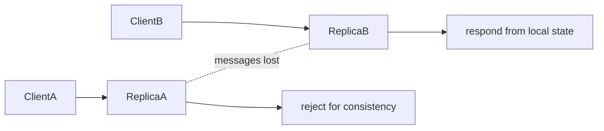

<TLDR>
  <TLDRCell label="what">
    CAP says that during a network partition, a shared-data system cannot guarantee both linearizability and completion of operations at every non-failing node.
  </TLDRCell>
  <TLDRCell label="trap">
    “Pick two” hides the real design problem: a partition is a fault assumption, and the system must decide per operation whether to reject, degrade, or accept conflict.
  </TLDRCell>
  <TLDRCell label="fix">
    Define the consistency boundary and business invariants first, then specify timeout responses, unknown outcomes, recovery, and verifiable fault tests.
  </TLDRCell>
</TLDR>

## What it is and why it exists

The CAP theorem describes a limit on replicated shared-data systems when network communication fails. Its three letters stand for consistency, availability, and partition tolerance. It is not a database scorecard but an impossibility result: in a model that allows messages to be lost, no algorithm can provide all three guarantees simultaneously.

Consistency in CAP usually means linearizability. Every completed operation appears to take effect atomically at some instant between its invocation and response, and the order respects real time. After a write returns successfully, a read that starts later cannot legally return an older value; this is much stronger than “replicas eventually become equal.”

Availability also has a specific CAP meaning. Every request received by a non-failing node must eventually complete with a response allowed by the object's specification. Rejecting an otherwise valid read or write to protect consistency, or waiting forever for an unreachable replica, gives up CAP availability for that operation; this is not the same metric as quarterly uptime or a latency SLO.

A network partition means that some messages between nodes can be lost or delayed indefinitely while nodes on both sides remain alive. A node sees only its local messages and cannot reliably distinguish a crashed peer, a broken link, and an extremely slow network. That missing information forces a choice when multiple nodes hold the same mutable state.

You meet this limit in multi-region databases, service discovery, configuration stores, shopping carts, and offline clients. CAP is most useful not when it labels a whole product `CP` or `AP`, but when it asks what a particular operation can promise after a timeout.

## How it works

Suppose two replicas initially hold `v1`, then the link between them fails. The left replica receives a request to change the value to `v2`, but it cannot know whether the right replica is still serving traffic. If the left side confirms the write, a later read on the right can still return `v1`, so the history cannot preserve real-time order and linearizability.

To preserve consistency, the system must stop at least one side from completing operations that could conflict. It can let a side with a valid majority proceed while making the minority read-only, or fail when it cannot confirm a commit. The cost is that some nodes remain healthy while requests to them cannot complete successfully.

To preserve availability, both sides must keep responding without messages from the other. They can accept local writes and serve local reads, but their replicas may diverge. After communication resumes, the system must detect concurrent updates, apply a merge rule, and address effects already exposed to users or external systems.



The two outcomes in the diagram are not permanent product types. A system can send balance deductions through a consistent path while serving catalog reads through an available path; even one operation can change policy across fault phases. Eric Brewer later stressed detecting a partition explicitly, entering partition mode, and then recovering instead of reducing CAP to a static “pick two.”

The formal result concerns guarantees in a model, while an engineered system must turn “how long without a message counts as a partition” into a timeout. A short timeout mistakes congestion for a partition and degrades early; a long timeout leaves user requests hanging on the consistent path. CAP chooses neither that duration nor a recovery protocol for you.

A design review must state at least four things: the object and scope of consistency, which requests must complete, what message loss the fault model includes, and how state and external side effects are handled after recovery. Without each one, “we choose CP” is not a testable requirement.

## Examples

These programs are teaching models, not distributed storage implementations. They reduce the decisions to one process so you can replay them deterministically; a real system also needs membership, persistence, retry handling, consensus, and fault-injection tests.

### Two paths through the same partition

The first model starts with two replicas holding the same value. `cpWrite` rejects a write when the link is down, so the old state does not diverge; `apWrite` accepts a local write, so two healthy replicas can immediately return different values.

<Depth level="quick">

```javascript run title="partition_choice.js"
class Replica {
  constructor(name, value) {
    this.name = name;
    this.value = value;
  }
}

function cpWrite(left, right, value, linkUp) {
  if (!linkUp) return 'rejected: peer unreachable';
  left.value = right.value = value;
  return 'accepted';
}

function apWrite(local, value) {
  local.value = value;
  return 'accepted locally';
}

const left = new Replica('A', 'v1');
const right = new Replica('B', 'v1');

console.log('CP write:', cpWrite(left, right, 'v2', false));
console.log('CP replicas:', left.value, right.value);

console.log('AP write:', apWrite(left, 'v2'));
console.log('AP reads:', left.value, right.value);
```

```text
CP write: rejected: peer unreachable
CP replicas: v1 v1
AP write: accepted locally
AP reads: v2 v1
```

</Depth>

This code does not prove that rejecting a write automatically provides linearizability. A real CP path must confirm that it is authorized to commit, for example by holding a majority in the current term; an isolated former leader cannot proceed because of a local Boolean. The example shows only the smallest unavoidable choice after a partition.

The AP path does not solve conflict for free either. `v2` is now visible to the caller on the left, while the right side may accept another value. Recovery cannot pretend that one operation never happened unless the business specification allows it to be discarded and handles its exposed consequences.

### A partition policy for each operation

The CAP choice should attach to operations and invariants, not to an entire service. A catalog view can tolerate an old snapshot, a favorites set can use mergeable operations, and a reservation for the final seat needs current global state.

```javascript run title="operation_policy.js"
function partitionPolicy(operation) {
  if (operation.needsCurrentGlobalState) {
    return 'reject and retry after recovery';
  }
  if (operation.mergeable) {
    return 'accept locally and merge later';
  }
  return 'serve local snapshot';
}

const operations = [
  {
    name: 'view catalog',
    needsCurrentGlobalState: false,
    mergeable: false,
  },
  {
    name: 'add favorite',
    needsCurrentGlobalState: false,
    mergeable: true,
  },
  {
    name: 'reserve last seat',
    needsCurrentGlobalState: true,
    mergeable: false,
  },
];

for (const operation of operations) {
  console.log(`${operation.name}: ${partitionPolicy(operation)}`);
}
```

```text
view catalog: serve local snapshot
add favorite: accept locally and merge later
reserve last seat: reject and retry after recovery
```

The policy first separates reads, mergeable writes, and writes constrained by a global invariant. It delays the last item because selling the “last seat” in both partitions exposes an irreversible promise to users. Another design could allocate seats or quotas to regions in advance, but that changes ownership of the invariant rather than escaping CAP.

The `mergeable` flag in the code also needs real algebra behind it. An operation should have a deterministic merge result and tolerate duplicate delivery; a Boolean field does not make arbitrary updates converge automatically.

### Why majorities must overlap

The basic value of a majority quorum is that any two majorities share at least one replica. Choosing three out of five replicas gives a minimum intersection of one; choosing only two out of four permits two completely disjoint groups.

```javascript run title="quorum_overlap.js"
function combinations(values, size) {
  if (size === 0) return [[]];
  return values.flatMap((value, index) =>
    combinations(values.slice(index + 1), size - 1).map((rest) => [value, ...rest]),
  );
}

function minimumOverlap(replicaCount, quorumSize) {
  const nodes = Array.from({ length: replicaCount }, (_, index) => index);
  const quorums = combinations(nodes, quorumSize);
  let result = { size: replicaCount, witness: null };

  for (const [index, left] of quorums.entries()) {
    for (const right of quorums.slice(index + 1)) {
      const size = left.filter((node) => right.includes(node)).length;
      if (size < result.size) result = { size, witness: [left, right] };
    }
  }
  return result;
}

for (const [replicas, quorum] of [[5, 3], [4, 2]]) {
  const { size, witness } = minimumOverlap(replicas, quorum);
  console.log(`N=${replicas}, Q=${quorum}, minimum overlap=${size}`);
  if (size === 0) console.log('disjoint witness:', JSON.stringify(witness));
}
```

```text
N=5, Q=3, minimum overlap=1
N=4, Q=2, minimum overlap=0
disjoint witness: [[0,1],[2,3]]
```

Intersection prevents two disjoint partitions from both assembling a majority, but it is only necessary structure. A linearizable store must also make intersection nodes obey term, log, or version rules and handle concurrent writes and membership changes correctly. Setting `W + R > N` does not by itself prove the whole protocol correct.

In a five-replica system, after three replicas are lost, the remaining two nodes are healthy but cannot form a three-node majority. The consistent path therefore stops completing operations, which is the concrete loss of availability during a partition. Whether reads may continue depends on their promised semantics, not on a rule that “reads are always safe.”

### How mergeable state recovers

If business operations can be represented as commutative, idempotent state updates, both sides of a partition can proceed and converge after recovery. This grow-only counter stores one monotonically increasing component per node; merging takes each component's maximum, so repeated merges do not count an update twice.

```javascript run title="gcounter_merge.js"
class GCounter {
  constructor(node, counts = {}) {
    this.node = node;
    this.counts = { ...counts };
  }

  increment() {
    this.counts[this.node] = (this.counts[this.node] ?? 0) + 1;
  }

  merge(other) {
    const nodes = new Set([...Object.keys(this.counts), ...Object.keys(other.counts)]);
    const merged = Object.fromEntries(
      [...nodes].map((node) => [
        node,
        Math.max(this.counts[node] ?? 0, other.counts[node] ?? 0),
      ]),
    );
    return new GCounter(this.node, merged);
  }

  get value() {
    return Object.values(this.counts).reduce((total, count) => total + count, 0);
  }
}

let paris = new GCounter('paris');
let tokyo = new GCounter('tokyo');

for (let count = 0; count < 2; count += 1) paris.increment();
for (let count = 0; count < 3; count += 1) tokyo.increment();

console.log('during partition:', paris.value, tokyo.value);
paris = paris.merge(tokyo);
tokyo = tokyo.merge(paris);
console.log('after merge:', paris.value, tokyo.value);
console.log('merge again:', paris.merge(tokyo).value);
```

```text
during partition: 2 3
after merge: 5 5
merge again: 5
```

During the partition, the replicas see `2` and `3`, so their reads are not linearizable. After exchanging state, both hold `5`; another merge stays at `5`, showing that the merge is idempotent. This example is one implementation of eventual consistency, not a general solution to CAP.

A grow-only counter can increase but cannot directly undo an increment. Deletion, uniqueness, balance floors, and cross-object transactions need richer state and protocols. Some global invariants cannot be preserved by local merge alone, so the system must allocate rights, coordinate, or reject the relevant operation during a partition.

Recovery also includes external effects beyond state. Two replicas converging on one number does not retract duplicate email, charges, or conflicting seat confirmations. External commands need idempotency keys, deduplication records, or an explicit compensation workflow.

## Pitfalls

> [!PITFALL]
> Memorizing CAP as “always pick two,” then making the whole system sacrifice one property forever.

The impossibility forces consistency and availability into conflict only when partitions are allowed and both sides are asked to process the same state. With a healthy network, a system can return linearizable results and complete requests; one system can also use different policies for different operations.

**Fix:** Record partition behavior per operation instead of recording only a product label. For each operation, specify the normal path, timeout path, recovery path, and invariant that must hold.

> [!PITFALL]
> Treating CAP consistency, ACID consistency, and replicas eventually matching as the same guarantee.

Consistency in ACID means that a transaction takes the database from one constraint-valid state to another. CAP consistency concerns whether an operation history can be linearized; eventual consistency promises only that replicas converge after updates stop. They answer different questions, and a system can provide several of them at once.

**Fix:** Name the concrete model in requirements and interfaces, such as `linearizable per key`, `read-your-writes within a session`, or `eventual convergence`. Do not write only “strong consistency.”

> [!PITFALL]
> Declaring a vendor or database `CP` or `AP` without accounting for configuration, API, and fault scope.

One product may offer linearizable reads, stale reads, several write acknowledgment levels, and asynchronous cross-region replication. Its control plane and data plane may make different choices too. A label without scope cannot predict how one request behaves under fault.

**Fix:** Verify the version and configuration in use, then describe the guarantee through operation histories. Test the API your client actually calls instead of citing a static classification chart.

> [!PITFALL]
> Retrying a write automatically after a timeout and assuming the first attempt did not commit.

A missing response only makes the result unknown; the commit acknowledgment may have been lost on its return path. Retrying a charge, shipment, or resource creation can execute one intent twice. This flaw is common in generated failover code.

**Fix:** Give non-idempotent commands a stable idempotency key and expose a way to query the final result by that key. The protocol should distinguish definite failure, definite success, and unknown outcome.

> [!PITFALL]
> Using quorum arithmetic or wall-clock last-write-wins and claiming that all conflicts are solved.

Quorum intersection does not prove the protocol correct; clocks can also drift, causing a larger timestamp to overwrite a business operation that happened later in real time. Membership changes, partial writes, and concurrent writes still need explicit rules. Last-write-wins also discards one value by design.

**Fix:** State whether version order comes from terms, log indexes, hybrid logical clocks, or another mechanism, and test clock rollback and membership changes. If the business cannot lose an update, do not default to last-write-wins.

## In the AI era

An agent can turn a proposed replicated write path into a runnable fault experiment. Suppose the contract permits only one leader to accept writes for the same key in a term: the agent can inject one-way packet loss while an old leader overlaps a membership change, record the resulting operation history, and minimize any trace in which both leaders accept such a write. The experiment makes the choice concrete: reject or delay particular operations during the partition, expose an unknown result after a lost reply, or define a merge that preserves the named business invariant. Keep the minimized history as a regression test for the chosen policy.

<Depth level="deep">

## Definition boundaries and the formal model

Gilbert and Lynch express consistency in their model as atomic consistency, now usually called linearizability. For a single read-write object, all completed operations plus some incomplete ones can be arranged into a sequence that obeys the object's sequential specification. If operation A completes before operation B begins, A must precede B in that sequence.

This definition does not require a real global clock. Real time only constrains the order of non-overlapping operations; concurrent operations may be linearized in either legal order. CAP therefore does not decide which of two concurrent writes comes first; the specific protocol does.

Formal availability requires a request at a non-failing node to eventually complete, but gives no millisecond bound. Production systems also impose latency objectives and timeouts, so a service can be “eventually available” in the formal sense while users consider it down. In a review, write safety and liveness properties separately, then state the SLO separately too.

Partition tolerance does not mean “nothing is affected when the network partitions.” It places arbitrary message loss inside the execution model and requires the algorithm to keep whichever other guarantees it claims. A system that is correct only if the network never partitions has not addressed the fault CAP studies.

### Safety, liveness, and latency

Linearizability is a safety property: an observed history must never contain a forbidden result. Availability is a liveness property: requests must eventually make progress. An implementation can avoid stale results by waiting forever, but it has only protected safety by giving up liveness.

A practical timeout turns infinite waiting into a program branch. Returning an error, reading a local snapshot, queueing a command, and accepting a local write each create different interface semantics. The caller can handle that branch safely only when the specification exposes it.

Even “return an error” needs a precise definition. If a read interface declares `503` to be an ordinary business value, the formal discussion becomes meaningless; the object specification must distinguish legal values from operations that do not complete. Engineering documentation should additionally say whether the error is retryable and whether the retry inherits the same operation identity.

## Consistency guarantees are not one line

Linearizability puts a real-time constraint on single-object operations, but distributed applications also care about transaction isolation, causal order, and session guarantees. Strict serializability combines transaction serializability with real-time order; “every key is linearizable” does not replace it. Cross-key invariants must be checked inside the transaction boundary that promises them.

Sequential consistency requires processes to observe one legal common order, but does not make that order respect real time between non-overlapping operations. Causal consistency preserves the order of causally related operations while allowing unrelated concurrent updates to appear in different orders. `read-your-writes` only ensures that a session can later see its own updates, which is a narrower scope.

Eventual consistency says only that replicas converge when updates stop and messages are eventually delivered. It does not bound staleness before convergence or define the conflict result automatically. A system must still provide version metadata, a merge function, or a deterministic arbitration rule.

These models are not interchangeable positions on one simple slider. A business may need monotonic additions to a shopping cart while requiring linearizable payment authorization; it may need causal order without needing a global real-time order. Start with the minimum guarantee each invariant requires.

## Beyond quorum arithmetic

A classic replication configuration names `N` replicas, a write quorum `W`, and a read quorum `R`. `W + R > N` ensures that any read set intersects any write set, while `2W > N` ensures that any two write sets intersect. These set relationships can help a read encounter a current replica and stop two disjoint write sets from forming simultaneously.

Set intersection does not tell an intersection node which value to trust. The implementation still needs comparable versions, a correct commit rule, and read repair; with concurrent writes, a version vector may only show that the values are concurrent and cannot invent a business winner. A partial set of replicas left by a failed write must also be handled correctly by later reads.

Dynamic membership makes the arithmetic easier to break. If an old and a new configuration can independently form disjoint majorities, each may commit. Mature consensus protocols use joint configurations or another proven constrained transition; editing the node list and restarting does not safely change membership by itself.

A quorum does not guarantee that the client sees the newest value either. If a read bypasses nodes with commit information, an old-term leader responds, or a cache sits outside the consistency protocol, the intersection numbers remain correct while the end-to-end history is not linearizable. The guarantee must cover the client's actual path.

## PACELC adds the healthy path

PACELC is Daniel Abadi's design principle: if there is a Partition, choose between Availability and Consistency; Else, choose between Latency and Consistency. It fills in the healthy-network path that CAP intentionally leaves undescribed.

Even without a partition, a linearizable cross-region write must wait for a coordination path. Waiting for a remote acknowledgment buys a stronger visibility order; responding nearby lowers latency while remote replicas may remain stale for a while. Concrete latency must be measured and cannot be derived from the PACELC letters.

PACELC still should not become a four-letter product label. A system can treat metadata in a `PC/EC` style while serving large-object reads from a nearby replica; write acknowledgment, read preference, and regional topology also alter behavior. The useful exercise is to draw partitioned and healthy paths separately.

Neither CAP nor PACELC proves that an implementation meets its claim. Verification needs a protocol proof, model checking, or history-based fault tests; ordinary unit tests cover scheduled call orders and rarely expose counterexamples caused by network and concurrency interleavings.

## From theorem to design review

Turning abstract guarantees into a per-operation table is more useful than choosing an acronym. Each row should define a contract observable by callers and translate into a fault-injection assertion.

| Review item | Required answer | Verifiable evidence |
| --- | --- | --- |
| Consistency scope | One key, shard, transaction, or cross-service invariant | Allowed and forbidden operation histories |
| Partition trigger | Timeout or term change that enters partition mode | One-way loss and delay-injection logs |
| Available operations | Reads and writes that proceed, queue, or reject | Response matrix from clients in each partition |
| Unknown outcomes | How to query and retry after a lost response | Replay test with a stable idempotency key |
| Recovery rule | How state merges and side effects compensate | Duplicate and reordered recovery tests |

An invariant such as “inventory never goes negative” must also name its authority boundary. If it spans both sides of a partition, neither side can decrement without limit while ignorant of the other. Options include accepting only on a majority, preallocating finite quota to each region, or accepting an intent and deciding whether to complete it after recovery.

Do not test only by killing processes. Inject one-way packet loss, delay, message reordering, recovery of an old leader, and membership changes because network faults often leave several nodes running with incompatible views. Client histories must record invocations, completions, values, errors, and operation identifiers to check the claimed model.

Finally, treat recovery as part of the protocol, not a step at the end of an operations runbook. State convergence, restoration of business invariants, and compensation for external side effects are three separate problems; succeeding at the first does not mean the system is correct again.

</Depth>

<Checkpoint id="architecture/cap-theorem" />

## Further reading

- [Jepsen's map and definitions of consistency models](https://jepsen.io/consistency/models)
- [Google SRE on consensus, quorums, and critical state](https://sre.google/sre-book/managing-critical-state/)
- [Daniel Abadi's original discussion introducing PACELC](https://dbmsmusings.blogspot.com/2010/04/problems-with-cap-and-yahoos-little.html)
- [Jepsen's definition of linearizability and operation histories](https://jepsen.io/consistency/models/linearizable)
