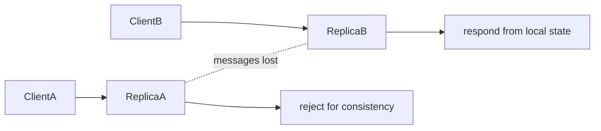

<TLDR>
  <TLDRCell label="what">
    CAP 定理说的是：网络分区发生时，共享数据系统无法同时保证线性一致性和每个非故障节点上的操作都完成。
  </TLDRCell>
  <TLDRCell label="trap">
    “三选二”会掩盖真正的设计问题；分区是故障假设，系统实际要按数据和操作决定拒绝、降级还是接受冲突。
  </TLDRCell>
  <TLDRCell label="fix">
    先写出一致性边界和业务不变量，再规定超时后的响应、未知结果、恢复协议与可验证的故障测试。
  </TLDRCell>
</TLDR>

## 是什么，为什么存在

CAP 定理描述带复制的共享数据系统在网络通信中断时受到的限制。这里的三个字母分别表示一致性（consistency）、可用性（availability）和分区容错性（partition tolerance）。它不是数据库选型打分表，而是一条不可能性结论：在允许消息丢失的模型里，不存在同时满足三项保证的算法。

CAP 中的一致性通常指线性一致性（linearizability）。每个已完成的操作看起来都在调用与返回之间的某一瞬间原子发生，而且这个顺序尊重真实时间。一次写入返回成功后，随后开始的读取不能合法地返回更旧的值；这比“副本最后会相同”强得多。

CAP 中的可用性也有特定含义。非故障节点收到的每个请求最终都要完成，并给出符合对象规格的响应。为了保护一致性而拒绝本来有效的读写，或者无限等待失联副本，都表示该操作没有获得 CAP 所说的可用性；这与季度可用率或延迟 SLO 不是同一个指标。

网络分区（network partition）意味着节点之间的一部分消息可能丢失或无限延迟，而分区两侧的节点本身仍在运行。节点只能看到本地消息，无法可靠区分对端宕机、链路断开和极慢的网络。在跨节点保存同一份可变状态时，这种信息缺失迫使系统做出选择。

你会在多区域数据库、服务发现、配置存储、购物车和离线客户端中遇到这个限制。CAP 最有用的地方不是给整套产品贴上 `CP` 或 `AP` 标签，而是追问某个操作在超时后还能承诺什么。

## 工作原理

设两个副本起初都保存 `v1`，随后它们之间的链路断开。左侧收到把值改为 `v2` 的请求，但无法知道右侧是否仍对外服务。如果左侧确认写入，右侧稍后的读取可能仍返回 `v1`，真实时间顺序便无法保持线性一致。

若要保留一致性，系统必须阻止至少一侧完成会产生冲突的操作。它可以让拥有有效多数派的一侧继续，把少数派变为只读，也可以在无法确认提交时返回失败。代价是某些健康节点仍在运行，请求却不能成功完成。

若要保留可用性，两侧都必须在收不到对方消息时继续响应。这样可以接受本地写入并返回本地读取，但副本可能分叉。通信恢复后，系统还需要检测并发更新、确定合并规则，并处理已经对用户或外部系统产生的效果。



图中的两个结果不是永久的产品类型。系统可以让余额扣减走一致路径，让商品目录读取走可用路径；同一操作在不同故障阶段也可以改变策略。Eric Brewer 后来特别强调，应显式检测分区、进入分区模式，再执行恢复，而不是把 CAP 简化成静态的“三选二”。

形式证明讨论的是模型中的保证，工程系统还必须把“多久没有消息算作分区”落到超时上。超时太短会把拥塞误判为分区，过早降级；超时太长则会把用户请求悬挂在一致路径上。CAP 不会替你选这个时间，也不会给出恢复协议。

设计评审至少要写清四件事：一致性的对象与范围、哪些请求必须完成、故障模型包含哪些消息丢失，以及分区恢复后如何处理状态和外部副作用。缺少其中任何一项，“我们选择 CP”都不是可测试的需求。

## 示例

下面的程序都是教学模型，不是分布式存储实现。它们把关键决策缩到单个进程中，因此可以稳定重放；真实系统还需要成员关系、持久化、重试、共识和故障注入测试。

### 同一次分区中的两条路径

第一个模型从两个值相同的副本开始。`cpWrite` 在链路断开时拒绝写入，所以旧状态没有分叉；`apWrite` 接受本地写入，所以两个健康副本随即能返回不同值。

<Depth level="quick">

```javascript run title="partition_choice.js"
class Replica {
  constructor(name, value) {
    this.name = name;
    this.value = value;
  }
}

function cpWrite(left, right, value, linkUp) {
  if (!linkUp) return 'rejected: peer unreachable';
  left.value = right.value = value;
  return 'accepted';
}

function apWrite(local, value) {
  local.value = value;
  return 'accepted locally';
}

const left = new Replica('A', 'v1');
const right = new Replica('B', 'v1');

console.log('CP write:', cpWrite(left, right, 'v2', false));
console.log('CP replicas:', left.value, right.value);

console.log('AP write:', apWrite(left, 'v2'));
console.log('AP reads:', left.value, right.value);
```

```text
CP write: rejected: peer unreachable
CP replicas: v1 v1
AP write: accepted locally
AP reads: v2 v1
```

</Depth>

这段代码没有证明拒绝写入就自动获得线性一致性。真实的 CP 路径必须确认自己有权提交，例如持有当前任期内的多数派；一个被隔离的旧主节点不能只根据本地布尔值继续写。示例只展示分区发生后最小的不可兼得关系。

AP 路径同样没有免费解决冲突。`v2` 已经向左侧调用者公开，右侧仍可能接受另一个值。恢复逻辑不能假装其中一次操作从未发生，除非业务规格明确允许丢弃它并处理已外显的后果。

### 按操作定义分区策略

CAP 的选择应落到操作与不变量，而不是落到整套服务。浏览目录可以容忍旧快照，收藏集合可以采用可合并的操作，最后一个座位的预订则需要知道全局当前状态。

```javascript run title="operation_policy.js"
function partitionPolicy(operation) {
  if (operation.needsCurrentGlobalState) {
    return 'reject and retry after recovery';
  }
  if (operation.mergeable) {
    return 'accept locally and merge later';
  }
  return 'serve local snapshot';
}

const operations = [
  {
    name: 'view catalog',
    needsCurrentGlobalState: false,
    mergeable: false,
  },
  {
    name: 'add favorite',
    needsCurrentGlobalState: false,
    mergeable: true,
  },
  {
    name: 'reserve last seat',
    needsCurrentGlobalState: true,
    mergeable: false,
  },
];

for (const operation of operations) {
  console.log(`${operation.name}: ${partitionPolicy(operation)}`);
}
```

```text
view catalog: serve local snapshot
add favorite: accept locally and merge later
reserve last seat: reject and retry after recovery
```

策略表首先区分读取、可合并写入和受全局不变量约束的写入。最后一项被延迟，是因为两个分区各自出售“最后一个座位”会把一个不可撤销承诺外显给用户。另一种设计可以预先把座位或额度分配给各区域，但那是改变不变量的所有权，不是绕过 CAP。

代码里的 `mergeable` 也必须由真实的代数性质支撑。操作应具有确定的合并结果，并对重复投递安全；只在字段上写一个布尔标记不会让任意更新自动收敛。

### 多数派为什么要相交

多数派法定人数（quorum）的基本价值是任意两个多数派都至少共享一个副本。五个副本取三个时，最小交集为一；四个副本只取两个时，可以出现完全不相交的两组。

```javascript run title="quorum_overlap.js"
function combinations(values, size) {
  if (size === 0) return [[]];
  return values.flatMap((value, index) =>
    combinations(values.slice(index + 1), size - 1).map((rest) => [value, ...rest]),
  );
}

function minimumOverlap(replicaCount, quorumSize) {
  const nodes = Array.from({ length: replicaCount }, (_, index) => index);
  const quorums = combinations(nodes, quorumSize);
  let result = { size: replicaCount, witness: null };

  for (const [index, left] of quorums.entries()) {
    for (const right of quorums.slice(index + 1)) {
      const size = left.filter((node) => right.includes(node)).length;
      if (size < result.size) result = { size, witness: [left, right] };
    }
  }
  return result;
}

for (const [replicas, quorum] of [[5, 3], [4, 2]]) {
  const { size, witness } = minimumOverlap(replicas, quorum);
  console.log(`N=${replicas}, Q=${quorum}, minimum overlap=${size}`);
  if (size === 0) console.log('disjoint witness:', JSON.stringify(witness));
}
```

```text
N=5, Q=3, minimum overlap=1
N=4, Q=2, minimum overlap=0
disjoint witness: [[0,1],[2,3]]
```

交集可以防止两个不相交分区都凑出多数派，但它只是必要结构。线性一致的存储还要让交集节点遵守任期、日志或版本规则，正确处理并发写入和成员变更。把 `W + R > N` 写进配置，并不能单独证明整个协议正确。

对于五副本系统，失去三个副本后，剩下两个节点仍然健康，却无法形成三节点多数派。一致路径因此停止完成操作，这正是分区期间放弃可用性的具体表现。读路径能否继续，还取决于所承诺的读取语义，而不是“读总是安全”。

### 可合并状态如何恢复

如果业务操作能表示为可交换、幂等的状态更新，分区两侧可以继续并在恢复后收敛。下面的增长计数器为每个节点保存单调递增的分量；合并时逐项取最大值，重复合并不会重复计数。

```javascript run title="gcounter_merge.js"
class GCounter {
  constructor(node, counts = {}) {
    this.node = node;
    this.counts = { ...counts };
  }

  increment() {
    this.counts[this.node] = (this.counts[this.node] ?? 0) + 1;
  }

  merge(other) {
    const nodes = new Set([...Object.keys(this.counts), ...Object.keys(other.counts)]);
    const merged = Object.fromEntries(
      [...nodes].map((node) => [
        node,
        Math.max(this.counts[node] ?? 0, other.counts[node] ?? 0),
      ]),
    );
    return new GCounter(this.node, merged);
  }

  get value() {
    return Object.values(this.counts).reduce((total, count) => total + count, 0);
  }
}

let paris = new GCounter('paris');
let tokyo = new GCounter('tokyo');

for (let count = 0; count < 2; count += 1) paris.increment();
for (let count = 0; count < 3; count += 1) tokyo.increment();

console.log('during partition:', paris.value, tokyo.value);
paris = paris.merge(tokyo);
tokyo = tokyo.merge(paris);
console.log('after merge:', paris.value, tokyo.value);
console.log('merge again:', paris.merge(tokyo).value);
```

```text
during partition: 2 3
after merge: 5 5
merge again: 5
```

分区期间两个副本分别看到 `2` 和 `3`，所以读取并不线性一致。交换状态后，两边都得到 `5`；再次合并仍为 `5`，说明该合并是幂等的。这个例子展示的是最终一致性（eventual consistency）的一种实现方式，不是 CAP 的通用解法。

增长计数器只能增加，不能直接撤销一次计数。支持删除、唯一性、余额下限或跨对象事务需要更丰富的状态和协议。有些全局不变量无法仅靠局部合并保持，此时必须分配权限、协调，或者在分区期间拒绝相关操作。

恢复还包括状态之外的外部效果。两个副本最终得到同一个数字，并不会自动撤回重复发送的邮件、重复扣款或冲突的座位确认。外部命令需要幂等键、去重记录或明确的补偿流程。

## 常见陷阱

> [!PITFALL]
> 把 CAP 背成“任何时候只能三选二”，然后让整个系统永久牺牲一项属性。

只有允许分区并要求两侧继续处理同一份状态时，不可能性才迫使一致性与可用性发生冲突。网络正常时，系统可以同时提供线性一致的结果并完成请求；同一系统也可以对不同操作采用不同策略。

**修复方法：** 按操作记录分区模式，而不是只写产品标签。为每个操作说明正常路径、超时路径、恢复路径和必须保持的不变量。

> [!PITFALL]
> 把 CAP 一致性、ACID 一致性和副本最终相同当作同一保证。

ACID 中的一致性是事务把数据库从一个满足约束的状态带到另一个满足约束的状态。CAP 的一致性讨论操作历史能否线性化；最终一致性只承诺停止更新后副本会收敛。三者回答的问题不同，一个系统可能同时拥有其中若干项。

**修复方法：** 在需求和接口中写出具体模型，例如 `linearizable per key`、`read-your-writes within a session` 或 `eventual convergence`。不要只写“强一致”。

> [!PITFALL]
> 根据厂商或数据库名称直接断言 `CP` 或 `AP`，忽略配置、API 和故障范围。

同一产品可能提供线性一致读取、陈旧读取、不同写确认级别和异步跨区域复制。控制面与数据面也可能作出不同选择。一个无范围说明的标签无法预测具体请求在故障时的行为。

**修复方法：** 验证正在使用的版本与配置，并用操作历史描述保证。测试客户端实际调用的 API，而不是引用一张静态分类表。

> [!PITFALL]
> 超时后自动重试写入，并假定第一次请求没有提交。

客户端没有收到响应，只能说明结果未知；提交确认可能在返回途中丢失。若重试的是扣款、发货或创建资源，系统可能把一次意图执行两次。这个问题在生成的故障转移代码里很常见。

**修复方法：** 为非幂等命令使用稳定的幂等键，并提供按键查询最终结果的接口。协议应区分明确失败、明确成功和结果未知三种状态。

> [!PITFALL]
> 用多数派公式或基于墙上时钟的最后写入胜出，宣称已经解决所有冲突。

法定人数相交不等于协议正确；时钟也可能偏移，让较晚的时间戳覆盖真实时间中更晚的业务操作。成员变更、部分写入和并发写入仍需要明确规则。最后写入胜出还会有意丢弃一个值。

**修复方法：** 说明版本顺序来自任期、日志索引、混合逻辑时钟还是其他机制，并测试时钟回拨与成员变化。若业务不能接受丢失更新，就不要把最后写入胜出作为默认合并策略。

## AI 时代

**生成代码在这里常犯的错**

模型经常生成一个 `ping()` 健康检查，再让“健康”节点自封为主节点；单向丢包和暂停会使两侧对健康状态得出不同结论，造成双主。它还会把最快副本读取写成“强一致”，用 `Promise.race()` 返回陈旧值，或者只检查 `W + R > N` 就声称线性一致。恢复代码则常用 `Date.now()` 做最后写入胜出，忽略时钟偏移、失败写入的未知结果和已经执行的外部副作用。

**让 AI 检查**

- 为每个读写操作列出成功、失败、超时与分区时可观察到的结果，并标出哪些结果仍然未知。
- 给出一个包含单向丢包、旧主节点和成员变更的执行历史，验证是否可能出现两个写入方或陈旧读取。
- 证明冲突合并满足交换律、结合律和幂等性，并指出无法自动合并的业务不变量。

**审查清单**

- 用稳定幂等键重放所有超时写入，确认不会重复产生扣款、消息或资源。
- 在故障注入测试中记录完整的调用与完成历史，再按声明的线性一致性或会话保证检查它。
- 核对法定人数、任期、版本、成员配置和恢复协议是否来自同一个一致性边界。

**提示词词汇**

使用准确术语：`linearizability`（线性一致性）、`network partition`（网络分区）、`partition mode`（分区模式）、`quorum intersection`（法定人数交集）、`unknown outcome`（结果未知）、`split brain`（脑裂）、`conflict resolution`（冲突解决）、`eventual convergence`（最终收敛）和 `externalized side effect`（已外显副作用）。要求 AI 提供操作历史与不变量，而不是笼统地“让数据库满足 CAP”。

<Depth level="deep">

## 定义边界与形式模型

Gilbert 与 Lynch 的模型把一致性表述为原子一致性，也就是今天通常所说的线性一致性。对单个读写对象而言，所有已完成操作以及一部分未完成操作，可以排成一个符合对象顺序规格的序列。若操作 A 在操作 B 开始前已经完成，序列中 A 必须排在 B 前面。

这种定义不要求真实存在一个全局时钟。真实时间只约束不重叠操作的先后关系；并发操作可以按任一合法顺序线性化。因此，两个并发写入谁先谁后不由 CAP 决定，而由具体协议决定。

形式化可用性要求非故障节点收到的请求最终完成，但没有给出毫秒级上界。生产系统还会设置延迟目标和超时，因而可能在形式上“最终可用”，在用户看来却已经不可用。评审时要同时写下安全属性与活性属性，再单独写 SLO。

分区容错不是“网络分区时什么都不受影响”。它把任意消息丢失纳入运行模型，并要求算法仍遵守所选择的其他保证。若系统只在网络永不分区的前提下正确，它没有解决 CAP 所讨论的故障。

### 安全性、活性与延迟

线性一致性是安全属性：已经发生的历史中不能出现某种坏结果。可用性是活性属性：请求最终应取得进展。一个实现可以通过永远等待来避免返回陈旧值，但这只是保护安全性并放弃活性。

实际超时把无限等待变成程序分支。超时后返回错误、读取本地快照、把命令排队，或者接受本地写入，对应不同的接口语义。只有把这个分支暴露在规格中，调用者才能安全处理它。

“返回错误”也需要精确定义。若读取接口把 `503` 当作正常业务值，形式化讨论会失去意义；对象规格必须区分合法返回值和未完成的操作。工程文档则应进一步说明错误是否可重试，以及重试是否继承同一个操作标识。

## 一致性保证不是一条直线

线性一致性给单对象操作施加真实时间约束，但分布式应用还会关心事务隔离、因果顺序和会话保证。严格可串行化把事务的可串行化与真实时间顺序结合起来；它不能用“每个键都线性一致”简单替代。跨键不变量必须在承诺它们的事务边界内验证。

顺序一致性要求各进程看到同一个合法顺序，却不要求该顺序尊重不重叠操作的真实时间。因果一致性保留因果相关操作的顺序，允许无因果关系的并发更新以不同顺序出现。`read-your-writes` 只保证一个会话随后能看到自己的更新，覆盖范围更窄。

最终一致性只说明在不再更新且消息最终送达时，副本会收敛。它没有规定收敛前能读到多旧的数据，也没有自动规定冲突结果。系统仍须提供版本元数据、合并函数或确定的裁决规则。

这些模型不能仅按“强到弱”替换。业务可能需要购物车增加项具有单调性，同时要求付款授权线性一致；也可能需要因果顺序，却不需要全局真实时间。设计应从每个不变量所需的最小保证出发。

## 法定人数的充分条件之外

经典复制配置常写 `N` 个副本、写法定人数 `W` 和读法定人数 `R`。`W + R > N` 保证任一读集合与任一写集合相交，`2W > N` 保证任意两个写集合相交。这些集合关系有助于让读取碰到某个最新副本，也能阻止两个不相交的写集合同时形成。

集合相交并没有规定交集节点该相信哪个值。实现还需要可比较的版本、正确的提交规则和读取修复；遇到并发写入时，版本向量可能只能判定两者并发，不能凭空选择业务赢家。失败写入留下的部分副本也必须在后续读取中正确处理。

动态成员关系让算术更容易出错。旧配置和新配置若可以分别形成互不相交的多数派，就可能各自提交。成熟共识协议使用联合配置或其他受证明约束的迁移步骤；直接修改节点列表再重启，不等于安全地完成成员变更。

法定人数也不保证客户端读到最新值。如果读取绕过拥有提交信息的节点、允许旧任期主节点响应，或者缓存没有参与一致性协议，交集数字仍然正确，端到端历史却可能不线性。保证必须覆盖客户端实际经过的整条路径。

## PACELC 补充的正常路径

PACELC 是 Daniel Abadi 提出的设计原则：有分区（Partition）时在可用性（Availability）与一致性（Consistency）之间取舍；否则（Else）仍要在延迟（Latency）与一致性之间取舍。它补上了 CAP 刻意没有描述的正常网络路径。

即使没有分区，跨区域线性一致写入也要等待协调路径。选择等待远端确认，可以换取更强的可见性顺序；选择就近响应，可以降低延迟，但远端副本在一段时间内可能陈旧。这里的具体延迟必须测量，不能从 PACELC 字母推导。

PACELC 仍然不是四字母产品标签。一个系统可以让元数据走 `PC/EC` 风格，让大对象读取走就近副本；写确认级别、读取偏好和区域拓扑也会改变行为。最有价值的做法是分别画出分区路径和正常路径。

CAP 与 PACELC 都不会证明实现符合声明。需要通过协议证明、模型检查或基于历史的故障测试来验证；普通单元测试只覆盖预先安排的调用顺序，很难发现网络与并发交错产生的反例。

## 从定理到设计评审

把抽象保证转换为一张逐操作表，比选择一个缩写更有效。每一行都应有调用者能观察到的契约，并能转换为故障注入断言。

| 评审项 | 必须回答的内容 | 可验证证据 |
| --- | --- | --- |
| 一致性范围 | 单键、分片、事务还是跨服务不变量 | 允许与禁止的操作历史 |
| 分区触发 | 哪个超时或任期变化进入分区模式 | 单向丢包与延迟注入日志 |
| 可用操作 | 哪些读写继续、排队或拒绝 | 各分区客户端的响应矩阵 |
| 未知结果 | 响应丢失后如何查询与重试 | 稳定幂等键的重放测试 |
| 恢复规则 | 状态如何合并，副作用如何补偿 | 重复、乱序恢复测试 |

“库存永不为负”这样的不变量还要标明权威边界。如果它跨越分区两侧，任一侧都不能在不知道另一侧状态时无限制扣减。可选方案包括只让多数派接受操作、把有限额度预分配给区域，或先接受意图并在恢复后决定是否完成。

测试时不要只杀进程。还要注入单向丢包、延迟、消息重排、旧主节点恢复和成员变更，因为网络故障常留下多个仍在运行但认知不同的节点。客户端历史应记录调用、完成、值、错误和操作标识，才能检查声明的模型。

最后，把恢复当作协议的一部分，而不是运维手册末尾的步骤。状态收敛、业务不变量恢复和外部副作用补偿是三个不同问题；只有第一项成功，不代表系统已经恢复正确。

</Depth>

<Checkpoint id="architecture/cap-theorem" />

## 延伸阅读

- [Jepsen：一致性模型的关系与定义](https://jepsen.io/consistency/models)
- [Google SRE：共识、法定人数与关键状态](https://sre.google/sre-book/managing-critical-state/)
- [Daniel Abadi：提出 PACELC 的原始讨论](https://dbmsmusings.blogspot.com/2010/04/problems-with-cap-and-yahoos-little.html)
- [Jepsen：线性一致性的定义与历史模型](https://jepsen.io/consistency/models/linearizable)
