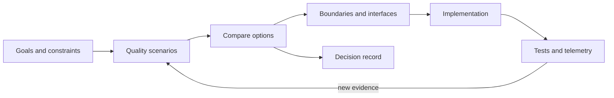

<TLDR>
  <TLDRCell label="what">
    Software architecture is the set of structural decisions that are costly to reverse. It defines boundaries, dependencies, and collaboration in service of explicit quality goals.
  </TLDRCell>
  <TLDRCell label="trap">
    Choosing microservices, a message broker, or a layering template before finding the problem disguises a technology preference as architecture reasoning.
  </TLDRCell>
  <TLDRCell label="fix">
    Write scenarios and constraints first, choose the simplest viable structure, then keep testing it with code checks, telemetry, and decision records.
  </TLDRCell>
</TLDR>

## What it is and why it exists

Software architecture describes which parts of a system can change independently, how those parts interact, and which rules ordinary implementation details must not bypass. It isn't a directory tree, a cloud shopping list, or a box diagram. A real architecture decision constrains many later choices, and reversing it usually crosses module, data, deployment, or team boundaries.

Functional requirements say what a system does. Architecture deals mainly with the conditions under which it must keep doing it. "Checkout" may fit in one requirement, but traffic bursts, payment timeouts, data residency, and disaster recovery force choices about boundaries and communication. Those conditions are <Term id="quality-attribute">quality attributes</Term>; common categories include reliability, security, performance efficiency, maintainability, and cost.

A quality attribute can't stop at "highly available," "scalable," or "secure." A testable statement needs a scenario: who supplies which stimulus, under what environment, which part responds, and what counts as an acceptable response. Without that scenario, two designs can both claim to be "more reliable" while giving the team nothing to compare.

An <Term id="architecture-boundary">architecture boundary</Term> confines change, ownership, or failure impact to an explicit scope. Modules, processes, services, and data stores can all form boundaries, but they carry different costs. A boundary earns its keep through what it isolates, not through the number of boxes it creates.

Architecture questions surface when you start a system, when an old system becomes hard to change, when teams repeatedly block one another, or when one fault spreads across components. The first move usually isn't a rewrite. Find the constraints, decision points, and most expensive coupling, then decide what should stay and what should change.

Architecture belongs to more than the person called "the architect." Developers, operators, security specialists, and product staff each hold part of the constraints; code and production behavior reveal facts absent from the documents. An owner can drive a decision, but implementers must understand it and evidence must be allowed to overturn its assumptions.

### Architecture depends on scale

The same choice can be an implementation detail at one scale and an architecture concern at another. Splitting a class is rarely an enterprise architecture problem, but the choice has architecture impact when it defines a public protocol that several teams must follow. File size isn't the test. Ask how many later decisions the choice constrains and how many boundaries must coordinate to reverse it.

System architecture concerns how a product or group of services meets its goals. Application architecture concerns the runtime units and dependencies of one application, while module design allocates responsibilities inside a process. Teams may use different names, but they still need an explicit scope. A scope-free "architecture review" can jump from cloud topology to database schema to class naming without resolving any of them.

At the start of a discussion, name the system boundary, target point in time, and affected people. That tells you who needs to participate, which view you need, and which questions belong in local code review. The scope can expand later, but it shouldn't drift unnoticed.

## How it works

Architecture work narrows goals into a structure that can be implemented and checked. Identify business goals and hard constraints, express important quality attributes as scenarios, compare boundaries, interactions, and data ownership, then use code rules and runtime evidence to see whether the choices work.



The loop in the diagram matters. Implementation isn't the end of design; failed tests, shifting latency distributions, a rising on-call burden, or changed business constraints feed the next pass. If a team discusses architecture only at project kickoff, the design soon becomes a historical document.

### Write quality attribute scenarios

A quality attribute scenario turns an abstract goal into a concrete event that people can discuss. It isn't test code, but it should be precise enough to design a test. A complete scenario contains these parts:

1. The source of the stimulus, such as a user, dependency, attacker, or operator.
2. The stimulus itself, such as a traffic burst, regional disconnection, leaked credential, or schema change.
3. The environment where it occurs, such as normal operation, deployment, or a partial failure.
4. The affected artifact, such as an API, order flow, data replica, or on-call team.
5. The expected response: what the system completes, rejects, degrades, or restores.
6. The response measure used to judge whether the design is acceptable.

For example, when a payment provider's result is unknown, an order API shouldn't report "payment failed" or start a wholly new charge. It should return a queryable pending state and reuse the payment idempotency key when the same order is retried. This scenario doesn't pretend to know an unmeasured recovery time, but it already constrains the state model and interface.

A performance scenario must also name the workload, data volume, environment, and statistic. A latency number without those conditions can't be reproduced or used to compare designs. Before running a test, record what needs measuring instead of filling in a precise-looking target or result.

### Start with the decision question

Write the scope of the decision before listing technologies. "May the order module update inventory directly?" is easier to test than "Should we use event-driven architecture?" The first question exposes data ownership and an interaction boundary; the second still admits many incompatible implementations.

A <Term id="decision-driver">decision driver</Term> is a goal or constraint that can eliminate an option. A mandated data region, the on-call complexity a team can support, the allowed data-loss envelope, or a migration deadline can all drive a decision. "Modern," "cloud native," and "might be huge later" don't distinguish options and don't belong in a scoring table.

For every important decision, compare the status quo with at least one viable alternative. Apply hard constraints before discussing softer goals; a design that violates regulation shouldn't win again through a high maintainability score. Weights and scores can expose assumptions, but they can't turn judgment into objective fact.

Once the choice is made, use an <Term id="architecture-decision-record">architecture decision record (ADR)</Term> to preserve context, alternatives, the choice, and its consequences. An ADR explains why the team chose a structure. A current architecture description says what the system looks like now. Link the two, but don't ask either document to do both jobs.

### Choose boundaries and interactions

Draw boundaries around distinct reasons to change, data ownership, or failure policy. If pricing rules and the HTTP framework change at different rates, having the domain policy depend on a small interface is usually easier to evolve than calling framework objects directly. If two modules constantly mutate the same data in one transaction, splitting them into network services too early creates coordination work instead.

Dependency direction says who is allowed to know whom. Stable domain rules generally shouldn't import a database driver, web framework, or messaging client. Outer adapters can depend on inner policy and provide external capabilities through interfaces. The payoff is practical: you can test business rules without a network or database.

The interaction style determines how failure propagates. A synchronous call returns success or failure directly, but the caller inherits latency and availability coupling. Asynchronous messages separate the parties in time, but introduce duplicates, reordering, backlog, and eventual consistency. A communication choice must also define timeouts, retry behavior, idempotency, and recovery ownership.

Data boundaries are often harder to move than code boundaries. Separate tables don't make two modules independent if one module bypasses the interface and reads the other's tables directly; schema changes still leak across the boundary. Ownership needs enforcement through write permissions, interfaces, and migration procedures together.

### Draw only the view the question needs

One system needs several zoom levels, but one discussion usually needs only one of them. A system context diagram shows users, the system of interest, and external systems. A container diagram shows independently running or deployed units. A component diagram explains responsibilities inside one container. Mixing all levels in one image buries important relationships under implementation detail.

| Discussion | Useful view | Details to leave out |
| --- | --- | --- |
| External dependencies and trust boundaries | System context | Classes, tables, and internal queues |
| Deployment, communication, and data stores | Container | Every function and DTO |
| Module responsibilities and dependency direction | Component | Every resource in a cloud account |

A view must state its scope and purpose. A context diagram for security review may emphasize identities, trust, and data flow. A container diagram for migration may emphasize old and new paths and the transition state. Both can be correct because they answer different questions.

An element absent from a diagram isn't necessarily absent from the system, so a legend or note should state the omission rules. Otherwise readers can't distinguish "deliberately omitted from this view" from "not considered." Generated diagrams can reflect current dependencies, but people still need to choose the scope and explain each relationship.

### Turn the design into constraints

Architecture diagrams work well for context, containers, components, and major relationships, but every line needs a meaning. At minimum, label its direction, protocol, or purpose. An unlabeled two-way arrow explains neither calls nor data ownership. Date or version the view too, so a target design isn't mistaken for current production.

Put rules that can be automated close to the code. Import checks can stop domain modules from depending on adapters, contract tests can protect interface compatibility, and deployment policy can constrain service-account permissions. Automation doesn't replace review, but it stops an ordinary commit from silently breaking a settled rule.

Runtime evidence covers what static rules can't see. A failure exercise can test recovery, tracing can expose an accidental synchronous call chain, and metrics can show capacity or error budgets approaching a boundary. A signal counts as feedback only if someone looks at it and it triggers action. An ownerless dashboard isn't an architecture control.

Common artifacts answer different questions:

| Artifact | Question it answers | When it changes |
| --- | --- | --- |
| Context diagram | Whom does the system serve, and which external parties does it use | When external relationships change |
| Container or component diagram | What are the runtime units, responsibilities, and major dependencies | When implemented structure changes |
| ADR | Why did the team choose this option, and which consequences did it accept | Add a record when context or the decision changes |
| Scenario and automated check | Which quality target must hold, and how will drift be detected | When the target or verification method changes |

Use as few artifacts as the decision permits, but not fewer. A small monolith may need only a context diagram, a few dependency rules, and a handful of ADRs. A multi-region system needs more explicit deployment, data, and recovery views. Risk, not a template, should decide how much documentation exists.

### Review before commitment

Architecture review should happen while the team can still change the choice. Once code is merged and data is migrated, participants can usually do little more than invent a rationale for the current state. Earlier review can use a cheap prototype or failure exercise to test the riskiest assumption.

A practical review can proceed in this order:

1. Restate the business goal, decision scope, and what is out of scope.
2. Separate hard constraints, verified facts, assumptions, and unknowns.
3. Check that alternatives are viable and allow the status quo to win.
4. Trace call, data, and failure paths across boundaries instead of reviewing only a static diagram.
5. Record the choice, dissent, negative consequences, and the owner of verification.

The end of a review records a traceable decision from the available evidence; it doesn't certify the architecture as correct. Later tests and production signals must be able to reopen it, or "reviewed" becomes a label that blocks learning.

## Examples

The next three examples use JavaScript on Node 24. They begin with a replaceable boundary, then turn dependency direction and failure behavior into executable checks. Every output shown came from a local run.

### Keep business policy inside the boundary

The first example makes checkout policy depend on two injected capabilities: looking up a price and saving an order. The policy doesn't know whether prices come from memory, a database, or HTTP, and it doesn't know how orders are persisted.

<Depth level="quick">

```javascript run title="quote-order.js"
function createCheckout({ priceFor, saveOrder }) {
  return {
    place(sku, quantity) {
      if (!Number.isInteger(quantity) || quantity < 1) {
        throw new RangeError('quantity must be a positive integer');
      }

      const order = {
        id: 'order-1042',
        sku,
        quantity,
        total: priceFor(sku) * quantity,
      };
      saveOrder(order);
      return order;
    },
  };
}

const savedOrders = [];
const checkout = createCheckout({
  priceFor: (sku) => ({ 'tea-500g': 18 }[sku]),
  saveOrder: (order) => savedOrders.push(order),
});

const order = checkout.place('tea-500g', 2);
console.log(JSON.stringify(order));
console.log(`saved orders: ${savedOrders.length}`);
```

```text
{"id":"order-1042","sku":"tea-500g","quantity":2,"total":36}
saved orders: 1
```

</Depth>

The point of this boundary is the direction of change: pricing and storage adapters can be replaced without rewriting checkout policy. A real system must also define behavior for unknown products, currency precision, duplicate requests, and persistence failures. Those choices can't be left for adapters to make independently.

This is still an in-process boundary. "Decoupling" alone isn't a reason to turn it into a network service. A process boundary becomes plausible only when independent deployment, failure isolation, or different scaling needs outweigh network failure and operating cost.

### Check dependency direction automatically

The next script assigns each module to a layer and checks whether an inner layer depends outward. The example deliberately makes the `order` domain module depend on a PostgreSQL adapter, so it reports one violation.

```javascript run title="check-dependencies.js"
const layers = new Map([
  ['domain', 0],
  ['application', 1],
  ['adapter', 2],
]);

const modules = new Map([
  ['order', 'domain'],
  ['place-order', 'application'],
  ['checkout-api', 'adapter'],
  ['postgres-order-store', 'adapter'],
]);

const dependencies = [
  ['checkout-api', 'place-order'],
  ['place-order', 'order'],
  ['order', 'postgres-order-store'],
];

const violations = dependencies.filter(([from, to]) => {
  return layers.get(modules.get(from)) < layers.get(modules.get(to));
});

console.log(`dependency violations: ${violations.length}`);
for (const [from, to] of violations) {
  console.log(`${from} -> ${to}`);
}
```

```text
dependency violations: 1
order -> postgres-order-store
```

The fix isn't to rename a module. Make `order` depend on a storage interface defined on the inside, then have `postgres-order-store` implement it. The database remains necessary infrastructure, but it no longer dictates the source-code dependency direction of domain policy.

A real checker should read relationships from the import graph and fail on unknown modules, cycles, or forbidden cross-domain access. Keep rules narrow and explicit. "All dependencies point inward" doesn't fit utilities, shared protocols, or the application composition root; write separate policy for those roles.

### Verify behavior when a dependency fails

A static boundary can't say what happens to an order when the payment gateway times out. The third example injects a named dependency failure and checks that the application leaves the order recoverable while reusing a stable idempotency key for retries.

```javascript run title="payment-failure.js"
class PaymentUnavailable extends Error {}

async function placeOrder({ charge, savePending }, request) {
  const paymentKey = `payment:${request.orderId}`;

  try {
    await charge({
      amount: request.amount,
      idempotencyKey: paymentKey,
    });
    return { orderId: request.orderId, status: 'confirmed' };
  } catch (error) {
    if (!(error instanceof PaymentUnavailable)) throw error;

    const order = { orderId: request.orderId, status: 'payment-pending' };
    const event = {
      type: 'PaymentRetryRequested',
      orderId: request.orderId,
      idempotencyKey: paymentKey,
    };
    savePending({ order, event });
    return order;
  }
}

const pending = [];
const result = await placeOrder(
  {
    charge: async () => {
      throw new PaymentUnavailable('gateway timeout');
    },
    savePending: (record) => pending.push(record),
  },
  { orderId: 'order-1042', amount: 36 },
);

console.log(JSON.stringify(result));
console.log(JSON.stringify(pending[0].event));
```

```text
{"orderId":"order-1042","status":"payment-pending"}
{"type":"PaymentRetryRequested","orderId":"order-1042","idempotencyKey":"payment:order-1042"}
```

The code handles only the known `PaymentUnavailable`; other programming errors still escape. The stable key comes from the order ID, so retrying one business operation doesn't automatically become a new charge. A production implementation of `savePending` must persist the order state and event atomically. The in-memory array demonstrates boundary behavior, not a reliable messaging design.

This check makes "a payment outage must not lose the order" observable. The next cases should cover a lost acknowledgment, duplicate delivery, and a process crash after the write. Architecture requirements can fail before release only after they become concrete stimuli and responses like these.

## Pitfalls

> [!PITFALL]
> A team decides on microservices, event-driven design, or a layering template, then defends it with vague benefits. The pattern name replaces the problem statement, while the cost of splitting appears only in production.
>
> **Fix:** Write the decision boundary, hard constraints, and quality scenarios first, with the status quo as an option. Adopt a new structure only when it solves a confirmed problem and its benefit exceeds migration and operating cost.

> [!PITFALL]
> "Scalable," "highly available," and "low latency" have no stimulus, environment, response, or measure. Every candidate can satisfy those words in conversation, leaving the review to argue about preferences.
>
> **Fix:** Rewrite adjectives as executable scenarios: say where load or failure originates, how the system may degrade, and which test or signal judges the result. Mark a goal as an assumption rather than a fact when it can't yet be verified.

> [!PITFALL]
> A box diagram shows components but omits protocols, data ownership, dependency direction, and failure semantics. Different readers give the same line different meanings, and code can still bypass every boundary in the picture.
>
> **Fix:** Label each relationship's purpose and direction, and record timeouts, retries, and consistency for important interactions. Enforce the most important boundaries with import rules, permissions, or contract tests.

> [!PITFALL]
> A design adds replicas, queues, caches, and services while chasing maximum reliability, minimum latency, minimum cost, and strongest isolation at once. Every mechanism adds failure modes and maintenance work of its own.
>
> **Fix:** Rank quality attributes, assign budgets, preserve non-negotiable constraints, and record what the choice sacrifices. Choose the simplest design that meets current scenarios, and defer reversible choices until evidence arrives.

> [!PITFALL]
> Architecture documents describe a target state after production code has moved elsewhere, but the team keeps treating the old diagram as fact. New contributors build against the wrong boundaries and accelerate the drift.
>
> **Fix:** Mark every diagram with scope and date, automate stable rules, and periodically compare documents with dependency graphs, deployment manifests, and telemetry. Create a new ADR when a decision changes; don't rewrite the old one to match the present.

## In the AI era

**What generated code gets wrong here**

Models often mistake a familiar directory template for an established architecture. They claim modules are "decoupled" while domain code imports an ORM, HTTP client, or another module's tables. They also invent precise throughput, availability, and recovery promises without evidence, apply the same retry to every failure, and omit idempotency keys, timeout bounds, ownership, and partial success. Asked to "turn this into microservices," a model often copies the data model and synchronous call chain, changing an in-process failure into a network failure.

**Ask your AI to check**

- "Starting at each entry point, list all transitive dependencies. Find domain modules that point to frameworks, databases, or external clients, and cite the file evidence."
- "For every network call, list its timeout, retry limit, idempotency key, duplicate response behavior, and treatment of unknown outcomes. Mark anything without code evidence as missing."
- "Compare the components and data ownership in the architecture description with imports, database permissions, and deployment manifests. Report only differences that can be located in the repository."

**Review checklist**

- Does each new boundary isolate a named source of change, ownership, or failure, or does it merely add forwarding?
- Do generated synchronous calls, caches, queues, and retries define timeout, consistency, idempotency, and recovery ownership?
- Does every quality or capacity claim come from a repeatable test or telemetry, with unknown information still marked unknown?

**Prompt vocabulary**

Use `quality attribute scenario`, `architecture boundary`, `dependency direction`, `data ownership`, `failure containment`, `idempotency boundary`, `architecture decision record`, and `fitness function`. These terms make a model discuss constraints and evidence; "make the architecture better" and "apply best practices" do not.

<Depth level="deep">

## How architecture keeps evolving

Drawing the initial structure is usually straightforward. Controlling change cost as requirements, traffic, teams, and platforms move is harder. Decisions have different reversibility: renaming an internal function is usually cheap, while splitting a shared database or replacing a public protocol may require a long migration. Review effort should track impact and reversal cost rather than sending every choice through the same ceremony.

### Reversible decisions and commitment points

A reversible decision preserves options until better evidence arrives. Keeping calls in-process while module boundaries stabilize is usually easier to adjust than splitting services early. Public APIs, persistent formats, and cross-team data ownership are commitment points instead; they need compatibility rules and migration paths.

"Decide later" still requires design. State the current default, the signal that triggers reconsideration, and the latest decision time. Deferral without a trigger merely hands the risk to a future maintainer.

Evolutionary design doesn't make every change cheap. It concentrates cost in commitments with business value while keeping other parts replaceable. An abstraction for a change that has never appeared adds cognitive load today and may do nothing for tomorrow's cost.

### Team boundaries aren't service boundaries

Organization structure affects system interfaces because people who communicate often can change code together more easily. That doesn't mean every team needs a network service. Module ownership, code-review policy, and release responsibility can form a clear collaboration boundary without introducing a remote call.

A service boundary may pay off when two teams need independent releases, different failure policies, or separate data permissions. If they still coordinate every schema and interface change, two repositories don't produce autonomy. They move the coordination into versioning and deployment.

Before moving a team or system boundary, inspect actual change history: which files change together, which releases wait on one another, and which incidents need cross-team recovery. An organization chart and ideal domain model can suggest hypotheses. Commit history and operating events show where today's coupling lives.

### Detect drift with fitness functions

An <Term id="fitness-function">architecture fitness function</Term> is a repeatable check that determines whether a system still preserves an architecture characteristic. It might be an import rule, contract test, permission check, failure-exercise assertion, or a threshold over an operational signal. The name says that it tests fitness for a goal; it doesn't require a particular framework.

A useful fitness function protects one explainable constraint and gives actionable output when it fails. "The domain layer must not import adapters" identifies a concrete dependency. "Architecture quality score must exceed 80" compresses unlike risks into an opaque number. The checking rule itself needs version control and review.

Static checks fit dependencies and configuration; dynamic checks fit recovery, capacity, and interaction behavior. Neither substitutes for the other. A valid import graph doesn't prove the timeout path is safe, and one successful exercise doesn't prove that code can't bypass the boundary. Choose the check based on where the protected property becomes visible.

A runtime check also needs a sampling window, environment, and owner. A threshold that occasionally turns red while nobody acts only trains the team to ignore alerts. If a signal can't block a release, open work, or trigger review, it is observation material rather than a fitness function.

### Let evidence change decisions

New evidence may show that implementation drifted from a sound decision, or that the decision itself no longer fits. Treat those cases separately. Fix the code and retain the ADR in the first case; create a new ADR with the changed context and plan a migration in the second. Rewriting the old record destroys the causal chain needed to understand old code.

Evidence can also overturn an expensive rewrite proposal. If dependency checks show clean boundaries while incident data points to one shared resource, fix that resource first instead of splitting the whole system. Architecture work is valuable when it narrows a problem, not when it enlarges a project.

Teams should periodically remove abstractions and checks that no longer serve a purpose. A boundary that isolates no source of change may have become pure forwarding; a metric detached from a goal produces noise when it alerts. Evolution includes removing stale mechanisms as well as adding protection.

</Depth>

<Checkpoint id="architecture/getting-started" />

## Further reading

- [AWS Well-Architected Framework: the pillars of the framework](https://docs.aws.amazon.com/wellarchitected/latest/framework/the-pillars-of-the-framework.html)
- [Azure application architecture fundamentals](https://learn.microsoft.com/en-us/azure/architecture/guide/)
- [C4 model: system context diagram](https://c4model.com/diagrams/system-context)
- [ADR GitHub organization and resources](https://adr.github.io/)
