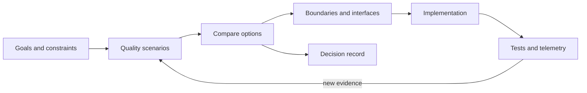

<TLDR>
  <TLDRCell label="what">
    软件架构是一组难以随意撤销的结构性决定，它规定系统的边界、依赖和协作方式，并服务于明确的质量目标。
  </TLDRCell>
  <TLDRCell label="trap">
    先选微服务、消息队列或某种分层模板，再寻找问题，会把技术偏好伪装成架构理由。
  </TLDRCell>
  <TLDRCell label="fix">
    先写场景和约束，再选择最简单的可行结构；用测试、遥测和决策记录持续验证它。
  </TLDRCell>
</TLDR>

## 是什么，为什么存在

软件架构描述一个系统中哪些部分可以独立变化、这些部分怎样交互，以及哪些规则不能被普通实现细节绕过。它不等于目录树、云产品清单或一张方框图。真正的架构决定会影响许多后续选择，而且修改成本通常跨越模块、数据、部署或团队边界。

业务功能回答系统“做什么”，架构主要处理系统“在什么条件下仍然做得到”。结账功能可以写成一句需求，但并发高峰、支付超时、数据驻留和故障恢复会迫使团队选择不同的边界与通信方式。这些条件属于<Term id="quality-attribute">质量属性（quality attribute）</Term>，常见类别包括可靠性、安全性、性能效率、可维护性和成本。

质量属性不能只写成“高可用”“可扩展”或“安全”。可验证的表述需要场景：谁发出什么刺激，系统处于什么环境，哪个组件响应，以及怎样判断响应合格。没有场景，两个方案都可以声称自己“更可靠”，团队却无法比较它们。

<Term id="architecture-boundary">架构边界（architecture boundary）</Term>把变化、所有权或故障影响限制在一个明确范围内。模块、进程、服务和数据存储都可能形成边界，但它们的成本不同。边界的价值取决于它隔离了什么，而不取决于方框数量。

你会在新系统立项、旧系统难以修改、多个团队频繁互相阻塞，或者一次故障跨组件扩散时遇到架构问题。此时需要的通常不是立刻重写，而是找出约束、决策点和最昂贵的耦合，再决定应该保留什么、改变什么。

架构属于整个团队，而不是某个“架构师”的私有产物。开发、运维、安全和产品人员分别掌握约束的一部分，代码与生产行为又会暴露文档没有写出的事实。负责人可以推动决定，但决定必须让实施者看得懂，也必须允许证据推翻原来的假设。

### 架构取决于观察尺度

同一项选择在不同尺度上可能只是实现细节。一个类怎样拆分通常不是企业架构问题，但当它定义了多个团队必须遵守的公开协议时，就有了架构影响。判断标准不是文件大小，而是选择影响多少后续决定，以及撤销时要协调多少边界。

系统架构关注一个产品或服务群怎样满足目标，应用架构关注单个应用的运行单元与依赖，模块设计则处理进程内部的职责。名称可以因团队而异，范围必须明确。没有范围的“架构评审”很容易在云拓扑、数据库模式和类命名之间来回跳转。

开始讨论时先写清系统边界、目标时间点和受影响的人。这样可以判断谁必须参加、需要哪种图，以及哪些问题应留给局部代码审查。范围以后可以扩大，但不能在无人察觉时漂移。

## 工作原理

架构工作把目标逐步收窄为可实施、可检查的结构。先识别业务目标和硬约束，再把重要质量属性写成场景；然后比较边界、交互和数据所有权方案；最后用代码规则与运行证据确认选择是否奏效。



图中的回路很重要。实现不是设计流程的终点；测试失败、延迟分布变化、值班负担增加或业务约束改变，都会成为下一轮输入。如果架构只在项目开始时讨论一次，它很快就只剩历史意义。

### 写出质量属性场景

质量属性场景把抽象目标变成一个可以讨论的具体事件。它不是测试代码，却应该明确到足以设计测试。一个完整场景包含以下要素：

1. 刺激来源，例如用户、依赖服务、攻击者或运维人员。
2. 刺激本身，例如请求突增、区域失联、凭据泄露或模式变更。
3. 发生环境，例如正常运行、部署期间或部分故障状态。
4. 受影响对象，例如API、订单流程、数据副本或值班团队。
5. 预期响应，包括系统应完成、拒绝、降级或恢复的动作。
6. 响应判据，也就是用什么观察结果判断设计是否合格。

例如，支付提供方结果未知时，订单API不应报告“支付失败”或再次创建一笔全新扣款。系统应返回可查询的处理中状态，并让同一订单的重试复用支付幂等键。这个场景没有假装知道尚未测量的恢复时间，但已经约束了状态模型和接口。

性能场景必须另外写明工作负载、数据规模、运行环境和统计口径。没有这些条件的延迟数字无法复现，也不能拿来比较方案。尚未运行测试时，应先记录需要测量什么，不要填入一个看似精确的目标或结果。

### 从决策问题开始

先写出需要决定的范围，而不是先列技术名词。例如，“库存是否由订单模块直接更新”比“是否采用事件驱动架构”更容易验证。前者明确了数据所有权和交互边界，后者仍可能包含许多互不兼容的实现。

<Term id="decision-driver">决策驱动因素（decision driver）</Term>是能排除选项的目标或约束。法规指定的数据区域、团队能够承担的值班复杂度、允许的数据丢失范围，以及迁移必须完成的日期，都可以成为驱动因素。“现代”“云原生”和“以后可能很大”不能区分方案，不应进入评分表。

每个重要决定至少比较维持现状和一个可行替代方案。比较时先应用硬约束，再讨论软目标；违反法规的方案不应靠较高的可维护性得分重新胜出。权重和评分只是让假设显形，不能把主观判断变成客观事实。

决定完成后，用<Term id="architecture-decision-record">架构决策记录（Architecture Decision Record，ADR）</Term>保存背景、备选方案、选择和后果。ADR解释为什么采用某种结构，当前架构说明则描述系统现在是什么样子。两者相互链接，但承担不同职责。

### 选择边界与交互

边界应围绕不同的变化原因、数据所有权或故障策略建立。如果定价规则和HTTP框架的升级节奏不同，让领域规则依赖一个小接口，通常比让它直接调用框架对象更容易演进。若两个模块必须在同一事务中频繁修改同一数据，把它们过早拆成网络服务反而会制造协调成本。

依赖方向说明谁可以知道谁。稳定的领域规则通常不应导入数据库驱动、Web框架或消息客户端；外层适配器可以依赖内层策略，并通过接口提供外部能力。这条规则不是审美偏好，它让业务规则能在没有网络和数据库的情况下测试。

交互方式决定失败怎样传播。同步调用让成功或失败立即返回，但调用方同时承担延迟和可用性耦合；异步消息可以错开时间，却引入重复、乱序、积压和最终一致性。选择交互方式时必须同时写出超时、重试、幂等性和恢复责任。

数据边界往往比代码边界更难移动。两个模块拥有各自的表，并不代表它们真正独立；如果一个模块绕过接口直接读取另一个模块的表，模式变更仍会跨边界扩散。所有权需要通过写入权限、接口和迁移流程共同执行。

### 只画当前问题需要的视图

同一个系统需要不同缩放层级，但一次讨论通常只需要其中一个。系统上下文图展示用户、目标系统和外部系统；容器图展示可独立运行或部署的单元；组件图则解释某个容器内部的职责。把所有层级塞进一张图，会让关键关系淹没在实现细节中。

| 讨论内容 | 合适视图 | 不应混入的细节 |
| --- | --- | --- |
| 外部依赖与信任边界 | 系统上下文 | 类、表和内部队列 |
| 部署、通信与数据存储 | 容器 | 每个函数和DTO |
| 模块职责与依赖方向 | 组件 | 云账户的全部资源 |

视图必须说明范围和用途。一张面向安全评审的上下文图可能突出身份、信任与数据流；面向迁移的容器图则会突出旧、新路径和过渡状态。两张图可以同时正确，因为它们回答的问题不同。

图中未出现的元素不一定不存在，因此图例或说明要写出省略规则。否则读者无法区分“本视图故意省略”和“设计者没有考虑”。自动生成的图能反映当前依赖，但仍需人工选择范围并解释关系。

### 把设计变成约束

架构图适合表达上下文、容器、组件和主要关系，但图中的每条线都应有含义。至少标明方向、协议或用途；一条无标签的双向箭头既不能解释调用，也不能解释数据所有权。图还要明确时间点，否则目标设计和生产现状容易混在一起。

可以自动检查的规则应尽量接近代码。例如，导入检查可以阻止领域模块依赖适配器，契约测试可以保护接口兼容性，部署策略可以限制服务账户权限。自动化不替代评审，但它能阻止已经达成共识的规则被一次普通提交悄悄破坏。

运行时证据负责检查静态规则看不到的部分。一次故障演练可以验证恢复路径，追踪可以暴露意外的同步调用链，指标可以显示容量或错误预算是否逼近边界。只有被查看、能触发行动的信号才算反馈；无人负责的仪表盘不是架构控制。

常用产物各自回答不同问题：

| 产物 | 回答的问题 | 更新时机 |
| --- | --- | --- |
| 上下文图 | 系统服务谁，与哪些外部主体交互 | 外部关系变化时 |
| 容器或组件图 | 运行单元、职责与主要依赖是什么 | 实现结构变化时 |
| ADR | 为什么选择这项方案，接受了什么后果 | 背景或决定变化时新增记录 |
| 场景与自动检查 | 哪项质量目标必须保持，怎样发现偏离 | 目标或验证方式变化时 |

产物越少越好，但不能少到无法做决定。小型单体可能只需要一张上下文图、几条依赖规则和少量ADR；跨区域系统则需要更明确的部署、数据和恢复视图。文档数量应由风险决定，不由模板决定。

### 在承诺前评审

架构评审应发生在团队仍能改变选择的时候。代码已经合并、数据已经迁移后再评审，参与者通常只能为现状补理由。较早的评审可以用低成本原型或故障演练验证最危险的假设。

一次实用评审可以按以下顺序推进：

1. 复述业务目标、决策范围和不在范围内的内容。
2. 区分硬约束、已验证事实、假设与未知项。
3. 检查备选方案是否可行，并允许维持现状胜出。
4. 沿调用、数据和故障路径审查边界，而不是只看静态图。
5. 记录选择、反对意见、负面后果和验证负责人。

评审结束只说明团队在现有证据下作出了可追溯决定，并不能证明架构已经正确。后续测试与生产信号必须能重新打开这个决定，否则“已评审”会变成阻止学习的标签。

## 示例

下面三个示例使用Node 24的JavaScript。它们从可替换的边界开始，再把依赖方向和故障行为写成可执行检查；所有输出都来自本地运行。

### 把业务策略留在边界内

第一个例子让结账策略只依赖两个注入的能力：查询价格和保存订单。策略不知道价格来自内存、数据库还是HTTP，也不知道订单怎样持久化。

<Depth level="quick">

```javascript run title="quote-order.js"
function createCheckout({ priceFor, saveOrder }) {
  return {
    place(sku, quantity) {
      if (!Number.isInteger(quantity) || quantity < 1) {
        throw new RangeError('quantity must be a positive integer');
      }

      const order = {
        id: 'order-1042',
        sku,
        quantity,
        total: priceFor(sku) * quantity,
      };
      saveOrder(order);
      return order;
    },
  };
}

const savedOrders = [];
const checkout = createCheckout({
  priceFor: (sku) => ({ 'tea-500g': 18 }[sku]),
  saveOrder: (order) => savedOrders.push(order),
});

const order = checkout.place('tea-500g', 2);
console.log(JSON.stringify(order));
console.log(`saved orders: ${savedOrders.length}`);
```

```text
{"id":"order-1042","sku":"tea-500g","quantity":2,"total":36}
saved orders: 1
```

</Depth>

这个边界保护的是变化方向：定价与存储适配器可以替换，结账策略不必随之改写。真实系统还要定义未知商品、货币精度、重复请求和持久化失败的行为，这些不能藏在适配器里任其决定。

这里仍然是进程内边界，没有理由仅为“解耦”把它改成网络服务。只有独立部署、隔离故障或不同扩缩容需求足以抵偿网络失败与运维成本时，进程边界才可能升级为服务边界。

### 自动检查依赖方向

下一段脚本给模块标注层次，并检查内层是否反向依赖外层。示例故意让领域模块`order`依赖PostgreSQL适配器，因此报告一个违规关系。

```javascript run title="check-dependencies.js"
const layers = new Map([
  ['domain', 0],
  ['application', 1],
  ['adapter', 2],
]);

const modules = new Map([
  ['order', 'domain'],
  ['place-order', 'application'],
  ['checkout-api', 'adapter'],
  ['postgres-order-store', 'adapter'],
]);

const dependencies = [
  ['checkout-api', 'place-order'],
  ['place-order', 'order'],
  ['order', 'postgres-order-store'],
];

const violations = dependencies.filter(([from, to]) => {
  return layers.get(modules.get(from)) < layers.get(modules.get(to));
});

console.log(`dependency violations: ${violations.length}`);
for (const [from, to] of violations) {
  console.log(`${from} -> ${to}`);
}
```

```text
dependency violations: 1
order -> postgres-order-store
```

修复方式不是把模块改个名字，而是让`order`依赖由内层定义的存储接口，再由`postgres-order-store`实现它。这样数据库仍是必要基础设施，却不再决定领域策略的源代码依赖方向。

真实检查器应从导入图读取关系，并在未知模块、循环依赖或禁止的跨域访问出现时失败。规则必须窄而明确；“所有依赖都只能向内”不适合工具模块、共享协议和应用组合根，需要为这些角色写出单独政策。

### 验证依赖故障时的行为

静态边界无法说明支付网关超时时订单会怎样。第三个例子注入一个明确的依赖故障，检查应用把订单留在可恢复状态，并为重试复用稳定的幂等键。

```javascript run title="payment-failure.js"
class PaymentUnavailable extends Error {}

async function placeOrder({ charge, savePending }, request) {
  const paymentKey = `payment:${request.orderId}`;

  try {
    await charge({
      amount: request.amount,
      idempotencyKey: paymentKey,
    });
    return { orderId: request.orderId, status: 'confirmed' };
  } catch (error) {
    if (!(error instanceof PaymentUnavailable)) throw error;

    const order = { orderId: request.orderId, status: 'payment-pending' };
    const event = {
      type: 'PaymentRetryRequested',
      orderId: request.orderId,
      idempotencyKey: paymentKey,
    };
    savePending({ order, event });
    return order;
  }
}

const pending = [];
const result = await placeOrder(
  {
    charge: async () => {
      throw new PaymentUnavailable('gateway timeout');
    },
    savePending: (record) => pending.push(record),
  },
  { orderId: 'order-1042', amount: 36 },
);

console.log(JSON.stringify(result));
console.log(JSON.stringify(pending[0].event));
```

```text
{"orderId":"order-1042","status":"payment-pending"}
{"type":"PaymentRetryRequested","orderId":"order-1042","idempotencyKey":"payment:order-1042"}
```

代码只处理已知的`PaymentUnavailable`，其他编程错误继续抛出。稳定键来自订单标识，因此同一业务操作重试时不会自动变成一次全新扣款。生产实现中的`savePending`必须原子持久化订单状态与待发送事件；内存数组只用于展示边界行为，不是可靠消息方案。

这个检查把“支付故障不应丢失订单”变成了可观察结果。继续完善时，应加入确认丢失、重复投递、进程在写入后崩溃等场景。架构要求只有落到这些具体刺激与响应上，才有机会在发布前失败。

## 陷阱

> [!PITFALL]
> 团队先决定采用微服务、事件驱动或某个分层模板，然后用模糊收益为它辩护。模式名称取代了问题定义，拆分成本却要到生产环境才出现。
>
> **修复：** 先写决策边界、硬约束和质量场景，并把“维持现状”列为选项。只有新结构能解决已确认的问题，而且收益大于迁移与运维成本时，才采用它。

> [!PITFALL]
> “可扩展”“高可用”“低延迟”没有刺激、环境、响应和判定标准。所有候选方案都能口头满足这些词，评审最终只剩偏好争论。
>
> **修复：** 把形容词改写为可执行场景，说明负载或故障从哪里来、系统允许怎样降级，以及由哪个测试或信号判断结果。无法验证的目标应标为假设，而不是既成事实。

> [!PITFALL]
> 方框图展示了组件，却没有协议、数据所有权、依赖方向或故障语义。不同读者会给同一条线补上不同含义，代码仍可以绕过图中的边界。
>
> **修复：** 给关系标注用途和方向，另行记录关键交互的超时、重试与一致性语义。再用导入规则、权限或契约测试执行最重要的边界。

> [!PITFALL]
> 为了同时追求最高可靠性、最低延迟、最低成本和最强隔离，设计不断增加副本、队列、缓存与服务。每个机制又带来新的故障模式和维护工作。
>
> **修复：** 明确质量属性的优先级和预算，保留不能妥协的硬约束，并记录牺牲了什么。先选择满足当前场景的最简单方案，把可逆决定推迟到证据出现时。

> [!PITFALL]
> 架构文档描述目标状态，生产代码却已偏离；团队仍把旧图当作事实。新成员依据错误边界继续开发，漂移因此加速。
>
> **修复：** 给每张图标明范围和更新时间，把稳定规则自动化，并定期从依赖图、部署清单和遥测反查文档。决定改变时新增ADR，不要改写旧决定来迎合现状。

## AI时代

可以让智能体把架构声明变成可执行检查。假设一份ADR规定账单模块拥有发票数据：智能体可以从发票请求的入口一路追踪导入关系、数据库授权和部署清单，再为其他模块写入账单表的行为建立一个失败的架构测试。它还可以实现维持现状与移动边界的小型方案，并对两者运行同一延迟或故障场景。最终产物是一项有测量依据的选择，以及能够暴露后续漂移的稳定检查。

<Depth level="deep">

## 架构如何持续演进

画出初始结构通常不难，难的是在需求、流量、团队和平台变化时控制修改成本。每项决定都有不同的可逆性：重命名内部函数通常便宜，拆分共享数据库或更换公开协议则可能需要长期迁移。评审力度应跟随影响范围和撤销成本，而不是让所有决定走同一套仪式。

### 可逆决定与承诺点

可逆决定可以保留选项，等证据更充分时再收窄。例如，在模块边界稳定之前保持进程内调用，通常比提前分成服务更容易调整。相反，外部API、持久化格式和跨团队数据所有权会形成承诺点，需要兼容策略和迁移路径。

“以后再决定”不等于不设计。团队仍要明确当前默认值、触发重审的信号和最晚决定时间。没有触发条件的推迟只是把风险交给未来的维护者。

演进式设计也不保证所有变化都便宜。它的目标是把成本集中在有业务价值的承诺上，并让其他部分保持可替换。为从未出现的变化建立抽象，会增加今天的认知负担，却未必降低明天的成本。

### 团队边界不等于服务边界

组织结构会影响系统接口，因为沟通频繁的人更容易共同修改代码。但这不意味着每个团队都需要一个网络服务。模块所有权、代码审查规则和发布责任也能形成清楚的协作边界，而且不引入远程调用。

当两个团队需要独立发布、采用不同的故障策略或保护不同数据权限时，服务边界可能有价值。若它们仍要同步协调每次模式和接口变更，拆进两个仓库并不会带来自主性，只会把协调工作移到版本与部署上。

调整团队或系统边界前，应查看真实的变更记录：哪些文件总是一起修改，哪些发布彼此等待，哪些事故需要跨团队恢复。组织图和理想领域模型可以提出假设，提交历史与运行事件才说明当前耦合在哪里。

### 用适应度函数发现漂移

<Term id="fitness-function">架构适应度函数（architecture fitness function）</Term>是一项可重复检查，用来判断系统是否仍保持某个架构特征。它可以是导入规则、契约测试、权限检查、故障演练断言或对运行信号的阈值判断。名字来自它评估“是否适合目标”，并不意味着必须使用某个框架。

好的适应度函数只负责一个可解释约束，并在失败时给出可行动信息。“领域层不得导入适配器”可以定位到具体依赖；“架构质量分数必须大于80”则把不同风险压成一个无法解释的数字。检查规则本身也需要版本化和评审。

静态检查适合依赖和配置，动态检查适合恢复、容量与交互行为。两者不能互相替代：导入图正确并不证明超时路径安全，一次演练成功也不证明代码边界没有被绕过。选择检查方式时，要看被保护的属性在哪里显现。

运行检查还需要明确采样窗口、环境和负责人。一个偶尔变红却无人处理的阈值只会训练团队忽略告警。若信号不能触发发布阻断、工单或重审，它更像观察资料，而不是适应度函数。

### 证据改变决定

新证据可能说明实现偏离了正确决定，也可能说明决定本身已经不合适。这两种情况要分开处理：前者修复代码并保留ADR，后者创建新ADR说明背景变化，再安排迁移。直接改写旧记录会丢失理解旧代码所需的因果链。

证据也可能推翻一次昂贵的重写计划。如果依赖检查显示边界清楚，而故障数据只指向一个共享资源，就应先处理该资源，不必把整个系统拆开。架构工作的价值来自缩小问题，而不是扩大项目。

团队应定期删除失去用途的抽象和检查。边界不再隔离任何变化时，它可能只剩转发；指标不再对应目标时，继续告警会制造噪声。演进既包括增加保护，也包括拿掉过时机制。

</Depth>

<Checkpoint id="architecture/getting-started" />

## 延伸阅读

- [AWS Well-Architected Framework：六类架构支柱](https://docs.aws.amazon.com/wellarchitected/latest/framework/the-pillars-of-the-framework.html)
- [Azure应用架构基础](https://learn.microsoft.com/en-us/azure/architecture/guide/)
- [C4模型：系统上下文图](https://c4model.com/diagrams/system-context)
- [ADR GitHub组织与资源](https://adr.github.io/)
