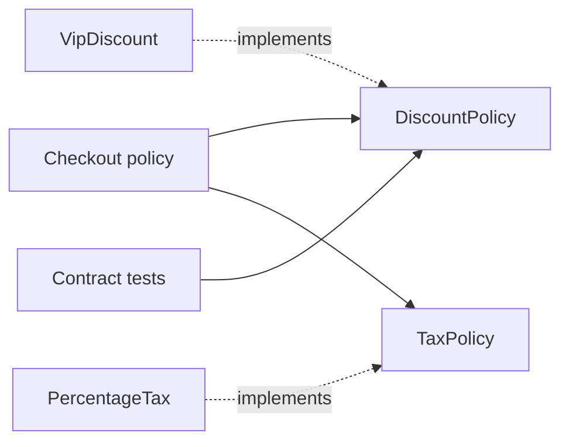

<TLDR>
  <TLDRCell label="what">
    SOLID is five principles for judging design boundaries: group code by reasons to change, extend through stable contracts, and keep high-level policy independent of details.
  </TLDRCell>
  <TLDRCell label="trap">
    SOLID does not require one class per method or one interface per concrete type; mechanical splitting merely hides coupling in more files.
  </TLDRCell>
  <TLDRCell label="fix">
    Find actual co-change, client needs, and behavioral contracts first, then introduce the smallest boundary and verify it with substitution tests and dependency rules.
  </TLDRCell>
</TLDR>

## What it is and why it exists

SOLID is a set of five related design principles, mainly for object-oriented module and type boundaries. It does not prescribe a directory structure or promise that code never changes. Instead, it supplies questions: who asks for this code to change, where extensions enter, what behavior substitutes must preserve, and which way source dependencies should point.

You meet the problems SOLID addresses when one requirement forces unrelated code to change together, a substitute crashes its caller, or business rules import database and network clients directly. The goal is not to maximize abstractions. It is to confine frequent change within boundaries you can understand and verify.

### Single Responsibility Principle

The <Term id="single-responsibility-principle">Single Responsibility Principle (SRP)</Term> says a module should be responsible to one actor. A “responsibility” is not one method; it is a cohesive set of behavior that changes in response to the same kind of business request. If finance controls a rule and marketing controls copy, they should not share one change unit merely because both concern orders.

SRP is about reasons to change and ownership. Splitting a cohesive module by method count adds coordination without removing a reason to change. Conversely, methods that the same team always changes together to enforce one rule can stay together.

### Open/Closed Principle

The <Term id="open-closed-principle">Open/Closed Principle (OCP)</Term> says stable software entities should be open for extension and closed for modification. “Closed” does not forbid bug fixes. It means an expected kind of variation can enter through an existing extension point without repeated edits to proven core policy.

An extension point must come from real variation, not speculation. If discount rules are regularly added, a strategy interface may fit; if there is one settled algorithm, a direct function is usually clearer. OCP reduces the risk surface of each change. It does not make old code untouchable.

### Liskov Substitution Principle

The <Term id="liskov-substitution-principle">Liskov Substitution Principle (LSP)</Term> says a subtype can replace its base type while preserving the correctness properties its callers depend on. Matching method names and return types establishes only syntactic shape. The real contract also includes accepted inputs, result guarantees, state invariants, and failure semantics.

A subtype cannot secretly strengthen preconditions or weaken postconditions. For example, if an interface accepts every valid order but one implementation accepts only VIP orders and throws for the rest, that implementation is not substitutable even when TypeScript accepts its shape.

### Interface Segregation Principle

The <Term id="interface-segregation-principle">Interface Segregation Principle (ISP)</Term> says clients should not depend on methods they do not use. Design an interface around a client's role instead of copying every capability of a large implementation. A checkout service that calculates discounts should not also depend on reporting and rule-administration methods.

“Narrow” is relative to the client and does not mean “exactly one method.” Operations that one use case needs together can form one cohesive interface. What matters is that an interface change does not force unrelated clients to recompile, retest, or supply empty implementations.

### Dependency Inversion Principle

The <Term id="dependency-inversion-principle">Dependency Inversion Principle (DIP)</Term> says high-level policy should not depend on low-level detail; both should depend on abstractions, and the abstractions should not be shaped around a detail. Source dependencies point toward stable business rules. Databases, payment SDKs, and message systems sit outside and implement ports that those rules need.

Constructor injection is one technique for supplying dependencies; it is not DIP itself. If a business service consumes an interface full of vendor terminology, low-level detail still controls the dependency even when a container injects the object. The inversion happens when high-level policy owns the contract's language.

## How it works

The five principles constrain one design boundary from different angles. SRP locates ownership of change, OCP decides where new behavior may enter, LSP protects the extension point's behavior, ISP gives each client only the contract it needs, and DIP points source dependencies toward the more stable side.



Runtime calls in the diagram flow from `Checkout` to concrete policies, but source dependencies need not follow them. `Checkout` knows only the `DiscountPolicy` and `TaxPolicy` it needs; a composition root chooses the implementations. Contract tests verify each implementation from the caller's perspective instead of checking class names or inheritance trees.

### Start with change

List changes that have happened or are explicitly committed, not every change you can imagine. For each one, record its requester, frequency, behavior that must remain stable, and code that always changes with it. That evidence distinguishes a cohesive responsibility from code that merely occupies the same file.

Then choose boundaries for frequent or high-risk variation. A boundary can be a function, module, type, or in-process port; it need not be a class. If a change remains simple, local, and easy to test, keeping the direct implementation is usually clearer than building a plugin system early.

### Make the contract explicit

An extension point needs an observable contract. Besides parameter and return types, specify valid inputs, result ranges, permitted errors, state changes, and conditions such as idempotency. LSP can be judged only against these conditions. Without them, “substitutable” means little more than “it compiled.”

The consumer's needs define the contract. That tends to support ISP because the interface contains only what the role needs to do its work. An implementation may expose more operations, but high-level policy does not need to know them.

### Turn the dependencies

The high-level module defines the port it needs, a low-level implementation adapts to that port, and the composition root creates and connects the objects at the application edge. Runtime control still reaches a database or external API, but the business module no longer imports a specific vendor. Tests can replace the real adapter with an in-memory implementation of the same contract.

After changing dependency direction, use tools to hold the boundary. Type checking verifies interface shape, contract tests verify shared semantics, and import rules verify module direction. They solve different problems and cannot replace one another.

### Five review questions

Ask these questions in order on an existing design so you do not jump straight from an acronym to a pattern:

1. Which behaviors change together for the same actor or business policy?
2. Which proven variation should be added as a new implementation instead of another core branch?
3. Does every substitute accept the same valid inputs and preserve the same results and invariants?
4. Does every client depend only on the operations needed for its current role?
5. Does high-level policy import a concrete technology that belongs outside it?

If the questions expose no risk, do not keep splitting code to make it “more SOLID.” These principles are diagnostic tools, not a score based on class count.

## Examples

The next three TypeScript examples use one order-pricing problem. The first runs but concentrates several kinds of change in one class. The second creates boundaries only for known variation. The third checks whether implementations really substitute for the contract.

### Centralized branches

`Checkout` decides the customer discount, national tax rate, and calculation order. Adding a customer tier or tax regime changes the same method, so unrelated reasons to change share one risk surface.

<Depth level="quick">

```typescript run title="branching-checkout.ts"
type Order = {
  subtotal: number;
  customerKind: 'regular' | 'vip';
  country: 'FR' | 'DE';
};

class Checkout {
  total(order: Order): number {
    let net = order.subtotal;
    if (order.customerKind === 'vip') {
      net *= 0.9;
    }

    let taxRate: number;
    if (order.country === 'FR') {
      taxRate = 0.2;
    } else {
      taxRate = 0.19;
    }

    return net * (1 + taxRate);
  }
}

const checkout = new Checkout();
const orders: Order[] = [
  { subtotal: 100, customerKind: 'regular', country: 'FR' },
  { subtotal: 200, customerKind: 'vip', country: 'FR' },
];

for (const order of orders) {
  console.log(checkout.total(order).toFixed(2));
}
```

```text
120.00
216.00
```

</Depth>

The output is correct; the problem is the cost of change. One edit to `Checkout` can damage another proven branch, and tests must cover a growing product of cases. SOLID does not begin only when execution fails. It addresses this predictable modification risk.

### Make policies dependencies

Now define discounts and tax as narrow interfaces needed by the checkout use case. `Checkout` coordinates only the calculation order, while its constructor receives concrete rules.

```typescript run title="policy-checkout.ts"
type Order = {
  subtotal: number;
  customerKind: 'regular' | 'vip';
};

interface DiscountPolicy {
  discountFor(order: Order): number;
}

interface TaxPolicy {
  taxFor(net: number): number;
}

class VipDiscount implements DiscountPolicy {
  discountFor(order: Order): number {
    return order.customerKind === 'vip' ? order.subtotal * 0.1 : 0;
  }
}

class PercentageTax implements TaxPolicy {
  constructor(private readonly rate: number) {}

  taxFor(net: number): number {
    return net * this.rate;
  }
}

class Checkout {
  constructor(
    private readonly discounts: DiscountPolicy,
    private readonly taxes: TaxPolicy,
  ) {}

  total(order: Order): number {
    const net = order.subtotal - this.discounts.discountFor(order);
    return net + this.taxes.taxFor(net);
  }
}

const checkout = new Checkout(new VipDiscount(), new PercentageTax(0.2));
for (const order of [
  { subtotal: 100, customerKind: 'regular' as const },
  { subtotal: 200, customerKind: 'vip' as const },
]) {
  console.log(checkout.total(order).toFixed(2));
}
```

```text
120.00
216.00
```

This version produces the same output but changes along different paths. Discounts and taxes have separate reasons to change, new discount implementations enter through composition, and `Checkout` depends on policy shapes it defines. The two interfaces expose only operations checkout uses; they do not drag administration or persistence capabilities into the client.

That does not mean every rule needs a class. If a tax rate is only configuration, `PercentageTax` can stay simple. If discounts stop varying independently, the boundary can be inlined again. A refactoring earns its keep only when it lowers real co-change and verification cost.

### Verify substitution with a contract

TypeScript's structural typing checks only method shape. The following contract check also requires each discount to handle every valid order and return a finite value from `0` through the subtotal.

```typescript run title="discount-contract.ts"
type Order = {
  subtotal: number;
  customerKind: 'regular' | 'vip';
};

interface DiscountPolicy {
  discountFor(order: Order): number;
}

class LoyaltyDiscount implements DiscountPolicy {
  discountFor(order: Order): number {
    return order.customerKind === 'vip' ? order.subtotal * 0.1 : 0;
  }
}

class VipOnlyDiscount implements DiscountPolicy {
  discountFor(order: Order): number {
    if (order.customerKind !== 'vip') throw new Error('VIP customers only');
    return order.subtotal * 0.1;
  }
}

function verify(name: string, policy: DiscountPolicy): void {
  const samples: Order[] = [
    { subtotal: 0, customerKind: 'regular' },
    { subtotal: 100, customerKind: 'regular' },
    { subtotal: 100, customerKind: 'vip' },
  ];

  try {
    for (const order of samples) {
      const discount = policy.discountFor(order);
      if (!Number.isFinite(discount) || discount < 0 || discount > order.subtotal) {
        throw new Error('discount outside contract');
      }
    }
    console.log(`${name}: contract OK`);
  } catch (error) {
    console.log(`${name}: ${(error as Error).message}`);
  }
}

verify('LoyaltyDiscount', new LoyaltyDiscount());
verify('VipOnlyDiscount', new VipOnlyDiscount());
```

```text
LoyaltyDiscount: contract OK
VipOnlyDiscount: VIP customers only
```

`VipOnlyDiscount` has the right method signature but strengthens the precondition: a caller could previously supply a regular-customer order, and now receives an unspecified exception. It therefore violates LSP and is not a safe `DiscountPolicy`. The fix is not an `instanceof` branch at each call site. Make the implementation accept the whole contract, or define a different role specifically for VIP-only behavior.

The contract check also puts a safety net under OCP. A new strategy does not require a change to `Checkout`, but it must pass the same behavior tests. “Open for extension” then does not decay into “anything with the same shape can plug in.”

## Pitfalls

> [!PITFALL]
> Reading SRP as “one method per class” produces many tiny classes that only forward calls.

**Fix:** Group by actor and co-change, not method count. Inspect commit history and ownership; behavior that always changes together to maintain one invariant usually belongs in one module.

> [!PITFALL]
> Creating a matching interface for every concrete class and turning every imagined variation into a plugin makes OCP speculation-driven.

**Fix:** Create an extension point only for independent variation that has happened or is explicitly committed. Having one implementation does not automatically invalidate an interface, but it needs a real client, an explainable contract, and substitution value.

> [!PITFALL]
> Treating successful type checking as proof of LSP misses stricter inputs, weaker outputs, and new exceptions.

**Fix:** Write contract tests from the base type caller's assumptions, including boundary inputs, state transitions, and failure semantics. If substitution forces callers to inspect concrete types, either the abstraction or the implementation is dishonest.

> [!PITFALL]
> Claiming DIP after adopting a dependency-injection container may only hide concrete dependencies behind a registry and string tokens.

**Fix:** Draw source import directions and inspect whose business language the port uses. High-level policy owns the interface, outside adapters implement it, and the composition root may know both; business modules must not import the adapters back.

> [!PITFALL]
> Forcing all five principles around a stable small function adds navigation, naming, and test-double cost without isolating real variation.

**Fix:** Start with a direct implementation and extract a boundary when a second behavior or reason to change actually appears. Keep reversible local design simple; define contracts earlier for hard-to-reverse boundaries that cross teams.

## In the AI era

Instead of asking an agent to “apply SOLID,” have it build two small alternatives behind the same caller contract. For a payment rule with two existing variants, that might mean comparing a direct branch with an extracted policy while running both through shared tests for accepted inputs, state changes, and failures. Real callers and co-change history identify the axis of variation; an import graph shows whether the extracted interface actually reverses the vendor dependency. The runnable comparison provides a better basis for choosing the simpler design than a count of classes or interfaces.

<Depth level="deep">

## Reading change boundaries

The common unit behind SOLID is change, not the class. A design boundary groups one kind of decision and lets other decisions use it through a stable interface. Classes, functions, and modules are only tools for expressing that boundary. If they do not reduce co-change, their syntax alone provides no design benefit.

### Co-change matters more than file count

To judge SRP, group changes over time by their cause. If tax adjustments always change with compliance rules while product copy changes independently, those groups need a visible boundary. If three calculation steps always change together for one policy, splitting them into three services creates shotgun edits instead.

Commit history supplies clues but cannot decide architecture automatically. Large formatting changes, mechanical renames, and temporary team assignments create false co-change. Interpret history alongside current ownership, the rule's source, and future variation that is actually committed.

### An extension point is a cost commitment

Every extension point adds names, a contract, composition logic, and a test matrix. Its benefit is that one kind of change arrives as a new implementation while stable callers remain untouched. Its cost exists even when a second behavior never appears. Apply OCP to selected axes of variation, not to every line in the system.

An extension point also closes some choices. `DiscountPolicy` stabilizes “return a discount amount for an order,” which fits when rules vary only in how they calculate that amount. If some rules need asynchronous lookup, currency conversion, or accumulating side effects, the original contract may mark the wrong boundary. Adding more optional methods does not repair it.

Use this evidence to decide whether to extract an extension point:

| Signal | Supports extraction | Supports direct code |
| --- | --- | --- |
| Existing behavior | Several implementations serve one role | One simple implementation |
| Change record | A branch repeatedly changes for new types | Changes are rare and local |
| Contract | Inputs, results, and failures are explicit | Behavior is still exploratory |
| Risk surface | Core edits threaten stable paths | Edits are easy to reverse |

The signals need not all agree. A high-risk payment boundary may deserve an abstraction before its second implementation, while a local formatting function with several variants may be handled by data. A decision should name the concrete risk instead of citing only a principle.

## Behavioral contracts in depth

LSP constrains observations, not the `extends` keyword. An object can become a substitute through `implements`, inheritance, structural typing, or a function parameter. Whenever a caller uses it through a shared abstraction, check whether substitution preserves correctness.

### Preconditions, postconditions, and invariants

A precondition states what must be true before a call. A subtype that demands more rejects calls the base type accepted. The example's `VipOnlyDiscount` narrows “valid order” to “valid VIP order,” so it strengthens the precondition.

A postcondition states what a caller can rely on after a successful return. If the base discount contract guarantees a finite amount no greater than the subtotal, an implementation returning `NaN`, a negative number, or an excessive amount weakens that guarantee. The static return type `number` cannot express those ranges.

An invariant stays true throughout an object's observable lifetime. Account balances, order-state transitions, and collection ordering can all be invariants. If a subtype introduces a method that creates a state the base type forbids, it breaks substitutability even when each method's return type is correct.

### Failure is part of the contract

Callers often depend on failure categories, retryability, and whether side effects happened before failure. An implementation that changes “return no discount” into “throw for regular customers” changes control flow. One that writes to an external system before timing out cannot substitute for a pure calculation policy either.

Contract tests should run through the public interface and reuse the same samples and assertions. Implementation-specific tests are still useful, but they do not replace the shared suite. Random or stateful rules can add property and state-machine tests when those properties come from the real contract rather than what a test tool happens to generate easily.

### How ISP supports LSP

A fat interface often forces implementations to provide meaningless methods. Empty implementations and `throw new Error('not supported')` are common LSP failures. Splitting by client role lets an implementation promise only capabilities it really supports and makes the behavioral contract easier to state honestly.

Excessive splitting can also break an atomic operation apart. If a client must call three interfaces in a fixed sequence to preserve an invariant, those operations may belong to one role contract. ISP removes irrelevant dependencies; it does not minimize method count.

## Dependency direction in depth

DIP concerns the direction of knowledge in source code. Business policy can call a database adapter at runtime while knowing only a business port such as “save order.” The adapter imports that port and translates vendor APIs into business semantics, so the detail depends on an abstraction defined by policy.

### Control flow is not source dependency

At runtime, `Checkout` calls a `TaxPolicy` implementation, which may call a remote service; control flows outward. At compile time, both `Checkout` and the adapter depend on a contract declared on the inside; source dependencies point inward. Conflating those arrows makes inversion look impossible whenever a call occurs.

The composition root is the place allowed to know concrete implementations. It reads configuration, creates adapters, and passes them to business objects. Centralizing selection at the edge prevents business code from importing containers, service locators, or environment variables throughout the codebase.

### Who owns the abstraction

A port should use the high-level caller's language and express only what that caller needs. If `OrderRepository` exposes a vendor query builder, connection object, or pagination response, it remains shaped by low-level detail despite being named an interface. Changing vendors still forces business policy to change, proving the dependency was not inverted.

An abstraction must not hide important semantics, however. If transaction scope, consistency, timeout, or error outcomes affect business correctness, the port must make them explicit. DIP isolates technical details; it does not conceal distributed-system failure modes under new names.

### The combined result

A healthy boundary often exhibits several properties together: one clear change actor owns it, it offers a small but complete extension contract for real variants, every implementation preserves common semantics, and high-level source code imports no concrete technology. A problem found by one principle often explains why another is hard to satisfy.

For example, an inability to write one contract for `DiscountPolicy` may mean the discounts actually serve different clients, an ISP problem. It may instead mean calculation and side effects have different reasons to change, an SRP problem. Correct the conceptual boundary before discussing factories, strategies, or dependency-injection frameworks; the resulting design is usually smaller.

</Depth>

<Checkpoint id="architecture/solid-principles" />

## Further reading

- [Microsoft: Architectural principles](https://learn.microsoft.com/en-us/dotnet/architecture/modern-web-apps-azure/architectural-principles)
- [TypeScript Handbook: Object Types](https://www.typescriptlang.org/docs/handbook/2/objects.html)
- [Clean Coder Blog: SOLID Relevance](https://blog.cleancoder.com/uncle-bob/2020/10/18/Solid-Relevance.html)
- [Clean Coder Blog: The Single Responsibility Principle](https://blog.cleancoder.com/uncle-bob/2014/05/08/SingleReponsibilityPrinciple.html)
