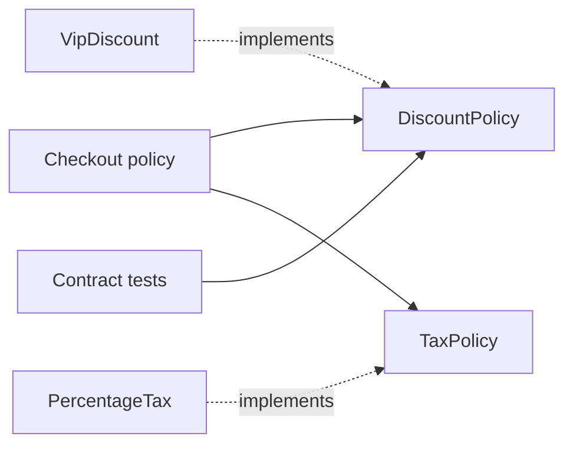

<TLDR>
  <TLDRCell label="what">
    SOLID 是五条判断设计边界的原则：按变更原因分职责，通过稳定契约扩展，并让高层策略远离实现细节。
  </TLDRCell>
  <TLDRCell label="trap">
    SOLID 不要求每个方法都配一个类，也不要求给每个具体类型套接口；机械拆分只会把耦合藏进更多文件。
  </TLDRCell>
  <TLDRCell label="fix">
    先找真实的共同变更、客户端需求和行为契约，再引入最小边界，并用替换测试和依赖规则验证它。
  </TLDRCell>
</TLDR>

## 是什么，为什么存在

SOLID 是五条相互关联的设计原则，主要用于面向对象的模块与类型边界。它不规定目录结构，也不承诺代码永远无需修改。它提供的是一组问题：谁会要求这里变化，扩展从哪里进入，替代实现必须守住什么行为，以及源码依赖应指向哪一侧。

当一个需求迫使无关代码一起修改、一个替代实现让调用者崩溃，或者业务规则直接导入数据库与网络客户端时，你就会遇到 SOLID 所处理的问题。目标不是增加抽象数量，而是把高频变化限制在可理解、可验证的边界内。

### 单一职责原则

<Term id="single-responsibility-principle">单一职责原则（Single Responsibility Principle，SRP）</Term>要求一个模块只对一个参与者（actor）负责。这里的“职责”不是一个方法，而是一组会因为同一类业务要求而共同变化的行为。财务规则与营销文案由不同参与者决定时，即使它们都处理订单，也不应被塞进同一个变化单元。

SRP 关注的是变更原因与所有权。把一个内聚模块按方法数量拆碎，会增加协调成本，却没有减少变更原因。相反，如果几个方法总由同一团队、同一规则一起修改，它们可以留在一起。

### 开闭原则

<Term id="open-closed-principle">开闭原则（Open/Closed Principle，OCP）</Term>要求稳定的软件实体对扩展开放、对修改关闭。“关闭”不是禁止修复缺陷，而是让一个预期中的变化通过已有扩展点进入，无需反复改动已经验证的核心策略。

扩展点必须来自真实变化，而不是猜测。折扣规则确实经常新增时，策略接口可能合适；只有一种确定算法时，直接函数通常更清楚。OCP 的价值是缩小每次变化的风险面，不是让旧代码变得不可触碰。

### 里氏替换原则

<Term id="liskov-substitution-principle">里氏替换原则（Liskov Substitution Principle，LSP）</Term>要求子类型能在基类型出现的地方替换它，同时保持调用者所依赖的正确性。相同的方法名与返回类型只满足了语法形状；真正的契约还包括允许的输入、结果保证、状态不变量和失败语义。

子类型不能偷偷加强前置条件，也不能削弱后置条件。例如，接口允许处理所有有效订单，而一个实现只接受 VIP 订单并对其他订单抛错，这个实现就不能替换该接口，哪怕 TypeScript 类型检查通过。

### 接口隔离原则

<Term id="interface-segregation-principle">接口隔离原则（Interface Segregation Principle，ISP）</Term>要求客户端不依赖自己不用的方法。接口应围绕一个调用方的角色设计，而不是完整复制某个大型实现的所有能力。只需要计算折扣的结账服务，不应同时依赖后台报表与规则管理方法。

“窄”取决于客户端，而不等于“恰好一个方法”。同一用例需要一起调用的操作可以形成一个内聚接口。关键是接口变化时，不相关客户端不会被迫重新编译、重新测试或提供空实现。

### 依赖倒置原则

<Term id="dependency-inversion-principle">依赖倒置原则（Dependency Inversion Principle，DIP）</Term>要求高层策略不依赖低层细节，两者都依赖抽象；抽象也不应按某个细节的形状设计。源码依赖应朝向稳定的业务规则，数据库、支付 SDK 或消息系统在外侧实现这些规则所需要的端口。

构造函数注入只是传入依赖的一种技术，不等于 DIP。若业务服务依赖一个充满供应商术语的接口，即使对象由容器注入，依赖方向仍由低层细节控制。真正的倒置发生在高层策略拥有契约语汇时。

## 工作原理

五条原则从不同角度约束同一个设计边界。SRP 找变化的归属，OCP 决定哪里允许新增行为，LSP 保护扩展点的行为，ISP 让每个客户端只看到需要的契约，DIP 则让源码依赖指向较稳定的一侧。



图中的运行时调用从 `Checkout` 流向具体策略，但源码依赖不必同向。`Checkout` 只认识自己需要的 `DiscountPolicy` 与 `TaxPolicy`；组合根负责选择实现。契约测试则从调用者视角验证每个实现，而不是检查类名或继承层级。

### 从变更开始

先列出已经发生或明确承诺的变化，而不是可能出现的所有变化。对每项变化，记录提出者、修改频率、必须保持的行为，以及与哪些代码总是一起变化。这些证据能区分内聚职责与偶然放在一起的代码。

接着为高风险或高频变化选择边界。边界可以是函数、模块、类型或进程内端口，不一定是类。若修改仍然简单、局部且容易测试，保留直接实现通常比提前建插件系统更好。

### 明确契约

扩展点需要可观察的契约。除了参数和返回类型，还要写清有效输入、结果范围、允许抛出的错误、状态变化和幂等性等条件。LSP 只能相对于这些条件判断；没有契约时，“可替换”只剩下编译成功。

契约由使用方的需求决定。这样设计出的接口通常也符合 ISP，因为它只包含该角色完成工作所需的能力。实现可以拥有更多公开方法，但高层策略不需要知道它们。

### 调整依赖方向

高层模块定义它需要的端口，低层实现适配该端口，组合根在应用边缘创建并连接对象。运行时控制流仍可进入数据库或外部 API，但业务模块的导入不再指向具体供应商。测试可以用遵守同一契约的内存实现替换真实适配器。

依赖方向改变后，还要用工具守住边界。类型检查验证接口形状，契约测试验证共同语义，导入规则检查模块方向。三者处理的问题不同，不能互相替代。

### 五个审查问题

在现有设计上按顺序提问，可以避免从缩写直接跳到模式：

1. 哪些行为会因为同一个参与者或业务政策而一起变化？
2. 哪种已经证实的变化应通过新增实现完成，而不是改动核心分支？
3. 每个替代实现是否接受同样的有效输入，并维持相同结果与不变量？
4. 每个客户端是否只依赖完成当前角色所需的操作？
5. 高层政策的源码是否导入了本应位于外侧的具体技术？

如果这些问题都没有暴露风险，就没有必要为了“符合 SOLID”继续拆分。原则是诊断工具，不是类数量评分表。

## 示例

下面三个 TypeScript 示例使用同一个订单定价问题。第一个版本能运行，却把几种变化集中到一个类；第二个版本只为已知变化建立边界；第三个版本验证实现是否真的能替换契约。

### 集中的条件分支

`Checkout` 同时决定客户折扣、国家税率和计算顺序。新增客户等级或税制都要修改同一个方法，因此不同变化原因共享一个风险面。

<Depth level="quick">

```typescript run title="branching-checkout.ts"
type Order = {
  subtotal: number;
  customerKind: 'regular' | 'vip';
  country: 'FR' | 'DE';
};

class Checkout {
  total(order: Order): number {
    let net = order.subtotal;
    if (order.customerKind === 'vip') {
      net *= 0.9;
    }

    let taxRate: number;
    if (order.country === 'FR') {
      taxRate = 0.2;
    } else {
      taxRate = 0.19;
    }

    return net * (1 + taxRate);
  }
}

const checkout = new Checkout();
const orders: Order[] = [
  { subtotal: 100, customerKind: 'regular', country: 'FR' },
  { subtotal: 200, customerKind: 'vip', country: 'FR' },
];

for (const order of orders) {
  console.log(checkout.total(order).toFixed(2));
}
```

```text
120.00
216.00
```

</Depth>

输出本身没有错误，问题在变化成本。对 `Checkout` 的一次修改可能误伤另一条已经工作的分支，而且测试必须覆盖不断扩大的组合。SOLID 不是从运行失败开始应用；它处理的是这种可预见的修改风险。

### 让策略成为依赖

现在把折扣与税分别定义为结账用例需要的窄接口。`Checkout` 只负责组合计算顺序，具体规则由构造函数传入。

```typescript run title="policy-checkout.ts"
type Order = {
  subtotal: number;
  customerKind: 'regular' | 'vip';
};

interface DiscountPolicy {
  discountFor(order: Order): number;
}

interface TaxPolicy {
  taxFor(net: number): number;
}

class VipDiscount implements DiscountPolicy {
  discountFor(order: Order): number {
    return order.customerKind === 'vip' ? order.subtotal * 0.1 : 0;
  }
}

class PercentageTax implements TaxPolicy {
  constructor(private readonly rate: number) {}

  taxFor(net: number): number {
    return net * this.rate;
  }
}

class Checkout {
  constructor(
    private readonly discounts: DiscountPolicy,
    private readonly taxes: TaxPolicy,
  ) {}

  total(order: Order): number {
    const net = order.subtotal - this.discounts.discountFor(order);
    return net + this.taxes.taxFor(net);
  }
}

const checkout = new Checkout(new VipDiscount(), new PercentageTax(0.2));
for (const order of [
  { subtotal: 100, customerKind: 'regular' as const },
  { subtotal: 200, customerKind: 'vip' as const },
]) {
  console.log(checkout.total(order).toFixed(2));
}
```

```text
120.00
216.00
```

这个版本的输出与前一个版本相同，但变化路径不同。折扣与税分别拥有变化原因，新的折扣实现可以通过组合进入，`Checkout` 依赖自己定义的策略形状。两个接口只暴露结账所用的操作，没有把管理或持久化能力带进来。

这并不表示所有规则都必须成为类。如果税率只是配置数据，`PercentageTax` 可以保持简单；如果折扣以后不再独立变化，也可以内联回去。重构是否有价值，要看它是否降低了真实的共同修改与验证成本。

### 用契约验证替换

TypeScript 的结构类型只验证方法形状。下面的契约检查还要求每种折扣处理所有有效订单，并返回 `0` 到小计之间的有限数值。

```typescript run title="discount-contract.ts"
type Order = {
  subtotal: number;
  customerKind: 'regular' | 'vip';
};

interface DiscountPolicy {
  discountFor(order: Order): number;
}

class LoyaltyDiscount implements DiscountPolicy {
  discountFor(order: Order): number {
    return order.customerKind === 'vip' ? order.subtotal * 0.1 : 0;
  }
}

class VipOnlyDiscount implements DiscountPolicy {
  discountFor(order: Order): number {
    if (order.customerKind !== 'vip') throw new Error('VIP customers only');
    return order.subtotal * 0.1;
  }
}

function verify(name: string, policy: DiscountPolicy): void {
  const samples: Order[] = [
    { subtotal: 0, customerKind: 'regular' },
    { subtotal: 100, customerKind: 'regular' },
    { subtotal: 100, customerKind: 'vip' },
  ];

  try {
    for (const order of samples) {
      const discount = policy.discountFor(order);
      if (!Number.isFinite(discount) || discount < 0 || discount > order.subtotal) {
        throw new Error('discount outside contract');
      }
    }
    console.log(`${name}: contract OK`);
  } catch (error) {
    console.log(`${name}: ${(error as Error).message}`);
  }
}

verify('LoyaltyDiscount', new LoyaltyDiscount());
verify('VipOnlyDiscount', new VipOnlyDiscount());
```

```text
LoyaltyDiscount: contract OK
VipOnlyDiscount: VIP customers only
```

`VipOnlyDiscount` 具有正确的方法签名，却加强了前置条件：调用者原本可以传入普通客户订单，现在却会收到未约定的异常。因此它违反 LSP，也不能作为 `DiscountPolicy` 的安全实现。修复方式不是在调用处写 `instanceof` 分支，而是让实现接受完整契约，或为只处理 VIP 的能力定义另一个明确角色。

契约检查也给 OCP 加上了安全网。新增策略无需修改 `Checkout`，但必须通过同一组行为测试。这样，“对扩展开放”不会退化成“任何形状相同的类都能接入”。

## 陷阱

> [!PITFALL]
> 把 SRP 理解成“每个类只能有一个方法”，会产生大量只转发调用的小类。

**修复方法：** 按参与者与共同变更来分组，而不是按方法计数。检查提交历史和负责人；总是一起变化、共同维护一个不变量的行为通常应留在同一模块。

> [!PITFALL]
> 为每个具体类创建同名接口，并把所有可能变化都预先做成插件，会把 OCP 变成猜测驱动的抽象。

**修复方法：** 只为已经发生或明确承诺的独立变化建立扩展点。保留一个实现并不自动说明接口错误，但接口应有真实客户端、可说明的契约和替换价值。

> [!PITFALL]
> 只要子类型通过类型检查，就认为它满足 LSP，会漏掉更严格输入、较弱输出和新增异常。

**修复方法：** 从基类型调用者的假设写契约测试，覆盖边界输入、状态转换和失败语义。若替换后调用者必须检查具体类型，说明抽象或实现至少有一方不诚实。

> [!PITFALL]
> 接入依赖注入容器后就宣称满足 DIP，可能只是把具体依赖隐藏在注册表和字符串令牌中。

**修复方法：** 画出源码导入方向，并检查端口使用谁的业务语言。高层策略拥有接口，外侧适配器实现它，组合根可以依赖双方但业务模块不能反向导入适配器。

> [!PITFALL]
> 在稳定的小函数周围强行应用五条原则，会增加导航、命名和测试替身成本，却没有隔离任何真实变化。

**修复方法：** 先用直接实现，在第二种行为或第二个变化原因真实出现时再提取边界。可逆的小设计保持简单；难以逆转且跨团队的边界则需要更早写清契约。

## AI 时代

不要只要求智能体「应用 SOLID」，而应让它在同一调用方契约背后实现两个小型方案。对于已有两种变体的支付规则，可以比较直接分支与抽取策略，并让两者通过同一组测试，覆盖可接受输入、状态变化和失败行为。真实调用方与共同变更历史会指出变化轴，导入图则能说明抽取的接口是否真的反转了供应商依赖。这种可运行的比较，比统计类或接口数量更适合用来选择较简单的设计。

<Depth level="deep">

## 深入理解变更边界

SOLID 的共同单位不是类，而是变化。一个设计边界把某类决定放在一起，并让其他决定通过稳定接口使用它。类、函数和模块只是表达边界的工具；如果它们不能减少共同修改，就没有因为采用某种语法而获得设计收益。

### 共同变化比文件数量重要

判断 SRP 时，可以把一段时间内的修改按原因分组。若税率调整总与合规规则一起变化，而展示文案由产品团队独立修改，这两组变化应有清楚边界。若三个计算步骤每次都因同一政策一起修改，把它们拆成三个服务反而会制造散弹式修改。

提交历史只能提供线索，不能自动决定架构。大规模格式化、机械重命名和临时团队安排会造成虚假的共同变化。需要把历史与当前所有权、规则来源和未来已经承诺的变化一起判断。

### 扩展点是一项成本承诺

每个扩展点都会新增名称、契约、组合逻辑和测试矩阵。它的收益是让某类变化以新增实现完成，并保持稳定调用方不动；它的成本则在没有第二种行为时仍然存在。因此，OCP 应用于选定的变化轴，而不是整个系统的每一行代码。

扩展点还会关闭某些选择。`DiscountPolicy` 把“根据订单返回折扣金额”设为稳定形状，适合规则之间只在金额计算上变化的场景。如果某些规则还需要异步查询、货币转换或累积副作用，原契约可能选错了边界，不能靠继续添加可选方法来掩盖。

可以用下面的证据判断是否提取扩展点：

| 信号 | 支持提取 | 支持保持直接 |
| --- | --- | --- |
| 已有行为 | 多个实现按同一角色使用 | 只有一个简单实现 |
| 变化记录 | 同一分支持续因新类型修改 | 修改少且集中 |
| 契约 | 输入、结果与失败可明确 | 行为仍在探索 |
| 风险面 | 修改核心会影响稳定路径 | 修改容易回滚 |

这些信号不需要全部同向。高风险支付边界可能在第二个实现出现前就值得抽象，而局部格式化函数即使有几个变体，也可能用数据表解决。决定应能说明具体风险，而不是只引用原则名称。

## 深入理解行为契约

LSP 约束的是观察结果，而不是继承关键字。一个对象可以通过 `implements`、继承、结构类型或函数参数成为替代项；只要调用者通过共同抽象使用它，就需要检查替换是否保持正确性。

### 前置条件、后置条件与不变量

前置条件规定调用前必须为真的事实。子类型若要求更多，就会拒绝基类型原本接受的调用。示例中的 `VipOnlyDiscount` 把“有效订单”收窄成“有效 VIP 订单”，所以加强了前置条件。

后置条件规定成功返回后调用者可以依赖的事实。若基础折扣契约保证金额有限且不超过小计，返回 `NaN`、负数或超额金额的实现都削弱了保证。静态返回类型 `number` 无法表达这些范围。

不变量是在对象可观察生命周期中持续成立的条件。账户余额、订单状态迁移和集合排序都可能是不变量。子类型若通过新增方法制造基类型不允许的状态，即使单个方法返回类型正确，也会破坏替换性。

### 失败也是契约的一部分

调用者通常依赖失败类别、是否重试以及失败前是否产生副作用。一个实现从“返回无折扣”改成“对普通客户抛错”，就改变了控制流。另一个实现若在超时前已经写入外部系统，也不能与纯计算策略互换。

契约测试应通过公共接口运行，并复用同一组样例与断言。实现专属测试仍然有用，但不能替代共同测试。对随机或有状态规则，可以加入性质测试和状态机测试，前提是性质来自真实契约，而不是测试工具方便生成的条件。

### ISP 与 LSP 的连接

臃肿接口常迫使实现提供无意义的方法，而空实现或 `throw new Error('not supported')` 正是典型的 LSP 破坏。按客户端角色拆开接口后，实现只承诺真正支持的能力，行为契约更容易写实。

反过来，过度细分接口也会把一个原子操作拆散。如果调用者必须按固定顺序调用三个接口才能保持不变量，这三个操作可能属于同一角色契约。ISP 的目标是去掉无关依赖，不是最小化方法计数。

## 深入理解依赖方向

DIP 讨论的是源码中的知识方向。业务策略可以在运行时调用数据库适配器，但它的源码只需要知道“保存订单”这样的业务端口。适配器导入端口并把供应商 API 转换为业务语义，因此细节依赖策略定义的抽象。

### 控制流不等于源码依赖

运行时，`Checkout` 调用 `TaxPolicy` 实现，后者可能继续调用远程服务；控制流由内向外。编译时，`Checkout` 与适配器都依赖内侧声明的契约；源码依赖由外向内。把这两个箭头混为一谈，会误以为只要发生调用就无法倒置依赖。

组合根是允许知道具体实现的位置。它读取配置，创建适配器，并把它们传给业务对象。把选择逻辑集中在边缘，可以避免业务代码到处导入容器、服务定位器或环境变量。

### 抽象属于谁

端口应使用高层调用者的语言，并只表达它真正需要的能力。若 `OrderRepository` 暴露供应商的查询构建器、连接对象或分页响应，它虽然叫接口，仍由低层细节塑形。更换供应商会迫使业务策略修改，说明依赖没有真正倒置。

但抽象也不能隐瞒重要语义。事务范围、一致性、超时与错误结果会影响业务正确性时，端口必须明确表达它们。DIP 隔离技术细节，不是把分布式系统的失败模式改名后藏起来。

### 五条原则的组合结果

一个健康边界通常同时呈现几种性质：它由一个清楚的变化参与者拥有，为真实变体提供小而完整的扩展契约，所有实现保持共同语义，高层源码不导入具体技术。某条原则暴露的问题，往往能解释另一条原则为何难以落实。

例如，无法写出 `DiscountPolicy` 的共同契约，可能说明几种折扣其实服务不同客户端，违反 ISP；也可能说明计算与副作用属于不同变化原因，违反 SRP。先修正概念边界，再讨论工厂、策略或依赖注入框架，通常会得到更小的设计。

</Depth>

<Checkpoint id="architecture/solid-principles" />

## 延伸阅读

- [Microsoft：架构原则](https://learn.microsoft.com/en-us/dotnet/architecture/modern-web-apps-azure/architectural-principles)
- [TypeScript 手册：对象类型](https://www.typescriptlang.org/docs/handbook/2/objects.html)
- [Clean Coder Blog：SOLID 的相关性](https://blog.cleancoder.com/uncle-bob/2020/10/18/Solid-Relevance.html)
- [Clean Coder Blog：单一职责原则](https://blog.cleancoder.com/uncle-bob/2014/05/08/SingleReponsibilityPrinciple.html)
