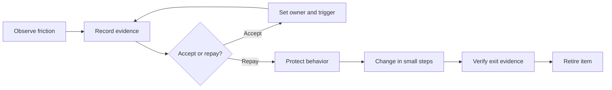

<TLDR>
  <TLDRCell label="what">
    Technical debt is a design or construction choice that adds cost to a future class of change; it describes change cost, not every defect in a system.
  </TLDRCell>
  <TLDRCell label="trap">
    Ranking debt by smell counts, coverage, or one health score puts ugly but stable code ahead of hotspots that cause incidents and delivery delays.
  </TLDRCell>
  <TLDRCell label="fix">
    Record affected changes, observed interest, risk, target state, and exit evidence, then repay high-value items through tested, incremental changes.
  </TLDRCell>
</TLDR>

## What it is and why it exists

<Term id="technical-debt">Technical debt</Term> is a design or construction choice that makes a future class of software changes costlier than a more suitable choice would. The cost may appear as extra development time, a wider regression surface, a release that is harder to verify, or greater failure risk. The label becomes useful for decisions only when you can name the future changes it makes harder.

The debt metaphor separates two costs. <Term id="debt-principal">Debt principal</Term> is the work needed to move from the current state to a chosen target state. <Term id="debt-interest">Debt interest</Term> is the extra work or risk paid whenever a change touches the debt. Unlike financial debt, software debt does not usually charge interest merely as time passes; an old module that never changes may be ugly but accrue almost none.

Defects, missing features, and technical debt overlap, but they are not identical. A calculation error needs repair because current behavior is wrong. Duplicated code creates debt interest when a later change must be synchronized across copies. A report that has not been implemented is product work, not debt. Putting every dissatisfaction into a debt register destroys its priority signal.

Some debt is deliberate. A team might temporarily couple two modules to meet a known deadline. That choice is controllable only when its short-term benefit, scope, owner, and exit trigger are explicit. Other debt emerges through learning: the team discovers after delivery that domain boundaries differ from its original assumptions, even though the initial implementation was not careless.

“Deliberate” does not mean “prudent.” A documented shortcut without safety boundaries, an exit path, or sufficient tests can still be reckless. Conversely, inadvertent debt does not prove negligence. Software development exposes constraints that were previously unknown; what matters is the response after discovery.

You meet technical debt in modules that change together, cross-layer dependencies, brittle tests, slow builds, obsolete dependencies, manual release steps, and knowledge silos. These are candidate signals, not automatic conclusions. Static analysis can identify complexity or dependency cycles, but it cannot tell you how often that area will change or what a failure would mean to the business.

Technical debt management is not a campaign to clean the codebase to abstract perfection. Its purpose is to make future costs visible, act before they impede delivery or safety, and permit low-interest debt to remain when evidence supports that choice. An honest decision to defer is more useful than a high-priority label with no context.

## How it works

Technical debt starts with a testable hypothesis: “What extra cost does this structure add to a particular kind of change?” The team gathers the evidence behind that judgment, then describes a target state and migration scope. Only then do estimates of principal and observations of interest refer to the same problem.

A debt item typically moves through five stages: discover a candidate, confirm it with evidence, accept or schedule it, implement remediation, and retire it after verification. Discovery is not an automatic commitment to refactor. Confirming impact prevents a preference dispute from masquerading as urgent work. Retirement is more than merging a refactoring commit; the target state must exist and external behavior must remain valid.



An actionable debt record contains at least the following information. It is a work object connecting a problem, a decision, and verification—not a refactoring wish.

| Field | What to record | Purpose |
| --- | --- | --- |
| Location | Component, dependency, or process boundary | Bound the affected area |
| Future change | Specific work that becomes harder | Explain why this is debt |
| Evidence | Delay, rework, incident, or dependency relation | Support the current judgment |
| Principal | Work and unknowns on the path to the target | Compare remediation cost |
| Interest | Extra cost or risk observed in recent changes | Judge urgency |
| Target state | Structure or behavior that must hold afterward | Prevent endless refactoring |
| Exit evidence | Test, dependency rule, telemetry, or exercise | Decide when to close the item |
| Owner and trigger | Who revisits it and what causes review | Make acceptance an active decision |

Evidence should stay close to real changes. Version history can reveal co-change and hotspots, continuous integration can show build and test wait time, incident records can connect failures to structural causes, and developers can record actual workarounds after finishing a task. Coverage and complexity are useful investigation prompts, but they do not replace impact evidence.

Prioritization begins with unacceptable risks such as a security exposure, data corruption, or an active incident. For everything else, compare expected change frequency, interest observed per change, blast radius, principal, and uncertainty. Do not collapse those dimensions too early into a decimal score. Showing the raw evidence lets decision makers see whether changing one weight would reverse the result.

There is more than one sound disposition:

1. Contain and repair an active risk immediately, with structural remediation scoped separately.
2. Repay incrementally during the next related feature, when context and testing budget are available.
3. Accept the debt explicitly and set a review trigger such as a date, usage level, incident, or dependency version.
4. Close a false positive when evidence shows a defect, product task, personal preference, or code that will no longer change.

Start repayment at observable behavior and boundaries, not with a broad rename. Protect behavior that must remain, establish a seam that supports gradual replacement, and retire the item using evidence tied to its target state. Cross-system migrations may use feature flags or a strangler fig, but the migration mechanism needs its own deletion condition or it becomes the next debt.

## Examples

These three examples use Node 24 and built-in APIs. Their time values are one team's local observations from completed work, included to demonstrate the method rather than claim an industry benchmark. Every output was produced by a local run.

### Rank candidates with observed interest

<Depth level="quick">

```javascript run title="rank-debt.js"
const debtItems = [
  {
    id: 'checkout-coupling',
    changesPerQuarter: 8,
    extraMinutesPerChange: 90,
    remediationHours: 18,
    activeIncident: false,
  },
  { id: 'report-export', changesPerQuarter: 1, extraMinutesPerChange: 120,
    remediationHours: 30, activeIncident: false },
  { id: 'token-validation', changesPerQuarter: 4, extraMinutesPerChange: 30,
    remediationHours: 6, activeIncident: true },
];

const ranked = debtItems
  .map((item) => ({
    ...item,
    observedInterestHours:
      (item.changesPerQuarter * item.extraMinutesPerChange) / 60,
  }))
  .sort(
    (left, right) =>
      Number(right.activeIncident) - Number(left.activeIncident) ||
      right.observedInterestHours - left.observedInterestHours,
  );

for (const item of ranked) {
  console.log(
    `${item.id}: incident=${item.activeIncident}, ` +
      `interest=${item.observedInterestHours}h/q, principal=${item.remediationHours}h`,
  );
}
```

```text
token-validation: incident=true, interest=2h/q, principal=6h
checkout-coupling: incident=false, interest=12h/q, principal=18h
report-export: incident=false, interest=2h/q, principal=30h
```

</Depth>

The script puts an active incident first, then compares quarterly observed interest derived from completed changes. `token-validation` does not have the largest time cost, but its incident makes it the first item. This ordering is an explicit team policy, not a universal technical-debt formula.

`checkout-coupling` shows `12` hours of observed quarterly interest and an estimated principal of `18` hours. That does not prove a payback after two quarters, because future change counts and remediation effects remain uncertain. It says the item deserves further scoping and validation, while current evidence supports deferring `report-export`.

A real register should retain the time window and evidence link behind each number. If “extra minutes” is a guess about an ideal codebase, label it as an estimate and keep it distinct from build logs, change reviews, or historical medians. False precision moves the argument to decimals instead of assumptions.

### Protect existing behavior with characterization tests

The next step is not to replace the old implementation immediately, but to record boundary behavior on which callers already rely. A <Term id="characterization-test">characterization test</Term> describes current observable behavior. It does not prove that behavior is correct for the business, so each case still needs confirmation from a product or domain owner.

```javascript run title="protect-behavior.js"
import assert from 'node:assert/strict';
function legacyShippingCents(subtotalCents, country) {
  if (country === 'FR') {
    return subtotalCents >= 5000 ? 0 : 700;
  }
  if (country === 'DE') {
    return subtotalCents >= 7000 ? 0 : 900;
  }
  return 1500;
}
const observedCases = [
  { subtotal: 4999, country: 'FR', expected: 700 },
  { subtotal: 5000, country: 'FR', expected: 0 },
  { subtotal: 6999, country: 'DE', expected: 900 },
  { subtotal: 7000, country: 'DE', expected: 0 },
  { subtotal: 8000, country: 'ES', expected: 1500 },
];
for (const testCase of observedCases) {
  const actual = legacyShippingCents(testCase.subtotal, testCase.country);
  assert.equal(actual, testCase.expected);
}
const policies = new Map([
  ['FR', { freeFrom: 5000, standard: 700 }],
  ['DE', { freeFrom: 7000, standard: 900 }],
]);
function shippingCents(subtotalCents, country) {
  const policy = policies.get(country);
  if (!policy) return 1500;
  return subtotalCents >= policy.freeFrom ? 0 : policy.standard;
}
for (const testCase of observedCases) {
  const actual = shippingCents(testCase.subtotal, testCase.country);
  assert.equal(actual, testCase.expected);
}
console.log(`characterized cases: ${observedCases.length}`);
console.log('refactor preserves observed behavior: true');
```

```text
characterized cases: 5
refactor preserves observed behavior: true
```

The first loop confirms that the tests describe the legacy implementation, and the second applies the same cases to the data-driven implementation. Both loops passing proves only that those five cases remain stable. Monetary ranges, unknown countries, and input types still need contract tests or validation rules.

This refactor moves country policies from conditional branches into data, so adding a country does not extend the nesting. It leaves the function's parameters and return unit unchanged, keeping migration scope small. If the business also wants to change free-shipping thresholds, commit and verify that behavior change separately from the structural refactor so failures have a clear cause.

### Close debt with exit evidence

The final script separates “the code was merged” from “the debt can be closed.” The item enters `retired` only after both contract tests and a dependency rule exist.

```javascript run title="retire-debt.js"
const debt = {
  id: 'checkout-coupling',
  state: 'accepted',
  target: 'Checkout depends on a pricing port',
  evidence: [],
};

function requestRetirement(item) {
  const required = ['contract-tests', 'dependency-rule'];
  const missing = required.filter((name) => !item.evidence.includes(name));

  if (missing.length > 0) {
    return { ok: false, reason: `missing evidence: ${missing.join(', ')}` };
  }

  item.state = 'retired';
  return { ok: true, reason: 'target state verified' };
}

let result = requestRetirement(debt);
console.log(`${debt.state}: ${result.reason}`);

debt.evidence.push('contract-tests');
result = requestRetirement(debt);
console.log(`${debt.state}: ${result.reason}`);

debt.evidence.push('dependency-rule');
result = requestRetirement(debt);
console.log(`${debt.state}: ${result.reason}`);
```

```text
accepted: missing evidence: contract-tests, dependency-rule
accepted: missing evidence: dependency-rule
retired: target state verified
```

Contract tests prove that both sides of the port still agree on observable behavior, while the dependency rule proves that source dependencies changed direction. The two forms of evidence cover behavior and structure separately, so the item remains `accepted` while either is absent. A real system may also require a telemetry window, migrated-data reconciliation, and proof that the old path was deleted.

The example uses an array of evidence names to stay short. A production workflow should store traceable references such as CI jobs, test reports, or architecture-rule locations and verify that each reference applies to the current version. Otherwise, an old successful run can retire debt that has since returned.

## Pitfalls

> [!PITFALL]
> Calling every code smell and backlog item technical debt creates a junk drawer that cannot be prioritized.

**Fix:** require a specific future change, extra cost, and target state. Route incorrect current behavior to defect handling and missing business capability to product work. Put only choices that increase future change cost into the debt register.

> [!PITFALL]
> Treating coverage, complexity, or a static analyzer's remediation time as debt value turns tool proxies into business evidence.

**Fix:** use tool results as candidate signals and connect them to change frequency, incidents, build waits, or actual rework. Preserve the raw dimensions instead of replacing judgment with a health score whose weights nobody can explain.

> [!PITFALL]
> Rewriting an entire legacy module because it is hard to understand discards hidden behavior, production feedback, and incremental rollback.

**Fix:** establish a behavioral baseline with characterization tests and telemetry, then cut small pieces at frequently changing boundaries. A full replacement is justified only when incremental seams are infeasible, the target boundary is clear, and migration and rollback are verifiable.

> [!PITFALL]
> A fixed “debt percentage” makes teams consume capacity on low-value items and can cap necessary remediation during an incident.

**Fix:** schedule work from risk and upcoming changes, showing the evidence and opportunity cost in planning. A team may reserve maintenance capacity as a policy, but consuming all of it every cycle is not a goal.

> [!PITFALL]
> Recording deliberate debt in a `TODO` or ticket title without an owner, trigger, or exit evidence turns a short exception into a permanent default.

**Fix:** link material trade-offs to an ADR or debt record, define a review date or event, and delete temporary branches, flags, and compatibility layers when the target state holds. Before closing the ticket, verify that the legacy path is actually unreachable.

## In the AI era

**What generated code gets wrong here**

Models often extract local duplication into a generic framework without checking whether the code changes together, making the new abstraction another debt. They assign priority from file length or `TODO` counts, fabricate precise team-velocity and incident-cost figures, or rewrite a legacy module in the name of modernization while losing null handling, rounding, retries, and side-effect order. Another common failure is to leave both paths and a feature flag in place without deletion criteria, turning migration scaffolding into permanent complexity.

**Ask your AI to check**

- Identify every dependency direction, compatibility branch, and temporary flag added by the change, and give each one verifiable deletion criteria.
- Separate observations from estimates using tests, version history, and incident records; mark unsupported numbers unknown instead of filling them in.
- Generate differential tests for boundary inputs, error types, side-effect order, and external call counts before and after refactoring, then list uncovered behavior.

**Review checklist**

- Trace every debt claim to code, build, incident, or change evidence; reject priority based only on a smell name.
- Check actual co-change before accepting a generated abstraction; code that merely looks similar today need not share a policy.
- Confirm that migration code has an owner, exit evidence, and deletion step, then test the build and runtime after disabling the old path.

**Prompt vocabulary**

Use the precise terms `technical debt`, `debt principal`, `debt interest`, `change hotspot`, `characterization test`, `exit criteria`, and `incremental remediation`. Ask for an evidence–assumption–decision–verification table rather than “clean up technical debt”; the structure exposes unsupported judgments.

<Depth level="deep">

## A debt register that stays useful

A debt register is valuable only if it changes with the evidence. Give every item a stable identifier so title edits do not break historical references. Use a small state set such as `candidate`, `accepted`, `planned`, `in-progress`, and `retired`. State reports a fact; it is not a proxy for severity or emotion.

`candidate` means somebody found a signal that remains unconfirmed. `accepted` means the team consciously carries a confirmed cost for now, and `planned` means scoped remediation has entered a plan. `in-progress` says migration is unfinished; `retired` requires all exit evidence. If evidence disproves the original judgment, close the candidate with the reason instead of pretending it was repaid.

Keep observations, estimates, and decisions separate in the body. An observation may be wait time from one build log, an estimate may be a range for remediation work, and a decision says why the team accepts or repays the debt now. If all three occupy one sentence, future readers cannot tell which fact has changed.

### Name the change boundary first

Start a debt item with a change scenario, not a solution. “Split `BillingService`” names an action. “Adding a payment method requires coordinated edits to checkout, billing, and notification” describes interest. The second wording lets the team verify whether changes still cross those boundaries and permits a different solution to win.

One code area can carry several debts. A module may be hard to test independently because its dependency direction is wrong and impossible to release separately because deployment ownership is unclear. Those debts have different target states, evidence, and owners, so separate records let the team retire them independently.

Conversely, symptoms spread across repositories may belong to one architecture debt. If every schema change coordinates three services and an outage, creating three repository-specific cleanup tickets conceals the shared cause. Draw the debt boundary around the decision that creates interest, not around the filesystem.

The following layers help classify scope, but the layer does not determine priority:

| Layer | Typical change cost | Suitable exit evidence |
| --- | --- | --- |
| Code | The same rule changes in several copies | Shared contract and duplication check |
| Module | Callers depend on implementation details | Public port and dependency rule |
| Architecture | Data or failure boundaries block independent change | Migration reconciliation and fault exercise |
| Delivery | Builds, tests, or releases repeat waiting work | Pipeline data and repeatable release |
| Knowledge | A change depends on one particular person | Runbook and cross-team exercise |

A higher layer is not automatically more urgent. A local implementation that currently permits an authentication bypass comes first, while a stable, isolated legacy architecture may remain accepted. Layer selects evidence and coordination scope; risk and change frequency drive ordering.

### Evidence sources and time windows

Version history can find files that change often or together, but commit counts are distorted by branch strategy, formatting changes, and generated code. Exclude mechanical changes and choose a window long enough to represent the current architecture. A module that changed frequently a year ago but is now sealed should not remain first because of an old hotspot rank.

Continuous integration records can measure waits and flaky tests, but preserve the environment and statistic. One slowest run does not describe typical interest, while an average can hide a few extremely slow failures. Before choosing a median, percentile, or failure rate, state the decision the number supports.

Incidents and support tickets expose risk impact, but they do not prove every related code area is causal. Link the debt item to a specific structural factor in the root-cause analysis, such as a shared failure boundary or inability to roll back independently, not merely to an incident number. Correlation guides an investigation; causal claims need further evidence.

Developer feedback can capture cognitive cost that tools miss, such as only one person knowing a release sequence. Rewrite that feedback as a verifiable hypothesis: can another engineer complete an exercise from the runbook alone, or how many owners must be consulted to change one rule? This keeps the experience while providing an exit test.

### Avoid false precision

Principal is usually a range, not a point. A team may know the work to extract a port and migrate callers while not knowing whether old data contains exceptions. Separating known work, risk allowance, and investigation of unknowns is more honest than estimating `23.5` hours. Update the estimate as investigation proceeds, but do not rewrite historical observations to make the forecast look accurate.

Interest is not all maintenance time. Only effort above a reasonable target state is debt interest, and that counterfactual can be hard to estimate. Prefer recording concrete friction—two extra modules changed because of a cycle, or three reruns caused by a flaky test—over claiming that an entire feature suffered a fixed percentage slowdown.

Comparing principal and interest can inform a discussion, but it does not produce a repayment date automatically. Security and compliance risks may require action before the first loss, while a low-risk hotspot can wait for related feature work. The decision also depends on confidence in the target state, migration risk, and certainty about future demand.

### Accepting debt is a decision

When accepting debt, record why repayment is deferred and which conditions invalidate that conclusion. Triggers may include the next related feature, end of support for a dependency, monthly changes crossing an agreed range, or another incident of the same class. A date with no event may create meaningless recurring review, so choose a signal that changes risk or benefit.

Material deliberate debt often deserves an ADR, but an ADR does not replace the execution register. The ADR explains why temporary coupling was accepted, the debt item tracks migration, ownership, and evidence, and tickets carry concrete work. Link them rather than copying three bodies that will expire independently.

### Turn priority into deliverable slices

High priority means investigate or act first; it does not approve an unbounded rewrite. Break planned remediation into independently verifiable slices:

1. Establish a baseline for current behavior, dependencies, and runtime measures.
2. Introduce a seam or rule while keeping the old path operational.
3. Migrate one caller or traffic class and compare old and new evidence.
4. Migrate the remaining scope, remove the old path, and verify exit criteria.

Every slice needs its own failure rollback. If step two can be deployed only together with step four, the intermediate state is not deployable and the plan is still a full replacement. Resolving that coupling is usually more important than subdividing the task list further.

Feature work and debt repayment can share a slice when acceptance criteria separate their outcomes. When adding a payment method, for example, extract a pricing port at the same time. Feature tests verify the new method, while a dependency rule verifies the debt target. This uses context from a real change without hiding incomplete remediation behind a passing feature.

## Remediation strategies and exit criteria

The right remediation follows the boundary where debt affects change. Local duplication may disappear during one related edit. Cross-module dependencies need a stable seam first, while debt across service or data-ownership boundaries needs a migration protocol and runtime evidence. The larger the strategy, the more explicitly it must describe deployable and reversible intermediate states.

### Protect behavior first

Place characterization tests at a boundary callers can observe, not around private functions of the old implementation. Once current results, errors, state changes, and external side effects are covered, the team can distinguish regressions from intended changes while structure moves. If current behavior is itself defective, obtain a business decision for the new contract before updating the tests.

Snapshots or golden masters suit complex output that can be serialized stably, such as invoices or reports. They can accidentally freeze noise such as timestamps, field ordering, and random identifiers, so normalize unstable fields first. Reviewers must understand the diff; a snapshot being easy to update is not evidence that the new result is correct.

### Establish a replaceable seam

A useful seam limits migration to a real boundary. For example, make checkout depend on a pricing port instead of importing the pricing database directly. Adapt the legacy implementation to the port first, then migrate callers one at a time so every step remains deployable. If the interface merely copies a vendor API, the coupling has moved files rather than disappeared.

Feature flags can compare old and new implementations, but they add state combinations. Every flag needs an owner, default, observation metric, and deletion event; a long-lived flag also requires tests for both states. Principal is not repaid until the old implementation and its flag are removed.

### Make architecture constraints executable

When the target changes dependency direction, unit tests prove behavior but cannot stop a later import from restoring the old coupling. Add a static dependency rule, module visibility, or build boundary so continuous integration rejects a violation. Such a <Term id="fitness-function">architecture fitness function</Term> should report the exact offending edge rather than only a health score.

Runtime targets need different evidence. If debt came from a shared failure boundary, exit criteria may include a fault exercise, independent rollback, and observable degradation. If it came from a slow query, verify it under a declared load, data volume, and environment. Do not use source-structure checks as proof of runtime properties or one exercise as proof of permanent safety.

### Observe after closure

At retirement, preserve the location of tests and rules, the last verified version, and the old paths that were deleted. Then observe errors, latency, or manual fallbacks for a window proportionate to the risk and retain a condition for reopening the item. Closure means current evidence meets the target, not that the same pattern can never return.

If the same debt keeps returning, the remediation target may extend beyond one code section. Missing ownership, unenforced architecture rules, long feedback cycles, or perverse incentives can recreate the same cost. Open a clearly scoped systemic item and preserve the earlier records as evidence instead of repeatedly reopening one local refactor.

</Depth>

<Checkpoint id="architecture/tech-debt" />

## Further reading

- [IEEE Software: Technical Debt From Metaphor to Theory and Practice](https://ieeexplore.ieee.org/document/6336722/)
- [IEEE TechDebt: Technical Debt Triage in Backlog Management](https://ieeexplore.ieee.org/document/8786030/)
- [IEEE SEAA: Architecture Technical Debt Understanding Causes and a Qualitative Model](https://ieeexplore.ieee.org/document/6928795/)
- [IEEE ICSE-SEIP: On the Lack of Consensus Among Technical Debt Detection Tools](https://ieeexplore.ieee.org/document/9402066/)
