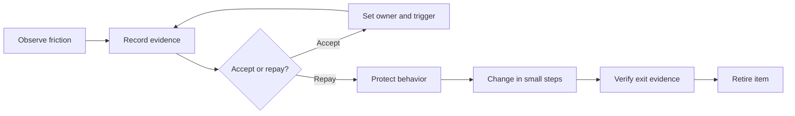

<TLDR>
  <TLDRCell label="what">
    技术债务（technical debt）是让未来某类变更付出额外成本的一项设计或构造选择；它描述的是变化成本，不是所有缺陷的统称。
  </TLDRCell>
  <TLDRCell label="trap">
    按代码坏味道数量、覆盖率或一个总分直接排序，会把很少变化的丑陋代码排在正在制造事故和交付延迟的热点之前。
  </TLDRCell>
  <TLDRCell label="fix">
    为每项债务记录受影响的变更、实际利息、风险、目标状态与退出证据，再以小步重构和测试偿还高价值项目。
  </TLDRCell>
</TLDR>

## 是什么，为什么存在

<Term id="technical-debt">技术债务（technical debt）</Term>是一项设计或构造选择，它使未来某类软件变更比采用更合适的方案成本更高。成本可能表现为额外开发时间、更大的回归范围、更难验证的发布，或者更高的故障风险。只有当你能说清楚「哪类未来变化会因此更难」时，这个标签才有决策价值。

债务比喻把两种成本分开。<Term id="debt-principal">债务本金（debt principal）</Term>是从当前状态迁移到选定目标状态所需的工作；<Term id="debt-interest">债务利息（debt interest）</Term>是在债务仍存在时，每次触及相关区域多付出的工作或风险。与金融债务不同，软件债务通常不会仅因时间流逝而持续计息；一个从不再变化的旧模块可能很丑，却几乎不产生利息。

缺陷、缺少功能和技术债务彼此相关，但并不相同。一次计算错误需要修复，因为当前行为已经不正确；一段重复代码只有在后续变更必须同步修改多个副本时才产生债务利息；一个尚未实现的报表则是产品待办，不应伪装成债务。把所有不满意之处都放进债务清单，会让清单失去优先级。

有些债务是有意承担的，例如为了在确定的期限内交付，暂时让两个模块直接耦合。这个决定只有在短期收益、影响范围、负责人和退出触发条件都明确时才可控。另一类债务来自学习：团队交付后才发现领域边界与最初假设不同，即使当时的实现并不草率，也可能形成无意债务。

「有意」不等于「审慎」。一个已记录但没有安全边界、退出路径或足够测试的捷径，仍然可能是鲁莽的。反过来，无意债务也不表示团队失职；软件开发会揭示先前不知道的约束，关键是发现后如何处理。

你会在频繁共同修改的模块、跨层依赖、脆弱测试、缓慢构建、过期依赖、手工发布步骤和知识孤岛中遇到技术债务。这些只是候选信号，不是自动结论。静态分析能指出复杂度或循环依赖，却不能单独说明该区域未来会变多少次、失败后有什么业务影响。

技术债务管理的目标不是把代码库清理到抽象意义上的完美。目标是让团队知道自己承担了哪些未来成本，在成本妨碍交付或安全之前采取行动，并允许低利息债务在证据支持下继续存在。一个诚实的「暂不偿还」决定，比没有上下文的高优先级标签更有用。

## 工作原理

技术债务从一个可检验的假设开始：「因为当前结构，某类变更会额外花费什么？」团队先收集触发该判断的证据，再描述目标状态和迁移范围。只有这样，本金估算与利息观察才指向同一个问题。

一项债务通常经历五个阶段：发现候选项、用证据确认、接受或安排、实施修复、验证后退出。发现并不自动等于承诺重构；先确认影响，可以避免把偏好争论包装成紧急工作。退出也不等于合并了一个重构提交，必须证明目标状态已经实现且外部行为仍满足要求。



一条可执行的债务记录至少要保存以下内容。它不是重构愿望，而是连接问题、决策和验证的工作对象。

| 字段 | 记录内容 | 用途 |
| --- | --- | --- |
| 位置 | 组件、依赖或流程边界 | 限定影响范围 |
| 未来变化 | 会因此变难的具体工作 | 解释为何是债务 |
| 证据 | 延迟、返工、事故或依赖关系 | 支撑当前判断 |
| 本金 | 达到目标状态的工作与未知项 | 比较偿还成本 |
| 利息 | 最近变更中观察到的额外成本或风险 | 判断紧迫性 |
| 目标状态 | 偿还后必须成立的结构或行为 | 防止无限重构 |
| 退出证据 | 测试、依赖规则、遥测或演练 | 决定何时关闭 |
| 负责人和触发条件 | 谁复查，以及何时重新评估 | 让接受债务成为主动决定 |

证据应尽量靠近真实变化。版本历史可以展示共同修改和热点，持续集成可以展示构建与测试等待时间，事故记录可以连接故障与结构原因，开发者可以在完成工作后记录实际绕行步骤。代码覆盖率和复杂度适合作为调查入口，但它们不能替代影响证据。

排序时先处理安全漏洞、数据损坏或正在发生的事故等不可接受风险。其余项目比较未来变化频率、每次变化的观察利息、影响半径、本金和不确定性。不要把这些维度过早压成一个带小数的总分；并列展示原始证据，决策者才能看见某个权重改变后结论是否会翻转。

合理的处理结果不止「立即修复」一种：

1. 立即阻断并修复当前风险，同时为后续结构修复建立独立范围。
2. 在下一次相关功能变更中增量偿还，因为那时既有上下文也有测试预算。
3. 明确接受债务，并设置日期、使用量、事故或依赖版本等复查触发条件。
4. 关闭误报，因为证据表明它是缺陷、产品待办、个人偏好，或者不再会变化的代码。

偿还工作要从可观察行为和边界开始，而不是从大规模改名开始。先用测试固定仍需保留的行为，再建立可以逐步替换的接缝，最后用目标状态对应的证据退出。对于跨系统迁移，可以结合特性开关或绞杀者模式，但迁移机制本身也必须有删除条件，否则它会成为下一笔债务。

## 示例

下面三个示例使用 Node 24 的内置 API。示例中的时间是某个团队对已完成工作的局部观察，仅用于演示方法，不是行业基准；所有输出均来自本地执行。

### 用观察利息排列候选项

<Depth level="quick">

```javascript run title="rank-debt.js"
const debtItems = [
  {
    id: 'checkout-coupling',
    changesPerQuarter: 8,
    extraMinutesPerChange: 90,
    remediationHours: 18,
    activeIncident: false,
  },
  { id: 'report-export', changesPerQuarter: 1, extraMinutesPerChange: 120,
    remediationHours: 30, activeIncident: false },
  { id: 'token-validation', changesPerQuarter: 4, extraMinutesPerChange: 30,
    remediationHours: 6, activeIncident: true },
];

const ranked = debtItems
  .map((item) => ({
    ...item,
    observedInterestHours:
      (item.changesPerQuarter * item.extraMinutesPerChange) / 60,
  }))
  .sort(
    (left, right) =>
      Number(right.activeIncident) - Number(left.activeIncident) ||
      right.observedInterestHours - left.observedInterestHours,
  );

for (const item of ranked) {
  console.log(
    `${item.id}: incident=${item.activeIncident}, ` +
      `interest=${item.observedInterestHours}h/q, principal=${item.remediationHours}h`,
  );
}
```

```text
token-validation: incident=true, interest=2h/q, principal=6h
checkout-coupling: incident=false, interest=12h/q, principal=18h
report-export: incident=false, interest=2h/q, principal=30h
```

</Depth>

脚本先把正在发生的事故排在首位，再比较根据已完成变更计算的季度观察利息。`token-validation` 的时间成本不是最高，但事故使它成为第一项。这个排序规则是团队的显式政策，不是技术债务的通用公式。

`checkout-coupling` 每季度观察到 `12` 小时利息，本金估算为 `18` 小时。这不证明两个季度后一定回本，因为未来变化次数和修复效果仍有不确定性。它只说明这项债务值得进一步拆分和验证，而 `report-export` 在当前证据下可以延后。

真实清单还应保留每个数字的时间窗口和证据链接。若「额外分钟」只是对理想代码库的猜测，就要标成估算，并与构建日志、变更复盘或历史中位数分开。伪精确会让讨论聚焦小数，而不是假设。

### 用特征测试保护现有行为

下一步不是立即替换旧实现，而是先记录调用者已经依赖的边界行为。<Term id="characterization-test">特征测试（characterization test）</Term>描述代码当前可观察到的行为；它不保证该行为在业务上正确，因此每个用例仍需产品或领域负责人确认。

```javascript run title="protect-behavior.js"
import assert from 'node:assert/strict';
function legacyShippingCents(subtotalCents, country) {
  if (country === 'FR') {
    return subtotalCents >= 5000 ? 0 : 700;
  }
  if (country === 'DE') {
    return subtotalCents >= 7000 ? 0 : 900;
  }
  return 1500;
}
const observedCases = [
  { subtotal: 4999, country: 'FR', expected: 700 },
  { subtotal: 5000, country: 'FR', expected: 0 },
  { subtotal: 6999, country: 'DE', expected: 900 },
  { subtotal: 7000, country: 'DE', expected: 0 },
  { subtotal: 8000, country: 'ES', expected: 1500 },
];
for (const testCase of observedCases) {
  const actual = legacyShippingCents(testCase.subtotal, testCase.country);
  assert.equal(actual, testCase.expected);
}
const policies = new Map([
  ['FR', { freeFrom: 5000, standard: 700 }],
  ['DE', { freeFrom: 7000, standard: 900 }],
]);
function shippingCents(subtotalCents, country) {
  const policy = policies.get(country);
  if (!policy) return 1500;
  return subtotalCents >= policy.freeFrom ? 0 : policy.standard;
}
for (const testCase of observedCases) {
  const actual = shippingCents(testCase.subtotal, testCase.country);
  assert.equal(actual, testCase.expected);
}
console.log(`characterized cases: ${observedCases.length}`);
console.log('refactor preserves observed behavior: true');
```

```text
characterized cases: 5
refactor preserves observed behavior: true
```

第一个循环确认测试确实描述旧实现，第二个循环把同一组案例应用到数据驱动的新实现。两个循环都通过，只能证明列出的五个案例保持不变。货币范围、未知国家和输入类型仍需要契约测试或验证规则覆盖。

这次重构把国家政策从条件分支移到数据映射，使新增国家不必继续扩展嵌套分支。它没有改动外部函数的参数和返回单位，因此迁移范围较小。如果业务同时要求修改免邮门槛，应把行为变更与结构重构分别提交和验证，失败时才知道是哪类变化造成的。

### 用退出证据关闭债务

最后一个脚本把「代码已合并」与「债务可关闭」分开。记录只有在契约测试和依赖规则都存在时才进入 `retired` 状态。

```javascript run title="retire-debt.js"
const debt = {
  id: 'checkout-coupling',
  state: 'accepted',
  target: 'Checkout depends on a pricing port',
  evidence: [],
};

function requestRetirement(item) {
  const required = ['contract-tests', 'dependency-rule'];
  const missing = required.filter((name) => !item.evidence.includes(name));

  if (missing.length > 0) {
    return { ok: false, reason: `missing evidence: ${missing.join(', ')}` };
  }

  item.state = 'retired';
  return { ok: true, reason: 'target state verified' };
}

let result = requestRetirement(debt);
console.log(`${debt.state}: ${result.reason}`);

debt.evidence.push('contract-tests');
result = requestRetirement(debt);
console.log(`${debt.state}: ${result.reason}`);

debt.evidence.push('dependency-rule');
result = requestRetirement(debt);
console.log(`${debt.state}: ${result.reason}`);
```

```text
accepted: missing evidence: contract-tests, dependency-rule
accepted: missing evidence: dependency-rule
retired: target state verified
```

契约测试证明端口两侧仍同意可观察行为，依赖规则则证明源码依赖方向已经改变。两类证据分别覆盖行为和结构，缺一项时记录保持 `accepted`。真实系统还可能要求遥测窗口、迁移数据核对和旧路径删除证明。

代码把证据写成名称数组只是为了保持示例短小。生产流程应保存可追溯引用，例如持续集成任务、测试报告或架构规则的位置，并检查引用对应当前版本。否则团队可能用一次过期的成功结果关闭后来再次出现的债务。

## 陷阱

> [!PITFALL]
> 把所有代码坏味道和待办事项都叫作技术债务，会制造一个无法排序的垃圾桶。

**修复：**要求记录具体的未来变化、额外成本和目标状态。当前行为错误的项目进入缺陷流程，缺少的业务能力进入产品待办，只有会增加未来变更成本的选择进入债务清单。

> [!PITFALL]
> 用覆盖率、复杂度或静态分析修复时间作为债务价值，会把工具代理指标当成业务证据。

**修复：**把工具结果当作候选信号，并连接到变化频率、事故、构建等待或真实返工。保留原始维度，不要用无法解释权重的单一健康分数替代判断。

> [!PITFALL]
> 看到遗留模块难以理解就启动整体重写，会同时丢掉隐藏行为、生产反馈和逐步回退能力。

**修复：**先用特征测试与遥测建立行为基线，再从频繁变化的边界切出小块。整体替换只有在增量接缝不可行、目标边界明确且迁移与回退都可验证时才成立。

> [!PITFALL]
> 设立固定「债务比例」会让团队为了填满容量处理低价值项目，也可能在事故期间限制必要修复。

**修复：**根据风险和即将发生的变化安排工作，并在计划中展示证据与机会成本。团队可以保留维护容量作为策略，但它不是每个周期都必须消费完的目标。

> [!PITFALL]
> 用 `TODO` 或工单标题记录有意债务，却不写负责人、触发条件和退出证据，会把短期例外变成永久默认。

**修复：**把重要取舍连接到 ADR 或债务记录，明确复查日期或事件，并在目标状态满足时删除临时分支、开关和兼容层。关闭工单前检查遗留路径是否真的不可达。

## AI 时代

由智能体协助偿还技术债务时，最终应消除已识别的维护负担，并退役临时兼容路径。例如，在替换遗留序列化器之前，智能体可以分析使其代价升高的变更和事故，用特征测试记录当前的空值、舍入、错误和副作用行为，再抽取一条经常变化的边界。随后让新旧路径对同一语料运行，在既定退出条件满足后删除开关，并测量当初证明这项工作有价值的构建或变更成本。这样得到的是关闭债务项的证据，而不是遗留第二套实现。

<Depth level="deep">

## 可维护的债务清单

债务清单的价值取决于它能否随着证据变化。每项记录应有稳定标识，避免标题修改后丢失历史引用；状态应使用有限集合，例如 `candidate`、`accepted`、`planned`、`in-progress` 和 `retired`。状态描述事实，不表达情绪或严重度。

`candidate` 表示有人发现了信号但尚未验证，`accepted` 表示团队决定暂时承担已确认的成本，`planned` 表示偿还已经进入有范围的计划。`in-progress` 只说明迁移尚未结束；`retired` 要求退出证据全部成立。若证据推翻原判断，应以原因关闭候选项，而不是把它伪装成已经偿还。

记录的正文应把观察、估算与决定分开。观察可以是一次构建日志中的等待时间，估算可以是修复所需工作区间，决定则说明为什么现在接受或偿还。三者混在一句话里，后来的人无法判断哪个事实已经变化。

### 先命名变化边界

债务记录应从变化场景开始，而不是从解决方案开始。「拆分 `BillingService`」只表达了动作；「新增付款方式时必须同步修改结账、账单与通知模块」才描述了利息。后一种写法允许团队验证变化是否仍跨越这些边界，也允许另一个方案胜出。

同一处代码可能承载多笔债务。一个模块既可能因为依赖方向错误而难以独立测试，也可能因为部署所有权不清而无法单独发布。这两类债务的目标状态、证据和负责人不同，拆开记录才能分别关闭。

相反，散落在多个仓库中的症状也可能属于同一笔架构债务。如果一个模式变更总要协调三个服务和一次停机，逐仓库建立三个「清理」工单会隐藏共同原因。债务边界应跟随导致利息的决定，而不是跟随文件系统。

可以用下表区分常见层级，但层级本身不决定优先级：

| 层级 | 典型变化成本 | 合适的退出证据 |
| --- | --- | --- |
| 代码 | 同一规则需要修改多个副本 | 共享契约与重复检查 |
| 模块 | 调用方依赖实现细节 | 公共端口与依赖规则 |
| 架构 | 数据或故障边界阻止独立变化 | 迁移核对与故障演练 |
| 交付 | 构建、测试或发布产生重复等待 | 流水线数据与可重复发布 |
| 知识 | 修改必须依赖特定个人 | 运行手册与交叉演练 |

层级较高不等于更紧急。一个正在导致认证绕过的局部实现必须先处理，而一个稳定且隔离的旧架构可以继续接受。层级用于选择证据和协调范围，风险与变化频率才进入排序。

### 证据来源与时间窗口

版本历史可以帮助寻找经常变化且共同变化的文件，但提交次数会受到分支策略、格式化提交和代码生成影响。使用它时应排除机械变更，并查看足够长、又能代表当前架构的窗口。一个年前频繁修改、现在已经封存的模块，不应继续因为旧热点排名占据首位。

持续集成记录适合衡量等待时间和不稳定测试，但必须保留运行环境与统计口径。一次最慢运行不能代表典型利息，平均数也可能掩盖少量极慢失败。选择中位数、分位数或失败率之前，先说明要支持哪个决定。

事故与支持工单能展示风险影响，却不能证明所有相关代码都是根因。债务记录应链接根因分析中具体的结构因素，例如共享故障边界或无法独立回滚，而不是只链接事故编号。相关性提供调查方向，因果结论需要额外证据。

开发者反馈能捕获工具没有记录的认知成本，例如只有一人知道部署顺序。把这类反馈改写成可验证假设：另一名工程师能否只依赖运行手册完成演练，或者修改一个规则时需要咨询多少个所有者。这样既尊重经验，也给出了改善后的退出方式。

### 不制造虚假精度

本金通常是区间，不是单点。团队可能知道提取端口和迁移调用方的工作，却不知道旧数据是否包含例外；把已知工作、风险缓冲和未知调查分开，比给出 `23.5` 小时更诚实。估算应随调查更新，但不要回写历史观察来使预测看起来准确。

利息也不等于所有维护时间。只有相对于合理目标状态多付出的部分才属于债务利息，而这个反事实本身可能难以估计。最可靠的做法是记录具体摩擦，例如因为循环依赖多改了两个模块，或者因为测试不稳定重跑了三次，而不是声称整个功能有固定百分比的速度损失。

比较本金与利息可以支持讨论，却不能自动产生偿还日期。安全与合规风险可能在第一次损失发生前就必须处理；低风险热点则可以在相关功能到来时顺便修复。决策还要考虑目标状态的可信度、迁移风险和未来需求是否足够确定。

### 接受债务也是一项决定

接受债务时，应记录当下不偿还的理由和使结论失效的条件。触发条件可以是下一次相关功能、某个依赖停止支持、月度变更量超过约定范围，或者再次发生同类事故。只有日期而没有事件也可能导致无意义的周期复查，因此应选择真正改变风险或收益的信号。

重要的有意债务通常需要一份 ADR 来保存取舍，但 ADR 不替代执行清单。ADR 解释为什么接受临时耦合，债务项跟踪迁移、负责人和证据，工单承载具体工作。相互链接即可，不要复制三份会独立过期的正文。

### 把优先级变成可交付切片

高优先级只说明先调查或先行动，不等于批准一场没有边界的重写。计划偿还时，应把目标拆成可独立验证的切片：

1. 建立当前行为、依赖和运行指标的基线。
2. 引入接缝或规则，但仍让旧路径工作。
3. 迁移一个调用方或一种流量，并比较新旧证据。
4. 迁移剩余范围，删除旧路径，再验证退出条件。

每个切片都要有自己的失败回退方式。若第二步只能与第四步同时发布，中间状态就不可部署，计划实际上仍是整体替换。先解决这种耦合，通常比继续细分任务列表更重要。

功能工作和债务偿还可以共享一个切片，只要验收条件把两类结果分开。例如新增付款方式时同时提取定价端口，功能测试验证新方式，依赖规则验证债务目标。这样能利用真实变化带来的上下文，又不会把重构完成度藏在功能通过之后。

## 修复策略与退出条件

偿还策略取决于债务所在的变化边界。局部重复可以在一次相关改动中消除；跨模块依赖需要先建立稳定接缝；跨服务或数据所有权的债务则需要迁移协议和运行期证据。策略越大，越要把可回退的中间状态写清楚。

### 先固定必须保留的行为

特征测试应放在调用者可观察的边界，而不是锁定旧实现的私有函数。覆盖当前结果、错误、状态变化和外部副作用后，团队才能在内部结构变化时区分回归与预期修改。若现有行为本身是缺陷，先由业务决策明确新契约，再更新测试。

快照或黄金主文件适合结构复杂但可稳定序列化的输出，例如账单或报表。它们容易把时间戳、字段顺序和随机标识等噪声也固定下来，因此需要先规范化不稳定字段。评审者还要理解差异，不能只因快照可更新就接受新结果。

### 建立可替换的接缝

一个好接缝把迁移范围限制在真实边界，例如让结账模块依赖定价端口，而不是直接导入定价数据库。先让旧实现满足端口，再逐个迁移调用方，能够保持每一步可部署。若接口只是复制供应商 API，耦合并没有消失，只是换了文件位置。

特性开关可以让新旧实现并行验证，也会增加状态组合。每个开关要有所有者、默认值、观测指标和删除事件；长期存在的开关还需要测试两种状态。迁移完成后删除旧实现和开关，才算偿还本金。

### 让架构约束可执行

当目标是改变依赖方向时，单元测试只能证明行为，无法阻止以后重新导入旧模块。可以增加静态依赖规则、模块可见性或构建边界，使违反目标结构的提交在持续集成中失败。这类<Term id="fitness-function">架构适应度函数（architecture fitness function）</Term>应报告具体违规边，而不是只给一个健康分数。

运行时目标需要不同证据。若债务来自共享故障边界，退出条件可能包括故障演练、独立回滚和可观测的降级结果；若来自慢查询，则必须在声明的负载、数据量与环境中验证。不要用源码结构检查替代运行时性质，也不要用一次演练证明永久安全。

### 关闭之后继续观察

退出时应保存测试与规则的位置、最后验证版本，以及被删除的旧路径。随后在一个与风险相称的窗口内观察错误、延迟或人工回退，并保留重新打开记录的条件。关闭表示当前证据满足目标，不表示相同模式永远不会回来。

如果一项债务反复出现，修复对象可能不只是某段代码。缺失的所有权、无法执行的架构规则、过长反馈周期或错误激励会持续制造相同成本。此时应新增一个范围明确的系统性债务项，并保留原记录作为证据，而不是不断重开同一局部重构。

</Depth>

<Checkpoint id="architecture/tech-debt" />

## 延伸阅读

- [IEEE Software：Technical Debt From Metaphor to Theory and Practice](https://ieeexplore.ieee.org/document/6336722/)
- [IEEE TechDebt：Technical Debt Triage in Backlog Management](https://ieeexplore.ieee.org/document/8786030/)
- [IEEE SEAA：Architecture Technical Debt Understanding Causes and a Qualitative Model](https://ieeexplore.ieee.org/document/6928795/)
- [IEEE ICSE-SEIP：On the Lack of Consensus Among Technical Debt Detection Tools](https://ieeexplore.ieee.org/document/9402066/)
