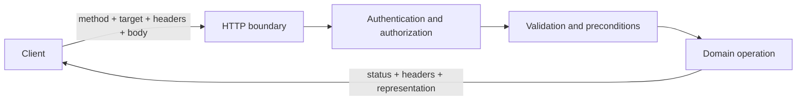

<TLDR>
  <TLDRCell label="what">
    An HTTP API is a durable contract clients can rely on: resource identifiers, methods, status codes, representations, and headers describe each operation together.
  </TLDRCell>
  <TLDRCell label="trap">
    Wrapping database tables in routes leaves out concurrency, retries, stable pagination, and error semantics; those gaps tend to appear in production.
  </TLDRCell>
  <TLDRCell label="fix">
    Specify observable behavior and failure cases before implementing handlers, then use contract tests for status codes, headers, bodies, and repeated requests.
  </TLDRCell>
</TLDR>

## What it is and why it exists

HTTP API design maps domain operations to HTTP messages that clients can understand consistently. The contract is more than a set of URLs. It covers method semantics, request and response representations, status codes, caching, concurrency preconditions, and error formats. Clients should depend on this observable behavior, not guess at database tables or internal call order.

A <Term id="resource">resource</Term> is a conceptual object identified by a URI, such as a product, order, or export job. A client exchanges a <Term id="representation">representation</Term> of that resource, such as a JSON document, rather than the object in server memory. One resource can have several representations, and a resource need not correspond one-to-one with a database row.

This contract lets clients and servers evolve independently. Mobile apps, web frontends, partner integrations, and servers often ship on different schedules. If behavior can only be inferred from implementation, a refactor can break a caller by accident. An explicit contract also lets gateways, caches, client libraries, and monitoring tools reuse semantics HTTP already defines.

You make these decisions at public APIs, internal service boundaries, webhooks, and backends for frontends. Even with one client, you must decide whether a timed-out operation can be retried, which of two writers wins, and whether a program can act on an error. Small scale postpones these failures; it does not remove them.

## How it works

### From domain capability to message

Start with the jobs a caller must perform and the invariants the domain must preserve, then choose resource boundaries. `/orders/{id}` identifies an order; creating one is usually `POST /orders`, while reading one is `GET /orders/{id}`. A payment need not be disguised as a field update. `POST /orders/{id}/payments` can model it because a payment has its own identity, state, and failure record.

A request passes through routing, authentication, authorization, input validation, and a domain operation before becoming an HTTP response. Any layer can reject it, but all layers still follow one error contract. A database exception is not API semantics. Map expected failures to stable status codes and problem types, and keep unknown exception details in internal logs.



The sequence is a review aid, not a mandatory middleware order for every framework. In particular, authorize before changing the resource, and evaluate preconditions such as `If-Match` in the same atomic boundary as the write. A race can otherwise occur after the check passes but before persistence.

### Methods, status codes, and headers

The method expresses intent; the path identifies the target. `GET` has read-only defined semantics. `PUT` creates or replaces the target resource with the supplied representation, `DELETE` requests removal of the target resource, and `POST` asks the target resource to process a representation according to its own semantics. `PATCH` describes a partial modification, while its patch media type further defines what the operation means.

<Term id="idempotency">Idempotency</Term> means that multiple identical requests have the same intended effect on the server as one request. It does not require identical responses or forbid incidental behavior such as logging. HTTP defines `PUT`, `DELETE`, and safe methods as idempotent. A `POST` is suitable for automatic retry after an unknown outcome only when the application contract supplies separate deduplication semantics.

A status code gives generic HTTP software the result category; the body supplies domain detail. Successful creation commonly returns `201 Created` with `Location`, while success with no body can return `204 No Content`. Invalid syntax or types can return `400 Bad Request`, semantic validation often uses `422 Unprocessable Content`, and a conflict with current state can use `409 Conflict`. Missing authentication and insufficient permission use `401` and `403` respectively, not a shared `200` envelope.

Headers are part of the contract too. `Content-Type` identifies the representation's media type, `Location` points to a created resource, `ETag` carries a representation validator, `Cache-Control` sets caching constraints, and `Retry-After` can say when to try again. Repeating these fields in JSON does not replace the standard headers because proxies and generic clients cannot infer custom field semantics.

### A reviewable operation contract

At minimum, each operation should answer these questions:

1. Who may perform which action on which resource, and does a missing resource response reveal its existence?
2. Which path parameters, query parameters, headers, and media types are accepted, and what ranges and defaults apply?
3. What is returned for success, validation failure, denied access, conflict, rate limiting, and internal failure?
4. Can a caller retry after a timeout, and does a write require an idempotency key or version precondition?
5. Is list ordering stable, and how does a next-page token relate to filters and a snapshot?

OpenAPI can record paths, parameters, schemas, and responses, but it cannot fill in these answers automatically. Cross-request invariants such as “balance cannot become negative” or “an idempotency key is unique within a tenant” still belong in prose and tests. The description and the real handler should both pass the same contract tests.

## Examples

### 1. Make one operation say everything

This first example models an HTTP boundary in plain JavaScript, without a framework. Focus on the response tuple: status, headers, representation, and the rules for an empty body.

<Depth level="quick">

```javascript run title="resource_contract.js"
const products = new Map([
  ["p-42", { id: "p-42", name: "Keyboard", stock: 8 }],
]);

function json(status, body, headers = {}) {
  return {
    status,
    headers: { "content-type": "application/json", ...headers },
    body,
  };
}

function handle({ method, path, body }) {
  if (method === "GET" && path === "/products/p-42") {
    return json(200, products.get("p-42"));
  }

  if (method === "POST" && path === "/orders") {
    const order = { id: "o-100", productId: body.productId, status: "pending" };
    return json(201, order, { location: `/orders/${order.id}` });
  }

  return json(
    404,
    { type: "about:blank", title: "Not Found", status: 404 },
    { "content-type": "application/problem+json" },
  );
}

const read = handle({ method: "GET", path: "/products/p-42" });
const created = handle({
  method: "POST",
  path: "/orders",
  body: { productId: "p-42" },
});

console.log("GET", read.status, read.body.name);
console.log("POST", created.status, created.headers.location, created.body.status);
```

```text
GET 200 Keyboard
POST 201 /orders/o-100 pending
```

</Depth>

The read and create operations do not share a vague `200` response. `201` tells the client that the server created a resource, `Location` gives its address, and the body carries its current representation. A real implementation must also validate the product, check stock, and persist the order, but those internal steps do not change what the external message means.

The `404` uses a minimal problem-details shape. A public service can also use a stable `type` URI to distinguish domain failures. Do not return stacks, SQL text, or internal class names. They are unstable and can disclose implementation details.

### 2. Return validation errors a client can process

RFC 9457 defines the <Term id="problem-details">Problem Details</Term> format. Its common members identify a problem's type, title, status, detail, and particular instance, and an API can add extension members. The `invalidParams` member below is an application extension, not a field required by the RFC.

```javascript run title="validation_problem.js"
function problem(status, type, title, detail, invalidParams = []) {
  return {
    status,
    headers: { "content-type": "application/problem+json" },
    body: { type, title, status, detail, invalidParams },
  };
}

function createProduct(input) {
  const invalidParams = [];

  if (typeof input.sku !== "string" || !/^[A-Z0-9-]{3,20}$/.test(input.sku)) {
    invalidParams.push({ name: "sku", reason: "Use 3-20 uppercase letters, digits, or hyphens." });
  }
  if (!Number.isInteger(input.stock) || input.stock < 0) {
    invalidParams.push({ name: "stock", reason: "Use a non-negative integer." });
  }

  if (invalidParams.length > 0) {
    return problem(
      422,
      "https://api.example.test/problems/validation",
      "Request validation failed",
      "One or more fields are invalid.",
      invalidParams,
    );
  }

  return {
    status: 201,
    headers: { "content-type": "application/json", location: `/products/${input.sku}` },
    body: input,
  };
}

const response = createProduct({ sku: "a", stock: -1 });
console.log(response.status, response.headers["content-type"]);
console.log(JSON.stringify(response.body, null, 2));
```

```text
422 application/problem+json
{
  "type": "https://api.example.test/problems/validation",
  "title": "Request validation failed",
  "status": 422,
  "detail": "One or more fields are invalid.",
  "invalidParams": [
    {
      "name": "sku",
      "reason": "Use 3-20 uppercase letters, digits, or hyphens."
    },
    {
      "name": "stock",
      "reason": "Use a non-negative integer."
    }
  ]
}
```

A client can handle the broad class through the status code, then select domain recovery logic by `type`. Keep `title` stable for one problem type and put request-specific explanation in `detail` or extension members. Do not make a client parse natural-language `detail` text to identify the error.

Validation failure is not the same as every business rejection. A well-formed order might return `409` because of inventory state, or `403` because the caller may not buy it. Define what the failure means first, then choose the closest status. Do not flatten every rejection into `400` for “consistency.”

### 3. Prevent lost updates with `ETag`

An <Term id="entity-tag">entity tag</Term> is an opaque validator for a selected representation, carried in the `ETag` response header. After reading a resource, a client sends that value in `If-Match` on a write. The service applies the change only if its current strong entity tag matches. If another writer has updated the resource, the stale request receives `412 Precondition Failed`.

```javascript run title="conditional_update.js"
let product = { id: "p-42", stock: 8, revision: 3 };

function etag(revision) {
  return `"product-${revision}"`;
}

function getProduct() {
  return {
    status: 200,
    headers: { etag: etag(product.revision) },
    body: { id: product.id, stock: product.stock },
  };
}

function updateStock(ifMatch, stock) {
  const currentTag = etag(product.revision);
  if (ifMatch !== currentTag) {
    return {
      status: 412,
      headers: { etag: currentTag },
      body: { type: "about:blank", title: "Precondition Failed", status: 412 },
    };
  }

  product = { ...product, stock, revision: product.revision + 1 };
  return {
    status: 200,
    headers: { etag: etag(product.revision) },
    body: { id: product.id, stock: product.stock },
  };
}

const firstRead = getProduct();
const accepted = updateStock(firstRead.headers.etag, 7);
const stale = updateStock(firstRead.headers.etag, 6);

console.log("GET", firstRead.status, firstRead.headers.etag, firstRead.body.stock);
console.log("PATCH", accepted.status, accepted.headers.etag, accepted.body.stock);
console.log("PATCH", stale.status, stale.headers.etag, stale.body.title);
```

```text
GET 200 "product-3" 8
PATCH 200 "product-4" 7
PATCH 412 "product-4" Precondition Failed
```

The example maps a revision to an entity tag, but clients must not parse that string. A real service must compare the revision and write in one transaction or atomic conditional update. Reading, comparing in the application process, and then issuing an unconditional database write leaves a race window. Return the new `ETag` on success so the client can continue editing.

Cache revalidation commonly uses `If-None-Match`: a match on `GET` or `HEAD` can produce `304 Not Modified`. It is not the same condition as `If-Match`, which protects a write from overwrite. Generated code often swaps the two. During review, first ask whether the request is saving a transfer or protecting a mutation.

### 4. Page with a stable cursor

A list needs a deterministic total order. Sorting only by `createdAt` leaves equal timestamps in an unstable order. Adding unique `id` as a tie-breaker lets a cursor say precisely “continue after this tuple.” Treat the token as opaque on the client.

```javascript run title="cursor_pagination.js"
const orders = [
  { id: "o-105", createdAt: "2026-09-04T10:02:00Z" },
  { id: "o-103", createdAt: "2026-09-04T10:01:00Z" },
  { id: "o-101", createdAt: "2026-09-04T10:00:00Z" },
  { id: "o-104", createdAt: "2026-09-04T10:01:00Z" },
  { id: "o-102", createdAt: "2026-09-04T10:00:00Z" },
];

function compareOrder(left, right) {
  return left.createdAt.localeCompare(right.createdAt) || left.id.localeCompare(right.id);
}

function encodeCursor(order) {
  return btoa(JSON.stringify([order.createdAt, order.id]));
}

function decodeCursor(cursor) {
  const [createdAt, id] = JSON.parse(atob(cursor));
  return { createdAt, id };
}

function listOrders(limit, cursor) {
  const rows = [...orders].sort(compareOrder);
  const after = cursor ? decodeCursor(cursor) : null;
  const found = after ? rows.findIndex((order) => compareOrder(order, after) > 0) : 0;
  const start = found < 0 ? rows.length : found;
  const window = rows.slice(start, start + limit + 1);
  const data = window.slice(0, limit);
  const hasNext = window.length > limit;

  return {
    data,
    nextCursor: hasNext ? encodeCursor(data.at(-1)) : null,
  };
}

const firstPage = listOrders(2, null);
const secondPage = listOrders(2, firstPage.nextCursor);
console.log(firstPage.data.map((order) => order.id).join(","), Boolean(firstPage.nextCursor));
console.log(secondPage.data.map((order) => order.id).join(","), Boolean(secondPage.nextCursor));
```

```text
o-101,o-102 true
o-103,o-104 true
```

This short example only encodes the token; it does not sign it or bind it to filters. A production service can sign cursors or store random server-side tokens so callers cannot tamper with expensive query boundaries. Decode failures, sort-version changes, and mismatched filters need an explicit client error.

Cursor pagination reduces the chance of duplicates or omissions caused by concurrent inserts, but it does not automatically provide snapshot consistency. If one traversal must observe one snapshot, bind the token to a database snapshot or watermark and specify expiration. When that guarantee is unavailable, document the consistency limit instead of implying that “cursors are always consistent.”

## Pitfalls

### Treating routes as remote function names

> [!PITFALL]
> `POST /createOrder`, `GET /getOrder`, and `POST /deleteOrder` repeat method intent in the path and can let a safe method trigger a mutation by accident.

**Fix:** start with resources that have identity and a lifecycle: `POST /orders`, `GET /orders/{id}`, and `DELETE /orders/{id}`. When a domain action does not fit a field change, create a result resource such as a payment or cancellation request. Resource orientation does not ban every verb; it gives the method, target, and result separate jobs.

### Wrapping every result in `200`

> [!PITFALL]
> `{ "success": false }` with `200 OK` makes caches, retry logic, metrics, and generated clients misclassify the result, while every caller must parse a custom envelope.

**Fix:** use HTTP status codes for generic outcomes and problem details for actionable domain information. Successful responses need not share one envelope. List metadata can sit beside `data`, but an error should not pretend to be a success. Test status, `Content-Type`, and required headers for each operation, not just JSON content.

### Confusing an idempotent method with a safe retry

> [!PITFALL]
> An idempotent method does not prove that a request arrived or require repeated responses to match; adding an `Idempotency-Key` header to `POST` also creates no deduplication by itself.

**Fix:** for an idempotent method, keep the request content identical across attempts and account for unknown outcomes. To retry a creation or payment `POST`, have the caller generate a stable key, then atomically store the key, request fingerprint, and final result within a defined scope. Reject the same key with different content. A random key without persistent uniqueness is decoration.

### Silently accepting last-writer-wins

> [!PITFALL]
> Two clients can read one representation and make separate edits. An unconditional `PATCH` lets the later commit overwrite the earlier one while both callers receive success.

**Fix:** return a strong `ETag` for resources that need conflict detection, and require `If-Match` on writes. Compare the version and update atomically in the persistence layer. Return `412` when it fails so the client can reread and choose how to merge. A timestamp comparison in the controller still leaves a race before the write.

### Spreading request bodies into models

> [!PITFALL]
> `model.update(request.body)` writes unknown caller-supplied fields too. Generated handlers often expose immutable properties such as `role`, `ownerId`, balances, or internal state.

**Fix:** define an allowlist for each operation, reject or explicitly ignore unknown fields, and perform resource-level authorization after parsing. An input schema proves shape, not permission to mutate that resource. Add negative tests for sensitive properties so mass assignment and state-machine bypasses cannot change them.

### Paginating without a stable order

> [!PITFALL]
> A list with `limit` and `offset` but no fixed order can reshuffle between calls. Ordering by a non-unique field alone can also duplicate or omit records at page boundaries.

**Fix:** define a total order ending in a unique tie-breaker, and encode direction, filters, and the boundary in an opaque cursor. Bound page size and sortable fields so callers cannot construct unbounded or expensive queries. If traversal is only eventually consistent, specify how inserts, deletes, and cursor expiration affect results.

<Depth level="deep">

## Evolving the contract safely

### Start with observable change

API compatibility depends on what a client can observe, not on how much server code changed. Renaming a field, changing its type, making an optional field required, narrowing an accepted range, or changing default sort order can break callers. Moving the implementation to another database can be fully compatible when messages and timing promises stay the same.

Adding an optional response field is usually safer than removing one, but it is not universally safe. Strict deserializers may reject unknown members, and a new enum member can break an exhaustive client branch. Tell clients to ignore unknown object members and prepare a fallback for open enums. Even then, changing the meaning of money, time units, or authorization is a semantic break that an unchanged schema cannot hide.

Prefer compatible extensions and use observed usage to decide when an old field can be removed. A genuinely incompatible change needs a new contract boundary and migration window, but a new version does not justify cloning the whole service. Keep conversion at the boundary and share the core domain model. A second version still needs idempotency, authorization, and concurrency tests.

### Separate failure from unknown outcome

When a client receives a `4xx` or explicit domain rejection, it usually knows the requested operation did not succeed. A connection that closes before the response is different: the server might not have received the request, or it might have committed and lost only the response. Labeling both cases `failed` encourages a client to retry under a new operation identity and duplicate a side effect.

Safe creation retry needs a persistence protocol. The caller reuses one idempotency key for every attempt at one logical operation. Within a scope such as authenticated principal and endpoint, the service enforces uniqueness over “key + request fingerprint,” and executes the first operation in the same transaction boundary as recording its result. A duplicate returns the stored result; a reused key with a different fingerprint returns a conflict.

The result record also needs a retention period, an in-progress state, and recovery rules. If two identical requests arrive together, the second can wait, return an in-progress response, or read the first committed result, but it must not perform the side effect again. Once the record expires, the service cannot promise deduplication forever. Put the retention period in the public contract or client retry window.

### Cross-check description and implementation

OpenAPI 3.2.0 is a language-independent description format for HTTP APIs. It records parameter locations, media types, schemas, security schemes, and responses by status code, and it can drive docs, clients, and basic contract tests. It does not prove transaction boundaries, resource-level authorization, pagination snapshots, or idempotency storage. Cover those behaviors with scenario tests.

Generate tests from each operation's failure matrix. Cover the applicable branches for normal success, missing authentication, denied permission, invalid input, missing resource, version conflict, and rate limiting. Add time-dependent scenarios: a repeated request after its response is lost, two writers with one stale `ETag`, and an insertion with the same sort value between pages. Assert the complete message at the HTTP boundary instead of calling a controller and checking only its returned object.

Specification-first and code-first workflows can both work; drift is the problem. Continuous integration should parse the description, validate examples against schemas, and run the same contract cases against the implementation. Comparing observable responses before a release catches accidental field removal, status changes, and default changes. When a change is deliberate, review the diff as a migration decision.

</Depth>

<Checkpoint id="backend/api-design" />

## Further reading

- [RFC 9110: HTTP semantics](https://www.rfc-editor.org/rfc/rfc9110.html)
- [RFC 9111: HTTP caching](https://www.rfc-editor.org/rfc/rfc9111.html)
- [RFC 9457: Problem Details for HTTP APIs](https://www.rfc-editor.org/rfc/rfc9457.html)
- [OpenAPI Specification 3.2.0](https://spec.openapis.org/oas/v3.2.0.html)
