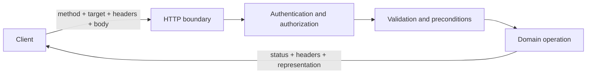

<TLDR>
  <TLDRCell label="what">
    HTTP API是客户端可以依赖的长期契约：资源标识、方法、状态码、表示格式和响应头共同表达一次操作。
  </TLDRCell>
  <TLDRCell label="trap">
    只把数据库表套上路由，会漏掉并发、重试、分页稳定性和错误语义；这些缺口通常到生产环境才暴露。
  </TLDRCell>
  <TLDRCell label="fix">
    先写可观察的契约和失败条件，再实现处理器；用契约测试验证状态码、响应头、响应体和重复请求。
  </TLDRCell>
</TLDR>

## 是什么，为什么存在

HTTP API设计，是把领域操作映射为客户端能稳定理解的HTTP消息。契约不只是一组URL，也包括每个方法的语义、请求与响应表示、状态码、缓存规则、并发前置条件和错误格式。客户端只应依赖这些可观察行为，不应猜测服务内部的表结构或调用顺序。

<Term id="resource">资源（resource）</Term>是由URI标识的概念对象，例如商品、订单或一次导出任务。客户端交换的是资源的<Term id="representation">表示（representation）</Term>，例如JSON文档，而不是服务器内存中的对象本身。同一资源可以有多个表示，资源也可以在没有一一对应数据库行的情况下存在。

这个契约解决的是独立演进问题。移动端、网页、合作方集成和服务端通常按不同节奏发布；如果行为只能从实现中推断，任何重构都可能意外破坏调用方。明确的契约让双方能分别开发，并让网关、缓存、客户端库和监控工具复用HTTP已有的语义。

你会在公开API、内部服务、Webhook和后端供前端（BFF）边界上遇到这些决策。即使只有一个客户端，也要定义超时后能否重试、两个写入者冲突时谁获胜，以及错误能否由程序处理。规模不会消除这些问题，只会影响你多早看见它们。

## 工作原理

### 从领域能力到消息

先列出调用方要完成的任务和需要维持的不变量，再决定资源边界。`/orders/{id}`表示订单；创建订单通常是`POST /orders`，读取订单是`GET /orders/{id}`。支付不一定要伪装成字段更新，可以建模为`POST /orders/{id}/payments`，因为支付本身有标识、状态和失败记录。

一次请求经过路由、认证、授权、输入验证和领域操作，最终形成一个HTTP响应。每层都可能拒绝请求，但它们仍要遵守同一错误契约。数据库异常不是API语义；服务应把预期失败映射为稳定的状态码和问题类型，同时把未知异常留给内部日志。



图中的顺序是一条审查线索，不是所有框架都必须采用的中间件顺序。尤其要让授权发生在资源变更之前，让`If-Match`等前置条件与写入在同一个原子边界内判断。否则检查通过后到写入前的空隙仍可能发生竞争。

### 方法、状态码和响应头

方法表达意图，路径标识目标。`GET`的定义语义是只读的；`PUT`表示用所给表示创建或替换目标资源；`DELETE`请求移除目标资源；`POST`让目标资源按自身语义处理表示。`PATCH`描述部分修改，但具体补丁媒体类型还决定操作含义。

<Term id="idempotency">幂等性（idempotency）</Term>指多次发送相同请求时，服务端的预期效果与发送一次相同。它不要求每次响应完全相同，也不禁止日志等附带行为。HTTP定义`PUT`、`DELETE`和安全方法为幂等；`POST`只有在应用契约另行提供去重语义时，才适合在结果未知后自动重试。

状态码给通用HTTP软件提供结果类别，响应体再提供领域细节。成功创建资源通常返回`201 Created`和`Location`；成功但没有响应体可返回`204 No Content`；语法或类型无效可返回`400 Bad Request`，语义验证失败常用`422 Unprocessable Content`，当前状态冲突可返回`409 Conflict`。认证缺失与权限不足分别使用`401`和`403`，不要都折叠为`200`。

响应头也是契约。`Content-Type`说明表示的媒体类型，`Location`指向新建资源，`ETag`提供表示验证器，`Cache-Control`指定缓存约束，`Retry-After`可以说明何时重试。把这些信息重复塞进JSON并不能代替标准响应头，因为代理和通用客户端看不到自定义字段的语义。

### 一份可审查的操作契约

每个操作至少要回答以下问题：

1. 谁可以对哪个资源执行什么操作，资源不存在时是否允许泄露其存在性？
2. 请求接受哪些路径参数、查询参数、响应头和媒体类型，各自的范围与默认值是什么？
3. 成功、验证失败、权限失败、冲突、限流和内部失败分别返回什么？
4. 调用方超时后能否安全重试，写入是否需要幂等键或版本前置条件？
5. 列表的排序是否稳定，下一页令牌如何与过滤条件和快照关联？

OpenAPI可以记录路径、参数、模式和响应，但它不能自动补全这些答案。像“余额不能为负”“幂等键在同一租户内唯一”这样的跨请求不变量，仍要写进说明和测试。规范文件与实际处理器都必须接受同一组契约测试。

## 示例

### 1. 让一个操作说完整的话

第一个示例用普通JavaScript表示HTTP边界，不依赖框架。重点是响应四元组：状态码、响应头、表示和空响应体规则。

<Depth level="quick">

```javascript run title="resource_contract.js"
const products = new Map([
  ["p-42", { id: "p-42", name: "Keyboard", stock: 8 }],
]);

function json(status, body, headers = {}) {
  return {
    status,
    headers: { "content-type": "application/json", ...headers },
    body,
  };
}

function handle({ method, path, body }) {
  if (method === "GET" && path === "/products/p-42") {
    return json(200, products.get("p-42"));
  }

  if (method === "POST" && path === "/orders") {
    const order = { id: "o-100", productId: body.productId, status: "pending" };
    return json(201, order, { location: `/orders/${order.id}` });
  }

  return json(
    404,
    { type: "about:blank", title: "Not Found", status: 404 },
    { "content-type": "application/problem+json" },
  );
}

const read = handle({ method: "GET", path: "/products/p-42" });
const created = handle({
  method: "POST",
  path: "/orders",
  body: { productId: "p-42" },
});

console.log("GET", read.status, read.body.name);
console.log("POST", created.status, created.headers.location, created.body.status);
```

```text
GET 200 Keyboard
POST 201 /orders/o-100 pending
```

</Depth>

读取和创建没有共用一个含糊的`200`响应。`201`告诉客户端服务器创建了资源，`Location`给出该资源的地址，响应体提供当前表示。真实实现还要验证商品、检查库存并持久化订单，但这些内部步骤不应改变外部消息的含义。

`404`使用最小的问题详情结构。公开服务还可以使用稳定的`type` URI区分领域错误。不要返回堆栈、SQL文本或内部类名；它们既不稳定，也可能泄露实现细节。

### 2. 返回可处理的验证错误

RFC 9457定义了<Term id="problem-details">问题详情（Problem Details）</Term>格式。通用成员说明问题类型、标题、状态、细节和具体实例，API还可以添加扩展成员。下面的`invalidParams`是应用扩展，不是RFC强制字段。

```javascript run title="validation_problem.js"
function problem(status, type, title, detail, invalidParams = []) {
  return {
    status,
    headers: { "content-type": "application/problem+json" },
    body: { type, title, status, detail, invalidParams },
  };
}

function createProduct(input) {
  const invalidParams = [];

  if (typeof input.sku !== "string" || !/^[A-Z0-9-]{3,20}$/.test(input.sku)) {
    invalidParams.push({ name: "sku", reason: "Use 3-20 uppercase letters, digits, or hyphens." });
  }
  if (!Number.isInteger(input.stock) || input.stock < 0) {
    invalidParams.push({ name: "stock", reason: "Use a non-negative integer." });
  }

  if (invalidParams.length > 0) {
    return problem(
      422,
      "https://api.example.test/problems/validation",
      "Request validation failed",
      "One or more fields are invalid.",
      invalidParams,
    );
  }

  return {
    status: 201,
    headers: { "content-type": "application/json", location: `/products/${input.sku}` },
    body: input,
  };
}

const response = createProduct({ sku: "a", stock: -1 });
console.log(response.status, response.headers["content-type"]);
console.log(JSON.stringify(response.body, null, 2));
```

```text
422 application/problem+json
{
  "type": "https://api.example.test/problems/validation",
  "title": "Request validation failed",
  "status": 422,
  "detail": "One or more fields are invalid.",
  "invalidParams": [
    {
      "name": "sku",
      "reason": "Use 3-20 uppercase letters, digits, or hyphens."
    },
    {
      "name": "stock",
      "reason": "Use a non-negative integer."
    }
  ]
}
```

客户端可以先按状态码处理大类，再按`type`选择领域恢复逻辑。`title`应对同一种问题保持稳定，面向本次请求的说明放在`detail`或扩展字段中。不要让客户端解析自然语言`detail`来识别错误。

验证失败不等于所有业务拒绝。格式正确的订单可能因为库存状态返回`409`，也可能因调用者无权购买而返回`403`。先定义失败的业务含义，再选择最接近的状态码；不要为了“统一”而把所有失败都改成`400`。

### 3. 用`ETag`阻止丢失更新

<Term id="entity-tag">实体标签（entity tag）</Term>是特定表示的不透明验证器，响应头写作`ETag`。客户端读取资源后，把该值放进写请求的`If-Match`；服务只有在当前强实体标签匹配时才执行修改。其他写入者已经更新资源时，旧请求得到`412 Precondition Failed`。

```javascript run title="conditional_update.js"
let product = { id: "p-42", stock: 8, revision: 3 };

function etag(revision) {
  return `"product-${revision}"`;
}

function getProduct() {
  return {
    status: 200,
    headers: { etag: etag(product.revision) },
    body: { id: product.id, stock: product.stock },
  };
}

function updateStock(ifMatch, stock) {
  const currentTag = etag(product.revision);
  if (ifMatch !== currentTag) {
    return {
      status: 412,
      headers: { etag: currentTag },
      body: { type: "about:blank", title: "Precondition Failed", status: 412 },
    };
  }

  product = { ...product, stock, revision: product.revision + 1 };
  return {
    status: 200,
    headers: { etag: etag(product.revision) },
    body: { id: product.id, stock: product.stock },
  };
}

const firstRead = getProduct();
const accepted = updateStock(firstRead.headers.etag, 7);
const stale = updateStock(firstRead.headers.etag, 6);

console.log("GET", firstRead.status, firstRead.headers.etag, firstRead.body.stock);
console.log("PATCH", accepted.status, accepted.headers.etag, accepted.body.stock);
console.log("PATCH", stale.status, stale.headers.etag, stale.body.title);
```

```text
GET 200 "product-3" 8
PATCH 200 "product-4" 7
PATCH 412 "product-4" Precondition Failed
```

示例把修订号映射成实体标签，但客户端不应解析这个字符串。真实服务必须在一次事务或原子条件更新中比较修订号并写入；先读、在应用进程中比较、再无条件写数据库，仍有竞态窗口。成功响应返回新`ETag`，便于客户端继续编辑。

缓存再验证常用`If-None-Match`：匹配时，`GET`或`HEAD`可以得到`304 Not Modified`。它与防止覆盖的`If-Match`不是同一个条件。生成代码经常把两者混用，审查时要先问这次请求是在节省传输，还是在保护写入。

### 4. 用稳定游标翻页

列表必须有确定的全序。只按`createdAt`排序时，相同时间戳的记录顺序不稳定；加上唯一`id`作为决胜字段后，游标可以准确表达“从这个二元组之后继续”。令牌对客户端应视为不透明值。

```javascript run title="cursor_pagination.js"
const orders = [
  { id: "o-105", createdAt: "2026-09-04T10:02:00Z" },
  { id: "o-103", createdAt: "2026-09-04T10:01:00Z" },
  { id: "o-101", createdAt: "2026-09-04T10:00:00Z" },
  { id: "o-104", createdAt: "2026-09-04T10:01:00Z" },
  { id: "o-102", createdAt: "2026-09-04T10:00:00Z" },
];

function compareOrder(left, right) {
  return left.createdAt.localeCompare(right.createdAt) || left.id.localeCompare(right.id);
}

function encodeCursor(order) {
  return btoa(JSON.stringify([order.createdAt, order.id]));
}

function decodeCursor(cursor) {
  const [createdAt, id] = JSON.parse(atob(cursor));
  return { createdAt, id };
}

function listOrders(limit, cursor) {
  const rows = [...orders].sort(compareOrder);
  const after = cursor ? decodeCursor(cursor) : null;
  const found = after ? rows.findIndex((order) => compareOrder(order, after) > 0) : 0;
  const start = found < 0 ? rows.length : found;
  const window = rows.slice(start, start + limit + 1);
  const data = window.slice(0, limit);
  const hasNext = window.length > limit;

  return {
    data,
    nextCursor: hasNext ? encodeCursor(data.at(-1)) : null,
  };
}

const firstPage = listOrders(2, null);
const secondPage = listOrders(2, firstPage.nextCursor);
console.log(firstPage.data.map((order) => order.id).join(","), Boolean(firstPage.nextCursor));
console.log(secondPage.data.map((order) => order.id).join(","), Boolean(secondPage.nextCursor));
```

```text
o-101,o-102 true
o-103,o-104 true
```

这个短例只编码令牌，没有签名，也没有绑定过滤条件。生产实现可以对游标签名或使用服务端保存的随机令牌，防止调用者篡改昂贵的查询边界。解码失败、排序版本变化和过滤条件不匹配都要返回明确的客户端错误。

游标分页降低了并发插入导致重复或跳项的机会，却不会自动提供快照一致性。需求若规定整个遍历必须看到同一快照，令牌还要绑定数据库快照或水位线，并定义过期行为。做不到时应把一致性限制写进契约，而不是暗示“游标永远一致”。

## 陷阱

### 把路由当成远程函数名

> [!PITFALL]
> `POST /createOrder`、`GET /getOrder`和`POST /deleteOrder`把HTTP方法的语义重复进路径，还会让安全方法意外触发修改。

**修复：** 先找有生命周期和身份的资源，使用`POST /orders`、`GET /orders/{id}`和`DELETE /orders/{id}`。领域动作无法自然表示为字段变化时，可以创建动作结果资源，例如支付或取消请求；资源导向不是禁用所有动词，而是让方法、目标和结果各自承担清楚的职责。

### 用`200`包装所有结果

> [!PITFALL]
> `{ "success": false }`配合`200 OK`会让缓存、重试器、指标和生成的客户端误判结果，调用方还得为每个响应解析自定义信封。

**修复：** 用HTTP状态码表达通用结果，再用问题详情表达可处理的领域信息。成功响应不必都套同一个信封；列表元数据可以与`data`并列，但错误不应伪装成成功。对每个操作测试状态码、`Content-Type`和必需响应头，而不只比较JSON。

### 把幂等方法等同于安全重试

> [!PITFALL]
> 方法幂等不代表请求一定到达，也不代表重复响应相同；`POST`带了`Idempotency-Key`响应头，也不会自动获得去重能力。

**修复：** 对幂等方法，确认请求体在重试间完全相同，并处理结果未知的状态。需要重试创建或付款类`POST`时，由调用方生成稳定键，服务端在明确作用域内把键、请求指纹和最终结果原子保存；相同键配不同请求应被拒绝。键只有随机值却没有持久化唯一约束，只是装饰。

### 让后到的写入静默覆盖

> [!PITFALL]
> 两个客户端读取同一表示后各自修改，无条件`PATCH`会让较晚提交者覆盖较早提交者，而且双方都得到成功。

**修复：** 对需要检测冲突的资源返回强`ETag`，并要求写请求携带`If-Match`。在持久化层原子比较版本并修改，失败时返回`412`，让客户端重新读取并决定如何合并。不要只在控制器里比较时间戳，因为比较与写入之间仍可能发生变化。

### 直接展开请求体写入模型

> [!PITFALL]
> `model.update(request.body)`会把调用方提供的未知字段一并写入，生成代码尤其容易暴露`role`、`ownerId`、余额或内部状态等不可修改属性。

**修复：** 为每个操作定义允许字段，拒绝或明确忽略未知字段，并在解析后执行资源级授权。输入模式只解决形状问题，不会证明调用者有权修改该资源。对敏感字段写负向测试，确认它们既不能被批量赋值，也不会绕过领域状态机。

### 分页没有稳定顺序

> [!PITFALL]
> 只有`limit`和`offset`、没有固定排序的列表会在两次请求间任意换序；只按非唯一字段排序，也可能在页边界重复或漏掉记录。

**修复：** 定义由唯一决胜字段结束的全序，并把方向、过滤条件和边界编码进不透明游标。限制页大小和可排序字段，避免调用者构造无界或昂贵查询。如果只能提供最终一致的遍历，就明确说明新记录、删除和游标过期会怎样影响结果。

<Depth level="deep">

## 契约如何安全演进

### 先判断变化是否可观察

API兼容性取决于客户端能观察到什么，而不取决于服务端改了多少代码。重命名字段、改变字段类型、把可选字段变为必需、收紧允许范围或改变默认排序，都会破坏某些调用方。把实现从一种数据库迁到另一种数据库，如果消息和时序承诺不变，反而可以完全兼容。

新增可选响应字段通常比删除字段安全，但不是绝对安全。严格反序列化器可能拒绝未知字段，枚举新增成员也可能击穿客户端的穷尽分支。契约应要求客户端忽略未知对象成员并为开放枚举准备兜底；即便如此，改变金额含义、时间单位或权限规则仍是语义破坏，不能靠“模式没变”掩盖。

优先做兼容扩展，并用使用数据确认旧字段能否移除。真正不兼容的变化需要新的契约边界和迁移窗口，但版本号不是复制整套服务的理由。把转换集中在边界层，核心领域模型可以继续共享；另一个版本也不能免除对幂等性、授权和并发的测试。

### 区分失败与结果未知

客户端收到`4xx`或明确的领域拒绝时，通常知道操作没有按请求成功。连接在响应前断开则不同：服务可能没收到请求，也可能已经提交，只是响应丢失。把两种情况都标成`failed`，会诱使客户端用新操作标识重试并制造重复副作用。

安全的创建重试需要一条持久化协议。调用方在一次逻辑操作的所有尝试中复用幂等键；服务端在认证主体和端点等作用域内，对“键 + 请求指纹”建立唯一约束；第一次执行与结果记录处于同一事务边界。重复请求返回已记录结果，相同键却不同指纹返回冲突。

结果记录还要定义保留期、并发中的状态和失败恢复。两次相同请求同时到达时，第二次可以等待、返回进行中状态，或读取第一项提交的结果，但不能再次执行副作用。记录过期后，服务不能继续承诺永久去重；保留期必须进入公开契约或客户端重试窗口。

### 让规范与实现互相校验

OpenAPI 3.2.0是描述HTTP API的语言无关规范。它适合记录参数位置、媒体类型、模式、安全方案和每个状态码的响应，也能驱动文档、客户端和基础契约测试。它不会证明事务边界、资源级授权、分页快照或幂等记录正确，这些行为要用场景测试补充。

从每个操作的失败矩阵生成测试：最少覆盖正常成功、缺少认证、权限不足、输入无效、资源不存在、版本冲突和限流中适用的分支。再加入时间相关场景，例如响应丢失后的重复请求、两个写入者使用同一旧`ETag`、翻页之间插入同排序值记录。测试应在HTTP边界断言完整消息，而不是直接调用控制器后只看返回对象。

规范优先与代码优先都可以工作，漂移才是问题。持续集成应验证规范可解析、示例符合模式，并让实现跑同一组契约用例。上线前比较旧版和新版的可观察响应，能发现意外删除字段、状态码变化和默认值变化；需要故意改变时，把差异当作迁移决策审查。

</Depth>

<Checkpoint id="backend/api-design" />

## 延伸阅读

- [RFC 9110：HTTP语义](https://www.rfc-editor.org/rfc/rfc9110.html)
- [RFC 9111：HTTP缓存](https://www.rfc-editor.org/rfc/rfc9111.html)
- [RFC 9457：HTTP API问题详情](https://www.rfc-editor.org/rfc/rfc9457.html)
- [OpenAPI规范3.2.0](https://spec.openapis.org/oas/v3.2.0.html)
