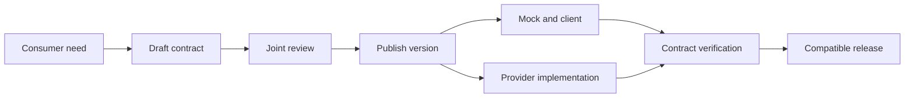

<TLDR>
  <TLDRCell label="what">
    API-first means designing and reviewing an interface contract before implementation work depends on it. The contract is a versioned deliverable shared by the implementation, mocks, clients, and tests.
  </TLDRCell>
  <TLDRCell label="trap">
    Writing an OpenAPI file does not make a process API-first. If the implementation can drift or behavioral rules exist only in code, the specification is still stale documentation.
  </TLDRCell>
  <TLDRCell label="fix">
    Check the specification, breaking changes, and real responses in CI. Add scenario tests for authorization, idempotency, and state transitions that schemas cannot express.
  </TLDRCell>
</TLDR>

## What it is and why it exists

API-first treats the interface as a design decision the team makes up front, not a manual produced after the service works. The team defines observable requests and responses, then consumers and providers review them together. The approved <Term id="api-contract">API contract</Term> goes into version control, and later code has to satisfy it.

That contract is more than a set of JSON fields. For an HTTP API, it covers at least methods, paths, parameters, media types, status codes, response headers, authentication, and message schemas. Retry semantics, authorization rules, state transitions, and concurrency conditions belong to the contract too, although some need prose or scenario tests.

This way of working solves a coordination problem. If a client must wait for a deployed service before observing real responses, naming, error format, and required-field mistakes surface during integration. Once the contract is stable, clients can develop against a mock while the provider is built independently, with both sides working against one verifiable boundary.

You encounter API-first work in shared services, public APIs, mobile clients, and systems whose teams release on different schedules. A small internal endpoint with one owner can still start with a contract, but the benefit depends on having an independent consumer. When there is no clear consumer, a short design review is often more useful than a large generation pipeline.

The first contract does not need to predict every future operation. It needs enough detail to settle the current consumer interaction, including failures the caller must handle. Keeping that boundary small makes review easier and leaves fewer speculative fields to support later.

API-first does not require generated server code, and it does not require OpenAPI. GraphQL SDL, Protocol Buffers, and other interface descriptions can serve as the central contract. This topic uses OpenAPI because it makes HTTP paths, operations, and message shapes concrete.

Publishing the contract changes how later edits are handled. A field rename is no longer a local refactor: it is a proposed interface change that must be compared with an earlier promise. That review boundary is the practical difference between API-first and documentation written ahead of code.

OpenAPI is not the whole source of truth either. A response schema cannot prove that a caller may access the <Term id="resource">resource</Term> named by an identifier, that a database transaction is atomic, or that an idempotency key creates only one business effect. A sound process distinguishes the machine-readable description, supplementary semantics, and executable tests.

## How it works

An API-first workflow starts with a consumer task, not a controller class. Write a few concrete interactions first: who sends the request, what they want to change, what success makes observable, and how it can fail. Only after those examples are clear should you generalize them into reusable schemas.



Publishing in this flow is not copying a specification to a documentation site. It gives the contract a traceable version that builds can fetch consistently. Mocks, clients, and server scaffolding may be generated or handwritten; what matters is that they accept the same contract checks.

### One small but complete operation

The OpenAPI 3.2 document below defines one operation that creates an order. It makes the required request fields, success status, `Location` response header, and one error representation explicit. Example values give mocks and documentation a concrete interaction, but they do not replace schema constraints.

```yaml title="openapi.yaml"
openapi: 3.2.0
info: { title: Order API, version: 1.0.0 }
paths:
  /orders:
    post:
      operationId: createOrder
      requestBody:
        required: true
        content:
          application/json:
            schema:
              type: object
              additionalProperties: false
              required: [sku, quantity]
              properties:
                sku: { type: string, minLength: 1 }
                quantity: { type: integer, minimum: 1 }
            example: { sku: 'desk-42', quantity: 2 }
      responses:
        '201':
          description: Order created
          headers:
            Location:
              required: true
              schema: { type: string, format: uri-reference }
          content:
            application/json:
              schema: { type: object, required: [id, sku, quantity] }
              example: { id: 'ord-1001', sku: 'desk-42', quantity: 2 }
        '400':
          description: Invalid request
          content:
            application/problem+json:
              schema: { type: object, required: [type, title, status] }
```

The path and method identify the operation; `requestBody` and `responses` describe its message boundary. `Order` is a <Term id="representation">representation</Term> of resource state, not a promise to expose a database row field for field. The provider can change storage as long as the observable exchange still satisfies the contract.

### The contract becomes a control point

After the contract is committed, CI first parses and validates the document itself. A second layer compares the new and previous versions to find potentially breaking changes, such as removed operations, narrower inputs, or deleted response fields. A third layer sends requests to a running provider and checks its status codes, headers, and bodies against the published contract.

These layers answer different questions. Specification validation says only that the document is structurally valid. A diff can identify only the changes covered by its rules, while provider verification covers only interactions that run. Even together they do not prove business correctness, so important state transitions still need domain tests.

| Check | Catches | Does not prove |
| --- | --- | --- |
| Description validation | Invalid structure and references | Implementation conformance |
| Compatibility diff | Known structural break patterns | Consumer runtime behavior |
| Provider verification | Observed HTTP mismatches | Unexecuted domain rules |

Consumers need a voice in contract review. A provider-authored schema can be syntactically perfect but omit the stable error code a caller needs, or expose an internal table shape as a public model. Review should work back from interaction examples to the consumer task and record constraints that cannot yet be automated.

### Review one proposed change

A useful change review follows the promise outward from the edited line. For a field change, naming the affected operation and schema is only the beginning; reviewers also need to know who produces that message, who reads it, and what deployed versions remain active.

1. Show the old and proposed interaction with concrete request and response examples.
2. Identify whether the edited message is a request or response and name its producer.
3. Run the structural compatibility rule and explain any exception rather than suppressing it silently.
4. Exercise at least one affected consumer against the proposed mock or provider.
5. Record rollout order, fallback, and the point at which the old promise can be removed.

The output can be a short pull-request record rather than a separate design document. What matters is that later reviewers can distinguish an accepted migration from accidental drift. A bare approval on a generated diff preserves neither the assumption nor the evidence.

### Changes use the same loop

When an interface changes, edit the contract and let checks fail before updating the mock, consumer, and provider. Adding an optional field is usually safer than deleting one, but compatibility always depends on how each side reads and validates messages. An old client that rejects unknown fields can still break on a theoretically extensible response.

A contract version and a URL version are different things. Every compatible edit should produce a traceable contract revision, but it need not change `/v1` to `/v2`. A migration plan or a new public interface version is needed only when the existing promises cannot accommodate the change.

## Examples

The three examples continue with the create-order operation. Each file embeds the small contract fragment it needs so that it runs by itself. These teaching checks illustrate the control flow; they are not substitutes for complete OpenAPI and JSON Schema implementations.

### Produce an operation inventory

The first program reads a reduced OpenAPI object and lists the operation ID, required input fields, and documented responses. A team can use a similar index for naming checks or pass the operation to later generation steps.

<Depth level="quick">

```javascript run title="contract-summary.js"
const document = {
  openapi: "3.2.0",
  paths: {
    "/orders": {
      post: {
        operationId: "createOrder",
        requestBody: {
          content: {
            "application/json": {
              schema: { required: ["sku", "quantity"] },
            },
          },
        },
        responses: { "201": {}, "400": {} },
      },
    },
  },
};

for (const [path, pathItem] of Object.entries(document.paths)) {
  for (const [method, operation] of Object.entries(pathItem)) {
    const schema = operation.requestBody.content["application/json"].schema;
    const responses = Object.keys(operation.responses).join(", ");
    console.log(`${operation.operationId}: ${method.toUpperCase()} ${path}`);
    console.log(`required: ${schema.required.join(", ")}`);
    console.log(`responses: ${responses}`);
  }
}
```

```text
createOrder: POST /orders
required: sku, quantity
responses: 201, 400
```

</Depth>

The output comes from the contract, not a routing implementation. A stable operation ID gives a generator a name for a client method; changes to the method, path, or response set change the inventory too. A production tool would also resolve references and validate more OpenAPI rules.

### Serve a deterministic mock from examples

The second program puts the published request constraint and response examples into a mock. A valid request gets the contracted `201` shape, and a request missing a required field gets the declared `400` shape. Fixed examples keep consumer tests repeatable instead of generating random data on every run.

```javascript run title="contract-mock.js"
const operation = {
  required: ["sku", "quantity"],
  responses: {
    201: {
      headers: { Location: "/orders/ord-1001" },
      body: { id: "ord-1001", sku: "desk-42", quantity: 2 },
    },
    400: {
      headers: { "Content-Type": "application/problem+json" },
      body: { type: "about:blank", title: "Invalid request", status: 400 },
    },
  },
};

function mockCreateOrder(requestBody) {
  const missing = operation.required.filter((name) => !(name in requestBody));
  if (missing.length > 0) return operation.responses[400];

  const response = structuredClone(operation.responses[201]);
  response.body.sku = requestBody.sku;
  response.body.quantity = requestBody.quantity;
  return response;
}

for (const request of [
  { sku: "desk-42", quantity: 2 },
  { sku: "desk-42" },
]) {
  const response = mockCreateOrder(request);
  console.log(response.body.status ?? 201, JSON.stringify(response.body));
}
```

```text
201 {"id":"ord-1001","sku":"desk-42","quantity":2}
400 {"type":"about:blank","title":"Invalid request","status":400}
```

This mock is deliberately small: it checks only field presence, not integer type, minimum value, or unknown fields. Consumers can use it to build the success path and error parsing, but it cannot show that the real provider validates input correctly. A mock shows that the consumer understands the contract; it does not show that the provider meets it.

### Check real responses against the contract

The third program shows the core of provider verification. The checker rejects undocumented statuses and requires a `201` response to contain `Location` and three body fields. The first generated handler response fails; the second response passes.

```javascript run title="verify-provider.js"
const responseContract = {
  201: {
    requiredHeaders: ["Location"],
    requiredBody: ["id", "sku", "quantity"],
  },
  400: {
    requiredHeaders: ["Content-Type"],
    requiredBody: ["type", "title", "status"],
  },
};

function verifyResponse(response) {
  const expected = responseContract[response.status];
  if (!expected) return [`status ${response.status} is not documented`];

  const errors = [];
  for (const name of expected.requiredHeaders) {
    if (!(name in response.headers)) errors.push(`missing header: ${name}`);
  }
  for (const name of expected.requiredBody) {
    if (!(name in response.body)) errors.push(`missing body field: ${name}`);
  }
  return errors;
}

const generated = {
  status: 200,
  headers: {},
  body: { id: "ord-1001", sku: "desk-42", quantity: 2 },
};
const conforming = {
  status: 201,
  headers: { Location: "/orders/ord-1001" },
  body: { id: "ord-1001", sku: "desk-42", quantity: 2 },
};

console.log("generated:", verifyResponse(generated).join("; "));
console.log("conforming:", verifyResponse(conforming).join("; ") || "OK");
```

```text
generated: status 200 is not documented
conforming: OK
```

Full provider verification also checks media types, schema keywords, references, and every declared interaction. More importantly, it calls the real HTTP boundary instead of testing the object returned by a controller. Proxies, middleware, and serialization can all change what clients observe in production.

## Pitfalls

> [!PITFALL]
> The team writes OpenAPI first but lets routes and responses merge without contract checks. Within weeks, the specification describes the plan while production runs a different interface.

**Fix:** Make specification parsing, compatibility diffing, and provider response verification required checks. Tie each deployable artifact to an exact contract revision, and report the operation and mismatched field instead of merely saying that documentation is stale.

> [!PITFALL]
> Generated code is treated as the design result. A generator faithfully amplifies vague names, permissive schemas, and missing error responses, while regeneration may overwrite hand edits.

**Fix:** Review consumer tasks and observable behavior before generation, and treat generated directories as replaceable artifacts. Keep domain logic behind a stable handwritten boundary. Regenerate into a clean directory in CI and fail when the repository has drifted.

> [!PITFALL]
> The mock always returns the example success response. The client never implements authentication failures, validation errors, empty results, or unknown status handling until it reaches the real provider.

**Fix:** Give each operation a small set of named scenarios that cover the main success and the failures callers must handle. Scenarios should be deterministic and selectable. Random fields belong in property tests, not as a replacement for repeatable integration fixtures.

> [!PITFALL]
> Verification checks only the JSON response body and ignores status, `Content-Type`, `Location`, caching fields, or authentication challenges. Clients depend on the whole HTTP exchange, so an object schema alone misses protocol defects.

**Fix:** Capture the status line, relevant headers, and byte-level message at the HTTP boundary, then validate them against the contract. Request verification must cover path, query, headers, and media type as well as the deserialized object.

> [!PITFALL]
> Every added field is classified as safe, or every specification diff is classified as breaking. Actual compatibility depends on the direction of the change, consumer tolerance, and promised semantics.

**Fix:** Evaluate request and response producers and consumers separately. Record known behavior such as strict clients and supplement generic diff rules with real consumer contracts. When a change breaks an existing promise, provide a parallel version and a migration deadline.

<Depth level="deep">

## Contract boundaries and compatibility

### What a description can prove

OpenAPI describes an HTTP interface's shape and some of its semantics. It can declare parameter locations, data schemas, security schemes, statuses, and response headers, and it can carry examples. Conformance tools can then find undocumented responses or incorrect field types, which are useful, automatable failures.

A schema cannot prove that a caller may read the order named by `orderId`, or that repeating an idempotency key cannot create two orders. It cannot automatically verify balance changes or notification ordering from a sentence in `description`. Treat that prose as part of the contract, and make important promises executable with domain tests, policy tests, or consumer scenarios.

An example is not a constraint either. `quantity: 2` shows one typical message, but it does not say whether `0` is valid or prevent a string from appearing there. Examples communicate; schemas describe a class of inputs. Both need review.

### Compatibility has four directions

Request and response compatibility point in opposite directions. If the server narrows accepted request input, it may reject content an old client used to send; widening accepted input is usually harmless to old clients. Removing a response field breaks clients that read it, while adding one is safe only when clients tolerate unknown fields.

A diff tool's safe or breaking label is therefore a first pass. Changing a default, ordering stability, or the meaning of an error code may leave the schema untouched while changing consumer-visible behavior. Conversely, correcting an error field that was documented but never implemented can produce a large textual diff without changing production. That discrepancy reveals earlier drift and deserves investigation, not automatic dismissal.

A compatibility review records direction, known consumers, and migration evidence. Public APIs generally have to assume unknown consumers exist, leaving less room for optimistic assumptions. Internal APIs can combine call telemetry with consumer tests, but the absence of a recorded call does not prove the absence of a dependency.

### OpenAPI verification and consumer contracts

OpenAPI provider verification starts with the provider's published description: does the implementation satisfy that interface? Consumer-driven <Term id="contract-testing">contract testing</Term> starts with a concrete consumer interaction: does the provider still satisfy the requests and responses that consumer uses? Their scopes differ, and a team can use both.

A consumer contract should not let every client privately redefine service semantics. The provider still reviews interactions and rejects expectations that cannot be maintained or violate domain rules. A contract broker or shared repository stores published interactions, and a deployment check confirms that the target provider version passed the relevant verification.

Consumer tests alone may omit new operations with no consumer coverage, security requirements, or a common error format. OpenAPI alone may not reveal which optional field a particular consumer actually requires. Using OpenAPI as the public boundary and consumer contracts as evidence of concrete dependencies makes both blind spots easier to see.

### Where contract checks stop

Contract checks observe a service from outside its boundary. That is an advantage because they see serialization and middleware, but it also means they cannot inspect whether two database writes committed atomically. A valid response can still follow a corrupt internal transition.

Keep domain invariants in lower-level tests that can control transactions, clocks, and failures. Keep authentication and resource-level authorization tests at the HTTP boundary because credentials, route binding, and policy middleware are part of the observable exchange. Duplicate a small amount of coverage when a high-risk promise crosses both layers.

The deployment gate should report which kind of evidence failed. A schema mismatch, consumer interaction failure, and violated balance invariant call for different owners and fixes. Collapsing them under one "API test failed" label makes the pipeline harder to trust.

### Choose automation by failure

Start with the failure you need to stop, then select the smallest check that observes it. Use description linting for malformed contracts, a diff for change classification, provider verification for wire conformance, and consumer scenarios for named dependencies. Code generation is optional in every one of those paths.

Tooling should leave an escape hatch for a reviewed exception, but the exception needs an owner, reason, and expiry. Permanent global suppressions turn a precise contract rule into background noise, which puts the team back in a code-first process with extra files.

### Deliverable ownership

The central contract needs a clear maintainer and change path, but the provider should not decide it alone. Ownership means someone handles review, deprecation, and tool upgrades; it does not mean consumers wait for an implementation and accept the result. High-risk changes should require consumer confirmation or a migration plan before merge.

Generated artifacts should not become an untraceable second source of truth. If generated clients are committed, record the generator version and contract commit, and make the public interface reproducible. If they are generated during builds, pin tool versions so that a tool upgrade cannot change output for the same contract without review.

A releasable artifact should answer three questions: which contract revision it implements, which consumers verified it, and how deployment stops when incompatibility is found. That is closer to the practical value of API-first than a polished documentation page.

</Depth>

<Checkpoint id="backend/api-first" />

## Further reading

- [OpenAPI Specification 3.2.0](https://spec.openapis.org/oas/v3.2.0.html)
- [Learn OpenAPI](https://learn.openapis.org/)
- [RFC 9110: HTTP Semantics](https://www.rfc-editor.org/rfc/rfc9110.html)
- [Pact: How consumer-driven contracts work](https://docs.pact.io/getting_started/how_pact_works)
