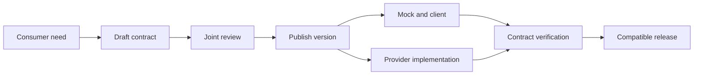

<TLDR>
  <TLDRCell label="what">
    API优先（API-first）是先设计并评审接口契约，再开始依赖该接口的实现工作。契约是实现、Mock、客户端和测试共同使用的受版本控制交付物。
  </TLDRCell>
  <TLDRCell label="trap">
    写出一份OpenAPI文件并不等于API优先；如果实现可以偏离规范，或者行为约束只存在于代码里，规范仍只是过期文档。
  </TLDRCell>
  <TLDRCell label="fix">
    在CI中同时检查规范、破坏性变更和真实响应，并为无法用模式表达的授权、幂等与状态转换添加场景测试。
  </TLDRCell>
</TLDR>

## 是什么，为什么存在

API优先把接口当作团队先要达成的设计决定，而不是服务写完之后生成的说明书。团队先定义可观察的请求与响应，再由消费者和提供者共同评审。评审通过的<Term id="api-contract">API契约（API contract）</Term>进入版本控制，后续代码必须满足它。

这里的契约不只是一组JSON字段。对HTTP API来说，它至少涉及方法、路径、参数、媒体类型、状态码、响应头、认证方式和消息模式。重试语义、授权规则、状态转换和并发条件也属于契约，但其中一部分需要用文字或场景测试表达。

这种工作方式解决的是协调问题。客户端若只能等服务上线后再观察真实响应，接口命名、错误格式或必填字段的问题会在集成阶段才暴露。契约先稳定下来后，客户端可以对Mock开发，服务端可以独立实现，双方仍围绕同一条可验证边界工作。

你会在多个团队共享服务、公开API、移动客户端或发布周期不同的系统中遇到API优先。一个人维护的小型内部端点也可以先写契约，但收益取决于是否真有独立消费者。没有明确消费者时，简短设计评审往往比庞大的生成流程更合适。

第一版契约不必预测未来的每个操作。它只需详细到足以确定当前消费者交互，包括调用者必须处理的失败。保持边界小而明确，更容易评审，也会减少以后不得不维护的推测性字段。

API优先不规定必须生成服务端代码，也不要求使用OpenAPI。GraphQL SDL、Protocol Buffers或其他接口描述同样可以承担中心契约的角色。本文用OpenAPI，是因为它能精确演示HTTP API的路径、操作和消息形状。

契约一旦发布，后续修改的处理方式就变了。字段重命名不再是局部重构，而是一项必须与旧承诺比较的接口变更提议。这道评审边界，才是API优先与提前编写文档之间的实际区别。

OpenAPI也不是全部事实来源。数据库事务、调用者是否有权访问某个<Term id="resource">资源（resource）</Term>，以及操作是否只产生一次业务效果，不能靠响应模式自动证明。可靠的流程会明确区分机器可读描述、补充语义和可执行测试。

## 工作原理

API优先流程从消费者任务开始，而不是从控制器类开始。先写出几个具体交互：谁发起请求、想改变什么、成功后能观察到什么、可能怎样失败。只有这些例子足够清楚，才把它们抽象成可复用模式。



图中的发布不是把规范复制到文档站。它意味着给契约一个可追踪版本，让构建可以稳定取得同一份内容。Mock、客户端或服务端骨架可以生成，也可以手写；关键是它们接受同一个契约检查。

### 一份最小但完整的操作

下面的OpenAPI 3.2文档定义创建订单的单个操作。它明确请求必填字段、成功状态、`Location`响应头和一种错误表示。示例值同时给Mock和文档提供具体交互，但不替代模式约束。

```yaml title="openapi.yaml"
openapi: 3.2.0
info: { title: Order API, version: 1.0.0 }
paths:
  /orders:
    post:
      operationId: createOrder
      requestBody:
        required: true
        content:
          application/json:
            schema:
              type: object
              additionalProperties: false
              required: [sku, quantity]
              properties:
                sku: { type: string, minLength: 1 }
                quantity: { type: integer, minimum: 1 }
            example: { sku: 'desk-42', quantity: 2 }
      responses:
        '201':
          description: Order created
          headers:
            Location:
              required: true
              schema: { type: string, format: uri-reference }
          content:
            application/json:
              schema: { type: object, required: [id, sku, quantity] }
              example: { id: 'ord-1001', sku: 'desk-42', quantity: 2 }
        '400':
          description: Invalid request
          content:
            application/problem+json:
              schema: { type: object, required: [type, title, status] }
```

这里的路径和方法确定操作身份，`requestBody`与`responses`描述消息边界。`Order`是资源状态的一种<Term id="representation">表示（representation）</Term>，不是数据库行的逐字段公开。服务端可以换存储方案，只要可观察的交换仍满足契约。

### 契约成为控制点

契约提交后，CI首先解析并校验文档本身。第二层把新旧版本比较，找出删除操作、收紧输入或删除响应字段等潜在破坏。第三层对运行中的提供者发送请求，验证状态码、响应头和响应体是否符合已发布契约。

这三层检查回答不同问题。规范校验只能说明文件结构合法；差异检查只能按预设规则识别变化；提供者验证只能覆盖执行过的交互。它们组合起来仍不能证明业务正确，因此关键状态转换还需要领域测试。

| 检查 | 能发现 | 不能证明 |
| --- | --- | --- |
| 描述校验 | 非法结构与引用 | 实现符合契约 |
| 兼容性差异 | 已知的结构破坏模式 | 消费者运行时行为 |
| 提供者验证 | 已观察到的HTTP不一致 | 未执行的领域规则 |

契约评审要有消费者参与。提供者单方面写出的模式可能语法完美，却漏掉调用者处理失败所需的稳定错误码，或者把内部表结构暴露成外部模型。评审应从交互示例回到消费者任务，并记录暂时无法机器化的约束。

### 评审一项变更提议

有效的变更评审会从修改行出发，沿着既有承诺向外追踪。对于字段变更，只指出受影响操作和模式还不够；评审者还要知道谁生产该消息、谁读取它，以及哪些已部署版本仍在运行。

1. 用具体请求与响应示例展示旧交互和变更后的交互。
2. 判断修改的是请求还是响应，并指出消息生产者。
3. 执行结构兼容规则；若有例外，应说明理由，不要静默屏蔽。
4. 让至少一个受影响消费者对变更后的Mock或提供者执行测试。
5. 记录发布顺序、回退方法，以及何时可以移除旧承诺。

产出可以是简短的拉取请求记录，不必另写设计文档。重点是让后续评审者能区分已接受的迁移与意外漂移。仅在生成差异上留下批准，既保留不了假设，也保留不了证据。

### 变更进入同一循环

修改接口时，先改契约并让检查失败，再更新Mock、消费者和提供者。新增可选字段通常比删除字段安全，但兼容性始终取决于双方如何读取和验证消息。严格拒绝未知字段的旧客户端可能被一个理论上可扩展的响应击中。

契约版本与URL版本不是同一个概念。每次兼容修改也应产生可追踪的契约修订，但并不需要把路径从`/v1`改成`/v2`。只有无法在现有承诺内演进时，才需要迁移策略或新的公开接口版本。

## 示例

三个示例沿用创建订单操作。为了让每段代码都能独立执行，它们把所需的契约片段直接放在文件中。教学用检查器只演示控制流，不应替代完整的OpenAPI与JSON Schema实现。

### 从契约生成操作清单

第一个程序读取一个缩小的OpenAPI对象，列出操作ID、输入必填字段和已声明响应。团队可以用同类索引检查命名，或者把操作交给后续生成步骤。

<Depth level="quick">

```javascript run title="contract-summary.js"
const document = {
  openapi: "3.2.0",
  paths: {
    "/orders": {
      post: {
        operationId: "createOrder",
        requestBody: {
          content: {
            "application/json": {
              schema: { required: ["sku", "quantity"] },
            },
          },
        },
        responses: { "201": {}, "400": {} },
      },
    },
  },
};

for (const [path, pathItem] of Object.entries(document.paths)) {
  for (const [method, operation] of Object.entries(pathItem)) {
    const schema = operation.requestBody.content["application/json"].schema;
    const responses = Object.keys(operation.responses).join(", ");
    console.log(`${operation.operationId}: ${method.toUpperCase()} ${path}`);
    console.log(`required: ${schema.required.join(", ")}`);
    console.log(`responses: ${responses}`);
  }
}
```

```text
createOrder: POST /orders
required: sku, quantity
responses: 201, 400
```

</Depth>

输出来自契约，而不是路由实现。只要操作ID稳定，生成器就能用它命名客户端方法；方法、路径或响应集合变化时，索引输出也会变化。真实工具还会解析引用并验证更多OpenAPI规则。

### 用契约示例提供确定性Mock

第二个程序把已发布的请求约束与响应示例放进Mock。有效请求得到契约中的`201`形状，缺少必填字段的请求得到已声明的`400`形状。固定示例让消费者测试可重复，而不是每次生成随机数据。

```javascript run title="contract-mock.js"
const operation = {
  required: ["sku", "quantity"],
  responses: {
    201: {
      headers: { Location: "/orders/ord-1001" },
      body: { id: "ord-1001", sku: "desk-42", quantity: 2 },
    },
    400: {
      headers: { "Content-Type": "application/problem+json" },
      body: { type: "about:blank", title: "Invalid request", status: 400 },
    },
  },
};

function mockCreateOrder(requestBody) {
  const missing = operation.required.filter((name) => !(name in requestBody));
  if (missing.length > 0) return operation.responses[400];

  const response = structuredClone(operation.responses[201]);
  response.body.sku = requestBody.sku;
  response.body.quantity = requestBody.quantity;
  return response;
}

for (const request of [
  { sku: "desk-42", quantity: 2 },
  { sku: "desk-42" },
]) {
  const response = mockCreateOrder(request);
  console.log(response.body.status ?? 201, JSON.stringify(response.body));
}
```

```text
201 {"id":"ord-1001","sku":"desk-42","quantity":2}
400 {"type":"about:blank","title":"Invalid request","status":400}
```

这个Mock故意很小：它只检查字段是否存在，没有实现整数、最小值或未知字段校验。消费者可以借它开发成功路径与错误解析，但不能据此判断真实服务已经正确验证输入。Mock证明消费者理解契约，不证明提供者满足契约。

### 对真实响应执行契约检查

第三个程序演示提供者验证的核心。检查器拒绝未声明的状态码，并验证`201`响应必须包含`Location`以及三个响应字段。第一份生成的处理器响应失败，第二份响应通过。

```javascript run title="verify-provider.js"
const responseContract = {
  201: {
    requiredHeaders: ["Location"],
    requiredBody: ["id", "sku", "quantity"],
  },
  400: {
    requiredHeaders: ["Content-Type"],
    requiredBody: ["type", "title", "status"],
  },
};

function verifyResponse(response) {
  const expected = responseContract[response.status];
  if (!expected) return [`status ${response.status} is not documented`];

  const errors = [];
  for (const name of expected.requiredHeaders) {
    if (!(name in response.headers)) errors.push(`missing header: ${name}`);
  }
  for (const name of expected.requiredBody) {
    if (!(name in response.body)) errors.push(`missing body field: ${name}`);
  }
  return errors;
}

const generated = {
  status: 200,
  headers: {},
  body: { id: "ord-1001", sku: "desk-42", quantity: 2 },
};
const conforming = {
  status: 201,
  headers: { Location: "/orders/ord-1001" },
  body: { id: "ord-1001", sku: "desk-42", quantity: 2 },
};

console.log("generated:", verifyResponse(generated).join("; "));
console.log("conforming:", verifyResponse(conforming).join("; ") || "OK");
```

```text
generated: status 200 is not documented
conforming: OK
```

完整的提供者验证还要检查媒体类型、模式关键字、引用和每个已声明交互。更重要的是，它要调用真实的HTTP边界，而不是直接测试控制器返回的对象。代理、中间件和序列化层都可能改变线上可见结果。

## 陷阱

> [!PITFALL]
> 团队先写OpenAPI文件，却允许路由和响应在没有契约检查的情况下合并。几周后，规范描述的是计划，生产环境运行的是另一套接口。

**修复方法：** 把规范解析、兼容性差异和提供者响应验证设为必需检查。部署制品应关联准确的契约修订，失败信息要指出操作与不一致字段，而不是只说文档过期。

> [!PITFALL]
> 把生成代码当成设计结果。生成器会忠实放大含糊命名、过宽模式和遗漏的错误响应，而且重新生成可能覆盖手写修改。

**修复方法：** 在生成前评审消费者任务和可观察行为，把生成目录视为可替换制品。业务逻辑放在稳定的手写边界后面，并在CI中从干净目录重新生成，确认版本库没有漂移。

> [!PITFALL]
> Mock永远返回示例中的成功响应。客户端因此没有实现认证失败、验证错误、空结果或未知状态码处理，直到接入真实服务才发现。

**修复方法：** 为每个操作提供少量有名字的场景，至少覆盖主要成功与调用者必须处理的失败。场景应该确定且可选择；随机字段适合属性测试，不适合替代可复现的集成夹具。

> [!PITFALL]
> 只验证响应体JSON，忽略状态码、`Content-Type`、`Location`、缓存字段或认证挑战。客户端依赖的其实是完整HTTP交换，单独的对象模式会漏掉协议错误。

**修复方法：** 从HTTP边界捕获状态行、相关响应头和字节级消息，再按契约验证。请求验证也要覆盖路径、查询、请求头和媒体类型，不能只检查反序列化后的对象。

> [!PITFALL]
> 把任何新增字段都判为安全，或把任何规范差异都判为破坏。真实兼容性取决于变更方向、消费者容错方式和已承诺的语义。

**修复方法：** 分别评估请求与响应的生产者、消费者。记录严格客户端等已知行为，用真实消费者契约补充通用差异规则；需要破坏现有承诺时，提供并行版本和迁移期限。

<Depth level="deep">

## 契约边界与兼容性

### 描述文件能证明什么

OpenAPI描述的是HTTP接口的形状和一部分语义。它可以声明参数位置、数据模式、安全方案、状态码和响应头，也可以给出示例。合规工具据此发现未声明响应或字段类型错误，这些都是有价值且可自动化的失败。

模式无法单独证明调用者有权读取`orderId`对应订单，也无法证明相同幂等键不会创建两份订单。它还不能从一句`description`自动验证余额变化或通知顺序。把这些文字视为契约的一部分，并用领域测试、策略测试或消费者场景让关键承诺可执行。

示例也不是约束。`quantity: 2`说明一条典型消息，却不能说明`0`是否有效，也不能限制字符串出现在该位置。示例负责沟通，模式负责一类输入；两者都需要评审。

### 四个方向的兼容性

请求与响应的兼容方向相反。服务端收紧请求输入会拒绝旧客户端以前能发送的内容；服务端放宽请求输入通常不影响旧客户端。服务端删除响应字段会破坏读取该字段的客户端，而新增响应字段只有在客户端容忍未知字段时才安全。

因此，差异工具给出的安全或破坏标签只是初筛。更改默认值、排序稳定性或错误码含义可能没有改变模式，却改变消费者看到的行为。相反，修正文档中从未实现的错误字段可能产生很大的文本差异，却没有改变生产行为；这说明契约此前已经漂移，仍需调查而不是自动忽略。

兼容评审应记录方向、已知消费者和迁移证据。公开API通常要假设存在未知消费者，所以容错空间更小。内部API可以结合调用遥测与消费者测试做判断，但没有调用记录不等于没有依赖。

### OpenAPI验证与消费者契约

OpenAPI提供者验证从提供者声明出发：实现是否满足发布的接口描述。消费者驱动<Term id="contract-testing">契约测试（contract testing）</Term>从具体消费者交互出发：提供者是否仍满足该消费者实际依赖的请求和响应。二者范围不同，可以同时使用。

消费者契约不应允许每个客户端私自重新定义服务语义。提供者仍要审核交互，拒绝不可能维持或违反领域规则的期望。契约代理或共享仓库保存已发布交互，部署检查再确认目标提供者版本通过相关验证。

仅靠消费者测试也可能漏掉没有消费者覆盖的新操作、安全要求或通用错误格式。仅靠OpenAPI则可能不知道哪些可选字段对某个消费者实际必需。把OpenAPI作为公共边界，把消费者契约作为具体依赖证据，能让两类盲区更容易被看见。

### 契约检查的边界

契约检查从服务边界外部观察行为。这样可以看到序列化和中间件的影响，但也意味着它无法检查两次数据库写入是否原子提交。内部状态转换即使已经损坏，响应仍可能符合契约。

需要控制事务、时钟与故障的领域不变量，应放在更低层测试中。认证与资源级授权则应保留HTTP边界测试，因为凭据、路由绑定和策略中间件都属于可观察交换。高风险承诺跨越两层时，可以保留少量重复覆盖。

部署门禁应指出失败证据的类型。模式不一致、消费者交互失败和余额不变量被破坏，需要不同负责人和修复方式。把它们统一折叠成“API测试失败”，反而会削弱团队对流水线的信任。

### 按失败选择自动化

先确定要阻止的失败，再选择能观察它的最小检查。描述检查用于发现非法契约，差异检查用于分类变更，提供者验证用于检查线上交换，消费者场景用于验证具名依赖。所有这些路径都不强制要求代码生成。

工具应允许经过评审的例外，但例外要有负责人、理由和失效日期。永久的全局屏蔽会让精确规则沦为背景噪声，团队也会退回到多了几份文件的代码优先流程。

### 交付物所有权

中心契约需要明确维护者和变更路径，但不应由提供者独占决定。所有权意味着有人处理评审、弃用和工具升级，并不意味着消费者只能在实现完成后接受结果。高风险变更应把消费者确认或迁移计划作为合并条件。

生成制品不应反过来成为无法追踪的第二份事实来源。若仓库存放生成客户端，应记录生成器版本与契约提交，并能重复生成相同公共接口。若构建时生成，则要固定工具版本，避免同一契约因工具升级产生未评审变化。

最终的发布单位应能回答三个问题：它实现哪一版契约，哪些消费者验证过它，发现不兼容时怎样停止部署。这比拥有一份漂亮的文档页更接近API优先的实际价值。

</Depth>

<Checkpoint id="backend/api-first" />

## 延伸阅读

- [OpenAPI Specification 3.2.0](https://spec.openapis.org/oas/v3.2.0.html)
- [Learn OpenAPI](https://learn.openapis.org/)
- [RFC 9110：HTTP语义](https://www.rfc-editor.org/rfc/rfc9110.html)
- [Pact：消费者驱动契约如何工作](https://docs.pact.io/getting_started/how_pact_works)
