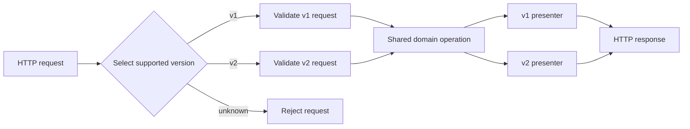

<TLDR>
  <TLDRCell label="what">
    API versioning lets one service expose more than one public contract while clients move between incompatible versions.
  </TLDRCell>
  <TLDRCell label="trap">
    A version label does not make a change safe. Compatibility depends on the observable behavior of real consumers, including strict decoders and caches.
  </TLDRCell>
  <TLDRCell label="fix">
    Keep business logic shared, select a contract at the HTTP boundary, test every supported contract, and retire old versions with measured usage and explicit signals.
  </TLDRCell>
</TLDR>

## What it is and why it exists

An <Term id="api-version">API version</Term> names a stable set of externally observable behavior. That behavior includes request shapes, response shapes, status codes, relevant headers, authentication rules, defaults, ordering, and side effects. A version is therefore wider than a JSON schema and narrower than an arbitrary release of the service.

Versioning exists because an API provider and its clients rarely deploy together. If a provider changes `total` from a number to an object, code compiled and deployed months earlier may still read it as a number. Keeping the old contract available gives those clients a migration window while new clients adopt the replacement.

A <Term id="breaking-change">breaking change</Term> is a change that can make a previously valid interaction fail or mean something different. Removing a field and adding a required request parameter are obvious examples. Changing a default sort order, tightening validation, or returning a new enum value can be just as disruptive even when the schema diff looks small.

Version only when compatibility cannot reasonably be preserved inside the current contract. Adding an endpoint or an optional request parameter usually fits an existing version. Adding a response field is safe only when supported clients tolerate unknown fields; compatibility is evidence about consumers, not a property inferred from the word "optional."

API versions appear at a boundary such as `/api/v1/orders`, a request header, an `Accept` media type, or a query parameter. The identifier may be a major number or a date. Its spelling is a policy choice; the real promise is which changes can land in place and how long older contracts remain supported.

## How it works

Versioning adds a selection step before normal request handling. The server resolves the requested version, rejects unsupported values, applies that version's request rules, runs shared domain behavior, and formats the result through a version-specific presenter. Keeping selection and presentation at the edge prevents the domain model from splitting into one copy per public contract.

The public <Term id="api-contract">API contract</Term> is the unit that gets versioned. Database schemas, internal event formats, and deployment versions may evolve on separate schedules. Exposing those internal versions directly couples clients to changes they do not need to see.



### Draw the compatibility boundary

Before assigning a new version, write down the previous promise and the proposed promise. Compare the whole exchange, not only property names. A useful inventory covers:

- method, target URI, query parameters, and request headers;
- request media type, body shape, validation, and defaults;
- response status, headers, media type, body shape, and ordering;
- authentication, authorization, idempotency, and other side effects.

Then classify the change from the consumer's direction. A server that accepts an additional optional request field has widened its input. A server that stops accepting a formerly valid value has narrowed it and can break an old client. For responses, the provider produces data, so removing an established value is the usual breaking direction.

### Choose one visible selector

Path versioning gives each major contract a distinct URI, such as `/api/v1/orders`. It is easy to inspect, route, log, and cache. The cost is that resource identifiers change across versions, so links and client configuration must change during migration.

Header versioning keeps the target URI stable. A vendor media type in `Accept` uses HTTP <Term id="content-negotiation">content negotiation</Term>; a service-specific header is another explicit selector. If a cacheable response changes according to `Accept` or a custom version header, the response needs the corresponding `Vary` field so a cache does not reuse one version for another request.

A query selector such as `?api-version=2027-01-01` is visible and usually participates in a cache key because it is part of the target URI. It can, however, be mistaken for an ordinary filter and omitted by generated clients. Whichever scheme you choose, define the behavior for missing, malformed, unsupported, deprecated, and retired values.

| Selector | Main advantage | Main cost |
| --- | --- | --- |
| Path | Obvious routing and cache separation | URI changes during migration |
| `Accept` or custom header | Stable resource URI | Client tooling and cache configuration need care |
| Query parameter | Easy to inspect and switch | Easy to omit or treat as a business parameter |

Do not accept several selectors without a precedence rule. If `/v1/orders` and `X-API-Version: v2` appear together, guessing hides client bugs. Reject the conflict or document one authoritative selector and test that rule.

### Separate API versions from releases

Many teams expose only a major identifier while deploying minor fixes and compatible additions in place. Google APIs, for example, document major versions such as `v1` rather than exposing minor and patch numbers in their REST paths. This resembles Semantic Versioning, but it is an API compatibility policy, not proof that every service release follows SemVer.

A date identifier names a compatibility snapshot, not necessarily the date of every deployment. It works well when consumers want an explicit behavior cutoff. Major numbers work well when the migration is understood as a named contract generation. Neither scheme tells clients anything useful unless the changelog and support policy define the difference.

### Run versions through a lifecycle

A production lifecycle normally has supported, deprecated, and retired states. Deprecation warns clients to migrate but does not itself change how the resource behaves. Retirement ends the compatibility promise and may produce `410 Gone`, another documented response, or removal at the routing layer.

Track usage by authenticated client or another stable integration identifier before choosing a retirement date. Raw request counts are not enough: one low-volume payroll or settlement job can matter more than millions of test calls. Publish a migration guide, observe migrations, contact remaining owners, and remove a version only after the stated policy permits it.

## Examples

### Route at the boundary

This example exposes two path versions over one stored order. The version-specific code only selects and formats the public representation; it does not copy the order lookup or business rules.

<Depth level="quick">

```javascript run title="route_versions.js"
const orders = new Map([
  ["ord-7", { id: "ord-7", totalCents: 2599 }],
]);

function presentOrder(order, version) {
  if (version === "v1") {
    return { id: order.id, total: order.totalCents / 100 };
  }
  return {
    id: order.id,
    total: {
      amount: (order.totalCents / 100).toFixed(2),
      currency: "USD",
    },
  };
}

function handle(path) {
  const match = /^\/api\/(v1|v2)\/orders\/([^/]+)$/.exec(path);
  if (!match) return { status: 404, body: { error: "unsupported API version" } };

  const [, version, orderId] = match;
  const order = orders.get(orderId);
  if (!order) return { status: 404, body: { error: "order not found" } };

  return { status: 200, body: presentOrder(order, version) };
}

for (const path of [
  "/api/v1/orders/ord-7",
  "/api/v2/orders/ord-7",
  "/api/v3/orders/ord-7",
]) {
  const response = handle(path);
  console.log(`${path} -> ${response.status} ${JSON.stringify(response.body)}`);
}
```

```text
/api/v1/orders/ord-7 -> 200 {"id":"ord-7","total":25.99}
/api/v2/orders/ord-7 -> 200 {"id":"ord-7","total":{"amount":"25.99","currency":"USD"}}
/api/v3/orders/ord-7 -> 404 {"error":"unsupported API version"}
```

</Depth>

The v1 presenter preserves a numeric `total`. The v2 presenter can introduce an amount and currency object without making v1 clients parse a new type. The unknown version fails explicitly instead of falling through to whichever implementation happens to be current.

Real services should select the version before expensive work and keep version routers thin. If business behavior truly differs between versions, name that policy explicitly and test it at the domain boundary rather than burying it in serializers.

### Test compatibility against client behavior

An additive response field often works, but a strict generated decoder may reject it. This small experiment runs the same three responses through a tolerant client and a strict client.

```javascript run title="consumer_compatibility.js"
const cases = [
  ["original", { id: "ord-7", total: 25.99 }],
  ["additive", { id: "ord-7", total: 25.99, receiptUrl: "/receipts/r-9" }],
  ["breaking", { id: "ord-7", total: { amount: "25.99", currency: "USD" } }],
];

function tolerantClient(body) {
  if (typeof body.id !== "string") throw new Error("id must be a string");
  if (typeof body.total !== "number") throw new Error("total must be a number");
  return body.id;
}

function strictClient(body) {
  const allowed = new Set(["id", "total"]);
  if (Object.keys(body).some((name) => !allowed.has(name))) {
    throw new Error("unknown field");
  }
  return tolerantClient(body);
}

for (const [name, body] of cases) {
  for (const [clientName, read] of [
    ["tolerant", tolerantClient],
    ["strict", strictClient],
  ]) {
    try {
      console.log(`${name} / ${clientName}: OK (${read(body)})`);
    } catch (error) {
      console.log(`${name} / ${clientName}: ${error.message}`);
    }
  }
}
```

```text
original / tolerant: OK (ord-7)
original / strict: OK (ord-7)
additive / tolerant: OK (ord-7)
additive / strict: unknown field
breaking / tolerant: total must be a number
breaking / strict: total must be a number
```

The extra `receiptUrl` is compatible with the tolerant reader and incompatible with the strict one. That is why a schema-diff tool can flag likely risk but cannot deliver the final verdict. Generated SDK settings, recorded consumer contracts, and traffic evidence complete the picture.

Do not respond by promising never to add fields. Define an extensible response policy, configure official SDKs to tolerate unknown fields where the format permits it, and test representative consumers before relying on additive evolution.

### Generate standard deprecation signals

RFC 9745 defines `Deprecation` as a Structured Field Date, written as `@` followed by Unix seconds. `Sunset` uses an HTTP date and announces when the resource is expected to become unresponsive. The two dates have different formats.

```javascript run title="deprecation_headers.js"
function lifecycleHeaders(deprecationAt, sunsetAt, guideUrl) {
  if (sunsetAt < deprecationAt) {
    throw new Error("sunset must not precede deprecation");
  }

  return {
    Deprecation: `@${Math.floor(deprecationAt.getTime() / 1000)}`,
    Sunset: sunsetAt.toUTCString(),
    Link: `<${guideUrl}>; rel="deprecation"; type="text/html"`,
  };
}

const headers = lifecycleHeaders(
  new Date("2027-01-01T00:00:00Z"),
  new Date("2027-07-01T00:00:00Z"),
  "https://api.example.com/migrations/v1",
);

for (const [name, value] of Object.entries(headers)) {
  console.log(`${name}: ${value}`);
}
```

```text
Deprecation: @1798761600
Sunset: Thu, 01 Jul 2027 00:00:00 GMT
Link: <https://api.example.com/migrations/v1>; rel="deprecation"; type="text/html"
```

The `deprecation` link points to policy or migration documentation. These headers are hints for the resource in the response unless the service documents a broader scope. They complement direct owner notifications and a changelog; many clients never inspect lifecycle headers.

Do not emit `Deprecation: true`, invent `Deprecation-Date`, or format both dates alike. Those forms occur in older examples but do not match RFC 9745. Also keep the resource working as documented during deprecation: a warning is not permission to degrade the old contract.

### Lock each supported contract with tests

Version tests should assert shared invariants and version-specific shapes. The following checks make accidental leakage between the two presenters visible.

```javascript run title="contract_versions.js"
import assert from "node:assert/strict";

const responses = {
  v1: { status: 200, body: { id: "ord-7", total: 25.99 } },
  v2: {
    status: 200,
    body: { id: "ord-7", total: { amount: "25.99", currency: "USD" } },
  },
};

function verifyShared(response) {
  assert.equal(response.status, 200);
  assert.equal(response.body.id, "ord-7");
}

verifyShared(responses.v1);
assert.deepEqual(Object.keys(responses.v1.body).sort(), ["id", "total"]);
assert.equal(typeof responses.v1.body.total, "number");

verifyShared(responses.v2);
assert.deepEqual(Object.keys(responses.v2.body.total).sort(), ["amount", "currency"]);
assert.equal(responses.v2.body.total.currency, "USD");

assert.notDeepEqual(responses.v1.body, responses.v2.body);
console.log("v1 contract: OK");
console.log("v2 contract: OK");
```

```text
v1 contract: OK
v2 contract: OK
```

Shape checks are only one layer. Run the same assertions against the deployed HTTP boundary so routing, serialization, status codes, headers, and middleware are included. Add consumer-driven <Term id="contract-testing">contract tests</Term> where named clients depend on behavior that a general interface description does not capture.

Keep a test suite for every supported version, not only the newest one. A refactor in shared code is exactly where old behavior can change accidentally, so the oldest supported contract needs the same release gate as the current contract.

## Pitfalls

> [!PITFALL]
> The server defaults an omitted version to the newest implementation. An old client that never sent a selector then changes behavior on the day a new version ships.

**Fix:** require an explicit version, or freeze the default to a documented compatibility version for its entire support window. Treat a default change as a migration event, measure unversioned traffic, and announce it like any other breaking change.

> [!PITFALL]
> A team labels every deployment `v1.2.17` and assumes Semantic Versioning proves client compatibility. Operational releases and public protocol versions become coupled, while behavioral changes escape review because the major digit did not move.

**Fix:** define a compatibility policy for observable API behavior. Keep build or deployment identifiers separate, expose only the granularity clients can act on, and use contract evidence to decide whether a new public version is required.

> [!PITFALL]
> Header-based versions return different representations under one URI, but cache configuration ignores the selecting header. A shared cache can then serve a v1 response to a v2 request.

**Fix:** send `Vary` with every request field that influences representation selection and verify the effective cache key at the CDN or gateway. `Vary` does not make a response cacheable by itself; the normal cache controls still apply.

> [!PITFALL]
> Each version receives a copied controller, service, repository, and database query. Fixes land in the newest tree while security and correctness defects survive in older supported versions.

**Fix:** share domain operations and isolate unavoidable differences in request adapters and response presenters. When semantics truly diverge, make the policy branch explicit and add tests for both paths instead of duplicating the whole stack.

> [!PITFALL]
> A deprecation date is chosen from a calendar without knowing who still calls the version. The loud announcement reaches active developers but misses unattended jobs and integrations owned by another team.

**Fix:** inventory consumers, record usage per stable client identity, publish a version-to-version migration map, and alert owners through more than response headers. Keep a rollback plan for retirement and verify that traffic has moved rather than merely declined.

## In the AI era

Use an agent to carry an API change across the server and its actual consumers. For example, ask it to determine whether adding a response field is compatible with the project's generated clients, test the proposed change against their decoders, and update a representative caller. Published schemas and consumer tests give this task a concrete starting point; the agent can discover routing and serialization details in the repository. Its result can support an in-place change, a new API version, or a staged client migration, with code and migration documentation updated together.

<Depth level="deep">

## Compatibility is directional

<Term id="backward-compatibility">Backward compatibility</Term> means a new provider can still satisfy interactions that were valid under the older contract. The phrase is easy to misuse because requests and responses travel in opposite producer directions. For requests, old clients produce and the new server consumes. For responses, the new server produces and old clients consume.

This makes schema rules directional. Widening accepted input is usually compatible with existing senders; narrowing it is risky. Preserving an established response field is usually compatible with existing readers; removing it is risky. Yet “usually” matters because behavior outside the schema can reverse the conclusion.

| Proposed change | Usual risk | Evidence to seek |
| --- | --- | --- |
| Add optional request field | Low for old clients | Default preserves old request meaning |
| Add required request field | High | Old requests remain valid or use a new version |
| Add response field | Consumer-dependent | Readers tolerate unknown fields |
| Remove or rename response field | High | No supported consumer reads it |
| Add enum response value | Consumer-dependent | Readers have an unknown-value branch |
| Tighten validation | High for formerly valid input | Traffic and contracts show no dependence |

Generated clients make response additions a common surprise. Some decoders ignore unknown properties, while others reject them or map enums into closed language types. Before declaring a change additive, inspect the options used by official SDKs and test at least the client versions covered by your support policy.

Semantic compatibility also matters. Returning the same fields with a new default order can corrupt a caller that selects “the first” result. Changing a missing value from `null` to omission, switching error status, or making a formerly idempotent operation create another object on retry can break code without changing the nominal schema.

Compatibility checks therefore combine several kinds of evidence. An interface diff finds structural risks, provider tests prove the implementation matches each published contract, consumer tests capture concrete dependencies, and production telemetry shows which versions still matter. None of these sources is sufficient alone.

## Deprecation and retirement are different states

<Term id="deprecation">Deprecation</Term> tells consumers that a resource will be or has been deprecated and that they should plan a transition. RFC 9745 says the act of deprecation does not change the resource's behavior. The `Deprecation` value is a Structured Field Date, so `@1798761600` represents an instant rather than a boolean flag.

<Term id="sunset">Sunset</Term> describes when a resource is expected to become unresponsive. RFC 8594 gives it the HTTP-date syntax, such as `Thu, 01 Jul 2027 00:00:00 GMT`. A sunset timestamp is a hint, not a guarantee of availability before that time or a mandate for one response afterward.

When both fields are present, the sunset must not precede the deprecation date. A `Link` with `rel="deprecation"` can lead a developer to the migration guide. Document the scope because, by default, lifecycle fields apply to the resource that returned them; one header on an API home document does not magically describe every endpoint to unaware clients.

A useful retirement gate answers concrete questions:

1. Which supported consumers still send the old selector?
2. Has each owner received a tested migration guide and replacement contract?
3. Do error budgets and staffing still support the old version until the announced date?
4. What response will clients receive after retirement, and can the route be restored if the cutoff exposes a missed dependency?

Keep deprecation signals stable across success and error responses where practical. A client that only sees the warning on a rarely used success path may miss it. Direct notices, dashboards, changelogs, SDK warnings, and response fields can support the protocol signal, but they should not contradict one another.

## Operating several versions without drift

The safest shape is one domain operation with explicit adapters around it. Request adapters normalize each public input into a domain command. Response presenters turn the domain result into the exact representation promised by that version. Shared code remains shared, while public differences stay searchable and reviewable.

This design has a limit. If v1 and v2 define genuinely different business rules, forcing them through one pile of conditionals can be less clear than separate policy implementations. Share stable infrastructure and domain primitives, then give the divergent rule a name such as `LegacyRefundPolicy` rather than scattering `if (version)` checks through repositories and entities.

Release gates should exercise routing as well as serializers. Test a missing selector, every supported selector, an unsupported selector, conflicts between selectors, deprecated responses, and retired responses. For header selection, test the `Vary` field through the actual gateway or CDN configuration because application-unit tests cannot prove the deployed cache key.

Observability needs the same boundary discipline. Record the resolved version, route template, status class, and a privacy-safe client identity. Do not put raw access tokens, full URLs with secrets, or request bodies into version dashboards. The purpose is to find owners and migration risk, not to create a second store of sensitive data.

Finally, delete retired adapters, tests, documentation, and routing rules together. Leaving a hidden old path alive creates an unsupported contract that can be rediscovered by generated clients or copied from stale examples. Keep the historical contract in version control and release notes, not in production by accident.

</Depth>

<Checkpoint id="backend/api-versioning" />

## Further reading

- [RFC 9745: The Deprecation HTTP Response Header Field](https://www.rfc-editor.org/rfc/rfc9745.html)
- [RFC 8594: The Sunset HTTP Header Field](https://www.rfc-editor.org/rfc/rfc8594.html)
- [RFC 9110: `Vary`](https://www.rfc-editor.org/rfc/rfc9110.html#section-12.5.5)
- [Google AIP-185: API Versioning](https://google.aip.dev/185)
- [Semantic Versioning 2.0.0](https://semver.org/)
