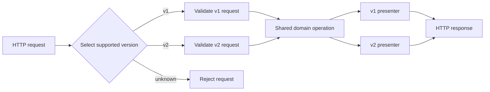

<TLDR>
  <TLDRCell label="what">
    API版本管理让同一项服务可以同时提供多份公共契约，客户端则能在不兼容版本之间逐步迁移。
  </TLDRCell>
  <TLDRCell label="trap">
    版本标签本身不能保证变更安全。兼容性取决于真实消费者可观察到的行为，严格解码器和缓存也在其中。
  </TLDRCell>
  <TLDRCell label="fix">
    共享业务逻辑，在HTTP边界选择契约，测试每个受支持契约，并根据实测用量和明确的信号淘汰旧版本。
  </TLDRCell>
</TLDR>

## 是什么，为什么存在

<Term id="api-version">API版本（API version）</Term>为一组稳定且可从外部观察的行为命名。这些行为包括请求结构、响应结构、状态码、相关响应头、认证规则、默认值、排序和副作用。因此，版本覆盖的范围比JSON模式更广，又比服务的任意一次发布更窄。

版本管理之所以存在，是因为API提供者与客户端很少同步部署。如果提供者把`total`从数字改成对象，数月前编译并部署的代码可能仍把它当作数字读取。继续提供旧契约，可以让这些客户端获得迁移窗口，同时让新客户端采用替代契约。

<Term id="breaking-change">破坏性变更（breaking change）</Term>会让原本有效的交互失败，或改变其含义。删除字段和新增必填请求参数是显而易见的例子。修改默认排序、收紧验证或返回新的枚举值也可能造成同样的破坏，即使模式差异看起来很小。

只有无法在当前契约内合理保持兼容时，才需要新版本。新增端点或可选请求参数通常可以放进现有版本。新增响应字段则只有在受支持客户端容忍未知字段时才安全；兼容性来自消费者证据，不能根据“可选”二字推断。

API版本会出现在`/api/v1/orders`这样的边界中，也可以放在请求头、`Accept`媒体类型或查询参数里。标识符可以是主版本号，也可以是日期。具体写法属于策略选择；真正的承诺是哪些变更可以原地发布，以及旧契约会获得多久的支持。

## 工作原理

版本管理在常规请求处理前增加一个选择步骤。服务端解析请求的版本，拒绝不受支持的值，应用该版本的请求规则，执行共享领域行为，再通过对应版本的呈现器格式化结果。把选择和呈现放在边界，可以避免按公共契约复制整套领域模型。

被版本化的单位是公共<Term id="api-contract">API契约（API contract）</Term>。数据库模式、内部事件格式和部署版本可以按各自节奏演进。直接暴露这些内部版本，会让客户端与本不需要了解的变更耦合。



### 划定兼容性边界

分配新版本前，先写清旧承诺与拟议的新承诺。比较完整交互，而不只是属性名称。一份实用清单应覆盖：

- 方法、目标URI、查询参数和请求头；
- 请求媒体类型、请求体结构、验证和默认值；
- 响应状态、响应头、媒体类型、响应体结构和排序；
- 认证、授权、幂等性及其他副作用。

然后从消费者方向判断变更。服务端多接受一个可选请求字段，相当于放宽输入。服务端不再接受过去有效的值，则是收紧输入，可能破坏旧客户端。对于响应，提供者是数据生产方，因此删除已有值通常属于破坏方向。

### 选择一种可见的选择器

路径版本让每份主契约拥有不同URI，例如`/api/v1/orders`。它便于查看、路由、记录日志和缓存。代价是资源标识符随版本变化，所以迁移时必须修改链接和客户端配置。

请求头版本让目标URI保持稳定。`Accept`中的厂商媒体类型使用HTTP的<Term id="content-negotiation">内容协商（content negotiation）</Term>；服务专用请求头则是另一种显式选择器。如果可缓存响应会随`Accept`或自定义版本请求头变化，响应必须包含相应的`Vary`字段，避免缓存把一个版本复用于另一个请求。

`?api-version=2027-01-01`这样的查询选择器清晰可见，而且它属于目标URI，通常会进入缓存键。不过，生成的客户端可能把它误当成普通筛选条件并将其省略。无论采用哪种方案，都要定义缺失、格式错误、不受支持、已弃用和已退役值的行为。

| 选择器 | 主要优势 | 主要代价 |
| --- | --- | --- |
| 路径 | 路由清楚，缓存自然隔离 | 迁移时URI改变 |
| `Accept`或自定义请求头 | 资源URI稳定 | 客户端工具与缓存配置需谨慎处理 |
| 查询参数 | 容易查看和切换 | 容易被省略或误作业务参数 |

不要在没有优先级规则的情况下接受多种选择器。如果`/v1/orders`与`X-API-Version: v2`同时出现，靠猜测只会掩盖客户端缺陷。应拒绝冲突，或规定唯一权威的选择器并测试这条规则。

### 区分API版本与发布版本

许多团队只公开主版本标识，次要修复和兼容新增则原地部署。例如，Google API公开`v1`这样的主版本，不在REST路径中放入次版本号和补丁版本号。这种做法借用了语义化版本的思路，但它只是API兼容性策略，不能证明服务的每次发布都遵循SemVer。

日期标识符命名的是兼容性快照，不一定是每次部署的日期。当消费者需要明确的行为截止点时，它很合适。主版本号则适合把迁移理解成一代具名契约。除非变更日志和支持策略明确说明差异，否则两种方案都无法向客户端传达有用信息。

### 让版本经过完整生命周期

生产环境中的生命周期通常包含受支持、已弃用和已退役三种状态。弃用只提醒客户端迁移，本身不会改变资源行为。退役会终止兼容性承诺，之后可以返回`410 Gone`、另一种已记录的响应，也可以直接在路由层移除。

确定退役日期前，应按已认证客户端或其他稳定的集成标识统计用量。只有原始请求数还不够：一个低频的工资或结算任务，可能比数百万次测试调用更重要。发布迁移指南，观察迁移进度，联系剩余负责人，并且只在既定策略允许后移除版本。

## 示例

### 在边界路由版本

下面的示例围绕同一份订单数据暴露两个路径版本。版本专用代码只负责选择和格式化公共表示，不会复制订单查询或业务规则。

<Depth level="quick">

```javascript run title="route_versions.js"
const orders = new Map([
  ["ord-7", { id: "ord-7", totalCents: 2599 }],
]);

function presentOrder(order, version) {
  if (version === "v1") {
    return { id: order.id, total: order.totalCents / 100 };
  }
  return {
    id: order.id,
    total: {
      amount: (order.totalCents / 100).toFixed(2),
      currency: "USD",
    },
  };
}

function handle(path) {
  const match = /^\/api\/(v1|v2)\/orders\/([^/]+)$/.exec(path);
  if (!match) return { status: 404, body: { error: "unsupported API version" } };

  const [, version, orderId] = match;
  const order = orders.get(orderId);
  if (!order) return { status: 404, body: { error: "order not found" } };

  return { status: 200, body: presentOrder(order, version) };
}

for (const path of [
  "/api/v1/orders/ord-7",
  "/api/v2/orders/ord-7",
  "/api/v3/orders/ord-7",
]) {
  const response = handle(path);
  console.log(`${path} -> ${response.status} ${JSON.stringify(response.body)}`);
}
```

```text
/api/v1/orders/ord-7 -> 200 {"id":"ord-7","total":25.99}
/api/v2/orders/ord-7 -> 200 {"id":"ord-7","total":{"amount":"25.99","currency":"USD"}}
/api/v3/orders/ord-7 -> 404 {"error":"unsupported API version"}
```

</Depth>

v1呈现器保留数字形式的`total`。v2呈现器可以引入包含金额和币种的对象，而不要求v1客户端解析新类型。未知版本会明确失败，不会落入碰巧处于当前状态的实现。

真实服务应在执行昂贵工作前选择版本，并保持版本路由器轻量。如果不同版本的业务行为确实不同，应明确命名这项策略，并在领域边界测试，不要把差异藏进序列化器。

### 根据客户端行为测试兼容性

新增响应字段通常可以正常工作，但严格的生成式解码器可能拒绝它。下面的小实验让宽容客户端和严格客户端分别读取三种响应。

```javascript run title="consumer_compatibility.js"
const cases = [
  ["original", { id: "ord-7", total: 25.99 }],
  ["additive", { id: "ord-7", total: 25.99, receiptUrl: "/receipts/r-9" }],
  ["breaking", { id: "ord-7", total: { amount: "25.99", currency: "USD" } }],
];

function tolerantClient(body) {
  if (typeof body.id !== "string") throw new Error("id must be a string");
  if (typeof body.total !== "number") throw new Error("total must be a number");
  return body.id;
}

function strictClient(body) {
  const allowed = new Set(["id", "total"]);
  if (Object.keys(body).some((name) => !allowed.has(name))) {
    throw new Error("unknown field");
  }
  return tolerantClient(body);
}

for (const [name, body] of cases) {
  for (const [clientName, read] of [
    ["tolerant", tolerantClient],
    ["strict", strictClient],
  ]) {
    try {
      console.log(`${name} / ${clientName}: OK (${read(body)})`);
    } catch (error) {
      console.log(`${name} / ${clientName}: ${error.message}`);
    }
  }
}
```

```text
original / tolerant: OK (ord-7)
original / strict: OK (ord-7)
additive / tolerant: OK (ord-7)
additive / strict: unknown field
breaking / tolerant: total must be a number
breaking / strict: total must be a number
```

新增的`receiptUrl`与宽容读取者兼容，却和严格读取者不兼容。因此，模式差异工具只能标出可能的风险，无法给出最终结论。生成SDK的设置、已记录的消费者契约和流量证据才能补全判断。

解决方法不是承诺永不新增字段。应定义可扩展的响应策略，在格式允许时把官方SDK配置为容忍未知字段，并在依赖增量演进前测试有代表性的消费者。

### 生成符合标准的弃用信号

RFC 9745把`Deprecation`定义为结构化字段日期（Structured Field Date），写法是`@`加Unix秒数。`Sunset`使用HTTP日期，用来声明资源预计何时停止响应。两个日期的格式并不相同。

```javascript run title="deprecation_headers.js"
function lifecycleHeaders(deprecationAt, sunsetAt, guideUrl) {
  if (sunsetAt < deprecationAt) {
    throw new Error("sunset must not precede deprecation");
  }

  return {
    Deprecation: `@${Math.floor(deprecationAt.getTime() / 1000)}`,
    Sunset: sunsetAt.toUTCString(),
    Link: `<${guideUrl}>; rel="deprecation"; type="text/html"`,
  };
}

const headers = lifecycleHeaders(
  new Date("2027-01-01T00:00:00Z"),
  new Date("2027-07-01T00:00:00Z"),
  "https://api.example.com/migrations/v1",
);

for (const [name, value] of Object.entries(headers)) {
  console.log(`${name}: ${value}`);
}
```

```text
Deprecation: @1798761600
Sunset: Thu, 01 Jul 2027 00:00:00 GMT
Link: <https://api.example.com/migrations/v1>; rel="deprecation"; type="text/html"
```

`deprecation`链接指向策略或迁移文档。除非服务记录了更广的作用域，否则这些响应头只是针对当前响应资源的提示。它们用于补充直接通知负责人和变更日志；很多客户端从不检查生命周期响应头。

不要发送`Deprecation: true`，不要虚构`Deprecation-Date`，也不要把两个日期格式化成相同形式。这些写法会出现在旧示例中，但不符合RFC 9745。弃用期间还应让资源继续按契约工作：警告并不等于可以降低旧契约的服务质量。

### 用测试锁定每份受支持契约

版本测试既要断言共享不变量，也要检查各版本专有的结构。下面的检查可以暴露两个呈现器之间的意外泄漏。

```javascript run title="contract_versions.js"
import assert from "node:assert/strict";

const responses = {
  v1: { status: 200, body: { id: "ord-7", total: 25.99 } },
  v2: {
    status: 200,
    body: { id: "ord-7", total: { amount: "25.99", currency: "USD" } },
  },
};

function verifyShared(response) {
  assert.equal(response.status, 200);
  assert.equal(response.body.id, "ord-7");
}

verifyShared(responses.v1);
assert.deepEqual(Object.keys(responses.v1.body).sort(), ["id", "total"]);
assert.equal(typeof responses.v1.body.total, "number");

verifyShared(responses.v2);
assert.deepEqual(Object.keys(responses.v2.body.total).sort(), ["amount", "currency"]);
assert.equal(responses.v2.body.total.currency, "USD");

assert.notDeepEqual(responses.v1.body, responses.v2.body);
console.log("v1 contract: OK");
console.log("v2 contract: OK");
```

```text
v1 contract: OK
v2 contract: OK
```

结构检查只是其中一层。还要对已部署的HTTP边界执行相同断言，把路由、序列化、状态码、响应头和中间件纳入检查。如果具名客户端依赖通用接口描述无法表达的行为，应增加消费者驱动的<Term id="contract-testing">契约测试（contract testing）</Term>。

每个受支持版本都要保留测试套件，不能只测最新版本。共享代码重构最容易意外改变旧行为，因此最旧的受支持契约应使用与当前契约相同的发布门禁。

## 陷阱

> [!PITFALL]
> 服务端把缺失的版本默认到最新实现。原本从未发送选择器的旧客户端，会在新版本上线当天突然改变行为。

**修复方法：** 要求明确提供版本，或者在整个支持期内把默认值固定为文档规定的兼容版本。改变默认值应视为一次迁移事件，需要衡量无版本流量，并像其他破坏性变更一样提前公告。

> [!PITFALL]
> 团队把每次部署标成`v1.2.17`，并假定语义化版本足以证明客户端兼容。运维发布与公共协议版本由此耦合，而行为变更会因为主版本号没变而逃过审查。

**修复方法：** 为可观察的API行为定义兼容性策略。分开构建或部署标识，只公开客户端可以据此采取行动的粒度，并根据契约证据判断是否需要新的公共版本。

> [!PITFALL]
> 请求头版本在同一URI下返回不同表示，但缓存配置忽略了选择响应的请求头。共享缓存可能把v1响应交给v2请求。

**修复方法：** 在`Vary`中列出所有影响表示选择的请求字段，并在CDN或网关处验证实际缓存键。`Vary`本身不会让响应变得可缓存，常规缓存控制仍然适用。

> [!PITFALL]
> 每个版本都复制一套控制器、服务、仓储和数据库查询。修复只进入最新代码树，旧的受支持版本则继续保留安全或正确性缺陷。

**修复方法：** 共享领域操作，只在请求适配器和响应呈现器中隔离不可避免的差异。如果语义确实分叉，应明确写出策略分支并测试两条路径，而不是复制整套技术栈。

> [!PITFALL]
> 团队只看日历选择弃用日期，并不知道谁仍在调用旧版本。声势浩大的公告触达了活跃开发者，却漏掉了无人值守任务和其他团队拥有的集成。

**修复方法：** 盘点消费者，按稳定的客户端标识记录用量，发布版本迁移映射，并通过响应头以外的渠道提醒负责人。为退役准备回滚方案，还要确认流量确实已经迁移，而不只是有所下降。

## AI时代

可以让智能体把一项API变更落实到服务端和实际使用它的客户端。例如，让它判断新增响应字段是否兼容项目中代码生成的客户端，用这些客户端的解码器验证变更，并更新一个代表性的调用方。已发布的模式和消费者测试提供了具体起点，路由与序列化细节则可以由智能体在仓库中查明。根据结果，项目可以选择直接修改现有版本、推出新版本或分阶段迁移客户端，并同步更新代码和迁移文档。

<Depth level="deep">

## 兼容性具有方向

<Term id="backward-compatibility">向后兼容（backward compatibility）</Term>是指新提供者仍能满足旧契约中原本有效的交互。这个术语容易被误用，因为请求与响应中的生产者方向相反。对于请求，旧客户端生产数据，新服务端消费数据；对于响应，新服务端生产数据，旧客户端消费数据。

因此，模式规则也有方向。放宽可接受输入通常与现有发送方兼容，收紧输入则有风险。保留已有响应字段通常与现有读取者兼容，删除字段则有风险。不过，“通常”二字不能省略，因为模式以外的行为可能推翻结论。

| 拟议变更 | 通常风险 | 应寻找的证据 |
| --- | --- | --- |
| 新增可选请求字段 | 对旧客户端风险低 | 默认值保持旧请求含义 |
| 新增必填请求字段 | 高 | 旧请求仍有效，或使用新版本 |
| 新增响应字段 | 取决于消费者 | 读取者容忍未知字段 |
| 删除或重命名响应字段 | 高 | 没有受支持消费者读取它 |
| 新增响应枚举值 | 取决于消费者 | 读取者有未知值分支 |
| 收紧验证 | 对过去有效的输入风险高 | 流量与契约证明无人依赖 |

生成的客户端让新增响应字段成为常见意外。有些解码器忽略未知属性，另一些则会拒绝，或把枚举映射为语言中的封闭类型。把变更判为增量变更前，应检查官方SDK使用的选项，并至少测试支持策略覆盖的客户端版本。

语义兼容性同样重要。保持字段不变却修改默认顺序，可能破坏总是选择“第一项”的调用方。把缺失值从`null`改成省略、改变错误状态码，或让原本幂等的操作在重试时创建另一个对象，都可能在名义模式不变时破坏代码。

所以，兼容性检查要组合多类证据。接口差异可以发现结构风险，提供者测试证明实现符合每份已发布契约，消费者测试记录具体依赖，生产遥测则说明哪些版本仍有实际影响。任何单一来源都不够充分。

## 弃用与退役是不同状态

<Term id="deprecation">弃用（deprecation）</Term>告诉消费者资源将会或已经被弃用，应开始计划迁移。RFC 9745明确说明，弃用这一行为不会改变资源行为。`Deprecation`的值是结构化字段日期，因此`@1798761600`表示一个时刻，而不是布尔标志。

<Term id="sunset">日落（sunset）</Term>描述资源预计何时停止响应。RFC 8594规定它使用HTTP日期格式，例如`Thu, 01 Jul 2027 00:00:00 GMT`。日落时间戳只是一项提示，既不保证此前一定可用，也不规定此后必须返回哪一种响应。

两个字段同时出现时，日落时间不能早于弃用时间。带有`rel="deprecation"`的`Link`可以把开发者带到迁移指南。还要写明作用域，因为生命周期字段默认只作用于返回它的资源；只在API入口文档发送一次响应头，并不会让不知情的客户端自动理解它涵盖所有端点。

一项实用的退役门禁会回答具体问题：

1. 哪些受支持消费者仍在发送旧选择器？
2. 每个负责人是否都拿到了经过测试的迁移指南和替代契约？
3. 在公告日期前，错误预算和人员配置是否仍能支持旧版本？
4. 退役后客户端会收到什么响应？如果截止操作暴露了遗漏的依赖，能否恢复路由？

在可行情况下，成功与错误响应都应稳定发送弃用信号。如果客户端只在极少使用的成功路径看到警告，很可能错过它。直接通知、仪表板、变更日志、SDK警告和响应字段都能补充协议信号，但彼此不应矛盾。

## 运行多个版本而不产生漂移

最稳妥的结构是一项领域操作，外面包围明确的适配器。请求适配器把每种公共输入归一化为领域命令，响应呈现器则把领域结果转成该版本承诺的确切表示。共享代码继续共享，公共差异也保持可搜索、可审查。

这种设计也有边界。如果v1和v2定义了真正不同的业务规则，强行塞进一堆条件分支，可能还不如独立策略清楚。可以共享稳定的基础设施和领域原语，再为分叉规则取一个明确名称，例如`LegacyRefundPolicy`，不要把`if (version)`散落在仓储与实体中。

发布门禁既要检查序列化器，也要覆盖路由。应测试缺失选择器、每个受支持选择器、不受支持选择器、选择器冲突、已弃用响应和已退役响应。对于请求头选择，还要通过实际网关或CDN配置测试`Vary`字段，因为应用单元测试无法证明部署后的缓存键。

可观测性也需要遵守同一条边界纪律。记录解析后的版本、路由模板、状态码类别，以及不会侵犯隐私的客户端标识。不要把原始访问令牌、含秘密的完整URL或请求体写进版本仪表板。目标是找到负责人和迁移风险，而不是建立第二份敏感数据存储。

最后，应同时删除已退役的适配器、测试、文档和路由规则。暗中保留旧路径会形成一份不受支持的契约，生成的客户端可能重新发现它，过时示例也可能继续复制它。历史契约应留在版本控制和发布说明里，而不是意外留在生产环境中。

</Depth>

<Checkpoint id="backend/api-versioning" />

## 延伸阅读

- [RFC 9745：Deprecation HTTP响应头字段](https://www.rfc-editor.org/rfc/rfc9745.html)
- [RFC 8594：Sunset HTTP响应头字段](https://www.rfc-editor.org/rfc/rfc8594.html)
- [RFC 9110：`Vary`](https://www.rfc-editor.org/rfc/rfc9110.html#section-12.5.5)
- [Google AIP-185：API版本管理](https://google.aip.dev/185)
- [语义化版本2.0.0](https://semver.org/)
